This document describes the flow for displaying and managing the settings interface. Users can view, filter, and restore settings, and see related chart data visualizations. The flow covers rendering the settings UI, processing user actions, preparing chart data, and displaying grouped settings.

# Rendering and Managing Settings UI

<SwmSnippet path="/ui/src/core_plugins/dev.perfetto.SettingsPage/settings_page.ts" line="43">

---

We grab and organize settings, handle filtering, and set up the UI for restoring defaults and reloading. The next step is to render charts based on this state.

```typescript
  view({attrs}: m.Vnode<SettingsPageAttrs>): m.Children {
    const app = AppImpl.instance;
    const settingsManager = app.settings as SettingsManagerImpl;
    const reloadRequired = settingsManager.isReloadRequired();
    const isFiltering = this.filterText.trim() !== '';
    const subpage = decodeURIComponent(attrs.subpage ?? '');

    // Get settings (filtered or all) grouped by plugin
    const settings = isFiltering
      ? this.getFilteredSettingsGrouped(settingsManager)
      : this.getAllSettingsGrouped(settingsManager);
    const groupedSettings = this.groupSettingsByPlugin(settings);

    // Sort plugin IDs: CORE_PLUGIN_ID first, then alphabetically
    const sortedPluginIds = Array.from(groupedSettings.keys()).sort((a, b) => {
      if (!a) return -1;
      if (!b) return 1;
      return a.localeCompare(b);
    });

    return m(
      SettingsShell,
      {
        title: 'Settings',
        className: 'page',
        stickyHeaderContent: m(
          Stack,
          {orientation: 'horizontal'},
          m(
            Popup,
            {
              trigger: m(Button, {
                icon: 'restore',
                label: 'Restore Defaults',
              }),
            },
            m(
              Box,
              m(
                Stack,
                'Are you sure you want to restore all settings to their default values? This action cannot be undone!',
                m(
                  Stack,
                  {orientation: 'horizontal'},
                  m(StackAuto),
                  m(Button, {
                    className: Popup.DISMISS_POPUP_GROUP_CLASS,
                    variant: ButtonVariant.Filled,
                    label: 'Cancel',
                  }),
                  m(Button, {
                    className: Popup.DISMISS_POPUP_GROUP_CLASS,
                    intent: Intent.Danger,
                    variant: ButtonVariant.Filled,
                    label: 'Restore Defaults',
                    onclick: () => settingsManager.resetAll(),
                  }),
                ),
              ),
            ),
          ),
          reloadRequired &&
            m(Button, {
              icon: 'refresh',
              label: 'Reload required',
              variant: ButtonVariant.Filled,
              intent: Intent.Primary,
              onclick: () => window.location.reload(),
            }),
          m(StackAuto),
          m(TextInput, {
            placeholder: 'Search...',
            value: this.filterText,
            leftIcon: 'search',
            oninput: (e: Event) => {
```

---

</SwmSnippet>

## Fetching and Preparing Chart Data

```mermaid
%%{init: {"flowchart": {"defaultRenderer": "elk"}} }%%
flowchart TD
    node1["Clear previous chart data"]
    click node1 openCode "ui/src/components/widgets/charts/sql_bar_chart.ts:68:69"
    node1 --> node2["Build SQL query using chart settings (source, filters, column)"]
    click node2 openCode "ui/src/components/widgets/charts/sql_bar_chart.ts:70:78"
    node2 --> node3["Run SQL query and get results"]
    click node3 openCode "ui/src/components/widgets/charts/sql_bar_chart.ts:80:81"

    subgraph loop1["For each row in SQL result"]
      node3 --> node4["Extract value and count, assign unique row ID"]
      click node4 openCode "ui/src/components/widgets/charts/sql_bar_chart.ts:83:90"
      node4 --> node5["Add to processed data"]
      click node5 openCode "ui/src/components/widgets/charts/sql_bar_chart.ts:84:89"
    end
    node5 --> node6["Sort data by count (highest first)"]
    click node6 openCode "ui/src/components/widgets/charts/sql_bar_chart.ts:93:93"

    subgraph loop2["For each processed row"]
      node6 --> node7["Map row ID to value and count"]
      click node7 openCode "ui/src/components/widgets/charts/sql_bar_chart.ts:97:99"
    end
    node7 --> node8["Update chart with new data"]
    click node8 openCode "ui/src/components/widgets/charts/sql_bar_chart.ts:101:104"

classDef HeadingStyle fill:#777777,stroke:#333,stroke-width:2px;

%% Swimm:
%% %%{init: {"flowchart": {"defaultRenderer": "elk"}} }%%
%% flowchart TD
%%     node1["Clear previous chart data"]
%%     click node1 openCode "<SwmPath>[ui/…/charts/sql_bar_chart.ts](ui/src/components/widgets/charts/sql_bar_chart.ts)</SwmPath>:68:69"
%%     node1 --> node2["Build SQL query using chart settings (source, filters, column)"]
%%     click node2 openCode "<SwmPath>[ui/…/charts/sql_bar_chart.ts](ui/src/components/widgets/charts/sql_bar_chart.ts)</SwmPath>:70:78"
%%     node2 --> node3["Run SQL query and get results"]
%%     click node3 openCode "<SwmPath>[ui/…/charts/sql_bar_chart.ts](ui/src/components/widgets/charts/sql_bar_chart.ts)</SwmPath>:80:81"
%% 
%%     subgraph loop1["For each row in SQL result"]
%%       node3 --> node4["Extract value and count, assign unique row ID"]
%%       click node4 openCode "<SwmPath>[ui/…/charts/sql_bar_chart.ts](ui/src/components/widgets/charts/sql_bar_chart.ts)</SwmPath>:83:90"
%%       node4 --> node5["Add to processed data"]
%%       click node5 openCode "<SwmPath>[ui/…/charts/sql_bar_chart.ts](ui/src/components/widgets/charts/sql_bar_chart.ts)</SwmPath>:84:89"
%%     end
%%     node5 --> node6["Sort data by count (highest first)"]
%%     click node6 openCode "<SwmPath>[ui/…/charts/sql_bar_chart.ts](ui/src/components/widgets/charts/sql_bar_chart.ts)</SwmPath>:93:93"
%% 
%%     subgraph loop2["For each processed row"]
%%       node6 --> node7["Map row ID to value and count"]
%%       click node7 openCode "<SwmPath>[ui/…/charts/sql_bar_chart.ts](ui/src/components/widgets/charts/sql_bar_chart.ts)</SwmPath>:97:99"
%%     end
%%     node7 --> node8["Update chart with new data"]
%%     click node8 openCode "<SwmPath>[ui/…/charts/sql_bar_chart.ts](ui/src/components/widgets/charts/sql_bar_chart.ts)</SwmPath>:101:104"
%% 
%% classDef HeadingStyle fill:#777777,stroke:#333,stroke-width:2px;
```



<SwmSnippet path="/ui/src/components/widgets/charts/sql_bar_chart.ts" line="66">

---

In <SwmToken path="ui/src/components/widgets/charts/sql_bar_chart.ts" pos="66:3:3" line-data="  private reload() {">`reload`</SwmToken>, we schedule the reload logic to avoid overlapping executions. We build a SQL query using the current filters and group by the target column, then run it against the trace engine. The results are processed into an array, each with a unique row ID, and only up to NUM rows are considered. This chunk sets up the data for the chart, but doesn't yet sort or map it for rendering.

```typescript
  private reload() {
    this.limiter.schedule(async () => {
      this.data = undefined;

      const query = buildSqlQuery({
        table: this.args.sqlSource,
        filters: this.args.filters.get(),
        columns: {
          value: this.args.column,
          count: new SqlExpression(() => 'count()', []),
        },
        groupBy: [this.args.column],
      });

      const result = await this.args.trace.engine.query(query);

      const rawData = [];
      for (let it = result.iter({count: NUM}); it.valid(); it.next()) {
        rawData.push({
          value: it.get('value'),
          count: it.count,
          // Add a unique row id to identify the row in the chart.
          rowId: `${rawData.length}`,
        });
      }
```

---

</SwmSnippet>

<SwmSnippet path="/ui/src/components/widgets/charts/sql_bar_chart.ts" line="91">

---

We sort the results by count and map row <SwmToken path="ui/src/core_plugins/dev.perfetto.SettingsPage/settings_page.ts" pos="56:7:7" line-data="    // Sort plugin IDs: CORE_PLUGIN_ID first, then alphabetically">`IDs`</SwmToken> to their data for fast access in the chart.

```typescript
      // Sort by count in descending order. We want to sort the data ourselves
      // instead of relying on vega-lite to be able to show only top N rows (coming in the near future).
      rawData.sort((a, b) => b.count - a.count);

      // Map rowIds back to value and count.
      const rowIdToValue = new Map<string, {value: SqlValue; count: number}>();
      for (const d of rawData) {
        rowIdToValue.set(d.rowId, {value: d.value, count: d.count});
      }
```

---

</SwmSnippet>

<SwmSnippet path="/ui/src/components/widgets/charts/sql_bar_chart.ts" line="101">

---

Finally, we store the sorted data and the row ID map in <SwmToken path="ui/src/components/widgets/charts/sql_bar_chart.ts" pos="101:1:3" line-data="      this.data = {">`this.data`</SwmToken>. This makes the chart rendering fast and keeps the data structure simple for the rest of the UI to use.

```typescript
      this.data = {
        raw: rawData,
        rowIdToValue,
      };
    });
  }
```

---

</SwmSnippet>

## Rendering Filtered and Grouped Settings

```mermaid
%%{init: {"flowchart": {"defaultRenderer": "elk"}} }%%
flowchart TD
    node1["User opens settings page"]
    click node1 openCode "ui/src/core_plugins/dev.perfetto.SettingsPage/settings_page.ts:118:134"
    node1 --> node2{"Are there any settings to show?"}
    click node2 openCode "ui/src/core_plugins/dev.perfetto.SettingsPage/settings_page.ts:126:127"
    node2 -->|"No"| node3{"Is user filtering settings?"}
    click node3 openCode "ui/src/core_plugins/dev.perfetto.SettingsPage/settings_page.ts:127:128"
    node3 -->|"Yes"| node4["Show filtered empty state"]
    click node4 openCode "ui/src/core_plugins/dev.perfetto.SettingsPage/settings_page.ts:127:128"
    node3 -->|"No"| node5["Show empty state"]
    click node5 openCode "ui/src/core_plugins/dev.perfetto.SettingsPage/settings_page.ts:127:128"
    node2 -->|"Yes"| node6["Render plugin settings sections"]
    click node6 openCode "ui/src/core_plugins/dev.perfetto.SettingsPage/settings_page.ts:128:131"
    subgraph loop1["For each plugin in sortedPluginIds"]
      node6 --> node7["Render plugin section"]
      click node7 openCode "ui/src/core_plugins/dev.perfetto.SettingsPage/settings_page.ts:130:131"
    end
classDef HeadingStyle fill:#777777,stroke:#333,stroke-width:2px;

%% Swimm:
%% %%{init: {"flowchart": {"defaultRenderer": "elk"}} }%%
%% flowchart TD
%%     node1["User opens settings page"]
%%     click node1 openCode "<SwmPath>[ui/…/dev.perfetto.SettingsPage/settings_page.ts](ui/src/core_plugins/dev.perfetto.SettingsPage/settings_page.ts)</SwmPath>:118:134"
%%     node1 --> node2{"Are there any settings to show?"}
%%     click node2 openCode "<SwmPath>[ui/…/dev.perfetto.SettingsPage/settings_page.ts](ui/src/core_plugins/dev.perfetto.SettingsPage/settings_page.ts)</SwmPath>:126:127"
%%     node2 -->|"No"| node3{"Is user filtering settings?"}
%%     click node3 openCode "<SwmPath>[ui/…/dev.perfetto.SettingsPage/settings_page.ts](ui/src/core_plugins/dev.perfetto.SettingsPage/settings_page.ts)</SwmPath>:127:128"
%%     node3 -->|"Yes"| node4["Show filtered empty state"]
%%     click node4 openCode "<SwmPath>[ui/…/dev.perfetto.SettingsPage/settings_page.ts](ui/src/core_plugins/dev.perfetto.SettingsPage/settings_page.ts)</SwmPath>:127:128"
%%     node3 -->|"No"| node5["Show empty state"]
%%     click node5 openCode "<SwmPath>[ui/…/dev.perfetto.SettingsPage/settings_page.ts](ui/src/core_plugins/dev.perfetto.SettingsPage/settings_page.ts)</SwmPath>:127:128"
%%     node2 -->|"Yes"| node6["Render plugin settings sections"]
%%     click node6 openCode "<SwmPath>[ui/…/dev.perfetto.SettingsPage/settings_page.ts](ui/src/core_plugins/dev.perfetto.SettingsPage/settings_page.ts)</SwmPath>:128:131"
%%     subgraph loop1["For each plugin in <SwmToken path="ui/src/core_plugins/dev.perfetto.SettingsPage/settings_page.ts" pos="57:3:3" line-data="    const sortedPluginIds = Array.from(groupedSettings.keys()).sort((a, b) =&gt; {">`sortedPluginIds`</SwmToken>"]
%%       node6 --> node7["Render plugin section"]
%%       click node7 openCode "<SwmPath>[ui/…/dev.perfetto.SettingsPage/settings_page.ts](ui/src/core_plugins/dev.perfetto.SettingsPage/settings_page.ts)</SwmPath>:130:131"
%%     end
%% classDef HeadingStyle fill:#777777,stroke:#333,stroke-width:2px;
```



<SwmSnippet path="/ui/src/core_plugins/dev.perfetto.SettingsPage/settings_page.ts" line="118">

---

Back in `SettingsPage.view` after updating the chart data, we finish rendering the settings UI. If no settings match the filter, we show an empty state. If a reload is needed, we show a reload button. Otherwise, we render the grouped settings by plugin, using the sorted order from earlier.

```typescript
              const target = e.target as HTMLInputElement;
              this.filterText = target.value;
            },
          }),
        ),
      },
      m(
        '.pf-settings-page',
        groupedSettings.size === 0
          ? this.renderEmptyState(isFiltering)
          : sortedPluginIds.map((pluginId) => {
              const settings = groupedSettings.get(pluginId)!;
              return this.renderPluginSection(pluginId, settings, subpage);
            }),
      ),
    );
  }
```

---

</SwmSnippet>

&nbsp;

*This is an auto-generated document by Swimm 🌊 and has not yet been verified by a human*

<SwmMeta version="3.0.0" repo-id="Z2l0aHViJTNBJTNBY3BsdXNwbHVzLXBlcmZldHRvJTNBJTNBcmljYXJkb2xvcGV6Zw==" repo-name="cplusplus-perfetto"><sup>Powered by [Swimm](https://app.swimm.io/)</sup></SwmMeta>
