This document describes how users can share traces by generating a shareable link or receiving information if sharing is not possible. Sharing traces enables collaboration and troubleshooting by allowing users to distribute trace data and its associated state. The flow covers all possible outcomes, including generating a permalink, providing an existing URL, or informing the user when sharing cannot be completed.


# Where is this flow used?

This flow is used multiple times in the codebase as represented in the following diagram:

```mermaid
graph TD;
      8a34b5d536a890f9a23aeec055956210e7222a96e85641ead723b412f294e85b(ui/…/bigtrace/index.ts::CoreCommands.onTraceLoad) --> d547620901ad607faa3377115373d3277e78fc4cb435af77e8851605a7e07743(ui/…/frontend/trace_share_utils.ts::shareTrace):::mainFlowStyle

01b2c60421647abd892cf071e4cbd8a630f1268337fee72b9176fcbc5d6e8a14(ui/…/bigtrace/index.ts::callback) --> d547620901ad607faa3377115373d3277e78fc4cb435af77e8851605a7e07743(ui/…/frontend/trace_share_utils.ts::shareTrace):::mainFlowStyle

e3446c8575ef14a980c908214dff3ea253de2f811e7a510fb73e592451ac858a(ui/…/frontend/sidebar.ts::getCurrentTraceItems) --> d547620901ad607faa3377115373d3277e78fc4cb435af77e8851605a7e07743(ui/…/frontend/trace_share_utils.ts::shareTrace):::mainFlowStyle

ca73cf8f77015d030a8f82bd045ae78f2fe47826ddca82876063d8d5645bf394(ui/…/frontend/sidebar.ts::Sidebar.renderSection) --> e3446c8575ef14a980c908214dff3ea253de2f811e7a510fb73e592451ac858a(ui/…/frontend/sidebar.ts::getCurrentTraceItems)

2d71d0bd3c3f17cb12379e7cbabc2285f1584d060f51ffffd68a125d363ed69f(ui/…/frontend/sidebar.ts::Sidebar.view) --> ca73cf8f77015d030a8f82bd045ae78f2fe47826ddca82876063d8d5645bf394(ui/…/frontend/sidebar.ts::Sidebar.renderSection)

f537a7ddd8eb985353ab1756eb9b73972429fb97271fb542b10ee450a6688e98(ui/…/frontend/sidebar.ts::action) --> d547620901ad607faa3377115373d3277e78fc4cb435af77e8851605a7e07743(ui/…/frontend/trace_share_utils.ts::shareTrace):::mainFlowStyle


classDef mainFlowStyle color:#000000,fill:#7CB9F4
classDef rootsStyle color:#000000,fill:#00FFF4
classDef Style1 color:#000000,fill:#00FFAA
classDef Style2 color:#000000,fill:#FFFF00
classDef Style3 color:#000000,fill:#AA7CB9

%% Swimm:
%% graph TD;
%%       8a34b5d536a890f9a23aeec055956210e7222a96e85641ead723b412f294e85b(<SwmPath>[ui/…/bigtrace/index.ts](ui/src/bigtrace/index.ts)</SwmPath>::CoreCommands.onTraceLoad) --> d547620901ad607faa3377115373d3277e78fc4cb435af77e8851605a7e07743(<SwmPath>[ui/…/frontend/trace_share_utils.ts](ui/src/frontend/trace_share_utils.ts)</SwmPath>::<SwmToken path="ui/src/frontend/trace_share_utils.ts" pos="34:6:6" line-data="export async function shareTrace(trace: TraceImpl) {">`shareTrace`</SwmToken>):::mainFlowStyle
%% 
%% 01b2c60421647abd892cf071e4cbd8a630f1268337fee72b9176fcbc5d6e8a14(<SwmPath>[ui/…/bigtrace/index.ts](ui/src/bigtrace/index.ts)</SwmPath>::callback) --> d547620901ad607faa3377115373d3277e78fc4cb435af77e8851605a7e07743(<SwmPath>[ui/…/frontend/trace_share_utils.ts](ui/src/frontend/trace_share_utils.ts)</SwmPath>::<SwmToken path="ui/src/frontend/trace_share_utils.ts" pos="34:6:6" line-data="export async function shareTrace(trace: TraceImpl) {">`shareTrace`</SwmToken>):::mainFlowStyle
%% 
%% e3446c8575ef14a980c908214dff3ea253de2f811e7a510fb73e592451ac858a(<SwmPath>[ui/…/frontend/sidebar.ts](ui/src/frontend/sidebar.ts)</SwmPath>::getCurrentTraceItems) --> d547620901ad607faa3377115373d3277e78fc4cb435af77e8851605a7e07743(<SwmPath>[ui/…/frontend/trace_share_utils.ts](ui/src/frontend/trace_share_utils.ts)</SwmPath>::<SwmToken path="ui/src/frontend/trace_share_utils.ts" pos="34:6:6" line-data="export async function shareTrace(trace: TraceImpl) {">`shareTrace`</SwmToken>):::mainFlowStyle
%% 
%% ca73cf8f77015d030a8f82bd045ae78f2fe47826ddca82876063d8d5645bf394(<SwmPath>[ui/…/frontend/sidebar.ts](ui/src/frontend/sidebar.ts)</SwmPath>::Sidebar.renderSection) --> e3446c8575ef14a980c908214dff3ea253de2f811e7a510fb73e592451ac858a(<SwmPath>[ui/…/frontend/sidebar.ts](ui/src/frontend/sidebar.ts)</SwmPath>::getCurrentTraceItems)
%% 
%% 2d71d0bd3c3f17cb12379e7cbabc2285f1584d060f51ffffd68a125d363ed69f(<SwmPath>[ui/…/frontend/sidebar.ts](ui/src/frontend/sidebar.ts)</SwmPath>::Sidebar.view) --> ca73cf8f77015d030a8f82bd045ae78f2fe47826ddca82876063d8d5645bf394(<SwmPath>[ui/…/frontend/sidebar.ts](ui/src/frontend/sidebar.ts)</SwmPath>::Sidebar.renderSection)
%% 
%% f537a7ddd8eb985353ab1756eb9b73972429fb97271fb542b10ee450a6688e98(<SwmPath>[ui/…/frontend/sidebar.ts](ui/src/frontend/sidebar.ts)</SwmPath>::action) --> d547620901ad607faa3377115373d3277e78fc4cb435af77e8851605a7e07743(<SwmPath>[ui/…/frontend/trace_share_utils.ts](ui/src/frontend/trace_share_utils.ts)</SwmPath>::<SwmToken path="ui/src/frontend/trace_share_utils.ts" pos="34:6:6" line-data="export async function shareTrace(trace: TraceImpl) {">`shareTrace`</SwmToken>):::mainFlowStyle
%% 
%% 
%% classDef mainFlowStyle color:#000000,fill:#7CB9F4
%% classDef rootsStyle color:#000000,fill:#00FFF4
%% classDef Style1 color:#000000,fill:#00FFAA
%% classDef Style2 color:#000000,fill:#FFFF00
%% classDef Style3 color:#000000,fill:#AA7CB9
```



# Deciding How to Share the Trace


<SwmSnippet path="/ui/src/frontend/trace_share_utils.ts" line="34">

---

In <SwmToken path="ui/src/frontend/trace_share_utils.ts" pos="34:6:6" line-data="export async function shareTrace(trace: TraceImpl) {">`shareTrace`</SwmToken>, we kick things off by figuring out if the trace can be shared directly or if we need to handle it differently based on its URL and placeholder status. This means checking if the trace is shareable, if it has a URL, and if that URL has a placeholder. We need to call into <SwmPath>[ui/…/frontend/permalink.ts](ui/src/frontend/permalink.ts)</SwmPath> next because, if the trace is shareable and the user confirms, we have to upload the trace and generate a permalink, which is handled by the upload logic in that file. This sets up the rest of the flow for sharing or generating the right kind of link for the user.

```typescript
export async function shareTrace(trace: TraceImpl) {
  const traceSource = trace.traceInfo.source;
  const traceUrl = (traceSource as TraceUrlSource).url ?? '';
  const hasPlaceholder = urlHasPlaceholder(traceUrl);

  if (isShareable(trace)) {
    // Just upload the trace and create a permalink.
    const result = confirm(
      `Upload UI state and generate a permalink? ` +
        `The trace will be accessible by anybody with the permalink.`,
    );

    if (result) {
      const traceUrl = await uploadTraceBlob(trace);
```

---

</SwmSnippet>

## Uploading the Trace Data


<SwmSnippet path="/ui/src/frontend/permalink.ts" line="70">

---

<SwmToken path="ui/src/frontend/permalink.ts" pos="70:6:6" line-data="export async function uploadTraceBlob(">`uploadTraceBlob`</SwmToken> figures out if the trace data needs to be uploaded or if it's already accessible via a URL. It checks the trace source type and either uploads the file/buffer or returns the existing URL. We need to call this so we can get a shareable URL for the trace, which is required for the next steps in sharing or permalink creation.

```typescript
export async function uploadTraceBlob(
  trace: TraceImpl,
): Promise<string | undefined> {
  // Check if we need to upload the trace file, before serializing the app
  // state.
  let alreadyUploadedUrl = '';
  const traceSource = trace.traceInfo.source;
  let dataToUpload: File | ArrayBuffer | undefined = undefined;
  let traceName = trace.traceInfo.traceTitle || 'trace';
  if (traceSource.type === 'FILE') {
    dataToUpload = traceSource.file;
    traceName = dataToUpload.name;
  } else if (traceSource.type === 'ARRAY_BUFFER') {
    dataToUpload = traceSource.buffer;
  } else if (traceSource.type === 'URL') {
    alreadyUploadedUrl = traceSource.url;
  } else {
    throw new Error(`Cannot share trace ${JSON.stringify(traceSource)}`);
  }

  // Upload the trace file, unless it's already uploaded (type == 'URL').
  // Internally TraceGcsUploader will skip the upload if an object with the
  // same hash exists already.
  if (alreadyUploadedUrl) {
    return alreadyUploadedUrl;
  } else if (dataToUpload !== undefined) {
    updateStatus(`Uploading ${traceName}`);
    const uploader = new GcsUploader(dataToUpload, {
      mimeType: MIME_BINARY,
      onProgress: () => reportUpdateProgress(uploader),
    });
    await uploader.waitForCompletion();
    return uploader.uploadedUrl;
  }

  return undefined;
}
```

---

</SwmSnippet>

## Reporting Upload Progress


<SwmSnippet path="/ui/src/frontend/permalink.ts" line="249">

---

<SwmToken path="ui/src/frontend/permalink.ts" pos="249:2:2" line-data="function reportUpdateProgress(uploader: GcsUploader) {">`reportUpdateProgress`</SwmToken> updates the UI with the current upload status or error by checking the uploader's state. To get the progress and ETA details, it calls into <SwmPath>[ui/…/base/gcs_uploader.ts](ui/src/base/gcs_uploader.ts)</SwmPath> for the actual calculation and formatting.

```typescript
function reportUpdateProgress(uploader: GcsUploader) {
  switch (uploader.state) {
    case 'UPLOADING':
      const statusTxt = `Uploading ${uploader.getEtaString()}`;
      updateStatus(statusTxt);
      break;
    case 'ERROR':
      updateStatus(`Upload failed ${uploader.error}`);
      break;
    default:
      break;
  } // switch (state)
}
```

---

</SwmSnippet>

## Calculating Upload Progress and ETA

<SwmSnippet path="/ui/src/base/gcs_uploader.ts" line="115">

---

In <SwmToken path="ui/src/base/gcs_uploader.ts" pos="115:1:1" line-data="  getEtaString() {">`getEtaString`</SwmToken>, we build a status string that includes upload percentage, MB uploaded, and ETA. To get the elapsed time, we need the current time, so we call into <SwmPath>[ui/…/core/metatracing.ts](ui/src/core/metatracing.ts)</SwmPath> for a precise timestamp.

```typescript
  getEtaString() {
    let str = `${Math.ceil((100 * this.uploadedSize) / this.totalSize)}%`;
    str += ` (${(this.uploadedSize / 1e6).toFixed(2)} MB)`;
    const elapsed = (performance.now() - this.startTime) / 1000;
```

---

</SwmSnippet>

<SwmSnippet path="/ui/src/core/metatracing.ts" line="157">

---

<SwmToken path="ui/src/core/metatracing.ts" pos="157:2:2" line-data="function now(): number {">`now`</SwmToken> returns the current time in nanoseconds by adding a repository-specific base time (<SwmToken path="ui/src/core/metatracing.ts" pos="158:5:5" line-data="  return msToNs(correctedTimeOrigin + performance.now());">`correctedTimeOrigin`</SwmToken>) to <SwmToken path="ui/src/core/metatracing.ts" pos="158:9:13" line-data="  return msToNs(correctedTimeOrigin + performance.now());">`performance.now()`</SwmToken>, then converting to ns. This gives us an absolute timestamp for precise timing.

```typescript
function now(): number {
  return msToNs(correctedTimeOrigin + performance.now());
}
```

---

</SwmSnippet>

<SwmSnippet path="/ui/src/base/gcs_uploader.ts" line="119">

---

Back in <SwmToken path="ui/src/frontend/permalink.ts" pos="252:14:14" line-data="      const statusTxt = `Uploading ${uploader.getEtaString()}`;">`getEtaString`</SwmToken> (<SwmPath>[ui/…/base/gcs_uploader.ts](ui/src/base/gcs_uploader.ts)</SwmPath>), after getting the current time from metatracing, we finish building the status string by calculating the upload rate, ETA in seconds, and formatting it using the Time utility. This gives users a readable progress update.

```typescript
    const rate = this.uploadedSize / elapsed;
    const etaSecs = Math.round((this.totalSize - this.uploadedSize) / rate);
    str += ' - ETA: ' + Time.toTimecode(Time.fromSeconds(etaSecs)).dhhmmss;
    return str;
  }
```

---

</SwmSnippet>

## Generating the Permalink

<SwmSnippet path="/ui/src/frontend/trace_share_utils.ts" line="48">

---

Back in <SwmToken path="ui/src/frontend/trace_share_utils.ts" pos="34:6:6" line-data="export async function shareTrace(trace: TraceImpl) {">`shareTrace`</SwmToken>, after uploading the trace, we call <SwmToken path="ui/src/frontend/trace_share_utils.ts" pos="48:9:9" line-data="      const hash = await createPermalink(trace, traceUrl);">`createPermalink`</SwmToken> to generate a unique hash for the uploaded trace and its state. This hash is needed to build a shareable link.

```typescript
      const hash = await createPermalink(trace, traceUrl);
```

---

</SwmSnippet>

## Serializing and Uploading Permalink Data


<SwmSnippet path="/ui/src/frontend/permalink.ts" line="118">

---

In <SwmToken path="ui/src/frontend/permalink.ts" pos="118:6:6" line-data="export async function createPermalink(">`createPermalink`</SwmToken>, we build the data for the permalink by combining the trace URL and the serialized app state. We call into <SwmPath>[ui/…/core/state_serialization.ts](ui/src/core/state_serialization.ts)</SwmPath> to handle the actual serialization, making sure the state is captured correctly.

```typescript
export async function createPermalink(
  trace: TraceImpl,
  traceUrl: string | undefined,
): Promise<string> {
  AppImpl.instance.analytics.logEvent('Trace Actions', 'Create permalink');

  const permalinkData: PermalinkState = {
    traceUrl,
    appState: serializeAppState(trace),
  };

  // Serialize the permalink with the app state (or recording state) and upload.
  updateStatus(`Creating permalink...`);
  const permalinkJson = JsonSerialize(permalinkData);
```

---

</SwmSnippet>

<SwmSnippet path="/ui/src/core/state_serialization.ts" line="214">

---

<SwmToken path="ui/src/core/state_serialization.ts" pos="214:4:4" line-data="export function JsonSerialize(obj: Object): string {">`JsonSerialize`</SwmToken> serializes the permalink data to JSON, converting any bigint values to strings so the output is valid and nothing breaks.

```typescript
export function JsonSerialize(obj: Object): string {
  return JSON.stringify(obj, (_key, value) => {
    if (typeof value === 'bigint') {
      return value.toString();
    }
    return value;
  });
}
```

---

</SwmSnippet>

<SwmSnippet path="/ui/src/frontend/permalink.ts" line="132">

---

Back in <SwmToken path="ui/src/frontend/trace_share_utils.ts" pos="48:9:9" line-data="      const hash = await createPermalink(trace, traceUrl);">`createPermalink`</SwmToken>, after serializing the data, we upload the JSON using <SwmToken path="ui/src/frontend/permalink.ts" pos="132:9:9" line-data="  const uploader = new GcsUploader(permalinkJson, {">`GcsUploader`</SwmToken>. This makes the permalink accessible for future sessions.

```typescript
  const uploader = new GcsUploader(permalinkJson, {
    mimeType: MIME_JSON,
    onProgress: () => reportUpdateProgress(uploader),
  });
```

---

</SwmSnippet>

<SwmSnippet path="/ui/src/frontend/permalink.ts" line="136">

---

After uploading in <SwmToken path="ui/src/frontend/trace_share_utils.ts" pos="48:9:9" line-data="      const hash = await createPermalink(trace, traceUrl);">`createPermalink`</SwmToken>, we wait for the upload to finish and then return the uploaded file's name, which acts as the permalink hash.

```typescript
  await uploader.waitForCompletion();

  return uploader.uploadedFileName;
}
```

---

</SwmSnippet>

## Showing the Permalink to the User


<SwmSnippet path="/ui/src/frontend/trace_share_utils.ts" line="49">

---

Back in <SwmToken path="ui/src/frontend/trace_share_utils.ts" pos="34:6:6" line-data="export async function shareTrace(trace: TraceImpl) {">`shareTrace`</SwmToken>, after generating the permalink, we show it in a modal so the user can copy and share the link. This is handled by calling into <SwmPath>[ui/…/widgets/modal.ts](ui/src/widgets/modal.ts)</SwmPath>.

```typescript
      showModal({
        title: 'Permalink',
        content: m(CopyableLink, {
          url: `${self.location.origin}/#!/?s=${hash}`,
        }),
      });
    }
  } else {
```

---

</SwmSnippet>

<SwmSnippet path="/ui/src/widgets/modal.ts" line="221">

---

<SwmToken path="ui/src/widgets/modal.ts" pos="221:6:6" line-data="export async function showModal(userAttrs: ModalAttrs): Promise&lt;void&gt; {">`showModal`</SwmToken> displays the modal and returns a Promise that resolves when the modal is closed. It generates a unique key if needed and updates the UI immediately.

```typescript
export async function showModal(userAttrs: ModalAttrs): Promise<void> {
  const returnedClosePromise = defer<void>();
  const userOnClose = userAttrs.onClose ?? (() => {});

  // If the user doesn't specify a key (to match the closeModal), generate a
  // random key to distinguish two showModal({key:undefined}) calls.
  const key = userAttrs.key ?? `${++generationCounter}`;
  const attrs: ModalAttrs = {
    ...userAttrs,
    key,
    onClose: () => {
      userOnClose();
      returnedClosePromise.resolve();
    },
  };
  currentModal = attrs;
  redrawModal();
  return returnedClosePromise;
}
```

---

</SwmSnippet>

<SwmSnippet path="/ui/src/frontend/trace_share_utils.ts" line="57">

---

Back in <SwmToken path="ui/src/frontend/trace_share_utils.ts" pos="34:6:6" line-data="export async function shareTrace(trace: TraceImpl) {">`shareTrace`</SwmToken>, after showing the first modal, we check if the trace URL has a placeholder. If so, and the user confirms, we generate a new permalink for the UI state and move on to updating the URL.

```typescript
    if (traceUrl) {
      if (hasPlaceholder) {
        // Trace is not sharable, but has a URL and a placeholder. Upload the
        // state and return the URL with the placeholder filled in.
        // Trace is not sharable, but has a URL with no placeholder.
        // Just upload the trace and create a permalink.
        const result = confirm(
          `Upload UI state and generate a permalink? ` +
            `The state (not the trace) will be accessible by anybody with the permalink.`,
        );

        if (result) {
          const hash = await createPermalink(trace, undefined);
```

---

</SwmSnippet>

<SwmSnippet path="/ui/src/frontend/trace_share_utils.ts" line="70">

---

After returning from <SwmToken path="ui/src/frontend/trace_share_utils.ts" pos="48:9:9" line-data="      const hash = await createPermalink(trace, traceUrl);">`createPermalink`</SwmToken>, <SwmToken path="ui/src/frontend/trace_share_utils.ts" pos="34:6:6" line-data="export async function shareTrace(trace: TraceImpl) {">`shareTrace`</SwmToken> finishes by replacing the placeholder in the URL with the new hash if needed, or showing a modal with the appropriate message or link. This covers all cases: shareable, placeholder, plain URL, or no URL.

```typescript
          const urlWithHash = traceUrl.replace(STATE_HASH_PLACEHOLDER, hash);
          showModal({
            title: 'Permalink',
            content: m(CopyableLink, {url: urlWithHash}),
          });
        }
      } else {
        // Trace is not sharable, has a URL, but no placeholder.
        showModal({
          title: 'Cannot create permalink from external trace',
          content: m(
            '',
            m(
              'p',
              'This trace was opened by an external site and as such cannot ' +
                'be re-shared preserving the UI state. ',
            ),
            m('p', 'By using the URL below you can open this trace again.'),
            m('p', 'Clicking will copy the URL into the clipboard.'),
            m(CopyableLink, {url: traceUrl}),
          ),
        });
      }
    } else {
      // Trace is not sharable and has no URL. Nothing we can do. Just tell the
      // user.
      showModal({
        title: 'Cannot create permalink',
        content: m(
          'p',
          'This trace was opened by an external site and as such cannot ' +
            'be re-shared preserving the UI state. ',
        ),
      });
    }
  }
}
```

---

</SwmSnippet>

&nbsp;

*This is an auto-generated document by Swimm 🌊 and has not yet been verified by a human*

<SwmMeta version="3.0.0" repo-id="Z2l0aHViJTNBJTNBY3BsdXNwbHVzLXBlcmZldHRvJTNBJTNBcmljYXJkb2xvcGV6Zw==" repo-name="cplusplus-perfetto"><sup>Powered by [Swimm](https://app.swimm.io/)</sup></SwmMeta>
