```mermaid
%%{init: {"flowchart": {"defaultRenderer": "elk"}} }%%
flowchart TD
  node1["Start: Build sidebar items for current trace"]
  click node1 openCode "ui/src/frontend/sidebar.ts:566:617"
  node1 --> node2{"Does trace have a title?"}
  click node2 openCode "ui/src/frontend/sidebar.ts:573:584"
  node2 -->|"Yes"| node3["Add trace title to sidebar"]
  click node3 openCode "ui/src/frontend/sidebar.ts:574:583"
  node2 -->|"No"| node4["Skip adding trace title"]
  click node4 openCode "ui/src/frontend/sidebar.ts:573:584"
  node3 --> node5["Add Timeline item"]
  node4 --> node5
  click node5 openCode "ui/src/frontend/sidebar.ts:586:593"
  node5 --> node6{"Is user internal?"}
  click node6 openCode "ui/src/frontend/sidebar.ts:595:604"
  node6 -->|"Yes"| node7["Add Share item"]
  click node7 openCode "ui/src/frontend/sidebar.ts:596:603"
  node6 -->|"No"| node8["Skip adding Share item"]
  click node8 openCode "ui/src/frontend/sidebar.ts:595:604"
  node7 --> node9["Add Download item (enabled/disabled based on trace downloadability)"]
  node8 --> node9
  click node9 openCode "ui/src/frontend/sidebar.ts:606:614"
  node9 --> node10["Return sidebar items"]
  click node10 openCode "ui/src/frontend/sidebar.ts:616:617"

classDef HeadingStyle fill:#777777,stroke:#333,stroke-width:2px;

%% Swimm:
%% %%{init: {"flowchart": {"defaultRenderer": "elk"}} }%%
%% flowchart TD
%%   node1["Start: Build sidebar items for current trace"]
%%   click node1 openCode "<SwmPath>[ui/…/frontend/sidebar.ts](ui/src/frontend/sidebar.ts)</SwmPath>:566:617"
%%   node1 --> node2{"Does trace have a title?"}
%%   click node2 openCode "<SwmPath>[ui/…/frontend/sidebar.ts](ui/src/frontend/sidebar.ts)</SwmPath>:573:584"
%%   node2 -->|"Yes"| node3["Add trace title to sidebar"]
%%   click node3 openCode "<SwmPath>[ui/…/frontend/sidebar.ts](ui/src/frontend/sidebar.ts)</SwmPath>:574:583"
%%   node2 -->|"No"| node4["Skip adding trace title"]
%%   click node4 openCode "<SwmPath>[ui/…/frontend/sidebar.ts](ui/src/frontend/sidebar.ts)</SwmPath>:573:584"
%%   node3 --> node5["Add Timeline item"]
%%   node4 --> node5
%%   click node5 openCode "<SwmPath>[ui/…/frontend/sidebar.ts](ui/src/frontend/sidebar.ts)</SwmPath>:586:593"
%%   node5 --> node6{"Is user internal?"}
%%   click node6 openCode "<SwmPath>[ui/…/frontend/sidebar.ts](ui/src/frontend/sidebar.ts)</SwmPath>:595:604"
%%   node6 -->|"Yes"| node7["Add Share item"]
%%   click node7 openCode "<SwmPath>[ui/…/frontend/sidebar.ts](ui/src/frontend/sidebar.ts)</SwmPath>:596:603"
%%   node6 -->|"No"| node8["Skip adding Share item"]
%%   click node8 openCode "<SwmPath>[ui/…/frontend/sidebar.ts](ui/src/frontend/sidebar.ts)</SwmPath>:595:604"
%%   node7 --> node9["Add Download item (enabled/disabled based on trace downloadability)"]
%%   node8 --> node9
%%   click node9 openCode "<SwmPath>[ui/…/frontend/sidebar.ts](ui/src/frontend/sidebar.ts)</SwmPath>:606:614"
%%   node9 --> node10["Return sidebar items"]
%%   click node10 openCode "<SwmPath>[ui/…/frontend/sidebar.ts](ui/src/frontend/sidebar.ts)</SwmPath>:616:617"
%% 
%% classDef HeadingStyle fill:#777777,stroke:#333,stroke-width:2px;
```

This document describes how the sidebar navigation is dynamically rendered based on the current application state and loaded trace data. The sidebar provides users with relevant navigation options, trace actions, conversion features, and support resources. It receives the application state and trace data as input and outputs a sidebar populated with context-sensitive sections and menu items.

```mermaid
flowchart TD
  node1["Rendering the sidebar navigation"]:::HeadingStyle
  click node1 goToHeading "Rendering the sidebar navigation"
  node1 --> node2{"Sidebar enabled?"}
  node2 -->|"Yes"| node3["Building sidebar sections"]:::HeadingStyle
  click node3 goToHeading "Building sidebar sections"
  node3 --> node4{"Trace loaded?"}
  node4 -->|"Yes"| node5["Adding trace-specific actions"]:::HeadingStyle
  click node5 goToHeading "Adding trace-specific actions"
  node5 --> node6["Rendering section content"]:::HeadingStyle
  click node6 goToHeading "Rendering section content"
  node4 -->|"No"| node6
classDef HeadingStyle fill:#777777,stroke:#333,stroke-width:2px;

%% Swimm:
%% flowchart TD
%%   node1["Rendering the sidebar navigation"]:::HeadingStyle
%%   click node1 goToHeading "Rendering the sidebar navigation"
%%   node1 --> node2{"Sidebar enabled?"}
%%   node2 -->|"Yes"| node3["Building sidebar sections"]:::HeadingStyle
%%   click node3 goToHeading "Building sidebar sections"
%%   node3 --> node4{"Trace loaded?"}
%%   node4 -->|"Yes"| node5["Adding <SwmToken path="ui/src/frontend/sidebar.ts" pos="688:4:6" line-data="// Returns trace-specific menu items for the &#39;support&#39; section.">`trace-specific`</SwmToken> actions"]:::HeadingStyle
%%   click node5 goToHeading "Adding <SwmToken path="ui/src/frontend/sidebar.ts" pos="688:4:6" line-data="// Returns trace-specific menu items for the &#39;support&#39; section.">`trace-specific`</SwmToken> actions"
%%   node5 --> node6["Rendering section content"]:::HeadingStyle
%%   click node6 goToHeading "Rendering section content"
%%   node4 -->|"No"| node6
%% classDef HeadingStyle fill:#777777,stroke:#333,stroke-width:2px;
```



# Rendering the sidebar navigation

```mermaid
%%{init: {"flowchart": {"defaultRenderer": "elk"}} }%%
flowchart TD
  node1{"Is sidebar enabled?"}
  click node1 openCode "ui/src/frontend/sidebar.ts:369:370"
  node1 -->|"No"| node2["Show nothing"]
  click node2 openCode "ui/src/frontend/sidebar.ts:369:370"
  node1 -->|"Yes"| node3["Render sidebar navigation"]
  click node3 openCode "ui/src/frontend/sidebar.ts:370:405"
  node3 --> node4["Render hiring banner if needed"]
  click node4 openCode "ui/src/frontend/sidebar.ts:385:385"
  node3 --> node5["Render header with channel and toggle button"]
  click node5 openCode "ui/src/frontend/sidebar.ts:386:394"
  node3 --> node6["Render sidebar content"]
  click node6 openCode "ui/src/frontend/sidebar.ts:395:404"
  subgraph loop1["For each section in sidebar"]
    node6 --> node7["Render section"]
    click node7 openCode "ui/src/frontend/sidebar.ts:399:401"
    node7 --> node6
  end
  node6 --> node8["Render footer"]
  click node8 openCode "ui/src/frontend/sidebar.ts:402:402"
classDef HeadingStyle fill:#777777,stroke:#333,stroke-width:2px;

%% Swimm:
%% %%{init: {"flowchart": {"defaultRenderer": "elk"}} }%%
%% flowchart TD
%%   node1{"Is sidebar enabled?"}
%%   click node1 openCode "<SwmPath>[ui/…/frontend/sidebar.ts](ui/src/frontend/sidebar.ts)</SwmPath>:369:370"
%%   node1 -->|"No"| node2["Show nothing"]
%%   click node2 openCode "<SwmPath>[ui/…/frontend/sidebar.ts](ui/src/frontend/sidebar.ts)</SwmPath>:369:370"
%%   node1 -->|"Yes"| node3["Render sidebar navigation"]
%%   click node3 openCode "<SwmPath>[ui/…/frontend/sidebar.ts](ui/src/frontend/sidebar.ts)</SwmPath>:370:405"
%%   node3 --> node4["Render hiring banner if needed"]
%%   click node4 openCode "<SwmPath>[ui/…/frontend/sidebar.ts](ui/src/frontend/sidebar.ts)</SwmPath>:385:385"
%%   node3 --> node5["Render header with channel and toggle button"]
%%   click node5 openCode "<SwmPath>[ui/…/frontend/sidebar.ts](ui/src/frontend/sidebar.ts)</SwmPath>:386:394"
%%   node3 --> node6["Render sidebar content"]
%%   click node6 openCode "<SwmPath>[ui/…/frontend/sidebar.ts](ui/src/frontend/sidebar.ts)</SwmPath>:395:404"
%%   subgraph loop1["For each section in sidebar"]
%%     node6 --> node7["Render section"]
%%     click node7 openCode "<SwmPath>[ui/…/frontend/sidebar.ts](ui/src/frontend/sidebar.ts)</SwmPath>:399:401"
%%     node7 --> node6
%%   end
%%   node6 --> node8["Render footer"]
%%   click node8 openCode "<SwmPath>[ui/…/frontend/sidebar.ts](ui/src/frontend/sidebar.ts)</SwmPath>:402:402"
%% classDef HeadingStyle fill:#777777,stroke:#333,stroke-width:2px;
```



<SwmSnippet path="/ui/src/frontend/sidebar.ts" line="365">

---

Sidebar.view kicks off the sidebar rendering. It checks if the sidebar should be visible, sets up transition handlers, and then iterates through all sidebar sections, calling <SwmToken path="ui/src/frontend/sidebar.ts" pos="400:3:3" line-data="            this.renderSection(s, trace),">`renderSection`</SwmToken> for each. This is how we populate the sidebar with the correct menu items and actions for each section, based on the current trace and app state.

```typescript
  view({attrs}: m.CVnode) {
    const app = AppImpl.instance;
    const sidebar = app.sidebar;
    const trace = app.trace;
    if (!sidebar.enabled) return null;
    return m(
      'nav.pf-sidebar',
      {
        class: sidebar.visible ? undefined : 'pf-sidebar--hidden',
        // 150 here matches --sidebar-timing in the css.
        // TODO(hjd): Should link to the CSS variable.
        ontransitionstart: (e: TransitionEvent) => {
          if (e.target !== e.currentTarget) return;
          this._redrawWhileAnimating.start(150);
        },
        ontransitionend: (e: TransitionEvent) => {
          if (e.target !== e.currentTarget) return;
          this._redrawWhileAnimating.stop();
        },
      },
      shouldShowHiringBanner() ? m(HiringBanner) : null,
      m(
        `header.pf-sidebar__channel--${getCurrentChannel()}`,
        m(`img[src=${assetSrc('assets/brand.png')}].pf-sidebar__brand`),
        m(Button, {
          icon: 'menu',
          className: 'pf-sidebar-button',
          onclick: () => sidebar.toggleVisibility(),
        }),
      ),
      m(
        '.pf-sidebar__scroll',
        m(
          '.pf-sidebar__scroll-container',
          (Object.keys(SIDEBAR_SECTIONS) as SidebarSections[]).map((s) =>
            this.renderSection(s, trace),
          ),
          m(SidebarFooter, attrs),
        ),
      ),
    );
  }
```

---

</SwmSnippet>

# Building sidebar sections

```mermaid
%%{init: {"flowchart": {"defaultRenderer": "elk"}} }%%
flowchart TD
    node1["Start: Gather all menu items for section"] --> node2{"Is trace available?"}
    click node1 openCode "ui/src/frontend/sidebar.ts:408:421"
    node2 -->|"Yes"| node3["Adding trace-specific actions"]
    click node2 openCode "ui/src/frontend/sidebar.ts:424:426"
    node2 -->|"No"| node4["Adding conversion and support actions"]
    
    
    node3 --> node5{"Are there menu items to show?"}
    node4 --> node5
    node5 -->|"Yes"| node6["Render sidebar section"]
    click node6 openCode "ui/src/frontend/sidebar.ts:441:462"

classDef HeadingStyle fill:#777777,stroke:#333,stroke-width:2px;
click node3 goToHeading "Adding trace-specific actions"
node3:::HeadingStyle
click node4 goToHeading "Adding conversion and support actions"
node4:::HeadingStyle

%% Swimm:
%% %%{init: {"flowchart": {"defaultRenderer": "elk"}} }%%
%% flowchart TD
%%     node1["Start: Gather all menu items for section"] --> node2{"Is trace available?"}
%%     click node1 openCode "<SwmPath>[ui/…/frontend/sidebar.ts](ui/src/frontend/sidebar.ts)</SwmPath>:408:421"
%%     node2 -->|"Yes"| node3["Adding <SwmToken path="ui/src/frontend/sidebar.ts" pos="688:4:6" line-data="// Returns trace-specific menu items for the &#39;support&#39; section.">`trace-specific`</SwmToken> actions"]
%%     click node2 openCode "<SwmPath>[ui/…/frontend/sidebar.ts](ui/src/frontend/sidebar.ts)</SwmPath>:424:426"
%%     node2 -->|"No"| node4["Adding conversion and support actions"]
%%     
%%     
%%     node3 --> node5{"Are there menu items to show?"}
%%     node4 --> node5
%%     node5 -->|"Yes"| node6["Render sidebar section"]
%%     click node6 openCode "<SwmPath>[ui/…/frontend/sidebar.ts](ui/src/frontend/sidebar.ts)</SwmPath>:441:462"
%% 
%% classDef HeadingStyle fill:#777777,stroke:#333,stroke-width:2px;
%% click node3 goToHeading "Adding <SwmToken path="ui/src/frontend/sidebar.ts" pos="688:4:6" line-data="// Returns trace-specific menu items for the &#39;support&#39; section.">`trace-specific`</SwmToken> actions"
%% node3:::HeadingStyle
%% click node4 goToHeading "Adding conversion and support actions"
%% node4:::HeadingStyle
```



<SwmSnippet path="/ui/src/frontend/sidebar.ts" line="408">

---

In Sidebar.renderSection, we start by collecting plugin and <SwmToken path="ui/src/frontend/sidebar.ts" pos="414:15:17" line-data="    // Combine plugin-registered items with reactive built-in items">`built-in`</SwmToken> items for the section. For <SwmToken path="ui/src/frontend/sidebar.ts" pos="423:4:4" line-data="      case &#39;current_trace&#39;:">`current_trace`</SwmToken>, we also call <SwmToken path="ui/src/frontend/sidebar.ts" pos="425:6:6" line-data="          allItems.push(...getCurrentTraceItems(trace));">`getCurrentTraceItems`</SwmToken> to add <SwmToken path="ui/src/frontend/sidebar.ts" pos="688:4:6" line-data="// Returns trace-specific menu items for the &#39;support&#39; section.">`trace-specific`</SwmToken> actions and info. This keeps the section relevant to the loaded trace.

```typescript
  private renderSection(
    sectionId: SidebarSections,
    trace: TraceImpl | undefined,
  ) {
    const section = SIDEBAR_SECTIONS[sectionId];

    // Combine plugin-registered items with reactive built-in items
    const allItems: SidebarMenuItemInternal[] = [
      ...AppImpl.instance.sidebar.menuItems
        .valuesAsArray()
        .filter((item) => item.section === sectionId),
    ];

    // Add section-specific global and trace items
    switch (sectionId) {
      case 'current_trace':
        if (trace !== undefined) {
          allItems.push(...getCurrentTraceItems(trace));
        }
        break;
```

---

</SwmSnippet>

## Adding <SwmToken path="ui/src/frontend/sidebar.ts" pos="688:4:6" line-data="// Returns trace-specific menu items for the &#39;support&#39; section.">`trace-specific`</SwmToken> actions



<SwmSnippet path="/ui/src/frontend/sidebar.ts" line="566">

---

In <SwmToken path="ui/src/frontend/sidebar.ts" pos="566:2:2" line-data="function getCurrentTraceItems(trace: TraceImpl): SidebarMenuItemInternal[] {">`getCurrentTraceItems`</SwmToken>, we build up the list of actions for the current trace, like showing its title, timeline, and (for internal users) a Share button. The Share button triggers <SwmToken path="ui/src/frontend/sidebar.ts" pos="601:13:13" line-data="      action: async () =&gt; await shareTrace(trace),">`shareTrace`</SwmToken>, which handles uploading and permalink creation.

```typescript
function getCurrentTraceItems(trace: TraceImpl): SidebarMenuItemInternal[] {
  const items: SidebarMenuItemInternal[] = [];
  const downloadDisabled = trace.traceInfo.downloadable
    ? false
    : 'Cannot download external trace';

  const traceTitle = trace.traceInfo.traceTitle;
  if (traceTitle) {
    items.push({
      id: 'perfetto.TraceTitle',
      section: 'current_trace',
      sortOrder: 1,
      text: traceTitle,
      action: () => {
        // Do nothing (we need to supply an action to override the href).
      },
      cssClass: 'pf-sidebar__trace-file-name',
    });
  }

  items.push({
    id: 'perfetto.Timeline',
    section: 'current_trace',
    sortOrder: 10,
    text: 'Timeline',
    href: '#!/viewer',
    icon: 'line_style',
  });

  if (AppImpl.instance.isInternalUser) {
    items.push({
      id: 'perfetto.ShareTrace',
      section: 'current_trace',
      sortOrder: 50,
      text: 'Share',
      action: async () => await shareTrace(trace),
      icon: 'share',
    });
  }

```

---

</SwmSnippet>

<SwmSnippet path="/ui/src/frontend/trace_share_utils.ts" line="34">

---

<SwmToken path="ui/src/frontend/sidebar.ts" pos="597:7:7" line-data="      id: &#39;perfetto.ShareTrace&#39;,">`ShareTrace`</SwmToken> handles all the branching for sharing a trace. It checks if the trace is shareable, prompts the user, uploads the trace or UI state, and generates a permalink. If the trace URL has <SwmToken path="ui/src/frontend/trace_share_utils.ts" pos="70:11:11" line-data="          const urlWithHash = traceUrl.replace(STATE_HASH_PLACEHOLDER, hash);">`STATE_HASH_PLACEHOLDER`</SwmToken>, it swaps it out for a hash so the shared link includes the UI state. If sharing isn't possible, it shows a modal explaining why.

```typescript
export async function shareTrace(trace: TraceImpl) {
  const traceSource = trace.traceInfo.source;
  const traceUrl = (traceSource as TraceUrlSource).url ?? '';
  const hasPlaceholder = urlHasPlaceholder(traceUrl);

  if (isShareable(trace)) {
    // Just upload the trace and create a permalink.
    const result = confirm(
      `Upload UI state and generate a permalink? ` +
        `The trace will be accessible by anybody with the permalink.`,
    );

    if (result) {
      const traceUrl = await uploadTraceBlob(trace);
      const hash = await createPermalink(trace, traceUrl);
      showModal({
        title: 'Permalink',
        content: m(CopyableLink, {
          url: `${self.location.origin}/#!/?s=${hash}`,
        }),
      });
    }
  } else {
    if (traceUrl) {
      if (hasPlaceholder) {
        // Trace is not sharable, but has a URL and a placeholder. Upload the
        // state and return the URL with the placeholder filled in.
        // Trace is not sharable, but has a URL with no placeholder.
        // Just upload the trace and create a permalink.
        const result = confirm(
          `Upload UI state and generate a permalink? ` +
            `The state (not the trace) will be accessible by anybody with the permalink.`,
        );

        if (result) {
          const hash = await createPermalink(trace, undefined);
          const urlWithHash = traceUrl.replace(STATE_HASH_PLACEHOLDER, hash);
          showModal({
            title: 'Permalink',
            content: m(CopyableLink, {url: urlWithHash}),
          });
        }
      } else {
        // Trace is not sharable, has a URL, but no placeholder.
        showModal({
          title: 'Cannot create permalink from external trace',
          content: m(
            '',
            m(
              'p',
              'This trace was opened by an external site and as such cannot ' +
                'be re-shared preserving the UI state. ',
            ),
            m('p', 'By using the URL below you can open this trace again.'),
            m('p', 'Clicking will copy the URL into the clipboard.'),
            m(CopyableLink, {url: traceUrl}),
          ),
        });
      }
    } else {
      // Trace is not sharable and has no URL. Nothing we can do. Just tell the
      // user.
      showModal({
        title: 'Cannot create permalink',
        content: m(
          'p',
          'This trace was opened by an external site and as such cannot ' +
            'be re-shared preserving the UI state. ',
        ),
      });
    }
  }
}
```

---

</SwmSnippet>

<SwmSnippet path="/ui/src/frontend/sidebar.ts" line="606">

---

We just came back from <SwmToken path="ui/src/frontend/sidebar.ts" pos="601:13:13" line-data="      action: async () =&gt; await shareTrace(trace),">`shareTrace`</SwmToken>, and now <SwmToken path="ui/src/frontend/sidebar.ts" pos="425:6:6" line-data="          allItems.push(...getCurrentTraceItems(trace));">`getCurrentTraceItems`</SwmToken> adds a Download button to the list. This lets users download the trace file, and then we return the full set of trace actions for the sidebar.

```typescript
  items.push({
    id: 'perfetto.DownloadTrace',
    section: 'current_trace',
    sortOrder: 51,
    text: 'Download',
    action: () => downloadTrace(trace),
    icon: 'file_download',
    disabled: downloadDisabled,
  });

  return items;
}
```

---

</SwmSnippet>

## Adding conversion and support actions

```mermaid
%%{init: {"flowchart": {"defaultRenderer": "elk"}} }%%
flowchart TD
    node1{"Which section?"}
    click node1 openCode "ui/src/frontend/sidebar.ts:428:439"
    node1 -->|convert_trace| node2{"Is a trace loaded?"}
    click node2 openCode "ui/src/frontend/sidebar.ts:429:431"
    node2 -->|"Yes"| node3["Add convert trace items to sidebar"]
    click node3 openCode "ui/src/frontend/sidebar.ts:430:430"
    node1 -->|"support"| node4["Add global support items to sidebar"]
    click node4 openCode "ui/src/frontend/sidebar.ts:434:434"
    node4 --> node5{"Is a trace loaded?"}
    click node5 openCode "ui/src/frontend/sidebar.ts:435:437"
    node5 -->|"Yes"| node6["Add trace support items to sidebar"]
    click node6 openCode "ui/src/frontend/sidebar.ts:436:436"

classDef HeadingStyle fill:#777777,stroke:#333,stroke-width:2px;

%% Swimm:
%% %%{init: {"flowchart": {"defaultRenderer": "elk"}} }%%
%% flowchart TD
%%     node1{"Which section?"}
%%     click node1 openCode "<SwmPath>[ui/…/frontend/sidebar.ts](ui/src/frontend/sidebar.ts)</SwmPath>:428:439"
%%     node1 -->|<SwmToken path="ui/src/frontend/sidebar.ts" pos="428:4:4" line-data="      case &#39;convert_trace&#39;:">`convert_trace`</SwmToken>| node2{"Is a trace loaded?"}
%%     click node2 openCode "<SwmPath>[ui/…/frontend/sidebar.ts](ui/src/frontend/sidebar.ts)</SwmPath>:429:431"
%%     node2 -->|"Yes"| node3["Add convert trace items to sidebar"]
%%     click node3 openCode "<SwmPath>[ui/…/frontend/sidebar.ts](ui/src/frontend/sidebar.ts)</SwmPath>:430:430"
%%     node1 -->|"support"| node4["Add global support items to sidebar"]
%%     click node4 openCode "<SwmPath>[ui/…/frontend/sidebar.ts](ui/src/frontend/sidebar.ts)</SwmPath>:434:434"
%%     node4 --> node5{"Is a trace loaded?"}
%%     click node5 openCode "<SwmPath>[ui/…/frontend/sidebar.ts](ui/src/frontend/sidebar.ts)</SwmPath>:435:437"
%%     node5 -->|"Yes"| node6["Add trace support items to sidebar"]
%%     click node6 openCode "<SwmPath>[ui/…/frontend/sidebar.ts](ui/src/frontend/sidebar.ts)</SwmPath>:436:436"
%% 
%% classDef HeadingStyle fill:#777777,stroke:#333,stroke-width:2px;
```



<SwmSnippet path="/ui/src/frontend/sidebar.ts" line="428">

---

After <SwmToken path="ui/src/frontend/sidebar.ts" pos="425:6:6" line-data="          allItems.push(...getCurrentTraceItems(trace));">`getCurrentTraceItems`</SwmToken>, Sidebar.renderSection moves on to <SwmToken path="ui/src/frontend/sidebar.ts" pos="428:4:4" line-data="      case &#39;convert_trace&#39;:">`convert_trace`</SwmToken> and calls <SwmToken path="ui/src/frontend/sidebar.ts" pos="430:6:6" line-data="          allItems.push(...getConvertTraceItems(trace));">`getConvertTraceItems`</SwmToken> if there's a trace. This adds conversion actions like switching to legacy UI or exporting formats.

```typescript
      case 'convert_trace':
        if (trace !== undefined) {
          allItems.push(...getConvertTraceItems(trace));
        }
        break;
      case 'support':
        allItems.push(...getSupportGlobalItems());
        if (trace !== undefined) {
          allItems.push(...getSupportTraceItems(trace));
        }
        break;
    }

```

---

</SwmSnippet>

## Adding trace conversion options

```mermaid
%%{init: {"flowchart": {"defaultRenderer": "elk"}} }%%
flowchart TD
  node1["Start: Prepare trace menu"] --> node2{"Is trace downloadable?"}
  click node1 openCode "ui/src/frontend/sidebar.ts:620:625"
  node2 -->|"Yes"| node3["Opening trace in legacy UI"]
  click node2 openCode "ui/src/frontend/sidebar.ts:622:624"
  node2 -->|"No"| node4["Add 'Switch to legacy UI' action (disabled)"]
  
  click node4 openCode "ui/src/frontend/sidebar.ts:626:633"
  node3 --> node5["Converting trace to JSON format"]
  node4 --> node5
  
  node5 --> node6{"Does trace have ftrace data?"}
  
  node6 -->|"Yes"| node7["Add 'Convert to .systrace' action"]
  node6 -->|"No"| node8["Return menu items"]
  click node7 openCode "ui/src/frontend/sidebar.ts:645:652"
  click node8 openCode "ui/src/frontend/sidebar.ts:655:656"

classDef HeadingStyle fill:#777777,stroke:#333,stroke-width:2px;
click node3 goToHeading "Opening trace in legacy UI"
node3:::HeadingStyle
click node5 goToHeading "Converting trace to JSON format"
node5:::HeadingStyle
click node6 goToHeading "Adding systrace conversion option"
node6:::HeadingStyle

%% Swimm:
%% %%{init: {"flowchart": {"defaultRenderer": "elk"}} }%%
%% flowchart TD
%%   node1["Start: Prepare trace menu"] --> node2{"Is trace downloadable?"}
%%   click node1 openCode "<SwmPath>[ui/…/frontend/sidebar.ts](ui/src/frontend/sidebar.ts)</SwmPath>:620:625"
%%   node2 -->|"Yes"| node3["Opening trace in legacy UI"]
%%   click node2 openCode "<SwmPath>[ui/…/frontend/sidebar.ts](ui/src/frontend/sidebar.ts)</SwmPath>:622:624"
%%   node2 -->|"No"| node4["Add 'Switch to legacy UI' action (disabled)"]
%%   
%%   click node4 openCode "<SwmPath>[ui/…/frontend/sidebar.ts](ui/src/frontend/sidebar.ts)</SwmPath>:626:633"
%%   node3 --> node5["Converting trace to JSON format"]
%%   node4 --> node5
%%   
%%   node5 --> node6{"Does trace have ftrace data?"}
%%   
%%   node6 -->|"Yes"| node7["Add 'Convert to .systrace' action"]
%%   node6 -->|"No"| node8["Return menu items"]
%%   click node7 openCode "<SwmPath>[ui/…/frontend/sidebar.ts](ui/src/frontend/sidebar.ts)</SwmPath>:645:652"
%%   click node8 openCode "<SwmPath>[ui/…/frontend/sidebar.ts](ui/src/frontend/sidebar.ts)</SwmPath>:655:656"
%% 
%% classDef HeadingStyle fill:#777777,stroke:#333,stroke-width:2px;
%% click node3 goToHeading "Opening trace in legacy UI"
%% node3:::HeadingStyle
%% click node5 goToHeading "Converting trace to JSON format"
%% node5:::HeadingStyle
%% click node6 goToHeading "Adding systrace conversion option"
%% node6:::HeadingStyle
```



<SwmSnippet path="/ui/src/frontend/sidebar.ts" line="620">

---

In <SwmToken path="ui/src/frontend/sidebar.ts" pos="620:2:2" line-data="function getConvertTraceItems(trace: TraceImpl): SidebarMenuItemInternal[] {">`getConvertTraceItems`</SwmToken>, we start by adding an option to open the trace in the legacy UI. This calls <SwmToken path="ui/src/frontend/sidebar.ts" pos="630:13:13" line-data="    action: async () =&gt; await openCurrentTraceWithOldUI(trace),">`openCurrentTraceWithOldUI`</SwmToken>, letting users switch to the old interface if needed.

```typescript
function getConvertTraceItems(trace: TraceImpl): SidebarMenuItemInternal[] {
  const items: SidebarMenuItemInternal[] = [];
  const downloadDisabled = trace.traceInfo.downloadable
    ? false
    : 'Cannot download external trace';

  items.push({
    id: 'perfetto.LegacyUI',
    section: 'convert_trace',
    text: 'Switch to legacy UI',
    action: async () => await openCurrentTraceWithOldUI(trace),
    icon: 'filter_none',
    disabled: downloadDisabled,
  });

```

---

</SwmSnippet>

### Opening trace in legacy UI

<SwmSnippet path="/ui/src/frontend/sidebar.ts" line="73">

---

OpenCurrentTraceWithOldUI logs the action, gets the trace file, and then calls <SwmToken path="ui/src/frontend/sidebar.ts" pos="79:3:3" line-data="  await openInOldUIWithSizeCheck(file);">`openInOldUIWithSizeCheck`</SwmToken> to actually launch the legacy UI, handling any file size checks.

```typescript
async function openCurrentTraceWithOldUI(trace: Trace): Promise<void> {
  AppImpl.instance.analytics.logEvent(
    'Trace Actions',
    'Open current trace in legacy UI',
  );
  const file = await trace.getTraceFile();
  await openInOldUIWithSizeCheck(file);
}
```

---

</SwmSnippet>

### Handling legacy UI launch and file size checks

See <SwmLink doc-title="Opening Trace Files in the Legacy Viewer">[Opening Trace Files in the Legacy Viewer](/.swm/opening-trace-files-in-the-legacy-viewer.1hcwf0qi.sw.md)</SwmLink>

### Adding JSON conversion option

<SwmSnippet path="/ui/src/frontend/sidebar.ts" line="635">

---

ConvertTraceToJson logs the conversion event, gets the trace file, and calls <SwmToken path="ui/src/frontend/sidebar.ts" pos="91:3:3" line-data="  await convertTraceToJsonAndDownload(file);">`convertTraceToJsonAndDownload`</SwmToken> to handle the conversion and download in JSON format.

```typescript
  items.push({
    id: 'perfetto.ConvertToJson',
    section: 'convert_trace',
    text: 'Convert to .json',
    action: async () => await convertTraceToJson(trace),
    icon: 'file_download',
    disabled: downloadDisabled,
  });

```

---

</SwmSnippet>

### Converting trace to JSON format

<SwmSnippet path="/ui/src/frontend/sidebar.ts" line="88">

---

After <SwmToken path="ui/src/frontend/sidebar.ts" pos="88:4:4" line-data="async function convertTraceToJson(trace: Trace): Promise&lt;void&gt; {">`convertTraceToJson`</SwmToken>, <SwmToken path="ui/src/frontend/sidebar.ts" pos="430:6:6" line-data="          allItems.push(...getConvertTraceItems(trace));">`getConvertTraceItems`</SwmToken> checks if the trace has ftrace data. If so, it adds a Convert to .systrace action, which calls <SwmToken path="ui/src/frontend/sidebar.ts" pos="82:4:4" line-data="async function convertTraceToSystrace(trace: Trace): Promise&lt;void&gt; {">`convertTraceToSystrace`</SwmToken> to export the trace in systrace format.

```typescript
async function convertTraceToJson(trace: Trace): Promise<void> {
  AppImpl.instance.analytics.logEvent('Trace Actions', 'Convert to .json');
  const file = await trace.getTraceFile();
  await convertTraceToJsonAndDownload(file);
}
```

---

</SwmSnippet>

<SwmSnippet path="/ui/src/frontend/trace_converter.ts" line="95">

---

ConvertTraceToSystrace logs the conversion event, gets the trace file, and calls <SwmToken path="ui/src/frontend/sidebar.ts" pos="85:3:3" line-data="  await convertTraceToSystraceAndDownload(file);">`convertTraceToSystraceAndDownload`</SwmToken> to handle the conversion and download in systrace format.

```typescript
export function convertTraceToJsonAndDownload(trace: Blob): Promise<void> {
  return makeWorkerAndPost({
    kind: 'ConvertTraceAndDownload',
    trace,
    format: 'json',
  });
}
```

---

</SwmSnippet>

### Adding systrace conversion option

<SwmSnippet path="/ui/src/frontend/sidebar.ts" line="644">

---

After <SwmToken path="ui/src/frontend/sidebar.ts" pos="88:4:4" line-data="async function convertTraceToJson(trace: Trace): Promise&lt;void&gt; {">`convertTraceToJson`</SwmToken>, <SwmToken path="ui/src/frontend/sidebar.ts" pos="430:6:6" line-data="          allItems.push(...getConvertTraceItems(trace));">`getConvertTraceItems`</SwmToken> checks if the trace has ftrace data. If so, it adds a Convert to .systrace action, which calls <SwmToken path="ui/src/frontend/sidebar.ts" pos="649:13:13" line-data="      action: async () =&gt; await convertTraceToSystrace(trace),">`convertTraceToSystrace`</SwmToken> to export the trace in systrace format.

```typescript
  if (trace.traceInfo.hasFtrace) {
    items.push({
      id: 'perfetto.ConvertToSystrace',
      section: 'convert_trace',
      text: 'Convert to .systrace',
      action: async () => await convertTraceToSystrace(trace),
      icon: 'file_download',
      disabled: downloadDisabled,
    });
  }

  return items;
}
```

---

</SwmSnippet>

## Converting trace to systrace format

<SwmSnippet path="/ui/src/frontend/sidebar.ts" line="82">

---

ConvertTraceToSystrace logs the conversion event, gets the trace file, and calls <SwmToken path="ui/src/frontend/sidebar.ts" pos="85:3:3" line-data="  await convertTraceToSystraceAndDownload(file);">`convertTraceToSystraceAndDownload`</SwmToken> to handle the conversion and download in systrace format.

```typescript
async function convertTraceToSystrace(trace: Trace): Promise<void> {
  AppImpl.instance.analytics.logEvent('Trace Actions', 'Convert to .systrace');
  const file = await trace.getTraceFile();
  await convertTraceToSystraceAndDownload(file);
}
```

---

</SwmSnippet>

<SwmSnippet path="/ui/src/frontend/trace_converter.ts" line="103">

---

ConvertTraceToSystraceAndDownload sends the trace file to a worker with the <SwmToken path="ui/src/frontend/trace_converter.ts" pos="105:5:5" line-data="    kind: &#39;ConvertTraceAndDownload&#39;,">`ConvertTraceAndDownload`</SwmToken> kind and format 'systrace', so the conversion happens off the main thread.

```typescript
export function convertTraceToSystraceAndDownload(trace: Blob): Promise<void> {
  return makeWorkerAndPost({
    kind: 'ConvertTraceAndDownload',
    trace,
    format: 'systrace',
  });
}
```

---

</SwmSnippet>

## Rendering section content

```mermaid
%%{init: {"flowchart": {"defaultRenderer": "elk"}} }%%
flowchart TD
    subgraph loop1["For each item in section"]
        node1["Sort items by order"]
        click node1 openCode "ui/src/frontend/sidebar.ts:441:442"
        node1 --> node2["Render item as menu entry"]
        click node2 openCode "ui/src/frontend/sidebar.ts:443:443"
    end
    loop1 --> node3{"Are there any menu items?"}
    click node3 openCode "ui/src/frontend/sidebar.ts:445:446"
    node3 -->|"No"| node4["Do not render section"]
    click node4 openCode "ui/src/frontend/sidebar.ts:446:446"
    node3 -->|"Yes"| node5["Render section header (title, summary) and content (expanded/collapsed)"]
    click node5 openCode "ui/src/frontend/sidebar.ts:448:462"

classDef HeadingStyle fill:#777777,stroke:#333,stroke-width:2px;

%% Swimm:
%% %%{init: {"flowchart": {"defaultRenderer": "elk"}} }%%
%% flowchart TD
%%     subgraph loop1["For each item in section"]
%%         node1["Sort items by order"]
%%         click node1 openCode "<SwmPath>[ui/…/frontend/sidebar.ts](ui/src/frontend/sidebar.ts)</SwmPath>:441:442"
%%         node1 --> node2["Render item as menu entry"]
%%         click node2 openCode "<SwmPath>[ui/…/frontend/sidebar.ts](ui/src/frontend/sidebar.ts)</SwmPath>:443:443"
%%     end
%%     loop1 --> node3{"Are there any menu items?"}
%%     click node3 openCode "<SwmPath>[ui/…/frontend/sidebar.ts](ui/src/frontend/sidebar.ts)</SwmPath>:445:446"
%%     node3 -->|"No"| node4["Do not render section"]
%%     click node4 openCode "<SwmPath>[ui/…/frontend/sidebar.ts](ui/src/frontend/sidebar.ts)</SwmPath>:446:446"
%%     node3 -->|"Yes"| node5["Render section header (title, summary) and content (expanded/collapsed)"]
%%     click node5 openCode "<SwmPath>[ui/…/frontend/sidebar.ts](ui/src/frontend/sidebar.ts)</SwmPath>:448:462"
%% 
%% classDef HeadingStyle fill:#777777,stroke:#333,stroke-width:2px;
```



<SwmSnippet path="/ui/src/frontend/sidebar.ts" line="441">

---

After <SwmToken path="ui/src/frontend/sidebar.ts" pos="430:6:6" line-data="          allItems.push(...getConvertTraceItems(trace));">`getConvertTraceItems`</SwmToken>, Sidebar.renderSection sorts all the collected items, renders them, and handles section expansion/collapse. Only sections with items get rendered in the sidebar.

```typescript
    const menuItems = allItems
      .sort((a, b) => (a.sortOrder ?? 0) - (b.sortOrder ?? 0))
      .map((item) => this.renderItem(item));

    // Don't render empty sections.
    if (menuItems.length === 0) return undefined;

    const expanded = getOrCreate(this._sectionExpanded, sectionId, () => true);
    return m(
      `section${expanded ? '.pf-sidebar__section--expanded' : ''}`,
      m(
        '.pf-sidebar__section-header',
        {
          onclick: () => {
            this._sectionExpanded.set(sectionId, !expanded);
          },
        },
        m('h1', {title: section.title}, section.title),
        m('h2', section.summary),
      ),
      m('.pf-sidebar__section-content', m('ul', menuItems)),
    );
  }
```

---

</SwmSnippet>

&nbsp;

*This is an auto-generated document by Swimm 🌊 and has not yet been verified by a human*

<SwmMeta version="3.0.0" repo-id="Z2l0aHViJTNBJTNBY3BsdXNwbHVzLXBlcmZldHRvJTNBJTNBcmljYXJkb2xvcGV6Zw==" repo-name="cplusplus-perfetto"><sup>Powered by [Swimm](https://app.swimm.io/)</sup></SwmMeta>
