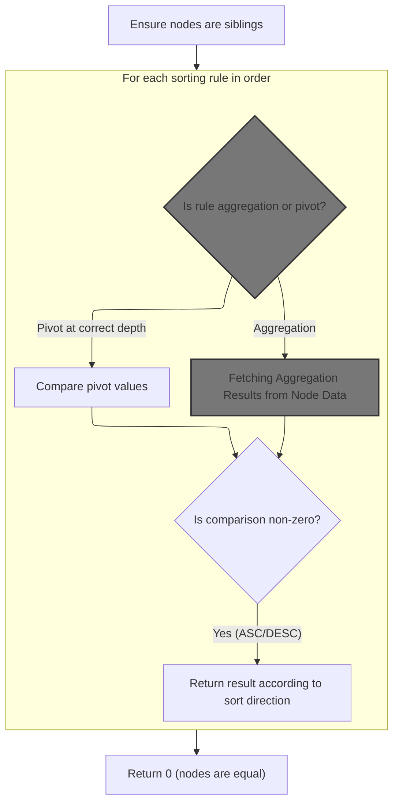
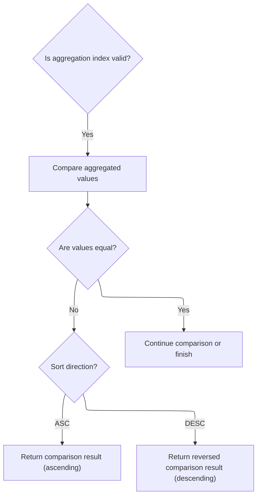
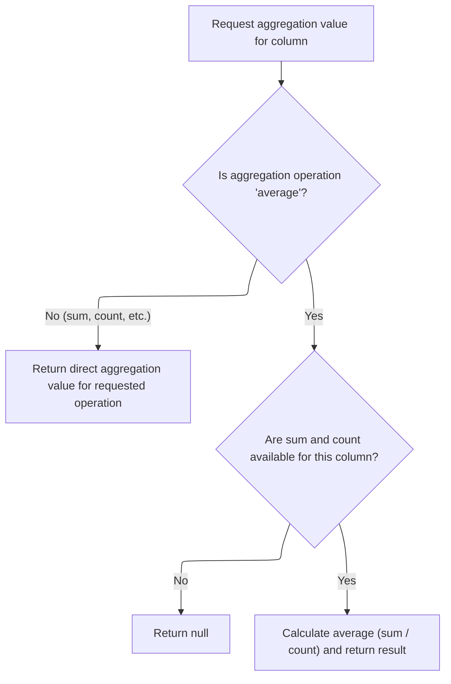
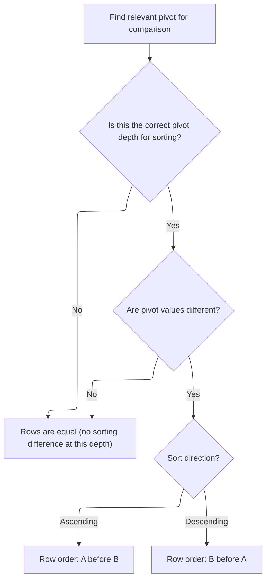

This document describes how pivot tree nodes are sorted to support flexible data analysis in pivot tables. Users define sorting criteria based on aggregations or pivot values, and the system organizes the tree accordingly. The process takes a tree of pivot nodes and a list of sorting rules as input, and outputs the tree with its nodes and children ordered to match the specified criteria.

# Where is this flow used?

This flow is used multiple times in the codebase as represented in the following diagram:

(Note - these are only some of the entry points of this flow)

```mermaid
graph TD;
      47a009bb28468bd248715ec917e8837b1a126907e2ff752f89d3e6e278078226(ui/…/bigtrace/index.ts::main) --> 9da801899ca38d8b30d5a1c08b2d8a45ef97466770974636e7d91ac9692e14f5(ui/…/bigtrace/index.ts::onCssLoaded)

9da801899ca38d8b30d5a1c08b2d8a45ef97466770974636e7d91ac9692e14f5(ui/…/bigtrace/index.ts::onCssLoaded) --> bcb3136f8c2769ddb3b898d48c8c7e94c357af6001422c1b3572767cbfa166c3(ui/…/core/live_reload.ts::initLiveReload)

bcb3136f8c2769ddb3b898d48c8c7e94c357af6001422c1b3572767cbfa166c3(ui/…/core/live_reload.ts::initLiveReload) --> 86d0c8b5778e01e050e23992f843689565bb570b65407735d0ce0cef9a43c46b(ui/…/core/live_reload.ts::reloadDelayed)

86d0c8b5778e01e050e23992f843689565bb570b65407735d0ce0cef9a43c46b(ui/…/core/live_reload.ts::reloadDelayed) --> f2f068ebd03171b95f2c531fc11bf1f7e889f42e356dadf92589de980517039f(ui/…/charts/sql_bar_chart.ts::SqlBarChartState.reload)

f2f068ebd03171b95f2c531fc11bf1f7e889f42e356dadf92589de980517039f(ui/…/charts/sql_bar_chart.ts::SqlBarChartState.reload) --> 0f9dd333cdfee53af6fd975f09655e112dd4e2ae29b49a0ccb9ee122b78fbd31(ui/…/pivot_table/pivot_tree_node.ts::PivotTreeNode.sort)

b4c2818110c9becae72a406b219827d5cd1cce3ffa6c181c814638285a7f3e94(ui/…/pivot_table/pivot_table.ts::PivotTable.view) --> 94383b6f3d149369ac3e68652c6b78881fab7cd0cb878c9e5e428dfa297dda6d(ui/…/pivot_table/pivot_table.ts::PivotTable.renderPivotColumnMenu)

b4c2818110c9becae72a406b219827d5cd1cce3ffa6c181c814638285a7f3e94(ui/…/pivot_table/pivot_table.ts::PivotTable.view) --> ab7c322bdbd6cbf6e0a76106b61af5375ab7b08fdb2b22e9386f12c76c3e4cb4(ui/…/pivot_table/pivot_table_state.ts::PivotTableState.sortByPivot)

b4c2818110c9becae72a406b219827d5cd1cce3ffa6c181c814638285a7f3e94(ui/…/pivot_table/pivot_table.ts::PivotTable.view) --> 33e09df866eda8c1fa72376dea2f27f5cf8aaf824f71ade9d230084d7c516375(ui/…/pivot_table/pivot_table.ts::PivotTable.renderAggregationColumnMenu)

b4c2818110c9becae72a406b219827d5cd1cce3ffa6c181c814638285a7f3e94(ui/…/pivot_table/pivot_table.ts::PivotTable.view) --> c28a474bdaa138df37d495425bced4e80b5edc9decf9110c6e1d22ed75fc3cca(ui/…/pivot_table/pivot_table_state.ts::PivotTableState.sortByAggregation)

b4c2818110c9becae72a406b219827d5cd1cce3ffa6c181c814638285a7f3e94(ui/…/pivot_table/pivot_table.ts::PivotTable.view) --> 03367d0796206e249841ba3507caf671eed1854aad798359cc2f9d36b910d9e2(ui/…/pivot_table/pivot_table_state.ts::PivotTableState.movePivot)

b4c2818110c9becae72a406b219827d5cd1cce3ffa6c181c814638285a7f3e94(ui/…/pivot_table/pivot_table.ts::PivotTable.view) --> 1900d3ef63d672527729ed5bde0b627f96e4beffdafccec8307b46a4521000fc(ui/…/pivot_table/pivot_table_state.ts::PivotTableState.moveAggregation)

94383b6f3d149369ac3e68652c6b78881fab7cd0cb878c9e5e428dfa297dda6d(ui/…/pivot_table/pivot_table.ts::PivotTable.renderPivotColumnMenu) --> ab7c322bdbd6cbf6e0a76106b61af5375ab7b08fdb2b22e9386f12c76c3e4cb4(ui/…/pivot_table/pivot_table_state.ts::PivotTableState.sortByPivot)

94383b6f3d149369ac3e68652c6b78881fab7cd0cb878c9e5e428dfa297dda6d(ui/…/pivot_table/pivot_table.ts::PivotTable.renderPivotColumnMenu) --> de1c1d83d0316e0b523ae167aaf20e2dd75d9e52ce59d939a2fe78759b6c2884(ui/…/pivot_table/pivot_table_state.ts::PivotTableState.removePivot)

94383b6f3d149369ac3e68652c6b78881fab7cd0cb878c9e5e428dfa297dda6d(ui/…/pivot_table/pivot_table.ts::PivotTable.renderPivotColumnMenu) --> 35d22bc6dec4e7e5495efde010610713c92dd45d11853c843d39d2d313fad9a9(ui/…/pivot_table/pivot_table_state.ts::PivotTableState.addPivot)

ab7c322bdbd6cbf6e0a76106b61af5375ab7b08fdb2b22e9386f12c76c3e4cb4(ui/…/pivot_table/pivot_table_state.ts::PivotTableState.sortByPivot) --> 0f9dd333cdfee53af6fd975f09655e112dd4e2ae29b49a0ccb9ee122b78fbd31(ui/…/pivot_table/pivot_tree_node.ts::PivotTreeNode.sort)

de1c1d83d0316e0b523ae167aaf20e2dd75d9e52ce59d939a2fe78759b6c2884(ui/…/pivot_table/pivot_table_state.ts::PivotTableState.removePivot) --> ab7c322bdbd6cbf6e0a76106b61af5375ab7b08fdb2b22e9386f12c76c3e4cb4(ui/…/pivot_table/pivot_table_state.ts::PivotTableState.sortByPivot)

de1c1d83d0316e0b523ae167aaf20e2dd75d9e52ce59d939a2fe78759b6c2884(ui/…/pivot_table/pivot_table_state.ts::PivotTableState.removePivot) --> bc63de45e9f34657637842cc5a890380c2fd4781bae253681f17b9004487227b(ui/…/pivot_table/pivot_table_state.ts::PivotTableState.reload)

bc63de45e9f34657637842cc5a890380c2fd4781bae253681f17b9004487227b(ui/…/pivot_table/pivot_table_state.ts::PivotTableState.reload) --> 0f9dd333cdfee53af6fd975f09655e112dd4e2ae29b49a0ccb9ee122b78fbd31(ui/…/pivot_table/pivot_tree_node.ts::PivotTreeNode.sort)

35d22bc6dec4e7e5495efde010610713c92dd45d11853c843d39d2d313fad9a9(ui/…/pivot_table/pivot_table_state.ts::PivotTableState.addPivot) --> bc63de45e9f34657637842cc5a890380c2fd4781bae253681f17b9004487227b(ui/…/pivot_table/pivot_table_state.ts::PivotTableState.reload)

33e09df866eda8c1fa72376dea2f27f5cf8aaf824f71ade9d230084d7c516375(ui/…/pivot_table/pivot_table.ts::PivotTable.renderAggregationColumnMenu) --> c28a474bdaa138df37d495425bced4e80b5edc9decf9110c6e1d22ed75fc3cca(ui/…/pivot_table/pivot_table_state.ts::PivotTableState.sortByAggregation)

33e09df866eda8c1fa72376dea2f27f5cf8aaf824f71ade9d230084d7c516375(ui/…/pivot_table/pivot_table.ts::PivotTable.renderAggregationColumnMenu) --> 9071e3a521fb8b4db4b6e92a5ddb65625e0483890d497be11d17e641a5f80b10(ui/…/pivot_table/pivot_table_state.ts::PivotTableState.removeAggregation)

33e09df866eda8c1fa72376dea2f27f5cf8aaf824f71ade9d230084d7c516375(ui/…/pivot_table/pivot_table.ts::PivotTable.renderAggregationColumnMenu) --> 869b30f09d58038cb5c9719cbf4a9ffa96eee13cb13229c3046183e8d7078794(ui/…/pivot_table/pivot_table_state.ts::PivotTableState.addAggregation)

33e09df866eda8c1fa72376dea2f27f5cf8aaf824f71ade9d230084d7c516375(ui/…/pivot_table/pivot_table.ts::PivotTable.renderAggregationColumnMenu) --> 98a63e5cc12e0b7151cd13fc0e96a9f70707f49157f880a305e0607b33b44946(ui/…/pivot_table/pivot_table_state.ts::PivotTableState.replaceAggregation)

c28a474bdaa138df37d495425bced4e80b5edc9decf9110c6e1d22ed75fc3cca(ui/…/pivot_table/pivot_table_state.ts::PivotTableState.sortByAggregation) --> 0f9dd333cdfee53af6fd975f09655e112dd4e2ae29b49a0ccb9ee122b78fbd31(ui/…/pivot_table/pivot_tree_node.ts::PivotTreeNode.sort)

9071e3a521fb8b4db4b6e92a5ddb65625e0483890d497be11d17e641a5f80b10(ui/…/pivot_table/pivot_table_state.ts::PivotTableState.removeAggregation) --> c28a474bdaa138df37d495425bced4e80b5edc9decf9110c6e1d22ed75fc3cca(ui/…/pivot_table/pivot_table_state.ts::PivotTableState.sortByAggregation)

9071e3a521fb8b4db4b6e92a5ddb65625e0483890d497be11d17e641a5f80b10(ui/…/pivot_table/pivot_table_state.ts::PivotTableState.removeAggregation) --> bc63de45e9f34657637842cc5a890380c2fd4781bae253681f17b9004487227b(ui/…/pivot_table/pivot_table_state.ts::PivotTableState.reload)

869b30f09d58038cb5c9719cbf4a9ffa96eee13cb13229c3046183e8d7078794(ui/…/pivot_table/pivot_table_state.ts::PivotTableState.addAggregation) --> bc63de45e9f34657637842cc5a890380c2fd4781bae253681f17b9004487227b(ui/…/pivot_table/pivot_table_state.ts::PivotTableState.reload)

98a63e5cc12e0b7151cd13fc0e96a9f70707f49157f880a305e0607b33b44946(ui/…/pivot_table/pivot_table_state.ts::PivotTableState.replaceAggregation) --> bc63de45e9f34657637842cc5a890380c2fd4781bae253681f17b9004487227b(ui/…/pivot_table/pivot_table_state.ts::PivotTableState.reload)

03367d0796206e249841ba3507caf671eed1854aad798359cc2f9d36b910d9e2(ui/…/pivot_table/pivot_table_state.ts::PivotTableState.movePivot) --> bc63de45e9f34657637842cc5a890380c2fd4781bae253681f17b9004487227b(ui/…/pivot_table/pivot_table_state.ts::PivotTableState.reload)

1900d3ef63d672527729ed5bde0b627f96e4beffdafccec8307b46a4521000fc(ui/…/pivot_table/pivot_table_state.ts::PivotTableState.moveAggregation) --> bc63de45e9f34657637842cc5a890380c2fd4781bae253681f17b9004487227b(ui/…/pivot_table/pivot_table_state.ts::PivotTableState.reload)

8a34b5d536a890f9a23aeec055956210e7222a96e85641ead723b412f294e85b(ui/…/bigtrace/index.ts::CoreCommands.onTraceLoad) --> f2f068ebd03171b95f2c531fc11bf1f7e889f42e356dadf92589de980517039f(ui/…/charts/sql_bar_chart.ts::SqlBarChartState.reload)

eb5d254d0b3b6d589105fabfe146f62af2eb2196eb3792f07ec1afb8acd158b3(ui/…/widgets/grid.ts::Grid.view) --> 33390d7e2e27c87d753440c48148346dc285e22e598e12568f6f2d915aed1483(ui/…/widgets/grid.ts::Grid.renderHeaderCell)

33390d7e2e27c87d753440c48148346dc285e22e598e12568f6f2d915aed1483(ui/…/widgets/grid.ts::Grid.renderHeaderCell) --> 5ef8fcde48af4636257fcb985b7bd3591f9a6f37ffdac0bd02276ef8fb4d7676(ui/…/pivot_table/pivot_table.ts::onColumnReorder)

5ef8fcde48af4636257fcb985b7bd3591f9a6f37ffdac0bd02276ef8fb4d7676(ui/…/pivot_table/pivot_table.ts::onColumnReorder) --> 03367d0796206e249841ba3507caf671eed1854aad798359cc2f9d36b910d9e2(ui/…/pivot_table/pivot_table_state.ts::PivotTableState.movePivot)

5ef8fcde48af4636257fcb985b7bd3591f9a6f37ffdac0bd02276ef8fb4d7676(ui/…/pivot_table/pivot_table.ts::onColumnReorder) --> 1900d3ef63d672527729ed5bde0b627f96e4beffdafccec8307b46a4521000fc(ui/…/pivot_table/pivot_table_state.ts::PivotTableState.moveAggregation)

0987f3781ab9f82bb6e721145427f9fa993534ba895cb8f4615251ebd99e436b(ui/…/menus/select_column_menu.ts::SelectColumnMenu.view) --> e0cd3e98e83d8306ef021ee57a8efca2ac959d8f66fa147b6062cae811370401(ui/…/menus/select_column_menu.ts::onColumnSelectedClickHandler)

0987f3781ab9f82bb6e721145427f9fa993534ba895cb8f4615251ebd99e436b(ui/…/menus/select_column_menu.ts::SelectColumnMenu.view) --> 099442ab02174fb54f15410bc09541ee6e3d73e0c9e160874c5a53f5360ceca6(ui/…/pivot_table/pivot_table.ts::columnMenu)

e0cd3e98e83d8306ef021ee57a8efca2ac959d8f66fa147b6062cae811370401(ui/…/menus/select_column_menu.ts::onColumnSelectedClickHandler) --> 5fde9da1cdd1850c36e9fdb8d3547328171c0bbf87cf968a764253f837fcec96(ui/…/pivot_table/pivot_table.ts::onColumnSelected)

5fde9da1cdd1850c36e9fdb8d3547328171c0bbf87cf968a764253f837fcec96(ui/…/pivot_table/pivot_table.ts::onColumnSelected) --> 35d22bc6dec4e7e5495efde010610713c92dd45d11853c843d39d2d313fad9a9(ui/…/pivot_table/pivot_table_state.ts::PivotTableState.addPivot)

099442ab02174fb54f15410bc09541ee6e3d73e0c9e160874c5a53f5360ceca6(ui/…/pivot_table/pivot_table.ts::columnMenu) --> 869b30f09d58038cb5c9719cbf4a9ffa96eee13cb13229c3046183e8d7078794(ui/…/pivot_table/pivot_table_state.ts::PivotTableState.addAggregation)


classDef mainFlowStyle color:#000000,fill:#7CB9F4
classDef rootsStyle color:#000000,fill:#00FFF4
classDef Style1 color:#000000,fill:#00FFAA
classDef Style2 color:#000000,fill:#FFFF00
classDef Style3 color:#000000,fill:#AA7CB9

%% Swimm:
%% graph TD;
%%       47a009bb28468bd248715ec917e8837b1a126907e2ff752f89d3e6e278078226(<SwmPath>[ui/…/bigtrace/index.ts](ui/src/bigtrace/index.ts)</SwmPath>::main) --> 9da801899ca38d8b30d5a1c08b2d8a45ef97466770974636e7d91ac9692e14f5(<SwmPath>[ui/…/bigtrace/index.ts](ui/src/bigtrace/index.ts)</SwmPath>::onCssLoaded)
%% 
%% 9da801899ca38d8b30d5a1c08b2d8a45ef97466770974636e7d91ac9692e14f5(<SwmPath>[ui/…/bigtrace/index.ts](ui/src/bigtrace/index.ts)</SwmPath>::onCssLoaded) --> bcb3136f8c2769ddb3b898d48c8c7e94c357af6001422c1b3572767cbfa166c3(<SwmPath>[ui/…/core/live_reload.ts](ui/src/core/live_reload.ts)</SwmPath>::initLiveReload)
%% 
%% bcb3136f8c2769ddb3b898d48c8c7e94c357af6001422c1b3572767cbfa166c3(<SwmPath>[ui/…/core/live_reload.ts](ui/src/core/live_reload.ts)</SwmPath>::initLiveReload) --> 86d0c8b5778e01e050e23992f843689565bb570b65407735d0ce0cef9a43c46b(<SwmPath>[ui/…/core/live_reload.ts](ui/src/core/live_reload.ts)</SwmPath>::reloadDelayed)
%% 
%% 86d0c8b5778e01e050e23992f843689565bb570b65407735d0ce0cef9a43c46b(<SwmPath>[ui/…/core/live_reload.ts](ui/src/core/live_reload.ts)</SwmPath>::reloadDelayed) --> f2f068ebd03171b95f2c531fc11bf1f7e889f42e356dadf92589de980517039f(<SwmPath>[ui/…/charts/sql_bar_chart.ts](ui/src/components/widgets/charts/sql_bar_chart.ts)</SwmPath>::SqlBarChartState.reload)
%% 
%% f2f068ebd03171b95f2c531fc11bf1f7e889f42e356dadf92589de980517039f(<SwmPath>[ui/…/charts/sql_bar_chart.ts](ui/src/components/widgets/charts/sql_bar_chart.ts)</SwmPath>::SqlBarChartState.reload) --> 0f9dd333cdfee53af6fd975f09655e112dd4e2ae29b49a0ccb9ee122b78fbd31(<SwmPath>[ui/…/pivot_table/pivot_tree_node.ts](ui/src/components/widgets/sql/pivot_table/pivot_tree_node.ts)</SwmPath>::PivotTreeNode.sort)
%% 
%% b4c2818110c9becae72a406b219827d5cd1cce3ffa6c181c814638285a7f3e94(<SwmPath>[ui/…/pivot_table/pivot_table.ts](ui/src/components/widgets/sql/pivot_table/pivot_table.ts)</SwmPath>::PivotTable.view) --> 94383b6f3d149369ac3e68652c6b78881fab7cd0cb878c9e5e428dfa297dda6d(<SwmPath>[ui/…/pivot_table/pivot_table.ts](ui/src/components/widgets/sql/pivot_table/pivot_table.ts)</SwmPath>::PivotTable.renderPivotColumnMenu)
%% 
%% b4c2818110c9becae72a406b219827d5cd1cce3ffa6c181c814638285a7f3e94(<SwmPath>[ui/…/pivot_table/pivot_table.ts](ui/src/components/widgets/sql/pivot_table/pivot_table.ts)</SwmPath>::PivotTable.view) --> ab7c322bdbd6cbf6e0a76106b61af5375ab7b08fdb2b22e9386f12c76c3e4cb4(<SwmPath>[ui/…/pivot_table/pivot_table_state.ts](ui/src/components/widgets/sql/pivot_table/pivot_table_state.ts)</SwmPath>::PivotTableState.sortByPivot)
%% 
%% b4c2818110c9becae72a406b219827d5cd1cce3ffa6c181c814638285a7f3e94(<SwmPath>[ui/…/pivot_table/pivot_table.ts](ui/src/components/widgets/sql/pivot_table/pivot_table.ts)</SwmPath>::PivotTable.view) --> 33e09df866eda8c1fa72376dea2f27f5cf8aaf824f71ade9d230084d7c516375(<SwmPath>[ui/…/pivot_table/pivot_table.ts](ui/src/components/widgets/sql/pivot_table/pivot_table.ts)</SwmPath>::PivotTable.renderAggregationColumnMenu)
%% 
%% b4c2818110c9becae72a406b219827d5cd1cce3ffa6c181c814638285a7f3e94(<SwmPath>[ui/…/pivot_table/pivot_table.ts](ui/src/components/widgets/sql/pivot_table/pivot_table.ts)</SwmPath>::PivotTable.view) --> c28a474bdaa138df37d495425bced4e80b5edc9decf9110c6e1d22ed75fc3cca(<SwmPath>[ui/…/pivot_table/pivot_table_state.ts](ui/src/components/widgets/sql/pivot_table/pivot_table_state.ts)</SwmPath>::PivotTableState.sortByAggregation)
%% 
%% b4c2818110c9becae72a406b219827d5cd1cce3ffa6c181c814638285a7f3e94(<SwmPath>[ui/…/pivot_table/pivot_table.ts](ui/src/components/widgets/sql/pivot_table/pivot_table.ts)</SwmPath>::PivotTable.view) --> 03367d0796206e249841ba3507caf671eed1854aad798359cc2f9d36b910d9e2(<SwmPath>[ui/…/pivot_table/pivot_table_state.ts](ui/src/components/widgets/sql/pivot_table/pivot_table_state.ts)</SwmPath>::PivotTableState.movePivot)
%% 
%% b4c2818110c9becae72a406b219827d5cd1cce3ffa6c181c814638285a7f3e94(<SwmPath>[ui/…/pivot_table/pivot_table.ts](ui/src/components/widgets/sql/pivot_table/pivot_table.ts)</SwmPath>::PivotTable.view) --> 1900d3ef63d672527729ed5bde0b627f96e4beffdafccec8307b46a4521000fc(<SwmPath>[ui/…/pivot_table/pivot_table_state.ts](ui/src/components/widgets/sql/pivot_table/pivot_table_state.ts)</SwmPath>::PivotTableState.moveAggregation)
%% 
%% 94383b6f3d149369ac3e68652c6b78881fab7cd0cb878c9e5e428dfa297dda6d(<SwmPath>[ui/…/pivot_table/pivot_table.ts](ui/src/components/widgets/sql/pivot_table/pivot_table.ts)</SwmPath>::PivotTable.renderPivotColumnMenu) --> ab7c322bdbd6cbf6e0a76106b61af5375ab7b08fdb2b22e9386f12c76c3e4cb4(<SwmPath>[ui/…/pivot_table/pivot_table_state.ts](ui/src/components/widgets/sql/pivot_table/pivot_table_state.ts)</SwmPath>::PivotTableState.sortByPivot)
%% 
%% 94383b6f3d149369ac3e68652c6b78881fab7cd0cb878c9e5e428dfa297dda6d(<SwmPath>[ui/…/pivot_table/pivot_table.ts](ui/src/components/widgets/sql/pivot_table/pivot_table.ts)</SwmPath>::PivotTable.renderPivotColumnMenu) --> de1c1d83d0316e0b523ae167aaf20e2dd75d9e52ce59d939a2fe78759b6c2884(<SwmPath>[ui/…/pivot_table/pivot_table_state.ts](ui/src/components/widgets/sql/pivot_table/pivot_table_state.ts)</SwmPath>::PivotTableState.removePivot)
%% 
%% 94383b6f3d149369ac3e68652c6b78881fab7cd0cb878c9e5e428dfa297dda6d(<SwmPath>[ui/…/pivot_table/pivot_table.ts](ui/src/components/widgets/sql/pivot_table/pivot_table.ts)</SwmPath>::PivotTable.renderPivotColumnMenu) --> 35d22bc6dec4e7e5495efde010610713c92dd45d11853c843d39d2d313fad9a9(<SwmPath>[ui/…/pivot_table/pivot_table_state.ts](ui/src/components/widgets/sql/pivot_table/pivot_table_state.ts)</SwmPath>::PivotTableState.addPivot)
%% 
%% ab7c322bdbd6cbf6e0a76106b61af5375ab7b08fdb2b22e9386f12c76c3e4cb4(<SwmPath>[ui/…/pivot_table/pivot_table_state.ts](ui/src/components/widgets/sql/pivot_table/pivot_table_state.ts)</SwmPath>::PivotTableState.sortByPivot) --> 0f9dd333cdfee53af6fd975f09655e112dd4e2ae29b49a0ccb9ee122b78fbd31(<SwmPath>[ui/…/pivot_table/pivot_tree_node.ts](ui/src/components/widgets/sql/pivot_table/pivot_tree_node.ts)</SwmPath>::PivotTreeNode.sort)
%% 
%% de1c1d83d0316e0b523ae167aaf20e2dd75d9e52ce59d939a2fe78759b6c2884(<SwmPath>[ui/…/pivot_table/pivot_table_state.ts](ui/src/components/widgets/sql/pivot_table/pivot_table_state.ts)</SwmPath>::PivotTableState.removePivot) --> ab7c322bdbd6cbf6e0a76106b61af5375ab7b08fdb2b22e9386f12c76c3e4cb4(<SwmPath>[ui/…/pivot_table/pivot_table_state.ts](ui/src/components/widgets/sql/pivot_table/pivot_table_state.ts)</SwmPath>::PivotTableState.sortByPivot)
%% 
%% de1c1d83d0316e0b523ae167aaf20e2dd75d9e52ce59d939a2fe78759b6c2884(<SwmPath>[ui/…/pivot_table/pivot_table_state.ts](ui/src/components/widgets/sql/pivot_table/pivot_table_state.ts)</SwmPath>::PivotTableState.removePivot) --> bc63de45e9f34657637842cc5a890380c2fd4781bae253681f17b9004487227b(<SwmPath>[ui/…/pivot_table/pivot_table_state.ts](ui/src/components/widgets/sql/pivot_table/pivot_table_state.ts)</SwmPath>::PivotTableState.reload)
%% 
%% bc63de45e9f34657637842cc5a890380c2fd4781bae253681f17b9004487227b(<SwmPath>[ui/…/pivot_table/pivot_table_state.ts](ui/src/components/widgets/sql/pivot_table/pivot_table_state.ts)</SwmPath>::PivotTableState.reload) --> 0f9dd333cdfee53af6fd975f09655e112dd4e2ae29b49a0ccb9ee122b78fbd31(<SwmPath>[ui/…/pivot_table/pivot_tree_node.ts](ui/src/components/widgets/sql/pivot_table/pivot_tree_node.ts)</SwmPath>::PivotTreeNode.sort)
%% 
%% 35d22bc6dec4e7e5495efde010610713c92dd45d11853c843d39d2d313fad9a9(<SwmPath>[ui/…/pivot_table/pivot_table_state.ts](ui/src/components/widgets/sql/pivot_table/pivot_table_state.ts)</SwmPath>::PivotTableState.addPivot) --> bc63de45e9f34657637842cc5a890380c2fd4781bae253681f17b9004487227b(<SwmPath>[ui/…/pivot_table/pivot_table_state.ts](ui/src/components/widgets/sql/pivot_table/pivot_table_state.ts)</SwmPath>::PivotTableState.reload)
%% 
%% 33e09df866eda8c1fa72376dea2f27f5cf8aaf824f71ade9d230084d7c516375(<SwmPath>[ui/…/pivot_table/pivot_table.ts](ui/src/components/widgets/sql/pivot_table/pivot_table.ts)</SwmPath>::PivotTable.renderAggregationColumnMenu) --> c28a474bdaa138df37d495425bced4e80b5edc9decf9110c6e1d22ed75fc3cca(<SwmPath>[ui/…/pivot_table/pivot_table_state.ts](ui/src/components/widgets/sql/pivot_table/pivot_table_state.ts)</SwmPath>::PivotTableState.sortByAggregation)
%% 
%% 33e09df866eda8c1fa72376dea2f27f5cf8aaf824f71ade9d230084d7c516375(<SwmPath>[ui/…/pivot_table/pivot_table.ts](ui/src/components/widgets/sql/pivot_table/pivot_table.ts)</SwmPath>::PivotTable.renderAggregationColumnMenu) --> 9071e3a521fb8b4db4b6e92a5ddb65625e0483890d497be11d17e641a5f80b10(<SwmPath>[ui/…/pivot_table/pivot_table_state.ts](ui/src/components/widgets/sql/pivot_table/pivot_table_state.ts)</SwmPath>::PivotTableState.removeAggregation)
%% 
%% 33e09df866eda8c1fa72376dea2f27f5cf8aaf824f71ade9d230084d7c516375(<SwmPath>[ui/…/pivot_table/pivot_table.ts](ui/src/components/widgets/sql/pivot_table/pivot_table.ts)</SwmPath>::PivotTable.renderAggregationColumnMenu) --> 869b30f09d58038cb5c9719cbf4a9ffa96eee13cb13229c3046183e8d7078794(<SwmPath>[ui/…/pivot_table/pivot_table_state.ts](ui/src/components/widgets/sql/pivot_table/pivot_table_state.ts)</SwmPath>::PivotTableState.addAggregation)
%% 
%% 33e09df866eda8c1fa72376dea2f27f5cf8aaf824f71ade9d230084d7c516375(<SwmPath>[ui/…/pivot_table/pivot_table.ts](ui/src/components/widgets/sql/pivot_table/pivot_table.ts)</SwmPath>::PivotTable.renderAggregationColumnMenu) --> 98a63e5cc12e0b7151cd13fc0e96a9f70707f49157f880a305e0607b33b44946(<SwmPath>[ui/…/pivot_table/pivot_table_state.ts](ui/src/components/widgets/sql/pivot_table/pivot_table_state.ts)</SwmPath>::PivotTableState.replaceAggregation)
%% 
%% c28a474bdaa138df37d495425bced4e80b5edc9decf9110c6e1d22ed75fc3cca(<SwmPath>[ui/…/pivot_table/pivot_table_state.ts](ui/src/components/widgets/sql/pivot_table/pivot_table_state.ts)</SwmPath>::PivotTableState.sortByAggregation) --> 0f9dd333cdfee53af6fd975f09655e112dd4e2ae29b49a0ccb9ee122b78fbd31(<SwmPath>[ui/…/pivot_table/pivot_tree_node.ts](ui/src/components/widgets/sql/pivot_table/pivot_tree_node.ts)</SwmPath>::PivotTreeNode.sort)
%% 
%% 9071e3a521fb8b4db4b6e92a5ddb65625e0483890d497be11d17e641a5f80b10(<SwmPath>[ui/…/pivot_table/pivot_table_state.ts](ui/src/components/widgets/sql/pivot_table/pivot_table_state.ts)</SwmPath>::PivotTableState.removeAggregation) --> c28a474bdaa138df37d495425bced4e80b5edc9decf9110c6e1d22ed75fc3cca(<SwmPath>[ui/…/pivot_table/pivot_table_state.ts](ui/src/components/widgets/sql/pivot_table/pivot_table_state.ts)</SwmPath>::PivotTableState.sortByAggregation)
%% 
%% 9071e3a521fb8b4db4b6e92a5ddb65625e0483890d497be11d17e641a5f80b10(<SwmPath>[ui/…/pivot_table/pivot_table_state.ts](ui/src/components/widgets/sql/pivot_table/pivot_table_state.ts)</SwmPath>::PivotTableState.removeAggregation) --> bc63de45e9f34657637842cc5a890380c2fd4781bae253681f17b9004487227b(<SwmPath>[ui/…/pivot_table/pivot_table_state.ts](ui/src/components/widgets/sql/pivot_table/pivot_table_state.ts)</SwmPath>::PivotTableState.reload)
%% 
%% 869b30f09d58038cb5c9719cbf4a9ffa96eee13cb13229c3046183e8d7078794(<SwmPath>[ui/…/pivot_table/pivot_table_state.ts](ui/src/components/widgets/sql/pivot_table/pivot_table_state.ts)</SwmPath>::PivotTableState.addAggregation) --> bc63de45e9f34657637842cc5a890380c2fd4781bae253681f17b9004487227b(<SwmPath>[ui/…/pivot_table/pivot_table_state.ts](ui/src/components/widgets/sql/pivot_table/pivot_table_state.ts)</SwmPath>::PivotTableState.reload)
%% 
%% 98a63e5cc12e0b7151cd13fc0e96a9f70707f49157f880a305e0607b33b44946(<SwmPath>[ui/…/pivot_table/pivot_table_state.ts](ui/src/components/widgets/sql/pivot_table/pivot_table_state.ts)</SwmPath>::PivotTableState.replaceAggregation) --> bc63de45e9f34657637842cc5a890380c2fd4781bae253681f17b9004487227b(<SwmPath>[ui/…/pivot_table/pivot_table_state.ts](ui/src/components/widgets/sql/pivot_table/pivot_table_state.ts)</SwmPath>::PivotTableState.reload)
%% 
%% 03367d0796206e249841ba3507caf671eed1854aad798359cc2f9d36b910d9e2(<SwmPath>[ui/…/pivot_table/pivot_table_state.ts](ui/src/components/widgets/sql/pivot_table/pivot_table_state.ts)</SwmPath>::PivotTableState.movePivot) --> bc63de45e9f34657637842cc5a890380c2fd4781bae253681f17b9004487227b(<SwmPath>[ui/…/pivot_table/pivot_table_state.ts](ui/src/components/widgets/sql/pivot_table/pivot_table_state.ts)</SwmPath>::PivotTableState.reload)
%% 
%% 1900d3ef63d672527729ed5bde0b627f96e4beffdafccec8307b46a4521000fc(<SwmPath>[ui/…/pivot_table/pivot_table_state.ts](ui/src/components/widgets/sql/pivot_table/pivot_table_state.ts)</SwmPath>::PivotTableState.moveAggregation) --> bc63de45e9f34657637842cc5a890380c2fd4781bae253681f17b9004487227b(<SwmPath>[ui/…/pivot_table/pivot_table_state.ts](ui/src/components/widgets/sql/pivot_table/pivot_table_state.ts)</SwmPath>::PivotTableState.reload)
%% 
%% 8a34b5d536a890f9a23aeec055956210e7222a96e85641ead723b412f294e85b(<SwmPath>[ui/…/bigtrace/index.ts](ui/src/bigtrace/index.ts)</SwmPath>::CoreCommands.onTraceLoad) --> f2f068ebd03171b95f2c531fc11bf1f7e889f42e356dadf92589de980517039f(<SwmPath>[ui/…/charts/sql_bar_chart.ts](ui/src/components/widgets/charts/sql_bar_chart.ts)</SwmPath>::SqlBarChartState.reload)
%% 
%% eb5d254d0b3b6d589105fabfe146f62af2eb2196eb3792f07ec1afb8acd158b3(<SwmPath>[ui/…/widgets/grid.ts](ui/src/widgets/grid.ts)</SwmPath>::Grid.view) --> 33390d7e2e27c87d753440c48148346dc285e22e598e12568f6f2d915aed1483(<SwmPath>[ui/…/widgets/grid.ts](ui/src/widgets/grid.ts)</SwmPath>::Grid.renderHeaderCell)
%% 
%% 33390d7e2e27c87d753440c48148346dc285e22e598e12568f6f2d915aed1483(<SwmPath>[ui/…/widgets/grid.ts](ui/src/widgets/grid.ts)</SwmPath>::Grid.renderHeaderCell) --> 5ef8fcde48af4636257fcb985b7bd3591f9a6f37ffdac0bd02276ef8fb4d7676(<SwmPath>[ui/…/pivot_table/pivot_table.ts](ui/src/components/widgets/sql/pivot_table/pivot_table.ts)</SwmPath>::onColumnReorder)
%% 
%% 5ef8fcde48af4636257fcb985b7bd3591f9a6f37ffdac0bd02276ef8fb4d7676(<SwmPath>[ui/…/pivot_table/pivot_table.ts](ui/src/components/widgets/sql/pivot_table/pivot_table.ts)</SwmPath>::onColumnReorder) --> 03367d0796206e249841ba3507caf671eed1854aad798359cc2f9d36b910d9e2(<SwmPath>[ui/…/pivot_table/pivot_table_state.ts](ui/src/components/widgets/sql/pivot_table/pivot_table_state.ts)</SwmPath>::PivotTableState.movePivot)
%% 
%% 5ef8fcde48af4636257fcb985b7bd3591f9a6f37ffdac0bd02276ef8fb4d7676(<SwmPath>[ui/…/pivot_table/pivot_table.ts](ui/src/components/widgets/sql/pivot_table/pivot_table.ts)</SwmPath>::onColumnReorder) --> 1900d3ef63d672527729ed5bde0b627f96e4beffdafccec8307b46a4521000fc(<SwmPath>[ui/…/pivot_table/pivot_table_state.ts](ui/src/components/widgets/sql/pivot_table/pivot_table_state.ts)</SwmPath>::PivotTableState.moveAggregation)
%% 
%% 0987f3781ab9f82bb6e721145427f9fa993534ba895cb8f4615251ebd99e436b(<SwmPath>[ui/…/menus/select_column_menu.ts](ui/src/components/widgets/sql/table/menus/select_column_menu.ts)</SwmPath>::SelectColumnMenu.view) --> e0cd3e98e83d8306ef021ee57a8efca2ac959d8f66fa147b6062cae811370401(<SwmPath>[ui/…/menus/select_column_menu.ts](ui/src/components/widgets/sql/table/menus/select_column_menu.ts)</SwmPath>::onColumnSelectedClickHandler)
%% 
%% 0987f3781ab9f82bb6e721145427f9fa993534ba895cb8f4615251ebd99e436b(<SwmPath>[ui/…/menus/select_column_menu.ts](ui/src/components/widgets/sql/table/menus/select_column_menu.ts)</SwmPath>::SelectColumnMenu.view) --> 099442ab02174fb54f15410bc09541ee6e3d73e0c9e160874c5a53f5360ceca6(<SwmPath>[ui/…/pivot_table/pivot_table.ts](ui/src/components/widgets/sql/pivot_table/pivot_table.ts)</SwmPath>::columnMenu)
%% 
%% e0cd3e98e83d8306ef021ee57a8efca2ac959d8f66fa147b6062cae811370401(<SwmPath>[ui/…/menus/select_column_menu.ts](ui/src/components/widgets/sql/table/menus/select_column_menu.ts)</SwmPath>::onColumnSelectedClickHandler) --> 5fde9da1cdd1850c36e9fdb8d3547328171c0bbf87cf968a764253f837fcec96(<SwmPath>[ui/…/pivot_table/pivot_table.ts](ui/src/components/widgets/sql/pivot_table/pivot_table.ts)</SwmPath>::onColumnSelected)
%% 
%% 5fde9da1cdd1850c36e9fdb8d3547328171c0bbf87cf968a764253f837fcec96(<SwmPath>[ui/…/pivot_table/pivot_table.ts](ui/src/components/widgets/sql/pivot_table/pivot_table.ts)</SwmPath>::onColumnSelected) --> 35d22bc6dec4e7e5495efde010610713c92dd45d11853c843d39d2d313fad9a9(<SwmPath>[ui/…/pivot_table/pivot_table_state.ts](ui/src/components/widgets/sql/pivot_table/pivot_table_state.ts)</SwmPath>::PivotTableState.addPivot)
%% 
%% 099442ab02174fb54f15410bc09541ee6e3d73e0c9e160874c5a53f5360ceca6(<SwmPath>[ui/…/pivot_table/pivot_table.ts](ui/src/components/widgets/sql/pivot_table/pivot_table.ts)</SwmPath>::columnMenu) --> 869b30f09d58038cb5c9719cbf4a9ffa96eee13cb13229c3046183e8d7078794(<SwmPath>[ui/…/pivot_table/pivot_table_state.ts](ui/src/components/widgets/sql/pivot_table/pivot_table_state.ts)</SwmPath>::PivotTableState.addAggregation)
%% 
%% 
%% classDef mainFlowStyle color:#000000,fill:#7CB9F4
%% classDef rootsStyle color:#000000,fill:#00FFF4
%% classDef Style1 color:#000000,fill:#00FFAA
%% classDef Style2 color:#000000,fill:#FFFF00
%% classDef Style3 color:#000000,fill:#AA7CB9
```

# Recursively Sorting Pivot Tree Nodes

<SwmSnippet path="/ui/src/components/widgets/sql/pivot_table/pivot_tree_node.ts" line="203">

---

In <SwmToken path="ui/src/components/widgets/sql/pivot_table/pivot_tree_node.ts" pos="203:1:1" line-data="  sort(order: SortOrder) {">`sort`</SwmToken>, we start by recursively sorting all child nodes to make sure the whole tree is ordered before we sort the current node's children.

```typescript
  sort(order: SortOrder) {
    if (order.length === 0) return;

    for (const child of this.children.values()) {
      child.sort(order);
    }
```

---

</SwmSnippet>

<SwmSnippet path="/ui/src/components/widgets/sql/pivot_table/pivot_tree_node.ts" line="209">

---

Here we build a sorted array of children using a custom compare function. This lets us sort nodes by multiple criteria, not just simple values.

```typescript
    const sorted = [...this.children.values()].sort((lhs, rhs) =>
      PivotTreeNode.compare(lhs, rhs, order),
    );
```

---

</SwmSnippet>

## Comparing Sibling Nodes by Sort Criteria



<SwmSnippet path="/ui/src/components/widgets/sql/pivot_table/pivot_tree_node.ts" line="288">

---

In <SwmToken path="ui/src/components/widgets/sql/pivot_table/pivot_tree_node.ts" pos="288:5:5" line-data="  private static compare(">`compare`</SwmToken>, we make sure we're only comparing sibling nodes by asserting their config, depth, and parent match. Then we loop through the sort criteria, using ids to find the right aggregation or pivot index for each comparison. The helper handles nulls as smallest values.

```typescript
  private static compare(
    lhs: PivotTreeNode,
    rhs: PivotTreeNode,
    order: SortOrder,
  ): number {
    // Note: resolving items in `order` requires a lookup in the state. We can consider
    // optimising this and performing the lookup in `sort` instead.

    // We should only compare siblings.
    assertTrue(
      lhs.config === rhs.config &&
        lhs.depth === rhs.depth &&
        lhs.parent === rhs.parent,
    );

    const compareSqlValues = (lhs: SqlValue, rhs: SqlValue) => {
      if (lhs === rhs) return 0;
      // Nulls can't be compared, but should be considered the smallest value.
      if (lhs === null) return -1;
      if (rhs === null) return 1;
      return lhs < rhs ? -1 : 1;
    };
    for (const {type, id, direction} of order) {
      if (type === 'aggregation') {
        const index = lhs.config.aggregations.findIndex(
          (a) => aggregationId(a) === id,
        );
```

---

</SwmSnippet>

### Generating Aggregation Keys for Lookups

<SwmSnippet path="/ui/src/components/widgets/sql/pivot_table/ids.ts" line="25">

---

<SwmToken path="ui/src/components/widgets/sql/pivot_table/ids.ts" pos="25:4:4" line-data="export function aggregationId(a: Aggregation): string {">`aggregationId`</SwmToken> builds a key for each aggregation. For count, it's just 'count'. For others, it uses <SwmToken path="ui/src/components/widgets/sql/pivot_table/ids.ts" pos="28:12:12" line-data="  return `${a.op}(${sqlColumnId(a.column.column)})`;">`sqlColumnId`</SwmToken> to include the column info in the key.

```typescript
export function aggregationId(a: Aggregation): string {
  // Count doesn't require a column.
  if (a.op === 'count') return 'count';
  return `${a.op}(${sqlColumnId(a.column.column)})`;
}
```

---

</SwmSnippet>

<SwmSnippet path="/ui/src/components/widgets/sql/table/sql_column.ts" line="58">

---

<SwmToken path="ui/src/components/widgets/sql/table/sql_column.ts" pos="58:4:4" line-data="export function sqlColumnId(column: SqlColumn): string {">`sqlColumnId`</SwmToken> generates IDs for columns by handling strings, expressions, and join objects differently. It uses recursion for nested columns and applies repo-specific formatting for joins.

```typescript
export function sqlColumnId(column: SqlColumn): string {
  // For table columns, use the column name as an id.
  if (typeof column === 'string') {
    return column;
  }
  // For expressions, use the specified id, or plug the ids of the columns into the expression.
  if (column instanceof SqlExpression) {
    if (column.id !== undefined) return column.id;
    return `${column.op(column.columns.map(sqlColumnId))}`;
  }
  if (column.id !== undefined) {
    return column.id;
  }
  // Special case: If the join is performed on a single column `id`, we can use a simpler representation (i.e. `table[id].column`).
  if (arrayEquals(Object.keys(column.source.joinOn), ['id'])) {
    return `${column.source.table}[${sqlColumnId(Object.values(column.source.joinOn)[0])}].${column.column}`;
  }
  // Otherwise, we need to list all the join constraints.
  const lookup = Object.entries(column.source.joinOn)
    .map(([key, value]): string => {
      const valueStr = sqlColumnId(value);
      if (key === valueStr) return key;
      return `${key}=${sqlColumnId(value)}`;
    })
    .join(', ');
  return `${column.source.table}[${lookup}].${column.column}`;
}
```

---

</SwmSnippet>

### Comparing Aggregation Values



<SwmSnippet path="/ui/src/components/widgets/sql/pivot_table/pivot_tree_node.ts" line="315">

---

Back in <SwmToken path="ui/src/components/widgets/sql/pivot_table/pivot_tree_node.ts" pos="210:3:3" line-data="      PivotTreeNode.compare(lhs, rhs, order),">`compare`</SwmToken>, after getting the aggregation index, we assert it's valid and then use <SwmToken path="ui/src/components/widgets/sql/pivot_table/pivot_tree_node.ts" pos="320:3:3" line-data="          lhs.getAggregationValue(index),">`getAggregationValue`</SwmToken> to fetch the values for comparison. This lets us sort nodes by their aggregation results.

```typescript
        // Aggregation with this index should always exist.
        // If this is not the case, we probably failed to remove sorting after
        // hiding a column.
        assertTrue(index !== -1);
        const cmp = compareSqlValues(
          lhs.getAggregationValue(index),
          rhs.getAggregationValue(index),
        );
        if (cmp !== 0) return direction === 'ASC' ? cmp : -cmp;
      } else {
```

---

</SwmSnippet>

### Fetching Aggregation Results from Node Data



<SwmSnippet path="/ui/src/components/widgets/sql/pivot_table/pivot_tree_node.ts" line="182">

---

<SwmToken path="ui/src/components/widgets/sql/pivot_table/pivot_tree_node.ts" pos="182:1:1" line-data="  getAggregationValue(index: number): SqlValue {">`getAggregationValue`</SwmToken> just passes the aggregation config and values to <SwmToken path="ui/src/components/widgets/sql/pivot_table/pivot_tree_node.ts" pos="183:3:3" line-data="    return getAggregationValueImpl(">`getAggregationValueImpl`</SwmToken>, which does the actual extraction. This keeps the node method lean.

```typescript
  getAggregationValue(index: number): SqlValue {
    return getAggregationValueImpl(
      this.config.aggregations[index],
      this.aggregationValues,
    );
  }
```

---

</SwmSnippet>

<SwmSnippet path="/ui/src/components/widgets/sql/pivot_table/aggregations.ts" line="109">

---

<SwmToken path="ui/src/components/widgets/sql/pivot_table/pivot_tree_node.ts" pos="183:3:3" line-data="    return getAggregationValueImpl(">`getAggregationValueImpl`</SwmToken> fetches the value for an aggregation. For average, it grabs sum and count from the row using <SwmToken path="ui/src/components/widgets/sql/pivot_table/aggregations.ts" pos="111:5:5" line-data="    return row[aggregationId(agg)];">`aggregationId`</SwmToken>, then divides them. For others, it just looks up the value by key.

```typescript
export function getAggregationValue(agg: Aggregation, row: Row): SqlValue {
  if (agg.op !== 'average') {
    return row[aggregationId(agg)];
  }
  const sum = sqlValueAsNumber(
    row[aggregationId({op: 'sum', column: agg.column})],
  );
  const count = sqlValueAsNumber(
    row[aggregationId({op: 'count', column: agg.column})],
  );
  if (sum === null || count === null) return null;
  return sum / count;
}
```

---

</SwmSnippet>

### Comparing Pivot Values



<SwmSnippet path="/ui/src/components/widgets/sql/pivot_table/pivot_tree_node.ts" line="325">

---

Back in <SwmToken path="ui/src/components/widgets/sql/pivot_table/pivot_tree_node.ts" pos="210:3:3" line-data="      PivotTreeNode.compare(lhs, rhs, order),">`compare`</SwmToken>, after handling aggregations, we use <SwmToken path="ui/src/components/widgets/sql/pivot_table/pivot_tree_node.ts" pos="325:21:21" line-data="        const index = lhs.config.pivots.findIndex((p) =&gt; pivotId(p) === id);">`pivotId`</SwmToken> to find the right pivot index. This lets us compare pivot values at the current depth for sorting.

```typescript
        const index = lhs.config.pivots.findIndex((p) => pivotId(p) === id);
```

---

</SwmSnippet>

<SwmSnippet path="/ui/src/components/widgets/sql/pivot_table/ids.ts" line="20">

---

<SwmToken path="ui/src/components/widgets/sql/pivot_table/ids.ts" pos="20:4:4" line-data="export function pivotId(p: TableColumn): string {">`pivotId`</SwmToken> just calls <SwmToken path="ui/src/components/widgets/sql/pivot_table/ids.ts" pos="21:3:3" line-data="  return sqlColumnId(p.column);">`sqlColumnId`</SwmToken> on the pivot column to get a unique key for lookups and comparisons.

```typescript
export function pivotId(p: TableColumn): string {
  return sqlColumnId(p.column);
}
```

---

</SwmSnippet>

<SwmSnippet path="/ui/src/components/widgets/sql/pivot_table/pivot_tree_node.ts" line="326">

---

After getting the pivot index from <SwmToken path="ui/src/components/widgets/sql/pivot_table/pivot_tree_node.ts" pos="325:21:21" line-data="        const index = lhs.config.pivots.findIndex((p) =&gt; pivotId(p) === id);">`pivotId`</SwmToken>, we compare pivot values at the current depth. If all criteria match, we return 0, meaning the nodes are equal for sorting.

```typescript
        // Pivot with this index should always exist.
        // If this is not the case, we probably failed to remove sorting after
        // hiding a column.
        assertTrue(index !== -1);
        // For pivot sorting, we only compare the pivot values at the given depth.
        if (index + 1 === lhs.depth) {
          const cmp = compareSqlValues(
            assertDefined(lhs.pivotValue),
            assertDefined(rhs.pivotValue),
          );
          if (cmp !== 0) return direction === 'ASC' ? cmp : -cmp;
        }
      }
    }
    return 0;
  }
```

---

</SwmSnippet>

## Updating Children After Sorting

<SwmSnippet path="/ui/src/components/widgets/sql/pivot_table/pivot_tree_node.ts" line="212">

---

After sorting with <SwmToken path="ui/src/components/widgets/sql/pivot_table/pivot_tree_node.ts" pos="210:3:3" line-data="      PivotTreeNode.compare(lhs, rhs, order),">`compare`</SwmToken>, we clear the children map and repopulate it in sorted order, using each child's <SwmToken path="ui/src/components/widgets/sql/pivot_table/pivot_tree_node.ts" pos="214:11:11" line-data="      this.children.set(assertDefined(child.pivotValue), child);">`pivotValue`</SwmToken> as the key.

```typescript
    this.children.clear();
    for (const child of sorted) {
      this.children.set(assertDefined(child.pivotValue), child);
    }
```

---

</SwmSnippet>

&nbsp;

*This is an auto-generated document by Swimm 🌊 and has not yet been verified by a human*

<SwmMeta version="3.0.0" repo-id="Z2l0aHViJTNBJTNBY3BsdXNwbHVzLXBlcmZldHRvJTNBJTNBcmljYXJkb2xvcGV6Zw==" repo-name="cplusplus-perfetto"><sup>Powered by [Swimm](https://app.swimm.io/)</sup></SwmMeta>
