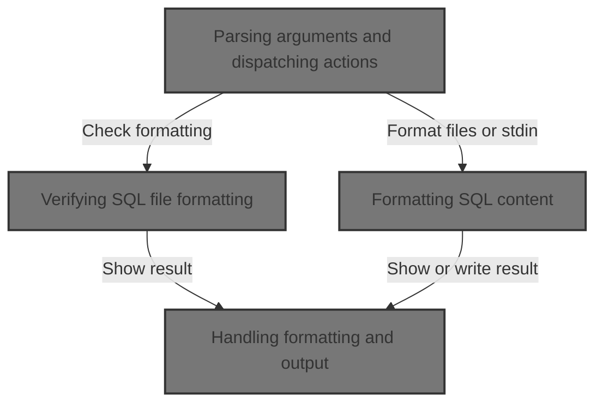
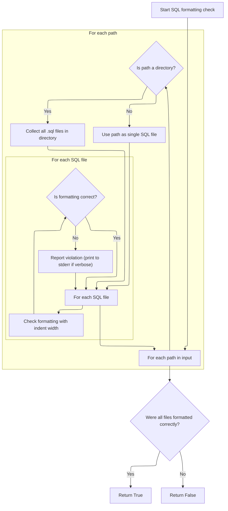
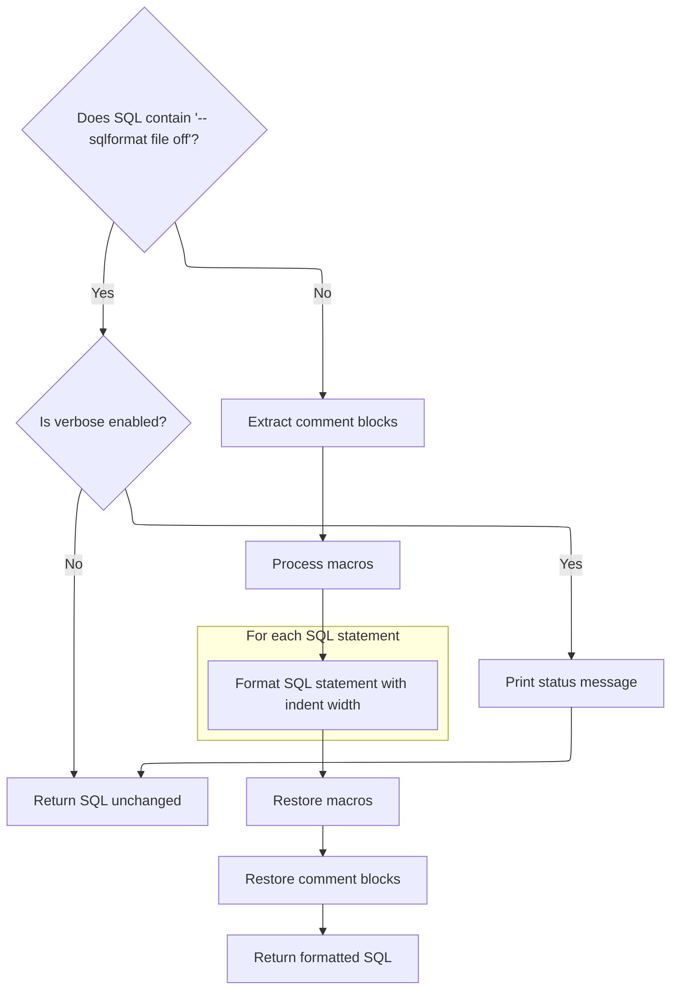
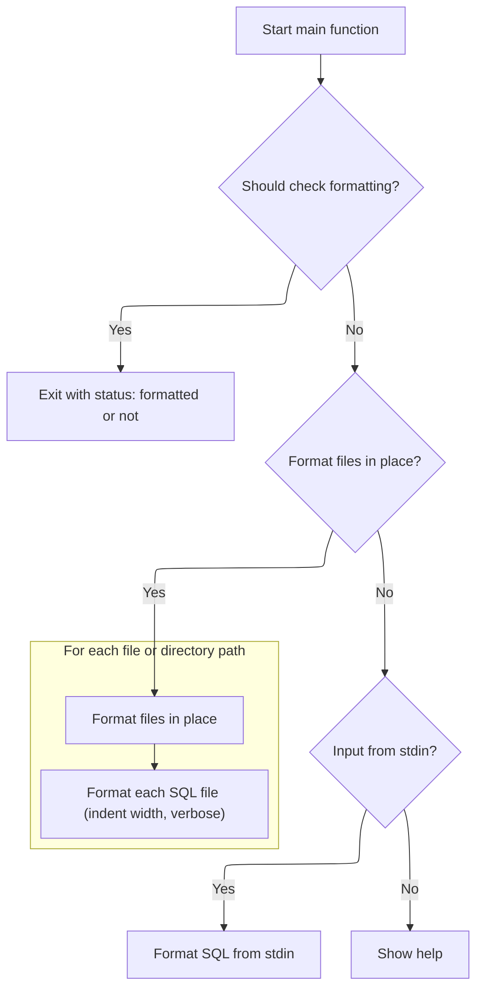

This document explains how users can check and enforce consistent SQL formatting. Users may provide SQL files, directories, or direct SQL input. Depending on the selected option, the system will verify formatting compliance, update files to match formatting rules, or format ad-hoc SQL content and print the result.



# Parsing arguments and dispatching actions

<SwmSnippet path="/python/tools/format_sql.py" line="648">

---

In <SwmToken path="python/tools/format_sql.py" pos="648:2:2" line-data="def main() -&gt; None:">`main`</SwmToken>, we parse CLI arguments to figure out what the user wants (check formatting, format in place, or read from stdin). If <SwmToken path="python/tools/format_sql.py" pos="664:3:5" line-data="      &#39;--check-only&#39;,">`check-only`</SwmToken> is set, we call <SwmToken path="python/tools/format_sql.py" pos="674:5:5" line-data="    properly_formatted = check_sql_formatting(args.paths, args.indent_width,">`check_sql_formatting`</SwmToken> to verify if the SQL files match the formatting rules. This lets us decide early if we need to exit or proceed to formatting.

```python
def main() -> None:
  """Main entry point."""
  parser = argparse.ArgumentParser(
      description='Format SQL queries with consistent style')
  parser.add_argument(
      'paths',
      nargs='*',
      help='Paths to SQL files or directories containing SQL files')
  parser.add_argument(
      '--indent-width',
      type=int,
      default=2,
      help='Number of spaces for indentation (default: 2)')
  parser.add_argument(
      '--in-place', action='store_true', help='Format files in place')
  parser.add_argument(
      '--check-only',
      action='store_true',
      help='Check for formatting violations without making changes')
  parser.add_argument(
      '--verbose',
      action='store_true',
      help='Print status messages during execution')
  args = parser.parse_args()

  if args.check_only:
    properly_formatted = check_sql_formatting(args.paths, args.indent_width,
                                              args.verbose)
```

---

</SwmSnippet>

## Verifying SQL file formatting



<SwmSnippet path="/python/tools/format_sql.py" line="616">

---

<SwmToken path="python/tools/format_sql.py" pos="616:2:2" line-data="def check_sql_formatting(paths: List[Union[str, Path]],">`check_sql_formatting`</SwmToken> loops through all provided files and directories, reads each SQL file, and uses <SwmToken path="python/tools/format_sql.py" pos="640:5:5" line-data="      formatted = format_sql(sql_file, sql, indent_width, verbose)">`format_sql`</SwmToken> to generate the expected formatting. If the formatted output differs from the original, it flags the file as needing changes. This is how we detect formatting violations.

```python
def check_sql_formatting(paths: List[Union[str, Path]],
                         indent_width: int = 2,
                         verbose: bool = False) -> bool:
  """Check SQL files for formatting violations without making changes.

  Args:
      paths: List of file or directory paths to check
      indent_width: Number of spaces for indentation
      verbose: Whether to print status messages

  Returns:
      True if all files are properly formatted, False otherwise
  """
  all_formatted = True
  for path in paths:
    path = Path(path)
    if path.is_dir():
      sql_files = path.rglob('*.sql')
    else:
      sql_files = [path]

    for sql_file in sql_files:
      with open(sql_file) as f:
        sql = f.read()
      formatted = format_sql(sql_file, sql, indent_width, verbose)
      if formatted != sql:
        print(f"Would format {sql_file}", file=sys.stderr)
        all_formatted = False

  return all_formatted
```

---

</SwmSnippet>

## Formatting SQL content



<SwmSnippet path="/python/tools/format_sql.py" line="539">

---

In <SwmToken path="python/tools/format_sql.py" pos="539:2:2" line-data="def format_sql(file: Path,">`format_sql`</SwmToken>, we first check for a special comment to skip formatting if needed. Then we extract comments and preprocess macros to avoid messing with them during formatting. We parse the SQL using the 'Perfetto' dialect, format each statement, and later restore macros and comments. The next step is parsing the SQL ASTs, which is handled by the logic in <SwmPath>[python/…/sql_processing/docs_parse.py](python/generators/sql_processing/docs_parse.py)</SwmPath>.

```python
def format_sql(file: Path,
               sql: str,
               indent_width: int = 2,
               verbose: bool = False) -> str:
  """Format SQL content with consistent style.

  Args:
    file: Path to the SQL file (for error reporting)
    sql: SQL content to format
    indent_width: Number of spaces for indentation
    verbose: Whether to print status messages

  Returns:
    Formatted SQL string

  Raises:
    Exception: If SQL parsing or formatting fails
  """
  if sql.find('-- sqlformat file off') != -1:
    if verbose:
      print(f"Ignoring {file}", file=sys.stderr)
    return sql

  # First extract comment blocks
  sql_with_placeholders, comment_blocks = extract_comment_blocks(sql)

  # Then process macros
  processed, macros = preprocess_macros(sql_with_placeholders)
  try:
    formatted = ''
    for ast in sqlglot.parse(sql=processed, dialect=Perfetto):
      formatted += ast.sql(
          pretty=True,
          dialect=Perfetto,
          indent=indent_width,
          normalize=True,
          normalize_functions='lower',
      )
      formatted += ";\n\n"

```

---

</SwmSnippet>

<SwmSnippet path="/python/generators/sql_processing/docs_parse.py" line="243">

---

<SwmToken path="python/generators/sql_processing/docs_parse.py" pos="243:3:3" line-data="  def parse(self, doc: DocsExtractor.Extract) -&gt; Optional[TableOrView]:">`parse`</SwmToken> enforces repo-specific rules: it blocks 'CREATE OR REPLACE' in stdlib modules, restricts table creation to 'CREATE PERFETTO' unless allowlisted, and skips internal tables unless explicitly included. It unpacks the input assuming a fixed structure, parses columns, and builds a <SwmToken path="python/generators/sql_processing/docs_parse.py" pos="243:20:20" line-data="  def parse(self, doc: DocsExtractor.Extract) -&gt; Optional[TableOrView]:">`TableOrView`</SwmToken> object for downstream use.

```python
  def parse(self, doc: DocsExtractor.Extract) -> Optional[TableOrView]:
    assert doc.obj_kind == ObjKind.table_view

    or_replace, perfetto_or_virtual, type, self.name, schema = doc.obj_match

    # Skip internal artifacts early if not including them
    if is_internal(self.name) and not self.options.include_internal:
      return None

    if or_replace is not None:
      self._error(
          f'{type} "{self.name}": CREATE OR REPLACE is not allowed in stdlib '
          f'as standard library modules can only included once. Please just '
          f'use CREATE instead.')
      return

    if (type.lower() == "table" and not perfetto_or_virtual and
        self.name not in CREATE_TABLE_ALLOWLIST):
      self._error(
          f'{type} "{self.name}": Can only expose CREATE PERFETTO tables')
      return

    cols = self._parse_columns(schema, ObjKind.table_view)
    return TableOrView(
        name=self._parse_name(),
        type=type,
        desc=self._parse_desc_not_empty(doc.description),
        cols=cols)
```

---

</SwmSnippet>

<SwmSnippet path="/python/tools/format_sql.py" line="579">

---

Back in <SwmToken path="python/tools/format_sql.py" pos="539:2:2" line-data="def format_sql(file: Path,">`format_sql`</SwmToken>, after parsing and formatting, we restore macros and comment blocks to the SQL output. This keeps non-SQL content unchanged. If anything fails, we print an error and raise the exception.

```python
    # Restore macros first, then comment blocks
    with_macros = postprocess_macros(formatted, macros)
    return restore_comment_blocks(with_macros, comment_blocks).rstrip() + '\n'
  except Exception as e:
    print(f"Failed to format SQL: file {file}, {e}", file=sys.stderr)
    raise e
```

---

</SwmSnippet>

## Handling formatting and output



<SwmSnippet path="/python/tools/format_sql.py" line="676">

---

Back in <SwmToken path="python/tools/format_sql.py" pos="648:2:2" line-data="def main() -&gt; None:">`main`</SwmToken>, after checking formatting, we either exit or move to <SwmToken path="python/tools/format_sql.py" pos="662:3:5" line-data="      &#39;--in-place&#39;, action=&#39;store_true&#39;, help=&#39;Format files in place&#39;)">`in-place`</SwmToken> formatting if requested. Calling <SwmToken path="python/tools/format_sql.py" pos="678:1:1" line-data="    format_files_in_place(args.paths, args.indent_width, args.verbose)">`format_files_in_place`</SwmToken> lets us update files directly to match the style.

```python
    sys.exit(0 if properly_formatted else 1)
  elif args.in_place:
    format_files_in_place(args.paths, args.indent_width, args.verbose)
  else:
```

---

</SwmSnippet>

<SwmSnippet path="/python/tools/format_sql.py" line="587">

---

<SwmToken path="python/tools/format_sql.py" pos="587:2:2" line-data="def format_files_in_place(paths: List[Union[str, Path]],">`format_files_in_place`</SwmToken> goes through each file or directory, finds all .sql files, reads their content, formats them using <SwmToken path="python/tools/format_sql.py" pos="609:5:5" line-data="      formatted = format_sql(sql_file, sql, indent_width, verbose)">`format_sql`</SwmToken>, and writes the result back. This updates all files to the expected style.

```python
def format_files_in_place(paths: List[Union[str, Path]],
                          indent_width: int = 2,
                          verbose: bool = False) -> None:
  """Format multiple SQL files in place.

  Args:
      paths: List of file or directory paths to format
      indent_width: Number of spaces for indentation
      verbose: Whether to print status messages
  """
  for path in paths:
    path = Path(path)
    if path.is_dir():
      # Process all .sql files in directory recursively
      sql_files = path.rglob('*.sql')
    else:
      # Single file
      sql_files = [path]

    for sql_file in sql_files:
      with open(sql_file) as f:
        sql = f.read()
      formatted = format_sql(sql_file, sql, indent_width, verbose)
      with open(sql_file, 'w') as f:
        f.write(formatted)
      if verbose:
        print(f"Formatted {sql_file}", file=sys.stderr)
```

---

</SwmSnippet>

<SwmSnippet path="/python/tools/format_sql.py" line="680">

---

Back in <SwmToken path="python/tools/format_sql.py" pos="648:2:2" line-data="def main() -&gt; None:">`main`</SwmToken>, if no files are given, we check for SQL input from stdin, format it using <SwmToken path="python/tools/format_sql.py" pos="683:5:5" line-data="      formatted_sql = format_sql(Path(&quot;stdin&quot;), sql_input, args.indent_width)">`format_sql`</SwmToken>, and print the result. If there's no input, we show the help message.

```python
    # Read from stdin if no files provided
    if not sys.stdin.isatty():
      sql_input = sys.stdin.read()
      formatted_sql = format_sql(Path("stdin"), sql_input, args.indent_width)
      print(formatted_sql)
    else:
      # Print help if no input provided
      parser.print_help()
```

---

</SwmSnippet>

&nbsp;

*This is an auto-generated document by Swimm 🌊 and has not yet been verified by a human*

<SwmMeta version="3.0.0" repo-id="Z2l0aHViJTNBJTNBY3BsdXNwbHVzLXBlcmZldHRvJTNBJTNBcmljYXJkb2xvcGV6Zw==" repo-name="cplusplus-perfetto"><sup>Powered by [Swimm](https://app.swimm.io/)</sup></SwmMeta>
