This document describes how SQL tokens are classified and normalized during query parsing. The flow identifies FILTER keyword scenarios, extracts and classifies tokens, and normalizes them for consistent processing, supporting reliable SQL analysis.

# Keyword Filtering Decision

<SwmSnippet path="/src/trace_processor/perfetto_sql/tokenizer/tokenize_internal.c" line="740">

---

<SwmToken path="src/trace_processor/perfetto_sql/tokenizer/tokenize_internal.c" pos="740:2:2" line-data="int sqliteTokenizeInternalAnalyzeFilterKeyword(const unsigned char* z,">`sqliteTokenizeInternalAnalyzeFilterKeyword`</SwmToken> starts the flow by checking if the previous token is a right parenthesis (<SwmToken path="src/trace_processor/perfetto_sql/tokenizer/tokenize_internal.c" pos="742:8:8" line-data="  if (lastToken == TK_RP &amp;&amp; getToken(&amp;z) == TK_LP) {">`TK_RP`</SwmToken>) and if the next token (via <SwmToken path="src/trace_processor/perfetto_sql/tokenizer/tokenize_internal.c" pos="742:12:12" line-data="  if (lastToken == TK_RP &amp;&amp; getToken(&amp;z) == TK_LP) {">`getToken`</SwmToken>) is a left parenthesis (<SwmToken path="src/trace_processor/perfetto_sql/tokenizer/tokenize_internal.c" pos="742:20:20" line-data="  if (lastToken == TK_RP &amp;&amp; getToken(&amp;z) == TK_LP) {">`TK_LP`</SwmToken>). This pattern is used to identify a FILTER keyword scenario. If the pattern doesn't match, it returns <SwmToken path="src/trace_processor/perfetto_sql/tokenizer/tokenize_internal.c" pos="745:3:3" line-data="  return TK_ID;">`TK_ID`</SwmToken>, treating it as a regular identifier.

```c
int sqliteTokenizeInternalAnalyzeFilterKeyword(const unsigned char* z,
                                               int lastToken) {
  if (lastToken == TK_RP && getToken(&z) == TK_LP) {
    return TK_FILTER;
  }
  return TK_ID;
}
```

---

</SwmSnippet>

# Token Extraction and Normalization

<SwmSnippet path="/src/trace_processor/perfetto_sql/tokenizer/tokenize_internal.c" line="677">

---

In <SwmToken path="src/trace_processor/perfetto_sql/tokenizer/tokenize_internal.c" pos="677:4:4" line-data="static int getToken(const unsigned char** pz) {">`getToken`</SwmToken>, we loop and call <SwmToken path="src/trace_processor/perfetto_sql/tokenizer/tokenize_internal.c" pos="681:5:5" line-data="    z += sqlite3GetToken(z, &amp;t);">`sqlite3GetToken`</SwmToken> to skip over any spaces or comments, advancing the pointer until we hit a real token. This makes sure we only process tokens that matter for parsing.

```c
static int getToken(const unsigned char** pz) {
  const unsigned char* z = *pz;
  int t; /* Token type to return */
  do {
    z += sqlite3GetToken(z, &t);
  } while (t == TK_SPACE || t == TK_COMMENT);
```

---

</SwmSnippet>

## Token Classification and Length Calculation

```mermaid
%%{init: {"flowchart": {"defaultRenderer": "elk"}} }%%
flowchart TD
  node1["Start: Analyze next character in SQL input"]
  click node1 openCode "src/trace_processor/perfetto_sql/tokenizer/tokenize_internal.c:753:754"
  node1 --> node2{"What is the character class?"}
  click node2 openCode "src/trace_processor/perfetto_sql/tokenizer/tokenize_internal.c:755:755"
  node2 -->|"Whitespace"| loop1
  node2 -->|"Comment"| loop2
  node2 -->|"Operator or punctuation"| node7
  node2 -->|"String/identifier/number/keyword"| loop3
  node2 -->|"Other/illegal"| node13

  subgraph loop1["Advance through all whitespace"]
    node3["Advance to next whitespace character"]
    click node3 openCode "src/trace_processor/perfetto_sql/tokenizer/tokenize_internal.c:764:765"
  end
  loop1 --> node4["Set token type: space, return length"]
  click node4 openCode "src/trace_processor/perfetto_sql/tokenizer/tokenize_internal.c:766:767"

  subgraph loop2["Advance through all comment characters"]
    node5["Advance to next comment character"]
    click node5 openCode "src/trace_processor/perfetto_sql/tokenizer/tokenize_internal.c:771:772"
  end
  loop2 --> node6["Set token type: comment, return length"]
  click node6 openCode "src/trace_processor/perfetto_sql/tokenizer/tokenize_internal.c:773:774"

  node7{"Is this a multi-character operator?"}
  click node7 openCode "src/trace_processor/perfetto_sql/tokenizer/tokenize_internal.c:770:778"
  node7 -->|"Yes"| node8["Advance through operator characters"]
  click node8 openCode "src/trace_processor/perfetto_sql/tokenizer/tokenize_internal.c:777:777"
  node8 --> node9["Set token type: operator, return length"]
  click node9 openCode "src/trace_processor/perfetto_sql/tokenizer/tokenize_internal.c:779:780"
  node7 -->|"No"| node9

  subgraph loop3["Advance through all relevant characters"]
    node10["Advance to next character in token"]
    click node10 openCode "src/trace_processor/perfetto_sql/tokenizer/tokenize_internal.c:884:892"
  end
  loop3 --> node11{"Is it a valid identifier, keyword, string, or number?"}
  click node11 openCode "src/trace_processor/perfetto_sql/tokenizer/tokenize_internal.c:893:901"
  node11 -->|"Yes"| node12["Set token type and return length"]
  click node12 openCode "src/trace_processor/perfetto_sql/tokenizer/tokenize_internal.c:894:898"
  node11 -->|"No"| node13

  node13["Set token type: illegal, return length"]
  click node13 openCode "src/trace_processor/perfetto_sql/tokenizer/tokenize_internal.c:900:902"

classDef HeadingStyle fill:#777777,stroke:#333,stroke-width:2px;

%% Swimm:
%% %%{init: {"flowchart": {"defaultRenderer": "elk"}} }%%
%% flowchart TD
%%   node1["Start: Analyze next character in SQL input"]
%%   click node1 openCode "<SwmPath>[src/…/tokenizer/tokenize_internal.c](src/trace_processor/perfetto_sql/tokenizer/tokenize_internal.c)</SwmPath>:753:754"
%%   node1 --> node2{"What is the character class?"}
%%   click node2 openCode "<SwmPath>[src/…/tokenizer/tokenize_internal.c](src/trace_processor/perfetto_sql/tokenizer/tokenize_internal.c)</SwmPath>:755:755"
%%   node2 -->|"Whitespace"| loop1
%%   node2 -->|"Comment"| loop2
%%   node2 -->|"Operator or punctuation"| node7
%%   node2 -->|"String/identifier/number/keyword"| loop3
%%   node2 -->|"Other/illegal"| node13
%% 
%%   subgraph loop1["Advance through all whitespace"]
%%     node3["Advance to next whitespace character"]
%%     click node3 openCode "<SwmPath>[src/…/tokenizer/tokenize_internal.c](src/trace_processor/perfetto_sql/tokenizer/tokenize_internal.c)</SwmPath>:764:765"
%%   end
%%   loop1 --> node4["Set token type: space, return length"]
%%   click node4 openCode "<SwmPath>[src/…/tokenizer/tokenize_internal.c](src/trace_processor/perfetto_sql/tokenizer/tokenize_internal.c)</SwmPath>:766:767"
%% 
%%   subgraph loop2["Advance through all comment characters"]
%%     node5["Advance to next comment character"]
%%     click node5 openCode "<SwmPath>[src/…/tokenizer/tokenize_internal.c](src/trace_processor/perfetto_sql/tokenizer/tokenize_internal.c)</SwmPath>:771:772"
%%   end
%%   loop2 --> node6["Set token type: comment, return length"]
%%   click node6 openCode "<SwmPath>[src/…/tokenizer/tokenize_internal.c](src/trace_processor/perfetto_sql/tokenizer/tokenize_internal.c)</SwmPath>:773:774"
%% 
%%   node7{"Is this a multi-character operator?"}
%%   click node7 openCode "<SwmPath>[src/…/tokenizer/tokenize_internal.c](src/trace_processor/perfetto_sql/tokenizer/tokenize_internal.c)</SwmPath>:770:778"
%%   node7 -->|"Yes"| node8["Advance through operator characters"]
%%   click node8 openCode "<SwmPath>[src/…/tokenizer/tokenize_internal.c](src/trace_processor/perfetto_sql/tokenizer/tokenize_internal.c)</SwmPath>:777:777"
%%   node8 --> node9["Set token type: operator, return length"]
%%   click node9 openCode "<SwmPath>[src/…/tokenizer/tokenize_internal.c](src/trace_processor/perfetto_sql/tokenizer/tokenize_internal.c)</SwmPath>:779:780"
%%   node7 -->|"No"| node9
%% 
%%   subgraph loop3["Advance through all relevant characters"]
%%     node10["Advance to next character in token"]
%%     click node10 openCode "<SwmPath>[src/…/tokenizer/tokenize_internal.c](src/trace_processor/perfetto_sql/tokenizer/tokenize_internal.c)</SwmPath>:884:892"
%%   end
%%   loop3 --> node11{"Is it a valid identifier, keyword, string, or number?"}
%%   click node11 openCode "<SwmPath>[src/…/tokenizer/tokenize_internal.c](src/trace_processor/perfetto_sql/tokenizer/tokenize_internal.c)</SwmPath>:893:901"
%%   node11 -->|"Yes"| node12["Set token type and return length"]
%%   click node12 openCode "<SwmPath>[src/…/tokenizer/tokenize_internal.c](src/trace_processor/perfetto_sql/tokenizer/tokenize_internal.c)</SwmPath>:894:898"
%%   node11 -->|"No"| node13
%% 
%%   node13["Set token type: illegal, return length"]
%%   click node13 openCode "<SwmPath>[src/…/tokenizer/tokenize_internal.c](src/trace_processor/perfetto_sql/tokenizer/tokenize_internal.c)</SwmPath>:900:902"
%% 
%% classDef HeadingStyle fill:#777777,stroke:#333,stroke-width:2px;
```



<SwmSnippet path="/src/trace_processor/perfetto_sql/tokenizer/tokenize_internal.c" line="753">

---

In <SwmToken path="src/trace_processor/perfetto_sql/tokenizer/tokenize_internal.c" pos="753:2:2" line-data="int sqlite3GetToken(const unsigned char* z, int* tokenType) {">`sqlite3GetToken`</SwmToken>, we use <SwmToken path="src/trace_processor/perfetto_sql/tokenizer/tokenize_internal.c" pos="755:4:4" line-data="  switch (aiClass[*z]) { /* Switch on the character-class of the first byte">`aiClass`</SwmToken> to classify the first character and switch on it to determine the token type and length. This covers spaces, comments, operators, literals, and more, using repository-specific constants for SQL parsing.

```c
int sqlite3GetToken(const unsigned char* z, int* tokenType) {
  int i, c;
  switch (aiClass[*z]) { /* Switch on the character-class of the first byte
                         ** of the token. See the comment on the CC_ defines
                         ** above. */
    case CC_SPACE: {
      testcase(z[0] == ' ');
      testcase(z[0] == '\t');
      testcase(z[0] == '\n');
      testcase(z[0] == '\f');
      testcase(z[0] == '\r');
      for (i = 1; sqlite3Isspace(z[i]); i++) {
      }
      *tokenType = TK_SPACE;
      return i;
    }
    case CC_MINUS: {
      if (z[1] == '-') {
        for (i = 2; (c = z[i]) != 0 && c != '\n'; i++) {
        }
        *tokenType = TK_COMMENT;
        return i;
      } else if (z[1] == '>') {
        *tokenType = TK_PTR;
        return 2 + (z[2] == '>');
      }
      *tokenType = TK_MINUS;
      return 1;
    }
    case CC_LP: {
      *tokenType = TK_LP;
      return 1;
    }
    case CC_RP: {
      *tokenType = TK_RP;
      return 1;
    }
    case CC_SEMI: {
      *tokenType = TK_SEMI;
      return 1;
    }
    case CC_PLUS: {
      *tokenType = TK_PLUS;
      return 1;
    }
    case CC_STAR: {
      *tokenType = TK_STAR;
      return 1;
    }
    case CC_SLASH: {
      if (z[1] != '*' || z[2] == 0) {
        *tokenType = TK_SLASH;
        return 1;
      }
      for (i = 3, c = z[2]; (c != '*' || z[i] != '/') && (c = z[i]) != 0; i++) {
      }
      if (c)
        i++;
      *tokenType = TK_COMMENT;
      return i;
    }
    case CC_PERCENT: {
      *tokenType = TK_REM;
      return 1;
    }
    case CC_EQ: {
      *tokenType = TK_EQ;
      return 1 + (z[1] == '=');
    }
    case CC_LT: {
      if ((c = z[1]) == '=') {
        *tokenType = TK_LE;
        return 2;
      } else if (c == '>') {
        *tokenType = TK_NE;
        return 2;
      } else if (c == '<') {
        *tokenType = TK_LSHIFT;
        return 2;
      } else {
        *tokenType = TK_LT;
        return 1;
      }
    }
    case CC_GT: {
      if ((c = z[1]) == '=') {
        *tokenType = TK_GE;
        return 2;
      } else if (c == '>') {
        *tokenType = TK_RSHIFT;
        return 2;
      } else {
        *tokenType = TK_GT;
        return 1;
      }
    }
    case CC_BANG: {
      if (z[1] != '=') {
        *tokenType = TK_ILLEGAL;
        return 1;
      } else {
        *tokenType = TK_NE;
        return 2;
      }
    }
    case CC_PIPE: {
      if (z[1] != '|') {
        *tokenType = TK_BITOR;
        return 1;
      } else {
        *tokenType = TK_CONCAT;
        return 2;
      }
    }
    case CC_COMMA: {
      *tokenType = TK_COMMA;
      return 1;
    }
    case CC_AND: {
      *tokenType = TK_BITAND;
      return 1;
    }
    case CC_TILDA: {
      *tokenType = TK_BITNOT;
      return 1;
    }
    case CC_QUOTE: {
      int delim = z[0];
      testcase(delim == '`');
      testcase(delim == '\'');
      testcase(delim == '"');
      for (i = 1; (c = z[i]) != 0; i++) {
        if (c == delim) {
          if (z[i + 1] == delim) {
            i++;
          } else {
            break;
          }
        }
      }
```

---

</SwmSnippet>

<SwmSnippet path="/src/trace_processor/perfetto_sql/tokenizer/tokenize_internal.c" line="893">

---

This part handles quoted tokens. It checks for closing quotes and double delimiters to decide if the token is a string, identifier, or illegal. This follows the initial character classification and leads into handling numbers and other token types.

```c
      if (c == '\'') {
        *tokenType = TK_STRING;
        return i + 1;
      } else if (c != 0) {
        *tokenType = TK_ID;
        return i + 1;
      } else {
        *tokenType = TK_ILLEGAL;
        return i;
      }
    }
    case CC_DOT: {
#ifndef SQLITE_OMIT_FLOATING_POINT
      if (!sqlite3Isdigit(z[1]))
#endif
      {
        *tokenType = TK_DOT;
        return 1;
      }
      /* If the next character is a digit, this is a floating point
      ** number that begins with ".".  Fall thru into the next case */
      /* no break */ deliberate_fall_through
    }
    case CC_DIGIT: {
      testcase(z[0] == '0');
      testcase(z[0] == '1');
      testcase(z[0] == '2');
      testcase(z[0] == '3');
      testcase(z[0] == '4');
      testcase(z[0] == '5');
      testcase(z[0] == '6');
      testcase(z[0] == '7');
      testcase(z[0] == '8');
      testcase(z[0] == '9');
      testcase(z[0] == '.');
      *tokenType = TK_INTEGER;
#ifndef SQLITE_OMIT_HEX_INTEGER
      if (z[0] == '0' && (z[1] == 'x' || z[1] == 'X') &&
          sqlite3Isxdigit(z[2])) {
        for (i = 3; 1; i++) {
          if (sqlite3Isxdigit(z[i]) == 0) {
            if (z[i] == SQLITE_DIGIT_SEPARATOR) {
              *tokenType = TK_QNUMBER;
            } else {
              break;
            }
          }
        }
```

---

</SwmSnippet>

<SwmSnippet path="/src/trace_processor/perfetto_sql/tokenizer/tokenize_internal.c" line="944">

---

This part parses hex and decimal numbers, checking for digit separators and switching the token type to <SwmToken path="src/trace_processor/perfetto_sql/tokenizer/tokenize_internal.c" pos="947:6:6" line-data="              *tokenType = TK_QNUMBER;">`TK_QNUMBER`</SwmToken> if found. It continues the number parsing started in the previous snippet.

```c
        for (i = 0; 1; i++) {
          if (sqlite3Isdigit(z[i]) == 0) {
            if (z[i] == SQLITE_DIGIT_SEPARATOR) {
              *tokenType = TK_QNUMBER;
            } else {
              break;
            }
          }
        }
```

---

</SwmSnippet>

<SwmSnippet path="/src/trace_processor/perfetto_sql/tokenizer/tokenize_internal.c" line="954">

---

This section checks for a dot after digits to identify floats, updates the token type, and continues scanning for digit separators. It follows the integer/hex parsing and leads into exponent handling.

```c
        if (z[i] == '.') {
          if (*tokenType == TK_INTEGER)
            *tokenType = TK_FLOAT;
          for (i++; 1; i++) {
            if (sqlite3Isdigit(z[i]) == 0) {
              if (z[i] == SQLITE_DIGIT_SEPARATOR) {
                *tokenType = TK_QNUMBER;
              } else {
                break;
              }
            }
          }
```

---

</SwmSnippet>

<SwmSnippet path="/src/trace_processor/perfetto_sql/tokenizer/tokenize_internal.c" line="967">

---

This part detects scientific notation (exponents) in numbers, updates the token type, and continues scanning for digit separators. It comes after float detection and before identifier checks.

```c
        if ((z[i] == 'e' || z[i] == 'E') &&
            (sqlite3Isdigit(z[i + 1]) ||
             ((z[i + 1] == '+' || z[i + 1] == '-') &&
              sqlite3Isdigit(z[i + 2])))) {
          if (*tokenType == TK_INTEGER)
            *tokenType = TK_FLOAT;
          for (i += 2; 1; i++) {
            if (sqlite3Isdigit(z[i]) == 0) {
              if (z[i] == SQLITE_DIGIT_SEPARATOR) {
                *tokenType = TK_QNUMBER;
              } else {
                break;
              }
            }
          }
```

---

</SwmSnippet>

<SwmSnippet path="/src/trace_processor/perfetto_sql/tokenizer/tokenize_internal.c" line="985">

---

This bit checks for extra identifier characters after a number and marks the token as <SwmToken path="src/trace_processor/perfetto_sql/tokenizer/tokenize_internal.c" pos="986:6:6" line-data="        *tokenType = TK_ILLEGAL;">`TK_ILLEGAL`</SwmToken> if found. It follows number parsing and leads into handling other token types.

```c
      while (IdChar(z[i])) {
        *tokenType = TK_ILLEGAL;
        i++;
      }
```

---

</SwmSnippet>

<SwmSnippet path="/src/trace_processor/perfetto_sql/tokenizer/tokenize_internal.c" line="991">

---

This part handles bracketed identifiers and variables, checking for proper closure and special cases like TCL variables. It follows illegal token detection and leads into keyword and blob literal handling.

```c
    case CC_QUOTE2: {
      for (i = 1, c = z[0]; c != ']' && (c = z[i]) != 0; i++) {
      }
      *tokenType = c == ']' ? TK_ID : TK_ILLEGAL;
      return i;
    }
    case CC_VARNUM: {
      *tokenType = TK_VARIABLE;
      for (i = 1; sqlite3Isdigit(z[i]); i++) {
      }
      return i;
    }
    case CC_DOLLAR:
    case CC_VARALPHA: {
      int n = 0;
      testcase(z[0] == '$');
      testcase(z[0] == '@');
      testcase(z[0] == ':');
      testcase(z[0] == '#');
      *tokenType = TK_VARIABLE;
      for (i = 1; (c = z[i]) != 0; i++) {
        if (IdChar(c)) {
          n++;
#ifndef SQLITE_OMIT_TCL_VARIABLE
        } else if (c == '(' && n > 0) {
          do {
            i++;
          } while ((c = z[i]) != 0 && !sqlite3Isspace(c) && c != ')');
          if (c == ')') {
            i++;
          } else {
            *tokenType = TK_ILLEGAL;
          }
          break;
        } else if (c == ':' && z[i + 1] == ':') {
          i++;
#endif
        } else {
          break;
        }
      }
```

---

</SwmSnippet>

<SwmSnippet path="/src/trace_processor/perfetto_sql/tokenizer/tokenize_internal.c" line="1032">

---

This part scans for keyword characters and uses <SwmToken path="src/trace_processor/perfetto_sql/tokenizer/tokenize_internal.c" pos="1051:3:3" line-data="      return keywordCode((char*)z, i, tokenType);">`keywordCode`</SwmToken> to check for known keywords, marking the token as <SwmToken path="src/trace_processor/perfetto_sql/tokenizer/tokenize_internal.c" pos="1050:6:6" line-data="      *tokenType = TK_ID;">`TK_ID`</SwmToken> if not a keyword. It follows variable parsing and leads into blob literal and generic identifier handling.

```c
      if (n == 0)
        *tokenType = TK_ILLEGAL;
      return i;
    }
    case CC_KYWD0: {
      if (aiClass[z[1]] > CC_KYWD) {
        i = 1;
        break;
      }
      for (i = 2; aiClass[z[i]] <= CC_KYWD; i++) {
      }
      if (IdChar(z[i])) {
        /* This token started out using characters that can appear in keywords,
        ** but z[i] is a character not allowed within keywords, so this must
        ** be an identifier instead */
        i++;
        break;
      }
      *tokenType = TK_ID;
      return keywordCode((char*)z, i, tokenType);
    }
    case CC_X: {
#ifndef SQLITE_OMIT_BLOB_LITERAL
      testcase(z[0] == 'x');
      testcase(z[0] == 'X');
      if (z[1] == '\'') {
        *tokenType = TK_BLOB;
        for (i = 2; sqlite3Isxdigit(z[i]); i++) {
        }
        if (z[i] != '\'' || i % 2) {
          *tokenType = TK_ILLEGAL;
          while (z[i] && z[i] != '\'') {
            i++;
          }
```

---

</SwmSnippet>

<SwmSnippet path="/src/trace_processor/perfetto_sql/tokenizer/tokenize_internal.c" line="1067">

---

This part checks for blob literals (x') and validates their length, marking them as <SwmToken path="src/trace_processor/perfetto_sql/tokenizer/tokenize_internal.c" pos="1058:6:6" line-data="        *tokenType = TK_BLOB;">`TK_BLOB`</SwmToken> or <SwmToken path="src/trace_processor/perfetto_sql/tokenizer/tokenize_internal.c" pos="1090:6:6" line-data="      *tokenType = TK_ILLEGAL;">`TK_ILLEGAL`</SwmToken>. If not a blob, it falls through to generic identifier handling. This uses repository-specific macros and constants for parsing.

```c
        if (z[i])
          i++;
        return i;
      }
#endif
      /* If it is not a BLOB literal, then it must be an ID, since no
      ** SQL keywords start with the letter 'x'.  Fall through */
      /* no break */ deliberate_fall_through
    }
    case CC_KYWD:
    case CC_ID: {
      i = 1;
      break;
    }
    case CC_BOM: {
      if (z[1] == 0xbb && z[2] == 0xbf) {
        *tokenType = TK_SPACE;
        return 3;
      }
      i = 1;
      break;
    }
    case CC_NUL: {
      *tokenType = TK_ILLEGAL;
      return 0;
    }
    default: {
      *tokenType = TK_ILLEGAL;
      return 1;
    }
  }
  while (IdChar(z[i])) {
    i++;
  }
```

---

</SwmSnippet>

<SwmSnippet path="/src/trace_processor/perfetto_sql/tokenizer/tokenize_internal.c" line="1101">

---

At the end of <SwmToken path="src/trace_processor/perfetto_sql/tokenizer/tokenize_internal.c" pos="681:5:5" line-data="    z += sqlite3GetToken(z, &amp;t);">`sqlite3GetToken`</SwmToken>, we return the token length and set the token type, so the caller can advance the pointer and know what kind of token was parsed. This wraps up the token classification logic.

```c
  *tokenType = TK_ID;
  return i;
}
```

---

</SwmSnippet>

## Token Type Normalization and Return

```mermaid
%%{init: {"flowchart": {"defaultRenderer": "elk"}} }%%
flowchart TD
    node1{"Is token type ID, STRING, JOIN keyword, WINDOW, OVER, or fallback to ID?"}
    click node1 openCode "src/trace_processor/perfetto_sql/tokenizer/tokenize_internal.c:683:684"
    node1 -->|"Yes"| node2["Treat as Identifier for consistent parsing"]
    click node2 openCode "src/trace_processor/perfetto_sql/tokenizer/tokenize_internal.c:685:685"
    node1 -->|"No"| node3["Keep original token type"]
    click node3 openCode "src/trace_processor/perfetto_sql/tokenizer/tokenize_internal.c:683:684"
    node2 --> node4["Update token pointer"]
    click node4 openCode "src/trace_processor/perfetto_sql/tokenizer/tokenize_internal.c:687:687"
    node3 --> node4
    node4 --> node5["Return token type for further processing"]
    click node5 openCode "src/trace_processor/perfetto_sql/tokenizer/tokenize_internal.c:688:689"

classDef HeadingStyle fill:#777777,stroke:#333,stroke-width:2px;

%% Swimm:
%% %%{init: {"flowchart": {"defaultRenderer": "elk"}} }%%
%% flowchart TD
%%     node1{"Is token type ID, STRING, JOIN keyword, WINDOW, OVER, or fallback to ID?"}
%%     click node1 openCode "<SwmPath>[src/…/tokenizer/tokenize_internal.c](src/trace_processor/perfetto_sql/tokenizer/tokenize_internal.c)</SwmPath>:683:684"
%%     node1 -->|"Yes"| node2["Treat as Identifier for consistent parsing"]
%%     click node2 openCode "<SwmPath>[src/…/tokenizer/tokenize_internal.c](src/trace_processor/perfetto_sql/tokenizer/tokenize_internal.c)</SwmPath>:685:685"
%%     node1 -->|"No"| node3["Keep original token type"]
%%     click node3 openCode "<SwmPath>[src/…/tokenizer/tokenize_internal.c](src/trace_processor/perfetto_sql/tokenizer/tokenize_internal.c)</SwmPath>:683:684"
%%     node2 --> node4["Update token pointer"]
%%     click node4 openCode "<SwmPath>[src/…/tokenizer/tokenize_internal.c](src/trace_processor/perfetto_sql/tokenizer/tokenize_internal.c)</SwmPath>:687:687"
%%     node3 --> node4
%%     node4 --> node5["Return token type for further processing"]
%%     click node5 openCode "<SwmPath>[src/…/tokenizer/tokenize_internal.c](src/trace_processor/perfetto_sql/tokenizer/tokenize_internal.c)</SwmPath>:688:689"
%% 
%% classDef HeadingStyle fill:#777777,stroke:#333,stroke-width:2px;
```



<SwmSnippet path="/src/trace_processor/perfetto_sql/tokenizer/tokenize_internal.c" line="683">

---

We just got the token type and length from <SwmToken path="src/trace_processor/perfetto_sql/tokenizer/tokenize_internal.c" pos="681:5:5" line-data="    z += sqlite3GetToken(z, &amp;t);">`sqlite3GetToken`</SwmToken> in <SwmToken path="src/trace_processor/perfetto_sql/tokenizer/tokenize_internal.c" pos="677:4:4" line-data="static int getToken(const unsigned char** pz) {">`getToken`</SwmToken>. Now, we normalize certain token types (like <SwmToken path="src/trace_processor/perfetto_sql/tokenizer/tokenize_internal.c" pos="683:16:16" line-data="  if (t == TK_ID || t == TK_STRING || t == TK_JOIN_KW || t == TK_WINDOW ||">`TK_STRING`</SwmToken>, <SwmToken path="src/trace_processor/perfetto_sql/tokenizer/tokenize_internal.c" pos="683:24:24" line-data="  if (t == TK_ID || t == TK_STRING || t == TK_JOIN_KW || t == TK_WINDOW ||">`TK_JOIN_KW`</SwmToken>, etc.) to <SwmToken path="src/trace_processor/perfetto_sql/tokenizer/tokenize_internal.c" pos="683:8:8" line-data="  if (t == TK_ID || t == TK_STRING || t == TK_JOIN_KW || t == TK_WINDOW ||">`TK_ID`</SwmToken>, update the pointer, and return the normalized token. This keeps downstream parsing simpler.

```c
  if (t == TK_ID || t == TK_STRING || t == TK_JOIN_KW || t == TK_WINDOW ||
      t == TK_OVER || sqlite3ParserFallback(t) == TK_ID) {
    t = TK_ID;
  }
  *pz = z;
  return t;
}
```

---

</SwmSnippet>

&nbsp;

*This is an auto-generated document by Swimm 🌊 and has not yet been verified by a human*

<SwmMeta version="3.0.0" repo-id="Z2l0aHViJTNBJTNBY3BsdXNwbHVzLXBlcmZldHRvJTNBJTNBcmljYXJkb2xvcGV6Zw==" repo-name="cplusplus-perfetto"><sup>Powered by [Swimm](https://app.swimm.io/)</sup></SwmMeta>
