This document outlines how a user can start a tracing session on an Android device through the Perfetto UI. The system checks device readiness and authorization, establishes communication, and initiates tracing based on the user's configuration.

# Initiating the tracing session

```mermaid
%%{init: {"flowchart": {"defaultRenderer": "elk"}} }%%
flowchart TD
    node1["Start tracing request"]
    click node1 openCode "ui/src/plugins/dev.perfetto.RecordTraceV2/adb/web_device_proxy/wdp_target.ts:147:153"
    node1 --> node2{"Is device connected and ready?"}
    click node2 openCode "ui/src/plugins/dev.perfetto.RecordTraceV2/adb/web_device_proxy/wdp_target.ts:150:151"
    node2 -->|"No"| node3["Return device connection status"]
    click node3 openCode "ui/src/plugins/dev.perfetto.RecordTraceV2/adb/web_device_proxy/wdp_target.ts:151:151"
    node2 -->|"Yes"| node4["Start tracing session with configuration"]
    click node4 openCode "ui/src/plugins/dev.perfetto.RecordTraceV2/adb/web_device_proxy/wdp_target.ts:152:152"
    node4 --> node5["Return tracing session result"]
    click node5 openCode "ui/src/plugins/dev.perfetto.RecordTraceV2/adb/web_device_proxy/wdp_target.ts:152:153"
    node6("[Trace configuration]")
    node6 -.-> node4
classDef HeadingStyle fill:#777777,stroke:#333,stroke-width:2px;

%% Swimm:
%% %%{init: {"flowchart": {"defaultRenderer": "elk"}} }%%
%% flowchart TD
%%     node1["Start tracing request"]
%%     click node1 openCode "<SwmPath>[ui/…/web_device_proxy/wdp_target.ts](ui/src/plugins/dev.perfetto.RecordTraceV2/adb/web_device_proxy/wdp_target.ts)</SwmPath>:147:153"
%%     node1 --> node2{"Is device connected and ready?"}
%%     click node2 openCode "<SwmPath>[ui/…/web_device_proxy/wdp_target.ts](ui/src/plugins/dev.perfetto.RecordTraceV2/adb/web_device_proxy/wdp_target.ts)</SwmPath>:150:151"
%%     node2 -->|"No"| node3["Return device connection status"]
%%     click node3 openCode "<SwmPath>[ui/…/web_device_proxy/wdp_target.ts](ui/src/plugins/dev.perfetto.RecordTraceV2/adb/web_device_proxy/wdp_target.ts)</SwmPath>:151:151"
%%     node2 -->|"Yes"| node4["Start tracing session with configuration"]
%%     click node4 openCode "<SwmPath>[ui/…/web_device_proxy/wdp_target.ts](ui/src/plugins/dev.perfetto.RecordTraceV2/adb/web_device_proxy/wdp_target.ts)</SwmPath>:152:152"
%%     node4 --> node5["Return tracing session result"]
%%     click node5 openCode "<SwmPath>[ui/…/web_device_proxy/wdp_target.ts](ui/src/plugins/dev.perfetto.RecordTraceV2/adb/web_device_proxy/wdp_target.ts)</SwmPath>:152:153"
%%     node6("[Trace configuration]")
%%     node6 -.-> node4
%% classDef HeadingStyle fill:#777777,stroke:#333,stroke-width:2px;
```



<SwmSnippet path="/ui/src/plugins/dev.perfetto.RecordTraceV2/adb/web_device_proxy/wdp_target.ts" line="147">

---

<SwmToken path="ui/src/plugins/dev.perfetto.RecordTraceV2/adb/web_device_proxy/wdp_target.ts" pos="147:3:3" line-data="  async startTracing(">`startTracing`</SwmToken> kicks off the trace flow by first making sure the device is connected and authorized using <SwmToken path="ui/src/plugins/dev.perfetto.RecordTraceV2/adb/web_device_proxy/wdp_target.ts" pos="150:11:11" line-data="    const adbDeviceStatus = await this.connectIfNeeded();">`connectIfNeeded`</SwmToken>. If the device isn't ready, it returns an error. Once connected, it moves on to <SwmToken path="ui/src/plugins/dev.perfetto.RecordTraceV2/adb/web_device_proxy/wdp_target.ts" pos="152:5:5" line-data="    return await createAdbTracingSession(adbDeviceStatus.value, traceConfig);">`createAdbTracingSession`</SwmToken> to actually start the trace. The connection check is necessary because tracing can't proceed without a valid device session.

```typescript
  async startTracing(
    traceConfig: protos.ITraceConfig,
  ): Promise<Result<ConsumerIpcTracingSession>> {
    const adbDeviceStatus = await this.connectIfNeeded();
    if (!adbDeviceStatus.ok) return adbDeviceStatus;
    return await createAdbTracingSession(adbDeviceStatus.value, traceConfig);
  }
```

---

</SwmSnippet>

# Ensuring device connection and authorization

```mermaid
%%{init: {"flowchart": {"defaultRenderer": "elk"}} }%%
flowchart TD
    node1["Start connection process"]
    subgraph loop1["Up to 2 connection attempts"]
      node2{"proxyStatus = PROXY_UNAUTHORIZED?"}
      click node2 openCode "ui/src/plugins/dev.perfetto.RecordTraceV2/adb/web_device_proxy/wdp_target.ts:100:115"
      node2 -->|"Yes"| node3["Show approval popup"]
      click node3 openCode "ui/src/plugins/dev.perfetto.RecordTraceV2/adb/web_device_proxy/wdp_target.ts:101:104"
      node3 --> node4{"Did user approve?"}
      click node4 openCode "ui/src/plugins/dev.perfetto.RecordTraceV2/adb/web_device_proxy/wdp_target.ts:102:104"
      node4 -->|"No"| node5["Stop: Ask user to enable popups"]
      click node5 openCode "ui/src/plugins/dev.perfetto.RecordTraceV2/adb/web_device_proxy/wdp_target.ts:103:104"
      node4 -->|"Yes"| node6["Wait for device state update"]
      click node6 openCode "ui/src/plugins/dev.perfetto.RecordTraceV2/adb/web_device_proxy/wdp_target.ts:112:114"
      node2 -->|"No"| node7["Check if device is ready"]
      click node7 openCode "ui/src/plugins/dev.perfetto.RecordTraceV2/adb/web_device_proxy/wdp_target.ts:116:117"
      node6 --> node7
      node7 --> node8{"Is device ready?"}
      click node8 openCode "ui/src/plugins/dev.perfetto.RecordTraceV2/adb/web_device_proxy/wdp_target.ts:117:117"
      node8 -->|"Yes"| node9["Connect to device"]
      click node9 openCode "ui/src/plugins/dev.perfetto.RecordTraceV2/adb/web_device_proxy/wdp_target.ts:118:122"
    end
    node9 --> node10["Connection established"]
    click node10 openCode "ui/src/plugins/dev.perfetto.RecordTraceV2/adb/web_device_proxy/wdp_target.ts:118:122"
    node5 --> node11["Connection failed"]
    click node11 openCode "ui/src/plugins/dev.perfetto.RecordTraceV2/adb/web_device_proxy/wdp_target.ts:124:127"
    loop1 --> node12{"Attempts exhausted?"}
    node12 -->|"Yes"| node11
    node12 -->|"No"| loop1
classDef HeadingStyle fill:#777777,stroke:#333,stroke-width:2px;

%% Swimm:
%% %%{init: {"flowchart": {"defaultRenderer": "elk"}} }%%
%% flowchart TD
%%     node1["Start connection process"]
%%     subgraph loop1["Up to 2 connection attempts"]
%%       node2{"<SwmToken path="ui/src/plugins/dev.perfetto.RecordTraceV2/adb/web_device_proxy/wdp_target.ts" pos="100:8:8" line-data="        if (this.devJson.proxyStatus === &#39;PROXY_UNAUTHORIZED&#39;) {">`proxyStatus`</SwmToken> = <SwmToken path="ui/src/plugins/dev.perfetto.RecordTraceV2/adb/web_device_proxy/wdp_target.ts" pos="100:13:13" line-data="        if (this.devJson.proxyStatus === &#39;PROXY_UNAUTHORIZED&#39;) {">`PROXY_UNAUTHORIZED`</SwmToken>?"}
%%       click node2 openCode "<SwmPath>[ui/…/web_device_proxy/wdp_target.ts](ui/src/plugins/dev.perfetto.RecordTraceV2/adb/web_device_proxy/wdp_target.ts)</SwmPath>:100:115"
%%       node2 -->|"Yes"| node3["Show approval popup"]
%%       click node3 openCode "<SwmPath>[ui/…/web_device_proxy/wdp_target.ts](ui/src/plugins/dev.perfetto.RecordTraceV2/adb/web_device_proxy/wdp_target.ts)</SwmPath>:101:104"
%%       node3 --> node4{"Did user approve?"}
%%       click node4 openCode "<SwmPath>[ui/…/web_device_proxy/wdp_target.ts](ui/src/plugins/dev.perfetto.RecordTraceV2/adb/web_device_proxy/wdp_target.ts)</SwmPath>:102:104"
%%       node4 -->|"No"| node5["Stop: Ask user to enable popups"]
%%       click node5 openCode "<SwmPath>[ui/…/web_device_proxy/wdp_target.ts](ui/src/plugins/dev.perfetto.RecordTraceV2/adb/web_device_proxy/wdp_target.ts)</SwmPath>:103:104"
%%       node4 -->|"Yes"| node6["Wait for device state update"]
%%       click node6 openCode "<SwmPath>[ui/…/web_device_proxy/wdp_target.ts](ui/src/plugins/dev.perfetto.RecordTraceV2/adb/web_device_proxy/wdp_target.ts)</SwmPath>:112:114"
%%       node2 -->|"No"| node7["Check if device is ready"]
%%       click node7 openCode "<SwmPath>[ui/…/web_device_proxy/wdp_target.ts](ui/src/plugins/dev.perfetto.RecordTraceV2/adb/web_device_proxy/wdp_target.ts)</SwmPath>:116:117"
%%       node6 --> node7
%%       node7 --> node8{"Is device ready?"}
%%       click node8 openCode "<SwmPath>[ui/…/web_device_proxy/wdp_target.ts](ui/src/plugins/dev.perfetto.RecordTraceV2/adb/web_device_proxy/wdp_target.ts)</SwmPath>:117:117"
%%       node8 -->|"Yes"| node9["Connect to device"]
%%       click node9 openCode "<SwmPath>[ui/…/web_device_proxy/wdp_target.ts](ui/src/plugins/dev.perfetto.RecordTraceV2/adb/web_device_proxy/wdp_target.ts)</SwmPath>:118:122"
%%     end
%%     node9 --> node10["Connection established"]
%%     click node10 openCode "<SwmPath>[ui/…/web_device_proxy/wdp_target.ts](ui/src/plugins/dev.perfetto.RecordTraceV2/adb/web_device_proxy/wdp_target.ts)</SwmPath>:118:122"
%%     node5 --> node11["Connection failed"]
%%     click node11 openCode "<SwmPath>[ui/…/web_device_proxy/wdp_target.ts](ui/src/plugins/dev.perfetto.RecordTraceV2/adb/web_device_proxy/wdp_target.ts)</SwmPath>:124:127"
%%     loop1 --> node12{"Attempts exhausted?"}
%%     node12 -->|"Yes"| node11
%%     node12 -->|"No"| loop1
%% classDef HeadingStyle fill:#777777,stroke:#333,stroke-width:2px;
```



<SwmSnippet path="/ui/src/plugins/dev.perfetto.RecordTraceV2/adb/web_device_proxy/wdp_target.ts" line="97">

---

<SwmToken path="ui/src/plugins/dev.perfetto.RecordTraceV2/adb/web_device_proxy/wdp_target.ts" pos="97:5:5" line-data="  private async connectIfNeeded(): Promise&lt;Result&lt;AdbWebsocketDevice&gt;&gt; {">`connectIfNeeded`</SwmToken> handles device connection and authorization. It tries twice: if the device is unauthorized, it pops up a window for user approval. After approval, it waits 250ms for the device state to settle before retrying. If the device is ready, it connects using <SwmToken path="ui/src/plugins/dev.perfetto.RecordTraceV2/adb/web_device_proxy/wdp_target.ts" pos="118:3:5" line-data="        return AdbWebsocketDevice.connect(">`AdbWebsocketDevice.connect`</SwmToken>. The retry and popup logic is all about handling user authorization cleanly.

```typescript
  private async connectIfNeeded(): Promise<Result<AdbWebsocketDevice>> {
    return this.adbDevice.getOrCreate(async () => {
      for (let attempt = 0; attempt < 2; attempt++) {
        if (this.devJson.proxyStatus === 'PROXY_UNAUTHORIZED') {
          const res = await showPopupWindow({url: this.devJson.approveUrl});
          if (!res) {
            return errResult('Enable popups and try again');
          }
          // At this point either the device transitions into the authorized
          // state or some error state. Give some time for the WDP to reach the
          // final state, whatever it is. If we remove this delay we'll see a
          // device in a 'AUTHORIZING' state and won't be able to progress.
          // If this time is not enough, the user will have to manually press
          // on the refresh button to re-run the pre-flight checks and get the
          // most up-to-date state.
          const wait = defer<void>();
          setTimeout(() => wait.resolve(), 250);
          await wait;
        }
        const ready = this.deviceReady();
        if (!ready.ok) return ready;
        return AdbWebsocketDevice.connect(
          this.wsUrl,
          this.id,
          'WEB_DEVICE_PROXY',
        );
      } // for(attempt)
      return errResult(
        'WDP authorization failed. Follow the WDP popup, ' +
          'authorize access and try again',
      );
    });
  }
```

---

</SwmSnippet>

# Establishing the websocket device connection

<SwmSnippet path="/ui/src/plugins/dev.perfetto.RecordTraceV2/adb/websocket/adb_websocket_device.ts" line="46">

---

<SwmToken path="ui/src/plugins/dev.perfetto.RecordTraceV2/adb/websocket/adb_websocket_device.ts" pos="46:5:5" line-data="  static async connect(">`connect`</SwmToken> sets up the websocket device by first calling <SwmToken path="ui/src/plugins/dev.perfetto.RecordTraceV2/adb/websocket/adb_websocket_device.ts" pos="51:11:11" line-data="    const status = await this.connectToTransport(wsUrl, deviceSerial, mode);">`connectToTransport`</SwmToken> to handle the underlying connection. If that works, it wraps the socket in an <SwmToken path="ui/src/plugins/dev.perfetto.RecordTraceV2/adb/websocket/adb_websocket_device.ts" pos="50:8:8" line-data="  ): Promise&lt;Result&lt;AdbWebsocketDevice&gt;&gt; {">`AdbWebsocketDevice`</SwmToken> and returns it. If not, it returns an error. The next step is to actually connect to the transport layer.

```typescript
  static async connect(
    wsUrl: string,
    deviceSerial: string,
    mode: AdbWebsocketMode,
  ): Promise<Result<AdbWebsocketDevice>> {
    const status = await this.connectToTransport(wsUrl, deviceSerial, mode);
    if (!status.ok) return status;
    const sock = status.value;
    return okResult(new AdbWebsocketDevice(wsUrl, deviceSerial, sock, mode));
  }
```

---

</SwmSnippet>

# Connecting to the transport and handling protocol setup

```mermaid
%%{init: {"flowchart": {"defaultRenderer": "elk"}} }%%
flowchart TD
  node1["Attempt to connect to Android device over websocket"] --> node2{"Connection successful?"}
  click node1 openCode "ui/src/plugins/dev.perfetto.RecordTraceV2/adb/websocket/adb_websocket_device.ts:57:65"
  click node2 openCode "ui/src/plugins/dev.perfetto.RecordTraceV2/adb/websocket/adb_websocket_device.ts:62:65"
  node2 -->|"No"| node3["Return failure to connect"]
  click node3 openCode "ui/src/plugins/dev.perfetto.RecordTraceV2/adb/websocket/adb_websocket_device.ts:64:65"
  node2 -->|"Yes"| node4{"Is mode WEBSOCKET_BRIDGE?"}
  click node4 openCode "ui/src/plugins/dev.perfetto.RecordTraceV2/adb/websocket/adb_websocket_device.ts:66:70"
  node4 -->|"Yes"| node5["Prepare device for communication using deviceSerial"]
  click node5 openCode "ui/src/plugins/dev.perfetto.RecordTraceV2/adb/websocket/adb_websocket_device.ts:67:70"
  node5 --> node6{"Was preparation successful?"}
  click node6 openCode "ui/src/plugins/dev.perfetto.RecordTraceV2/adb/websocket/adb_websocket_device.ts:69:70"
  node6 -->|"No"| node7["Return preparation failure"]
  click node7 openCode "ui/src/plugins/dev.perfetto.RecordTraceV2/adb/websocket/adb_websocket_device.ts:69:70"
  node6 -->|"Yes"| node8["Return successful connection to device"]
  click node8 openCode "ui/src/plugins/dev.perfetto.RecordTraceV2/adb/websocket/adb_websocket_device.ts:71:72"
  node4 -->|"No"| node8

classDef HeadingStyle fill:#777777,stroke:#333,stroke-width:2px;

%% Swimm:
%% %%{init: {"flowchart": {"defaultRenderer": "elk"}} }%%
%% flowchart TD
%%   node1["Attempt to connect to Android device over websocket"] --> node2{"Connection successful?"}
%%   click node1 openCode "<SwmPath>[ui/…/websocket/adb_websocket_device.ts](ui/src/plugins/dev.perfetto.RecordTraceV2/adb/websocket/adb_websocket_device.ts)</SwmPath>:57:65"
%%   click node2 openCode "<SwmPath>[ui/…/websocket/adb_websocket_device.ts](ui/src/plugins/dev.perfetto.RecordTraceV2/adb/websocket/adb_websocket_device.ts)</SwmPath>:62:65"
%%   node2 -->|"No"| node3["Return failure to connect"]
%%   click node3 openCode "<SwmPath>[ui/…/websocket/adb_websocket_device.ts](ui/src/plugins/dev.perfetto.RecordTraceV2/adb/websocket/adb_websocket_device.ts)</SwmPath>:64:65"
%%   node2 -->|"Yes"| node4{"Is mode <SwmToken path="ui/src/plugins/dev.perfetto.RecordTraceV2/adb/websocket/adb_websocket_device.ts" pos="66:9:9" line-data="    if (mode === &#39;WEBSOCKET_BRIDGE&#39;) {">`WEBSOCKET_BRIDGE`</SwmToken>?"}
%%   click node4 openCode "<SwmPath>[ui/…/websocket/adb_websocket_device.ts](ui/src/plugins/dev.perfetto.RecordTraceV2/adb/websocket/adb_websocket_device.ts)</SwmPath>:66:70"
%%   node4 -->|"Yes"| node5["Prepare device for communication using <SwmToken path="ui/src/plugins/dev.perfetto.RecordTraceV2/adb/websocket/adb_websocket_device.ts" pos="48:1:1" line-data="    deviceSerial: string,">`deviceSerial`</SwmToken>"]
%%   click node5 openCode "<SwmPath>[ui/…/websocket/adb_websocket_device.ts](ui/src/plugins/dev.perfetto.RecordTraceV2/adb/websocket/adb_websocket_device.ts)</SwmPath>:67:70"
%%   node5 --> node6{"Was preparation successful?"}
%%   click node6 openCode "<SwmPath>[ui/…/websocket/adb_websocket_device.ts](ui/src/plugins/dev.perfetto.RecordTraceV2/adb/websocket/adb_websocket_device.ts)</SwmPath>:69:70"
%%   node6 -->|"No"| node7["Return preparation failure"]
%%   click node7 openCode "<SwmPath>[ui/…/websocket/adb_websocket_device.ts](ui/src/plugins/dev.perfetto.RecordTraceV2/adb/websocket/adb_websocket_device.ts)</SwmPath>:69:70"
%%   node6 -->|"Yes"| node8["Return successful connection to device"]
%%   click node8 openCode "<SwmPath>[ui/…/websocket/adb_websocket_device.ts](ui/src/plugins/dev.perfetto.RecordTraceV2/adb/websocket/adb_websocket_device.ts)</SwmPath>:71:72"
%%   node4 -->|"No"| node8
%% 
%% classDef HeadingStyle fill:#777777,stroke:#333,stroke-width:2px;
```



<SwmSnippet path="/ui/src/plugins/dev.perfetto.RecordTraceV2/adb/websocket/adb_websocket_device.ts" line="57">

---

In <SwmToken path="ui/src/plugins/dev.perfetto.RecordTraceV2/adb/websocket/adb_websocket_device.ts" pos="57:7:7" line-data="  private static async connectToTransport(">`connectToTransport`</SwmToken>, we connect to the websocket URL. If that works, and if we're in <SwmToken path="ui/src/plugins/dev.perfetto.RecordTraceV2/adb/websocket/adb_websocket_device.ts" pos="66:9:9" line-data="    if (mode === &#39;WEBSOCKET_BRIDGE&#39;) {">`WEBSOCKET_BRIDGE`</SwmToken> mode, we send an ADB transport command using <SwmToken path="ui/src/plugins/dev.perfetto.RecordTraceV2/adb/websocket/adb_websocket_device.ts" pos="68:9:9" line-data="      const status = await adbCmdAndWait(sock, transport, false);">`adbCmdAndWait`</SwmToken> to set up the device connection. If any step fails, we return an error. Otherwise, we return the connected websocket.

```typescript
  private static async connectToTransport(
    wsUrl: string,
    deviceSerial: string,
    mode: AdbWebsocketMode,
  ): Promise<Result<AsyncWebsocket>> {
    const sock = await AsyncWebsocket.connect(wsUrl);
    if (sock === undefined) {
      return errResult(`Connection to ${wsUrl} failed`);
    }
```

---

</SwmSnippet>

<SwmSnippet path="/ui/src/plugins/dev.perfetto.RecordTraceV2/adb/websocket/adb_websocket_device.ts" line="66">

---

Back in <SwmToken path="ui/src/plugins/dev.perfetto.RecordTraceV2/adb/websocket/adb_websocket_device.ts" pos="51:11:11" line-data="    const status = await this.connectToTransport(wsUrl, deviceSerial, mode);">`connectToTransport`</SwmToken>, after connecting to the websocket, if we're in <SwmToken path="ui/src/plugins/dev.perfetto.RecordTraceV2/adb/websocket/adb_websocket_device.ts" pos="66:9:9" line-data="    if (mode === &#39;WEBSOCKET_BRIDGE&#39;) {">`WEBSOCKET_BRIDGE`</SwmToken> mode, we send the ADB transport command using <SwmToken path="ui/src/plugins/dev.perfetto.RecordTraceV2/adb/websocket/adb_websocket_device.ts" pos="68:9:9" line-data="      const status = await adbCmdAndWait(sock, transport, false);">`adbCmdAndWait`</SwmToken>. This sets up the connection to the specific device. If it fails, we bail out. Otherwise, we return the socket. The next step is handled in <SwmPath>[ui/…/websocket/adb_websocket_utils.ts](ui/src/plugins/dev.perfetto.RecordTraceV2/adb/websocket/adb_websocket_utils.ts)</SwmPath>.

```typescript
    if (mode === 'WEBSOCKET_BRIDGE') {
      const transport = `host:transport:${deviceSerial}`;
      const status = await adbCmdAndWait(sock, transport, false);
      if (!status.ok) return status;
    }
    return okResult(sock);
  }
```

---

</SwmSnippet>

<SwmSnippet path="/ui/src/plugins/dev.perfetto.RecordTraceV2/adb/websocket/adb_websocket_utils.ts" line="27">

---

<SwmToken path="ui/src/plugins/dev.perfetto.RecordTraceV2/adb/websocket/adb_websocket_utils.ts" pos="27:6:6" line-data="export async function adbCmdAndWait(">`adbCmdAndWait`</SwmToken> sends an ADB command over the websocket, prefixed with its hex length. It waits for a 4-char header ('OKAY' or 'FAIL'), then reads a hex length and payload if needed. It returns the payload or error based on the header, following ADB protocol framing.

```typescript
export async function adbCmdAndWait(
  ws: AsyncWebsocket,
  cmd: string,
  wantResponse: boolean,
): Promise<Result<string>> {
  ws.send(prefixWithHexLen(cmd));
  const hdr = await ws.waitForString(4);
  if (hdr === 'FAIL' || (hdr === 'OKAY' && wantResponse)) {
    const hexLen = await ws.waitForString(4);
    const len = parseInt(hexLen, 16);
    assertTrue(!isNaN(len));
    const payload = await ws.waitForString(len);
    if (hdr === 'OKAY') {
      return okResult(payload);
    } else {
      return errResult(payload);
    }
  } else if (hdr === 'OKAY') {
    return okResult('');
  } else {
    return errResult(`ADB protocol error, hdr ${hdr}`);
  }
}
```

---

</SwmSnippet>

&nbsp;

*This is an auto-generated document by Swimm 🌊 and has not yet been verified by a human*

<SwmMeta version="3.0.0" repo-id="Z2l0aHViJTNBJTNBY3BsdXNwbHVzLXBlcmZldHRvJTNBJTNBcmljYXJkb2xvcGV6Zw==" repo-name="cplusplus-perfetto"><sup>Powered by [Swimm](https://app.swimm.io/)</sup></SwmMeta>
