This document describes how a new tracing session is started on a device. The flow ensures users can capture trace data for performance analysis by automatically connecting to the device and preparing the necessary transport. The process begins with a tracing configuration and a target device, and results in an active tracing session.

# Initiating the Tracing Session

<SwmSnippet path="/ui/src/plugins/dev.perfetto.RecordTraceV2/adb/websocket/adb_websocket_target.ts" line="88">

---

<SwmToken path="ui/src/plugins/dev.perfetto.RecordTraceV2/adb/websocket/adb_websocket_target.ts" pos="88:3:3" line-data="  async startTracing(">`startTracing`</SwmToken> kicks off the flow by making sure we're connected to the device before trying to start a trace. It calls <SwmToken path="ui/src/plugins/dev.perfetto.RecordTraceV2/adb/websocket/adb_websocket_target.ts" pos="91:11:11" line-data="    const adbDeviceStatus = await this.connectIfNeeded();">`connectIfNeeded`</SwmToken> to verify or establish the connection, and only moves on to <SwmToken path="ui/src/plugins/dev.perfetto.RecordTraceV2/adb/websocket/adb_websocket_target.ts" pos="93:5:5" line-data="    return await createAdbTracingSession(adbDeviceStatus.value, traceConfig);">`createAdbTracingSession`</SwmToken> if that's successful.

```typescript
  async startTracing(
    traceConfig: protos.ITraceConfig,
  ): Promise<Result<ConsumerIpcTracingSession>> {
    const adbDeviceStatus = await this.connectIfNeeded();
    if (!adbDeviceStatus.ok) return adbDeviceStatus;
    return await createAdbTracingSession(adbDeviceStatus.value, traceConfig);
  }
```

---

</SwmSnippet>

# Ensuring Device Connection

```mermaid
%%{init: {"flowchart": {"defaultRenderer": "elk"}} }%%
flowchart TD
    node1["Check if device connection exists"]
    click node1 openCode "ui/src/plugins/dev.perfetto.RecordTraceV2/adb/websocket/adb_websocket_target.ts:66:70"
    node1 --> node2{"Is device already connected?"}
    click node2 openCode "ui/src/plugins/dev.perfetto.RecordTraceV2/adb/websocket/adb_websocket_target.ts:66:70"
    node2 -->|"Yes"| node3["Reuse existing connection"]
    click node3 openCode "ui/src/plugins/dev.perfetto.RecordTraceV2/adb/websocket/adb_websocket_target.ts:66:70"
    node2 -->|"No"| node4["Create new connection using device serial, websocket URL, and WEBSOCKET_BRIDGE"]
    click node4 openCode "ui/src/plugins/dev.perfetto.RecordTraceV2/adb/websocket/adb_websocket_target.ts:66:70"
    node3 --> node5["Device ready for communication"]
    node4 --> node5
    click node5 openCode "ui/src/plugins/dev.perfetto.RecordTraceV2/adb/websocket/adb_websocket_target.ts:66:70"

classDef HeadingStyle fill:#777777,stroke:#333,stroke-width:2px;

%% Swimm:
%% %%{init: {"flowchart": {"defaultRenderer": "elk"}} }%%
%% flowchart TD
%%     node1["Check if device connection exists"]
%%     click node1 openCode "<SwmPath>[ui/…/websocket/adb_websocket_target.ts](ui/src/plugins/dev.perfetto.RecordTraceV2/adb/websocket/adb_websocket_target.ts)</SwmPath>:66:70"
%%     node1 --> node2{"Is device already connected?"}
%%     click node2 openCode "<SwmPath>[ui/…/websocket/adb_websocket_target.ts](ui/src/plugins/dev.perfetto.RecordTraceV2/adb/websocket/adb_websocket_target.ts)</SwmPath>:66:70"
%%     node2 -->|"Yes"| node3["Reuse existing connection"]
%%     click node3 openCode "<SwmPath>[ui/…/websocket/adb_websocket_target.ts](ui/src/plugins/dev.perfetto.RecordTraceV2/adb/websocket/adb_websocket_target.ts)</SwmPath>:66:70"
%%     node2 -->|"No"| node4["Create new connection using device serial, websocket URL, and <SwmToken path="ui/src/plugins/dev.perfetto.RecordTraceV2/adb/websocket/adb_websocket_target.ts" pos="68:16:16" line-data="      AdbWebsocketDevice.connect(this.wsUrl, this.serial, &#39;WEBSOCKET_BRIDGE&#39;),">`WEBSOCKET_BRIDGE`</SwmToken>"]
%%     click node4 openCode "<SwmPath>[ui/…/websocket/adb_websocket_target.ts](ui/src/plugins/dev.perfetto.RecordTraceV2/adb/websocket/adb_websocket_target.ts)</SwmPath>:66:70"
%%     node3 --> node5["Device ready for communication"]
%%     node4 --> node5
%%     click node5 openCode "<SwmPath>[ui/…/websocket/adb_websocket_target.ts](ui/src/plugins/dev.perfetto.RecordTraceV2/adb/websocket/adb_websocket_target.ts)</SwmPath>:66:70"
%% 
%% classDef HeadingStyle fill:#777777,stroke:#333,stroke-width:2px;
```



<SwmSnippet path="/ui/src/plugins/dev.perfetto.RecordTraceV2/adb/websocket/adb_websocket_target.ts" line="66">

---

<SwmToken path="ui/src/plugins/dev.perfetto.RecordTraceV2/adb/websocket/adb_websocket_target.ts" pos="66:5:5" line-data="  private async connectIfNeeded(): Promise&lt;Result&lt;AdbWebsocketDevice&gt;&gt; {">`connectIfNeeded`</SwmToken> checks if there's already a device connection and creates one if not. It delegates the actual connection logic to <SwmToken path="ui/src/plugins/dev.perfetto.RecordTraceV2/adb/websocket/adb_websocket_target.ts" pos="68:1:3" line-data="      AdbWebsocketDevice.connect(this.wsUrl, this.serial, &#39;WEBSOCKET_BRIDGE&#39;),">`AdbWebsocketDevice.connect`</SwmToken>, which handles the websocket setup.

```typescript
  private async connectIfNeeded(): Promise<Result<AdbWebsocketDevice>> {
    return this.adbDevice.getOrCreate(() =>
      AdbWebsocketDevice.connect(this.wsUrl, this.serial, 'WEBSOCKET_BRIDGE'),
    );
  }
```

---

</SwmSnippet>

# Establishing Websocket Transport

<SwmSnippet path="/ui/src/plugins/dev.perfetto.RecordTraceV2/adb/websocket/adb_websocket_device.ts" line="46">

---

<SwmToken path="ui/src/plugins/dev.perfetto.RecordTraceV2/adb/websocket/adb_websocket_device.ts" pos="46:5:5" line-data="  static async connect(">`connect`</SwmToken> calls <SwmToken path="ui/src/plugins/dev.perfetto.RecordTraceV2/adb/websocket/adb_websocket_device.ts" pos="51:11:11" line-data="    const status = await this.connectToTransport(wsUrl, deviceSerial, mode);">`connectToTransport`</SwmToken> to set up the websocket and adb transport. If successful, it wraps the connection in a new <SwmToken path="ui/src/plugins/dev.perfetto.RecordTraceV2/adb/websocket/adb_websocket_device.ts" pos="50:8:8" line-data="  ): Promise&lt;Result&lt;AdbWebsocketDevice&gt;&gt; {">`AdbWebsocketDevice`</SwmToken> instance.

```typescript
  static async connect(
    wsUrl: string,
    deviceSerial: string,
    mode: AdbWebsocketMode,
  ): Promise<Result<AdbWebsocketDevice>> {
    const status = await this.connectToTransport(wsUrl, deviceSerial, mode);
    if (!status.ok) return status;
    const sock = status.value;
    return okResult(new AdbWebsocketDevice(wsUrl, deviceSerial, sock, mode));
  }
```

---

</SwmSnippet>

# Connecting to Websocket and Setting Up Transport

```mermaid
%%{init: {"flowchart": {"defaultRenderer": "elk"}} }%%
flowchart TD
  node1["Try to connect to the device"]
  click node1 openCode "ui/src/plugins/dev.perfetto.RecordTraceV2/adb/websocket/adb_websocket_device.ts:62:62"
  node1 --> node2{"Did the connection succeed?"}
  click node2 openCode "ui/src/plugins/dev.perfetto.RecordTraceV2/adb/websocket/adb_websocket_device.ts:63:64"
  node2 -->|"No"| node3["Inform user of connection failure"]
  click node3 openCode "ui/src/plugins/dev.perfetto.RecordTraceV2/adb/websocket/adb_websocket_device.ts:64:65"
  node2 -->|"Yes"| node4{"Is mode WEBSOCKET_BRIDGE?"}
  click node4 openCode "ui/src/plugins/dev.perfetto.RecordTraceV2/adb/websocket/adb_websocket_device.ts:66:70"
  node4 -->|"Yes"| node5["Prepare device for communication using deviceSerial"]
  click node5 openCode "ui/src/plugins/dev.perfetto.RecordTraceV2/adb/websocket/adb_websocket_device.ts:67:69"
  node5 --> node6{"Was preparation successful?"}
  click node6 openCode "ui/src/plugins/dev.perfetto.RecordTraceV2/adb/websocket/adb_websocket_device.ts:69:69"
  node6 -->|"No"| node7["Inform user of transport setup failure"]
  click node7 openCode "ui/src/plugins/dev.perfetto.RecordTraceV2/adb/websocket/adb_websocket_device.ts:69:69"
  node6 -->|"Yes"| node8["Connection established (websocket ready)"]
  click node8 openCode "ui/src/plugins/dev.perfetto.RecordTraceV2/adb/websocket/adb_websocket_device.ts:71:71"
  node4 -->|"No"| node8

classDef HeadingStyle fill:#777777,stroke:#333,stroke-width:2px;

%% Swimm:
%% %%{init: {"flowchart": {"defaultRenderer": "elk"}} }%%
%% flowchart TD
%%   node1["Try to connect to the device"]
%%   click node1 openCode "<SwmPath>[ui/…/websocket/adb_websocket_device.ts](ui/src/plugins/dev.perfetto.RecordTraceV2/adb/websocket/adb_websocket_device.ts)</SwmPath>:62:62"
%%   node1 --> node2{"Did the connection succeed?"}
%%   click node2 openCode "<SwmPath>[ui/…/websocket/adb_websocket_device.ts](ui/src/plugins/dev.perfetto.RecordTraceV2/adb/websocket/adb_websocket_device.ts)</SwmPath>:63:64"
%%   node2 -->|"No"| node3["Inform user of connection failure"]
%%   click node3 openCode "<SwmPath>[ui/…/websocket/adb_websocket_device.ts](ui/src/plugins/dev.perfetto.RecordTraceV2/adb/websocket/adb_websocket_device.ts)</SwmPath>:64:65"
%%   node2 -->|"Yes"| node4{"Is mode <SwmToken path="ui/src/plugins/dev.perfetto.RecordTraceV2/adb/websocket/adb_websocket_target.ts" pos="68:16:16" line-data="      AdbWebsocketDevice.connect(this.wsUrl, this.serial, &#39;WEBSOCKET_BRIDGE&#39;),">`WEBSOCKET_BRIDGE`</SwmToken>?"}
%%   click node4 openCode "<SwmPath>[ui/…/websocket/adb_websocket_device.ts](ui/src/plugins/dev.perfetto.RecordTraceV2/adb/websocket/adb_websocket_device.ts)</SwmPath>:66:70"
%%   node4 -->|"Yes"| node5["Prepare device for communication using <SwmToken path="ui/src/plugins/dev.perfetto.RecordTraceV2/adb/websocket/adb_websocket_device.ts" pos="48:1:1" line-data="    deviceSerial: string,">`deviceSerial`</SwmToken>"]
%%   click node5 openCode "<SwmPath>[ui/…/websocket/adb_websocket_device.ts](ui/src/plugins/dev.perfetto.RecordTraceV2/adb/websocket/adb_websocket_device.ts)</SwmPath>:67:69"
%%   node5 --> node6{"Was preparation successful?"}
%%   click node6 openCode "<SwmPath>[ui/…/websocket/adb_websocket_device.ts](ui/src/plugins/dev.perfetto.RecordTraceV2/adb/websocket/adb_websocket_device.ts)</SwmPath>:69:69"
%%   node6 -->|"No"| node7["Inform user of transport setup failure"]
%%   click node7 openCode "<SwmPath>[ui/…/websocket/adb_websocket_device.ts](ui/src/plugins/dev.perfetto.RecordTraceV2/adb/websocket/adb_websocket_device.ts)</SwmPath>:69:69"
%%   node6 -->|"Yes"| node8["Connection established (websocket ready)"]
%%   click node8 openCode "<SwmPath>[ui/…/websocket/adb_websocket_device.ts](ui/src/plugins/dev.perfetto.RecordTraceV2/adb/websocket/adb_websocket_device.ts)</SwmPath>:71:71"
%%   node4 -->|"No"| node8
%% 
%% classDef HeadingStyle fill:#777777,stroke:#333,stroke-width:2px;
```



<SwmSnippet path="/ui/src/plugins/dev.perfetto.RecordTraceV2/adb/websocket/adb_websocket_device.ts" line="57">

---

In <SwmToken path="ui/src/plugins/dev.perfetto.RecordTraceV2/adb/websocket/adb_websocket_device.ts" pos="57:7:7" line-data="  private static async connectToTransport(">`connectToTransport`</SwmToken>, we try to connect to the websocket URL. If it fails, we bail out early. If it works, we move on to set up adb transport if needed.

```typescript
  private static async connectToTransport(
    wsUrl: string,
    deviceSerial: string,
    mode: AdbWebsocketMode,
  ): Promise<Result<AsyncWebsocket>> {
    const sock = await AsyncWebsocket.connect(wsUrl);
    if (sock === undefined) {
      return errResult(`Connection to ${wsUrl} failed`);
    }
```

---

</SwmSnippet>

<SwmSnippet path="/ui/src/plugins/dev.perfetto.RecordTraceV2/adb/websocket/adb_websocket_device.ts" line="66">

---

Back in <SwmToken path="ui/src/plugins/dev.perfetto.RecordTraceV2/adb/websocket/adb_websocket_device.ts" pos="51:11:11" line-data="    const status = await this.connectToTransport(wsUrl, deviceSerial, mode);">`connectToTransport`</SwmToken>, after connecting to the websocket, we send the adb transport command if we're in <SwmToken path="ui/src/plugins/dev.perfetto.RecordTraceV2/adb/websocket/adb_websocket_device.ts" pos="66:9:9" line-data="    if (mode === &#39;WEBSOCKET_BRIDGE&#39;) {">`WEBSOCKET_BRIDGE`</SwmToken> mode. This makes sure we're talking to the right device. If that works, we return the websocket connection wrapped in a Result.

```typescript
    if (mode === 'WEBSOCKET_BRIDGE') {
      const transport = `host:transport:${deviceSerial}`;
      const status = await adbCmdAndWait(sock, transport, false);
      if (!status.ok) return status;
    }
    return okResult(sock);
  }
```

---

</SwmSnippet>

&nbsp;

*This is an auto-generated document by Swimm 🌊 and has not yet been verified by a human*

<SwmMeta version="3.0.0" repo-id="Z2l0aHViJTNBJTNBY3BsdXNwbHVzLXBlcmZldHRvJTNBJTNBcmljYXJkb2xvcGV6Zw==" repo-name="cplusplus-perfetto"><sup>Powered by [Swimm](https://app.swimm.io/)</sup></SwmMeta>
