This document describes how the relay service is started and configured according to command-line options provided by the user. The process involves interpreting these options to determine how the service should run, such as whether it operates in the background or with specific socket permissions.

# Entry Point and Delegation

<SwmSnippet path="/src/traced_relay/relay_service_main.cc" line="168">

---

<SwmToken path="src/traced_relay/relay_service_main.cc" pos="168:2:2" line-data="int main(int argc, char** argv) {">`main`</SwmToken> just hands off execution to <SwmToken path="src/traced_relay/relay_service_main.cc" pos="169:5:5" line-data="  return perfetto::RelayServiceMain(argc, argv);">`RelayServiceMain`</SwmToken>, so all the actual work happens there. This keeps the entry point clean and lets us focus all the relay logic in one place. We call <SwmToken path="src/traced_relay/relay_service_main.cc" pos="169:5:5" line-data="  return perfetto::RelayServiceMain(argc, argv);">`RelayServiceMain`</SwmToken> next because that's where the relay service setup and event loop are managed.

```c++
int main(int argc, char** argv) {
  return perfetto::RelayServiceMain(argc, argv);
}
```

---

</SwmSnippet>

# Argument Parsing and Permission Handling

```mermaid
%%{init: {"flowchart": {"defaultRenderer": "elk"}} }%%
flowchart TD
    node1["Start traced_relay service"]
    click node1 openCode "src/traced_relay/relay_service_main.cc:63:81"
    subgraph loop1["For each command-line option"]
      node2{"Option type?"}
      node2 -->|"Version"| node3["Show version and exit"]
      click node3 openCode "src/traced_relay/relay_service_main.cc:90:91"
      node2 -->|"Background"| node4["Enable background mode"]
      click node4 openCode "src/traced_relay/relay_service_main.cc:87:88"
      node2 -->|"Set socket permissions"| node5["Store socket permission settings"]
      click node5 openCode "src/traced_relay/relay_service_main.cc:94:100"
      node2 -->|"Other/Invalid"| node6["Show usage and exit"]
      click node6 openCode "src/traced_relay/relay_service_main.cc:104:105"
    end
    loop1 --> node7{"Is relay socket specified?"}
    click node7 openCode "src/traced_relay/relay_service_main.cc:109:112"
    node7 -->|"No"| node6
    node7 -->|"Yes"| node8{"Run in background?"}
    click node8 openCode "src/traced_relay/relay_service_main.cc:114:116"
    node8 -->|"Yes"| node9["Run as background process"]
    click node9 openCode "src/traced_relay/relay_service_main.cc:115:115"
    node8 -->|"No"| node11["Continue"]
    node9 --> node11
    node11 --> node12{"Android producer socket available?"}
    click node12 openCode "src/traced_relay/relay_service_main.cc:126:135"
    node12 -->|"Yes"| node13["Start relay service with Android socket"]
    click node13 openCode "src/traced_relay/relay_service_main.cc:134:134"
    node12 -->|"No"| node14["Create new producer socket"]
    click node14 openCode "src/traced_relay/relay_service_main.cc:137:149"
    node14 --> node15{"Set socket permissions?"}
    click node15 openCode "src/traced_relay/relay_service_main.cc:139:147"
    node15 -->|"Yes"| node16{"Permissions set successfully?"}
    click node16 openCode "src/traced_relay/relay_service_main.cc:142:146"
    node16 -->|"No"| node17["Show error and exit"]
    click node17 openCode "src/traced_relay/relay_service_main.cc:143:145"
    node16 -->|"Yes"| node18["Start relay service with new socket"]
    click node18 openCode "src/traced_relay/relay_service_main.cc:149:149"
    node15 -->|"No"| node18
    node13 --> node19["Set resource limits and start watchdog"]
    click node19 openCode "src/traced_relay/relay_service_main.cc:155:158"
    node18 --> node19
    node19 --> node20["Run main event loop"]
    click node20 openCode "src/traced_relay/relay_service_main.cc:163:164"

classDef HeadingStyle fill:#777777,stroke:#333,stroke-width:2px;

%% Swimm:
%% %%{init: {"flowchart": {"defaultRenderer": "elk"}} }%%
%% flowchart TD
%%     node1["Start <SwmToken path="src/traced_relay/relay_service_main.cc" pos="121:3:3" line-data="  // traced_relay binds to the producer socket of the `traced` service. When">`traced_relay`</SwmToken> service"]
%%     click node1 openCode "<SwmPath>[src/traced_relay/relay_service_main.cc](src/traced_relay/relay_service_main.cc)</SwmPath>:63:81"
%%     subgraph loop1["For each command-line option"]
%%       node2{"Option type?"}
%%       node2 -->|"Version"| node3["Show version and exit"]
%%       click node3 openCode "<SwmPath>[src/traced_relay/relay_service_main.cc](src/traced_relay/relay_service_main.cc)</SwmPath>:90:91"
%%       node2 -->|"Background"| node4["Enable background mode"]
%%       click node4 openCode "<SwmPath>[src/traced_relay/relay_service_main.cc](src/traced_relay/relay_service_main.cc)</SwmPath>:87:88"
%%       node2 -->|"Set socket permissions"| node5["Store socket permission settings"]
%%       click node5 openCode "<SwmPath>[src/traced_relay/relay_service_main.cc](src/traced_relay/relay_service_main.cc)</SwmPath>:94:100"
%%       node2 -->|"Other/Invalid"| node6["Show usage and exit"]
%%       click node6 openCode "<SwmPath>[src/traced_relay/relay_service_main.cc](src/traced_relay/relay_service_main.cc)</SwmPath>:104:105"
%%     end
%%     loop1 --> node7{"Is relay socket specified?"}
%%     click node7 openCode "<SwmPath>[src/traced_relay/relay_service_main.cc](src/traced_relay/relay_service_main.cc)</SwmPath>:109:112"
%%     node7 -->|"No"| node6
%%     node7 -->|"Yes"| node8{"Run in background?"}
%%     click node8 openCode "<SwmPath>[src/traced_relay/relay_service_main.cc](src/traced_relay/relay_service_main.cc)</SwmPath>:114:116"
%%     node8 -->|"Yes"| node9["Run as background process"]
%%     click node9 openCode "<SwmPath>[src/traced_relay/relay_service_main.cc](src/traced_relay/relay_service_main.cc)</SwmPath>:115:115"
%%     node8 -->|"No"| node11["Continue"]
%%     node9 --> node11
%%     node11 --> node12{"Android producer socket available?"}
%%     click node12 openCode "<SwmPath>[src/traced_relay/relay_service_main.cc](src/traced_relay/relay_service_main.cc)</SwmPath>:126:135"
%%     node12 -->|"Yes"| node13["Start relay service with Android socket"]
%%     click node13 openCode "<SwmPath>[src/traced_relay/relay_service_main.cc](src/traced_relay/relay_service_main.cc)</SwmPath>:134:134"
%%     node12 -->|"No"| node14["Create new producer socket"]
%%     click node14 openCode "<SwmPath>[src/traced_relay/relay_service_main.cc](src/traced_relay/relay_service_main.cc)</SwmPath>:137:149"
%%     node14 --> node15{"Set socket permissions?"}
%%     click node15 openCode "<SwmPath>[src/traced_relay/relay_service_main.cc](src/traced_relay/relay_service_main.cc)</SwmPath>:139:147"
%%     node15 -->|"Yes"| node16{"Permissions set successfully?"}
%%     click node16 openCode "<SwmPath>[src/traced_relay/relay_service_main.cc](src/traced_relay/relay_service_main.cc)</SwmPath>:142:146"
%%     node16 -->|"No"| node17["Show error and exit"]
%%     click node17 openCode "<SwmPath>[src/traced_relay/relay_service_main.cc](src/traced_relay/relay_service_main.cc)</SwmPath>:143:145"
%%     node16 -->|"Yes"| node18["Start relay service with new socket"]
%%     click node18 openCode "<SwmPath>[src/traced_relay/relay_service_main.cc](src/traced_relay/relay_service_main.cc)</SwmPath>:149:149"
%%     node15 -->|"No"| node18
%%     node13 --> node19["Set resource limits and start watchdog"]
%%     click node19 openCode "<SwmPath>[src/traced_relay/relay_service_main.cc](src/traced_relay/relay_service_main.cc)</SwmPath>:155:158"
%%     node18 --> node19
%%     node19 --> node20["Run main event loop"]
%%     click node20 openCode "<SwmPath>[src/traced_relay/relay_service_main.cc](src/traced_relay/relay_service_main.cc)</SwmPath>:163:164"
%% 
%% classDef HeadingStyle fill:#777777,stroke:#333,stroke-width:2px;
```



<SwmSnippet path="/src/traced_relay/relay_service_main.cc" line="63">

---

In <SwmToken path="src/traced_relay/relay_service_main.cc" pos="63:4:4" line-data="static int RelayServiceMain(int argc, char** argv) {">`RelayServiceMain`</SwmToken>, we parse command line options for background mode, version info, and socket permissions. The socket permission argument is split and validated to make sure we get both group and mode bits, which are needed for correct socket access. If the version flag is set, we print and exit early. This sets up the initial state before moving on to socket and service setup.

```c++
static int RelayServiceMain(int argc, char** argv) {
  enum LongOption {
    OPT_VERSION = 1000,
    OPT_SET_SOCKET_PERMISSIONS = 1001,
    OPT_BACKGROUND,
  };

  bool background = false;

  static const option long_options[] = {
      {"background", no_argument, nullptr, OPT_BACKGROUND},
      {"version", no_argument, nullptr, OPT_VERSION},
      {"set-socket-permissions", required_argument, nullptr,
       OPT_SET_SOCKET_PERMISSIONS},
      {nullptr, 0, nullptr, 0}};

  std::string listen_socket_group, listen_socket_mode_bits;

  for (;;) {
    int option = getopt_long(argc, argv, "", long_options, nullptr);
    if (option == -1)
      break;
    switch (option) {
      case OPT_BACKGROUND:
        background = true;
        break;
      case OPT_VERSION:
        printf("%s\n", base::GetVersionString());
        return 0;
      case OPT_SET_SOCKET_PERMISSIONS: {
        // Check that the socket permission argument is well formed.
        auto parts = perfetto::base::SplitString(std::string(optarg), ":");
        PERFETTO_CHECK(parts.size() == 2);
        PERFETTO_CHECK(
            std::all_of(parts.cbegin(), parts.cend(),
                        [](const std::string& part) { return !part.empty(); }));
        listen_socket_group = parts[0];
        listen_socket_mode_bits = parts[1];
        break;
      }
      default:
        PrintUsage(argv[0]);
        return 1;
    }
  }
```

---

</SwmSnippet>

<SwmSnippet path="/src/traced_relay/relay_service_main.cc" line="109">

---

After argument parsing, <SwmToken path="src/traced_relay/relay_service_main.cc" pos="63:4:4" line-data="static int RelayServiceMain(int argc, char** argv) {">`RelayServiceMain`</SwmToken> checks for the relay socket path and backgrounds the process if needed. It sets up the task runner and relay service, then checks for the Android-specific producer socket environment variable. If present, it uses the passed file descriptor; otherwise, it creates and configures the socket, including setting permissions. The watchdog is started to enforce CPU limits, and the event loop runs until exit. The function returns 0 on clean exit or 1 on error.

```c++
  if (GetRelaySocket().empty()) {
    PrintUsage(argv[0]);
    return 1;
  }

  if (background) {
    base::Daemonize([] { return 0; });
  }

  base::MaybeLockFreeTaskRunner task_runner;
  auto svc = std::make_unique<RelayService>(&task_runner);

  // traced_relay binds to the producer socket of the `traced` service. When
  // built for Android, this socket is created and bound during init, and its
  // file descriptor is passed through the environment variable.
  const char* env_prod = getenv("ANDROID_SOCKET_traced_producer");
  base::ScopedFile producer_fd;
  if (env_prod) {
#if PERFETTO_BUILDFLAG(PERFETTO_OS_WIN)
    PERFETTO_CHECK(false);
#else
    auto opt_fd = base::CStringToInt32(env_prod);
    if (opt_fd.has_value())
      producer_fd.reset(*opt_fd);

    svc->Start(std::move(producer_fd), GetRelaySocket());
#endif
  } else {
    auto listen_socket = GetProducerSocket();
    remove(listen_socket);
    if (!listen_socket_group.empty()) {
      auto status = base::SetFilePermissions(listen_socket, listen_socket_group,
                                             listen_socket_mode_bits);
      if (!status.ok()) {
        PERFETTO_ELOG("Failed to set socket permissions: %s",
                      status.c_message());
        return 1;
      }
    }

    svc->Start(listen_socket, GetRelaySocket());
  }

  // Set the CPU limit and start the watchdog running. The memory limit will
  // be set inside the service code as it relies on the size of buffers.
  // The CPU limit is the generic one defined in watchdog.h.
  base::Watchdog* watchdog = base::Watchdog::GetInstance();
  watchdog->SetCpuLimit(base::kWatchdogDefaultCpuLimit,
                        base::kWatchdogDefaultCpuWindow);
  watchdog->Start();

  PERFETTO_ILOG("Started traced_relay, listening on %s, forwarding to %s",
                GetProducerSocket(), GetRelaySocket().c_str());

  task_runner.Run();
  return 0;
}
```

---

</SwmSnippet>

&nbsp;

*This is an auto-generated document by Swimm 🌊 and has not yet been verified by a human*

<SwmMeta version="3.0.0" repo-id="Z2l0aHViJTNBJTNBY3BsdXNwbHVzLXBlcmZldHRvJTNBJTNBcmljYXJkb2xvcGV6Zw==" repo-name="cplusplus-perfetto"><sup>Powered by [Swimm](https://app.swimm.io/)</sup></SwmMeta>
