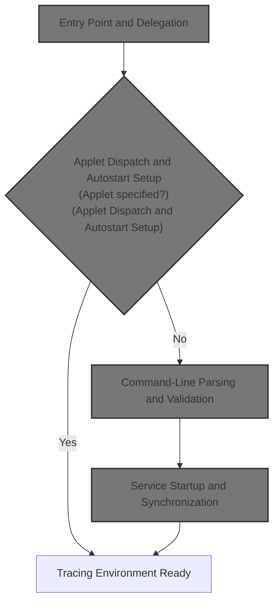
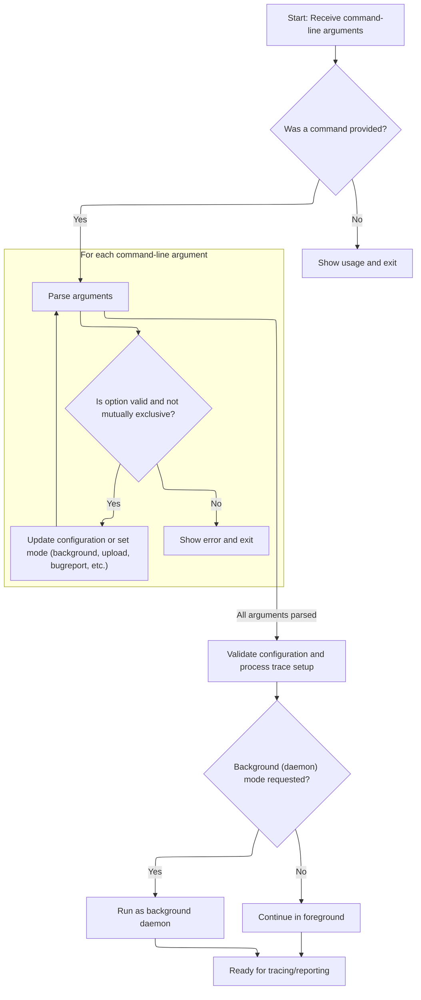

This document describes how tracing services are started and configured using command-line arguments. The flow covers receiving user input, determining the appropriate mode, parsing configuration options, and launching the tracing environment to be ready for data collection.



# Entry Point and Delegation

<SwmSnippet path="/src/tracebox/tracebox.cc" line="256">

---

<SwmToken path="src/tracebox/tracebox.cc" pos="256:2:2" line-data="int main(int argc, char** argv) {">`main`</SwmToken> just kicks things off by passing control to <SwmToken path="src/tracebox/tracebox.cc" pos="257:5:5" line-data="  return perfetto::TraceboxMain(argc, argv);">`TraceboxMain`</SwmToken>, handing over the command-line arguments. This keeps the entry point clean and pushes all real logic into <SwmToken path="src/tracebox/tracebox.cc" pos="257:5:5" line-data="  return perfetto::TraceboxMain(argc, argv);">`TraceboxMain`</SwmToken>, which handles everything else. We call <SwmToken path="src/tracebox/tracebox.cc" pos="257:5:5" line-data="  return perfetto::TraceboxMain(argc, argv);">`TraceboxMain`</SwmToken> next because that's where all the actual work—argument parsing, environment setup, and process management—happens.

```c++
int main(int argc, char** argv) {
  return perfetto::TraceboxMain(argc, argv);
}
```

---

</SwmSnippet>

# Applet Dispatch and Autostart Setup

<SwmSnippet path="/src/tracebox/tracebox.cc" line="94">

---

In <SwmToken path="src/tracebox/tracebox.cc" pos="94:2:2" line-data="int TraceboxMain(int argc, char** argv) {">`TraceboxMain`</SwmToken>, we first check if the executable or first argument matches any known applet, and if so, we jump straight to that applet's entrypoint. If not, we set up unique socket names for IPC to avoid clashing with system daemons, parse the command line, and handle daemonization if needed. We call into the <SwmToken path="src/tracebox/tracebox.cc" pos="155:1:1" line-data="  PerfettoCmd perfetto_cmd;">`PerfettoCmd`</SwmToken> logic next to handle all the detailed argument parsing and validation, since that's where the CLI and config logic lives.

```c++
int TraceboxMain(int argc, char** argv) {
  // Manual mode: if either the 1st argument (argv[1]) or the exe name (argv[0])
  // match the name of an applet, directly invoke that without further
  // modifications.

  // Extract the file name from argv[0].
  char* slash = strrchr(argv[0], '/');
  char* argv0 = slash ? slash + 1 : argv[0];

  for (const Applet& applet : g_applets) {
    if (!strcmp(argv0, applet.name))
      return applet.entrypoint(argc, argv);
    if (argc > 1 && !strcmp(argv[1], applet.name))
      return applet.entrypoint(argc - 1, &argv[1]);
  }

  // If no matching applet is found, switch to the autostart mode. In this mode
  // we make tracebox behave like the cmdline client (without needing to prefix
  // it with "perfetto"), but will also start traced and traced_probes.
  // As part of this we also use a different namespace for the producer/consumer
  // sockets, to avoid clashing with the system daemon.

  if (argc <= 1) {
    PrintUsage();
    return 1;
  }

  auto* end = std::remove_if(argv, argv + argc, [](char* arg) {
    return !strcmp(arg, "--system-sockets");
  });
  if (end < (argv + argc - 1)) {
    PERFETTO_ELOG("Cannot specify --system-sockets multiple times");
    return 1;
  }
  if (bool system_sockets = end == (argv + argc - 1); system_sockets) {
    argc--;
  } else {
    auto pid_str = std::to_string(static_cast<uint64_t>(base::GetProcessId()));
#if PERFETTO_BUILDFLAG(PERFETTO_OS_LINUX) || \
    PERFETTO_BUILDFLAG(PERFETTO_OS_ANDROID)
    // Use an unlinked abstract domain socket on Linux/Android.
    std::string consumer_socket = "@traced-c-" + pid_str;
    std::string producer_socket = "@traced-p-" + pid_str;
#elif PERFETTO_BUILDFLAG(PERFETTO_OS_APPLE)
    std::string consumer_socket = "/tmp/traced-c-" + pid_str;
    std::string producer_socket = "/tmp/traced-p-" + pid_str;
#else
    PERFETTO_FATAL("The autostart mode is not supported on this platform");
#endif

    // If the caller has set the PERFETTO_*_SOCK_NAME, respect those.
    if (const char* env = getenv("PERFETTO_CONSUMER_SOCK_NAME"); env) {
      consumer_socket = env;
    }
    if (const char* env = getenv("PERFETTO_PRODUCER_SOCK_NAME"); env) {
      producer_socket = env;
    }
    base::SetEnv("PERFETTO_CONSUMER_SOCK_NAME", consumer_socket);
    base::SetEnv("PERFETTO_PRODUCER_SOCK_NAME", producer_socket);
  }

  PerfettoCmd perfetto_cmd;

  // If the cmdline parsing fails, stop here, no need to spawn services.
  // It will daemonize if --background. In that case the subprocesses will be
  // spawned by the damonized cmdline client, which is what we want so killing
  // the backgrounded cmdline client will also kill the other services, as they
  // will live in the same background session.
  auto opt_res = perfetto_cmd.ParseCmdlineAndMaybeDaemonize(argc, argv);
```

---

</SwmSnippet>

## Command-Line Parsing and Validation



<SwmSnippet path="/src/perfetto_cmd/perfetto_cmd.cc" line="209">

---

In <SwmToken path="src/perfetto_cmd/perfetto_cmd.cc" pos="209:9:9" line-data="std::optional&lt;int&gt; PerfettoCmd::ParseCmdlineAndMaybeDaemonize(int argc,">`ParseCmdlineAndMaybeDaemonize`</SwmToken>, we parse all the command-line options, set up internal state, and enforce Perfetto-specific rules about which options can be combined. This is where we handle all the CLI logic, including validation and daemonization requests. If anything is wrong with the arguments, we bail out early with an error.

```c++
std::optional<int> PerfettoCmd::ParseCmdlineAndMaybeDaemonize(int argc,
                                                              char** argv) {
#if !PERFETTO_BUILDFLAG(PERFETTO_OS_WIN)
  umask(0000);  // make sure that file creation is not affected by umask.
#endif
  enum LongOption {
    OPT_ALERT_ID = 1000,
    OPT_BUGREPORT,
    OPT_BUGREPORT_ALL,
    OPT_CLONE,
    OPT_CLONE_BY_NAME,
    OPT_CLONE_SKIP_FILTER,
    OPT_CONFIG_ID,
    OPT_CONFIG_UID,
    OPT_SUBSCRIPTION_ID,
    OPT_RESET_GUARDRAILS,
    OPT_PBTXT_CONFIG,
    OPT_DROPBOX,
    OPT_UPLOAD,
    OPT_IGNORE_GUARDRAILS,
    OPT_DETACH,
    OPT_ATTACH,
    OPT_IS_DETACHED,
    OPT_STOP,
    OPT_QUERY,
    OPT_LONG,
    OPT_QUERY_RAW,
    OPT_VERSION,
    OPT_NOTIFY_FD,
  };
  static const option long_options[] = {
      {"help", no_argument, nullptr, 'h'},
      {"config", required_argument, nullptr, 'c'},
      {"out", required_argument, nullptr, 'o'},
      {"background", no_argument, nullptr, 'd'},
      {"background-wait", no_argument, nullptr, 'D'},
      {"time", required_argument, nullptr, 't'},
      {"buffer", required_argument, nullptr, 'b'},
      {"size", required_argument, nullptr, 's'},
      {"app", required_argument, nullptr, 'a'},
      {"no-guardrails", no_argument, nullptr, OPT_IGNORE_GUARDRAILS},
      {"txt", no_argument, nullptr, OPT_PBTXT_CONFIG},
      {"upload", no_argument, nullptr, OPT_UPLOAD},
      {"dropbox", required_argument, nullptr, OPT_DROPBOX},
      {"alert-id", required_argument, nullptr, OPT_ALERT_ID},
      {"config-id", required_argument, nullptr, OPT_CONFIG_ID},
      {"config-uid", required_argument, nullptr, OPT_CONFIG_UID},
      {"subscription-id", required_argument, nullptr, OPT_SUBSCRIPTION_ID},
      {"reset-guardrails", no_argument, nullptr, OPT_RESET_GUARDRAILS},
      {"detach", required_argument, nullptr, OPT_DETACH},
      {"attach", required_argument, nullptr, OPT_ATTACH},
      {"clone", required_argument, nullptr, OPT_CLONE},
      {"clone-by-name", required_argument, nullptr, OPT_CLONE_BY_NAME},
      {"clone-for-bugreport", no_argument, nullptr, OPT_CLONE_SKIP_FILTER},
      {"is_detached", required_argument, nullptr, OPT_IS_DETACHED},
      {"stop", no_argument, nullptr, OPT_STOP},
      {"query", no_argument, nullptr, OPT_QUERY},
      {"long", no_argument, nullptr, OPT_LONG},
      {"query-raw", no_argument, nullptr, OPT_QUERY_RAW},
      {"version", no_argument, nullptr, OPT_VERSION},
      {"save-for-bugreport", no_argument, nullptr, OPT_BUGREPORT},
      {"save-all-for-bugreport", no_argument, nullptr, OPT_BUGREPORT_ALL},
      {"notify-fd", required_argument, nullptr, OPT_NOTIFY_FD},
      {nullptr, 0, nullptr, 0}};

  std::string config_file_name;
  std::string trace_config_raw;
  bool parse_as_pbtxt = false;
  TraceConfig::StatsdMetadata statsd_metadata;

  ConfigOptions config_options;
  bool has_config_options = false;

  if (argc <= 1) {
    PrintUsage(argv[0]);
    return 1;
  }

  // getopt is not thread safe and cmdline parsing requires a mutex for the case
  // of concurrent cmdline parsing for bugreport snapshots.
  static base::NoDestructor<std::mutex> getopt_mutex;
  std::unique_lock<std::mutex> getopt_lock(getopt_mutex.ref());

  optind = 1;  // Reset getopt state. It's reused by the snapshot thread.
  for (;;) {
    int option =
        getopt_long(argc, argv, "hc:o:dDt:b:s:a:", long_options, nullptr);

    if (option == -1)
      break;  // EOF.

    if (option == 'c') {
      config_file_name = std::string(optarg);
      if (strcmp(optarg, "-") == 0) {
#if PERFETTO_BUILDFLAG(PERFETTO_OS_WIN)
        // We don't want the runtime to replace "\n" with "\r\n" on `std::cin`.
        _setmode(_fileno(stdin), _O_BINARY);
#endif
        std::istreambuf_iterator<char> begin(std::cin), end;
        trace_config_raw.assign(begin, end);
      } else if (strcmp(optarg, ":test") == 0) {
        TraceConfig test_config;
        ConfigOptions opts;
        opts.time = "2s";
        opts.categories.emplace_back("sched/sched_switch");
        opts.categories.emplace_back("power/cpu_idle");
        opts.categories.emplace_back("power/cpu_frequency");
        opts.categories.emplace_back("power/gpu_frequency");
        PERFETTO_CHECK(CreateConfigFromOptions(opts, &test_config));
        trace_config_raw = test_config.SerializeAsString();
      } else if (strcmp(optarg, ":mem") == 0) {
        // This is used by OnCloneSnapshotTriggerReceived(), which passes the
        // original trace config as a member field. This is needed because, in
        // the new PerfettoCmd instance, we need to know upfront trace config
        // fields that affect the behaviour of perfetto_cmd, e.g., the guardrail
        // overrides, the unique_session_name, the reporter API package etc.
        PERFETTO_CHECK(!snapshot_config_.empty());
        trace_config_raw = snapshot_config_;
      } else {
        if (!base::ReadFile(optarg, &trace_config_raw)) {
#if PERFETTO_BUILDFLAG(PERFETTO_ANDROID_BUILD)
          PERFETTO_PLOG(
              "Could not open %s. If this is a permission denied error, try "
              "placing the config in /data/misc/perfetto-configs: Perfetto "
              "should always be able to access this directory.",
              optarg);
#else
          PERFETTO_PLOG("Could not open %s", optarg);
#endif
          return 1;
        }
      }
      continue;
    }

    if (option == 'o') {
      trace_out_path_ = optarg;
      continue;
    }

    if (option == 'd') {
      background_ = true;
      continue;
    }

    if (option == 'D') {
      background_ = true;
      background_wait_ = true;
      continue;
    }

    if (option == OPT_CLONE) {
      clone_tsid_ = static_cast<TracingSessionID>(atoll(optarg));
      continue;
    }

    if (option == OPT_CLONE_BY_NAME) {
      clone_name_ = optarg;
      continue;
    }

    if (option == OPT_CLONE_SKIP_FILTER) {
      clone_for_bugreport_ = true;
      continue;
    }

    if (option == 't') {
      has_config_options = true;
      config_options.time = std::string(optarg);
      continue;
    }

    if (option == 'b') {
      has_config_options = true;
      config_options.buffer_size = std::string(optarg);
      continue;
    }

    if (option == 's') {
      has_config_options = true;
      config_options.max_file_size = std::string(optarg);
      continue;
    }

    if (option == 'a') {
      config_options.atrace_apps.push_back(std::string(optarg));
      has_config_options = true;
      continue;
    }

    if (option == OPT_UPLOAD) {
#if PERFETTO_BUILDFLAG(PERFETTO_OS_ANDROID)
      upload_flag_ = true;
      continue;
#else
      PERFETTO_ELOG("--upload is only supported on Android");
      return 1;
#endif
    }

    if (option == OPT_DROPBOX) {
#if PERFETTO_BUILDFLAG(PERFETTO_OS_ANDROID)
      PERFETTO_CHECK(optarg);
      upload_flag_ = true;
      continue;
#else
      PERFETTO_ELOG("--dropbox is only supported on Android");
      return 1;
#endif
    }

    if (option == OPT_PBTXT_CONFIG) {
      parse_as_pbtxt = true;
      continue;
    }

    if (option == OPT_IGNORE_GUARDRAILS) {
      ignore_guardrails_ = true;
      continue;
    }

    if (option == OPT_RESET_GUARDRAILS) {
      PERFETTO_ILOG(
          "Guardrails no longer exist in perfetto_cmd; this option only exists "
          "for backwards compatibility.");
      return 0;
    }

    if (option == OPT_ALERT_ID) {
      statsd_metadata.set_triggering_alert_id(atoll(optarg));
      continue;
    }

    if (option == OPT_CONFIG_ID) {
      statsd_metadata.set_triggering_config_id(atoll(optarg));
      continue;
    }

    if (option == OPT_CONFIG_UID) {
      statsd_metadata.set_triggering_config_uid(atoi(optarg));
      continue;
    }

    if (option == OPT_SUBSCRIPTION_ID) {
      statsd_metadata.set_triggering_subscription_id(atoll(optarg));
      continue;
    }

    if (option == OPT_DETACH) {
      detach_key_ = std::string(optarg);
      PERFETTO_CHECK(!detach_key_.empty());
      continue;
    }

    if (option == OPT_ATTACH) {
      attach_key_ = std::string(optarg);
      PERFETTO_CHECK(!attach_key_.empty());
      continue;
    }

    if (option == OPT_IS_DETACHED) {
      attach_key_ = std::string(optarg);
      redetach_once_attached_ = true;
      PERFETTO_CHECK(!attach_key_.empty());
      continue;
    }

    if (option == OPT_STOP) {
      stop_trace_once_attached_ = true;
      continue;
    }

    if (option == OPT_QUERY) {
      query_service_ = true;
      continue;
    }

    if (option == OPT_LONG) {
      query_service_long_ = true;
      continue;
    }

    if (option == OPT_QUERY_RAW) {
      query_service_ = true;
      query_service_output_raw_ = true;
      continue;
    }

    if (option == OPT_VERSION) {
      printf("%s\n", base::GetVersionString());
      return 0;
    }

    if (option == OPT_BUGREPORT) {
      bugreport_ = true;
      continue;
    }

    if (option == OPT_BUGREPORT_ALL) {
      clone_all_bugreport_traces_ = true;
      continue;
    }

    if (option == OPT_NOTIFY_FD) {
#if !PERFETTO_BUILDFLAG(PERFETTO_OS_WIN)
      notify_fd_.reset(atoi(optarg));
      continue;
#else
      PERFETTO_ELOG("--notify-fd is not supported on Windows");
      return 1;
#endif
    }

    PrintUsage(argv[0]);
    return 1;
  }
```

---

</SwmSnippet>

<SwmSnippet path="/src/perfetto_cmd/perfetto_cmd.cc" line="526">

---

After parsing all the options, any leftover arguments are treated as trace categories and added to the config options. This lets users specify what to trace directly on the command line.

```c++
  for (ssize_t i = optind; i < argc; i++) {
    has_config_options = true;
    config_options.categories.push_back(argv[i]);
  }
```

---

</SwmSnippet>

<SwmSnippet path="/src/perfetto_cmd/perfetto_cmd.cc" line="530">

---

After parsing, we validate option combos, parse the config, and set up output/triggers.

```c++
  getopt_lock.unlock();

  if (query_service_ && (is_detach() || is_attach() || background_)) {
    PERFETTO_ELOG("--query cannot be combined with any other argument");
    return 1;
  }

  if (query_service_long_ && !query_service_) {
    PERFETTO_ELOG("--long can only be used with --query");
    return 1;
  }

  if (is_detach() && is_attach()) {
    PERFETTO_ELOG("--attach and --detach are mutually exclusive");
    return 1;
  }

  if (is_detach() && background_) {
    PERFETTO_ELOG("--detach and --background are mutually exclusive");
    return 1;
  }

  if (stop_trace_once_attached_ && !is_attach()) {
    PERFETTO_ELOG("--stop is supported only in combination with --attach");
    return 1;
  }

  if ((bugreport_ || clone_all_bugreport_traces_) &&
      (is_attach() || is_detach() || query_service_ || has_config_options ||
       background_wait_)) {
    PERFETTO_ELOG("--save-for-bugreport cannot take any other argument");
    return 1;
  }

  if (clone_tsid_ && !clone_name_.empty()) {
    PERFETTO_ELOG("--clone and --clone-by-name are mutually exclusive");
    return 1;
  }

  if (clone_for_bugreport_ && !is_clone()) {
    PERFETTO_ELOG("--clone-for-bugreport requires --clone or --clone-by-name");
    return 1;
  }

  // --save-for-bugreport is the equivalent of:
  // --clone kBugreportSessionId -o /data/misc/perfetto-traces/bugreport/...
  if (bugreport_ && trace_out_path_.empty()) {
    PERFETTO_LOG("Invoked perfetto with --save-for-bugreport");
    clone_tsid_ = kBugreportSessionId;
    clone_for_bugreport_ = true;
    trace_out_path_ = GetBugreportTracePath();
  }

  // Parse the trace config. It can be either:
  // 1) A proto-encoded file/stdin (-c ...).
  // 2) A proto-text file/stdin (-c ... --txt).
  // 3) A set of option arguments (-t 10s -s 10m).
  // The only cases in which a trace config is not expected is --attach.
  // For this we are just acting on already existing sessions.
  trace_config_.reset(new TraceConfig());

  bool parsed = false;
  bool cfg_could_be_txt = false;
  const bool will_trace_or_trigger =
      !is_attach() && !query_service_ && !clone_all_bugreport_traces_;
  if (!will_trace_or_trigger) {
    if ((!trace_config_raw.empty() || has_config_options)) {
      PERFETTO_ELOG("Cannot specify a trace config with this option");
      return 1;
    }
  } else if (has_config_options) {
    if (!trace_config_raw.empty()) {
      PERFETTO_ELOG(
          "Cannot specify both -c/--config and any of --time, --size, "
          "--buffer, --app, ATRACE_CAT, FTRACE_EVENT");
      return 1;
    }
    parsed = CreateConfigFromOptions(config_options, trace_config_.get());
  } else {
    if (trace_config_raw.empty() && !is_clone()) {
      PERFETTO_ELOG("The TraceConfig is empty");
      return 1;
    }
    PERFETTO_DLOG("Parsing TraceConfig, %zu bytes", trace_config_raw.size());
    if (parse_as_pbtxt) {
      parsed = ParseTraceConfigPbtxt(config_file_name, trace_config_raw,
                                     trace_config_.get());
    } else {
      parsed = trace_config_->ParseFromString(trace_config_raw);
      cfg_could_be_txt =
          !parsed && std::all_of(trace_config_raw.begin(),
                                 trace_config_raw.end(), [](char c) {
                                   // This is equiv to: isprint(c) || isspace(x)
                                   // but doesn't depend on and load the locale.
                                   return (c >= 32 && c <= 126) ||
                                          (c >= 9 && c <= 13);
                                 });
    }
  }

  if (parsed) {
    *trace_config_->mutable_statsd_metadata() = std::move(statsd_metadata);
    trace_config_raw.clear();
  } else if (will_trace_or_trigger && !is_clone()) {
    PERFETTO_ELOG("The trace config is invalid, bailing out.");
    if (cfg_could_be_txt) {
      PERFETTO_ELOG(
          "Looks like you are passing a textual config but I'm expecting a "
          "proto-encoded binary config.");
      PERFETTO_ELOG("Try adding --txt to the cmdline.");
    }
    return 1;
  }

  if (trace_config_->trace_uuid_lsb() == 0 &&
      trace_config_->trace_uuid_msb() == 0) {
    base::Uuid uuid = base::Uuidv4();
    if (trace_config_->statsd_metadata().triggering_subscription_id()) {
      uuid.set_lsb(
          trace_config_->statsd_metadata().triggering_subscription_id());
    }
    uuid_ = uuid.ToString();
    trace_config_->set_trace_uuid_msb(uuid.msb());
    trace_config_->set_trace_uuid_lsb(uuid.lsb());
  } else {
    base::Uuid uuid(trace_config_->trace_uuid_lsb(),
                    trace_config_->trace_uuid_msb());
    uuid_ = uuid.ToString();
  }

  const auto& delay = trace_config_->cmd_trace_start_delay();
  if (delay.has_max_delay_ms() != delay.has_min_delay_ms()) {
    PERFETTO_ELOG("cmd_trace_start_delay field is only partially specified.");
    return 1;
  }

  bool has_incidentd_package =
      !trace_config_->incident_report_config().destination_package().empty();
  if (has_incidentd_package && !upload_flag_) {
    PERFETTO_ELOG(
        "Unexpected IncidentReportConfig without --dropbox / --upload.");
    return 1;
  }

  bool has_android_reporter_package = !trace_config_->android_report_config()
                                           .reporter_service_package()
                                           .empty();
  if (has_android_reporter_package && !upload_flag_) {
    PERFETTO_ELOG(
        "Unexpected AndroidReportConfig without --dropbox / --upload.");
    return 1;
  }

  if (has_incidentd_package && has_android_reporter_package) {
    PERFETTO_ELOG(
        "Only one of IncidentReportConfig and AndroidReportConfig "
        "allowed in the same config.");
    return 1;
  }

  // If the upload flag is set, we can only be doing one of three things:
  // 1. Reporting to either incidentd or Android framework.
  // 2. Skipping incidentd/Android report because it was explicitly
  //    specified in the config.
  // 3. Activating triggers.
  bool incidentd_valid =
      has_incidentd_package ||
      trace_config_->incident_report_config().skip_incidentd();
  bool android_report_valid =
      has_android_reporter_package ||
      trace_config_->android_report_config().skip_report();
  bool has_triggers = !trace_config_->activate_triggers().empty();
  if (upload_flag_ && !incidentd_valid && !android_report_valid &&
      !has_triggers) {
    PERFETTO_ELOG(
        "One of IncidentReportConfig, AndroidReportConfig or activate_triggers "
        "must be specified with --dropbox / --upload.");
    return 1;
  }

  // Only save to incidentd if:
  // 1) |destination_package| is set
  // 2) |skip_incidentd| is absent or false.
  // 3) we are not simply activating triggers.
  save_to_incidentd_ =
      has_incidentd_package &&
      !trace_config_->incident_report_config().skip_incidentd() &&
      !has_triggers;

  // Only report to the Android framework if:
  // 1) |reporter_service_package| is set
  // 2) |skip_report| is absent or false.
  // 3) we are not simply activating triggers.
  report_to_android_framework_ =
      has_android_reporter_package &&
      !trace_config_->android_report_config().skip_report() && !has_triggers;

  // Respect the wishes of the config with respect to statsd logging or fall
  // back on the presence of the --upload flag if not set.
  switch (trace_config_->statsd_logging()) {
    case TraceConfig::STATSD_LOGGING_ENABLED:
      statsd_logging_ = true;
      break;
    case TraceConfig::STATSD_LOGGING_DISABLED:
      statsd_logging_ = false;
      break;
    case TraceConfig::STATSD_LOGGING_UNSPECIFIED:
      statsd_logging_ = upload_flag_;
      break;
  }
  trace_config_->set_statsd_logging(statsd_logging_
                                        ? TraceConfig::STATSD_LOGGING_ENABLED
                                        : TraceConfig::STATSD_LOGGING_DISABLED);

  // Set up the output file. Either --out or --upload are expected, with the
  // only exception of --attach. In this case the output file is passed when
  // detaching.
  if (!trace_out_path_.empty() && upload_flag_) {
    PERFETTO_ELOG(
        "Can't log to a file (--out) and incidentd (--upload) at the same "
        "time");
    return 1;
  }

  if (!trace_config_->output_path().empty()) {
    if (!trace_out_path_.empty() || upload_flag_) {
      PERFETTO_ELOG(
          "Can't pass --out or --upload if output_path is set in the "
          "trace config");
      return 1;
    }
    if (base::FileExists(trace_config_->output_path())) {
      PERFETTO_ELOG(
          "The output_path must not exist, the service cannot overwrite "
          "existing files for security reasons. Remove %s or use a different "
          "path.",
          trace_config_->output_path().c_str());
      return 1;
    }
  }

  // |activate_triggers| in the trace config is shorthand for trigger_perfetto.
  // In this case we don't intend to send any trace config to the service,
  // rather use that as a signal to the cmdline client to connect as a producer
  // and activate triggers.
  if (has_triggers) {
    for (const auto& trigger : trace_config_->activate_triggers()) {
      triggers_to_activate_.push_back(trigger);
    }
```

---

</SwmSnippet>

<SwmSnippet path="/src/perfetto_cmd/perfetto_cmd.cc" line="779">

---

After all the parsing, validation, and setup, we either return an error code (if something's wrong) or std::nullopt to signal that everything's good and we can move on to the main tracing logic. This keeps error handling and main flow separate.

```c++
    trace_config_.reset(new TraceConfig());
  }

  bool open_out_file = true;
  if (!will_trace_or_trigger) {
    open_out_file = false;
    if (!trace_out_path_.empty() || upload_flag_) {
      PERFETTO_ELOG("Can't pass an --out file (or --upload) with this option");
      return 1;
    }
  } else if (!triggers_to_activate_.empty() ||
             (trace_config_->write_into_file() &&
              !trace_config_->output_path().empty())) {
    open_out_file = false;
  } else if (trace_out_path_.empty() && !upload_flag_) {
    PERFETTO_ELOG("Either --out or --upload is required");
    return 1;
  } else if (is_detach() && !trace_config_->write_into_file()) {
    // In detached mode we must pass the file descriptor to the service and
    // let that one write the trace. We cannot use the IPC readback code path
    // because the client process is about to exit soon after detaching.
    // We could support detach && !write_into_file, but that would make the
    // cmdline logic more complex. The feasible configurations are:
    // 1. Using write_into_file and passing the file path on the --detach call.
    // 2. Using pure ring-buffer mode, setting write_into_file = false and
    //    passing the output file path to the --attach call.
    // This is too complicated and harder to reason about, so we support only 1.
    // Traceur gets around this by always setting write_into_file and specifying
    // file_write_period_ms = 1week (which effectively means: write into the
    // file only at the end of the trace) to achieve ring buffer traces.
    PERFETTO_ELOG(
        "TraceConfig's write_into_file must be true when using --detach");
    return 1;
  }
  if (open_out_file) {
    if (!OpenOutputFile())
      return 1;
    if (!trace_config_->write_into_file())
      packet_writer_.emplace(trace_out_stream_.get());
  }

  bool will_trace_indefinitely =
      trace_config_->duration_ms() == 0 &&
      trace_config_->trigger_config().trigger_timeout_ms() == 0;
  if (will_trace_indefinitely && save_to_incidentd_ && !ignore_guardrails_) {
    PERFETTO_ELOG("Can't trace indefinitely when tracing to Incidentd.");
    return 1;
  }

  if (will_trace_indefinitely && report_to_android_framework_ &&
      !ignore_guardrails_) {
    PERFETTO_ELOG(
        "Can't trace indefinitely when reporting to Android framework.");
    return 1;
  }

  if (background_) {
    if (background_wait_) {
#if !PERFETTO_BUILDFLAG(PERFETTO_OS_WIN)
      background_wait_pipe_ = base::Pipe::Create(base::Pipe::kRdNonBlock);
#endif
    }

    PERFETTO_CHECK(snapshot_threads_.empty());  // No threads before Daemonize.
    base::Daemonize([this]() -> int {
      background_wait_pipe_.wr.reset();

      if (background_wait_) {
        return WaitOnBgProcessPipe();
      }

      return 0;
    });
    background_wait_pipe_.rd.reset();
  }

  return std::nullopt;  // Continues in ConnectToServiceRunAndMaybeNotify()
                        // below.
}
```

---

</SwmSnippet>

## Service Startup and Synchronization

```mermaid
%%{init: {"flowchart": {"defaultRenderer": "elk"}} }%%
flowchart TD
  node1["Start Tracebox"] --> node2{"Should print usage and exit?"}
  click node1 openCode "src/tracebox/tracebox.cc:163:168"
  node2 -->|"Yes"| node3["Print usage info and exit"]
  click node2 openCode "src/tracebox/tracebox.cc:163:168"
  click node3 openCode "src/tracebox/tracebox.cc:165:167"
  node2 -->|"No"| node4["Start traced service"]
  click node4 openCode "src/tracebox/tracebox.cc:170:186"
  node4 --> node5{"Is traced service ready?"}
  click node5 openCode "src/tracebox/tracebox.cc:191:195"
  node5 -->|"Yes"| node6["Start traced_probes service"]
  click node6 openCode "src/tracebox/tracebox.cc:197:211"
  node5 -->|"No"| node7["Report traced service failure and exit"]
  click node7 openCode "src/tracebox/tracebox.cc:194:195"
  node6 --> node8{"Is traced_probes service ready?"}
  click node8 openCode "src/tracebox/tracebox.cc:216:222"
  node8 -->|"Yes"| node9{"Is perf tracing supported?"}
  click node9 openCode "src/tracebox/tracebox.cc:224:247"
  node8 -->|"No"| node10["Report traced_probes service failure and exit"]
  click node10 openCode "src/tracebox/tracebox.cc:220:221"
  node9 -->|"Yes"| node11["Start traced_perf service"]
  click node11 openCode "src/tracebox/tracebox.cc:225:234"
  node11 --> node12{"Is traced_perf service ready?"}
  click node12 openCode "src/tracebox/tracebox.cc:237:242"
  node12 -->|"Yes"| node13["Connect CLI to tracing service"]
  click node13 openCode "src/tracebox/tracebox.cc:249:250"
  node12 -->|"No"| node14["Report traced_perf service failure and exit"]
  click node14 openCode "src/tracebox/tracebox.cc:240:241"
  node9 -->|"No"| node15["Log perf tracing unsupported"]
  click node15 openCode "src/tracebox/tracebox.cc:244:247"
  node15 --> node13
classDef HeadingStyle fill:#777777,stroke:#333,stroke-width:2px;

%% Swimm:
%% %%{init: {"flowchart": {"defaultRenderer": "elk"}} }%%
%% flowchart TD
%%   node1["Start Tracebox"] --> node2{"Should print usage and exit?"}
%%   click node1 openCode "<SwmPath>[src/tracebox/tracebox.cc](src/tracebox/tracebox.cc)</SwmPath>:163:168"
%%   node2 -->|"Yes"| node3["Print usage info and exit"]
%%   click node2 openCode "<SwmPath>[src/tracebox/tracebox.cc](src/tracebox/tracebox.cc)</SwmPath>:163:168"
%%   click node3 openCode "<SwmPath>[src/tracebox/tracebox.cc](src/tracebox/tracebox.cc)</SwmPath>:165:167"
%%   node2 -->|"No"| node4["Start traced service"]
%%   click node4 openCode "<SwmPath>[src/tracebox/tracebox.cc](src/tracebox/tracebox.cc)</SwmPath>:170:186"
%%   node4 --> node5{"Is traced service ready?"}
%%   click node5 openCode "<SwmPath>[src/tracebox/tracebox.cc](src/tracebox/tracebox.cc)</SwmPath>:191:195"
%%   node5 -->|"Yes"| node6["Start <SwmToken path="src/tracebox/tracebox.cc" pos="112:25:25" line-data="  // it with &quot;perfetto&quot;), but will also start traced and traced_probes.">`traced_probes`</SwmToken> service"]
%%   click node6 openCode "<SwmPath>[src/tracebox/tracebox.cc](src/tracebox/tracebox.cc)</SwmPath>:197:211"
%%   node5 -->|"No"| node7["Report traced service failure and exit"]
%%   click node7 openCode "<SwmPath>[src/tracebox/tracebox.cc](src/tracebox/tracebox.cc)</SwmPath>:194:195"
%%   node6 --> node8{"Is <SwmToken path="src/tracebox/tracebox.cc" pos="112:25:25" line-data="  // it with &quot;perfetto&quot;), but will also start traced and traced_probes.">`traced_probes`</SwmToken> service ready?"}
%%   click node8 openCode "<SwmPath>[src/tracebox/tracebox.cc](src/tracebox/tracebox.cc)</SwmPath>:216:222"
%%   node8 -->|"Yes"| node9{"Is perf tracing supported?"}
%%   click node9 openCode "<SwmPath>[src/tracebox/tracebox.cc](src/tracebox/tracebox.cc)</SwmPath>:224:247"
%%   node8 -->|"No"| node10["Report <SwmToken path="src/tracebox/tracebox.cc" pos="112:25:25" line-data="  // it with &quot;perfetto&quot;), but will also start traced and traced_probes.">`traced_probes`</SwmToken> service failure and exit"]
%%   click node10 openCode "<SwmPath>[src/tracebox/tracebox.cc](src/tracebox/tracebox.cc)</SwmPath>:220:221"
%%   node9 -->|"Yes"| node11["Start <SwmToken path="src/tracebox/tracebox.cc" pos="225:5:5" line-data="  base::Subprocess traced_perf({self_path, &quot;traced_perf&quot;});">`traced_perf`</SwmToken> service"]
%%   click node11 openCode "<SwmPath>[src/tracebox/tracebox.cc](src/tracebox/tracebox.cc)</SwmPath>:225:234"
%%   node11 --> node12{"Is <SwmToken path="src/tracebox/tracebox.cc" pos="225:5:5" line-data="  base::Subprocess traced_perf({self_path, &quot;traced_perf&quot;});">`traced_perf`</SwmToken> service ready?"}
%%   click node12 openCode "<SwmPath>[src/tracebox/tracebox.cc](src/tracebox/tracebox.cc)</SwmPath>:237:242"
%%   node12 -->|"Yes"| node13["Connect CLI to tracing service"]
%%   click node13 openCode "<SwmPath>[src/tracebox/tracebox.cc](src/tracebox/tracebox.cc)</SwmPath>:249:250"
%%   node12 -->|"No"| node14["Report <SwmToken path="src/tracebox/tracebox.cc" pos="225:5:5" line-data="  base::Subprocess traced_perf({self_path, &quot;traced_perf&quot;});">`traced_perf`</SwmToken> service failure and exit"]
%%   click node14 openCode "<SwmPath>[src/tracebox/tracebox.cc](src/tracebox/tracebox.cc)</SwmPath>:240:241"
%%   node9 -->|"No"| node15["Log perf tracing unsupported"]
%%   click node15 openCode "<SwmPath>[src/tracebox/tracebox.cc](src/tracebox/tracebox.cc)</SwmPath>:244:247"
%%   node15 --> node13
%% classDef HeadingStyle fill:#777777,stroke:#333,stroke-width:2px;
```



<SwmSnippet path="/src/tracebox/tracebox.cc" line="163">

---

Back in <SwmToken path="src/tracebox/tracebox.cc" pos="94:2:2" line-data="int TraceboxMain(int argc, char** argv) {">`TraceboxMain`</SwmToken>, after returning from the command-line parsing in <SwmToken path="src/tracebox/tracebox.cc" pos="155:1:1" line-data="  PerfettoCmd perfetto_cmd;">`PerfettoCmd`</SwmToken>, we check for errors and then start the tracing service subprocesses ('traced', <SwmToken path="src/tracebox/tracebox.cc" pos="197:5:5" line-data="  base::Subprocess traced_probes(">`traced_probes`</SwmToken>, and optionally <SwmToken path="src/tracebox/tracebox.cc" pos="225:5:5" line-data="  base::Subprocess traced_perf({self_path, &quot;traced_perf&quot;});">`traced_perf`</SwmToken>). We use pipes to synchronize startup, making sure each service is ready before moving on. Process groups are set up so only the main process handles signals like <SwmToken path="src/tracebox/tracebox.cc" pos="180:15:17" line-data="  // Create a new process group so CTRL-C is delivered only to the cmdline">`CTRL-C`</SwmToken>, which lets us shut down cleanly.

```c++
  if (opt_res.has_value()) {
    if (*opt_res != 0) {
      PrintTraceboxUsage();
    }
    return *opt_res;
  }

  std::string self_path = base::GetCurExecutablePath();
  base::Subprocess traced({self_path, "traced"});
#if !PERFETTO_BUILDFLAG(PERFETTO_OS_WIN)
  // |traced_sync_pipe| is used to synchronize with traced socket creation.
  // traced will write "1" and close the FD when the IPC socket is listening
  // (or traced crashed).
  base::Pipe traced_sync_pipe = base::Pipe::Create();
  int traced_fd = *traced_sync_pipe.wr;
  base::SetEnv("TRACED_NOTIFY_FD", std::to_string(traced_fd));
  traced.args.preserve_fds.emplace_back(traced_fd);
  // Create a new process group so CTRL-C is delivered only to the cmdline
  // process (the tracebox one) and not to traced. traced will still exit once
  // the main process exits, but this allows graceful stopping of the trace
  // without abruptedly killing traced{,probes} when hitting CTRL+C.
  traced.args.posix_proc_group_id = 0;  // 0 = start a new process group.
#endif
  traced.Start();

#if !PERFETTO_BUILDFLAG(PERFETTO_OS_WIN)
  traced_sync_pipe.wr.reset();

  std::string traced_notify_msg;
  base::ReadPlatformHandle(*traced_sync_pipe.rd, &traced_notify_msg);
  if (traced_notify_msg != "1")
    PERFETTO_FATAL("The tracing service failed unexpectedly. Check the logs");
#endif

  base::Subprocess traced_probes(
      {self_path, "traced_probes", "--reset-ftrace"});
  // Put traced_probes in the same process group as traced. Same reason (CTRL+C)
  // but it's not worth creating a new group.
  traced_probes.args.posix_proc_group_id = traced.pid();
#if !PERFETTO_BUILDFLAG(PERFETTO_OS_WIN)
  // |traced_probes_sync_pipe| is used to synchronize with traced socket
  // creation. traced will write "1" and close the FD when the IPC socket is
  // listening (or traced crashed).
  base::Pipe traced_probes_sync_pipe = base::Pipe::Create();
  int traced_probes_fd = *traced_probes_sync_pipe.wr;
  base::SetEnv("TRACED_PROBES_NOTIFY_FD", std::to_string(traced_probes_fd));
  traced_probes.args.preserve_fds.emplace_back(traced_probes_fd);
#endif
  traced_probes.Start();

#if !PERFETTO_BUILDFLAG(PERFETTO_OS_WIN)
  traced_probes_sync_pipe.wr.reset();

  std::string traced_probes_notify_msg;
  base::ReadPlatformHandle(*traced_probes_sync_pipe.rd,
                           &traced_probes_notify_msg);
  if (traced_probes_notify_msg != "1")
    PERFETTO_FATAL(
        "The traced_probes service failed unexpectedly. Check the logs");
#endif

#if PERFETTO_BUILDFLAG(PERFETTO_TRACED_PERF)
  base::Subprocess traced_perf({self_path, "traced_perf"});
  // Put traced_perf in the same process group as traced. Same reason (CTRL+C)
  // but it's not worth creating a new group.
  traced_perf.args.posix_proc_group_id = traced.pid();

  base::Pipe traced_perf_sync_pipe = base::Pipe::Create();
  int traced_perf_fd = *traced_perf_sync_pipe.wr;
  base::SetEnv("TRACED_PERF_NOTIFY_FD", std::to_string(traced_perf_fd));
  traced_perf.args.preserve_fds.emplace_back(traced_perf_fd);
  traced_perf.Start();
  traced_perf_sync_pipe.wr.reset();

  std::string traced_perf_notify_msg;
  base::ReadPlatformHandle(*traced_perf_sync_pipe.rd, &traced_perf_notify_msg);
  if (traced_perf_notify_msg != "1") {
    PERFETTO_FATAL(
        "The traced_perf service failed unexpectedly. Check the logs");
  }
#else
  PERFETTO_ELOG(
      "Unsupported: linux.perf data source support (traced_perf) "
      "compiled-out.");
#endif

  perfetto_cmd.ConnectToServiceRunAndMaybeNotify();
  return 0;
}
```

---

</SwmSnippet>

&nbsp;

*This is an auto-generated document by Swimm 🌊 and has not yet been verified by a human*

<SwmMeta version="3.0.0" repo-id="Z2l0aHViJTNBJTNBY3BsdXNwbHVzLXBlcmZldHRvJTNBJTNBcmljYXJkb2xvcGV6Zw==" repo-name="cplusplus-perfetto"><sup>Powered by [Swimm](https://app.swimm.io/)</sup></SwmMeta>
