This document describes how metadata entries are stored and updated. When a metadata key and value are provided, the system checks for special cases such as trace UUIDs for crash diagnostics, ensures each metadata entry is unique, and either updates an existing entry or adds a new one.


# Where is this flow used?

This flow is used multiple times in the codebase as represented in the following diagram:

(Note - these are only some of the entry points of this flow)

```mermaid
graph TD;
      7947eb6e403ecf52613423a7de4d6d146c0dc02dc06452322016bc2f8609b290(src/…/proto/track_event_module.cc::TokenizePacket) --> c005dbe7b73e3d60ee01d5b7dcb5b2db7d3b742bd9395d166fc5cd4a682245e7(src/…/proto/track_event_tokenizer.cc::TokenizeRangeOfInterestPacket)

c005dbe7b73e3d60ee01d5b7dcb5b2db7d3b742bd9395d166fc5cd4a682245e7(src/…/proto/track_event_tokenizer.cc::TokenizeRangeOfInterestPacket) --> a9f1359fc7a4d614b3e7371ef8c111c32e830d1031140d47e38aabbd2f1350a4(src/…/common/metadata_tracker.cc::SetMetadata):::mainFlowStyle

f81d89370499bccf9596509449645a0140b685c91273870a0813e517eb1a877f(src/…/perf_text/perf_text_trace_tokenizer.cc::Parse) --> 9efa26c67305ed95772fd895ede0f410a7f49ac10f1bef5dad33ac4f2729c5c4(src/…/util/clock_synchronizer.h::SetTraceTimeClock)

9efa26c67305ed95772fd895ede0f410a7f49ac10f1bef5dad33ac4f2729c5c4(src/…/util/clock_synchronizer.h::SetTraceTimeClock) --> eaebd08511eab323fa91bbc495785ef065c357785b00c0fe69264cb0f49efaec(src/…/common/clock_tracker.cc::OnSetTraceTimeClock)

eaebd08511eab323fa91bbc495785ef065c357785b00c0fe69264cb0f49efaec(src/…/common/clock_tracker.cc::OnSetTraceTimeClock) --> a9f1359fc7a4d614b3e7371ef8c111c32e830d1031140d47e38aabbd2f1350a4(src/…/common/metadata_tracker.cc::SetMetadata):::mainFlowStyle

5bdd1128dacdfb278b4e7e1949146dfb801c5179b86619019e9a0a317b33a9f0(src/…/perf/perf_data_tokenizer.cc::ParseFeature) --> a9f1359fc7a4d614b3e7371ef8c111c32e830d1031140d47e38aabbd2f1350a4(src/…/common/metadata_tracker.cc::SetMetadata):::mainFlowStyle

8ffc7776b1d0b388f0bf8014f0d3d0dd714948cb0c8fb3e013efe0161f9d6f70(src/…/proto/proto_trace_reader.cc::ParseClockSnapshot) --> 9efa26c67305ed95772fd895ede0f410a7f49ac10f1bef5dad33ac4f2729c5c4(src/…/util/clock_synchronizer.h::SetTraceTimeClock)

b911609543ff536610e21fa09aa24ea3c7d47a091a57ca59d2a30968c04388d1(src/…/gecko/gecko_trace_tokenizer.cc::NotifyEndOfFile) --> 9efa26c67305ed95772fd895ede0f410a7f49ac10f1bef5dad33ac4f2729c5c4(src/…/util/clock_synchronizer.h::SetTraceTimeClock)


classDef mainFlowStyle color:#000000,fill:#7CB9F4
classDef rootsStyle color:#000000,fill:#00FFF4
classDef Style1 color:#000000,fill:#00FFAA
classDef Style2 color:#000000,fill:#FFFF00
classDef Style3 color:#000000,fill:#AA7CB9

%% Swimm:
%% graph TD;
%%       7947eb6e403ecf52613423a7de4d6d146c0dc02dc06452322016bc2f8609b290(<SwmPath>[src/…/proto/track_event_module.cc](src/trace_processor/importers/proto/track_event_module.cc)</SwmPath>::TokenizePacket) --> c005dbe7b73e3d60ee01d5b7dcb5b2db7d3b742bd9395d166fc5cd4a682245e7(<SwmPath>[src/…/proto/track_event_tokenizer.cc](src/trace_processor/importers/proto/track_event_tokenizer.cc)</SwmPath>::TokenizeRangeOfInterestPacket)
%% 
%% c005dbe7b73e3d60ee01d5b7dcb5b2db7d3b742bd9395d166fc5cd4a682245e7(<SwmPath>[src/…/proto/track_event_tokenizer.cc](src/trace_processor/importers/proto/track_event_tokenizer.cc)</SwmPath>::TokenizeRangeOfInterestPacket) --> a9f1359fc7a4d614b3e7371ef8c111c32e830d1031140d47e38aabbd2f1350a4(<SwmPath>[src/…/common/metadata_tracker.cc](src/trace_processor/importers/common/metadata_tracker.cc)</SwmPath>::<SwmToken path="src/trace_processor/importers/common/metadata_tracker.cc" pos="46:4:4" line-data="MetadataId MetadataTracker::SetMetadata(metadata::KeyId key, Variadic value) {">`SetMetadata`</SwmToken>):::mainFlowStyle
%% 
%% f81d89370499bccf9596509449645a0140b685c91273870a0813e517eb1a877f(<SwmPath>[src/…/perf_text/perf_text_trace_tokenizer.cc](src/trace_processor/importers/perf_text/perf_text_trace_tokenizer.cc)</SwmPath>::Parse) --> 9efa26c67305ed95772fd895ede0f410a7f49ac10f1bef5dad33ac4f2729c5c4(<SwmPath>[src/…/util/clock_synchronizer.h](src/trace_processor/util/clock_synchronizer.h)</SwmPath>::SetTraceTimeClock)
%% 
%% 9efa26c67305ed95772fd895ede0f410a7f49ac10f1bef5dad33ac4f2729c5c4(<SwmPath>[src/…/util/clock_synchronizer.h](src/trace_processor/util/clock_synchronizer.h)</SwmPath>::SetTraceTimeClock) --> eaebd08511eab323fa91bbc495785ef065c357785b00c0fe69264cb0f49efaec(<SwmPath>[src/…/common/clock_tracker.cc](src/trace_processor/importers/common/clock_tracker.cc)</SwmPath>::OnSetTraceTimeClock)
%% 
%% eaebd08511eab323fa91bbc495785ef065c357785b00c0fe69264cb0f49efaec(<SwmPath>[src/…/common/clock_tracker.cc](src/trace_processor/importers/common/clock_tracker.cc)</SwmPath>::OnSetTraceTimeClock) --> a9f1359fc7a4d614b3e7371ef8c111c32e830d1031140d47e38aabbd2f1350a4(<SwmPath>[src/…/common/metadata_tracker.cc](src/trace_processor/importers/common/metadata_tracker.cc)</SwmPath>::<SwmToken path="src/trace_processor/importers/common/metadata_tracker.cc" pos="46:4:4" line-data="MetadataId MetadataTracker::SetMetadata(metadata::KeyId key, Variadic value) {">`SetMetadata`</SwmToken>):::mainFlowStyle
%% 
%% 5bdd1128dacdfb278b4e7e1949146dfb801c5179b86619019e9a0a317b33a9f0(<SwmPath>[src/…/perf/perf_data_tokenizer.cc](src/trace_processor/importers/perf/perf_data_tokenizer.cc)</SwmPath>::ParseFeature) --> a9f1359fc7a4d614b3e7371ef8c111c32e830d1031140d47e38aabbd2f1350a4(<SwmPath>[src/…/common/metadata_tracker.cc](src/trace_processor/importers/common/metadata_tracker.cc)</SwmPath>::<SwmToken path="src/trace_processor/importers/common/metadata_tracker.cc" pos="46:4:4" line-data="MetadataId MetadataTracker::SetMetadata(metadata::KeyId key, Variadic value) {">`SetMetadata`</SwmToken>):::mainFlowStyle
%% 
%% 8ffc7776b1d0b388f0bf8014f0d3d0dd714948cb0c8fb3e013efe0161f9d6f70(<SwmPath>[src/…/proto/proto_trace_reader.cc](src/trace_processor/importers/proto/proto_trace_reader.cc)</SwmPath>::ParseClockSnapshot) --> 9efa26c67305ed95772fd895ede0f410a7f49ac10f1bef5dad33ac4f2729c5c4(<SwmPath>[src/…/util/clock_synchronizer.h](src/trace_processor/util/clock_synchronizer.h)</SwmPath>::SetTraceTimeClock)
%% 
%% b911609543ff536610e21fa09aa24ea3c7d47a091a57ca59d2a30968c04388d1(<SwmPath>[src/…/gecko/gecko_trace_tokenizer.cc](src/trace_processor/importers/gecko/gecko_trace_tokenizer.cc)</SwmPath>::NotifyEndOfFile) --> 9efa26c67305ed95772fd895ede0f410a7f49ac10f1bef5dad33ac4f2729c5c4(<SwmPath>[src/…/util/clock_synchronizer.h](src/trace_processor/util/clock_synchronizer.h)</SwmPath>::SetTraceTimeClock)
%% 
%% 
%% classDef mainFlowStyle color:#000000,fill:#7CB9F4
%% classDef rootsStyle color:#000000,fill:#00FFF4
%% classDef Style1 color:#000000,fill:#00FFAA
%% classDef Style2 color:#000000,fill:#FFFF00
%% classDef Style3 color:#000000,fill:#AA7CB9
```



# Storing and Updating Metadata Entries


<SwmSnippet path="/src/trace_processor/importers/common/metadata_tracker.cc" line="46">

---

In <SwmToken path="src/trace_processor/importers/common/metadata_tracker.cc" pos="46:4:4" line-data="MetadataId MetadataTracker::SetMetadata(metadata::KeyId key, Variadic value) {">`SetMetadata`</SwmToken>, we check for the <SwmToken path="src/trace_processor/importers/common/metadata_tracker.cc" pos="50:7:7" line-data="  // When the trace_uuid is set, store a copy in a crash key, so in case of">`trace_uuid`</SwmToken> key to store its value for crash diagnostics, then move on to fetch the string ID for the key name from the string pool.

```c++
MetadataId MetadataTracker::SetMetadata(metadata::KeyId key, Variadic value) {
  PERFETTO_DCHECK(metadata::kKeyTypes[key] == metadata::KeyType::kSingle);
  PERFETTO_DCHECK(value.type == metadata::kValueTypes[key]);

  // When the trace_uuid is set, store a copy in a crash key, so in case of
  // a crash in the pipelines we can tell which trace caused the crash.
  if (key == metadata::trace_uuid && value.type == Variadic::kString) {
    auto uuid_string_view = storage_->GetString(value.string_value);
    g_crash_key_uuid.Set(uuid_string_view);
  }

  auto& metadata_table = *storage_->mutable_metadata_table();
  auto key_idx = static_cast<uint32_t>(key);
  auto name_id = storage_->string_pool().GetId(metadata::kNames[key_idx]);
```

---

</SwmSnippet>

## Resolving String Identifiers


<SwmSnippet path="/src/trace_processor/containers/string_pool.h" line="225">

---

In <SwmToken path="src/trace_processor/containers/string_pool.h" pos="225:8:8" line-data="  std::optional&lt;Id&gt; GetId(base::StringView str) const {">`GetId`</SwmToken>, we check if the string is null and return a null ID if so. Otherwise, we hash the string using <SwmToken path="include/perfetto/ext/base/murmur_hash.h" pos="207:22:22" line-data="// Helper to check if a type has a built-in MurmurHash implementation.">`MurmurHash`</SwmToken> to get a value for fast lookup in the string pool. Next, we need to call the hash function to get this value.

```c
  std::optional<Id> GetId(base::StringView str) const {
    if (str.data() == nullptr) {
      return Id::Null();
    }
    auto hash = base::MurmurHashValue(str);
```

---

</SwmSnippet>

### Hashing String Data

<SwmSnippet path="/include/perfetto/ext/base/murmur_hash.h" line="327">

---

<SwmToken path="include/perfetto/ext/base/murmur_hash.h" pos="327:2:2" line-data="uint64_t MurmurHashValue(const T&amp; value) {">`MurmurHashValue`</SwmToken> picks the right hashing logic based on the type of the input. If there's a <SwmToken path="include/perfetto/ext/base/murmur_hash.h" pos="171:18:20" line-data="// Computes a 64-bit hash for a single built-in value without any combination.">`built-in`</SwmToken> hash, it uses that; otherwise, it falls back to combining the value. Next, we need to handle the actual hashing for the specific type, which could involve normalization for floats or direct hashing for strings.

```c
uint64_t MurmurHashValue(const T& value) {
  if constexpr (murmur_internal::HasMurmurHashBuiltinValue<T>()) {
    return murmur_internal::MurmurHashBuiltinValue(value);
  } else {
    return MurmurHashCombine(value);
  }
}
```

---

</SwmSnippet>

### Type-Specific Hash Normalization


<SwmSnippet path="/include/perfetto/ext/base/murmur_hash.h" line="179">

---

<SwmToken path="include/perfetto/ext/base/murmur_hash.h" pos="179:2:2" line-data="auto MurmurHashBuiltinValue(const T&amp; value) {">`MurmurHashBuiltinValue`</SwmToken> normalizes and hashes values based on their type, and for floats, we need to normalize them before hashing.

```c
auto MurmurHashBuiltinValue(const T& value) {
  if constexpr (std::is_enum_v<T>) {
    return murmur_internal::MurmurHashMix(
        static_cast<uint64_t>(static_cast<std::underlying_type_t<T>>(value)));
  } else if constexpr (std::is_integral_v<T>) {
    return murmur_internal::MurmurHashMix(static_cast<uint64_t>(value));
  } else if constexpr (std::is_same_v<T, double>) {
    return murmur_internal::MurmurHashMix(
        murmur_internal::NormalizeFloatToInt<double, uint64_t>(value));
  } else if constexpr (std::is_same_v<T, float>) {
    return murmur_internal::MurmurHashMix(
        murmur_internal::NormalizeFloatToInt<float, uint32_t>(value));
```

---

</SwmSnippet>

<SwmSnippet path="/include/perfetto/ext/base/murmur_hash.h" line="153">

---

<SwmToken path="include/perfetto/ext/base/murmur_hash.h" pos="153:2:2" line-data="Int NormalizeFloatToInt(Float value) {">`NormalizeFloatToInt`</SwmToken> normalizes special float values and copies their bit pattern into an integer for consistent hashing.

```c
Int NormalizeFloatToInt(Float value) {
  static_assert(std::is_floating_point_v<Float>);
  static_assert(std::is_integral_v<Int>);

  // Normalize floating point representations which can vary.
  if (PERFETTO_UNLIKELY(value == 0.0)) {
    // Turn negative zero into positive zero
    value = 0.0;
  } else if (PERFETTO_UNLIKELY(std::isnan(value))) {
    // Turn arbtirary NaN representations to a consistent NaN repr.
    value = std::numeric_limits<Float>::quiet_NaN();
  }
  Int res;
  static_assert(sizeof(Float) == sizeof(Int));
  memcpy(&res, &value, sizeof(Float));
  return res;
}
```

---

</SwmSnippet>

<SwmSnippet path="/include/perfetto/ext/base/murmur_hash.h" line="191">

---

Back in <SwmToken path="include/perfetto/ext/base/murmur_hash.h" pos="179:2:2" line-data="auto MurmurHashBuiltinValue(const T&amp; value) {">`MurmurHashBuiltinValue`</SwmToken>, after handling floats, we handle strings by hashing their bytes and pointers by hashing their address. If the type isn't supported, we return an invalid marker.

```c
  } else if constexpr (std::is_same_v<T, std::string> ||
                       std::is_same_v<T, std::string_view> ||
                       std::is_same_v<T, base::StringView>) {
    return murmur_internal::MurmurHashBytes(value.data(), value.size());
  } else if constexpr (std::is_same_v<T, const char*>) {
    std::string_view view(value);
    return murmur_internal::MurmurHashBytes(view.data(), view.size());
  } else if constexpr (std::is_pointer_v<T>) {
    return murmur_internal::MurmurHashMix(
        static_cast<uint64_t>(reinterpret_cast<uintptr_t>(value)));
  } else {
    struct InvalidBuiltin {};
    return InvalidBuiltin{};
  }
}
```

---

</SwmSnippet>

### String Pool Lookup by Hash

<SwmSnippet path="/src/trace_processor/containers/string_pool.h" line="230">

---

Back in <SwmToken path="src/trace_processor/importers/common/metadata_tracker.cc" pos="59:13:13" line-data="  auto name_id = storage_-&gt;string_pool().GetId(metadata::kNames[key_idx]);">`GetId`</SwmToken>, after hashing, we lock the string pool if needed and look up the hash in the string index. If the string isn't found, we need to check for its existence in another structure, which is why we call the next function.

```c
    MaybeLockGuard guard{mutex_, should_acquire_mutex_};
    Id* id = string_index_.Find(hash);
```

---

</SwmSnippet>

### File and Name Matching

<SwmSnippet path="/src/trace_processor/util/zip_reader.cc" line="328">

---

<SwmToken path="src/trace_processor/util/zip_reader.cc" pos="328:3:5" line-data="ZipFile* ZipReader::Find(const std::string&amp; path) {">`ZipReader::Find`</SwmToken> loops through all files and compares each file's name to the target path. If it matches, we return the file. To get the name, we call the name() function, which is implemented elsewhere.

```c++
ZipFile* ZipReader::Find(const std::string& path) {
  for (ZipFile& zf : files_) {
    if (zf.name() == path)
      return &zf;
  }
  return nullptr;
}
```

---

</SwmSnippet>

<SwmSnippet path="/src/trace_processor/util/sql_argument.h" line="59">

---

<SwmToken path="src/trace_processor/util/sql_argument.h" pos="59:3:5" line-data="  NullTermStringView name() const {">`name()`</SwmToken> returns a substring view of <SwmToken path="src/trace_processor/util/sql_argument.h" pos="60:5:5" line-data="    return NullTermStringView(dollar_name_.c_str() + 1,">`dollar_name_`</SwmToken> starting from the second character, skipping the first (probably a special marker). There's no check for empty strings, so <SwmToken path="src/trace_processor/util/sql_argument.h" pos="60:5:5" line-data="    return NullTermStringView(dollar_name_.c_str() + 1,">`dollar_name_`</SwmToken> must always have at least one character.

```c
  NullTermStringView name() const {
    return NullTermStringView(dollar_name_.c_str() + 1,
                              dollar_name_.size() - 1);
  }
```

---

</SwmSnippet>

### Returning String <SwmToken path="src/trace_processor/containers/string_pool.h" pos="48:5:5" line-data="  // StringPool IDs are 32-bit. If the MSB is 1, the remaining bits of the ID">`IDs`</SwmToken>

<SwmSnippet path="/src/trace_processor/containers/string_pool.h" line="232">

---

Back in <SwmToken path="src/trace_processor/importers/common/metadata_tracker.cc" pos="59:13:13" line-data="  auto name_id = storage_-&gt;string_pool().GetId(metadata::kNames[key_idx]);">`GetId`</SwmToken>, if we find the string's ID in the index, we double-check that the ID maps to the right string, then return it. If not found, we return std::nullopt to signal the string isn't in the pool.

```c
    if (id) {
      PERFETTO_DCHECK(Get(*id) == str);
      return *id;
    }
    return std::nullopt;
  }
```

---

</SwmSnippet>

## Checking for Existing Metadata


<SwmSnippet path="/src/trace_processor/importers/common/metadata_tracker.cc" line="60">

---

Back in <SwmToken path="src/trace_processor/importers/common/metadata_tracker.cc" pos="46:4:4" line-data="MetadataId MetadataTracker::SetMetadata(metadata::KeyId key, Variadic value) {">`SetMetadata`</SwmToken>, after getting the string ID, we scan the metadata table for an existing entry with the same name. If found, we update its value and return its ID, preventing duplicates.

```c++
  if (name_id) {
    for (auto it = metadata_table.IterateRows(); it; ++it) {
      if (it.name() == *name_id) {
        WriteValue(it.row_number().row_number(), value);
        return it.id();
      }
    }
```

---

</SwmSnippet>

<SwmSnippet path="/src/trace_processor/importers/common/metadata_tracker.cc" line="69">

---

If no entry exists, we create a new row and insert it into the metadata table's tree.

```c++
  tables::MetadataTable::Row row;
  row.name = key_ids_[key_idx];
  row.key_type = key_type_ids_[static_cast<size_t>(metadata::KeyType::kSingle)];

  auto id_and_row = metadata_table.Insert(row);
```

---

</SwmSnippet>

## Inserting into the Metadata Table


<SwmSnippet path="/src/base/intrusive_tree.h" line="141">

---

In <SwmToken path="src/base/intrusive_tree.h" pos="141:11:11" line-data="  std::pair&lt;Iterator, bool&gt; Insert(T&amp; entry) {">`Insert`</SwmToken>, we walk the red-black tree to find where to put the new entry. If the key exists, we return the existing node. Otherwise, we link the new node, color it red, and rebalance the tree. The nodeof(&entry) trick is used to get the internal tree node from the entry struct.

```c
  std::pair<Iterator, bool> Insert(T& entry) {
    // The insertion preamble is inlined because it's few instructions and
    // out-lining it would require std::function indirections for getting the
    // key and the comparator.
    int comp = 0;
    internal::RBNode* tmp = root_;
    internal::RBNode* parent = nullptr;
    internal::RBNode* const entry_node = nodeof(&entry);
    while (tmp) {
      parent = tmp;
      comp = key_compare(entry_node, parent);
      if (comp < 0) {
        tmp = tmp->left;
      } else if (comp > 0) {
        tmp = tmp->right;
      } else {
        return {Iterator(tmp), false};  // The key exists already.
      }
    }  // while(tmp)
```

---

</SwmSnippet>

<SwmSnippet path="/src/base/intrusive_tree.h" line="159">

---

After inserting, we return an iterator to the node and a flag showing if it was a new insert. The tree is balanced as needed, so lookups stay fast.

```c
    }  // while(tmp)
    entry_node->left = entry_node->right = nullptr;
    entry_node->parent = parent;
    entry_node->color = internal::RBColor::RED;
    if (parent) {
      if (comp < 0) {
        PERFETTO_DCHECK(parent->left == nullptr);
        parent->left = entry_node;
      } else {
        PERFETTO_DCHECK(parent->right == nullptr);
        parent->right = entry_node;
      }
    } else {
      root_ = entry_node;
    }
    internal::RBInsertColor(&root_, entry_node);
    ++size_;
    return {Iterator(entry_node), true};
  }
```

---

</SwmSnippet>

## Finalizing Metadata Storage

<SwmSnippet path="/src/trace_processor/importers/common/metadata_tracker.cc" line="74">

---

Back in <SwmToken path="src/trace_processor/importers/common/metadata_tracker.cc" pos="46:4:4" line-data="MetadataId MetadataTracker::SetMetadata(metadata::KeyId key, Variadic value) {">`SetMetadata`</SwmToken>, after inserting the new row, we write the value to it and return the new <SwmToken path="src/trace_processor/importers/common/metadata_tracker.cc" pos="46:0:0" line-data="MetadataId MetadataTracker::SetMetadata(metadata::KeyId key, Variadic value) {">`MetadataId`</SwmToken>. This wraps up the process of adding new metadata.

```c++
  WriteValue(id_and_row.row, value);
  return id_and_row.id;
}
```

---

</SwmSnippet>

&nbsp;

*This is an auto-generated document by Swimm 🌊 and has not yet been verified by a human*

<SwmMeta version="3.0.0" repo-id="Z2l0aHViJTNBJTNBY3BsdXNwbHVzLXBlcmZldHRvJTNBJTNBcmljYXJkb2xvcGV6Zw==" repo-name="cplusplus-perfetto"><sup>Powered by [Swimm](https://app.swimm.io/)</sup></SwmMeta>
