This document describes how summary metrics are computed from user-provided specifications and queries. The flow enables flexible, user-defined metric computation over trace data by decoding the input, preparing and executing queries, and returning a summary result.

# Spec Decoding and Query Preparation

```mermaid
%%{init: {"flowchart": {"defaultRenderer": "elk"}} }%%
flowchart TD
    node1["Start summary computation"]
    click node1 openCode "src/trace_processor/trace_summary/summary.cc:894:900"
    subgraph loop1["For each spec in specs"]
      node1 --> node2{"Spec format?"}
      click node2 openCode "src/trace_processor/trace_summary/summary.cc:902:919"
      node2 -->|"Binary"| node3["Decode as binary"]
      click node3 openCode "src/trace_processor/trace_summary/summary.cc:904:906"
      node2 -->|"Text"| node4["Decode as text"]
      click node4 openCode "src/trace_processor/trace_summary/summary.cc:907:918"
      node3 --> node5["Add to decoders"]
      click node5 openCode "src/trace_processor/trace_summary/summary.cc:905:906"
      node4 --> node5
      node5 --> node6["Prepare metric decoders"]
      click node6 openCode "src/trace_processor/trace_summary/summary.cc:929:934"
    end
    node6 --> node7{"Are metric IDs provided?"}
    click node7 openCode "src/trace_processor/trace_summary/summary.cc:944:951"
    node7 -->|"Yes"| node8["Use provided metric IDs"]
    click node8 openCode "src/trace_processor/trace_summary/summary.cc:945:946"
    node7 -->|"No"| node9["Use all available metric IDs"]
    click node9 openCode "src/trace_processor/trace_summary/summary.cc:949:951"
    node8 --> node10["Validate and prepare metrics"]
    click node10 openCode "src/trace_processor/trace_summary/summary.cc:954:964"
    node9 --> node10
    subgraph loop2["For each metric in metric_ids"]
      node10 --> node11{"Is metric ID valid?"}
      click node11 openCode "src/trace_processor/trace_summary/summary.cc:957:982"
      node11 -->|"Valid"| node12["Prepare metric and generate queries"]
      click node12 openCode "src/trace_processor/trace_summary/summary.cc:983:1005"
      node11 -->|"Reserved/Empty/Duplicate"| node13["Skip or error"]
      click node13 openCode "src/trace_processor/trace_summary/summary.cc:958:961"
      node12 --> node14["Generate interned dimension queries"]
      click node14 openCode "src/trace_processor/trace_summary/summary.cc:994:1005"
    end
    node14 --> node15{"Is metadata query specified?"}
    click node15 openCode "src/trace_processor/trace_summary/summary.cc:1009:1012"
    node15 -->|"Yes"| node16["Generate metadata query"]
    click node16 openCode "src/trace_processor/trace_summary/summary.cc:1010:1012"
    node15 -->|"No"| node17["Skip metadata query"]
    click node17 openCode "src/trace_processor/trace_summary/summary.cc:1013:1013"
    node16 --> node18["Execute preamble and module queries"]
    click node18 openCode "src/trace_processor/trace_summary/summary.cc:1014:1029"
    node17 --> node18
    node18 --> node19["Compute metrics and produce summary output"]
    click node19 openCode "src/trace_processor/trace_summary/summary.cc:1031:1034"
    node19 --> node20["Cleanup queries"]
    click node20 openCode "src/trace_processor/trace_summary/summary.cc:1036:1041"
    node20 --> node21["Return summary results"]
    click node21 openCode "src/trace_processor/trace_summary/summary.cc:1042:1043"

classDef HeadingStyle fill:#777777,stroke:#333,stroke-width:2px;

%% Swimm:
%% %%{init: {"flowchart": {"defaultRenderer": "elk"}} }%%
%% flowchart TD
%%     node1["Start summary computation"]
%%     click node1 openCode "<SwmPath>[src/…/trace_summary/summary.cc](src/trace_processor/trace_summary/summary.cc)</SwmPath>:894:900"
%%     subgraph loop1["For each spec in specs"]
%%       node1 --> node2{"Spec format?"}
%%       click node2 openCode "<SwmPath>[src/…/trace_summary/summary.cc](src/trace_processor/trace_summary/summary.cc)</SwmPath>:902:919"
%%       node2 -->|"Binary"| node3["Decode as binary"]
%%       click node3 openCode "<SwmPath>[src/…/trace_summary/summary.cc](src/trace_processor/trace_summary/summary.cc)</SwmPath>:904:906"
%%       node2 -->|"Text"| node4["Decode as text"]
%%       click node4 openCode "<SwmPath>[src/…/trace_summary/summary.cc](src/trace_processor/trace_summary/summary.cc)</SwmPath>:907:918"
%%       node3 --> node5["Add to decoders"]
%%       click node5 openCode "<SwmPath>[src/…/trace_summary/summary.cc](src/trace_processor/trace_summary/summary.cc)</SwmPath>:905:906"
%%       node4 --> node5
%%       node5 --> node6["Prepare metric decoders"]
%%       click node6 openCode "<SwmPath>[src/…/trace_summary/summary.cc](src/trace_processor/trace_summary/summary.cc)</SwmPath>:929:934"
%%     end
%%     node6 --> node7{"Are metric IDs provided?"}
%%     click node7 openCode "<SwmPath>[src/…/trace_summary/summary.cc](src/trace_processor/trace_summary/summary.cc)</SwmPath>:944:951"
%%     node7 -->|"Yes"| node8["Use provided metric IDs"]
%%     click node8 openCode "<SwmPath>[src/…/trace_summary/summary.cc](src/trace_processor/trace_summary/summary.cc)</SwmPath>:945:946"
%%     node7 -->|"No"| node9["Use all available metric IDs"]
%%     click node9 openCode "<SwmPath>[src/…/trace_summary/summary.cc](src/trace_processor/trace_summary/summary.cc)</SwmPath>:949:951"
%%     node8 --> node10["Validate and prepare metrics"]
%%     click node10 openCode "<SwmPath>[src/…/trace_summary/summary.cc](src/trace_processor/trace_summary/summary.cc)</SwmPath>:954:964"
%%     node9 --> node10
%%     subgraph loop2["For each metric in <SwmToken path="src/trace_processor/trace_summary/summary.cc" pos="943:10:10" line-data="  std::vector&lt;std::string&gt; metric_ids;">`metric_ids`</SwmToken>"]
%%       node10 --> node11{"Is metric ID valid?"}
%%       click node11 openCode "<SwmPath>[src/…/trace_summary/summary.cc](src/trace_processor/trace_summary/summary.cc)</SwmPath>:957:982"
%%       node11 -->|"Valid"| node12["Prepare metric and generate queries"]
%%       click node12 openCode "<SwmPath>[src/…/trace_summary/summary.cc](src/trace_processor/trace_summary/summary.cc)</SwmPath>:983:1005"
%%       node11 -->|"Reserved/Empty/Duplicate"| node13["Skip or error"]
%%       click node13 openCode "<SwmPath>[src/…/trace_summary/summary.cc](src/trace_processor/trace_summary/summary.cc)</SwmPath>:958:961"
%%       node12 --> node14["Generate interned dimension queries"]
%%       click node14 openCode "<SwmPath>[src/…/trace_summary/summary.cc](src/trace_processor/trace_summary/summary.cc)</SwmPath>:994:1005"
%%     end
%%     node14 --> node15{"Is metadata query specified?"}
%%     click node15 openCode "<SwmPath>[src/…/trace_summary/summary.cc](src/trace_processor/trace_summary/summary.cc)</SwmPath>:1009:1012"
%%     node15 -->|"Yes"| node16["Generate metadata query"]
%%     click node16 openCode "<SwmPath>[src/…/trace_summary/summary.cc](src/trace_processor/trace_summary/summary.cc)</SwmPath>:1010:1012"
%%     node15 -->|"No"| node17["Skip metadata query"]
%%     click node17 openCode "<SwmPath>[src/…/trace_summary/summary.cc](src/trace_processor/trace_summary/summary.cc)</SwmPath>:1013:1013"
%%     node16 --> node18["Execute preamble and module queries"]
%%     click node18 openCode "<SwmPath>[src/…/trace_summary/summary.cc](src/trace_processor/trace_summary/summary.cc)</SwmPath>:1014:1029"
%%     node17 --> node18
%%     node18 --> node19["Compute metrics and produce summary output"]
%%     click node19 openCode "<SwmPath>[src/…/trace_summary/summary.cc](src/trace_processor/trace_summary/summary.cc)</SwmPath>:1031:1034"
%%     node19 --> node20["Cleanup queries"]
%%     click node20 openCode "<SwmPath>[src/…/trace_summary/summary.cc](src/trace_processor/trace_summary/summary.cc)</SwmPath>:1036:1041"
%%     node20 --> node21["Return summary results"]
%%     click node21 openCode "<SwmPath>[src/…/trace_summary/summary.cc](src/trace_processor/trace_summary/summary.cc)</SwmPath>:1042:1043"
%% 
%% classDef HeadingStyle fill:#777777,stroke:#333,stroke-width:2px;
```



<SwmSnippet path="/src/trace_processor/trace_summary/summary.cc" line="894">

---

In <SwmToken path="src/trace_processor/trace_summary/summary.cc" pos="894:4:4" line-data="base::Status Summarize(TraceProcessor* processor,">`Summarize`</SwmToken>, we start by decoding each spec from either binary or text proto format. For binary, we just create a decoder; for text proto, we convert it to binary first, then decode. This sets up all specs in a uniform way for later query generation.

```c++
base::Status Summarize(TraceProcessor* processor,
                       const DescriptorPool& pool,
                       const TraceSummaryComputationSpec& computation,
                       const std::vector<TraceSummarySpecBytes>& specs,
                       std::vector<uint8_t>* output,
                       const TraceSummaryOutputSpec& output_spec) {
  std::vector<std::vector<uint8_t>> synthetic_protos;
  std::vector<TraceSummarySpec::Decoder> spec_decoders;
  for (uint32_t i = 0; i < specs.size(); ++i) {
    switch (specs[i].format) {
      case TraceSummarySpecBytes::Format::kBinaryProto:
        spec_decoders.emplace_back(specs[i].ptr, specs[i].size);
        break;
      case TraceSummarySpecBytes::Format::kTextProto:
        synthetic_protos.emplace_back();
        ASSIGN_OR_RETURN(
            synthetic_protos.back(),
            protozero::TextToProto(
                kTraceSummaryDescriptor.data(), kTraceSummaryDescriptor.size(),
                ".perfetto.protos.TraceSummarySpec", "-",
                std::string_view(reinterpret_cast<const char*>(specs[i].ptr),
                                 specs[i].size)));
        spec_decoders.emplace_back(synthetic_protos.back().data(),
                                   synthetic_protos.back().size());
        break;
    }
  }
```

---

</SwmSnippet>

<SwmSnippet path="/src/trace_processor/trace_summary/summary.cc" line="922">

---

Here we take each decoded spec and extract its queries, adding them to the <SwmToken path="src/trace_processor/trace_summary/summary.cc" pos="922:5:5" line-data="  perfetto_sql::generator::StructuredQueryGenerator generator;">`StructuredQueryGenerator`</SwmToken>. This builds up the set of SQL queries we'll run to compute metrics.

```c++
  perfetto_sql::generator::StructuredQueryGenerator generator;
  for (const auto& spec : spec_decoders) {
    for (auto it = spec.query(); it; ++it) {
      RETURN_IF_ERROR(generator.AddQuery(it->data(), it->size()));
    }
  }
```

---

</SwmSnippet>

<SwmSnippet path="/src/trace_processor/trace_summary/summary.cc" line="929">

---

Next we gather all metric specs from the decoded specs and prepare decoders for each. This sets up the raw metrics before any template expansion.

```c++
  std::vector<TraceMetricV2Spec::Decoder> metric_decoders;
  for (const auto& spec : spec_decoders) {
    for (auto it = spec.metric_spec(); it; ++it) {
      metric_decoders.emplace_back(*it);
    }
  }
```

---

</SwmSnippet>

<SwmSnippet path="/src/trace_processor/trace_summary/summary.cc" line="936">

---

We expand metric templates and add the resulting concrete metrics to the list for further processing.

```c++
  std::vector<std::vector<uint8_t>> expanded_metrics;
  RETURN_IF_ERROR(ExpandMetricTemplates(spec_decoders, expanded_metrics));
  for (const auto& expanded : expanded_metrics) {
    metric_decoders.emplace_back(expanded.data(), expanded.size());
  }
```

---

</SwmSnippet>

<SwmSnippet path="/src/trace_processor/trace_summary/summary.cc" line="942">

---

Now we figure out which metrics to compute based on the computation spec. If specific metric IDs are given, we use those; otherwise, we default to all metrics from the specs.

```c++
  // If `v2_metric_ids` is an empty vector, we will not compute any metrics.
  std::vector<std::string> metric_ids;
  if (computation.v2_metric_ids) {
    metric_ids = std::move(*computation.v2_metric_ids);
  } else {
    // If `v2_metric_ids` is not specified, we will compute all metrics
    // specified in the summary specs.
    for (const auto& spec : metric_decoders) {
      metric_ids.push_back(spec.id().ToStdString());
    }
```

---

</SwmSnippet>

<SwmSnippet path="/src/trace_processor/trace_summary/summary.cc" line="954">

---

Here we build a map from metric IDs to their index and create Metric objects for each. We also check for reserved IDs and duplicates.

```c++
  base::FlatHashMap<std::string, size_t> queries_per_metric;
  std::vector<Metric> metrics;
  for (const auto& id : metric_ids) {
    if (base::CaseInsensitiveEqual(id, "all")) {
      return base::ErrStatus(
          "Metric has id 'all' which is not allowed as this is a reserved "
          "name. Please use a different id for your metric");
    }
    queries_per_metric.Insert(id, metrics.size());
    metrics.emplace_back(Metric{id, {}, {}, {}});
  }
```

---

</SwmSnippet>

<SwmSnippet path="/src/trace_processor/trace_summary/summary.cc" line="965">

---

Next we loop through the metric decoders, validate IDs, and generate SQL queries for each metric. We also handle interned dimension queries if present.

```c++
  for (const auto& m : metric_decoders) {
    std::string id = m.id().ToStdString();
    if (id.empty()) {
      return base::ErrStatus("Metric with empty id field: this is not allowed");
    }
    // Only compute metrics which were populated in the map (i.e. the ones
    // which were specified in the `computation.v2_metric_ids` field).
    size_t* idx = queries_per_metric.Find(id);
    if (!idx) {
      continue;
    }
    Metric* metric = &metrics[*idx];
    if (!metric->query.empty()) {
      return base::ErrStatus(
          "Duplicate definitions for metric '%s' received: this is not "
          "allowed",
          id.c_str());
    }
    base::StatusOr<std::string> query_or =
        generator.Generate(m.query().data, m.query().size);
    if (!query_or.ok()) {
      return base::ErrStatus("Unable to build query for metric '%s': %s",
                             id.c_str(), query_or.status().c_message());
    }
    metric->query = *query_or;
    metric->spec = protozero::ConstBytes{
        m.begin(),
        static_cast<size_t>(m.end() - m.begin()),
    };
    for (auto it = m.interned_dimension_specs(); it; ++it) {
      InternedDimensionSpec::Decoder ms(*it);
      base::StatusOr<std::string> interned_dimension_query_or =
          generator.Generate(ms.query().data, ms.query().size);
      if (!interned_dimension_query_or.ok()) {
        return base::ErrStatus(
            "Unable to build interned dimension query for metric '%s': %s",
            id.c_str(), interned_dimension_query_or.status().c_message());
      }
      metric->interned_dimension_queries.push_back(
          *interned_dimension_query_or);
    }
  }
```

---

</SwmSnippet>

<SwmSnippet path="/src/trace_processor/trace_summary/summary.cc" line="1008">

---

Before running metrics, we execute preamble queries to set up the SQL environment and include any referenced modules. Preambles must not return results.

```c++
  std::optional<std::string> metadata_sql;
  if (computation.metadata_query_id) {
    ASSIGN_OR_RETURN(metadata_sql,
                     generator.GenerateById(*computation.metadata_query_id));
  }

  for (const auto& preamble : generator.ComputePreambles()) {
    auto it = processor->ExecuteQuery(preamble);
    if (it.Next()) {
      return base::ErrStatus(
          "Preamble query returned results. Preambles must not return. Only "
          "the last statement of the `sql` field can return results.");
    }
    PERFETTO_CHECK(!it.Next());
    RETURN_IF_ERROR(it.Status());
  }
```

---

</SwmSnippet>

<SwmSnippet path="/src/trace_processor/trace_summary/summary.cc" line="1025">

---

Here we include any referenced modules by running 'INCLUDE PERFETTO MODULE' statements, making sure they're available for the metric queries.

```c++
  for (const auto& module : generator.ComputeReferencedModules()) {
    auto it = processor->ExecuteQuery("INCLUDE PERFETTO MODULE " + module);
    PERFETTO_CHECK(!it.Next());
    RETURN_IF_ERROR(it.Status());
  }
```

---

</SwmSnippet>

<SwmSnippet path="/src/trace_processor/trace_summary/summary.cc" line="1031">

---

Finally we call <SwmToken path="src/trace_processor/trace_summary/summary.cc" pos="1032:9:9" line-data="  base::Status status = CreateQueriesAndComputeMetrics(">`CreateQueriesAndComputeMetrics`</SwmToken> to run the queries and compute metrics, then clean up by dropping all temporary tables. Next, we move to the processor implementation to handle query execution.

```c++
  auto queries = generator.referenced_queries();
  base::Status status = CreateQueriesAndComputeMetrics(
      processor, pool, queries, metrics, metadata_sql, output, output_spec);

  // Make sure to cleanup all the queries.
  for (const auto& query : queries) {
    auto it =
        processor->ExecuteQuery("DROP TABLE IF EXISTS " + query.table_name);
    PERFETTO_CHECK(!it.Next());
    PERFETTO_CHECK(it.Status().ok());
  }
  return status;
}
```

---

</SwmSnippet>

# Query Execution and Instrumentation

<SwmSnippet path="/src/trace_processor/trace_processor_impl.cc" line="672">

---

In <SwmToken path="src/trace_processor/trace_processor_impl.cc" pos="672:4:4" line-data="Iterator TraceProcessorImpl::ExecuteQuery(const std::string&amp; sql) {">`ExecuteQuery`</SwmToken>, we trace the query execution, record stats, and normalize the SQL string by replacing non-breaking spaces. Then we call the SQL engine to actually run the query.

```c++
Iterator TraceProcessorImpl::ExecuteQuery(const std::string& sql) {
  PERFETTO_TP_TRACE(metatrace::Category::API_TIMELINE, "EXECUTE_QUERY",
                    [&](metatrace::Record* r) { r->AddArg("query", sql); });

  uint32_t sql_stats_row =
      context()->storage->mutable_sql_stats()->RecordQueryBegin(
          sql, base::GetWallTimeNs().count());
  std::string non_breaking_sql = base::ReplaceAll(sql, "\u00A0", " ");
  base::StatusOr<PerfettoSqlEngine::ExecutionResult> result =
      engine_->ExecuteUntilLastStatement(
          SqlSource::FromExecuteQuery(std::move(non_breaking_sql)));
```

---

</SwmSnippet>

## SQL Statement Parsing and Execution

```mermaid
%%{init: {"flowchart": {"defaultRenderer": "elk"}} }%%
flowchart TD
    node1["Start: Receive SQL source (may include comments/non-executable statements)"]
    click node1 openCode "src/trace_processor/perfetto_sql/engine/perfetto_sql_engine.cc:573:597"
    subgraph loop1["For each statement in SQL source"]
      node1 --> node2{"More statements?"}
      click node2 openCode "src/trace_processor/perfetto_sql/parser/perfetto_sql_parser.cc:407:449"
      node2 -->|"Yes"| node3{"PerfettoSQL or SQLite?"}
      node3 -->|PerfettoSQL| node4["Execute PerfettoSQL statement and apply side effects"]
      click node4 openCode "src/trace_processor/perfetto_sql/engine/perfetto_sql_engine.cc:599:633"
      node3 -->|SQLite| node5["Execute SQLite statement and apply side effects"]
      click node5 openCode "src/trace_processor/perfetto_sql/engine/perfetto_sql_engine.cc:637:685"
      node4 --> node2
      node5 --> node2
    end
    node2 -->|"No"| node6{"Any valid statement executed?"}
    click node6 openCode "src/trace_processor/perfetto_sql/engine/perfetto_sql_engine.cc:694:695"
    node6 -->|"Yes"| node7["Return result of last valid statement and execution stats"]
    click node7 openCode "src/trace_processor/perfetto_sql/engine/perfetto_sql_engine.cc:698:701"
    node6 -->|"No"| node8["Return error: No valid SQL to run"]
    click node8 openCode "src/trace_processor/perfetto_sql/engine/perfetto_sql_engine.cc:694:695"

classDef HeadingStyle fill:#777777,stroke:#333,stroke-width:2px;

%% Swimm:
%% %%{init: {"flowchart": {"defaultRenderer": "elk"}} }%%
%% flowchart TD
%%     node1["Start: Receive SQL source (may include comments/non-executable statements)"]
%%     click node1 openCode "<SwmPath>[src/…/engine/perfetto_sql_engine.cc](src/trace_processor/perfetto_sql/engine/perfetto_sql_engine.cc)</SwmPath>:573:597"
%%     subgraph loop1["For each statement in SQL source"]
%%       node1 --> node2{"More statements?"}
%%       click node2 openCode "<SwmPath>[src/…/parser/perfetto_sql_parser.cc](src/trace_processor/perfetto_sql/parser/perfetto_sql_parser.cc)</SwmPath>:407:449"
%%       node2 -->|"Yes"| node3{"<SwmToken path="src/trace_processor/perfetto_sql/engine/perfetto_sql_engine.cc" pos="576:9:9" line-data="  // can also be PerfettoSQL statements which we need to transpile before">`PerfettoSQL`</SwmToken> or <SwmToken path="src/trace_processor/perfetto_sql/engine/perfetto_sql_engine.cc" pos="577:15:15" line-data="  // execution or execute without delegating to SQLite.">`SQLite`</SwmToken>?"}
%%       node3 -->|<SwmToken path="src/trace_processor/perfetto_sql/engine/perfetto_sql_engine.cc" pos="576:9:9" line-data="  // can also be PerfettoSQL statements which we need to transpile before">`PerfettoSQL`</SwmToken>| node4["Execute <SwmToken path="src/trace_processor/perfetto_sql/engine/perfetto_sql_engine.cc" pos="576:9:9" line-data="  // can also be PerfettoSQL statements which we need to transpile before">`PerfettoSQL`</SwmToken> statement and apply side effects"]
%%       click node4 openCode "<SwmPath>[src/…/engine/perfetto_sql_engine.cc](src/trace_processor/perfetto_sql/engine/perfetto_sql_engine.cc)</SwmPath>:599:633"
%%       node3 -->|<SwmToken path="src/trace_processor/perfetto_sql/engine/perfetto_sql_engine.cc" pos="577:15:15" line-data="  // execution or execute without delegating to SQLite.">`SQLite`</SwmToken>| node5["Execute <SwmToken path="src/trace_processor/perfetto_sql/engine/perfetto_sql_engine.cc" pos="577:15:15" line-data="  // execution or execute without delegating to SQLite.">`SQLite`</SwmToken> statement and apply side effects"]
%%       click node5 openCode "<SwmPath>[src/…/engine/perfetto_sql_engine.cc](src/trace_processor/perfetto_sql/engine/perfetto_sql_engine.cc)</SwmPath>:637:685"
%%       node4 --> node2
%%       node5 --> node2
%%     end
%%     node2 -->|"No"| node6{"Any valid statement executed?"}
%%     click node6 openCode "<SwmPath>[src/…/engine/perfetto_sql_engine.cc](src/trace_processor/perfetto_sql/engine/perfetto_sql_engine.cc)</SwmPath>:694:695"
%%     node6 -->|"Yes"| node7["Return result of last valid statement and execution stats"]
%%     click node7 openCode "<SwmPath>[src/…/engine/perfetto_sql_engine.cc](src/trace_processor/perfetto_sql/engine/perfetto_sql_engine.cc)</SwmPath>:698:701"
%%     node6 -->|"No"| node8["Return error: No valid SQL to run"]
%%     click node8 openCode "<SwmPath>[src/…/engine/perfetto_sql_engine.cc](src/trace_processor/perfetto_sql/engine/perfetto_sql_engine.cc)</SwmPath>:694:695"
%% 
%% classDef HeadingStyle fill:#777777,stroke:#333,stroke-width:2px;
```



<SwmSnippet path="/src/trace_processor/perfetto_sql/engine/perfetto_sql_engine.cc" line="573">

---

We parse and execute each statement, handling <SwmToken path="src/trace_processor/perfetto_sql/engine/perfetto_sql_engine.cc" pos="576:9:9" line-data="  // can also be PerfettoSQL statements which we need to transpile before">`PerfettoSQL`</SwmToken> extensions and making sure all side effects are applied before continuing.

```c++
PerfettoSqlEngine::ExecuteUntilLastStatement(SqlSource sql_source) {
  // A SQL string can contain several statements. Some of them might be
  // comment only, e.g. "SELECT 1; /* comment */; SELECT 2;". Some statements
  // can also be PerfettoSQL statements which we need to transpile before
  // execution or execute without delegating to SQLite.
  //
  // The logic here is the following:
  //  - We parse the statement as a PerfettoSQL statement.
  //  - If the statement is something we can execute, execute it instantly and
  //    prepare a dummy SQLite statement so the rest of the code continues to
  //    work correctly.
  //  - If the statement is actually an SQLite statement, we invoke
  //  PrepareStmt.
  //  - We step once to make sure side effects take effect (e.g. for CREATE
  //    TABLE statements, tables are created).
  //  - If we encounter a valid statement afterwards, we step internally
  //  through
  //    all rows of the previous one. This ensures that any further side
  //    effects take hold *before* we step into the next statement.
  //  - Once no further statements are encountered, we return the prepared
  //    statement for the last valid statement.
  std::optional<SqliteEngine::PreparedStatement> res;
  ExecutionStats stats;
  PerfettoSqlParser parser(std::move(sql_source), macros_);
  while (parser.Next()) {
```

---

</SwmSnippet>

<SwmSnippet path="/src/trace_processor/perfetto_sql/parser/perfetto_sql_parser.cc" line="407">

---

We use a state machine and layered parsing to reliably split and parse SQL statements.

```c++
bool PerfettoSqlParser::Next() {
  PERFETTO_DCHECK(parser_state_->status.ok());

  parser_state_->current_statement = std::nullopt;
  statement_sql_ = std::nullopt;

  if (!parser_state_->preprocessor.NextStatement()) {
    parser_state_->status = parser_state_->preprocessor.status();
    return false;
  }
  parser_state_->tokenizer.Reset(parser_state_->preprocessor.statement());

  auto* parser = PerfettoSqlParseAlloc(malloc, parser_state_.get());
  auto guard = base::OnScopeExit([&]() { PerfettoSqlParseFree(parser, free); });

  enum { kEof, kSemicolon, kNone } eof = kNone;
  for (Token token = parser_state_->tokenizer.Next();;
       token = parser_state_->tokenizer.Next()) {
    if (!parser_state_->status.ok()) {
      return false;
    }
    if (token.IsTerminal()) {
      if (eof == kNone) {
        PerfettoSqlParse(parser, TK_SEMI, TokenToPerfettoSqlToken(token));
        eof = kSemicolon;
        continue;
      }
      if (eof == kSemicolon) {
        PerfettoSqlParse(parser, 0, TokenToPerfettoSqlToken(token));
        eof = kEof;
        continue;
      }
      if (!parser_state_->current_statement) {
        parser_state_->current_statement = SqliteSql{};
      }
      statement_sql_ = parser_state_->preprocessor.statement();
      return true;
    }
    if (token.token_type == TK_SPACE || token.token_type == TK_COMMENT) {
      continue;
    }
    PerfettoSqlParse(parser, token.token_type, TokenToPerfettoSqlToken(token));
  }
```

---

</SwmSnippet>

<SwmSnippet path="/src/trace_processor/perfetto_sql/engine/perfetto_sql_engine.cc" line="598">

---

Back in <SwmToken path="src/trace_processor/trace_processor_impl.cc" pos="681:3:3" line-data="      engine_-&gt;ExecuteUntilLastStatement(">`ExecuteUntilLastStatement`</SwmToken>, after parsing with <SwmToken path="src/trace_processor/perfetto_sql/engine/perfetto_sql_engine.cc" pos="599:17:17" line-data="    if (const auto* cf = std::get_if&lt;PerfettoSqlParser::CreateFunction&gt;(">`PerfettoSqlParser`</SwmToken>, we handle PerfettoSQL-specific statements by executing or transpiling them, then rewriting to dummy <SwmToken path="src/trace_processor/perfetto_sql/engine/perfetto_sql_engine.cc" pos="636:9:9" line-data="      // directly executable by SQLite.">`SQLite`</SwmToken> SQL. For standard SQL, we prepare and execute directly. We always finish the previous statement before starting the next to avoid side effects clashing.

```c++
    std::optional<SqlSource> source;
    if (const auto* cf = std::get_if<PerfettoSqlParser::CreateFunction>(
            &parser.statement())) {
      RETURN_IF_ERROR(AddTracebackIfNeeded(ExecuteCreateFunction(*cf),
                                           parser.statement_sql()));
      source = RewriteToDummySql(parser.statement_sql());
    } else if (const auto* cst = std::get_if<PerfettoSqlParser::CreateTable>(
                   &parser.statement())) {
      RETURN_IF_ERROR(AddTracebackIfNeeded(ExecuteCreateTable(*cst),
                                           parser.statement_sql()));
      source = RewriteToDummySql(parser.statement_sql());
    } else if (const auto* create_view =
                   std::get_if<PerfettoSqlParser::CreateView>(
                       &parser.statement())) {
      RETURN_IF_ERROR(AddTracebackIfNeeded(ExecuteCreateView(*create_view),
                                           parser.statement_sql()));
      source = RewriteToDummySql(parser.statement_sql());
    } else if (const auto* include = std::get_if<PerfettoSqlParser::Include>(
                   &parser.statement())) {
      RETURN_IF_ERROR(ExecuteInclude(*include, parser));
      source = RewriteToDummySql(parser.statement_sql());
    } else if (const auto* macro = std::get_if<PerfettoSqlParser::CreateMacro>(
                   &parser.statement())) {
      auto sql = macro->sql;
      RETURN_IF_ERROR(ExecuteCreateMacro(*macro));
      source = RewriteToDummySql(sql);
    } else if (const auto* create_index =
                   std::get_if<PerfettoSqlParser::CreateIndex>(
                       &parser.statement())) {
      RETURN_IF_ERROR(ExecuteCreateIndex(*create_index));
      source = RewriteToDummySql(parser.statement_sql());
    } else if (const auto* drop_index =
                   std::get_if<PerfettoSqlParser::DropIndex>(
                       &parser.statement())) {
      RETURN_IF_ERROR(ExecuteDropIndex(*drop_index));
      source = RewriteToDummySql(parser.statement_sql());
    } else {
      // If none of the above matched, this must just be an SQL statement
      // directly executable by SQLite.
      const auto* sql =
          std::get_if<PerfettoSqlParser::SqliteSql>(&parser.statement());
      PERFETTO_CHECK(sql);
      source = parser.statement_sql();
    }

    // Try to get SQLite to prepare the statement.
    std::optional<SqliteEngine::PreparedStatement> cur_stmt;
    {
      PERFETTO_TP_TRACE(metatrace::Category::QUERY_TIMELINE, "QUERY_PREPARE");
      auto stmt = engine_->PrepareStatement(std::move(*source));
      RETURN_IF_ERROR(stmt.status());
      cur_stmt = std::move(stmt);
    }

    // The only situation where we'd have an ok status but also no prepared
    // statement is if the SQL was a pure comment. However, the PerfettoSQL
    // parser should filter out such statements so this should never happen.
    PERFETTO_DCHECK(cur_stmt->sqlite_stmt());

    // Before stepping into |cur_stmt|, we need to finish iterating through
    // the previous statement so we don't have two clashing statements (e.g.
    // SELECT * FROM v and DROP VIEW v) partially stepped into.
    if (res && !res->IsDone()) {
      PERFETTO_TP_TRACE(metatrace::Category::QUERY_TIMELINE,
                        "STMT_STEP_UNTIL_DONE",
                        [&res](metatrace::Record* record) {
                          record->AddArg("Original SQL", res->original_sql());
                          record->AddArg("Executed SQL", res->sql());
                        });
      while (res->Step()) {
      }
      RETURN_IF_ERROR(res->status());
    }

    // Propagate the current statement to the next iteration.
    res = std::move(cur_stmt);

    // Step the newly prepared statement once. This is considered to be
    // "executing" the statement.
    {
      PERFETTO_TP_TRACE(metatrace::Category::QUERY_TIMELINE, "STMT_FIRST_STEP",
                        [&res](metatrace::Record* record) {
                          record->AddArg("Original SQL", res->original_sql());
                          record->AddArg("Executed SQL", res->sql());
                        });
      res->Step();
      RETURN_IF_ERROR(res->status());
    }

    // Increment the neecessary counts for the statement.
    IncrementCountForStmt(*res, &stats);
  }
  RETURN_IF_ERROR(parser.status());

  // If we didn't manage to prepare a single statement, that means everything
  // in the SQL was treated as a comment.
  if (!res)
    return base::ErrStatus("No valid SQL to run");

  // Update the output statement and column count.
  stats.column_count =
      static_cast<uint32_t>(sqlite3_column_count(res->sqlite_stmt()));
  return ExecutionResult{std::move(*res), stats};
}
```

---

</SwmSnippet>

## Result Wrapping and Iterator Construction

<SwmSnippet path="/src/trace_processor/trace_processor_impl.cc" line="683">

---

Back in <SwmToken path="src/trace_processor/trace_summary/summary.cc" pos="1015:9:9" line-data="    auto it = processor-&gt;ExecuteQuery(preamble);">`ExecuteQuery`</SwmToken>, after getting the result from the SQL engine, we wrap it in an <SwmToken path="src/trace_processor/trace_processor_impl.cc" pos="683:5:5" line-data="  std::unique_ptr&lt;IteratorImpl&gt; impl(">`IteratorImpl`</SwmToken> and return an Iterator. This gives callers a clean way to iterate over results.

```c++
  std::unique_ptr<IteratorImpl> impl(
      new IteratorImpl(this, std::move(result), sql_stats_row));
  return Iterator(std::move(impl));
}
```

---

</SwmSnippet>

&nbsp;

*This is an auto-generated document by Swimm 🌊 and has not yet been verified by a human*

<SwmMeta version="3.0.0" repo-id="Z2l0aHViJTNBJTNBY3BsdXNwbHVzLXBlcmZldHRvJTNBJTNBcmljYXJkb2xvcGV6Zw==" repo-name="cplusplus-perfetto"><sup>Powered by [Swimm](https://app.swimm.io/)</sup></SwmMeta>
