This document outlines the process of handling a clock snapshot, which contains information about multiple clocks and their timestamps. The flow establishes a unified mapping to a primary trace clock, enabling consistent timestamp conversion and storage for trace analysis.

# Parsing and Setting the Primary Trace Clock

<SwmSnippet path="/src/trace_processor/importers/proto/proto_trace_reader.cc" line="530">

---

In <SwmToken path="src/trace_processor/importers/proto/proto_trace_reader.cc" pos="530:6:6" line-data="base::Status ProtoTraceReader::ParseClockSnapshot(ConstBytes blob,">`ParseClockSnapshot`</SwmToken>, we start by decoding the incoming clock snapshot and checking if there's a primary trace clock specified. If so, we set it as the reference clock for timestamp conversions by calling <SwmToken path="src/trace_processor/importers/proto/proto_trace_reader.cc" pos="535:5:5" line-data="    context_-&gt;clock_tracker-&gt;SetTraceTimeClock(">`SetTraceTimeClock`</SwmToken>. This setup is needed before we handle any clock timestamps, since all conversions depend on knowing which clock is the reference.

```c++
base::Status ProtoTraceReader::ParseClockSnapshot(ConstBytes blob,
                                                  uint32_t seq_id) {
  std::vector<ClockTracker::ClockTimestamp> clock_timestamps;
  protos::pbzero::ClockSnapshot::Decoder evt(blob.data, blob.size);
  if (evt.primary_trace_clock()) {
    context_->clock_tracker->SetTraceTimeClock(
        static_cast<ClockTracker::ClockId>(evt.primary_trace_clock()));
  }
```

---

</SwmSnippet>

<SwmSnippet path="/src/trace_processor/util/clock_synchronizer.h" line="388">

---

<SwmToken path="src/trace_processor/util/clock_synchronizer.h" pos="388:5:5" line-data="  base::Status SetTraceTimeClock(ClockId clock_id) {">`SetTraceTimeClock`</SwmToken> checks if the trace time clock was already used for conversion, and if so, blocks any attempt to change it. If the clock is set successfully, it notifies any listeners about the change. This keeps timestamp conversions consistent and lets other components react to clock changes.

```c
  base::Status SetTraceTimeClock(ClockId clock_id) {
    PERFETTO_DCHECK(!IsSequenceClock(clock_id));
    if (trace_time_clock_id_used_for_conversion_ &&
        trace_time_clock_id_ != clock_id) {
      return base::ErrStatus(
          "Not updating trace time clock from %" PRId64 " to %" PRId64
          " because the old clock was already used for timestamp "
          "conversion - ClockSnapshot too late in trace?",
          trace_time_clock_id_, clock_id);
    }
    trace_time_clock_id_ = clock_id;
    clock_event_listener_->OnSetTraceTimeClock(clock_id);

    return base::OkStatus();
  }
```

---

</SwmSnippet>

<SwmSnippet path="/src/trace_processor/importers/proto/proto_trace_reader.cc" line="538">

---

Back in <SwmToken path="src/trace_processor/importers/proto/proto_trace_reader.cc" pos="530:6:6" line-data="base::Status ProtoTraceReader::ParseClockSnapshot(ConstBytes blob,">`ParseClockSnapshot`</SwmToken>, after setting the trace time clock, we loop through each clock in the snapshot. If a clock is <SwmToken path="src/trace_processor/importers/proto/proto_trace_reader.cc" pos="544:12:14" line-data="            &quot;ClockSnapshot packet is specifying a sequence-scoped clock id &quot;">`sequence-scoped`</SwmToken>, we check for a valid sequence id and convert it to a global id. We also scale timestamps using the unit multiplier, defaulting to nanoseconds if not set. This prepares all clock timestamps for unified handling.

```c++
  for (auto it = evt.clocks(); it; ++it) {
    protos::pbzero::ClockSnapshot::Clock::Decoder clk(*it);
    ClockTracker::ClockId clock_id = clk.clock_id();
    if (ClockTracker::IsSequenceClock(clk.clock_id())) {
      if (!seq_id) {
        return base::ErrStatus(
            "ClockSnapshot packet is specifying a sequence-scoped clock id "
            "(%" PRId64 ") but the TracePacket sequence_id is zero",
            clock_id);
      }
      clock_id = ClockTracker::SequenceToGlobalClock(seq_id, clk.clock_id());
    }
    int64_t unit_multiplier_ns =
        clk.unit_multiplier_ns()
            ? static_cast<int64_t>(clk.unit_multiplier_ns())
            : 1;
    clock_timestamps.emplace_back(clock_id, clk.timestamp(), unit_multiplier_ns,
                                  clk.is_incremental());
  }
```

---

</SwmSnippet>

<SwmSnippet path="/src/trace_processor/importers/proto/proto_trace_reader.cc" line="558">

---

Here we pass the prepared clock timestamps to <SwmToken path="src/trace_processor/importers/proto/proto_trace_reader.cc" pos="559:5:5" line-data="      context_-&gt;clock_tracker-&gt;AddSnapshot(clock_timestamps);">`AddSnapshot`</SwmToken>, which lets the clock tracker build sync relationships and assign a snapshot id. This is needed to later convert timestamps to the unified trace time.

```c++
  base::StatusOr<uint32_t> snapshot_id =
      context_->clock_tracker->AddSnapshot(clock_timestamps);
```

---

</SwmSnippet>

## Syncing Clocks and Validating Snapshot Properties

```mermaid
%%{init: {"flowchart": {"defaultRenderer": "elk"}} }%%
flowchart TD
    node1["Begin new clock snapshot"] --> node2["Reset previous state"]
    click node1 openCode "src/trace_processor/util/clock_synchronizer.h:224:225"
    click node2 openCode "src/trace_processor/util/clock_synchronizer.h:228:229"
    node2 --> node3["Assign unique snapshot id"]
    click node3 openCode "src/trace_processor/util/clock_synchronizer.h:225:225"
    node3 --> node4["Compute snapshot fingerprint"]
    click node4 openCode "src/trace_processor/util/clock_synchronizer.h:232:235"
    node4 --> loop1
    subgraph loop1["For each clock in the snapshot"]
      node5["Check clock properties and previous state"]
      click node5 openCode "src/trace_processor/util/clock_synchronizer.h:239:254"
      node5 --> node6{"Are properties consistent with previous?"}
      click node6 openCode "src/trace_processor/util/clock_synchronizer.h:254:267"
      node6 -->|"No"| node7["Reject snapshot and stop process"]
      click node7 openCode "src/trace_processor/util/clock_synchronizer.h:258:267"
      node6 -->|"Yes"| node8{"Is this the trace clock and unit is nanoseconds?"}
      click node8 openCode "src/trace_processor/util/clock_synchronizer.h:268:276"
      node8 -->|"No"| node9["Reject snapshot and stop process"]
      click node9 openCode "src/trace_processor/util/clock_synchronizer.h:271:276"
      node8 -->|"Yes"| node10{"Is clock monotonic?"}
      click node10 openCode "src/trace_processor/util/clock_synchronizer.h:300:333"
      node10 -->|"No"| node11["Mark clock as non-monotonic (cannot be used as source)"]
      click node11 openCode "src/trace_processor/util/clock_synchronizer.h:326:332"
      node11 --> node12["Update clock state with snapshot"]
      click node12 openCode "src/trace_processor/util/clock_synchronizer.h:334:335"
      node10 -->|"Yes"| node12
    end
    loop1 --> loop2
    subgraph loop2["For each pair of clocks in the snapshot"]
      node13{"Are both clocks valid sources?"}
      click node13 openCode "src/trace_processor/util/clock_synchronizer.h:349:353"
      node13 -->|"Yes"| node14["Link clocks for time conversion"]
      click node14 openCode "src/trace_processor/util/clock_synchronizer.h:350:353"
    end
    loop2 --> node15["Snapshot process finished"]
    click node15 openCode "src/trace_processor/util/clock_synchronizer.h:336:336"

classDef HeadingStyle fill:#777777,stroke:#333,stroke-width:2px;

%% Swimm:
%% %%{init: {"flowchart": {"defaultRenderer": "elk"}} }%%
%% flowchart TD
%%     node1["Begin new clock snapshot"] --> node2["Reset previous state"]
%%     click node1 openCode "<SwmPath>[src/…/util/clock_synchronizer.h](src/trace_processor/util/clock_synchronizer.h)</SwmPath>:224:225"
%%     click node2 openCode "<SwmPath>[src/…/util/clock_synchronizer.h](src/trace_processor/util/clock_synchronizer.h)</SwmPath>:228:229"
%%     node2 --> node3["Assign unique snapshot id"]
%%     click node3 openCode "<SwmPath>[src/…/util/clock_synchronizer.h](src/trace_processor/util/clock_synchronizer.h)</SwmPath>:225:225"
%%     node3 --> node4["Compute snapshot fingerprint"]
%%     click node4 openCode "<SwmPath>[src/…/util/clock_synchronizer.h](src/trace_processor/util/clock_synchronizer.h)</SwmPath>:232:235"
%%     node4 --> loop1
%%     subgraph loop1["For each clock in the snapshot"]
%%       node5["Check clock properties and previous state"]
%%       click node5 openCode "<SwmPath>[src/…/util/clock_synchronizer.h](src/trace_processor/util/clock_synchronizer.h)</SwmPath>:239:254"
%%       node5 --> node6{"Are properties consistent with previous?"}
%%       click node6 openCode "<SwmPath>[src/…/util/clock_synchronizer.h](src/trace_processor/util/clock_synchronizer.h)</SwmPath>:254:267"
%%       node6 -->|"No"| node7["Reject snapshot and stop process"]
%%       click node7 openCode "<SwmPath>[src/…/util/clock_synchronizer.h](src/trace_processor/util/clock_synchronizer.h)</SwmPath>:258:267"
%%       node6 -->|"Yes"| node8{"Is this the trace clock and unit is nanoseconds?"}
%%       click node8 openCode "<SwmPath>[src/…/util/clock_synchronizer.h](src/trace_processor/util/clock_synchronizer.h)</SwmPath>:268:276"
%%       node8 -->|"No"| node9["Reject snapshot and stop process"]
%%       click node9 openCode "<SwmPath>[src/…/util/clock_synchronizer.h](src/trace_processor/util/clock_synchronizer.h)</SwmPath>:271:276"
%%       node8 -->|"Yes"| node10{"Is clock monotonic?"}
%%       click node10 openCode "<SwmPath>[src/…/util/clock_synchronizer.h](src/trace_processor/util/clock_synchronizer.h)</SwmPath>:300:333"
%%       node10 -->|"No"| node11["Mark clock as <SwmToken path="src/trace_processor/importers/proto/proto_trace_reader.cc" pos="577:13:15" line-data="    // failures here (e.g., non-monotonic clocks).">`non-monotonic`</SwmToken> (cannot be used as source)"]
%%       click node11 openCode "<SwmPath>[src/…/util/clock_synchronizer.h](src/trace_processor/util/clock_synchronizer.h)</SwmPath>:326:332"
%%       node11 --> node12["Update clock state with snapshot"]
%%       click node12 openCode "<SwmPath>[src/…/util/clock_synchronizer.h](src/trace_processor/util/clock_synchronizer.h)</SwmPath>:334:335"
%%       node10 -->|"Yes"| node12
%%     end
%%     loop1 --> loop2
%%     subgraph loop2["For each pair of clocks in the snapshot"]
%%       node13{"Are both clocks valid sources?"}
%%       click node13 openCode "<SwmPath>[src/…/util/clock_synchronizer.h](src/trace_processor/util/clock_synchronizer.h)</SwmPath>:349:353"
%%       node13 -->|"Yes"| node14["Link clocks for time conversion"]
%%       click node14 openCode "<SwmPath>[src/…/util/clock_synchronizer.h](src/trace_processor/util/clock_synchronizer.h)</SwmPath>:350:353"
%%     end
%%     loop2 --> node15["Snapshot process finished"]
%%     click node15 openCode "<SwmPath>[src/…/util/clock_synchronizer.h](src/trace_processor/util/clock_synchronizer.h)</SwmPath>:336:336"
%% 
%% classDef HeadingStyle fill:#777777,stroke:#333,stroke-width:2px;
```



<SwmSnippet path="/src/trace_processor/util/clock_synchronizer.h" line="223">

---

We clear the cache and hash clock ids to uniquely identify the snapshot for sync tracking.

```c
  base::StatusOr<uint32_t> AddSnapshot(
      const std::vector<ClockTimestamp>& clock_timestamps) {
    const auto snapshot_id = cur_snapshot_id_++;

    // Clear the cache
    cache_.fill({});

    // Compute the fingerprint of the snapshot by hashing all clock ids. This is
    // used by the clock pathfinding logic.
    base::MurmurHashCombiner hasher;
    for (const auto& clock_ts : clock_timestamps)
      hasher.Combine(clock_ts.clock.id);
```

---

</SwmSnippet>

<SwmSnippet path="/src/trace_processor/util/clock_synchronizer.h" line="234">

---

Here we validate each clock's properties, enforce rules for incremental and trace time clocks, and check for monotonicity. If a clock goes backwards, we mark it as <SwmToken path="src/trace_processor/util/clock_synchronizer.h" pos="306:13:15" line-data="          // The trace clock cannot be non-monotonic.">`non-monotonic`</SwmToken> and remove its outgoing sync edges, so it's not used as a source for conversions.

```c
      hasher.Combine(clock_ts.clock.id);
    const auto snapshot_hash = static_cast<SnapshotHash>(hasher.digest());

    // Add a new entry in each clock's snapshot vector.
    for (const auto& clock_ts : clock_timestamps) {
      ClockId clock_id = clock_ts.clock.id;
      ClockDomain& domain = clocks_[clock_id];

      if (domain.snapshots.empty()) {
        if (clock_ts.clock.is_incremental &&
            !IsConvertedSequenceClock(clock_id)) {
          clock_event_listener_->OnInvalidClockSnapshot();
          return base::ErrStatus(
              "Clock sync error: the global clock with id=%" PRId64
              " cannot use incremental encoding; this is only "
              "supported for sequence-scoped clocks.",
              clock_id);
        }
        domain.unit_multiplier_ns = clock_ts.clock.unit_multiplier_ns;
        domain.is_incremental = clock_ts.clock.is_incremental;
      } else if (PERFETTO_UNLIKELY(domain.unit_multiplier_ns !=
                                       clock_ts.clock.unit_multiplier_ns ||
                                   domain.is_incremental !=
                                       clock_ts.clock.is_incremental)) {
        clock_event_listener_->OnInvalidClockSnapshot();
        return base::ErrStatus(
            "Clock sync error: the clock domain with id=%" PRId64
            " (unit=%" PRId64
            ", incremental=%d), was previously registered with "
            "different properties (unit=%" PRId64 ", incremental=%d).",
            clock_id, clock_ts.clock.unit_multiplier_ns,
            clock_ts.clock.is_incremental, domain.unit_multiplier_ns,
            domain.is_incremental);
      }
      if (PERFETTO_UNLIKELY(clock_id == trace_time_clock_id_ &&
                            domain.unit_multiplier_ns != 1)) {
        // The trace time clock must always be in nanoseconds.
        clock_event_listener_->OnInvalidClockSnapshot();
        return base::ErrStatus(
            "Clock sync error: the trace clock (id=%" PRId64
            ") must always use nanoseconds as unit multiplier.",
            clock_id);
      }
      const int64_t timestamp_ns =
          clock_ts.timestamp * domain.unit_multiplier_ns;
      domain.last_timestamp_ns = timestamp_ns;

      ClockSnapshots& vect = domain.snapshots[snapshot_hash];
      if (!vect.snapshot_ids.empty() &&
          PERFETTO_UNLIKELY(vect.snapshot_ids.back() == snapshot_id)) {
        clock_event_listener_->OnInvalidClockSnapshot();
        return base::ErrStatus(
            "Clock sync error: duplicate clock domain with id=%" PRId64
            " at snapshot %" PRIu32 ".",
            clock_id, snapshot_id);
      }

      // Clock ids in the range [64, 128) are sequence-scoped and must be
      // translated to global ids via SeqScopedClockIdToGlobal() before calling
      // this function.
      PERFETTO_DCHECK(!IsSequenceClock(clock_id));

      // Snapshot IDs must be always monotonic.
      PERFETTO_DCHECK(vect.snapshot_ids.empty() ||
                      vect.snapshot_ids.back() < snapshot_id);

      if (!vect.timestamps_ns.empty() &&
          timestamp_ns < vect.timestamps_ns.back()) {
        // Clock is not monotonic.

        if (clock_id == trace_time_clock_id_) {
          clock_event_listener_->OnInvalidClockSnapshot();
          // The trace clock cannot be non-monotonic.
          return base::ErrStatus(
              "Clock sync error: the trace clock (id=%" PRId64
              ") is not monotonic at snapshot %" PRIu32 ". %" PRId64
              " not >= %" PRId64 ".",
              clock_id, snapshot_id, timestamp_ns, vect.timestamps_ns.back());
        }

        PERFETTO_DLOG("Detected non-monotonic clock with ID %" PRId64,
                      clock_id);

        // For the other clocks the best thing we can do is mark it as
        // non-monotonic and refuse to use it as a source clock in the
        // resolution graph. We can still use it as a target clock, but not
        // viceversa. The concrete example is the CLOCK_REALTIME going 1h
        // backwards during daylight saving. We can still answer the question
        // "what was the REALTIME timestamp when BOOTTIME was X?" but we can't
        // answer the opposite question because there can be two valid
        // BOOTTIME(s) for the same REALTIME instant because of the 1:many
        // relationship.
        non_monotonic_clocks_.insert(clock_id);

        // Erase all edges from the graph that start from this clock (but keep
        // the ones that end on this clock).
        auto begin = graph_.lower_bound(ClockGraphEdge{clock_id, 0, 0});
        auto end = graph_.lower_bound(ClockGraphEdge{clock_id + 1, 0, 0});
        graph_.erase(begin, end);
      }
      vect.snapshot_ids.emplace_back(snapshot_id);
      vect.timestamps_ns.emplace_back(timestamp_ns);
    }
```

---

</SwmSnippet>

<SwmSnippet path="/src/trace_processor/util/clock_synchronizer.h" line="337">

---

Finally, we add sync edges between all pairs of clocks in the snapshot, except for those marked as <SwmToken path="src/trace_processor/util/clock_synchronizer.h" pos="342:15:17" line-data="    // Clocks that were previously marked as non-monotonic won&#39;t be added as">`non-monotonic`</SwmToken> (as sources). This builds the graph used for timestamp conversions across clocks.

```c
    // Create graph edges for all the possible tuples of clocks in this
    // snapshot. If the snapshot contains clock a, b, c, d create edges [ab, ac,
    // ad, bc, bd, cd] and the symmetrical ones [ba, ca, da, bc, db, dc]. This
    // is to store the information: Clock A is syncable to Clock B via the
    // snapshots of type (hash).
    // Clocks that were previously marked as non-monotonic won't be added as
    // valid sources.
    for (auto it1 = clock_timestamps.begin(); it1 != clock_timestamps.end();
         ++it1) {
      auto it2 = it1;
      ++it2;
      for (; it2 != clock_timestamps.end(); ++it2) {
        if (!non_monotonic_clocks_.count(it1->clock.id))
          graph_.emplace(it1->clock.id, it2->clock.id, snapshot_hash);

        if (!non_monotonic_clocks_.count(it2->clock.id))
          graph_.emplace(it2->clock.id, it1->clock.id, snapshot_hash);
      }
    }
```

---

</SwmSnippet>

## Storing Clock Snapshot Data and Resolving Trace Timestamps

```mermaid
%%{init: {"flowchart": {"defaultRenderer": "elk"}} }%%
flowchart TD
  node1{"Is snapshot ID valid?"}
  click node1 openCode "src/trace_processor/importers/proto/proto_trace_reader.cc:560:563"
  node1 -->|"No"| node2["Return"]
  click node2 openCode "src/trace_processor/importers/proto/proto_trace_reader.cc:562:563"
  node1 -->|"Yes"| node3["Process clock timestamps"]
  click node3 openCode "src/trace_processor/importers/proto/proto_trace_reader.cc:565:609"

  subgraph loop1["For each clock timestamp in the snapshot"]
    node3 --> node4{"Can convert to trace time?"}
    click node4 openCode "src/trace_processor/importers/proto/proto_trace_reader.cc:578:579"
    node4 -->|"Yes"| node8["Check consistency with previous trace time"]
    click node8 openCode "src/trace_processor/importers/proto/proto_trace_reader.cc:595:597"
    node8 --> node5["Insert into clock snapshot table"]
    click node5 openCode "src/trace_processor/importers/proto/proto_trace_reader.cc:599:608"
    node4 -->|"No"| node6{"Is fallback trace time available?"}
    click node6 openCode "src/trace_processor/importers/proto/proto_trace_reader.cc:585:588"
    node6 -->|"Yes"| node8
    node6 -->|"No"| node7["Skip this timestamp"]
    click node7 openCode "src/trace_processor/importers/proto/proto_trace_reader.cc:586:587"
    node5 --> node3
    node7 --> node3
  end
  node3 --> node9["All timestamps processed"]
  click node9 openCode "src/trace_processor/importers/proto/proto_trace_reader.cc:609:609"

classDef HeadingStyle fill:#777777,stroke:#333,stroke-width:2px;

%% Swimm:
%% %%{init: {"flowchart": {"defaultRenderer": "elk"}} }%%
%% flowchart TD
%%   node1{"Is snapshot ID valid?"}
%%   click node1 openCode "<SwmPath>[src/…/proto/proto_trace_reader.cc](src/trace_processor/importers/proto/proto_trace_reader.cc)</SwmPath>:560:563"
%%   node1 -->|"No"| node2["Return"]
%%   click node2 openCode "<SwmPath>[src/…/proto/proto_trace_reader.cc](src/trace_processor/importers/proto/proto_trace_reader.cc)</SwmPath>:562:563"
%%   node1 -->|"Yes"| node3["Process clock timestamps"]
%%   click node3 openCode "<SwmPath>[src/…/proto/proto_trace_reader.cc](src/trace_processor/importers/proto/proto_trace_reader.cc)</SwmPath>:565:609"
%% 
%%   subgraph loop1["For each clock timestamp in the snapshot"]
%%     node3 --> node4{"Can convert to trace time?"}
%%     click node4 openCode "<SwmPath>[src/…/proto/proto_trace_reader.cc](src/trace_processor/importers/proto/proto_trace_reader.cc)</SwmPath>:578:579"
%%     node4 -->|"Yes"| node8["Check consistency with previous trace time"]
%%     click node8 openCode "<SwmPath>[src/…/proto/proto_trace_reader.cc](src/trace_processor/importers/proto/proto_trace_reader.cc)</SwmPath>:595:597"
%%     node8 --> node5["Insert into clock snapshot table"]
%%     click node5 openCode "<SwmPath>[src/…/proto/proto_trace_reader.cc](src/trace_processor/importers/proto/proto_trace_reader.cc)</SwmPath>:599:608"
%%     node4 -->|"No"| node6{"Is fallback trace time available?"}
%%     click node6 openCode "<SwmPath>[src/…/proto/proto_trace_reader.cc](src/trace_processor/importers/proto/proto_trace_reader.cc)</SwmPath>:585:588"
%%     node6 -->|"Yes"| node8
%%     node6 -->|"No"| node7["Skip this timestamp"]
%%     click node7 openCode "<SwmPath>[src/…/proto/proto_trace_reader.cc](src/trace_processor/importers/proto/proto_trace_reader.cc)</SwmPath>:586:587"
%%     node5 --> node3
%%     node7 --> node3
%%   end
%%   node3 --> node9["All timestamps processed"]
%%   click node9 openCode "<SwmPath>[src/…/proto/proto_trace_reader.cc](src/trace_processor/importers/proto/proto_trace_reader.cc)</SwmPath>:609:609"
%% 
%% classDef HeadingStyle fill:#777777,stroke:#333,stroke-width:2px;
```



<SwmSnippet path="/src/trace_processor/importers/proto/proto_trace_reader.cc" line="560">

---

Back in <SwmToken path="src/trace_processor/importers/proto/proto_trace_reader.cc" pos="530:6:6" line-data="base::Status ProtoTraceReader::ParseClockSnapshot(ConstBytes blob,">`ParseClockSnapshot`</SwmToken> after returning from <SwmToken path="src/trace_processor/importers/proto/proto_trace_reader.cc" pos="583:12:12" line-data="      // This can happen if |AddSnapshot| failed to resolve this clock, e.g. if">`AddSnapshot`</SwmToken>, we try to convert each clock timestamp to trace time. If conversion fails, we use the trace time from the snapshot if available. We assert all clocks resolve to the same trace timestamp, then insert a row with all relevant data into the clock snapshot table for later analysis.

```c++
  if (!snapshot_id.ok()) {
    PERFETTO_ELOG("%s", snapshot_id.status().c_message());
    return base::OkStatus();
  }

  std::optional<int64_t> trace_time_from_snapshot =
      context_->clock_tracker->ToTraceTimeFromSnapshot(clock_timestamps);

  // Add the all the clock snapshots to the clock snapshot table.
  std::optional<int64_t> trace_ts_for_check;
  for (const auto& clock_timestamp : clock_timestamps) {
    // If the clock is incremental, we need to use 0 to map correctly to
    // |absolute_timestamp|.
    int64_t ts_to_convert =
        clock_timestamp.clock.is_incremental ? 0 : clock_timestamp.timestamp;
    // Even if we have trace time from snapshot, we still run ToTraceTime to
    // optimise future conversions. Don't pass byte_offset since we expect
    // failures here (e.g., non-monotonic clocks).
    auto opt_trace_ts = context_->clock_tracker->ToTraceTime(
        clock_timestamp.clock.id, ts_to_convert);

    int64_t trace_ts_value;
    if (!opt_trace_ts) {
      // This can happen if |AddSnapshot| failed to resolve this clock, e.g. if
      // clock is not monotonic. Try to fetch trace time from snapshot.
      if (!trace_time_from_snapshot) {
        continue;
      }
      trace_ts_value = *trace_time_from_snapshot;
    } else {
      trace_ts_value = *opt_trace_ts;
    }

    // Double check that all the clocks in this snapshot resolve to the same
    // trace timestamp value.
    PERFETTO_DCHECK(!trace_ts_for_check ||
                    trace_ts_value == trace_ts_for_check.value());
    trace_ts_for_check = trace_ts_value;

    tables::ClockSnapshotTable::Row row;
    row.ts = trace_ts_value;
    row.clock_id = static_cast<int64_t>(clock_timestamp.clock.id);
    row.clock_value =
        clock_timestamp.timestamp * clock_timestamp.clock.unit_multiplier_ns;
    row.clock_name = GetBuiltinClockNameOrNull(clock_timestamp.clock.id);
    row.snapshot_id = *snapshot_id;
    row.machine_id = context_->machine_id();

    context_->storage->mutable_clock_snapshot_table()->Insert(row);
  }
```

---

</SwmSnippet>

&nbsp;

*This is an auto-generated document by Swimm 🌊 and has not yet been verified by a human*

<SwmMeta version="3.0.0" repo-id="Z2l0aHViJTNBJTNBY3BsdXNwbHVzLXBlcmZldHRvJTNBJTNBcmljYXJkb2xvcGV6Zw==" repo-name="cplusplus-perfetto"><sup>Powered by [Swimm](https://app.swimm.io/)</sup></SwmMeta>
