This document describes how users can initiate a connection to a tracing target by providing an address or URL. The system interprets the input, constructs the appropriate WebSocket URL, resets any previous connection, and runs preflight checks to prepare for tracing.

# Where is this flow used?

This flow is used multiple times in the codebase as represented in the following diagram:

```mermaid
graph TD;
      91d6a7599f9757fc6a1fca909649d69cbdae2533b5d417b188e84f19dfd55240(ui/…/traced_over_websocket/target_connection_management_dialog.ts::TracedConnectioManagementDialog.view) --> 2505b8174cb568ab19dc5710f47474a79afca3ea6f73a9b256ba548f20f0a39c(ui/…/traced_over_websocket/target_connection_management_dialog.ts::TracedConnectioManagementDialog.testConnection)

b029480a844a86c4a71a582aa362aadc2012709cb3b2786530d72ad95fb3cc8b(ui/…/traced_over_websocket/target_connection_management_dialog.ts::onchange) --> 2505b8174cb568ab19dc5710f47474a79afca3ea6f73a9b256ba548f20f0a39c(ui/…/traced_over_websocket/target_connection_management_dialog.ts::TracedConnectioManagementDialog.testConnection)


classDef mainFlowStyle color:#000000,fill:#7CB9F4
classDef rootsStyle color:#000000,fill:#00FFF4
classDef Style1 color:#000000,fill:#00FFAA
classDef Style2 color:#000000,fill:#FFFF00
classDef Style3 color:#000000,fill:#AA7CB9

%% Swimm:
%% graph TD;
%%       91d6a7599f9757fc6a1fca909649d69cbdae2533b5d417b188e84f19dfd55240(<SwmPath>[ui/…/traced_over_websocket/target_connection_management_dialog.ts](ui/src/plugins/dev.perfetto.RecordTraceV2/traced_over_websocket/target_connection_management_dialog.ts)</SwmPath>::TracedConnectioManagementDialog.view) --> 2505b8174cb568ab19dc5710f47474a79afca3ea6f73a9b256ba548f20f0a39c(<SwmPath>[ui/…/traced_over_websocket/target_connection_management_dialog.ts](ui/src/plugins/dev.perfetto.RecordTraceV2/traced_over_websocket/target_connection_management_dialog.ts)</SwmPath>::TracedConnectioManagementDialog.testConnection)
%% 
%% b029480a844a86c4a71a582aa362aadc2012709cb3b2786530d72ad95fb3cc8b(<SwmPath>[ui/…/traced_over_websocket/target_connection_management_dialog.ts](ui/src/plugins/dev.perfetto.RecordTraceV2/traced_over_websocket/target_connection_management_dialog.ts)</SwmPath>::onchange) --> 2505b8174cb568ab19dc5710f47474a79afca3ea6f73a9b256ba548f20f0a39c(<SwmPath>[ui/…/traced_over_websocket/target_connection_management_dialog.ts](ui/src/plugins/dev.perfetto.RecordTraceV2/traced_over_websocket/target_connection_management_dialog.ts)</SwmPath>::TracedConnectioManagementDialog.testConnection)
%% 
%% 
%% classDef mainFlowStyle color:#000000,fill:#7CB9F4
%% classDef rootsStyle color:#000000,fill:#00FFF4
%% classDef Style1 color:#000000,fill:#00FFAA
%% classDef Style2 color:#000000,fill:#FFFF00
%% classDef Style3 color:#000000,fill:#AA7CB9
```



# Handling WebSocket Connection Setup

```mermaid
%%{init: {"flowchart": {"defaultRenderer": "elk"}} }%%
flowchart TD
  node1["Reset any previous connection and checks"] --> node2{"How did the user enter the target?"}
  click node1 openCode "ui/src/plugins/dev.perfetto.RecordTraceV2/traced_over_websocket/target_connection_management_dialog.ts:110:112"
  node2 -->|"Full WebSocket URL (e.g. ws://host:include/…/ext/traced)"| node3["Use user input as connection URL"]
  click node2 openCode "ui/src/plugins/dev.perfetto.RecordTraceV2/traced_over_websocket/target_connection_management_dialog.ts:115:121"
  node2 -->|"host:port (e.g. myhost:1234)"| node4["Build ws://host:include/…/ext/traced URL"]
  node2 -->|"host only (e.g. myhost)"| node5["Build ws://host:include/…/ext/traced URL"]
  node2 -->|"Other/Invalid"| node6["Stop: Input not recognized"]
  node3 --> node7["Create connection and run preflight checks"]
  click node3 openCode "ui/src/plugins/dev.perfetto.RecordTraceV2/traced_over_websocket/target_connection_management_dialog.ts:116:117"
  node4 --> node7
  click node4 openCode "ui/src/plugins/dev.perfetto.RecordTraceV2/traced_over_websocket/target_connection_management_dialog.ts:118:119"
  node5 --> node7
  click node5 openCode "ui/src/plugins/dev.perfetto.RecordTraceV2/traced_over_websocket/target_connection_management_dialog.ts:120:120"
  click node6 openCode "ui/src/plugins/dev.perfetto.RecordTraceV2/traced_over_websocket/target_connection_management_dialog.ts:122:123"
  node7["Create connection and run preflight checks"]
  click node7 openCode "ui/src/plugins/dev.perfetto.RecordTraceV2/traced_over_websocket/target_connection_management_dialog.ts:125:127"
classDef HeadingStyle fill:#777777,stroke:#333,stroke-width:2px;

%% Swimm:
%% %%{init: {"flowchart": {"defaultRenderer": "elk"}} }%%
%% flowchart TD
%%   node1["Reset any previous connection and checks"] --> node2{"How did the user enter the target?"}
%%   click node1 openCode "<SwmPath>[ui/…/traced_over_websocket/target_connection_management_dialog.ts](ui/src/plugins/dev.perfetto.RecordTraceV2/traced_over_websocket/target_connection_management_dialog.ts)</SwmPath>:110:112"
%%   node2 -->|"Full WebSocket URL (e.g. ws://host:<SwmPath>[include/…/ext/traced/](include/perfetto/ext/traced/)</SwmPath>)"| node3["Use user input as connection URL"]
%%   click node2 openCode "<SwmPath>[ui/…/traced_over_websocket/target_connection_management_dialog.ts](ui/src/plugins/dev.perfetto.RecordTraceV2/traced_over_websocket/target_connection_management_dialog.ts)</SwmPath>:115:121"
%%   node2 -->|"host:port (e.g. myhost:1234)"| node4["Build ws://host:<SwmPath>[include/…/ext/traced/](include/perfetto/ext/traced/)</SwmPath> URL"]
%%   node2 -->|"host only (e.g. myhost)"| node5["Build ws://host:<SwmPath>[include/…/ext/traced/](include/perfetto/ext/traced/)</SwmPath> URL"]
%%   node2 -->|"Other/Invalid"| node6["Stop: Input not recognized"]
%%   node3 --> node7["Create connection and run preflight checks"]
%%   click node3 openCode "<SwmPath>[ui/…/traced_over_websocket/target_connection_management_dialog.ts](ui/src/plugins/dev.perfetto.RecordTraceV2/traced_over_websocket/target_connection_management_dialog.ts)</SwmPath>:116:117"
%%   node4 --> node7
%%   click node4 openCode "<SwmPath>[ui/…/traced_over_websocket/target_connection_management_dialog.ts](ui/src/plugins/dev.perfetto.RecordTraceV2/traced_over_websocket/target_connection_management_dialog.ts)</SwmPath>:118:119"
%%   node5 --> node7
%%   click node5 openCode "<SwmPath>[ui/…/traced_over_websocket/target_connection_management_dialog.ts](ui/src/plugins/dev.perfetto.RecordTraceV2/traced_over_websocket/target_connection_management_dialog.ts)</SwmPath>:120:120"
%%   click node6 openCode "<SwmPath>[ui/…/traced_over_websocket/target_connection_management_dialog.ts](ui/src/plugins/dev.perfetto.RecordTraceV2/traced_over_websocket/target_connection_management_dialog.ts)</SwmPath>:122:123"
%%   node7["Create connection and run preflight checks"]
%%   click node7 openCode "<SwmPath>[ui/…/traced_over_websocket/target_connection_management_dialog.ts](ui/src/plugins/dev.perfetto.RecordTraceV2/traced_over_websocket/target_connection_management_dialog.ts)</SwmPath>:125:127"
%% classDef HeadingStyle fill:#777777,stroke:#333,stroke-width:2px;
```



<SwmSnippet path="/ui/src/plugins/dev.perfetto.RecordTraceV2/traced_over_websocket/target_connection_management_dialog.ts" line="109">

---

<SwmToken path="ui/src/plugins/dev.perfetto.RecordTraceV2/traced_over_websocket/target_connection_management_dialog.ts" pos="109:3:3" line-data="  private testConnection(userInput: string) {">`testConnection`</SwmToken> kicks off the connection setup by parsing the user input with regex to figure out what kind of WebSocket URL to use. It handles three formats: full ws:// or wss:// URLs, hostname:port, and just hostname. For the last case, it defaults to port 8037 and <SwmPath>[include/…/ext/traced/](include/perfetto/ext/traced/)</SwmPath> as the path. After figuring out the URL, it disconnects any previous target, resets state, creates a new target, sets up preflight checks, and runs them. The function assumes the input matches one of the expected formats and doesn't handle errors beyond returning early.

```typescript
  private testConnection(userInput: string) {
    this.target && this.target.disconnect();
    this.target = undefined;
    this.checks = undefined;

    let wsUrl: string;
    if (userInput.match(/^ws(s?):\/\//)) {
      wsUrl = userInput;
    } else if (userInput.match(/^[^:/]+:\d+$/)) {
      wsUrl = `ws://${userInput}/traced`;
    } else if (userInput.match(/^[^:/]+$/)) {
      wsUrl = `ws://${userInput}:8037/traced`;
    } else {
      return;
    }

    this.target = new TracedWebsocketTarget(wsUrl);
    this.checks = new PreflightCheckRenderer(this.target);
    this.checks.runPreflightChecks();
  }
```

---

</SwmSnippet>

&nbsp;

*This is an auto-generated document by Swimm 🌊 and has not yet been verified by a human*

<SwmMeta version="3.0.0" repo-id="Z2l0aHViJTNBJTNBY3BsdXNwbHVzLXBlcmZldHRvJTNBJTNBcmljYXJkb2xvcGV6Zw==" repo-name="cplusplus-perfetto"><sup>Powered by [Swimm](https://app.swimm.io/)</sup></SwmMeta>
