This document describes how the timeline header is visually updated and made interactive in response to redraw requests. Listeners are notified of new bounds, header panels are rendered, and navigation and selection interactions are set up, allowing users to interact with the timeline header.

# Triggering Canvas Redraw

<SwmSnippet path="/ui/src/frontend/timeline_page/timeline_header.ts" line="94">

---

OnCanvasRedraw updates listeners about the new bounds and then starts the header rendering by calling <SwmToken path="ui/src/frontend/timeline_page/timeline_header.ts" pos="102:3:3" line-data="            this.drawCanvas(ctx);">`drawCanvas`</SwmToken>.

```typescript
          onCanvasRedraw: (ctx) => {
            const rect = new Rect2D({
              left: TRACK_SHELL_WIDTH,
              right: ctx.virtualCanvasSize.width,
              top: 0,
              bottom: 0,
            });
            attrs.onTimelineBoundsChange?.(rect);
            this.drawCanvas(ctx);
          },
```

---

</SwmSnippet>

# Rendering Header and Handling Interactions

```mermaid
%%{init: {"flowchart": {"defaultRenderer": "elk"}} }%%
flowchart TD
  node1["Start drawing timeline header"]
  click node1 openCode "ui/src/frontend/timeline_page/timeline_header.ts:120:124"
  node1 --> node2["Prepare to render panels"]
  click node2 openCode "ui/src/frontend/timeline_page/timeline_header.ts:124:125"
  subgraph loop1["For each panel in panels"]
    node2 --> node3["Render panel at current vertical position"]
    click node3 openCode "ui/src/frontend/timeline_page/timeline_header.ts:125:130"
    node3 --> node4["All panels rendered?"]
    node4 -->|"No"| node2
  end
  node4 -->|"Yes"| node5["Define interactive timeline area using visible window"]
  click node5 openCode "ui/src/frontend/timeline_page/timeline_header.ts:132:142"
  node5 --> node6["Set up navigation and selection interactions"]
  click node6 openCode "ui/src/frontend/timeline_page/timeline_header.ts:144:178"

classDef HeadingStyle fill:#777777,stroke:#333,stroke-width:2px;

%% Swimm:
%% %%{init: {"flowchart": {"defaultRenderer": "elk"}} }%%
%% flowchart TD
%%   node1["Start drawing timeline header"]
%%   click node1 openCode "<SwmPath>[ui/…/timeline_page/timeline_header.ts](ui/src/frontend/timeline_page/timeline_header.ts)</SwmPath>:120:124"
%%   node1 --> node2["Prepare to render panels"]
%%   click node2 openCode "<SwmPath>[ui/…/timeline_page/timeline_header.ts](ui/src/frontend/timeline_page/timeline_header.ts)</SwmPath>:124:125"
%%   subgraph loop1["For each panel in panels"]
%%     node2 --> node3["Render panel at current vertical position"]
%%     click node3 openCode "<SwmPath>[ui/…/timeline_page/timeline_header.ts](ui/src/frontend/timeline_page/timeline_header.ts)</SwmPath>:125:130"
%%     node3 --> node4["All panels rendered?"]
%%     node4 -->|"No"| node2
%%   end
%%   node4 -->|"Yes"| node5["Define interactive timeline area using visible window"]
%%   click node5 openCode "<SwmPath>[ui/…/timeline_page/timeline_header.ts](ui/src/frontend/timeline_page/timeline_header.ts)</SwmPath>:132:142"
%%   node5 --> node6["Set up navigation and selection interactions"]
%%   click node6 openCode "<SwmPath>[ui/…/timeline_page/timeline_header.ts](ui/src/frontend/timeline_page/timeline_header.ts)</SwmPath>:144:178"
%% 
%% classDef HeadingStyle fill:#777777,stroke:#333,stroke-width:2px;
```



<SwmSnippet path="/ui/src/frontend/timeline_page/timeline_header.ts" line="120">

---

In <SwmToken path="ui/src/frontend/timeline_page/timeline_header.ts" pos="120:3:3" line-data="  private drawCanvas({">`drawCanvas`</SwmToken>, we iterate through each header panel and render them in order, stacking them vertically. This sets up the visual structure before handling interactions.

```typescript
  private drawCanvas({
    ctx,
    virtualCanvasSize,
  }: VirtualOverlayCanvasDrawContext) {
    let top = 0;
    for (const p of this.panels) {
      using _ = canvasSave(ctx);
      ctx.translate(0, top);
      p.renderCanvas(ctx, {width: virtualCanvasSize.width, height: p.height});
      top += p.height;
    }
```

---

</SwmSnippet>

<SwmSnippet path="/ui/src/frontend/timeline_page/timeline_header.ts" line="132">

---

After rendering, we set up the timeline rectangle and timescale, then update the interaction handlers. This links user input (like mouse wheel and drag) to the current timeline view, so interactions stay in sync.

```typescript
    const timelineRect = new Rect2D({
      left: TRACK_SHELL_WIDTH,
      top: 0,
      right: virtualCanvasSize.width,
      bottom: virtualCanvasSize.height,
    });

    // Always grab the latest visible window and create a timescale
    // out of it.
    const visibleWindow = this.trace.timeline.visibleWindow;
    const timescale = new TimeScale(visibleWindow, timelineRect);

    assertExists(this.interactions).update([
      shiftDragPanInteraction(this.trace, timelineRect, timescale),
      wheelNavigationInteraction(this.trace, timelineRect, timescale),
      {
```

---

</SwmSnippet>

<SwmSnippet path="/ui/src/frontend/timeline_page/timeline_interactions.ts" line="49">

---

WheelNavigationInteraction handles mouse wheel events for timeline navigation. Horizontal scroll pans the timeline, while vertical scroll with ctrl zooms in/out, using logarithmic scaling and <SwmToken path="ui/src/frontend/timeline_page/timeline_interactions.ts" pos="68:9:9" line-data="            1 - deltaY * WHEEL_ZOOM_SPEED,">`WHEEL_ZOOM_SPEED`</SwmToken> for smoothness. Zoom centers on the mouse position for intuitive control.

```typescript
export function wheelNavigationInteraction(
  trace: TraceImpl,
  rect: Rect2D,
  timescale: TimeScale,
): Zone {
  return {
    id: 'mouse-wheel-navigation',
    area: rect,
    onWheel: (e) => {
      if (Math.abs(e.deltaX) > Math.abs(e.deltaY)) {
        const tDelta = timescale.pxToDuration(e.deltaX);
        trace.timeline.panVisibleWindow(tDelta);
      } else {
        if (e.ctrlKey) {
          const sign = e.deltaY < 0 ? -1 : 1;
          const deltaY = sign * Math.log2(1 + Math.abs(e.deltaY));
          const zoomPx = e.position.x - rect.left;
          const centerPoint = zoomPx / rect.width;
          trace.timeline.zoomVisibleWindow(
            1 - deltaY * WHEEL_ZOOM_SPEED,
            centerPoint,
          );
        }
      }
    },
  };
}
```

---

</SwmSnippet>

<SwmSnippet path="/ui/src/frontend/timeline_page/timeline_header.ts" line="148">

---

Back in <SwmToken path="ui/src/frontend/timeline_page/timeline_header.ts" pos="102:3:3" line-data="            this.drawCanvas(ctx);">`drawCanvas`</SwmToken>, after setting up navigation interactions, we add area selection logic for the header. Dragging here lets users select a time span, updating selection state and triggering redraws as needed.

```typescript
        // Allow making area selections (no tracks) by dragging on the header
        // timeline.
        id: 'area-selection',
        area: timelineRect,
        drag: {
          minDistance: 1,
          cursorWhileDragging: 'text',
          onDrag: (e) => {
            this.trace.raf.scheduleCanvasRedraw();
            const dragRect = Rect2D.fromPoints(e.dragStart, e.dragCurrent);
            const timeSpan = timescale
              .pxSpanToHpTimeSpan(dragRect)
              .toTimeSpan();
            this.trace.timeline.selectedSpan = timeSpan;
          },
          onDragEnd: (e) => {
            const dragRect = Rect2D.fromPoints(e.dragStart, e.dragCurrent);
            const timeSpan = timescale
              .pxSpanToHpTimeSpan(dragRect)
              .toTimeSpan();
            this.trace.selection.selectArea({
              start: timeSpan.start,
              end: timeSpan.end,
              trackUris: [],
            });
            this.trace.timeline.selectedSpan = undefined;
          },
        },
      },
    ]);
  }
```

---

</SwmSnippet>

&nbsp;

*This is an auto-generated document by Swimm 🌊 and has not yet been verified by a human*

<SwmMeta version="3.0.0" repo-id="Z2l0aHViJTNBJTNBY3BsdXNwbHVzLXBlcmZldHRvJTNBJTNBcmljYXJkb2xvcGV6Zw==" repo-name="cplusplus-perfetto"><sup>Powered by [Swimm](https://app.swimm.io/)</sup></SwmMeta>
