This document describes how the timeline header UI is rendered and made interactive. The flow receives timeline data and panel configuration as input, and outputs an interactive timeline header that displays panels and allows users to navigate and select areas of the timeline.

# Rendering the Timeline Header UI

```mermaid
%%{init: {"flowchart": {"defaultRenderer": "elk"}} }%%
flowchart TD
    node1["Render timeline header"] --> node2["Render overlay canvas"]
    click node1 openCode "ui/src/frontend/timeline_page/timeline_header.ts:84:108"
    click node2 openCode "ui/src/frontend/timeline_page/timeline_header.ts:89:106"
    node2 --> node3{"Is timeline bounds change callback provided?"}
    click node3 openCode "ui/src/frontend/timeline_page/timeline_header.ts:101:101"
    node3 -->|"Yes"| node4["Trigger timeline bounds change callback with timeline bounds"]
    click node4 openCode "ui/src/frontend/timeline_page/timeline_header.ts:101:101"
    node3 -->|"No"| node5["Draw canvas overlay"]
    click node5 openCode "ui/src/frontend/timeline_page/timeline_header.ts:102:102"
    node4 --> node5
    node5 --> node6["Render panels"]
    click node6 openCode "ui/src/frontend/timeline_page/timeline_header.ts:105:105"
    subgraph loop1["For each panel in header"]
      node6 --> node7["Render panel"]
      click node7 openCode "ui/src/frontend/timeline_page/timeline_header.ts:105:105"
    end

classDef HeadingStyle fill:#777777,stroke:#333,stroke-width:2px;

%% Swimm:
%% %%{init: {"flowchart": {"defaultRenderer": "elk"}} }%%
%% flowchart TD
%%     node1["Render timeline header"] --> node2["Render overlay canvas"]
%%     click node1 openCode "<SwmPath>[ui/…/timeline_page/timeline_header.ts](ui/src/frontend/timeline_page/timeline_header.ts)</SwmPath>:84:108"
%%     click node2 openCode "<SwmPath>[ui/…/timeline_page/timeline_header.ts](ui/src/frontend/timeline_page/timeline_header.ts)</SwmPath>:89:106"
%%     node2 --> node3{"Is timeline bounds change callback provided?"}
%%     click node3 openCode "<SwmPath>[ui/…/timeline_page/timeline_header.ts](ui/src/frontend/timeline_page/timeline_header.ts)</SwmPath>:101:101"
%%     node3 -->|"Yes"| node4["Trigger timeline bounds change callback with timeline bounds"]
%%     click node4 openCode "<SwmPath>[ui/…/timeline_page/timeline_header.ts](ui/src/frontend/timeline_page/timeline_header.ts)</SwmPath>:101:101"
%%     node3 -->|"No"| node5["Draw canvas overlay"]
%%     click node5 openCode "<SwmPath>[ui/…/timeline_page/timeline_header.ts](ui/src/frontend/timeline_page/timeline_header.ts)</SwmPath>:102:102"
%%     node4 --> node5
%%     node5 --> node6["Render panels"]
%%     click node6 openCode "<SwmPath>[ui/…/timeline_page/timeline_header.ts](ui/src/frontend/timeline_page/timeline_header.ts)</SwmPath>:105:105"
%%     subgraph loop1["For each panel in header"]
%%       node6 --> node7["Render panel"]
%%       click node7 openCode "<SwmPath>[ui/…/timeline_page/timeline_header.ts](ui/src/frontend/timeline_page/timeline_header.ts)</SwmPath>:105:105"
%%     end
%% 
%% classDef HeadingStyle fill:#777777,stroke:#333,stroke-width:2px;
```



<SwmSnippet path="/ui/src/frontend/timeline_page/timeline_header.ts" line="84">

---

<SwmToken path="ui/src/frontend/timeline_page/timeline_header.ts" pos="84:1:1" line-data="  view({attrs}: m.Vnode&lt;TimelineHeaderAttrs&gt;) {">`view`</SwmToken> sets up the timeline header UI and wires up the canvas redraw callback. It uses <SwmToken path="ui/src/frontend/timeline_page/timeline_header.ts" pos="89:1:1" line-data="        VirtualOverlayCanvas,">`VirtualOverlayCanvas`</SwmToken> to handle custom drawing and interaction logic, then calls <SwmToken path="ui/src/frontend/timeline_page/timeline_header.ts" pos="102:3:3" line-data="            this.drawCanvas(ctx);">`drawCanvas`</SwmToken> to actually render the timeline visuals and set up interactions. This separation lets us keep UI structure and drawing logic decoupled.

```typescript
  view({attrs}: m.Vnode<TimelineHeaderAttrs>) {
    return m(
      '.pf-timeline-header',
      {className: attrs.className},
      m(
        VirtualOverlayCanvas,
        {
          onMount: (redrawCanvas) =>
            attrs.trace.raf.addCanvasRedrawCallback(redrawCanvas),
          disableCanvasRedrawOnMithrilUpdates: true,
          onCanvasRedraw: (ctx) => {
            const rect = new Rect2D({
              left: TRACK_SHELL_WIDTH,
              right: ctx.virtualCanvasSize.width,
              top: 0,
              bottom: 0,
            });
            attrs.onTimelineBoundsChange?.(rect);
            this.drawCanvas(ctx);
          },
        },
        this.panels.map((p) => p.render()),
      ),
    );
  }
```

---

</SwmSnippet>

# Drawing Panels and Setting Up Timeline Interactions

```mermaid
%%{init: {"flowchart": {"defaultRenderer": "elk"}} }%%
flowchart TD
    node1["Start drawing timeline header"] --> node2["Render panels"]
    click node1 openCode "ui/src/frontend/timeline_page/timeline_header.ts:120:124"
    subgraph loop1["For each panel in header"]
      node2 --> node3["Render panel and update vertical position"]
      click node3 openCode "ui/src/frontend/timeline_page/timeline_header.ts:125:130"
      node3 --> node2
    end
    node2 --> node4["Set up timeline area for user interaction"]
    click node4 openCode "ui/src/frontend/timeline_page/timeline_header.ts:132:137"
    node4 --> node5["Enable panning, zooming, and area selection (updates selected time span)"]
    click node5 openCode "ui/src/frontend/timeline_page/timeline_header.ts:141:177"
classDef HeadingStyle fill:#777777,stroke:#333,stroke-width:2px;

%% Swimm:
%% %%{init: {"flowchart": {"defaultRenderer": "elk"}} }%%
%% flowchart TD
%%     node1["Start drawing timeline header"] --> node2["Render panels"]
%%     click node1 openCode "<SwmPath>[ui/…/timeline_page/timeline_header.ts](ui/src/frontend/timeline_page/timeline_header.ts)</SwmPath>:120:124"
%%     subgraph loop1["For each panel in header"]
%%       node2 --> node3["Render panel and update vertical position"]
%%       click node3 openCode "<SwmPath>[ui/…/timeline_page/timeline_header.ts](ui/src/frontend/timeline_page/timeline_header.ts)</SwmPath>:125:130"
%%       node3 --> node2
%%     end
%%     node2 --> node4["Set up timeline area for user interaction"]
%%     click node4 openCode "<SwmPath>[ui/…/timeline_page/timeline_header.ts](ui/src/frontend/timeline_page/timeline_header.ts)</SwmPath>:132:137"
%%     node4 --> node5["Enable panning, zooming, and area selection (updates selected time span)"]
%%     click node5 openCode "<SwmPath>[ui/…/timeline_page/timeline_header.ts](ui/src/frontend/timeline_page/timeline_header.ts)</SwmPath>:141:177"
%% classDef HeadingStyle fill:#777777,stroke:#333,stroke-width:2px;
```



<SwmSnippet path="/ui/src/frontend/timeline_page/timeline_header.ts" line="120">

---

In <SwmToken path="ui/src/frontend/timeline_page/timeline_header.ts" pos="120:3:3" line-data="  private drawCanvas({">`drawCanvas`</SwmToken>, we loop through each panel, stack them vertically, and render them on the canvas. This sets up the visual structure of the timeline header before we move on to defining the timeline area and interactions.

```typescript
  private drawCanvas({
    ctx,
    virtualCanvasSize,
  }: VirtualOverlayCanvasDrawContext) {
    let top = 0;
    for (const p of this.panels) {
      using _ = canvasSave(ctx);
      ctx.translate(0, top);
      p.renderCanvas(ctx, {width: virtualCanvasSize.width, height: p.height});
      top += p.height;
    }
```

---

</SwmSnippet>

<SwmSnippet path="/ui/src/frontend/timeline_page/timeline_header.ts" line="132">

---

After rendering the panels, we define the timeline area using <SwmToken path="ui/src/frontend/timeline_page/timeline_header.ts" pos="133:4:4" line-data="      left: TRACK_SHELL_WIDTH,">`TRACK_SHELL_WIDTH`</SwmToken>, set up the timescale for mapping pixels to time, and register interaction handlers for panning, wheel navigation, and area selection. These handlers update the timeline selection and trigger redraws as needed.

```typescript
    const timelineRect = new Rect2D({
      left: TRACK_SHELL_WIDTH,
      top: 0,
      right: virtualCanvasSize.width,
      bottom: virtualCanvasSize.height,
    });

    // Always grab the latest visible window and create a timescale
    // out of it.
    const visibleWindow = this.trace.timeline.visibleWindow;
    const timescale = new TimeScale(visibleWindow, timelineRect);

    assertExists(this.interactions).update([
      shiftDragPanInteraction(this.trace, timelineRect, timescale),
      wheelNavigationInteraction(this.trace, timelineRect, timescale),
      {
        // Allow making area selections (no tracks) by dragging on the header
        // timeline.
        id: 'area-selection',
        area: timelineRect,
        drag: {
          minDistance: 1,
          cursorWhileDragging: 'text',
          onDrag: (e) => {
            this.trace.raf.scheduleCanvasRedraw();
            const dragRect = Rect2D.fromPoints(e.dragStart, e.dragCurrent);
            const timeSpan = timescale
              .pxSpanToHpTimeSpan(dragRect)
              .toTimeSpan();
            this.trace.timeline.selectedSpan = timeSpan;
          },
          onDragEnd: (e) => {
            const dragRect = Rect2D.fromPoints(e.dragStart, e.dragCurrent);
            const timeSpan = timescale
              .pxSpanToHpTimeSpan(dragRect)
              .toTimeSpan();
            this.trace.selection.selectArea({
              start: timeSpan.start,
              end: timeSpan.end,
              trackUris: [],
            });
            this.trace.timeline.selectedSpan = undefined;
          },
        },
      },
    ]);
  }
```

---

</SwmSnippet>

&nbsp;

*This is an auto-generated document by Swimm 🌊 and has not yet been verified by a human*

<SwmMeta version="3.0.0" repo-id="Z2l0aHViJTNBJTNBY3BsdXNwbHVzLXBlcmZldHRvJTNBJTNBcmljYXJkb2xvcGV6Zw==" repo-name="cplusplus-perfetto"><sup>Powered by [Swimm](https://app.swimm.io/)</sup></SwmMeta>
