This document explains how users can navigate the timeline using mouse wheel interactions. By scrolling or using modifier keys, users can pan or zoom the timeline, with the display updating in real time to reflect these actions.

# Where is this flow used?

This flow is used multiple times in the codebase as represented in the following diagram:

```mermaid
graph TD;
      970adc8885cf9d2cb9896017d5b6df144a9a811837a62059a16867a1fa5420ed(ui/…/timeline_page/timeline_header.ts::TimelineHeader.drawCanvas) --> fdb6495aded19d918c3900ac0fbd7a90ebffa0a63cf25003f52f2dd8c26795e4(ui/…/timeline_page/timeline_interactions.ts::wheelNavigationInteraction):::mainFlowStyle

526795278c98becb928e26ef50b6e6d4a21eea8e3e5e9f65e0754bdd6ffbf32a(ui/…/timeline_page/timeline_header.ts::TimelineHeader.view) --> 970adc8885cf9d2cb9896017d5b6df144a9a811837a62059a16867a1fa5420ed(ui/…/timeline_page/timeline_header.ts::TimelineHeader.drawCanvas)

ca5ba515e29aa42a0fce224a55c8b7a8dd528f704b590d9c10259407bd8a43d2(ui/…/timeline_page/timeline_header.ts::onCanvasRedraw) --> 970adc8885cf9d2cb9896017d5b6df144a9a811837a62059a16867a1fa5420ed(ui/…/timeline_page/timeline_header.ts::TimelineHeader.drawCanvas)

87321225fc270fde73479ca83cd79681ccdd714480610e3e0b1d282dfc8f462d(ui/…/timeline_page/track_tree_view.ts::TrackTreeView.updateInteractions) --> fdb6495aded19d918c3900ac0fbd7a90ebffa0a63cf25003f52f2dd8c26795e4(ui/…/timeline_page/timeline_interactions.ts::wheelNavigationInteraction):::mainFlowStyle

97f94e49d0b55f66c9167270e6d18dd8baa4699356cef5450a0e748e6b7b6457(ui/…/timeline_page/track_tree_view.ts::TrackTreeView.drawCanvas) --> 87321225fc270fde73479ca83cd79681ccdd714480610e3e0b1d282dfc8f462d(ui/…/timeline_page/track_tree_view.ts::TrackTreeView.updateInteractions)

97f94e49d0b55f66c9167270e6d18dd8baa4699356cef5450a0e748e6b7b6457(ui/…/timeline_page/track_tree_view.ts::TrackTreeView.drawCanvas) --> 3bc6007fac10bd1a7f4318556ad694f6d86d9b35ff49944f66203947a12bb581(ui/…/timeline_page/track_tree_view.ts::TrackTreeView.drawTracks)

7af2a7812bac0fd77765ddddcbd63121690ab837f6ee0644fc5ffbfc1b106963(ui/…/timeline_page/track_tree_view.ts::TrackTreeView.view) --> 97f94e49d0b55f66c9167270e6d18dd8baa4699356cef5450a0e748e6b7b6457(ui/…/timeline_page/track_tree_view.ts::TrackTreeView.drawCanvas)

a330d37d0fddc61b56e616df0520dd332c18059ff362f1b58a5788e738f980c0(ui/…/timeline_page/track_tree_view.ts::onCanvasRedraw) --> 97f94e49d0b55f66c9167270e6d18dd8baa4699356cef5450a0e748e6b7b6457(ui/…/timeline_page/track_tree_view.ts::TrackTreeView.drawCanvas)

3bc6007fac10bd1a7f4318556ad694f6d86d9b35ff49944f66203947a12bb581(ui/…/timeline_page/track_tree_view.ts::TrackTreeView.drawTracks) --> 97f94e49d0b55f66c9167270e6d18dd8baa4699356cef5450a0e748e6b7b6457(ui/…/timeline_page/track_tree_view.ts::TrackTreeView.drawCanvas)


classDef mainFlowStyle color:#000000,fill:#7CB9F4
classDef rootsStyle color:#000000,fill:#00FFF4
classDef Style1 color:#000000,fill:#00FFAA
classDef Style2 color:#000000,fill:#FFFF00
classDef Style3 color:#000000,fill:#AA7CB9

%% Swimm:
%% graph TD;
%%       970adc8885cf9d2cb9896017d5b6df144a9a811837a62059a16867a1fa5420ed(<SwmPath>[ui/…/timeline_page/timeline_header.ts](ui/src/frontend/timeline_page/timeline_header.ts)</SwmPath>::TimelineHeader.drawCanvas) --> fdb6495aded19d918c3900ac0fbd7a90ebffa0a63cf25003f52f2dd8c26795e4(<SwmPath>[ui/…/timeline_page/timeline_interactions.ts](ui/src/frontend/timeline_page/timeline_interactions.ts)</SwmPath>::<SwmToken path="ui/src/frontend/timeline_page/timeline_interactions.ts" pos="49:4:4" line-data="export function wheelNavigationInteraction(">`wheelNavigationInteraction`</SwmToken>):::mainFlowStyle
%% 
%% 526795278c98becb928e26ef50b6e6d4a21eea8e3e5e9f65e0754bdd6ffbf32a(<SwmPath>[ui/…/timeline_page/timeline_header.ts](ui/src/frontend/timeline_page/timeline_header.ts)</SwmPath>::TimelineHeader.view) --> 970adc8885cf9d2cb9896017d5b6df144a9a811837a62059a16867a1fa5420ed(<SwmPath>[ui/…/timeline_page/timeline_header.ts](ui/src/frontend/timeline_page/timeline_header.ts)</SwmPath>::TimelineHeader.drawCanvas)
%% 
%% ca5ba515e29aa42a0fce224a55c8b7a8dd528f704b590d9c10259407bd8a43d2(<SwmPath>[ui/…/timeline_page/timeline_header.ts](ui/src/frontend/timeline_page/timeline_header.ts)</SwmPath>::onCanvasRedraw) --> 970adc8885cf9d2cb9896017d5b6df144a9a811837a62059a16867a1fa5420ed(<SwmPath>[ui/…/timeline_page/timeline_header.ts](ui/src/frontend/timeline_page/timeline_header.ts)</SwmPath>::TimelineHeader.drawCanvas)
%% 
%% 87321225fc270fde73479ca83cd79681ccdd714480610e3e0b1d282dfc8f462d(<SwmPath>[ui/…/timeline_page/track_tree_view.ts](ui/src/frontend/timeline_page/track_tree_view.ts)</SwmPath>::TrackTreeView.updateInteractions) --> fdb6495aded19d918c3900ac0fbd7a90ebffa0a63cf25003f52f2dd8c26795e4(<SwmPath>[ui/…/timeline_page/timeline_interactions.ts](ui/src/frontend/timeline_page/timeline_interactions.ts)</SwmPath>::<SwmToken path="ui/src/frontend/timeline_page/timeline_interactions.ts" pos="49:4:4" line-data="export function wheelNavigationInteraction(">`wheelNavigationInteraction`</SwmToken>):::mainFlowStyle
%% 
%% 97f94e49d0b55f66c9167270e6d18dd8baa4699356cef5450a0e748e6b7b6457(<SwmPath>[ui/…/timeline_page/track_tree_view.ts](ui/src/frontend/timeline_page/track_tree_view.ts)</SwmPath>::TrackTreeView.drawCanvas) --> 87321225fc270fde73479ca83cd79681ccdd714480610e3e0b1d282dfc8f462d(<SwmPath>[ui/…/timeline_page/track_tree_view.ts](ui/src/frontend/timeline_page/track_tree_view.ts)</SwmPath>::TrackTreeView.updateInteractions)
%% 
%% 97f94e49d0b55f66c9167270e6d18dd8baa4699356cef5450a0e748e6b7b6457(<SwmPath>[ui/…/timeline_page/track_tree_view.ts](ui/src/frontend/timeline_page/track_tree_view.ts)</SwmPath>::TrackTreeView.drawCanvas) --> 3bc6007fac10bd1a7f4318556ad694f6d86d9b35ff49944f66203947a12bb581(<SwmPath>[ui/…/timeline_page/track_tree_view.ts](ui/src/frontend/timeline_page/track_tree_view.ts)</SwmPath>::TrackTreeView.drawTracks)
%% 
%% 7af2a7812bac0fd77765ddddcbd63121690ab837f6ee0644fc5ffbfc1b106963(<SwmPath>[ui/…/timeline_page/track_tree_view.ts](ui/src/frontend/timeline_page/track_tree_view.ts)</SwmPath>::TrackTreeView.view) --> 97f94e49d0b55f66c9167270e6d18dd8baa4699356cef5450a0e748e6b7b6457(<SwmPath>[ui/…/timeline_page/track_tree_view.ts](ui/src/frontend/timeline_page/track_tree_view.ts)</SwmPath>::TrackTreeView.drawCanvas)
%% 
%% a330d37d0fddc61b56e616df0520dd332c18059ff362f1b58a5788e738f980c0(<SwmPath>[ui/…/timeline_page/track_tree_view.ts](ui/src/frontend/timeline_page/track_tree_view.ts)</SwmPath>::onCanvasRedraw) --> 97f94e49d0b55f66c9167270e6d18dd8baa4699356cef5450a0e748e6b7b6457(<SwmPath>[ui/…/timeline_page/track_tree_view.ts](ui/src/frontend/timeline_page/track_tree_view.ts)</SwmPath>::TrackTreeView.drawCanvas)
%% 
%% 3bc6007fac10bd1a7f4318556ad694f6d86d9b35ff49944f66203947a12bb581(<SwmPath>[ui/…/timeline_page/track_tree_view.ts](ui/src/frontend/timeline_page/track_tree_view.ts)</SwmPath>::TrackTreeView.drawTracks) --> 97f94e49d0b55f66c9167270e6d18dd8baa4699356cef5450a0e748e6b7b6457(<SwmPath>[ui/…/timeline_page/track_tree_view.ts](ui/src/frontend/timeline_page/track_tree_view.ts)</SwmPath>::TrackTreeView.drawCanvas)
%% 
%% 
%% classDef mainFlowStyle color:#000000,fill:#7CB9F4
%% classDef rootsStyle color:#000000,fill:#00FFF4
%% classDef Style1 color:#000000,fill:#00FFAA
%% classDef Style2 color:#000000,fill:#FFFF00
%% classDef Style3 color:#000000,fill:#AA7CB9
```



# Handling Mouse Wheel Navigation Events

<SwmSnippet path="/ui/src/frontend/timeline_page/timeline_interactions.ts" line="49">

---

In <SwmToken path="ui/src/frontend/timeline_page/timeline_interactions.ts" pos="49:4:4" line-data="export function wheelNavigationInteraction(">`wheelNavigationInteraction`</SwmToken>, we set up the <SwmToken path="ui/src/frontend/timeline_page/timeline_interactions.ts" pos="57:1:1" line-data="    onWheel: (e) =&gt; {">`onWheel`</SwmToken> event handler to check if the wheel movement is more horizontal or vertical. If horizontal, we convert the pixel delta to a time delta and call <SwmToken path="ui/src/frontend/timeline_page/timeline_interactions.ts" pos="60:5:5" line-data="        trace.timeline.panVisibleWindow(tDelta);">`panVisibleWindow`</SwmToken> to shift the timeline. This sets up the timeline for panning, so next we need to call <SwmPath>[ui/…/core/timeline.ts](ui/src/core/timeline.ts)</SwmPath> to actually update the visible window.

```typescript
export function wheelNavigationInteraction(
  trace: TraceImpl,
  rect: Rect2D,
  timescale: TimeScale,
): Zone {
  return {
    id: 'mouse-wheel-navigation',
    area: rect,
    onWheel: (e) => {
      if (Math.abs(e.deltaX) > Math.abs(e.deltaY)) {
        const tDelta = timescale.pxToDuration(e.deltaX);
        trace.timeline.panVisibleWindow(tDelta);
      } else {
```

---

</SwmSnippet>

## Updating the Timeline Window for Panning

<SwmSnippet path="/ui/src/core/timeline.ts" line="110">

---

In <SwmToken path="ui/src/core/timeline.ts" pos="110:1:1" line-data="  panVisibleWindow(delta: number) {">`panVisibleWindow`</SwmToken>, we shift the visible window by the time delta and then constrain it to the trace's start and end using <SwmToken path="ui/src/core/timeline.ts" pos="113:2:2" line-data="      .fitWithin(this.traceInfo.start, this.traceInfo.end);">`fitWithin`</SwmToken>. Next, we need to call <SwmPath>[ui/…/base/high_precision_time_span.ts](ui/src/base/high_precision_time_span.ts)</SwmPath> to handle the logic for keeping the window within bounds.

```typescript
  panVisibleWindow(delta: number) {
    this._visibleWindow = this._visibleWindow
      .translate(delta)
      .fitWithin(this.traceInfo.start, this.traceInfo.end);

```

---

</SwmSnippet>

### Constraining the Time Span to Trace Boundaries


<SwmSnippet path="/ui/src/base/high_precision_time_span.ts" line="161">

---

In <SwmToken path="ui/src/base/high_precision_time_span.ts" pos="161:1:1" line-data="  fitWithin(start: time, end: time): HighPrecisionTimeSpan {">`fitWithin`</SwmToken>, we check if the time span is too big, starts too early, or ends too late. Depending on the case, we create a new span that fits within the allowed range. Next, we need to call <SwmPath>[ui/…/base/high_precision_time.ts](ui/src/base/high_precision_time.ts)</SwmPath> to do precise time comparisons and adjustments.

```typescript
  fitWithin(start: time, end: time): HighPrecisionTimeSpan {
    if (this.duration > Number(end - start)) {
      // Current span is greater than the limits
      return HighPrecisionTimeSpan.fromTime(start, end);
    }
    if (this.start.integral < start) {
      // Current span starts before limits
      return new HighPrecisionTimeSpan(
        new HighPrecisionTime(start),
        this.duration,
      );
    }
    if (this.end.gt(end)) {
```

---

</SwmSnippet>

<SwmSnippet path="/ui/src/base/high_precision_time.ts" line="197">

---

<SwmToken path="ui/src/base/high_precision_time.ts" pos="197:1:1" line-data="  gt(t: time): boolean {">`gt`</SwmToken> checks if the current time is greater than another by comparing both the integral and fractional parts, using <SwmToken path="ui/src/base/high_precision_time.ts" pos="200:29:31" line-data="      (this.integral === t &amp;&amp; Math.abs(this.fractional - 0.0) &gt; Number.EPSILON)">`Number.EPSILON`</SwmToken> to avoid floating-point errors. This lets us reliably decide if a time span ends after the allowed limit.

```typescript
  gt(t: time): boolean {
    return (
      this.integral > t ||
      (this.integral === t && Math.abs(this.fractional - 0.0) > Number.EPSILON)
    );
  }
```

---

</SwmSnippet>

<SwmSnippet path="/ui/src/base/high_precision_time_span.ts" line="174">

---

We just came back from <SwmToken path="ui/src/base/high_precision_time_span.ts" pos="173:8:8" line-data="    if (this.end.gt(end)) {">`gt`</SwmToken> in <SwmPath>[ui/…/base/high_precision_time.ts](ui/src/base/high_precision_time.ts)</SwmPath>. Now, in <SwmToken path="ui/src/core/timeline.ts" pos="105:2:2" line-data="      .fitWithin(this.traceInfo.start, this.traceInfo.end);">`fitWithin`</SwmToken>, if the span ends after the limit, we shift the start time left by the duration using <SwmToken path="ui/src/base/high_precision_time_span.ts" pos="176:8:8" line-data="        new HighPrecisionTime(end).subNumber(this.duration),">`subNumber`</SwmToken>. Next, we need <SwmPath>[ui/…/base/high_precision_time.ts](ui/src/base/high_precision_time.ts)</SwmPath> to handle the subtraction logic for precise time adjustment.

```typescript
      // Current span ends after limits
      return new HighPrecisionTimeSpan(
        new HighPrecisionTime(end).subNumber(this.duration),
        this.duration,
      );
    }
    return this;
  }
```

---

</SwmSnippet>

<SwmSnippet path="/ui/src/base/high_precision_time.ts" line="146">

---

<SwmToken path="ui/src/base/high_precision_time.ts" pos="146:1:1" line-data="  subNumber(n: number): HighPrecisionTime {">`subNumber`</SwmToken> creates a new <SwmToken path="ui/src/base/high_precision_time.ts" pos="146:10:10" line-data="  subNumber(n: number): HighPrecisionTime {">`HighPrecisionTime`</SwmToken> with the fractional part reduced by n, without checking for underflow. This keeps the object immutable and shifts the time as needed for span adjustment.

```typescript
  subNumber(n: number): HighPrecisionTime {
    return new HighPrecisionTime(this.integral, this.fractional - n);
  }
```

---

</SwmSnippet>

### Triggering Timeline Redraw After Panning

<SwmSnippet path="/ui/src/core/timeline.ts" line="115">

---

We just finished adjusting the visible window in <SwmPath>[ui/…/base/high_precision_time_span.ts](ui/src/base/high_precision_time_span.ts)</SwmPath>. Now, in <SwmPath>[ui/…/core/timeline.ts](ui/src/core/timeline.ts)</SwmPath>, we schedule a canvas redraw so the timeline display updates to match the new window.

```typescript
    raf.scheduleCanvasRedraw();
  }
```

---

</SwmSnippet>

## Handling Mouse Wheel Zoom Events

<SwmSnippet path="/ui/src/frontend/timeline_page/timeline_interactions.ts" line="62">

---

We just came back from panning in <SwmPath>[ui/…/core/timeline.ts](ui/src/core/timeline.ts)</SwmPath>. Now, in <SwmToken path="ui/src/frontend/timeline_page/timeline_interactions.ts" pos="49:4:4" line-data="export function wheelNavigationInteraction(">`wheelNavigationInteraction`</SwmToken>, if ctrl is pressed, we use a logarithmic scale on the vertical wheel delta to calculate the zoom factor and center. Next, we need <SwmPath>[ui/…/base/bigint_math.ts](ui/src/base/bigint_math.ts)</SwmPath> to handle the <SwmToken path="ui/src/frontend/timeline_page/timeline_interactions.ts" pos="64:13:13" line-data="          const deltaY = sign * Math.log2(1 + Math.abs(e.deltaY));">`log2`</SwmToken> calculation for smooth zooming.

```typescript
        if (e.ctrlKey) {
          const sign = e.deltaY < 0 ? -1 : 1;
          const deltaY = sign * Math.log2(1 + Math.abs(e.deltaY));
```

---

</SwmSnippet>

<SwmSnippet path="/ui/src/base/bigint_math.ts" line="40">

---

<SwmToken path="ui/src/base/bigint_math.ts" pos="40:3:3" line-data="  static log2(n: bigint): number {">`log2`</SwmToken> finds the largest power of two less than or equal to a bigint by bit-shifting and counting. This lets us handle zoom calculations for very large values without losing precision.

```typescript
  static log2(n: bigint): number {
    let result = 1n;
    let log2 = 0;
    while (result << 1n <= n) {
      result <<= 1n;
      ++log2;
    }
```

---

</SwmSnippet>

<SwmSnippet path="/ui/src/frontend/timeline_page/timeline_interactions.ts" line="65">

---

We just finished calculating the zoom factor using <SwmToken path="ui/src/frontend/timeline_page/timeline_interactions.ts" pos="64:13:13" line-data="          const deltaY = sign * Math.log2(1 + Math.abs(e.deltaY));">`log2`</SwmToken> in <SwmPath>[ui/…/base/bigint_math.ts](ui/src/base/bigint_math.ts)</SwmPath>. Now, in <SwmToken path="ui/src/frontend/timeline_page/timeline_interactions.ts" pos="49:4:4" line-data="export function wheelNavigationInteraction(">`wheelNavigationInteraction`</SwmToken>, we apply the zoom by calling <SwmToken path="ui/src/frontend/timeline_page/timeline_interactions.ts" pos="67:5:5" line-data="          trace.timeline.zoomVisibleWindow(">`zoomVisibleWindow`</SwmToken> with the computed factor and center point. Next, <SwmPath>[ui/…/core/timeline.ts](ui/src/core/timeline.ts)</SwmPath> handles the actual window scaling and redraw.

```typescript
          const zoomPx = e.position.x - rect.left;
          const centerPoint = zoomPx / rect.width;
          trace.timeline.zoomVisibleWindow(
            1 - deltaY * WHEEL_ZOOM_SPEED,
            centerPoint,
          );
        }
      }
    },
  };
}
```

---

</SwmSnippet>

# Scaling and Constraining the Timeline Window for Zoom

<SwmSnippet path="/ui/src/core/timeline.ts" line="102">

---

In <SwmToken path="ui/src/core/timeline.ts" pos="102:1:1" line-data="  zoomVisibleWindow(ratio: number, centerPoint: number) {">`zoomVisibleWindow`</SwmToken>, we scale the visible window by the zoom ratio and center point, making sure it doesn't get smaller than <SwmToken path="ui/src/core/timeline.ts" pos="104:10:10" line-data="      .scale(ratio, centerPoint, MIN_DURATION)">`MIN_DURATION`</SwmToken>. Next, we call <SwmPath>[ui/…/base/high_precision_time_span.ts](ui/src/base/high_precision_time_span.ts)</SwmPath> to handle the scaling logic.

```typescript
  zoomVisibleWindow(ratio: number, centerPoint: number) {
    this._visibleWindow = this._visibleWindow
      .scale(ratio, centerPoint, MIN_DURATION)
```

---

</SwmSnippet>

<SwmSnippet path="/ui/src/base/high_precision_time_span.ts" line="108">

---

<SwmToken path="ui/src/base/high_precision_time_span.ts" pos="108:1:1" line-data="  scale(ratio: number, center: number, minDur: number): HighPrecisionTimeSpan {">`scale`</SwmToken> calculates the new duration and shifts the start time based on the center parameter, making sure the window doesn't get too small. This lets us zoom in/out around a chosen point.

```typescript
  scale(ratio: number, center: number, minDur: number): HighPrecisionTimeSpan {
    const currentDuration = this.duration;
    const newDuration = Math.max(currentDuration * ratio, minDur);
    // Delta between new and old duration
    // +ve if new duration is shorter than old duration
    const durationDeltaNanos = currentDuration - newDuration;
    // If offset is 0, don't move the start at all
    // If offset if 1, move the start by the amount the duration has changed
    // If new duration is shorter - move start to right
    // If new duration is longer - move start to left
    const start = this.start.addNumber(durationDeltaNanos * center);
    return new HighPrecisionTimeSpan(start, newDuration);
  }
```

---

</SwmSnippet>

<SwmSnippet path="/ui/src/core/timeline.ts" line="103">

---

We just finished scaling the window in <SwmPath>[ui/…/base/high_precision_time_span.ts](ui/src/base/high_precision_time_span.ts)</SwmPath>. Back in <SwmPath>[ui/…/core/timeline.ts](ui/src/core/timeline.ts)</SwmPath>, we immediately fit the window within the trace boundaries to keep it valid after zooming.

```typescript
    this._visibleWindow = this._visibleWindow
      .scale(ratio, centerPoint, MIN_DURATION)
      .fitWithin(this.traceInfo.start, this.traceInfo.end);

```

---

</SwmSnippet>

<SwmSnippet path="/ui/src/core/timeline.ts" line="107">

---

After zooming and fitting the window in <SwmPath>[ui/…/base/high_precision_time_span.ts](ui/src/base/high_precision_time_span.ts)</SwmPath>, we call <SwmToken path="ui/src/core/timeline.ts" pos="107:1:3" line-data="    raf.scheduleCanvasRedraw();">`raf.scheduleCanvasRedraw`</SwmToken> in <SwmPath>[ui/…/core/timeline.ts](ui/src/core/timeline.ts)</SwmPath> to update the timeline display for the user.

```typescript
    raf.scheduleCanvasRedraw();
  }
```

---

</SwmSnippet>

&nbsp;

*This is an auto-generated document by Swimm 🌊 and has not yet been verified by a human*

<SwmMeta version="3.0.0" repo-id="Z2l0aHViJTNBJTNBY3BsdXNwbHVzLXBlcmZldHRvJTNBJTNBcmljYXJkb2xvcGV6Zw==" repo-name="cplusplus-perfetto"><sup>Powered by [Swimm](https://app.swimm.io/)</sup></SwmMeta>
