This document describes how users select, customize, and manage trace configurations using the UI. The flow includes choosing from presets or an empty config, restoring previous sessions, and managing saved configurations, with all changes persisting across reloads.

# Rendering Trace Config Selection UI


<SwmSnippet path="/ui/src/plugins/dev.perfetto.RecordTraceV2/pages/target_selection_page.ts" line="180">

---

In <SwmToken path="ui/src/plugins/dev.perfetto.RecordTraceV2/pages/target_selection_page.ts" pos="180:1:1" line-data="  view({attrs}: m.CVnode&lt;RecMgrAttrs&gt;) {">`view`</SwmToken>, we set up the UI for selecting trace configs, including quick start presets and an 'Empty' option. When the 'Empty' card is clicked, we call <SwmToken path="ui/src/plugins/dev.perfetto.RecordTraceV2/pages/target_selection_page.ts" pos="214:1:5" line-data="              recMgr.clearSession();">`recMgr.clearSession()`</SwmToken> to reset the session state, which is necessary before updating the UI to reflect a fresh config selection.

```typescript
  view({attrs}: m.CVnode<RecMgrAttrs>) {
    const recMgr = attrs.recMgr;
    const presets = getPresetsForPlatform(recMgr.currentPlatform);
    const isEmptySelected =
      recMgr.selectedConfigId === undefined &&
      recMgr.isConfigModified === false &&
      !recMgr.recordConfig.hasActiveProbes();

    return [
      m('header', 'Trace config'),
      m('.pf-config-selector', [
        m('h3', 'Quick starts'),
        m('.pf-config-selector__grid', [
          ...presets.map((p) =>
            this.renderCard(
              p.icon,
              p.title,
              p.subtitle,
              recMgr.selectedConfigId === `preset:${p.id}` &&
                recMgr.isConfigModified === false,
              () =>
                recMgr.loadConfig({
                  config: p.session,
                  configId: `preset:${p.id}`,
                  configName: p.title,
                }),
            ),
          ),
          this.renderCard(
            'clear_all',
            'Empty',
            'Start fresh',
            isEmptySelected,
            () => {
              recMgr.clearSession();
```

---

</SwmSnippet>

## Resetting the Session State

<SwmSnippet path="/ui/src/plugins/dev.perfetto.RecordTraceV2/recording_manager.ts" line="301">

---

<SwmToken path="ui/src/plugins/dev.perfetto.RecordTraceV2/recording_manager.ts" pos="301:1:1" line-data="  clearSession() {">`clearSession`</SwmToken> resets the session by parsing an empty object with the schema and then loading it. This guarantees the session is wiped clean and ready for new config data, before moving on to session loading logic.

```typescript
  clearSession() {
    const emptySession = RECORD_SESSION_SCHEMA.parse({});
    return this.loadSession(emptySession);
  }
```

---

</SwmSnippet>

## Applying Session Data to Pages

<SwmSnippet path="/ui/src/plugins/dev.perfetto.RecordTraceV2/recording_manager.ts" line="240">

---

<SwmToken path="ui/src/plugins/dev.perfetto.RecordTraceV2/recording_manager.ts" pos="240:1:1" line-data="  loadSession(state: RecordSessionSchema): void {">`loadSession`</SwmToken> updates all session pages by calling their deserialize methods and refreshes probe settings. This syncs the UI and internal state to the new session before any further config logic.

```typescript
  loadSession(state: RecordSessionSchema): void {
    for (const page of this.pages.values()) {
      if (page.kind === 'SESSION_PAGE') {
        page.deserialize(state);
      }
    }
    this.recordConfig.deserializeProbes(state.probes);
  }
```

---

</SwmSnippet>

## Restoring Plugin State from Session


<SwmSnippet path="/ui/src/plugins/dev.perfetto.RecordTraceV2/pages/target_selection_page.ts" line="60">

---

In <SwmToken path="ui/src/plugins/dev.perfetto.RecordTraceV2/pages/target_selection_page.ts" pos="60:3:3" line-data="    async deserialize(state: RecordPluginSchema) {">`deserialize`</SwmToken>, we restore plugin state like auto-open, platform, and config selection. Depending on what's present in the state, we either load a specific config, restore a session, or fall back to defaults, prepping for further restoration steps.

```typescript
    async deserialize(state: RecordPluginSchema) {
      recMgr.autoOpenTraceWhenTracingEnds = state.autoOpenTrace;

      // Restore platform selection
      if (state.target.platformId !== undefined) {
        recMgr.setPlatform(state.target.platformId);
      }

      // Restore config
      const hasSavedProbes =
        state.lastSession !== undefined &&
        state.lastSession.probes !== undefined &&
        Object.keys(state.lastSession.probes).length > 0;

      if (state.selectedConfigId || hasSavedProbes) {
        if (state.selectedConfigId) {
          recMgr.loadConfig({
            config: state.lastSession,
            configId: state.selectedConfigId,
            configName: recMgr.resolveConfigName(state.selectedConfigId),
            configModified: state.configModified,
          });
        } else {
          recMgr.loadSession(state.lastSession);
        }
      } else {
        recMgr.loadDefaultConfig();
      }

```

---

</SwmSnippet>

<SwmSnippet path="/ui/src/plugins/dev.perfetto.RecordTraceV2/pages/target_selection_page.ts" line="89">

---

Back in <SwmToken path="ui/src/plugins/dev.perfetto.RecordTraceV2/pages/target_selection_page.ts" pos="60:3:3" line-data="    async deserialize(state: RecordPluginSchema) {">`deserialize`</SwmToken>, after restoring config and session state, we finish by restoring provider and target selection. This keeps the UI in sync with the user's last choices.

```typescript
      // Restore provider selection
      const prov = recMgr.getProvider(state.target.transportId ?? '');
      if (prov !== undefined) {
        await recMgr.setProvider(prov);
      }

      // Restore target selection
      if (state.target.targetId !== undefined) {
        const targets = await recMgr.listTargets();
        const target = targets.find((t) => t.id === state.target.targetId);
        if (target) {
          recMgr.setTarget(target);
        }
      }
    },
```

---

</SwmSnippet>

## Finalizing Config Selection UI

<SwmSnippet path="/ui/src/plugins/dev.perfetto.RecordTraceV2/pages/target_selection_page.ts" line="215">

---

After returning from session clearing, <SwmToken path="ui/src/plugins/dev.perfetto.RecordTraceV2/pages/target_selection_page.ts" pos="180:1:1" line-data="  view({attrs}: m.CVnode&lt;RecMgrAttrs&gt;) {">`view`</SwmToken> wraps up by clearing the selected config and rendering the saved configs section. This lets users see and interact with their saved setups right after a reset.

```typescript
              recMgr.clearSelectedConfig();
            },
          ),
        ]),
        this.renderSavedConfigsSection(recMgr),
      ]),
    ];
  }
```

---

</SwmSnippet>

# Managing User Saved Configurations


<SwmSnippet path="/ui/src/plugins/dev.perfetto.RecordTraceV2/pages/target_selection_page.ts" line="224">

---

In <SwmToken path="ui/src/plugins/dev.perfetto.RecordTraceV2/pages/target_selection_page.ts" pos="224:3:3" line-data="  private renderSavedConfigsSection(recMgr: RecordingManager) {">`renderSavedConfigsSection`</SwmToken>, we decide whether to show the saved configs UI, highlight save options, and set up cards for each saved config. User actions like overwrite, share, and delete all call <SwmToken path="ui/src/plugins/dev.perfetto.RecordTraceV2/pages/target_selection_page.ts" pos="224:8:8" line-data="  private renderSavedConfigsSection(recMgr: RecordingManager) {">`RecordingManager`</SwmToken> methods to update state and storage.

```typescript
  private renderSavedConfigsSection(recMgr: RecordingManager) {
    const hasActiveProbes = recMgr.recordConfig.hasActiveProbes();
    const shouldHighlightSave =
      (hasActiveProbes && recMgr.selectedConfigId === undefined) ||
      recMgr.isConfigModified === true;
    const hasSavedConfigs = recMgr.savedConfigs.length > 0;
    const showSection = hasSavedConfigs || shouldHighlightSave;
    if (!showSection) {
      return null;
    }
    return [
      m('h3', 'User configs'),
      m('.pf-config-selector__grid', [
        // Saved configs
        ...recMgr.savedConfigs.map((config) => {
          const isSelected =
            recMgr.selectedConfigId === `saved:${config.name}` &&
            recMgr.isConfigModified === false;
          return m(
            Card,
            {
              className:
                'pf-preset-card' +
                (isSelected ? ' pf-preset-card--selected' : ''),
              onclick: () =>
                recMgr.loadConfig({
                  config: config.config,
                  configId: `saved:${config.name}`,
                  configName: config.name,
                }),
              tabindex: 0,
            },
            m(Icon, {icon: 'bookmark'}),
            m('.pf-preset-card__title', config.name),
            m('.pf-preset-card__actions', [
              m(Button, {
                icon: 'save',
                compact: true,
                title: 'Overwrite with current settings',
                onclick: (e: Event) => {
                  e.stopPropagation();
                  if (
                    confirm(
                      `Overwrite config "${config.name}" with current settings?`,
                    )
                  ) {
                    recMgr.saveConfig(config.name, recMgr.serializeSession());
                    recMgr.app.raf.scheduleFullRedraw();
                  }
                },
              }),
              m(Button, {
                icon: 'share',
                compact: true,
                title: 'Share configuration',
                onclick: (e: Event) => {
```

---

</SwmSnippet>

## Saving or Updating a User Configuration

<SwmSnippet path="/ui/src/plugins/dev.perfetto.RecordTraceV2/recording_manager.ts" line="162">

---

<SwmToken path="ui/src/plugins/dev.perfetto.RecordTraceV2/recording_manager.ts" pos="162:1:1" line-data="  saveConfig(name: string, config: RecordSessionSchema) {">`saveConfig`</SwmToken> either updates an existing config or adds a new one, then persists everything to <SwmToken path="ui/src/plugins/dev.perfetto.RecordTraceV2/recording_manager.ts" pos="259:1:1" line-data="    localStorage.setItem(LOCALSTORAGE_KEY, json);">`localStorage`</SwmToken> to keep changes across reloads.

```typescript
  saveConfig(name: string, config: RecordSessionSchema) {
    const existing = this.savedConfigs.find((c) => c.name === name);
    if (existing) {
      existing.config = config;
    } else {
      this.savedConfigs.push({name, config});
    }
    this.persistIntoLocalStorage();
  }
```

---

</SwmSnippet>

## Persisting Configurations to Local Storage


<SwmSnippet path="/ui/src/plugins/dev.perfetto.RecordTraceV2/recording_manager.ts" line="249">

---

<SwmToken path="ui/src/plugins/dev.perfetto.RecordTraceV2/recording_manager.ts" pos="249:1:1" line-data="  persistIntoLocalStorage(): void {">`persistIntoLocalStorage`</SwmToken> builds a valid state object and collects all config and page data for saving.

```typescript
  persistIntoLocalStorage(): void {
    const state: RecordPluginSchema = RECORD_PLUGIN_SCHEMA.parse({});
    state.lastSession = this.serializeSession();
    state.savedSessions = this.savedConfigs;
    for (const page of this.pages.values()) {
      if (page.kind === 'GLOBAL_PAGE') {
        page.serialize(state);
      }
    }
```

---

</SwmSnippet>

<SwmSnippet path="/ui/src/plugins/dev.perfetto.RecordTraceV2/recording_manager.ts" line="258">

---

After building the state, we serialize it and store it in <SwmToken path="ui/src/plugins/dev.perfetto.RecordTraceV2/recording_manager.ts" pos="259:1:1" line-data="    localStorage.setItem(LOCALSTORAGE_KEY, json);">`localStorage`</SwmToken> under a fixed key. This keeps configs and sessions available across reloads.

```typescript
    const json = JSON.stringify(state);
    localStorage.setItem(LOCALSTORAGE_KEY, json);
  }
```

---

</SwmSnippet>

## Handling User Actions on Saved Configs

```mermaid
%%{init: {"flowchart": {"defaultRenderer": "elk"}} }%%
flowchart TD
    node1["Display saved configurations"]
    click node1 openCode "ui/src/plugins/dev.perfetto.RecordTraceV2/pages/target_selection_page.ts:280:298"
    subgraph loop1["For each saved configuration"]
      node1 --> node2["Show share and delete options"]
      click node2 openCode "ui/src/plugins/dev.perfetto.RecordTraceV2/pages/target_selection_page.ts:280:298"
      node2 --> node3{"User chooses action"}
      click node3 openCode "ui/src/plugins/dev.perfetto.RecordTraceV2/pages/target_selection_page.ts:281:294"
      node3 -->|"Share"| node4["Share configuration"]
      click node4 openCode "ui/src/plugins/dev.perfetto.RecordTraceV2/pages/target_selection_page.ts:281:282"
      node3 -->|"Delete"| node5{"Confirm deletion?"}
      click node5 openCode "ui/src/plugins/dev.perfetto.RecordTraceV2/pages/target_selection_page.ts:290:294"
      node5 -->|"Yes"| node6["Delete configuration and redraw UI"]
      click node6 openCode "ui/src/plugins/dev.perfetto.RecordTraceV2/recording_manager.ts:172:175"
      node5 -->|"No"| node2
      node3 -->|"None"| node2
    end
    node1 --> node7{"User clicks save custom config?"}
    click node7 openCode "ui/src/plugins/dev.perfetto.RecordTraceV2/pages/target_selection_page.ts:299:325"
    node7 -->|"Yes"| node8["Prompt for configuration name"]
    click node8 openCode "ui/src/plugins/dev.perfetto.RecordTraceV2/pages/target_selection_page.ts:307:308"
    node8 --> node9{"Is name non-empty and unique?"}
    click node9 openCode "ui/src/plugins/dev.perfetto.RecordTraceV2/pages/target_selection_page.ts:310:315"
    node9 -->|"Yes"| node10["Save and load configuration, redraw UI"]
    click node10 openCode "ui/src/plugins/dev.perfetto.RecordTraceV2/pages/target_selection_page.ts:316:323"
    node9 -->|"No"| node11["Alert: Name exists or empty"]
    click node11 openCode "ui/src/plugins/dev.perfetto.RecordTraceV2/pages/target_selection_page.ts:311:314"
    node7 -->|"No"| node1

classDef HeadingStyle fill:#777777,stroke:#333,stroke-width:2px;

%% Swimm:
%% %%{init: {"flowchart": {"defaultRenderer": "elk"}} }%%
%% flowchart TD
%%     node1["Display saved configurations"]
%%     click node1 openCode "<SwmPath>[ui/…/pages/target_selection_page.ts](ui/src/plugins/dev.perfetto.RecordTraceV2/pages/target_selection_page.ts)</SwmPath>:280:298"
%%     subgraph loop1["For each saved configuration"]
%%       node1 --> node2["Show share and delete options"]
%%       click node2 openCode "<SwmPath>[ui/…/pages/target_selection_page.ts](ui/src/plugins/dev.perfetto.RecordTraceV2/pages/target_selection_page.ts)</SwmPath>:280:298"
%%       node2 --> node3{"User chooses action"}
%%       click node3 openCode "<SwmPath>[ui/…/pages/target_selection_page.ts](ui/src/plugins/dev.perfetto.RecordTraceV2/pages/target_selection_page.ts)</SwmPath>:281:294"
%%       node3 -->|"Share"| node4["Share configuration"]
%%       click node4 openCode "<SwmPath>[ui/…/pages/target_selection_page.ts](ui/src/plugins/dev.perfetto.RecordTraceV2/pages/target_selection_page.ts)</SwmPath>:281:282"
%%       node3 -->|"Delete"| node5{"Confirm deletion?"}
%%       click node5 openCode "<SwmPath>[ui/…/pages/target_selection_page.ts](ui/src/plugins/dev.perfetto.RecordTraceV2/pages/target_selection_page.ts)</SwmPath>:290:294"
%%       node5 -->|"Yes"| node6["Delete configuration and redraw UI"]
%%       click node6 openCode "<SwmPath>[ui/…/dev.perfetto.RecordTraceV2/recording_manager.ts](ui/src/plugins/dev.perfetto.RecordTraceV2/recording_manager.ts)</SwmPath>:172:175"
%%       node5 -->|"No"| node2
%%       node3 -->|"None"| node2
%%     end
%%     node1 --> node7{"User clicks save custom config?"}
%%     click node7 openCode "<SwmPath>[ui/…/pages/target_selection_page.ts](ui/src/plugins/dev.perfetto.RecordTraceV2/pages/target_selection_page.ts)</SwmPath>:299:325"
%%     node7 -->|"Yes"| node8["Prompt for configuration name"]
%%     click node8 openCode "<SwmPath>[ui/…/pages/target_selection_page.ts](ui/src/plugins/dev.perfetto.RecordTraceV2/pages/target_selection_page.ts)</SwmPath>:307:308"
%%     node8 --> node9{"Is name non-empty and unique?"}
%%     click node9 openCode "<SwmPath>[ui/…/pages/target_selection_page.ts](ui/src/plugins/dev.perfetto.RecordTraceV2/pages/target_selection_page.ts)</SwmPath>:310:315"
%%     node9 -->|"Yes"| node10["Save and load configuration, redraw UI"]
%%     click node10 openCode "<SwmPath>[ui/…/pages/target_selection_page.ts](ui/src/plugins/dev.perfetto.RecordTraceV2/pages/target_selection_page.ts)</SwmPath>:316:323"
%%     node9 -->|"No"| node11["Alert: Name exists or empty"]
%%     click node11 openCode "<SwmPath>[ui/…/pages/target_selection_page.ts](ui/src/plugins/dev.perfetto.RecordTraceV2/pages/target_selection_page.ts)</SwmPath>:311:314"
%%     node7 -->|"No"| node1
%% 
%% classDef HeadingStyle fill:#777777,stroke:#333,stroke-width:2px;
```



<SwmSnippet path="/ui/src/plugins/dev.perfetto.RecordTraceV2/pages/target_selection_page.ts" line="280">

---

After saving, <SwmToken path="ui/src/plugins/dev.perfetto.RecordTraceV2/pages/target_selection_page.ts" pos="219:3:3" line-data="        this.renderSavedConfigsSection(recMgr),">`renderSavedConfigsSection`</SwmToken> lets users share or delete configs. Deleting updates the saved configs and triggers a redraw, keeping the UI current.

```typescript
                  e.stopPropagation();
                  shareRecordConfig(config.config);
                },
              }),
              m(Button, {
                icon: Icons.Delete,
                compact: true,
                title: 'Delete configuration',
                onclick: (e: Event) => {
                  e.stopPropagation();
                  if (confirm(`Delete "${config.name}"?`)) {
                    recMgr.deleteConfig(config.name);
                    recMgr.app.raf.scheduleFullRedraw();
                  }
                },
              }),
            ]),
          );
        }),
```

---

</SwmSnippet>

<SwmSnippet path="/ui/src/plugins/dev.perfetto.RecordTraceV2/recording_manager.ts" line="172">

---

<SwmToken path="ui/src/plugins/dev.perfetto.RecordTraceV2/recording_manager.ts" pos="172:1:1" line-data="  deleteConfig(name: string) {">`deleteConfig`</SwmToken> removes the config by filtering it out and then persists the updated list to <SwmToken path="ui/src/plugins/dev.perfetto.RecordTraceV2/recording_manager.ts" pos="259:1:1" line-data="    localStorage.setItem(LOCALSTORAGE_KEY, json);">`localStorage`</SwmToken>, keeping storage and UI in sync.

```typescript
  deleteConfig(name: string) {
    this.savedConfigs = this.savedConfigs.filter((c) => c.name !== name);
    this.persistIntoLocalStorage();
  }
```

---

</SwmSnippet>

<SwmSnippet path="/ui/src/plugins/dev.perfetto.RecordTraceV2/pages/target_selection_page.ts" line="299">

---

After returning from config deletion, <SwmToken path="ui/src/plugins/dev.perfetto.RecordTraceV2/pages/target_selection_page.ts" pos="219:3:3" line-data="        this.renderSavedConfigsSection(recMgr),">`renderSavedConfigsSection`</SwmToken> wraps up by handling custom config saves. It prompts for a name, checks for duplicates, saves, reloads, and redraws the UI so the new config is immediately available.

```typescript
        // Save card - only show when highlighted (custom config)
        shouldHighlightSave &&
          m(
            Card,
            {
              className:
                'pf-preset-card pf-preset-card--dashed pf-preset-card--highlight',
              onclick: () => {
                const name = prompt('Enter a name for this configuration:');
                if (name?.trim()) {
                  const trimmedName = name.trim();
                  if (recMgr.savedConfigs.some((s) => s.name === trimmedName)) {
                    alert(
                      `A configuration named "${trimmedName}" already exists.`,
                    );
                    return;
                  }
                  const savedConfig = recMgr.serializeSession();
                  recMgr.saveConfig(trimmedName, savedConfig);
                  recMgr.loadConfig({
                    config: savedConfig,
                    configId: `saved:${trimmedName}`,
                    configName: trimmedName,
                  });
                  recMgr.app.raf.scheduleFullRedraw();
                }
              },
              tabindex: 0,
            },
            m(Icon, {icon: 'tune'}),
            m('.pf-preset-card__title', 'Custom'),
            m('.pf-preset-card__subtitle', 'Click to save'),
          ),
      ]),
    ];
  }
```

---

</SwmSnippet>

&nbsp;

*This is an auto-generated document by Swimm 🌊 and has not yet been verified by a human*

<SwmMeta version="3.0.0" repo-id="Z2l0aHViJTNBJTNBY3BsdXNwbHVzLXBlcmZldHRvJTNBJTNBcmljYXJkb2xvcGV6Zw==" repo-name="cplusplus-perfetto"><sup>Powered by [Swimm](https://app.swimm.io/)</sup></SwmMeta>
