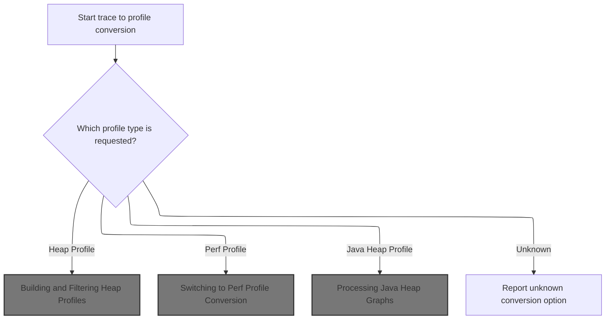
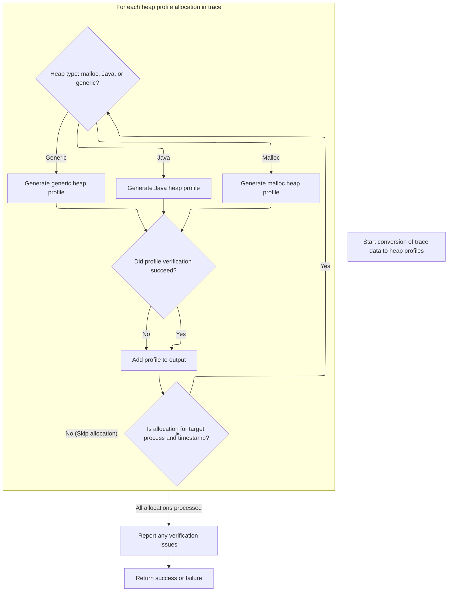
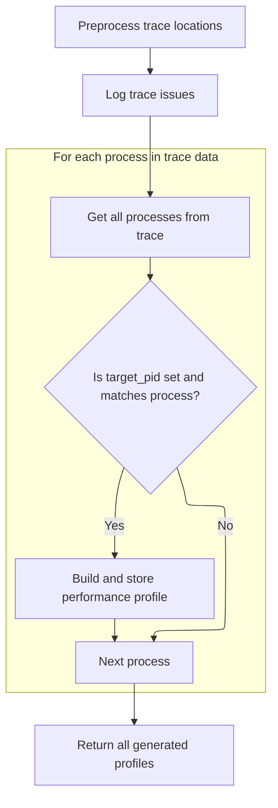
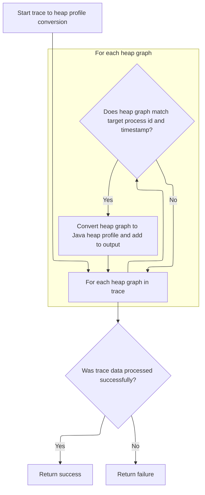

This document describes how trace data is converted into heap, performance, or Java heap profiles based on the selected mode. The resulting profiles enable analysis and visualization of memory allocations, CPU activity, or Java heap usage.

# Dispatching Profile Conversion Based on Mode



<SwmSnippet path="/src/traceconv/pprof_builder.cc" line="1182">

---

In <SwmToken path="src/traceconv/pprof_builder.cc" pos="1182:2:2" line-data="bool TraceToPprof(trace_processor::TraceProcessor* tp,">`TraceToPprof`</SwmToken>, we start by checking the conversion mode and immediately delegate to the corresponding profile conversion function. For heap profiles, we call <SwmToken path="src/traceconv/pprof_builder.cc" pos="1192:5:5" line-data="      return heap_profile::TraceToHeapPprof(tp, output, annotate_frames, pid,">`TraceToHeapPprof`</SwmToken> to handle the specifics of extracting and serializing heap allocation data. This separation lets each profile type be processed with its own logic, keeping things clean and maintainable.

```c++
bool TraceToPprof(trace_processor::TraceProcessor* tp,
                  std::vector<SerializedProfile>* output,
                  ConversionMode mode,
                  uint64_t flags,
                  uint64_t pid,
                  const std::vector<uint64_t>& timestamps) {
  bool annotate_frames =
      flags & static_cast<uint64_t>(ConversionFlags::kAnnotateFrames);
  switch (mode) {
    case (ConversionMode::kHeapProfile):
      return heap_profile::TraceToHeapPprof(tp, output, annotate_frames, pid,
                                            timestamps);
```

---

</SwmSnippet>

## Building and Filtering Heap Profiles



<SwmSnippet path="/src/traceconv/pprof_builder.cc" line="763">

---

In <SwmToken path="src/traceconv/pprof_builder.cc" pos="763:4:4" line-data="static bool TraceToHeapPprof(trace_processor::TraceProcessor* tp,">`TraceToHeapPprof`</SwmToken>, we loop through heap profile allocations from the trace, filtering by PID and timestamp if needed. For each allocation, we pick the right set of views based on the heap type, set up the sample types, and serialize the profile. Only allocations matching the filters are processed, and the output is tailored to the heap's semantics.

```c++
static bool TraceToHeapPprof(trace_processor::TraceProcessor* tp,
                             std::vector<SerializedProfile>* output,
                             bool annotate_frames,
                             uint64_t target_pid,
                             const std::vector<uint64_t>& target_timestamps) {
  trace_processor::StringPool interner;
  LocationTracker locations =
      PreprocessLocations(tp, &interner, annotate_frames);

  bool any_fail = false;
  Iterator it = tp->ExecuteQuery(
      "select distinct hpa.upid, hpa.ts, p.pid, hpa.heap_name "
      "from heap_profile_allocation hpa, "
      "process p where p.upid = hpa.upid;");
  while (it.Next()) {
    GProfileBuilder builder(locations, &interner);
    uint64_t upid = static_cast<uint64_t>(it.Get(0).AsLong());
    uint64_t ts = static_cast<uint64_t>(it.Get(1).AsLong());
    uint64_t profile_pid = static_cast<uint64_t>(it.Get(2).AsLong());
    const char* heap_name = it.Get(3).AsString();
    if ((target_pid > 0 && profile_pid != target_pid) ||
        (!target_timestamps.empty() &&
         std::find(target_timestamps.begin(), target_timestamps.end(), ts) ==
             target_timestamps.end())) {
      continue;
    }

    if (!VerifyPIDStats(tp, profile_pid))
      any_fail = true;

    std::vector<View> views;
    if (base::StringView(heap_name) == "libc.malloc") {
      views.assign(std::begin(kMallocViews), std::end(kMallocViews));
    } else if (base::StringView(heap_name) == "com.android.art") {
      views.assign(std::begin(kJavaSamplesViews), std::end(kJavaSamplesViews));
    } else {
      views.assign(std::begin(kGenericViews), std::end(kGenericViews));
    }

    std::vector<std::pair<std::string, std::string>> sample_types;
    for (const View& view : views) {
      sample_types.emplace_back(view.type, view.unit);
    }
    builder.WriteSampleTypes(sample_types);

    std::vector<Iterator> view_its =
        BuildViewIterators(tp, upid, ts, heap_name, views);
    std::string profile_proto;
    if (WriteAllocations(&builder, &view_its)) {
      profile_proto = builder.CompleteProfile(tp);
    }
    output->emplace_back(
        SerializedProfile{ProfileType::kHeapProfile, profile_pid,
                          std::move(profile_proto), heap_name});
  }
```

---

</SwmSnippet>

<SwmSnippet path="/src/traceconv/pprof_builder.cc" line="819">

---

<SwmToken path="src/traceconv/pprof_builder.cc" pos="763:4:4" line-data="static bool TraceToHeapPprof(trace_processor::TraceProcessor* tp,">`TraceToHeapPprof`</SwmToken> returns true if the SQL iterator was valid, otherwise false.

```c++
  if (!it.Status().ok()) {
    PERFETTO_DFATAL_OR_ELOG("Invalid iterator: %s",
                            it.Status().message().c_str());
    return false;
  }
  if (any_fail) {
    PERFETTO_ELOG(
        "One or more of your profiles had an issue. Please consult "
        "https://perfetto.dev/docs/data-sources/"
        "native-heap-profiler#troubleshooting");
  }
  return true;
}
```

---

</SwmSnippet>

## Switching to Perf Profile Conversion



<SwmSnippet path="/src/traceconv/pprof_builder.cc" line="1194">

---

Back in <SwmToken path="src/traceconv/pprof_builder.cc" pos="1182:2:2" line-data="bool TraceToPprof(trace_processor::TraceProcessor* tp,">`TraceToPprof`</SwmToken>, after heap profiles, we call <SwmToken path="src/traceconv/pprof_builder.cc" pos="1195:5:5" line-data="      return perf_profile::TraceToPerfPprof(tp, output, annotate_frames, pid);">`TraceToPerfPprof`</SwmToken> for perf profile modes to handle CPU profiling data.

```c++
    case (ConversionMode::kPerfProfile):
      return perf_profile::TraceToPerfPprof(tp, output, annotate_frames, pid);
```

---

</SwmSnippet>

<SwmSnippet path="/src/traceconv/pprof_builder.cc" line="1134">

---

<SwmToken path="src/traceconv/pprof_builder.cc" pos="1134:4:4" line-data="static bool TraceToPerfPprof(trace_processor::TraceProcessor* tp,">`TraceToPerfPprof`</SwmToken> groups perf samples by process, filtering by PID if needed. For each process, it builds a profile by querying callsite IDs, adds each sample, and serializes the result. This way, each output profile is process-specific and contains only relevant samples.

```c++
static bool TraceToPerfPprof(trace_processor::TraceProcessor* tp,
                             std::vector<SerializedProfile>* output,
                             bool annotate_frames,
                             uint64_t target_pid) {
  trace_processor::StringPool interner;
  LocationTracker locations =
      PreprocessLocations(tp, &interner, annotate_frames);

  LogTracePerfEventIssues(tp);

  // Aggregate samples by upid when building profiles.
  std::map<uint64_t, ProcessInfo> process_map = GetProcessMap(tp);
  for (const auto& p : process_map) {
    const ProcessInfo& process = p.second;

    if (target_pid != 0 && process.pid != target_pid)
      continue;

    GProfileBuilder builder(locations, &interner);
    builder.WriteSampleTypes({{"samples", "count"}});

    std::string query = "select callsite_id from perf_sample where utid in (" +
                        AsCsvString(process.utids) +
                        ") and callsite_id is not null order by ts asc;";

    protozero::PackedVarInt single_count_value;
    single_count_value.Append(1);

    Iterator it = tp->ExecuteQuery(query);
    while (it.Next()) {
      int64_t callsite_id = static_cast<int64_t>(it.Get(0).AsLong());
      builder.AddSample(single_count_value, callsite_id);
    }
    if (!it.Status().ok()) {
      PERFETTO_DFATAL_OR_ELOG("Failed to iterate over samples: %s",
                              it.Status().c_message());
      return false;
    }

    std::string profile_proto = builder.CompleteProfile(tp);
    output->emplace_back(SerializedProfile{
        ProfileType::kPerfProfile, process.pid, std::move(profile_proto), ""});
  }
```

---

</SwmSnippet>

<SwmSnippet path="/src/traceconv/pprof_builder.cc" line="1196">

---

Back in <SwmToken path="src/traceconv/pprof_builder.cc" pos="1182:2:2" line-data="bool TraceToPprof(trace_processor::TraceProcessor* tp,">`TraceToPprof`</SwmToken>, after handling perf profiles, we check if the mode is for Java heap profiles and call the Java-specific <SwmToken path="src/traceconv/pprof_builder.cc" pos="1197:5:5" line-data="      return java_heap_profile::TraceToHeapPprof(tp, output, pid, timestamps);">`TraceToHeapPprof`</SwmToken>. This lets us process Java heap graphs separately from native heap or perf data.

```c++
    case (ConversionMode::kJavaHeapProfile):
      return java_heap_profile::TraceToHeapPprof(tp, output, pid, timestamps);
  }
```

---

</SwmSnippet>

## Processing Java Heap Graphs



<SwmSnippet path="/src/traceconv/pprof_builder.cc" line="995">

---

In <SwmToken path="src/traceconv/pprof_builder.cc" pos="995:2:2" line-data="bool TraceToHeapPprof(trace_processor::TraceProcessor* tp,">`TraceToHeapPprof`</SwmToken> (Java version), we query for unique heap graph samples and process each one, filtering by PID and timestamp if needed. For each valid sample, we set up Java allocation views, preprocess locations, and serialize the heap graph into a profile.

```c++
bool TraceToHeapPprof(trace_processor::TraceProcessor* tp,
                      std::vector<SerializedProfile>* output,
                      uint64_t target_pid,
                      const std::vector<uint64_t>& target_timestamps) {
  trace_processor::StringPool interner;

  // Find all heap graphs available in the trace and iterate over them
  Iterator it = tp->ExecuteQuery(
      "select distinct hgo.graph_sample_ts, hgo.upid, p.pid from "
      "heap_graph_object hgo join process p using (upid)");

  while (it.Next()) {
    uint64_t ts = static_cast<uint64_t>(it.Get(0).AsLong());
    uint64_t upid = static_cast<uint64_t>(it.Get(1).AsLong());
    uint64_t profile_pid = static_cast<uint64_t>(it.Get(2).AsLong());

    if ((target_pid > 0 && profile_pid != target_pid) ||
        (!target_timestamps.empty() &&
         std::find(target_timestamps.begin(), target_timestamps.end(), ts) ==
             target_timestamps.end())) {
      continue;
    }

    // flamegraph id -> view values
    std::unordered_map<int64_t, std::vector<int64_t>> view_values;

    std::vector<View> views;
    views.assign(std::begin(kJavaAllocationViews),
                 std::end(kJavaAllocationViews));

    LocationTracker locations = PreprocessLocationsForJavaHeap(
        tp, &interner, views, view_values, upid, ts);

    GProfileBuilder builder(locations, &interner);

    std::vector<std::pair<std::string, std::string>> sample_types;
    for (const auto& view : views) {
      sample_types.emplace_back(view.type, view.unit);
    }
    builder.WriteSampleTypes(sample_types);

    std::string profile_proto;
    if (WriteAllocations(&builder, view_values)) {
      profile_proto = builder.CompleteProfile(tp, /*write_mappings=*/false);
    }

    output->emplace_back(SerializedProfile{ProfileType::kJavaHeapProfile,
                                           profile_pid,
                                           std::move(profile_proto), ""});
  }
```

---

</SwmSnippet>

<SwmSnippet path="/src/traceconv/pprof_builder.cc" line="1046">

---

<SwmToken path="src/traceconv/pprof_builder.cc" pos="763:4:4" line-data="static bool TraceToHeapPprof(trace_processor::TraceProcessor* tp,">`TraceToHeapPprof`</SwmToken> returns true if the SQL iterator was valid, otherwise false.

```c++
  if (!it.Status().ok()) {
    PERFETTO_DFATAL_OR_ELOG("Invalid iterator: %s",
                            it.Status().message().c_str());
    return false;
  }

  return true;
}
```

---

</SwmSnippet>

## Handling Unknown Conversion Modes

<SwmSnippet path="/src/traceconv/pprof_builder.cc" line="1199">

---

Back in <SwmToken path="src/traceconv/pprof_builder.cc" pos="1182:2:2" line-data="bool TraceToPprof(trace_processor::TraceProcessor* tp,">`TraceToPprof`</SwmToken>, if the mode is unknown, we abort with a fatal error.

```c++
  PERFETTO_FATAL("unknown conversion option");  // for gcc
}
```

---

</SwmSnippet>

&nbsp;

*This is an auto-generated document by Swimm 🌊 and has not yet been verified by a human*

<SwmMeta version="3.0.0" repo-id="Z2l0aHViJTNBJTNBY3BsdXNwbHVzLXBlcmZldHRvJTNBJTNBcmljYXJkb2xvcGV6Zw==" repo-name="cplusplus-perfetto"><sup>Powered by [Swimm](https://app.swimm.io/)</sup></SwmMeta>
