This document describes the process that takes place when a trace is loaded, enabling a suite of user commands for interacting with tracks. Users can perform actions such as searching, pinning, expanding, collapsing, and copying tracks, with the system ensuring that track hierarchies are preserved during copy operations. Additional commands for adding notes and navigating track events are also registered.

# Registering Track Commands on Trace Load

<SwmSnippet path="/ui/src/core_plugins/dev.perfetto.TracklUtils/index.ts" line="45">

---

In <SwmToken path="ui/src/core_plugins/dev.perfetto.TracklUtils/index.ts" pos="45:3:3" line-data="  async onTraceLoad(ctx: Trace): Promise&lt;void&gt; {">`onTraceLoad`</SwmToken>, we set up all the commands users can run on tracks once a trace is loaded. This includes searching, pinning, expanding, collapsing, and copying tracks. We need to call <SwmToken path="ui/src/core_plugins/dev.perfetto.TracklUtils/index.ts" pos="318:1:1" line-data="        copyTracksWithAncestors(matchingTracks, targetWorkspace);">`copyTracksWithAncestors`</SwmToken> next because some commands (like copying tracks by regex with ancestors) require not just the selected tracks but also their parent nodes to be present in the target workspace, preserving the hierarchy.

```typescript
  async onTraceLoad(ctx: Trace): Promise<void> {
    // Register this command up front to block the print dialog from appearing
    // when pressing the hotkey before the trace is loaded.
    ctx.commands.registerCommand({
      id: 'dev.perfetto.FindTrackByName',
      name: 'Find track by name',
      callback: async () => {
        const tracksWithUris = ctx.currentWorkspace.flatTracksOrdered.filter(
          (track) => track.uri !== undefined,
        ) as ReadonlyArray<RequiredField<TrackNode, 'uri'>>;
        const track = await ctx.omnibox.prompt('Choose a track...', {
          values: tracksWithUris,
          getName: (track) => track.fullPath.join(' \u2023 '),
        });
        track &&
          ctx.selection.selectTrack(track.uri, {
            scrollToSelection: true,
          });
      },
      // This is analogous to the 'Find file' hotkey in VSCode.
      defaultHotkey: '!Mod+P',
    });

    ctx.commands.registerCommand({
      id: 'dev.perfetto.RunQueryInSelectedTimeWindow',
      name: `Run query in selected time window`,
      callback: async () => {
        const window = await getTimeSpanOfSelectionOrVisibleWindow(ctx);
        const omnibox = AppImpl.instance.omnibox;
        omnibox.setMode(OmniboxMode.Query);
        omnibox.setText(
          `select  where ts >= ${window.start} and ts < ${window.end}`,
        );
        omnibox.focus(/* cursorPlacement= */ 7);
      },
    });

    ctx.commands.registerCommand({
      id: 'dev.perfetto.FindTrackByUri',
      name: 'Find track by URI',
      callback: async () => {
        const tracksWithUris = ctx.currentWorkspace.flatTracksOrdered.filter(
          (track) => track.uri !== undefined,
        ) as ReadonlyArray<RequiredField<TrackNode, 'uri'>>;
        const track = await ctx.omnibox.prompt('Choose a track...', {
          values: tracksWithUris,
          getName: (track) => track.uri,
        });
        track &&
          ctx.selection.selectTrack(track.uri, {
            scrollToSelection: true,
          });
      },
    });

    ctx.commands.registerCommand({
      id: 'dev.perfetto.PinTrackByName',
      name: 'Pin track by name',
      defaultHotkey: 'Shift+T',
      callback: async () => {
        const tracksWithUris = ctx.currentWorkspace.flatTracksOrdered.filter(
          (track) => track.uri !== undefined,
        ) as ReadonlyArray<RequiredField<TrackNode, 'uri'>>;
        const track = await ctx.omnibox.prompt('Choose a track...', {
          values: tracksWithUris,
          getName: (track) => track.name,
        });
        track && track.pin();
      },
    });

    ctx.commands.registerCommand({
      id: 'dev.perfetto.PinTracksByRegex',
      name: 'Pin tracks by regex',
      callback: async (regexArg: unknown, nameOrPathArg: unknown) => {
        const nameOrPath = await getNameOrPathFromArgOrPrompt(
          ctx,
          nameOrPathArg,
        );
        if (!nameOrPath) return;

        const regex = await getRegexFromArgOrPrompt(
          ctx,
          regexArg,
          'Enter regex pattern to match track names...',
        );
        if (!regex) return;

        const matchingTracks = ctx.currentWorkspace.flatTracks.filter((track) =>
          testTrackWithRegex(track, regex, nameOrPath),
        );
        matchingTracks.forEach((track) => track.pin());
      },
    });

    ctx.commands.registerCommand({
      id: `dev.perfetto.PinSliceTracksFromSqlQuery`,
      name: 'Pin slice tracks from SQL query',
      callback: async (queryArg: unknown) => {
        const query = await getQueryFromArgOrPrompt(
          ctx,
          queryArg,
          'select id from slice where...',
        );
        if (!query) return;

        const matchingTracks = await resolveTracksFromSliceQuery(ctx, query);
        matchingTracks.forEach((track) => track.pin());
      },
    });

    ctx.commands.registerCommand({
      id: 'dev.perfetto.ExpandTracksByRegex',
      name: 'Expand tracks by regex',
      callback: async (regexArg: unknown, nameOrPathArg: unknown) => {
        const nameOrPath = await getNameOrPathFromArgOrPrompt(
          ctx,
          nameOrPathArg,
        );
        if (!nameOrPath) return;

        const regex = await getRegexFromArgOrPrompt(
          ctx,
          regexArg,
          'Enter regex pattern to match track names...',
        );
        if (!regex) return;

        const matchingTracks = ctx.currentWorkspace.flatTracks.filter((track) =>
          testTrackWithRegex(track, regex, nameOrPath),
        );
        matchingTracks.forEach((track) => track.expand());
      },
    });

    ctx.commands.registerCommand({
      id: 'dev.perfetto.CollapseTracksByRegex',
      name: 'Collapse tracks by regex',
      callback: async (regexArg: unknown, nameOrPathArg: unknown) => {
        const nameOrPath = await getNameOrPathFromArgOrPrompt(
          ctx,
          nameOrPathArg,
        );
        if (!nameOrPath) return;

        const regex = await getRegexFromArgOrPrompt(
          ctx,
          regexArg,
          'Enter regex pattern to match track names...',
        );
        if (!regex) return;

        const matchingTracks = ctx.currentWorkspace.flatTracks.filter((track) =>
          testTrackWithRegex(track, regex, nameOrPath),
        );
        matchingTracks.forEach((track) => track.collapse());
      },
    });

    ctx.commands.registerCommand({
      id: 'dev.perfetto.CopyTracksToWorkspaceByRegex',
      name: 'Copy tracks to workspace by regex',
      callback: async (
        regexArg: unknown,
        workspaceNameArg: unknown,
        nameOrPathArg: unknown,
      ) => {
        const nameOrPath = await getNameOrPathFromArgOrPrompt(
          ctx,
          nameOrPathArg,
        );
        if (!nameOrPath) return;

        const regex = await getRegexFromArgOrPrompt(
          ctx,
          regexArg,
          'Enter regex pattern to match track names...',
        );
        if (!regex) return;

        const workspaceName =
          typeof workspaceNameArg === 'string'
            ? workspaceNameArg
            : await ctx.omnibox.prompt('Enter workspace name...');
        if (!workspaceName) return;

        // Create or get the target workspace
        const targetWorkspace =
          ctx.workspaces.all.find((ws) => ws.title === workspaceName) ??
          ctx.workspaces.createEmptyWorkspace(workspaceName);

        // Find matching tracks from current workspace
        const matchingTracks = ctx.currentWorkspace.flatTracks.filter((track) =>
          testTrackWithRegex(track, regex, nameOrPath),
        );

        // Copy matching tracks to target workspace
        matchingTracks.forEach((track) => {
          targetWorkspace.addChildInOrder(track.clone(true));
        });
      },
    });

    ctx.commands.registerCommand({
      id: 'dev.perfetto.CopySliceTracksToWorkspaceBySql',
      name: 'Copy slice tracks to workspace from SQL query',
      callback: async (queryArg: unknown, workspaceNameArg: unknown) => {
        const query = await getQueryFromArgOrPrompt(
          ctx,
          queryArg,
          'select id from slice where...',
        );
        if (!query) return;

        const workspaceName =
          typeof workspaceNameArg === 'string'
            ? workspaceNameArg
            : await ctx.omnibox.prompt('Enter workspace name...');
        if (!workspaceName) return;

        // Create or get the target workspace
        const targetWorkspace =
          ctx.workspaces.all.find((ws) => ws.title === workspaceName) ??
          ctx.workspaces.createEmptyWorkspace(workspaceName);

        // Find matching tracks from current workspace
        const matchingTracks = await resolveTracksFromSliceQuery(ctx, query);

        // Copy matching tracks to target workspace
        matchingTracks.forEach((track) => {
          targetWorkspace.addChildInOrder(track.clone(true));
        });
      },
    });

    ctx.commands.registerCommand({
      id: 'dev.perfetto.CopyTracksToWorkspaceByRegexWithAncestors',
      name: 'Copy tracks to workspace by regex (with ancestors)',
      callback: async (
        regexArg: unknown,
        workspaceNameArg: unknown,
        nameOrPathArg: unknown,
      ) => {
        const nameOrPath = await getNameOrPathFromArgOrPrompt(
          ctx,
          nameOrPathArg,
        );
        if (!nameOrPath) return;

        const regex = await getRegexFromArgOrPrompt(
          ctx,
          regexArg,
          'Enter regex pattern to match track names...',
        );
        if (!regex) return;

        const workspaceName =
          typeof workspaceNameArg === 'string'
            ? workspaceNameArg
            : await ctx.omnibox.prompt('Enter workspace name...');
        if (!workspaceName) return;

        // Create or get the target workspace
        const targetWorkspace =
          ctx.workspaces.all.find((ws) => ws.title === workspaceName) ??
          ctx.workspaces.createEmptyWorkspace(workspaceName);

        // Find matching tracks from current workspace
        const matchingTracks = ctx.currentWorkspace.flatTracks.filter((track) =>
          testTrackWithRegex(track, regex, nameOrPath),
        );

        // Copy matching tracks with their ancestors to target workspace
        copyTracksWithAncestors(matchingTracks, targetWorkspace);
      },
    });

    ctx.commands.registerCommand({
      id: 'dev.perfetto.CopySliceTracksToWorkspaceBySqlWithAncestors',
      name: 'Copy slice tracks to workspace from SQL query (with ancestors)',
      callback: async (queryArg: unknown, workspaceNameArg: unknown) => {
        const query = await getQueryFromArgOrPrompt(
          ctx,
          queryArg,
          'select id from slice where...',
        );
        if (!query) return;

        const workspaceName =
          typeof workspaceNameArg === 'string'
            ? workspaceNameArg
            : await ctx.omnibox.prompt('Enter workspace name...');
        if (!workspaceName) return;

        // Create or get the target workspace
        const targetWorkspace =
          ctx.workspaces.all.find((ws) => ws.title === workspaceName) ??
          ctx.workspaces.createEmptyWorkspace(workspaceName);

        // Find matching tracks from current workspace
        const matchingTracks = await resolveTracksFromSliceQuery(ctx, query);

        // Copy matching tracks with their ancestors to target workspace
        copyTracksWithAncestors(matchingTracks, targetWorkspace);
      },
    });

```

---

</SwmSnippet>

## Copying Tracks and Their Ancestors

```mermaid
%%{init: {"flowchart": {"defaultRenderer": "elk"}} }%%
flowchart TD
    node1["Start copying tracks and ancestors"]
    click node1 openCode "ui/src/core_plugins/dev.perfetto.TracklUtils/index.ts:525:539"
    subgraph loop1["For each track"]
      node1 --> node2["Collect track and its ancestors"]
      click node2 openCode "ui/src/core_plugins/dev.perfetto.TracklUtils/index.ts:539:553"
    end
    node2 --> node3["Sort nodes by hierarchy"]
    click node3 openCode "ui/src/core_plugins/dev.perfetto.TracklUtils/index.ts:555:559"
    subgraph loop2["For each sorted node"]
      node3 --> node4{"Is node explicitly matched?"}
      click node4 openCode "ui/src/core_plugins/dev.perfetto.TracklUtils/index.ts:570:571"
      node4 -->|"Yes"| node5["Deep clone node"]
      click node5 openCode "ui/src/public/workspace.ts:485:493"
      node4 -->|"No"| node6["Shallow clone node"]
      click node6 openCode "ui/src/public/workspace.ts:485:493"
      node5 --> node7{"Is node a root node?"}
      node6 --> node7
      click node7 openCode "ui/src/core_plugins/dev.perfetto.TracklUtils/index.ts:575:576"
      node7 -->|"Yes"| node8["Add as root to workspace"]
      click node8 openCode "ui/src/core_plugins/dev.perfetto.TracklUtils/index.ts:578:579"
      node7 -->|"No"| node9{"Is parent already cloned?"}
      click node9 openCode "ui/src/core_plugins/dev.perfetto.TracklUtils/index.ts:581:582"
      node9 -->|"Yes"| node10["Add as child to cloned parent"]
      click node10 openCode "ui/src/core_plugins/dev.perfetto.TracklUtils/index.ts:583:584"
      node9 -->|"No"| node8
      node10 --> node12["Next node"]
      node8 --> node12
    end
    node12 --> node13["Done"]
    click node13 openCode "ui/src/core_plugins/dev.perfetto.TracklUtils/index.ts:590:590"

classDef HeadingStyle fill:#777777,stroke:#333,stroke-width:2px;

%% Swimm:
%% %%{init: {"flowchart": {"defaultRenderer": "elk"}} }%%
%% flowchart TD
%%     node1["Start copying tracks and ancestors"]
%%     click node1 openCode "<SwmPath>[ui/…/dev.perfetto.TracklUtils/index.ts](ui/src/core_plugins/dev.perfetto.TracklUtils/index.ts)</SwmPath>:525:539"
%%     subgraph loop1["For each track"]
%%       node1 --> node2["Collect track and its ancestors"]
%%       click node2 openCode "<SwmPath>[ui/…/dev.perfetto.TracklUtils/index.ts](ui/src/core_plugins/dev.perfetto.TracklUtils/index.ts)</SwmPath>:539:553"
%%     end
%%     node2 --> node3["Sort nodes by hierarchy"]
%%     click node3 openCode "<SwmPath>[ui/…/dev.perfetto.TracklUtils/index.ts](ui/src/core_plugins/dev.perfetto.TracklUtils/index.ts)</SwmPath>:555:559"
%%     subgraph loop2["For each sorted node"]
%%       node3 --> node4{"Is node explicitly matched?"}
%%       click node4 openCode "<SwmPath>[ui/…/dev.perfetto.TracklUtils/index.ts](ui/src/core_plugins/dev.perfetto.TracklUtils/index.ts)</SwmPath>:570:571"
%%       node4 -->|"Yes"| node5["Deep clone node"]
%%       click node5 openCode "<SwmPath>[ui/…/public/workspace.ts](ui/src/public/workspace.ts)</SwmPath>:485:493"
%%       node4 -->|"No"| node6["Shallow clone node"]
%%       click node6 openCode "<SwmPath>[ui/…/public/workspace.ts](ui/src/public/workspace.ts)</SwmPath>:485:493"
%%       node5 --> node7{"Is node a root node?"}
%%       node6 --> node7
%%       click node7 openCode "<SwmPath>[ui/…/dev.perfetto.TracklUtils/index.ts](ui/src/core_plugins/dev.perfetto.TracklUtils/index.ts)</SwmPath>:575:576"
%%       node7 -->|"Yes"| node8["Add as root to workspace"]
%%       click node8 openCode "<SwmPath>[ui/…/dev.perfetto.TracklUtils/index.ts](ui/src/core_plugins/dev.perfetto.TracklUtils/index.ts)</SwmPath>:578:579"
%%       node7 -->|"No"| node9{"Is parent already cloned?"}
%%       click node9 openCode "<SwmPath>[ui/…/dev.perfetto.TracklUtils/index.ts](ui/src/core_plugins/dev.perfetto.TracklUtils/index.ts)</SwmPath>:581:582"
%%       node9 -->|"Yes"| node10["Add as child to cloned parent"]
%%       click node10 openCode "<SwmPath>[ui/…/dev.perfetto.TracklUtils/index.ts](ui/src/core_plugins/dev.perfetto.TracklUtils/index.ts)</SwmPath>:583:584"
%%       node9 -->|"No"| node8
%%       node10 --> node12["Next node"]
%%       node8 --> node12
%%     end
%%     node12 --> node13["Done"]
%%     click node13 openCode "<SwmPath>[ui/…/dev.perfetto.TracklUtils/index.ts](ui/src/core_plugins/dev.perfetto.TracklUtils/index.ts)</SwmPath>:590:590"
%% 
%% classDef HeadingStyle fill:#777777,stroke:#333,stroke-width:2px;
```



<SwmSnippet path="/ui/src/core_plugins/dev.perfetto.TracklUtils/index.ts" line="525">

---

In <SwmToken path="ui/src/core_plugins/dev.perfetto.TracklUtils/index.ts" pos="525:2:2" line-data="function copyTracksWithAncestors(">`copyTracksWithAncestors`</SwmToken>, we collect tracks and ancestors, sort by depth, and prep for cloning so the workspace hierarchy stays correct.

```typescript
function copyTracksWithAncestors(
  tracks: ReadonlyArray<TrackNode>,
  targetWorkspace: Workspace,
) {
  // Map to track old node IDs to new cloned nodes
  const nodeMap = new Map<string, TrackNode>();

  // Keep track of which nodes were explicitly matched (should be deep cloned)
  const explicitlyMatchedNodes = new Set<TrackNode>(tracks);

  // Collect all nodes that need to be copied (tracks + their ancestors)
  // Also cache the depth (ancestor count) for each node to avoid repeated calls
  const nodesToCopy = new Map<TrackNode, number>();

  for (const track of tracks) {
    // Add the track itself if not already added
    if (!nodesToCopy.has(track)) {
      nodesToCopy.set(track, track.getAncestors().length);
    }

    // Add all ancestors
    const ancestors = track.getAncestors();
    ancestors.forEach((ancestor, index) => {
      if (!nodesToCopy.has(ancestor)) {
        // The depth of an ancestor is its index in the ancestors array
        nodesToCopy.set(ancestor, index);
      }
    });
  }
```

---

</SwmSnippet>

<SwmSnippet path="/ui/src/core_plugins/dev.perfetto.TracklUtils/index.ts" line="555">

---

After sorting nodes by depth, we loop through each node and decide whether to deep or shallow clone it. We call the clone method next (from <SwmPath>[ui/…/public/workspace.ts](ui/src/public/workspace.ts)</SwmPath>) to actually create the new node instances, using deep cloning for selected tracks and shallow for ancestors. This step is what actually copies the nodes into the target workspace.

```typescript
  // Sort nodes by depth (root nodes first) to ensure parents are created before
  // children.
  const sortedNodes = Array.from(nodesToCopy.entries())
    .sort(([, depthA], [, depthB]) => depthA - depthB)
    .map(([node]) => node);

  // Clone and add nodes, maintaining parent-child relationships
  for (const node of sortedNodes) {
    // Check if we've already cloned this node
    if (nodeMap.has(node.id)) {
      continue;
    }

    // Deep clone only if this node was explicitly matched, otherwise shallow
    // clone
    const shouldDeepClone = explicitlyMatchedNodes.has(node);
    const clonedNode = node.clone(shouldDeepClone);
```

---

</SwmSnippet>

<SwmSnippet path="/ui/src/public/workspace.ts" line="485">

---

<SwmToken path="ui/src/public/workspace.ts" pos="485:1:1" line-data="  clone(deep = false): TrackNode {">`clone`</SwmToken> creates a new <SwmToken path="ui/src/public/workspace.ts" pos="485:11:11" line-data="  clone(deep = false): TrackNode {">`TrackNode`</SwmToken> with the same properties as the original, but leaves the id unset to avoid conflicts. If deep cloning is requested, it recursively clones all children and attaches them to the new node. This is how we get either a full copy or just a shell of the node, depending on the deep flag.

```typescript
  clone(deep = false): TrackNode {
    const cloned = new TrackNode({...this, id: undefined});
    if (deep) {
      this.children.forEach((c) => {
        cloned.addChildLast(c.clone(deep));
      });
    }
    return cloned;
  }
```

---

</SwmSnippet>

<SwmSnippet path="/ui/src/core_plugins/dev.perfetto.TracklUtils/index.ts" line="572">

---

After cloning, <SwmToken path="ui/src/core_plugins/dev.perfetto.TracklUtils/index.ts" pos="318:1:1" line-data="        copyTracksWithAncestors(matchingTracks, targetWorkspace);">`copyTracksWithAncestors`</SwmToken> attaches each node to its parent or as a root, keeping the structure correct.

```typescript
    nodeMap.set(node.id, clonedNode);

    // Find the parent in the target workspace
    const parent = node.parent;
    if (!parent || parent.name === '') {
      // This is a root-level node
      targetWorkspace.addChildInOrder(clonedNode);
    } else {
      // Find the cloned parent node
      const clonedParent = nodeMap.get(parent.id);
      if (clonedParent) {
        clonedParent.addChildInOrder(clonedNode);
      } else {
        // Shouldn't happen if we sorted correctly, but fallback to root
        targetWorkspace.addChildInOrder(clonedNode);
      }
    }
  }
}
```

---

</SwmSnippet>

## Registering Additional Trace Commands

```mermaid
%%{init: {"flowchart": {"defaultRenderer": "elk"}} }%%
flowchart TD
    node1["Register command: Add note at UTC timestamp"]
    click node1 openCode "ui/src/core_plugins/dev.perfetto.TracklUtils/index.ts:352:391"
    node1 --> node2{"Is timestamp provided?"}
    click node2 openCode "ui/src/core_plugins/dev.perfetto.TracklUtils/index.ts:355:362"
    node2 -->|"Yes"| node3{"Is timestamp in milliseconds?"}
    click node3 openCode "ui/src/core_plugins/dev.perfetto.TracklUtils/index.ts:371:377"
    node2 -->|"No"| node4["Prompt user for timestamp"]
    click node4 openCode "ui/src/core_plugins/dev.perfetto.TracklUtils/index.ts:359:361"
    node3 -->|"Yes"| node5["Convert milliseconds to trace time"]
    click node5 openCode "ui/src/core_plugins/dev.perfetto.TracklUtils/index.ts:373:385"
    node3 -->|"No"| node6["Convert ISO format to trace time"]
    click node6 openCode "ui/src/core_plugins/dev.perfetto.TracklUtils/index.ts:376:385"
    node5 --> node7{"Is note text provided?"}
    click node7 openCode "ui/src/core_plugins/dev.perfetto.TracklUtils/index.ts:364:368"
    node6 --> node7
    node4 --> node3
    node7 -->|"Yes"| node8["Add note to trace"]
    click node8 openCode "ui/src/core_plugins/dev.perfetto.TracklUtils/index.ts:387:390"
    node7 -->|"No"| node9["Prompt user for note text"]
    click node9 openCode "ui/src/core_plugins/dev.perfetto.TracklUtils/index.ts:367:367"
    node9 --> node8
    node8 --> node10["Register command: Select next track event"]
    click node10 openCode "ui/src/core_plugins/dev.perfetto.TracklUtils/index.ts:394:401"
    node10 --> node11["Register command: Select previous track event"]
    click node11 openCode "ui/src/core_plugins/dev.perfetto.TracklUtils/index.ts:403:410"
    node11 --> node12{"Is Dvorak hotkey setting enabled?"}
    click node12 openCode "ui/src/core_plugins/dev.perfetto.TracklUtils/index.ts:406:406"
    node12 -->|"Yes"| node13["Use default hotkey"]
    click node13 openCode "ui/src/core_plugins/dev.perfetto.TracklUtils/index.ts:406:406"
    node12 -->|"No"| node14["Use ',' as hotkey"]
    click node14 openCode "ui/src/core_plugins/dev.perfetto.TracklUtils/index.ts:406:406"

classDef HeadingStyle fill:#777777,stroke:#333,stroke-width:2px;

%% Swimm:
%% %%{init: {"flowchart": {"defaultRenderer": "elk"}} }%%
%% flowchart TD
%%     node1["Register command: Add note at UTC timestamp"]
%%     click node1 openCode "<SwmPath>[ui/…/dev.perfetto.TracklUtils/index.ts](ui/src/core_plugins/dev.perfetto.TracklUtils/index.ts)</SwmPath>:352:391"
%%     node1 --> node2{"Is timestamp provided?"}
%%     click node2 openCode "<SwmPath>[ui/…/dev.perfetto.TracklUtils/index.ts](ui/src/core_plugins/dev.perfetto.TracklUtils/index.ts)</SwmPath>:355:362"
%%     node2 -->|"Yes"| node3{"Is timestamp in milliseconds?"}
%%     click node3 openCode "<SwmPath>[ui/…/dev.perfetto.TracklUtils/index.ts](ui/src/core_plugins/dev.perfetto.TracklUtils/index.ts)</SwmPath>:371:377"
%%     node2 -->|"No"| node4["Prompt user for timestamp"]
%%     click node4 openCode "<SwmPath>[ui/…/dev.perfetto.TracklUtils/index.ts](ui/src/core_plugins/dev.perfetto.TracklUtils/index.ts)</SwmPath>:359:361"
%%     node3 -->|"Yes"| node5["Convert milliseconds to trace time"]
%%     click node5 openCode "<SwmPath>[ui/…/dev.perfetto.TracklUtils/index.ts](ui/src/core_plugins/dev.perfetto.TracklUtils/index.ts)</SwmPath>:373:385"
%%     node3 -->|"No"| node6["Convert ISO format to trace time"]
%%     click node6 openCode "<SwmPath>[ui/…/dev.perfetto.TracklUtils/index.ts](ui/src/core_plugins/dev.perfetto.TracklUtils/index.ts)</SwmPath>:376:385"
%%     node5 --> node7{"Is note text provided?"}
%%     click node7 openCode "<SwmPath>[ui/…/dev.perfetto.TracklUtils/index.ts](ui/src/core_plugins/dev.perfetto.TracklUtils/index.ts)</SwmPath>:364:368"
%%     node6 --> node7
%%     node4 --> node3
%%     node7 -->|"Yes"| node8["Add note to trace"]
%%     click node8 openCode "<SwmPath>[ui/…/dev.perfetto.TracklUtils/index.ts](ui/src/core_plugins/dev.perfetto.TracklUtils/index.ts)</SwmPath>:387:390"
%%     node7 -->|"No"| node9["Prompt user for note text"]
%%     click node9 openCode "<SwmPath>[ui/…/dev.perfetto.TracklUtils/index.ts](ui/src/core_plugins/dev.perfetto.TracklUtils/index.ts)</SwmPath>:367:367"
%%     node9 --> node8
%%     node8 --> node10["Register command: Select next track event"]
%%     click node10 openCode "<SwmPath>[ui/…/dev.perfetto.TracklUtils/index.ts](ui/src/core_plugins/dev.perfetto.TracklUtils/index.ts)</SwmPath>:394:401"
%%     node10 --> node11["Register command: Select previous track event"]
%%     click node11 openCode "<SwmPath>[ui/…/dev.perfetto.TracklUtils/index.ts](ui/src/core_plugins/dev.perfetto.TracklUtils/index.ts)</SwmPath>:403:410"
%%     node11 --> node12{"Is Dvorak hotkey setting enabled?"}
%%     click node12 openCode "<SwmPath>[ui/…/dev.perfetto.TracklUtils/index.ts](ui/src/core_plugins/dev.perfetto.TracklUtils/index.ts)</SwmPath>:406:406"
%%     node12 -->|"Yes"| node13["Use default hotkey"]
%%     click node13 openCode "<SwmPath>[ui/…/dev.perfetto.TracklUtils/index.ts](ui/src/core_plugins/dev.perfetto.TracklUtils/index.ts)</SwmPath>:406:406"
%%     node12 -->|"No"| node14["Use ',' as hotkey"]
%%     click node14 openCode "<SwmPath>[ui/…/dev.perfetto.TracklUtils/index.ts](ui/src/core_plugins/dev.perfetto.TracklUtils/index.ts)</SwmPath>:406:406"
%% 
%% classDef HeadingStyle fill:#777777,stroke:#333,stroke-width:2px;
```



<SwmSnippet path="/ui/src/core_plugins/dev.perfetto.TracklUtils/index.ts" line="352">

---

Now that we've finished copying tracks and their ancestors, `TrackUtilsPlugin.onTraceLoad` registers more commands for adding notes and selecting track events. These commands depend on the workspace having the right track structure, which was set up by the previous copy operation.

```typescript
    ctx.commands.registerCommand({
      id: 'dev.perfetto.AddNoteAtUtcTimestamp',
      name: 'Add note at UTC timestamp',
      callback: async (utcTimestampArg: unknown, noteTextArg: unknown) => {
        const utcTimestampStr =
          typeof utcTimestampArg === 'string'
            ? utcTimestampArg
            : await ctx.omnibox.prompt(
                'Enter UTC timestamp (ISO format or milliseconds)...',
              );
        if (!utcTimestampStr) return;

        const noteText =
          typeof noteTextArg === 'string'
            ? noteTextArg
            : await ctx.omnibox.prompt('Enter note text...');
        if (noteText === undefined) return;

        let utcDate: Date;
        if (/^\d+$/.test(utcTimestampStr)) {
          // Numeric timestamp in milliseconds
          utcDate = new Date(parseInt(utcTimestampStr, 10));
        } else {
          // ISO format timestamp
          utcDate = new Date(utcTimestampStr);
        }

        if (isNaN(utcDate.getTime())) {
          console.error(`Invalid timestamp format: ${utcTimestampStr}`);
          return;
        }

        // Convert UTC Date to trace time using the trace's unix offset
        const traceTime = Time.fromDate(utcDate, ctx.traceInfo.unixOffset);

        ctx.notes.addNote({
          timestamp: traceTime,
          text: noteText,
        });
      },
    });

    ctx.commands.registerCommand({
      id: 'dev.perfetto.SelectNextTrackEvent',
      name: 'Select next track event',
      defaultHotkey: '.',
      callback: async () => {
        await selectAdjacentTrackEvent(ctx, 'next');
      },
    });

    ctx.commands.registerCommand({
      id: 'dev.perfetto.SelectPreviousTrackEvent',
      name: 'Select previous track event',
      defaultHotkey: !TrackUtilsPlugin.dvorakSetting.get() ? ',' : undefined,
      callback: async () => {
        await selectAdjacentTrackEvent(ctx, 'prev');
      },
    });
  }
```

---

</SwmSnippet>

&nbsp;

*This is an auto-generated document by Swimm 🌊 and has not yet been verified by a human*

<SwmMeta version="3.0.0" repo-id="Z2l0aHViJTNBJTNBY3BsdXNwbHVzLXBlcmZldHRvJTNBJTNBcmljYXJkb2xvcGV6Zw==" repo-name="cplusplus-perfetto"><sup>Powered by [Swimm](https://app.swimm.io/)</sup></SwmMeta>
