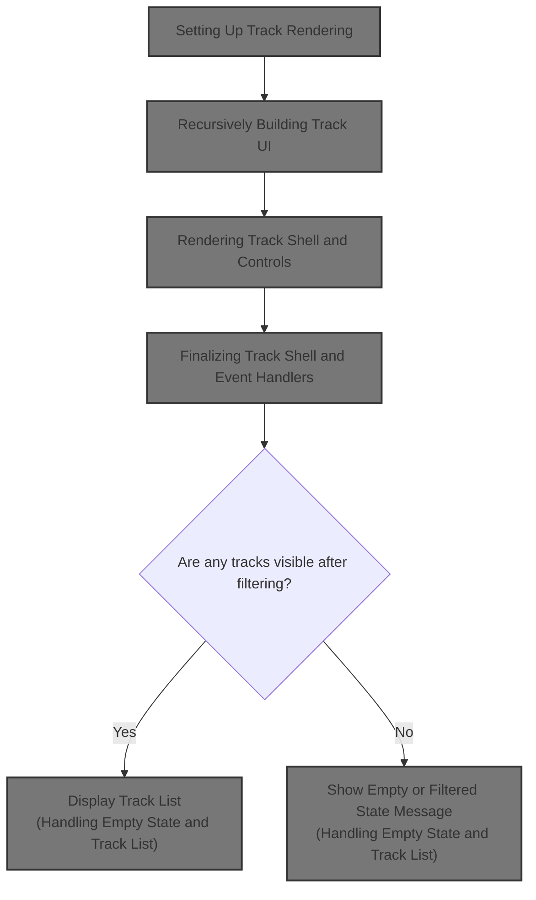

This document describes how the interactive track list is displayed and managed in the timeline UI. Users can view, filter, and interact with tracks in their workspace. The flow receives a tree of track nodes and user-applied filters as input, and outputs a visual representation of the tracks, including overlays, controls, and messages for empty or filtered states.



# Setting Up Track Rendering

```mermaid
%%{init: {"flowchart": {"defaultRenderer": "elk"}} }%%
flowchart TD
    node1["Prepare track tree view"] --> node2["For each child track node in rootNode, render using filter"]
    click node1 openCode "ui/src/frontend/timeline_page/track_tree_view.ts:146:157"
    subgraph loop1["For each child track node in rootNode"]
      node2 --> node6["Recursively Building Track UI"]
      
      node6 --> node7["Rendering Track Shell and Controls"]
      
    end
    node2 --> node3{"Are any tracks visible after filtering?"}
    node3 -->|"Yes"| node4["Display track tree overlay and DOM"]
    click node4 openCode "ui/src/frontend/timeline_page/track_tree_view.ts:267:305"
    node3 -->|"No"| node5{"Is filter applied?"}
    node5 -->|"Yes"| node8["Show 'no matching tracks' message"]
    click node8 openCode "ui/src/frontend/timeline_page/track_tree_view.ts:241:257"
    node5 -->|"No"| node9["Show 'empty workspace' message"]
    click node9 openCode "ui/src/frontend/timeline_page/track_tree_view.ts:258:264"

classDef HeadingStyle fill:#777777,stroke:#333,stroke-width:2px;
click node6 goToHeading "Recursively Building Track UI"
node6:::HeadingStyle
click node7 goToHeading "Rendering Track Shell and Controls"
node7:::HeadingStyle

%% Swimm:
%% %%{init: {"flowchart": {"defaultRenderer": "elk"}} }%%
%% flowchart TD
%%     node1["Prepare track tree view"] --> node2["For each child track node in <SwmToken path="ui/src/frontend/timeline_page/track_tree_view.ts" pos="153:1:1" line-data="      rootNode,">`rootNode`</SwmToken>, render using filter"]
%%     click node1 openCode "<SwmPath>[ui/…/timeline_page/track_tree_view.ts](ui/src/frontend/timeline_page/track_tree_view.ts)</SwmPath>:146:157"
%%     subgraph loop1["For each child track node in <SwmToken path="ui/src/frontend/timeline_page/track_tree_view.ts" pos="153:1:1" line-data="      rootNode,">`rootNode`</SwmToken>"]
%%       node2 --> node6["Recursively Building Track UI"]
%%       
%%       node6 --> node7["Rendering Track Shell and Controls"]
%%       
%%     end
%%     node2 --> node3{"Are any tracks visible after filtering?"}
%%     node3 -->|"Yes"| node4["Display track tree overlay and DOM"]
%%     click node4 openCode "<SwmPath>[ui/…/timeline_page/track_tree_view.ts](ui/src/frontend/timeline_page/track_tree_view.ts)</SwmPath>:267:305"
%%     node3 -->|"No"| node5{"Is filter applied?"}
%%     node5 -->|"Yes"| node8["Show 'no matching tracks' message"]
%%     click node8 openCode "<SwmPath>[ui/…/timeline_page/track_tree_view.ts](ui/src/frontend/timeline_page/track_tree_view.ts)</SwmPath>:241:257"
%%     node5 -->|"No"| node9["Show 'empty workspace' message"]
%%     click node9 openCode "<SwmPath>[ui/…/timeline_page/track_tree_view.ts](ui/src/frontend/timeline_page/track_tree_view.ts)</SwmPath>:258:264"
%% 
%% classDef HeadingStyle fill:#777777,stroke:#333,stroke-width:2px;
%% click node6 goToHeading "Recursively Building Track UI"
%% node6:::HeadingStyle
%% click node7 goToHeading "Rendering Track Shell and Controls"
%% node7:::HeadingStyle
```



<SwmSnippet path="/ui/src/frontend/timeline_page/track_tree_view.ts" line="146">

---

In `TrackTreeView.view`, we unpack the attributes and set up the filter logic. We need to call <SwmToken path="ui/src/frontend/timeline_page/track_tree_view.ts" pos="172:3:3" line-data="    const renderTrack = (">`renderTrack`</SwmToken> for each child of <SwmToken path="ui/src/frontend/timeline_page/track_tree_view.ts" pos="153:1:1" line-data="      rootNode,">`rootNode`</SwmToken> to actually build the UI for each track, applying the filter and managing vertical positioning. This sets up the recursive rendering flow.

```typescript
  view({attrs}: m.Vnode<TrackTreeViewAttrs>): m.Children {
    const {
      trace,
      scrollToNewTracks,
      canReorderNodes,
      canRemoveNodes,
      className,
      rootNode,
      trackFilter,
      filtersApplied,
    } = attrs;
    const renderedTracks = new Array<TrackView>();
    let top = 0;

    function filterMatches(node: TrackNode): boolean {
      if (!trackFilter) return true; // Filter ignored, show all tracks.

      // If this track name matches filter, show it.
      if (trackFilter(node)) return true;

      // Also show if any of our children match.
      if (node.children?.some(filterMatches)) return true;

      return false;
    }

    const renderTrack = (
      node: TrackNode,
      depth = 0,
      stickyTop = 0,
    ): m.Children => {
      // Skip nodes that don't match the filter and have no matching children.
      if (!filterMatches(node)) return undefined;

      if (node.headless) {
        // Headless nodes are invisible, just render children.
        return node.children.map((track) => {
          return renderTrack(track, depth, stickyTop);
        });
      }

      const trackView = new TrackView(trace, node, top);
      renderedTracks.push(trackView);

      // Advance the global top position.
      top += trackView.height;

      // Advance the sticky top position for our children, if we are sticky.
      const childStickyTop = node.isSummary
        ? stickyTop + trackView.height
        : stickyTop;

      const children =
        (node.expanded || filtersApplied) &&
        node.hasChildren &&
        node.children.map((track) =>
          renderTrack(track, depth + 1, childStickyTop),
        );

```

---

</SwmSnippet>

## Recursively Building Track UI

```mermaid
%%{init: {"flowchart": {"defaultRenderer": "elk"}} }%%
flowchart TD
  node1{"Does track match filter?"}
  click node1 openCode "ui/src/frontend/timeline_page/track_tree_view.ts:178:179"
  node1 -->|"No"| node2["Skip rendering"]
  click node2 openCode "ui/src/frontend/timeline_page/track_tree_view.ts:178:179"
  node1 -->|"Yes"| node3{"Is track headless?"}
  click node3 openCode "ui/src/frontend/timeline_page/track_tree_view.ts:180:185"
  node3 -->|"Yes"| node4["Render child tracks recursively"]
  click node4 openCode "ui/src/frontend/timeline_page/track_tree_view.ts:182:184"
  node3 -->|"No"| node5["Create track view and update layout"]
  click node5 openCode "ui/src/frontend/timeline_page/track_tree_view.ts:187:196"
  node5 --> node6{"Should render children? (Expanded or filtered, and has children)"}
  click node6 openCode "ui/src/frontend/timeline_page/track_tree_view.ts:198:203"
  subgraph loop1["For each child track"]
    node6 -->|"Yes"| node7["Render child tracks recursively"]
    click node7 openCode "ui/src/frontend/timeline_page/track_tree_view.ts:201:203"
  end
  node6 -->|"No"| node8["No child tracks rendered"]
  click node8 openCode "ui/src/frontend/timeline_page/track_tree_view.ts:198:203"
  node5 --> node9{"Is track on screen?"}
  click node9 openCode "ui/src/frontend/timeline_page/track_tree_view.ts:205:215"
  node9 --> node10["Render track with children"]
  click node10 openCode "ui/src/frontend/timeline_page/track_tree_view.ts:217:234"
classDef HeadingStyle fill:#777777,stroke:#333,stroke-width:2px;

%% Swimm:
%% %%{init: {"flowchart": {"defaultRenderer": "elk"}} }%%
%% flowchart TD
%%   node1{"Does track match filter?"}
%%   click node1 openCode "<SwmPath>[ui/…/timeline_page/track_tree_view.ts](ui/src/frontend/timeline_page/track_tree_view.ts)</SwmPath>:178:179"
%%   node1 -->|"No"| node2["Skip rendering"]
%%   click node2 openCode "<SwmPath>[ui/…/timeline_page/track_tree_view.ts](ui/src/frontend/timeline_page/track_tree_view.ts)</SwmPath>:178:179"
%%   node1 -->|"Yes"| node3{"Is track headless?"}
%%   click node3 openCode "<SwmPath>[ui/…/timeline_page/track_tree_view.ts](ui/src/frontend/timeline_page/track_tree_view.ts)</SwmPath>:180:185"
%%   node3 -->|"Yes"| node4["Render child tracks recursively"]
%%   click node4 openCode "<SwmPath>[ui/…/timeline_page/track_tree_view.ts](ui/src/frontend/timeline_page/track_tree_view.ts)</SwmPath>:182:184"
%%   node3 -->|"No"| node5["Create track view and update layout"]
%%   click node5 openCode "<SwmPath>[ui/…/timeline_page/track_tree_view.ts](ui/src/frontend/timeline_page/track_tree_view.ts)</SwmPath>:187:196"
%%   node5 --> node6{"Should render children? (Expanded or filtered, and has children)"}
%%   click node6 openCode "<SwmPath>[ui/…/timeline_page/track_tree_view.ts](ui/src/frontend/timeline_page/track_tree_view.ts)</SwmPath>:198:203"
%%   subgraph loop1["For each child track"]
%%     node6 -->|"Yes"| node7["Render child tracks recursively"]
%%     click node7 openCode "<SwmPath>[ui/…/timeline_page/track_tree_view.ts](ui/src/frontend/timeline_page/track_tree_view.ts)</SwmPath>:201:203"
%%   end
%%   node6 -->|"No"| node8["No child tracks rendered"]
%%   click node8 openCode "<SwmPath>[ui/…/timeline_page/track_tree_view.ts](ui/src/frontend/timeline_page/track_tree_view.ts)</SwmPath>:198:203"
%%   node5 --> node9{"Is track on screen?"}
%%   click node9 openCode "<SwmPath>[ui/…/timeline_page/track_tree_view.ts](ui/src/frontend/timeline_page/track_tree_view.ts)</SwmPath>:205:215"
%%   node9 --> node10["Render track with children"]
%%   click node10 openCode "<SwmPath>[ui/…/timeline_page/track_tree_view.ts](ui/src/frontend/timeline_page/track_tree_view.ts)</SwmPath>:217:234"
%% classDef HeadingStyle fill:#777777,stroke:#333,stroke-width:2px;
```



<SwmSnippet path="/ui/src/frontend/timeline_page/track_tree_view.ts" line="172">

---

<SwmToken path="ui/src/frontend/timeline_page/track_tree_view.ts" pos="172:3:3" line-data="    const renderTrack = (">`renderTrack`</SwmToken> handles filtering, headless nodes, vertical positioning, and recursive rendering of children. It also checks if each track is visible for performance. We call TrackView.renderDOM next to actually create the DOM for each track, passing all the relevant state.

```typescript
    const renderTrack = (
      node: TrackNode,
      depth = 0,
      stickyTop = 0,
    ): m.Children => {
      // Skip nodes that don't match the filter and have no matching children.
      if (!filterMatches(node)) return undefined;

      if (node.headless) {
        // Headless nodes are invisible, just render children.
        return node.children.map((track) => {
          return renderTrack(track, depth, stickyTop);
        });
      }

      const trackView = new TrackView(trace, node, top);
      renderedTracks.push(trackView);

      // Advance the global top position.
      top += trackView.height;

      // Advance the sticky top position for our children, if we are sticky.
      const childStickyTop = node.isSummary
        ? stickyTop + trackView.height
        : stickyTop;

      const children =
        (node.expanded || filtersApplied) &&
        node.hasChildren &&
        node.children.map((track) =>
          renderTrack(track, depth + 1, childStickyTop),
        );

      const isTrackOnScreen = (() => {
        if (VIRTUAL_TRACK_SCROLLING.get()) {
          return this.canvasRect?.overlaps({
            left: 0,
            right: 1,
            ...trackView.verticalBounds,
          });
        } else {
          return true;
        }
      })();

      return trackView.renderDOM(
        {
          lite: !Boolean(isTrackOnScreen),
          scrollToOnCreate: scrollToNewTracks,
          reorderable: canReorderNodes,
          removable: canRemoveNodes,
          stickyTop,
          depth,
          collapsible: !filtersApplied,
          onTrackMouseOver: () => {
            this.hoveredTrackNode = node;
          },
          onTrackMouseOut: () => {
            this.hoveredTrackNode = undefined;
          },
        },
        children,
      );
    };
```

---

</SwmSnippet>

## Rendering Track Shell and Controls

<SwmSnippet path="/ui/src/frontend/timeline_page/track_view.ts" line="125">

---

In <SwmToken path="ui/src/frontend/timeline_page/track_view.ts" pos="125:1:1" line-data="  renderDOM(attrs: TrackViewAttrs, children: m.Children) {">`renderDOM`</SwmToken>, we set up the controls and buttons for each track, including help, close, pin, menu, and area selection. The controls depend on the track's properties and whether we're in lite mode. This sets up the interactive shell for each track.

```typescript
  renderDOM(attrs: TrackViewAttrs, children: m.Children) {
    const {
      scrollToOnCreate,
      reorderable = false,
      collapsible,
      removable,
    } = attrs;
    const {node, renderer, height} = this;

    const description = renderer?.desc.description;

    const buttons = attrs.lite
      ? []
      : [
          renderer?.track.getTrackShellButtons?.(),
          description !== undefined &&
            this.renderHelpButton(
              typeof description === 'function'
                ? description()
                : linkify(description),
            ),
          (removable || node.removable) && this.renderCloseButton(),
          // We don't want summary tracks to be pinned as they rarely have
          // useful information.
          !node.isSummary && this.renderPinButton(),
          this.renderTrackMenuButton(),
          this.renderAreaSelectionCheckbox(),
        ];

```

---

</SwmSnippet>

### Adding Area Selection Checkbox

See <SwmLink doc-title="Managing Area Selection with Checkboxes">[Managing Area Selection with Checkboxes](/.swm/managing-area-selection-with-checkboxes.d351gdw1.sw.md)</SwmLink>

### Finalizing Track Shell and Event Handlers

<SwmSnippet path="/ui/src/frontend/timeline_page/track_view.ts" line="154">

---

After returning from <SwmToken path="ui/src/frontend/timeline_page/track_view.ts" pos="151:3:3" line-data="          this.renderAreaSelectionCheckbox(),">`renderAreaSelectionCheckbox`</SwmToken> in TrackView.renderDOM, we set up the shell element with all the event handlers and state. This connects the track's UI to user actions and redraw logic.

```typescript
    let scrollIntoView = false;
    const tracks = this.trace.tracks;
    if (tracks.scrollToTrackNodeId === node.id) {
      tracks.scrollToTrackNodeId = undefined;
      scrollIntoView = true;
    }

    function showTrackMoveErrorModal(msg: string) {
      showModal({
        title: 'Error',
        content: msg,
        buttons: [{text: 'OK'}],
      });
    }

    return m(
      TrackShell,
      {
        id: node.id,
        title: node.name,
        subtitle: renderer?.desc.subtitle,
        ref: node.fullPath.join('/'),
        heightPx: height,
        error: renderer?.getError(),
        chips: renderer?.desc.chips,
        buttons,
        scrollToOnCreate: scrollToOnCreate || scrollIntoView,
        collapsible: collapsible && node.hasChildren,
        collapsed: collapsible && node.collapsed,
        highlight: this.isHighlighted(),
        summary: node.isSummary,
        reorderable,
        depth: attrs.depth,
        stickyTop: attrs.stickyTop,
        pluginId: renderer?.desc.pluginId,
        lite: attrs.lite,
        onCollapsedChanged: () => {
          node.hasChildren && node.toggleCollapsed();
        },
        onTrackContentMouseMove: (pos, bounds) => {
          const timescale = this.getTimescaleForBounds(bounds);
          renderer?.track.onMouseMove?.({
            ...pos,
            timescale,
          });
          raf.scheduleCanvasRedraw();
          attrs.onTrackMouseOver();
        },
        onTrackContentMouseOut: () => {
          renderer?.track.onMouseOut?.();
          raf.scheduleCanvasRedraw();
          attrs.onTrackMouseOut();
        },
        onTrackContentClick: (pos, bounds) => {
          const timescale = this.getTimescaleForBounds(bounds);
          raf.scheduleCanvasRedraw();
          return (
            renderer?.track.onMouseClick?.({
              ...pos,
              timescale,
            }) ?? false
          );
        },
        onupdate: () => {
          renderer?.track.onFullRedraw?.();
        },
        onMoveBefore: (nodeId: string) => {
          // We are the reference node (the one to be moved relative to), nodeId
          // references the target node (the one to be moved)
          const nodeToMove = node.workspace?.getTrackById(nodeId);
          const targetNode = this.node.parent;
          if (nodeToMove && targetNode) {
            // Insert the target node before this one
            const result = targetNode.addChildBefore(nodeToMove, node);
            if (!result.ok) {
              showTrackMoveErrorModal(result.error);
            }
          }
        },
        onMoveInside: (nodeId: string) => {
          // This one moves the node inside this node & expand it if it's not
          // expanded already.
          const nodeToMove = node.workspace?.getTrackById(nodeId);
          if (nodeToMove) {
            const result = this.node.addChildLast(nodeToMove);
            if (result.ok) {
              this.node.expand();
            } else {
              showTrackMoveErrorModal(result.error);
            }
          }
        },
        onMoveAfter: (nodeId: string) => {
          // We are the reference node (the one to be moved relative to), nodeId
          // references the target node (the one to be moved)
          const nodeToMove = node.workspace?.getTrackById(nodeId);
          const targetNode = this.node.parent;
          if (nodeToMove && targetNode) {
            // Insert the target node after this one
            const result = targetNode.addChildAfter(nodeToMove, node);
            if (!result.ok) {
              showTrackMoveErrorModal(result.error);
            }
          }
        },
      },
      children,
    );
  }
```

---

</SwmSnippet>

## Handling Empty State and Track List

```mermaid
%%{init: {"flowchart": {"defaultRenderer": "elk"}} }%%
flowchart TD
    subgraph loop1["For each track in the tree"]
      node1["Decide if track is on screen"]
      click node1 openCode "ui/src/frontend/timeline_page/track_tree_view.ts:205:215"
      node1 --> node7["Render track node (full or lite)"]
      click node7 openCode "ui/src/frontend/timeline_page/track_tree_view.ts:217:234"
    end
    loop1 --> node2{"Are any tracks rendered?"}
    click node2 openCode "ui/src/frontend/timeline_page/track_tree_view.ts:237:240"
    node2 -->|"Yes"| node3["Display track tree view with overlays and popups"]
    click node3 openCode "ui/src/frontend/timeline_page/track_tree_view.ts:267:304"
    node2 -->|"No"| node4{"Are filters applied?"}
    click node4 openCode "ui/src/frontend/timeline_page/track_tree_view.ts:241:242"
    node4 -->|"Yes"| node5["Show 'No matching tracks' message"]
    click node5 openCode "ui/src/frontend/timeline_page/track_tree_view.ts:243:256"
    node4 -->|"No"| node6["Show 'Empty workspace' message"]
    click node6 openCode "ui/src/frontend/timeline_page/track_tree_view.ts:259:264"

classDef HeadingStyle fill:#777777,stroke:#333,stroke-width:2px;

%% Swimm:
%% %%{init: {"flowchart": {"defaultRenderer": "elk"}} }%%
%% flowchart TD
%%     subgraph loop1["For each track in the tree"]
%%       node1["Decide if track is on screen"]
%%       click node1 openCode "<SwmPath>[ui/…/timeline_page/track_tree_view.ts](ui/src/frontend/timeline_page/track_tree_view.ts)</SwmPath>:205:215"
%%       node1 --> node7["Render track node (full or lite)"]
%%       click node7 openCode "<SwmPath>[ui/…/timeline_page/track_tree_view.ts](ui/src/frontend/timeline_page/track_tree_view.ts)</SwmPath>:217:234"
%%     end
%%     loop1 --> node2{"Are any tracks rendered?"}
%%     click node2 openCode "<SwmPath>[ui/…/timeline_page/track_tree_view.ts](ui/src/frontend/timeline_page/track_tree_view.ts)</SwmPath>:237:240"
%%     node2 -->|"Yes"| node3["Display track tree view with overlays and popups"]
%%     click node3 openCode "<SwmPath>[ui/…/timeline_page/track_tree_view.ts](ui/src/frontend/timeline_page/track_tree_view.ts)</SwmPath>:267:304"
%%     node2 -->|"No"| node4{"Are filters applied?"}
%%     click node4 openCode "<SwmPath>[ui/…/timeline_page/track_tree_view.ts](ui/src/frontend/timeline_page/track_tree_view.ts)</SwmPath>:241:242"
%%     node4 -->|"Yes"| node5["Show 'No matching tracks' message"]
%%     click node5 openCode "<SwmPath>[ui/…/timeline_page/track_tree_view.ts](ui/src/frontend/timeline_page/track_tree_view.ts)</SwmPath>:243:256"
%%     node4 -->|"No"| node6["Show 'Empty workspace' message"]
%%     click node6 openCode "<SwmPath>[ui/…/timeline_page/track_tree_view.ts](ui/src/frontend/timeline_page/track_tree_view.ts)</SwmPath>:259:264"
%% 
%% classDef HeadingStyle fill:#777777,stroke:#333,stroke-width:2px;
```



<SwmSnippet path="/ui/src/frontend/timeline_page/track_tree_view.ts" line="205">

---

After returning from <SwmToken path="ui/src/frontend/timeline_page/track_tree_view.ts" pos="172:3:3" line-data="    const renderTrack = (">`renderTrack`</SwmToken> in TrackTreeView.view, we check if any tracks were rendered. If not, we show an empty state, either for filtering or for an empty workspace. This keeps the UI informative.

```typescript
      const isTrackOnScreen = (() => {
        if (VIRTUAL_TRACK_SCROLLING.get()) {
          return this.canvasRect?.overlaps({
            left: 0,
            right: 1,
            ...trackView.verticalBounds,
          });
        } else {
          return true;
        }
      })();

      return trackView.renderDOM(
        {
          lite: !Boolean(isTrackOnScreen),
          scrollToOnCreate: scrollToNewTracks,
          reorderable: canReorderNodes,
          removable: canRemoveNodes,
          stickyTop,
          depth,
          collapsible: !filtersApplied,
          onTrackMouseOver: () => {
            this.hoveredTrackNode = node;
          },
          onTrackMouseOut: () => {
            this.hoveredTrackNode = undefined;
          },
        },
        children,
      );
    };

```

---

</SwmSnippet>

<SwmSnippet path="/ui/src/frontend/timeline_page/track_tree_view.ts" line="237">

---

After returning from TrackView.renderDOM in TrackTreeView.view, we set up the <SwmToken path="ui/src/frontend/timeline_page/track_tree_view.ts" pos="268:1:1" line-data="      VirtualOverlayCanvas,">`VirtualOverlayCanvas`</SwmToken> and handle redraws when the canvas rect changes. This keeps the track list and canvas in sync, and shows popups for hovered tracks.

```typescript
    const trackVnodes = rootNode.children.map((track) => renderTrack(track));

    // If there are no truthy vnode values, show "empty state" placeholder.
    if (trackVnodes.every((x) => !Boolean(x))) {
      if (filtersApplied) {
        // If we are filtering, show 'no matching tracks' empty state widget.
        return m(
          EmptyState,
          {
            className,
            icon: 'filter_alt_off',
            title: `No tracks match track filter`,
          },
          m(Button, {
            intent: Intent.Primary,
            variant: ButtonVariant.Filled,
            label: 'Clear track filter',
            onclick: () => trace.tracks.filters.clearAll(),
          }),
        );
      } else {
        // Not filtering, the workspace must be empty.
        return m(EmptyState, {
          className,
          icon: 'inbox',
          title: 'Empty workspace',
        });
      }
    }

```

---

</SwmSnippet>

<SwmSnippet path="/ui/src/frontend/timeline_page/track_tree_view.ts" line="267">

---

After returning from <SwmToken path="ui/src/frontend/timeline_page/track_tree_view.ts" pos="172:3:3" line-data="    const renderTrack = (">`renderTrack`</SwmToken> in TrackTreeView.view, we finalize by rendering the canvas overlay and the track vnodes, passing <SwmToken path="ui/src/frontend/timeline_page/track_tree_view.ts" pos="280:1:1" line-data="            renderedTracks,">`renderedTracks`</SwmToken> for drawing and handling popups for hovered tracks. This ties together the visual and interactive parts.

```typescript
    return m(
      VirtualOverlayCanvas,
      {
        onMount: (redrawCanvas) =>
          attrs.trace.raf.addCanvasRedrawCallback(redrawCanvas),
        disableCanvasRedrawOnMithrilUpdates: true,
        className: classNames(className, 'pf-track-tree'),
        overflowY: 'auto',
        overflowX: 'hidden',
        onCanvasRedraw: ({ctx, virtualCanvasSize, canvasRect}) => {
          this.drawCanvas(
            ctx,
            virtualCanvasSize,
            renderedTracks,
            canvasRect,
            rootNode,
          );

          if (VIRTUAL_TRACK_SCROLLING.get()) {
            // The VOC can ask us to redraw the canvas for any number of
            // reasons, we're interested in the case where the canvas rect has
            // moved (which indicates that the user has scrolled enough to
            // warrant drawing more content). If so, we should redraw the DOM in
            // order to keep the track nodes inside the viewport rendering in
            // full-fat mode.
            if (
              this.canvasRect === undefined ||
              !this.canvasRect.equals(canvasRect)
            ) {
              this.canvasRect = canvasRect;
              m.redraw();
            }
          }
        },
      },
      m('', {ref: TRACK_CONTAINER_REF}, trackVnodes),
      this.hoveredTrackNode && this.renderPopup(this.hoveredTrackNode),
    );
  }
```

---

</SwmSnippet>

&nbsp;

*This is an auto-generated document by Swimm 🌊 and has not yet been verified by a human*

<SwmMeta version="3.0.0" repo-id="Z2l0aHViJTNBJTNBY3BsdXNwbHVzLXBlcmZldHRvJTNBJTNBcmljYXJkb2xvcGV6Zw==" repo-name="cplusplus-perfetto"><sup>Powered by [Swimm](https://app.swimm.io/)</sup></SwmMeta>
