This document outlines how a loaded trace file becomes an interactive visualization environment. The process includes organizing tracks, adding analysis panels, and enabling exploration tools, allowing users to efficiently analyze and interact with trace data.

# Initializing plugin state and starting track registration

```mermaid
%%{init: {"flowchart": {"defaultRenderer": "elk"}} }%%
flowchart TD
    node1["Prepare trace plugin for visualization"] --> node2["Registering counter tracks and organizing them into groups"]
    click node1 openCode "ui/src/plugins/dev.perfetto.TraceProcessorTrack/index.ts:103:107"
    node2 --> node3["Add slices to visualization"]
    
    node3 --> node4["Adding aggregation and analysis panels"]
    click node3 openCode "ui/src/plugins/dev.perfetto.TraceProcessorTrack/index.ts:108:247"
    node4 --> node5["Setting up interactive flamegraph rendering"]
    
    node5 --> node6["Enable minimap and search features for user exploration"]
    
    click node6 openCode "ui/src/plugins/dev.perfetto.TraceProcessorTrack/index.ts:110:112"
classDef HeadingStyle fill:#777777,stroke:#333,stroke-width:2px;
click node2 goToHeading "Registering counter tracks and organizing them into groups"
node2:::HeadingStyle
click node4 goToHeading "Adding aggregation and analysis panels"
node4:::HeadingStyle
click node5 goToHeading "Setting up interactive flamegraph rendering"
node5:::HeadingStyle

%% Swimm:
%% %%{init: {"flowchart": {"defaultRenderer": "elk"}} }%%
%% flowchart TD
%%     node1["Prepare trace plugin for visualization"] --> node2["Registering counter tracks and organizing them into groups"]
%%     click node1 openCode "<SwmPath>[ui/…/dev.perfetto.TraceProcessorTrack/index.ts](ui/src/plugins/dev.perfetto.TraceProcessorTrack/index.ts)</SwmPath>:103:107"
%%     node2 --> node3["Add slices to visualization"]
%%     
%%     node3 --> node4["Adding aggregation and analysis panels"]
%%     click node3 openCode "<SwmPath>[ui/…/dev.perfetto.TraceProcessorTrack/index.ts](ui/src/plugins/dev.perfetto.TraceProcessorTrack/index.ts)</SwmPath>:108:247"
%%     node4 --> node5["Setting up interactive flamegraph rendering"]
%%     
%%     node5 --> node6["Enable minimap and search features for user exploration"]
%%     
%%     click node6 openCode "<SwmPath>[ui/…/dev.perfetto.TraceProcessorTrack/index.ts](ui/src/plugins/dev.perfetto.TraceProcessorTrack/index.ts)</SwmPath>:110:112"
%% classDef HeadingStyle fill:#777777,stroke:#333,stroke-width:2px;
%% click node2 goToHeading "Registering counter tracks and organizing them into groups"
%% node2:::HeadingStyle
%% click node4 goToHeading "Adding aggregation and analysis panels"
%% node4:::HeadingStyle
%% click node5 goToHeading "Setting up interactive flamegraph rendering"
%% node5:::HeadingStyle
```



<SwmSnippet path="/ui/src/plugins/dev.perfetto.TraceProcessorTrack/index.ts" line="103">

---

In <SwmToken path="ui/src/plugins/dev.perfetto.TraceProcessorTrack/index.ts" pos="103:3:3" line-data="  async onTraceLoad(ctx: Trace): Promise&lt;void&gt; {">`onTraceLoad`</SwmToken>, we kick off the flow by mounting the store and then call <SwmToken path="ui/src/plugins/dev.perfetto.TraceProcessorTrack/index.ts" pos="107:5:5" line-data="    await this.addCounters(ctx);">`addCounters`</SwmToken> to register counter tracks for the trace.

```typescript
  async onTraceLoad(ctx: Trace): Promise<void> {
    this.store = ctx.mountStore(TraceProcessorTrackPlugin.id, (init) =>
      this.migrateTraceProcessorTrackPluginState(init),
    );
    await this.addCounters(ctx);
```

---

</SwmSnippet>

## Registering counter tracks and organizing them into groups

```mermaid
%%{init: {"flowchart": {"defaultRenderer": "elk"}} }%%
flowchart TD
    node1["Analyze and enrich counter tracks from trace"]
    click node1 openCode "ui/src/plugins/dev.perfetto.TraceProcessorTrack/index.ts:115:146"
    subgraph loop1["For each counter track"]
      node2{"Is schema defined for track type?"}
      click node2 openCode "ui/src/plugins/dev.perfetto.TraceProcessorTrack/index.ts:182:185"
      node2 -->|"No (skip track)"| node6["Next track"]
      click node6 openCode "ui/src/plugins/dev.perfetto.TraceProcessorTrack/index.ts:184:185"
      node2 -->|"Yes"| node3["Prepare track info: name, description, context"]
      click node3 openCode "ui/src/plugins/dev.perfetto.TraceProcessorTrack/index.ts:186:201"
      node3 --> node4["Register track for visualization"]
      click node4 openCode "ui/src/plugins/dev.perfetto.TraceProcessorTrack/index.ts:206:231"
      node4 --> node5{"Group track: process, thread, or other?"}
      click node5 openCode "ui/src/plugins/dev.perfetto.TraceProcessorTrack/index.ts:232:244"
      node5 --> node6
    end
    node6 --> node7["All tracks processed"]
    click node7 openCode "ui/src/plugins/dev.perfetto.TraceProcessorTrack/index.ts:244:245"

classDef HeadingStyle fill:#777777,stroke:#333,stroke-width:2px;

%% Swimm:
%% %%{init: {"flowchart": {"defaultRenderer": "elk"}} }%%
%% flowchart TD
%%     node1["Analyze and enrich counter tracks from trace"]
%%     click node1 openCode "<SwmPath>[ui/…/dev.perfetto.TraceProcessorTrack/index.ts](ui/src/plugins/dev.perfetto.TraceProcessorTrack/index.ts)</SwmPath>:115:146"
%%     subgraph loop1["For each counter track"]
%%       node2{"Is schema defined for track type?"}
%%       click node2 openCode "<SwmPath>[ui/…/dev.perfetto.TraceProcessorTrack/index.ts](ui/src/plugins/dev.perfetto.TraceProcessorTrack/index.ts)</SwmPath>:182:185"
%%       node2 -->|"No (skip track)"| node6["Next track"]
%%       click node6 openCode "<SwmPath>[ui/…/dev.perfetto.TraceProcessorTrack/index.ts](ui/src/plugins/dev.perfetto.TraceProcessorTrack/index.ts)</SwmPath>:184:185"
%%       node2 -->|"Yes"| node3["Prepare track info: name, description, context"]
%%       click node3 openCode "<SwmPath>[ui/…/dev.perfetto.TraceProcessorTrack/index.ts](ui/src/plugins/dev.perfetto.TraceProcessorTrack/index.ts)</SwmPath>:186:201"
%%       node3 --> node4["Register track for visualization"]
%%       click node4 openCode "<SwmPath>[ui/…/dev.perfetto.TraceProcessorTrack/index.ts](ui/src/plugins/dev.perfetto.TraceProcessorTrack/index.ts)</SwmPath>:206:231"
%%       node4 --> node5{"Group track: process, thread, or other?"}
%%       click node5 openCode "<SwmPath>[ui/…/dev.perfetto.TraceProcessorTrack/index.ts](ui/src/plugins/dev.perfetto.TraceProcessorTrack/index.ts)</SwmPath>:232:244"
%%       node5 --> node6
%%     end
%%     node6 --> node7["All tracks processed"]
%%     click node7 openCode "<SwmPath>[ui/…/dev.perfetto.TraceProcessorTrack/index.ts](ui/src/plugins/dev.perfetto.TraceProcessorTrack/index.ts)</SwmPath>:244:245"
%% 
%% classDef HeadingStyle fill:#777777,stroke:#333,stroke-width:2px;
```



<SwmSnippet path="/ui/src/plugins/dev.perfetto.TraceProcessorTrack/index.ts" line="114">

---

<SwmToken path="ui/src/plugins/dev.perfetto.TraceProcessorTrack/index.ts" pos="114:5:5" line-data="  private async addCounters(ctx: Trace) {">`addCounters`</SwmToken> registers counter tracks and calls <SwmToken path="ui/src/plugins/dev.perfetto.TraceProcessorTrack/index.ts" pos="232:3:3" line-data="      this.addTrack(">`addTrack`</SwmToken> to organize them into their respective groups.

```typescript
  private async addCounters(ctx: Trace) {
    const result = await ctx.engine.query(`
      include perfetto module viz.threads;

      with tracks_summary as (
        select
          ct.type,
          ct.name,
          ct.id,
          ct.unit,
          ct.machine_id as machine,
          extract_arg(ct.dimension_arg_set_id, 'utid') as utid,
          extract_arg(ct.dimension_arg_set_id, 'upid') as upid,
          extract_arg(ct.source_arg_set_id, 'description') as description
        from counter_track ct
        join _counter_track_summary using (id)
        order by ct.name
      )
      select
        s.*,
        thread.tid,
        thread.name as threadName,
        ifnull(p.pid, tp.pid) as pid,
        ifnull(p.name, tp.name) as processName,
        ifnull(thread.is_main_thread, 0) as isMainThread,
        ifnull(k.is_kernel_thread, 0) AS isKernelThread
      from tracks_summary s
      left join process p on s.upid = p.upid
      left join thread using (utid)
      left join _threads_with_kernel_flag k using (utid)
      left join process tp on thread.upid = tp.upid
      order by lower(s.name)
    `);

    const schemas = new Map(COUNTER_TRACK_SCHEMAS.map((x) => [x.type, x]));
    const it = result.iter({
      id: NUM,
      type: STR,
      name: STR_NULL,
      unit: STR_NULL,
      utid: NUM_NULL,
      upid: NUM_NULL,
      threadName: STR_NULL,
      processName: STR_NULL,
      tid: LONG_NULL,
      pid: LONG_NULL,
      isMainThread: NUM,
      isKernelThread: NUM,
      machine: NUM_NULL,
      description: STR_NULL,
    });
    for (; it.valid(); it.next()) {
      const {
        type,
        id: trackId,
        name,
        unit,
        utid,
        upid,
        threadName,
        processName,
        tid,
        pid,
        isMainThread,
        isKernelThread,
        machine,
        description,
      } = it;
      const schema = schemas.get(type);
      if (schema === undefined) {
        continue;
      }
      const {group, topLevelGroup} = schema;
      const trackName = getTrackName({
        name,
        tid,
        threadName,
        pid,
        processName,
        upid,
        utid,
        kind: COUNTER_TRACK_KIND,
        threadTrack: utid !== undefined,
        machine,
      });
      const uri = `/counter_${trackId}`;

      const maybeDescriptionRenderer = schema.description?.({
        name: trackName ?? undefined,
        description: description ?? undefined,
      });

      ctx.tracks.registerTrack({
        uri,
        description: maybeDescriptionRenderer ?? description ?? undefined,
        tags: {
          kinds: [COUNTER_TRACK_KIND],
          trackIds: [trackId],
          type: type,
          upid: upid ?? undefined,
          utid: utid ?? undefined,
          ...(isKernelThread === 1 && {kernelThread: true}),
        },
        chips: removeFalsyValues([
          isKernelThread === 0 && isMainThread === 1 && 'main thread',
        ]),
        renderer: new TraceProcessorCounterTrack(
          ctx,
          uri,
          {
            yMode: schema.mode,
            yRangeSharingKey: schema.shareYAxis ? it.type : undefined,
            unit: unit ?? undefined,
          },
          trackId,
          trackName,
        ),
      });
      this.addTrack(
        ctx,
        topLevelGroup,
        group,
        upid,
        utid,
        new TrackNode({
          uri,
          name: trackName,
          sortOrder: utid !== undefined || upid !== undefined ? 30 : 0,
        }),
      );
    }
  }
```

---

</SwmSnippet>

<SwmSnippet path="/ui/src/plugins/dev.perfetto.TraceProcessorTrack/index.ts" line="432">

---

<SwmToken path="ui/src/plugins/dev.perfetto.TraceProcessorTrack/index.ts" pos="432:3:3" line-data="  private addTrack(">`addTrack`</SwmToken> figures out the right group for each track using plugins and adds it to the UI hierarchy.

```typescript
  private addTrack(
    ctx: Trace,
    topLevelGroup: TopLevelTrackGroup,
    group: string | TrackGroupSchema | undefined,
    upid: number | null,
    utid: number | null,
    track: TrackNode,
  ) {
    switch (topLevelGroup) {
      case 'PROCESS': {
        const process = assertExists(
          ctx.plugins
            .getPlugin(ProcessThreadGroupsPlugin)
            .getGroupForProcess(assertExists(upid)),
        );
        this.getGroupByName(process, group, upid).addChildInOrder(track);
        break;
      }
      case 'THREAD': {
        const thread = assertExists(
          ctx.plugins
            .getPlugin(ProcessThreadGroupsPlugin)
            .getGroupForThread(assertExists(utid)),
        );
        this.getGroupByName(thread, group, utid).addChildInOrder(track);
        break;
      }
      case undefined: {
        this.getGroupByName(
          ctx.defaultWorkspace.tracks,
          group,
          upid,
        ).addChildInOrder(track);
        break;
      }
      default: {
        const standardGroup = ctx.plugins
          .getPlugin(StandardGroupsPlugin)
          .getOrCreateStandardGroup(ctx.defaultWorkspace, topLevelGroup);
        this.getGroupByName(standardGroup, group, null).addChildInOrder(track);
        break;
      }
    }
  }
```

---

</SwmSnippet>

## Registering slice tracks after counters

```mermaid
%%{init: {"flowchart": {"defaultRenderer": "elk"}} }%%
flowchart TD
    node1["Load trace data"] --> node2["Prepare tracks for visualization"]
    click node1 openCode "ui/src/plugins/dev.perfetto.TraceProcessorTrack/index.ts:108:109"
    click node2 openCode "ui/src/plugins/dev.perfetto.TraceProcessorTrack/index.ts:247:430"
    subgraph loop1["For each trace segment"]
      node2 --> node3{"Is segment type supported?"}
      click node3 openCode "ui/src/plugins/dev.perfetto.TraceProcessorTrack/index.ts:363:366"
      node3 -->|"Yes"| node4["Register track using segment metadata"]
      click node4 openCode "ui/src/plugins/dev.perfetto.TraceProcessorTrack/index.ts:392:428"
      node3 -->|"Unsupported type"| node2
    end
    node2 --> node5["Add summary aggregations for trace"]
    click node5 openCode "ui/src/plugins/dev.perfetto.TraceProcessorTrack/index.ts:109:109"

classDef HeadingStyle fill:#777777,stroke:#333,stroke-width:2px;

%% Swimm:
%% %%{init: {"flowchart": {"defaultRenderer": "elk"}} }%%
%% flowchart TD
%%     node1["Load trace data"] --> node2["Prepare tracks for visualization"]
%%     click node1 openCode "<SwmPath>[ui/…/dev.perfetto.TraceProcessorTrack/index.ts](ui/src/plugins/dev.perfetto.TraceProcessorTrack/index.ts)</SwmPath>:108:109"
%%     click node2 openCode "<SwmPath>[ui/…/dev.perfetto.TraceProcessorTrack/index.ts](ui/src/plugins/dev.perfetto.TraceProcessorTrack/index.ts)</SwmPath>:247:430"
%%     subgraph loop1["For each trace segment"]
%%       node2 --> node3{"Is segment type supported?"}
%%       click node3 openCode "<SwmPath>[ui/…/dev.perfetto.TraceProcessorTrack/index.ts](ui/src/plugins/dev.perfetto.TraceProcessorTrack/index.ts)</SwmPath>:363:366"
%%       node3 -->|"Yes"| node4["Register track using segment metadata"]
%%       click node4 openCode "<SwmPath>[ui/…/dev.perfetto.TraceProcessorTrack/index.ts](ui/src/plugins/dev.perfetto.TraceProcessorTrack/index.ts)</SwmPath>:392:428"
%%       node3 -->|"Unsupported type"| node2
%%     end
%%     node2 --> node5["Add summary aggregations for trace"]
%%     click node5 openCode "<SwmPath>[ui/…/dev.perfetto.TraceProcessorTrack/index.ts](ui/src/plugins/dev.perfetto.TraceProcessorTrack/index.ts)</SwmPath>:109:109"
%% 
%% classDef HeadingStyle fill:#777777,stroke:#333,stroke-width:2px;
```



<SwmSnippet path="/ui/src/plugins/dev.perfetto.TraceProcessorTrack/index.ts" line="108">

---

After <SwmToken path="ui/src/plugins/dev.perfetto.TraceProcessorTrack/index.ts" pos="107:5:5" line-data="    await this.addCounters(ctx);">`addCounters`</SwmToken>, we call <SwmToken path="ui/src/plugins/dev.perfetto.TraceProcessorTrack/index.ts" pos="108:5:5" line-data="    await this.addSlices(ctx);">`addSlices`</SwmToken> in <SwmToken path="ui/src/plugins/dev.perfetto.TraceProcessorTrack/index.ts" pos="103:3:3" line-data="  async onTraceLoad(ctx: Trace): Promise&lt;void&gt; {">`onTraceLoad`</SwmToken> to register slice tracks for the trace.

```typescript
    await this.addSlices(ctx);
```

---

</SwmSnippet>

<SwmSnippet path="/ui/src/plugins/dev.perfetto.TraceProcessorTrack/index.ts" line="247">

---

<SwmToken path="ui/src/plugins/dev.perfetto.TraceProcessorTrack/index.ts" pos="247:5:5" line-data="  private async addSlices(ctx: Trace) {">`addSlices`</SwmToken> runs several SQL queries to materialize track metadata and layout depth, then registers each slice track with detailed properties and a renderer. It calls <SwmToken path="ui/src/plugins/dev.perfetto.TraceProcessorTrack/index.ts" pos="417:3:3" line-data="      this.addTrack(">`addTrack`</SwmToken> to insert each track into the right group for display.

```typescript
  private async addSlices(ctx: Trace) {
    await ctx.engine.query(`
      include perfetto module viz.threads;
      include perfetto module viz.track_event_callstacks;
    `);

    // Step 1: Materialize track metadata
    // Can be cleaned up at the end of this function as only tables and
    // immediate queries depend on this.
    await using _ = await createPerfettoTable({
      name: '__tracks_to_create',
      engine: ctx.engine,
      as: `
        with grouped as materialized (
          select
            t.type,
            min(t.name) as name,
            lower(min(t.name)) as lower_name,
            extract_arg(t.dimension_arg_set_id, 'utid') as utid,
            extract_arg(t.dimension_arg_set_id, 'upid') as upid,
            extract_arg(t.source_arg_set_id, 'description') as description,
            min(t.id) minTrackId,
            group_concat(t.id) as trackIds,
            count() as trackCount,
            max(cs.track_id IS NOT NULL) as hasCallstacks,
            CASE t.type
              WHEN 'thread_execution' THEN 0
              WHEN 'art_method_tracing' THEN 1
              ELSE 99
            END as track_rank
          from _slice_track_summary s
          join track t using (id)
          left join _track_event_tracks_with_callstacks cs on cs.track_id = t.id
          group by type, upid, utid, t.track_group_id, ifnull(t.track_group_id, t.id)
        )
        select
          s.type,
          s.name,
          s.utid,
          ifnull(s.upid, tp.upid) as upid,
          s.minTrackId as minTrackId,
          s.trackIds as trackIds,
          s.trackCount,
          __max_layout_depth(s.trackCount, s.trackIds) as maxDepth,
          thread.tid,
          thread.name as threadName,
          ifnull(p.pid, tp.pid) as pid,
          ifnull(p.name, tp.name) as processName,
          ifnull(thread.is_main_thread, 0) as isMainThread,
          ifnull(k.is_kernel_thread, 0) AS isKernelThread,
          s.description AS description,
          s.hasCallstacks,
          s.track_rank,
          s.lower_name
        from grouped s
        left join process p on s.upid = p.upid
        left join thread using (utid)
        left join _threads_with_kernel_flag k using (utid)
        left join process tp on thread.upid = tp.upid
        order by s.track_rank, lower_name
      `,
    });

    // Step 2: Create shared depth table by joining with
    // experimental_slice_layout
    await createPerfettoTable({
      name: '__tp_track_layout_depth',
      engine: ctx.engine,
      as: `
        select id, minTrackId, layout_depth as depth
        from __tracks_to_create t
        join experimental_slice_layout(t.trackIds) s
        where trackCount > 1
        order by s.id
      `,
    });

    // Step 3: Query materialized table and create tracks
    const result = await ctx.engine.query('select * from __tracks_to_create');

    const schemas = new Map(SLICE_TRACK_SCHEMAS.map((x) => [x.type, x]));
    const it = result.iter({
      type: STR,
      name: STR_NULL,
      utid: NUM_NULL,
      upid: NUM_NULL,
      trackIds: STR,
      maxDepth: NUM,
      tid: LONG_NULL,
      threadName: STR_NULL,
      pid: LONG_NULL,
      processName: STR_NULL,
      isMainThread: NUM,
      isKernelThread: NUM,
      hasCallstacks: NUM,
      description: STR_NULL,
      track_rank: NUM,
      lower_name: STR_NULL,
    });
    for (; it.valid(); it.next()) {
      const {
        trackIds: rawTrackIds,
        type,
        name,
        maxDepth,
        utid,
        upid,
        threadName,
        processName,
        tid,
        pid,
        isMainThread,
        isKernelThread,
        hasCallstacks,
        description,
      } = it;
      const schema = schemas.get(type);
      if (schema === undefined) {
        continue;
      }
      const trackIds = rawTrackIds.split(',').map((v) => Number(v));
      const {group, topLevelGroup} = schema;
      const trackName = getTrackName({
        name,
        tid,
        threadName,
        pid,
        processName,
        upid,
        utid,
        kind: SLICE_TRACK_KIND,
        threadTrack: utid !== undefined,
      });
      const uri = `/slice_${trackIds[0]}`;

      // Apply displayName function from schema if available
      const displayName = schema.displayName
        ? schema.displayName(trackName)
        : trackName;

      const maybeDescriptionRenderer = schema.description?.({
        name: trackName ?? undefined,
        description: description ?? undefined,
      });

      ctx.tracks.registerTrack({
        uri,
        description: maybeDescriptionRenderer ?? description ?? undefined,
        tags: {
          kinds: [SLICE_TRACK_KIND],
          trackIds: trackIds,
          type: type,
          upid: upid ?? undefined,
          utid: utid ?? undefined,
          ...(isKernelThread === 1 && {kernelThread: true}),
          hasCallstacks: hasCallstacks === 1,
        },
        chips: removeFalsyValues([
          isKernelThread === 0 && isMainThread === 1 && 'main thread',
        ]),
        renderer: await createTraceProcessorSliceTrack({
          trace: ctx,
          uri,
          maxDepth,
          trackIds,
          detailsPanel: createDetailsPanel(ctx, utid),
          depthTableName:
            trackIds.length > 1 ? '__tp_track_layout_depth' : undefined,
        }),
      });
      this.addTrack(
        ctx,
        topLevelGroup,
        group,
        upid,
        utid,
        new TrackNode({
          uri,
          name: displayName,
          sortOrder: utid !== undefined || upid !== undefined ? 20 : 0,
        }),
      );
    }
  }
```

---

</SwmSnippet>

<SwmSnippet path="/ui/src/plugins/dev.perfetto.TraceProcessorTrack/index.ts" line="109">

---

Back in <SwmToken path="ui/src/plugins/dev.perfetto.TraceProcessorTrack/index.ts" pos="103:3:3" line-data="  async onTraceLoad(ctx: Trace): Promise&lt;void&gt; {">`onTraceLoad`</SwmToken>, after slice tracks are registered, we call <SwmToken path="ui/src/plugins/dev.perfetto.TraceProcessorTrack/index.ts" pos="109:3:3" line-data="    this.addAggregations(ctx);">`addAggregations`</SwmToken> to add aggregation tabs for counters, slices, pivot tables, and flamegraph panels to the UI.

```typescript
    this.addAggregations(ctx);
```

---

</SwmSnippet>

## Adding aggregation and analysis panels

```mermaid
%%{init: {"flowchart": {"defaultRenderer": "elk"}} }%%
flowchart TD
    node1["Start: Enhance trace selection with analysis panels"]
    click node1 openCode "ui/src/plugins/dev.perfetto.TraceProcessorTrack/index.ts:507:508"
    node1 --> node2["Add Counter Aggregation Panel (summarizes counters)"]
    click node2 openCode "ui/src/plugins/dev.perfetto.TraceProcessorTrack/index.ts:508:510"
    node2 --> node3["Add Slice Aggregation Panel (summarizes slices)"]
    click node3 openCode "ui/src/plugins/dev.perfetto.TraceProcessorTrack/index.ts:511:513"
    node3 --> node4["Add Pivot Table Panel (flexible data analysis)"]
    click node4 openCode "ui/src/plugins/dev.perfetto.TraceProcessorTrack/index.ts:514:514"
    node4 --> node5["Add Flame Graph Panel (visualizes slice hierarchies)"]
    click node5 openCode "ui/src/plugins/dev.perfetto.TraceProcessorTrack/index.ts:515:517"

classDef HeadingStyle fill:#777777,stroke:#333,stroke-width:2px;

%% Swimm:
%% %%{init: {"flowchart": {"defaultRenderer": "elk"}} }%%
%% flowchart TD
%%     node1["Start: Enhance trace selection with analysis panels"]
%%     click node1 openCode "<SwmPath>[ui/…/dev.perfetto.TraceProcessorTrack/index.ts](ui/src/plugins/dev.perfetto.TraceProcessorTrack/index.ts)</SwmPath>:507:508"
%%     node1 --> node2["Add Counter Aggregation Panel (summarizes counters)"]
%%     click node2 openCode "<SwmPath>[ui/…/dev.perfetto.TraceProcessorTrack/index.ts](ui/src/plugins/dev.perfetto.TraceProcessorTrack/index.ts)</SwmPath>:508:510"
%%     node2 --> node3["Add Slice Aggregation Panel (summarizes slices)"]
%%     click node3 openCode "<SwmPath>[ui/…/dev.perfetto.TraceProcessorTrack/index.ts](ui/src/plugins/dev.perfetto.TraceProcessorTrack/index.ts)</SwmPath>:511:513"
%%     node3 --> node4["Add Pivot Table Panel (flexible data analysis)"]
%%     click node4 openCode "<SwmPath>[ui/…/dev.perfetto.TraceProcessorTrack/index.ts](ui/src/plugins/dev.perfetto.TraceProcessorTrack/index.ts)</SwmPath>:514:514"
%%     node4 --> node5["Add Flame Graph Panel (visualizes slice hierarchies)"]
%%     click node5 openCode "<SwmPath>[ui/…/dev.perfetto.TraceProcessorTrack/index.ts](ui/src/plugins/dev.perfetto.TraceProcessorTrack/index.ts)</SwmPath>:515:517"
%% 
%% classDef HeadingStyle fill:#777777,stroke:#333,stroke-width:2px;
```



<SwmSnippet path="/ui/src/plugins/dev.perfetto.TraceProcessorTrack/index.ts" line="507">

---

<SwmToken path="ui/src/plugins/dev.perfetto.TraceProcessorTrack/index.ts" pos="507:3:3" line-data="  private addAggregations(ctx: Trace) {">`addAggregations`</SwmToken> registers aggregation tabs for counters, slices, pivot tables, and the flamegraph panel. It calls <SwmToken path="ui/src/plugins/dev.perfetto.TraceProcessorTrack/index.ts" pos="516:3:3" line-data="      this.createSliceFlameGraphPanel(ctx),">`createSliceFlameGraphPanel`</SwmToken> to set up interactive flamegraph analysis for slice selections.

```typescript
  private addAggregations(ctx: Trace) {
    ctx.selection.registerAreaSelectionTab(
      createAggregationTab(ctx, new CounterSelectionAggregator()),
    );
    ctx.selection.registerAreaSelectionTab(
      createAggregationTab(ctx, new SliceSelectionAggregator()),
    );
    ctx.selection.registerAreaSelectionTab(new PivotTableTab(ctx));
    ctx.selection.registerAreaSelectionTab(
      this.createSliceFlameGraphPanel(ctx),
    );
  }
```

---

</SwmSnippet>

## Setting up interactive flamegraph rendering

```mermaid
%%{init: {"flowchart": {"defaultRenderer": "elk"}} }%%
flowchart TD
  node1["User selects area in trace"]
  click node1 openCode "ui/src/plugins/dev.perfetto.TraceProcessorTrack/index.ts:529:534"
  node1 --> node2{"Has selection changed?"}
  click node2 openCode "ui/src/plugins/dev.perfetto.TraceProcessorTrack/index.ts:530:534"
  node2 -->|"Yes"| node3["Dispose previous flamegraph and compute new"]
  click node3 openCode "ui/src/plugins/dev.perfetto.TraceProcessorTrack/index.ts:535:553"
  node2 -->|"No"| node4
  node4 --> node5{"Is flamegraph available and not loading?"}
  click node5 openCode "ui/src/plugins/dev.perfetto.TraceProcessorTrack/index.ts:555:556"
  node3 --> node5
  node5 -->|"Available"| node6["Display flamegraph panel"]
  click node6 openCode "ui/src/plugins/dev.perfetto.TraceProcessorTrack/index.ts:558:570"
  node5 -->|"Not available"| node7["Show loading indicator or nothing"]
  click node7 openCode "ui/src/plugins/dev.perfetto.TraceProcessorTrack/index.ts:555:557"

classDef HeadingStyle fill:#777777,stroke:#333,stroke-width:2px;

%% Swimm:
%% %%{init: {"flowchart": {"defaultRenderer": "elk"}} }%%
%% flowchart TD
%%   node1["User selects area in trace"]
%%   click node1 openCode "<SwmPath>[ui/…/dev.perfetto.TraceProcessorTrack/index.ts](ui/src/plugins/dev.perfetto.TraceProcessorTrack/index.ts)</SwmPath>:529:534"
%%   node1 --> node2{"Has selection changed?"}
%%   click node2 openCode "<SwmPath>[ui/…/dev.perfetto.TraceProcessorTrack/index.ts](ui/src/plugins/dev.perfetto.TraceProcessorTrack/index.ts)</SwmPath>:530:534"
%%   node2 -->|"Yes"| node3["Dispose previous flamegraph and compute new"]
%%   click node3 openCode "<SwmPath>[ui/…/dev.perfetto.TraceProcessorTrack/index.ts](ui/src/plugins/dev.perfetto.TraceProcessorTrack/index.ts)</SwmPath>:535:553"
%%   node2 -->|"No"| node4
%%   node4 --> node5{"Is flamegraph available and not loading?"}
%%   click node5 openCode "<SwmPath>[ui/…/dev.perfetto.TraceProcessorTrack/index.ts](ui/src/plugins/dev.perfetto.TraceProcessorTrack/index.ts)</SwmPath>:555:556"
%%   node3 --> node5
%%   node5 -->|"Available"| node6["Display flamegraph panel"]
%%   click node6 openCode "<SwmPath>[ui/…/dev.perfetto.TraceProcessorTrack/index.ts](ui/src/plugins/dev.perfetto.TraceProcessorTrack/index.ts)</SwmPath>:558:570"
%%   node5 -->|"Not available"| node7["Show loading indicator or nothing"]
%%   click node7 openCode "<SwmPath>[ui/…/dev.perfetto.TraceProcessorTrack/index.ts](ui/src/plugins/dev.perfetto.TraceProcessorTrack/index.ts)</SwmPath>:555:557"
%% 
%% classDef HeadingStyle fill:#777777,stroke:#333,stroke-width:2px;
```



<SwmSnippet path="/ui/src/plugins/dev.perfetto.TraceProcessorTrack/index.ts" line="520">

---

<SwmToken path="ui/src/plugins/dev.perfetto.TraceProcessorTrack/index.ts" pos="520:3:3" line-data="  private createSliceFlameGraphPanel(trace: Trace) {">`createSliceFlameGraphPanel`</SwmToken> sets up the flamegraph panel and provides a render callback that reacts to selection changes, schedules new flamegraph computations, and manages resource cleanup.

```typescript
  private createSliceFlameGraphPanel(trace: Trace) {
    let previousSelection: AreaSelection | undefined;
    let flamegraphWithMetrics: QueryFlamegraphWithMetrics | undefined;
    let isLoading = false;
    const limiter = new AsyncLimiter();

    return {
      id: 'slice_flamegraph_selection',
      name: 'Slice Flamegraph',
      render: (selection: AreaSelection) => {
        const selectionChanged =
          previousSelection === undefined ||
          !areaSelectionsEqual(previousSelection, selection);
        previousSelection = selection;
        if (selectionChanged) {
          limiter.schedule(async () => {
            // If we had a previous flamegraph, dispose of it now that the new
            // one is ready.
            if (flamegraphWithMetrics) {
              await flamegraphWithMetrics.flamegraph[Symbol.asyncDispose]();
            }

            // Unset the flamegraph but set the isLoading flag so we render the
            // right thing.
            flamegraphWithMetrics = undefined;
            isLoading = true;

            // Compute the new flamegraph
            flamegraphWithMetrics = await this.computeSliceFlamegraph(
              trace,
              selection,
            );
            isLoading = false;
          });
        }
        if (flamegraphWithMetrics === undefined && !isLoading) {
          return undefined;
        }
        const store = assertExists(this.store);
        return {
          isLoading: isLoading,
          content: flamegraphWithMetrics?.flamegraph?.render({
            metrics: flamegraphWithMetrics.metrics,
            state: store.state.areaSelectionFlamegraphState,
            onStateChange: (state) => {
              store.edit((draft) => {
                draft.areaSelectionFlamegraphState = state;
              });
            },
          }),
        };
      },
    };
  }
```

---

</SwmSnippet>

<SwmSnippet path="/ui/src/plugins/dev.perfetto.TraceProcessorTrack/index.ts" line="529">

---

<SwmToken path="ui/src/plugins/dev.perfetto.TraceProcessorTrack/index.ts" pos="529:1:1" line-data="      render: (selection: AreaSelection) =&gt; {">`render`</SwmToken> checks for selection changes, schedules async flamegraph computation, disposes previous resources, and returns loading state and rendered content for the UI.

```typescript
      render: (selection: AreaSelection) => {
        const selectionChanged =
          previousSelection === undefined ||
          !areaSelectionsEqual(previousSelection, selection);
        previousSelection = selection;
        if (selectionChanged) {
          limiter.schedule(async () => {
            // If we had a previous flamegraph, dispose of it now that the new
            // one is ready.
            if (flamegraphWithMetrics) {
              await flamegraphWithMetrics.flamegraph[Symbol.asyncDispose]();
            }

            // Unset the flamegraph but set the isLoading flag so we render the
            // right thing.
            flamegraphWithMetrics = undefined;
            isLoading = true;

            // Compute the new flamegraph
            flamegraphWithMetrics = await this.computeSliceFlamegraph(
              trace,
              selection,
            );
            isLoading = false;
          });
        }
        if (flamegraphWithMetrics === undefined && !isLoading) {
          return undefined;
        }
        const store = assertExists(this.store);
        return {
          isLoading: isLoading,
          content: flamegraphWithMetrics?.flamegraph?.render({
            metrics: flamegraphWithMetrics.metrics,
            state: store.state.areaSelectionFlamegraphState,
            onStateChange: (state) => {
              store.edit((draft) => {
                draft.areaSelectionFlamegraphState = state;
              });
            },
          }),
        };
      },
```

---

</SwmSnippet>

## Finalizing plugin setup with minimap and search

<SwmSnippet path="/ui/src/plugins/dev.perfetto.TraceProcessorTrack/index.ts" line="110">

---

After <SwmToken path="ui/src/plugins/dev.perfetto.TraceProcessorTrack/index.ts" pos="109:3:3" line-data="    this.addAggregations(ctx);">`addAggregations`</SwmToken> in <SwmToken path="ui/src/plugins/dev.perfetto.TraceProcessorTrack/index.ts" pos="103:3:3" line-data="  async onTraceLoad(ctx: Trace): Promise&lt;void&gt; {">`onTraceLoad`</SwmToken>, we finalize setup by adding minimap and search providers, which use the registered tracks and aggregation data for navigation and search.

```typescript
    this.addMinimapContentProvider(ctx);
    this.addSearchProviders(ctx);
  }
```

---

</SwmSnippet>

&nbsp;

*This is an auto-generated document by Swimm 🌊 and has not yet been verified by a human*

<SwmMeta version="3.0.0" repo-id="Z2l0aHViJTNBJTNBY3BsdXNwbHVzLXBlcmZldHRvJTNBJTNBcmljYXJkb2xvcGV6Zw==" repo-name="cplusplus-perfetto"><sup>Powered by [Swimm](https://app.swimm.io/)</sup></SwmMeta>
