This document describes how a user-provided SQL query, along with optional preambles, dependencies, and column selections, is transformed into a finalized SQL statement ready for execution. The flow enables dynamic SQL query generation by handling preambles, resolving dependencies, and selecting the appropriate columns.

# Preparing and Rewriting the SQL Source

<SwmSnippet path="/src/trace_processor/perfetto_sql/generator/structured_query_generator.cc" line="429">

---

In <SwmToken path="src/trace_processor/perfetto_sql/generator/structured_query_generator.cc" pos="429:11:11" line-data="base::StatusOr&lt;std::string&gt; GeneratorImpl::SqlSource(">`SqlSource`</SwmToken>, we start by validating the SQL input and setting up the initial SQL source. The function handles preambles and splits them from the main SQL if needed. It then rewrites variable tokens in the SQL based on dependencies, swapping them out for nested query names. This setup is necessary before parsing, so we call the parser next to break down and process the SQL statements further.

```c++
base::StatusOr<std::string> GeneratorImpl::SqlSource(
    const StructuredQuery::Sql::Decoder& sql) {
  if (sql.sql().size == 0) {
    return base::ErrStatus("Sql field must be specified");
  }

  class SqlSource source_sql =
      SqlSource::FromTraceProcessorImplementation(sql.sql().ToStdString());
  class SqlSource final_sql_statement =
      SqlSource::FromTraceProcessorImplementation("");
  if (sql.has_preamble()) {
    // If preambles are specified, we assume that the SQL is a single statement.
    preambles_.push_back(sql.preamble().ToStdString());
    final_sql_statement = source_sql;
  } else {
    auto [parsed_preamble, main_sql] = GetPreambleAndSql(source_sql.sql());
    if (!parsed_preamble.sql().empty()) {
      preambles_.push_back(parsed_preamble.sql());
    } else if (sql.has_preamble()) {
      return base::ErrStatus(
          "Sql source specifies both `preamble` and has multiple statements in "
          "the `sql` field. This is not supported - plase don't use `preamble` "
          "and pass all the SQL you want to execute in the `sql` field.");
    }
    final_sql_statement = main_sql;
  }

  if (final_sql_statement.sql().empty()) {
    return base::ErrStatus(
        "SQL source cannot be empty after processing preamble");
  }

  SqlSource::Rewriter rewriter(final_sql_statement);
  for (auto it = sql.dependencies(); it; ++it) {
    StructuredQuery::Sql::Dependency::Decoder dependency(*it);
    std::string alias = dependency.alias().ToStdString();
    std::string inner_query_name = NestedSource(dependency.query());

    SqliteTokenizer tokenizer(final_sql_statement);
    for (auto token = tokenizer.Next(); !token.str.empty();
         token = tokenizer.Next()) {
      if (token.token_type == TK_VARIABLE && token.str.substr(1) == alias) {
        tokenizer.RewriteToken(
            rewriter, token,
            SqlSource::FromTraceProcessorImplementation(inner_query_name));
      }
    }
  }

```

---

</SwmSnippet>

## Advancing to the Next SQL Statement

<SwmSnippet path="/src/trace_processor/perfetto_sql/parser/perfetto_sql_parser.cc" line="407">

---

In <SwmToken path="src/trace_processor/perfetto_sql/parser/perfetto_sql_parser.cc" pos="407:2:4" line-data="bool PerfettoSqlParser::Next() {">`PerfettoSqlParser::Next`</SwmToken>, we reset the parser state and ask the preprocessor for the next SQL statement. This is needed to skip empty statements and get a clean statement for parsing. We call the preprocessor next to handle macros and rewrites before parsing.

```c++
bool PerfettoSqlParser::Next() {
  PERFETTO_DCHECK(parser_state_->status.ok());

  parser_state_->current_statement = std::nullopt;
  statement_sql_ = std::nullopt;

  if (!parser_state_->preprocessor.NextStatement()) {
    parser_state_->status = parser_state_->preprocessor.status();
    return false;
  }
```

---

</SwmSnippet>

### Filtering and Preparing the Next Statement

```mermaid
%%{init: {"flowchart": {"defaultRenderer": "elk"}} }%%
flowchart TD
  node1["Start: Look for next SQL statement"]
  click node1 openCode "src/trace_processor/perfetto_sql/preprocessor/perfetto_sql_preprocessor.cc:485:489"
  subgraph loop1["Skip empty statements"]
    node1 --> node2{"Is next statement empty?"}
    click node2 openCode "src/trace_processor/perfetto_sql/preprocessor/perfetto_sql_preprocessor.cc:489:492"
    node2 -->|"Yes"| node1
    node2 -->|"No"| node3["Check for end of input"]
    click node3 openCode "src/trace_processor/perfetto_sql/preprocessor/perfetto_sql_preprocessor.cc:494:495"
  end
  node3 --> node4{"End of input (EOF)?"}
  click node4 openCode "src/trace_processor/perfetto_sql/preprocessor/perfetto_sql_preprocessor.cc:495:497"
  node4 -->|"Yes"| node5["No more statements to process (return false)"]
  click node5 openCode "src/trace_processor/perfetto_sql/preprocessor/perfetto_sql_preprocessor.cc:497:498"
  node4 -->|"No"| node6["Begin processing next statement"]
  click node6 openCode "src/trace_processor/perfetto_sql/preprocessor/perfetto_sql_preprocessor.cc:500:505"
  subgraph loop2["Parse statement"]
    node6 --> node7{"Parsing error or illegal token?"}
    click node7 openCode "src/trace_processor/perfetto_sql/preprocessor/perfetto_sql_preprocessor.cc:507:543"
    node7 -->|"Yes"| node8["Stop: Invalid statement (return false)"]
    click node8 openCode "src/trace_processor/perfetto_sql/preprocessor/perfetto_sql_preprocessor.cc:521:523"
    node7 -->|"No"| node9{"Statement fully parsed?"}
    click node9 openCode "src/trace_processor/perfetto_sql/preprocessor/perfetto_sql_preprocessor.cc:544:547"
    node9 -->|"Yes"| node10["Statement ready (return true)"]
    click node10 openCode "src/trace_processor/perfetto_sql/preprocessor/perfetto_sql_preprocessor.cc:546:548"
    node9 -->|"No"| node6
  end

classDef HeadingStyle fill:#777777,stroke:#333,stroke-width:2px;

%% Swimm:
%% %%{init: {"flowchart": {"defaultRenderer": "elk"}} }%%
%% flowchart TD
%%   node1["Start: Look for next SQL statement"]
%%   click node1 openCode "<SwmPath>[src/…/preprocessor/perfetto_sql_preprocessor.cc](src/trace_processor/perfetto_sql/preprocessor/perfetto_sql_preprocessor.cc)</SwmPath>:485:489"
%%   subgraph loop1["Skip empty statements"]
%%     node1 --> node2{"Is next statement empty?"}
%%     click node2 openCode "<SwmPath>[src/…/preprocessor/perfetto_sql_preprocessor.cc](src/trace_processor/perfetto_sql/preprocessor/perfetto_sql_preprocessor.cc)</SwmPath>:489:492"
%%     node2 -->|"Yes"| node1
%%     node2 -->|"No"| node3["Check for end of input"]
%%     click node3 openCode "<SwmPath>[src/…/preprocessor/perfetto_sql_preprocessor.cc](src/trace_processor/perfetto_sql/preprocessor/perfetto_sql_preprocessor.cc)</SwmPath>:494:495"
%%   end
%%   node3 --> node4{"End of input (EOF)?"}
%%   click node4 openCode "<SwmPath>[src/…/preprocessor/perfetto_sql_preprocessor.cc](src/trace_processor/perfetto_sql/preprocessor/perfetto_sql_preprocessor.cc)</SwmPath>:495:497"
%%   node4 -->|"Yes"| node5["No more statements to process (return false)"]
%%   click node5 openCode "<SwmPath>[src/…/preprocessor/perfetto_sql_preprocessor.cc](src/trace_processor/perfetto_sql/preprocessor/perfetto_sql_preprocessor.cc)</SwmPath>:497:498"
%%   node4 -->|"No"| node6["Begin processing next statement"]
%%   click node6 openCode "<SwmPath>[src/…/preprocessor/perfetto_sql_preprocessor.cc](src/trace_processor/perfetto_sql/preprocessor/perfetto_sql_preprocessor.cc)</SwmPath>:500:505"
%%   subgraph loop2["Parse statement"]
%%     node6 --> node7{"Parsing error or illegal token?"}
%%     click node7 openCode "<SwmPath>[src/…/preprocessor/perfetto_sql_preprocessor.cc](src/trace_processor/perfetto_sql/preprocessor/perfetto_sql_preprocessor.cc)</SwmPath>:507:543"
%%     node7 -->|"Yes"| node8["Stop: Invalid statement (return false)"]
%%     click node8 openCode "<SwmPath>[src/…/preprocessor/perfetto_sql_preprocessor.cc](src/trace_processor/perfetto_sql/preprocessor/perfetto_sql_preprocessor.cc)</SwmPath>:521:523"
%%     node7 -->|"No"| node9{"Statement fully parsed?"}
%%     click node9 openCode "<SwmPath>[src/…/preprocessor/perfetto_sql_preprocessor.cc](src/trace_processor/perfetto_sql/preprocessor/perfetto_sql_preprocessor.cc)</SwmPath>:544:547"
%%     node9 -->|"Yes"| node10["Statement ready (return true)"]
%%     click node10 openCode "<SwmPath>[src/…/preprocessor/perfetto_sql_preprocessor.cc](src/trace_processor/perfetto_sql/preprocessor/perfetto_sql_preprocessor.cc)</SwmPath>:546:548"
%%     node9 -->|"No"| node6
%%   end
%% 
%% classDef HeadingStyle fill:#777777,stroke:#333,stroke-width:2px;
```



<SwmSnippet path="/src/trace_processor/perfetto_sql/preprocessor/perfetto_sql_preprocessor.cc" line="485">

---

In <SwmToken path="src/trace_processor/perfetto_sql/preprocessor/perfetto_sql_preprocessor.cc" pos="485:4:4" line-data="bool PerfettoSqlPreprocessor::NextStatement() {">`NextStatement`</SwmToken>, we skip semicolons so we only process actual SQL statements.

```c++
bool PerfettoSqlPreprocessor::NextStatement() {
  PERFETTO_CHECK(status_.ok());

  // Skip through any number of semi-colons (representing empty statements).
  SqliteTokenizer::Token tok = global_tokenizer_.NextNonWhitespace();
  while (tok.token_type == TK_SEMI) {
    tok = global_tokenizer_.NextNonWhitespace();
  }
```

---

</SwmSnippet>

<SwmSnippet path="/src/trace_processor/perfetto_sql/preprocessor/perfetto_sql_preprocessor.cc" line="494">

---

After skipping semicolons, if we hit EOF, we return false. Otherwise, we extract the next SQL statement substring and use a stack to parse and rewrite it, classifying tokens for macro handling. The function returns true when a statement is parsed and rewritten, or false on error or EOF.

```c++
  // If we still see a terminal token at this point, we must have hit EOF.
  if (tok.IsTerminal()) {
    PERFETTO_DCHECK(tok.token_type != TK_SEMI);
    return false;
  }

  SqlSource stmt =
      global_tokenizer_.Substr(tok, global_tokenizer_.NextTerminal(),
                               SqliteTokenizer::EndToken::kExclusive);

  State s{{}, *macros_, {}};
  s.stack.emplace_back(Frame::Root(), Frame::kIgnore, &s, std::move(stmt));
  for (;;) {
    auto* frame = &s.stack.back();
    auto& tk = frame->tokenizer;
    SqliteTokenizer::Token t = tk.NextNonWhitespace();
    int token_type;
    if (t.str.empty()) {
      token_type = frame->seen_semicolon ? 0 : PPTK_SEMI;
      frame->seen_semicolon = true;
    } else if (t.token_type == TK_SEMI) {
      token_type = PPTK_SEMI;
      frame->seen_semicolon = true;
    } else if (t.token_type == TK_ILLEGAL) {
      if (t.str.size() == 1 && t.str[0] == '!') {
        token_type = PPTK_EXCLAIM;
      } else {
        status_ = ErrorAtToken(tk, t, "illegal token");
        return false;
      }
    } else if (t.token_type == TK_ID) {
      token_type = PPTK_ID;
    } else if (t.token_type == TK_LP) {
      token_type = PPTK_LP;
    } else if (t.token_type == TK_RP) {
      token_type = PPTK_RP;
    } else if (t.token_type == TK_COMMA) {
      token_type = PPTK_COMMA;
    } else if (t.token_type == TK_VARIABLE) {
      token_type = PPTK_VARIABLE;
    } else {
      token_type = PPTK_OPAQUE;
    }
    frame->preprocessor.Parse(
        token_type,
        PreprocessorGrammarToken{t.str.data(), t.str.size(), token_type});
    if (s.error) {
      status_ = ErrorAtToken(tk, s.error->token, s.error->message.c_str());
      return false;
    }
    if (token_type == 0) {
      if (s.stack.size() == 1) {
        statement_ = std::move(frame->rewriter).Build();
        return true;
      }
      s.stack.pop_back();
      frame = &s.stack.back();
    }
  }
```

---

</SwmSnippet>

### Parsing and Finalizing the Statement

```mermaid
%%{init: {"flowchart": {"defaultRenderer": "elk"}} }%%
flowchart TD
  node1["Begin parsing SQL statement"]
  click node1 openCode "src/trace_processor/perfetto_sql/parser/perfetto_sql_parser.cc:417:417"
  subgraph loop1["For each token in the statement"]
    node1 --> node2{"Is parsing status OK?"}
    click node2 openCode "src/trace_processor/perfetto_sql/parser/perfetto_sql_parser.cc:425:426"
    node2 -->|"No"| node3["Parsing failed, return false"]
    click node3 openCode "src/trace_processor/perfetto_sql/parser/perfetto_sql_parser.cc:426:427"
    node2 -->|"Yes"| node4{"Is token terminal?"}
    click node4 openCode "src/trace_processor/perfetto_sql/parser/perfetto_sql_parser.cc:428:439"
    node4 -->|"Yes"| node5{"Semicolon already encountered?"}
    click node5 openCode "src/trace_processor/perfetto_sql/parser/perfetto_sql_parser.cc:429:438"
    node5 -->|"No"| node6["Process semicolon, mark as encountered"]
    click node6 openCode "src/trace_processor/perfetto_sql/parser/perfetto_sql_parser.cc:430:432"
    node6 --> node7["Continue parsing"]
    click node7 openCode "src/trace_processor/perfetto_sql/parser/perfetto_sql_parser.cc:433:433"
    node5 -->|"Yes"| node8["Process EOF, mark as complete"]
    click node8 openCode "src/trace_processor/perfetto_sql/parser/perfetto_sql_parser.cc:435:437"
    node8 --> node9{"Is statement object set?"}
    click node9 openCode "src/trace_processor/perfetto_sql/parser/perfetto_sql_parser.cc:439:440"
    node9 -->|"No"| node10["Create new statement object"]
    click node10 openCode "src/trace_processor/perfetto_sql/parser/perfetto_sql_parser.cc:440:441"
    node9 -->|"Yes"| node11["Assign statement SQL"]
    click node11 openCode "src/trace_processor/perfetto_sql/parser/perfetto_sql_parser.cc:442:442"
    node10 --> node11
    node11 --> node12["Return true"]
    click node12 openCode "src/trace_processor/perfetto_sql/parser/perfetto_sql_parser.cc:443:444"
    node4 -->|"No"| node13{"Is token space or comment?"}
    click node13 openCode "src/trace_processor/perfetto_sql/parser/perfetto_sql_parser.cc:445:447"
    node13 -->|"Yes"| node7
    node13 -->|"No"| node14["Process token"]
    click node14 openCode "src/trace_processor/perfetto_sql/parser/perfetto_sql_parser.cc:448:449"
    node14 --> node7
    node7 --> node2
  end

classDef HeadingStyle fill:#777777,stroke:#333,stroke-width:2px;

%% Swimm:
%% %%{init: {"flowchart": {"defaultRenderer": "elk"}} }%%
%% flowchart TD
%%   node1["Begin parsing SQL statement"]
%%   click node1 openCode "<SwmPath>[src/…/parser/perfetto_sql_parser.cc](src/trace_processor/perfetto_sql/parser/perfetto_sql_parser.cc)</SwmPath>:417:417"
%%   subgraph loop1["For each token in the statement"]
%%     node1 --> node2{"Is parsing status OK?"}
%%     click node2 openCode "<SwmPath>[src/…/parser/perfetto_sql_parser.cc](src/trace_processor/perfetto_sql/parser/perfetto_sql_parser.cc)</SwmPath>:425:426"
%%     node2 -->|"No"| node3["Parsing failed, return false"]
%%     click node3 openCode "<SwmPath>[src/…/parser/perfetto_sql_parser.cc](src/trace_processor/perfetto_sql/parser/perfetto_sql_parser.cc)</SwmPath>:426:427"
%%     node2 -->|"Yes"| node4{"Is token terminal?"}
%%     click node4 openCode "<SwmPath>[src/…/parser/perfetto_sql_parser.cc](src/trace_processor/perfetto_sql/parser/perfetto_sql_parser.cc)</SwmPath>:428:439"
%%     node4 -->|"Yes"| node5{"Semicolon already encountered?"}
%%     click node5 openCode "<SwmPath>[src/…/parser/perfetto_sql_parser.cc](src/trace_processor/perfetto_sql/parser/perfetto_sql_parser.cc)</SwmPath>:429:438"
%%     node5 -->|"No"| node6["Process semicolon, mark as encountered"]
%%     click node6 openCode "<SwmPath>[src/…/parser/perfetto_sql_parser.cc](src/trace_processor/perfetto_sql/parser/perfetto_sql_parser.cc)</SwmPath>:430:432"
%%     node6 --> node7["Continue parsing"]
%%     click node7 openCode "<SwmPath>[src/…/parser/perfetto_sql_parser.cc](src/trace_processor/perfetto_sql/parser/perfetto_sql_parser.cc)</SwmPath>:433:433"
%%     node5 -->|"Yes"| node8["Process EOF, mark as complete"]
%%     click node8 openCode "<SwmPath>[src/…/parser/perfetto_sql_parser.cc](src/trace_processor/perfetto_sql/parser/perfetto_sql_parser.cc)</SwmPath>:435:437"
%%     node8 --> node9{"Is statement object set?"}
%%     click node9 openCode "<SwmPath>[src/…/parser/perfetto_sql_parser.cc](src/trace_processor/perfetto_sql/parser/perfetto_sql_parser.cc)</SwmPath>:439:440"
%%     node9 -->|"No"| node10["Create new statement object"]
%%     click node10 openCode "<SwmPath>[src/…/parser/perfetto_sql_parser.cc](src/trace_processor/perfetto_sql/parser/perfetto_sql_parser.cc)</SwmPath>:440:441"
%%     node9 -->|"Yes"| node11["Assign statement SQL"]
%%     click node11 openCode "<SwmPath>[src/…/parser/perfetto_sql_parser.cc](src/trace_processor/perfetto_sql/parser/perfetto_sql_parser.cc)</SwmPath>:442:442"
%%     node10 --> node11
%%     node11 --> node12["Return true"]
%%     click node12 openCode "<SwmPath>[src/…/parser/perfetto_sql_parser.cc](src/trace_processor/perfetto_sql/parser/perfetto_sql_parser.cc)</SwmPath>:443:444"
%%     node4 -->|"No"| node13{"Is token space or comment?"}
%%     click node13 openCode "<SwmPath>[src/…/parser/perfetto_sql_parser.cc](src/trace_processor/perfetto_sql/parser/perfetto_sql_parser.cc)</SwmPath>:445:447"
%%     node13 -->|"Yes"| node7
%%     node13 -->|"No"| node14["Process token"]
%%     click node14 openCode "<SwmPath>[src/…/parser/perfetto_sql_parser.cc](src/trace_processor/perfetto_sql/parser/perfetto_sql_parser.cc)</SwmPath>:448:449"
%%     node14 --> node7
%%     node7 --> node2
%%   end
%% 
%% classDef HeadingStyle fill:#777777,stroke:#333,stroke-width:2px;
```



<SwmSnippet path="/src/trace_processor/perfetto_sql/parser/perfetto_sql_parser.cc" line="417">

---

Back in <SwmToken path="src/trace_processor/perfetto_sql/parser/perfetto_sql_parser.cc" pos="407:2:4" line-data="bool PerfettoSqlParser::Next() {">`PerfettoSqlParser::Next`</SwmToken>, after getting the rewritten statement from the preprocessor, we reset the tokenizer and parse tokens to finalize the SQL statement. The parser allocates resources, processes tokens, and wraps up when it hits EOF or a semicolon.

```c++
  parser_state_->tokenizer.Reset(parser_state_->preprocessor.statement());

  auto* parser = PerfettoSqlParseAlloc(malloc, parser_state_.get());
  auto guard = base::OnScopeExit([&]() { PerfettoSqlParseFree(parser, free); });

  enum { kEof, kSemicolon, kNone } eof = kNone;
  for (Token token = parser_state_->tokenizer.Next();;
       token = parser_state_->tokenizer.Next()) {
    if (!parser_state_->status.ok()) {
      return false;
    }
    if (token.IsTerminal()) {
      if (eof == kNone) {
        PerfettoSqlParse(parser, TK_SEMI, TokenToPerfettoSqlToken(token));
        eof = kSemicolon;
        continue;
      }
      if (eof == kSemicolon) {
        PerfettoSqlParse(parser, 0, TokenToPerfettoSqlToken(token));
        eof = kEof;
        continue;
      }
      if (!parser_state_->current_statement) {
        parser_state_->current_statement = SqliteSql{};
      }
      statement_sql_ = parser_state_->preprocessor.statement();
      return true;
    }
    if (token.token_type == TK_SPACE || token.token_type == TK_COMMENT) {
      continue;
    }
    PerfettoSqlParse(parser, token.token_type, TokenToPerfettoSqlToken(token));
  }
```

---

</SwmSnippet>

## Selecting Columns for the Final SQL

```mermaid
%%{init: {"flowchart": {"defaultRenderer": "elk"}} }%%
flowchart TD
  node1["Start SQL query generation"] --> node2{"Are specific columns specified?"}
  click node1 openCode "src/trace_processor/perfetto_sql/generator/structured_query_generator.cc:478:479"
  node2 -->|"No"| node3["Select all columns (*)"]
  click node2 openCode "src/trace_processor/perfetto_sql/generator/structured_query_generator.cc:479:480"
  node2 -->|"Yes"| loop1
  subgraph loop1["For each specified column name"]
    node4["Add column name to list"]
    click node4 openCode "src/trace_processor/perfetto_sql/generator/structured_query_generator.cc:481:483"
  end
  loop1 --> node5["Join column names into comma-separated string"]
  click node5 openCode "src/trace_processor/perfetto_sql/generator/structured_query_generator.cc:484:485"
  node3 --> node6["Build SQL query: SELECT columns FROM (user SQL as subquery)"]
  node5 --> node6
  click node6 openCode "src/trace_processor/perfetto_sql/generator/structured_query_generator.cc:487:491"

classDef HeadingStyle fill:#777777,stroke:#333,stroke-width:2px;

%% Swimm:
%% %%{init: {"flowchart": {"defaultRenderer": "elk"}} }%%
%% flowchart TD
%%   node1["Start SQL query generation"] --> node2{"Are specific columns specified?"}
%%   click node1 openCode "<SwmPath>[src/…/generator/structured_query_generator.cc](src/trace_processor/perfetto_sql/generator/structured_query_generator.cc)</SwmPath>:478:479"
%%   node2 -->|"No"| node3["Select all columns (*)"]
%%   click node2 openCode "<SwmPath>[src/…/generator/structured_query_generator.cc](src/trace_processor/perfetto_sql/generator/structured_query_generator.cc)</SwmPath>:479:480"
%%   node2 -->|"Yes"| loop1
%%   subgraph loop1["For each specified column name"]
%%     node4["Add column name to list"]
%%     click node4 openCode "<SwmPath>[src/…/generator/structured_query_generator.cc](src/trace_processor/perfetto_sql/generator/structured_query_generator.cc)</SwmPath>:481:483"
%%   end
%%   loop1 --> node5["Join column names into comma-separated string"]
%%   click node5 openCode "<SwmPath>[src/…/generator/structured_query_generator.cc](src/trace_processor/perfetto_sql/generator/structured_query_generator.cc)</SwmPath>:484:485"
%%   node3 --> node6["Build SQL query: SELECT columns FROM (user SQL as subquery)"]
%%   node5 --> node6
%%   click node6 openCode "<SwmPath>[src/…/generator/structured_query_generator.cc](src/trace_processor/perfetto_sql/generator/structured_query_generator.cc)</SwmPath>:487:491"
%% 
%% classDef HeadingStyle fill:#777777,stroke:#333,stroke-width:2px;
```



<SwmSnippet path="/src/trace_processor/perfetto_sql/generator/structured_query_generator.cc" line="478">

---

Back in <SwmToken path="src/trace_processor/perfetto_sql/generator/structured_query_generator.cc" pos="429:11:11" line-data="base::StatusOr&lt;std::string&gt; GeneratorImpl::SqlSource(">`SqlSource`</SwmToken>, after getting the parsed SQL from the parser, we build the column list for the SELECT statement. If columns are specified, we use them; otherwise, we select all columns.

```c++
  std::string cols_str = "*";
  if (sql.column_names()->size() != 0) {
    std::vector<std::string> cols;
    for (auto it = sql.column_names(); it; ++it) {
      cols.push_back(it->as_std_string());
    }
```

---

</SwmSnippet>

<SwmSnippet path="/src/trace_processor/perfetto_sql/generator/structured_query_generator.cc" line="484">

---

We return the final SQL string, wrapped in SELECTs and ready to use.

```c++
    cols_str = base::Join(cols, ", ");
  }

  std::string user_sql = std::move(rewriter).Build().sql();
  std::string inner =
      "SELECT " + cols_str + "\nFROM (\n" + IndentLines(user_sql, 2) + "\n)";
  std::string generated_sql = "(\n" + IndentLines(inner, 2) + ")";
  return generated_sql;
}
```

---

</SwmSnippet>

&nbsp;

*This is an auto-generated document by Swimm 🌊 and has not yet been verified by a human*

<SwmMeta version="3.0.0" repo-id="Z2l0aHViJTNBJTNBY3BsdXNwbHVzLXBlcmZldHRvJTNBJTNBcmljYXJkb2xvcGV6Zw==" repo-name="cplusplus-perfetto"><sup>Powered by [Swimm](https://app.swimm.io/)</sup></SwmMeta>
