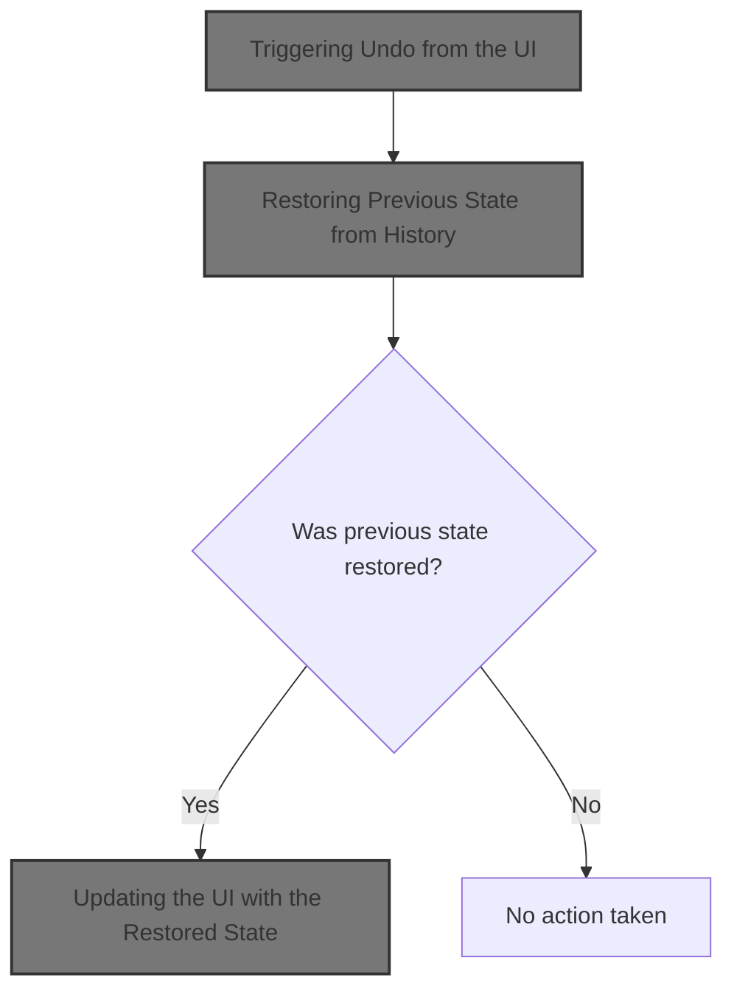

This document describes how users can revert the graph to a previous state by triggering an undo action. When undo is initiated, the application restores the prior state from history and updates the interface, allowing users to confidently explore and modify graphs.



# Triggering Undo from the UI

<SwmSnippet path="/ui/src/plugins/dev.perfetto.ExplorePage/explore_page.ts" line="828">

---

<SwmToken path="ui/src/plugins/dev.perfetto.ExplorePage/explore_page.ts" pos="828:1:1" line-data="        onUndo: () =&gt; this.handleUndo(attrs),">`onUndo`</SwmToken> is where the undo flow starts. It just delegates to <SwmToken path="ui/src/plugins/dev.perfetto.ExplorePage/explore_page.ts" pos="828:11:11" line-data="        onUndo: () =&gt; this.handleUndo(attrs),">`handleUndo`</SwmToken> with the current attributes, so the actual undo logic is handled in one place. This keeps the UI code clean and lets the undo logic be reused or tested separately.

```typescript
        onUndo: () => this.handleUndo(attrs),
```

---

</SwmSnippet>

# Delegating Undo to the History Manager

<SwmSnippet path="/ui/src/plugins/dev.perfetto.ExplorePage/explore_page.ts" line="681">

---

In <SwmToken path="ui/src/plugins/dev.perfetto.ExplorePage/explore_page.ts" pos="681:3:3" line-data="  private handleUndo(attrs: ExplorePageAttrs) {">`handleUndo`</SwmToken>, we check if there's a <SwmToken path="ui/src/plugins/dev.perfetto.ExplorePage/explore_page.ts" pos="682:7:7" line-data="    if (!this.historyManager) return;">`historyManager`</SwmToken>. If not, we bail out. If there is one, we call its <SwmToken path="ui/src/plugins/dev.perfetto.ExplorePage/explore_page.ts" pos="684:11:11" line-data="    const previousState = this.historyManager.undo();">`undo`</SwmToken> method to get the previous state. This keeps the undo logic centralized in the history manager, and lets us update the UI state only if there's something to revert to.

```typescript
  private handleUndo(attrs: ExplorePageAttrs) {
    if (!this.historyManager) return;

    const previousState = this.historyManager.undo();
```

---

</SwmSnippet>

## Restoring Previous State from History

<SwmSnippet path="/ui/src/plugins/dev.perfetto.ExplorePage/history_manager.ts" line="81">

---

In <SwmToken path="ui/src/plugins/dev.perfetto.ExplorePage/history_manager.ts" pos="81:1:1" line-data="  undo(): ExplorePageState | null {">`undo`</SwmToken>, we check if undo is possible, move the history pointer back, and then call <SwmToken path="ui/src/plugins/dev.perfetto.ExplorePage/history_manager.ts" pos="88:7:7" line-data="    const state = deserializeState(">`deserializeState`</SwmToken> to turn the stored JSON back into a usable state object. This is needed because the history only keeps serialized snapshots.

```typescript
  undo(): ExplorePageState | null {
    if (!this.canUndo()) {
      return null;
    }

    this.currentIndex--;
    this.isUndoRedoInProgress = true;
    const state = deserializeState(
      this.history[this.currentIndex],
      this.trace,
      this.sqlModules,
    );
```

---

</SwmSnippet>

### Rebuilding the Graph from Serialized Data

```mermaid
%%{init: {"flowchart": {"defaultRenderer": "elk"}} }%%
flowchart TD
  node1["Validate input as Perfetto graph export"]
  click node1 openCode "ui/src/plugins/dev.perfetto.ExplorePage/json_handler.ts:262:272"
  node1 --> node2{"Is input valid?"}
  node2 -->|"No"| node7["Show error: Invalid file format"]
  click node7 openCode "ui/src/plugins/dev.perfetto.ExplorePage/json_handler.ts:269:271"
  node2 -->|"Yes"| node3["Validate node layouts (if present)"]
  click node3 openCode "ui/src/plugins/dev.perfetto.ExplorePage/json_handler.ts:274:282"
  node3 --> node4{"Are node layouts valid?"}
  node4 -->|"No"| node8["Show error: Invalid node layouts"]
  click node8 openCode "ui/src/plugins/dev.perfetto.ExplorePage/json_handler.ts:279:281"
  node4 -->|"Yes"| node5["Proceed to restore graph"]

  subgraph loop1["For each node in saved graph"]
    node5 --> node9["Create node instance"]
    click node9 openCode "ui/src/plugins/dev.perfetto.ExplorePage/json_handler.ts:286:292"
  end

  subgraph loop2["For each node in saved graph"]
    node9 --> node10["Restore connections and relationships"]
    click node10 openCode "ui/src/plugins/dev.perfetto.ExplorePage/json_handler.ts:295:404"
    node10 --> node11{"Special node type?"}
    node11 -->|"Yes"| node12["Apply custom restoration logic"]
    click node12 openCode "ui/src/plugins/dev.perfetto.ExplorePage/json_handler.ts:369:402"
    node11 -->|"No"| node13["Continue"]
  end

  node13 --> node14["Resolve columns for aggregation/modify-columns nodes"]
  click node14 openCode "ui/src/plugins/dev.perfetto.ExplorePage/json_handler.ts:407:414"

  node14 --> node15["Restore root nodes, selected node, and layouts"]
  click node15 openCode "ui/src/plugins/dev.perfetto.ExplorePage/json_handler.ts:416:432"
  node15 --> node16["Graph ready for analysis"]
  click node16 openCode "ui/src/plugins/dev.perfetto.ExplorePage/json_handler.ts:433:438"

classDef HeadingStyle fill:#777777,stroke:#333,stroke-width:2px;

%% Swimm:
%% %%{init: {"flowchart": {"defaultRenderer": "elk"}} }%%
%% flowchart TD
%%   node1["Validate input as Perfetto graph export"]
%%   click node1 openCode "<SwmPath>[ui/…/dev.perfetto.ExplorePage/json_handler.ts](ui/src/plugins/dev.perfetto.ExplorePage/json_handler.ts)</SwmPath>:262:272"
%%   node1 --> node2{"Is input valid?"}
%%   node2 -->|"No"| node7["Show error: Invalid file format"]
%%   click node7 openCode "<SwmPath>[ui/…/dev.perfetto.ExplorePage/json_handler.ts](ui/src/plugins/dev.perfetto.ExplorePage/json_handler.ts)</SwmPath>:269:271"
%%   node2 -->|"Yes"| node3["Validate node layouts (if present)"]
%%   click node3 openCode "<SwmPath>[ui/…/dev.perfetto.ExplorePage/json_handler.ts](ui/src/plugins/dev.perfetto.ExplorePage/json_handler.ts)</SwmPath>:274:282"
%%   node3 --> node4{"Are node layouts valid?"}
%%   node4 -->|"No"| node8["Show error: Invalid node layouts"]
%%   click node8 openCode "<SwmPath>[ui/…/dev.perfetto.ExplorePage/json_handler.ts](ui/src/plugins/dev.perfetto.ExplorePage/json_handler.ts)</SwmPath>:279:281"
%%   node4 -->|"Yes"| node5["Proceed to restore graph"]
%% 
%%   subgraph loop1["For each node in saved graph"]
%%     node5 --> node9["Create node instance"]
%%     click node9 openCode "<SwmPath>[ui/…/dev.perfetto.ExplorePage/json_handler.ts](ui/src/plugins/dev.perfetto.ExplorePage/json_handler.ts)</SwmPath>:286:292"
%%   end
%% 
%%   subgraph loop2["For each node in saved graph"]
%%     node9 --> node10["Restore connections and relationships"]
%%     click node10 openCode "<SwmPath>[ui/…/dev.perfetto.ExplorePage/json_handler.ts](ui/src/plugins/dev.perfetto.ExplorePage/json_handler.ts)</SwmPath>:295:404"
%%     node10 --> node11{"Special node type?"}
%%     node11 -->|"Yes"| node12["Apply custom restoration logic"]
%%     click node12 openCode "<SwmPath>[ui/…/dev.perfetto.ExplorePage/json_handler.ts](ui/src/plugins/dev.perfetto.ExplorePage/json_handler.ts)</SwmPath>:369:402"
%%     node11 -->|"No"| node13["Continue"]
%%   end
%% 
%%   node13 --> node14["Resolve columns for aggregation/modify-columns nodes"]
%%   click node14 openCode "<SwmPath>[ui/…/dev.perfetto.ExplorePage/json_handler.ts](ui/src/plugins/dev.perfetto.ExplorePage/json_handler.ts)</SwmPath>:407:414"
%% 
%%   node14 --> node15["Restore root nodes, selected node, and layouts"]
%%   click node15 openCode "<SwmPath>[ui/…/dev.perfetto.ExplorePage/json_handler.ts](ui/src/plugins/dev.perfetto.ExplorePage/json_handler.ts)</SwmPath>:416:432"
%%   node15 --> node16["Graph ready for analysis"]
%%   click node16 openCode "<SwmPath>[ui/…/dev.perfetto.ExplorePage/json_handler.ts](ui/src/plugins/dev.perfetto.ExplorePage/json_handler.ts)</SwmPath>:433:438"
%% 
%% classDef HeadingStyle fill:#777777,stroke:#333,stroke-width:2px;
```



<SwmSnippet path="/ui/src/plugins/dev.perfetto.ExplorePage/json_handler.ts" line="255">

---

In <SwmToken path="ui/src/plugins/dev.perfetto.ExplorePage/json_handler.ts" pos="255:4:4" line-data="export function deserializeState(">`deserializeState`</SwmToken>, we parse the JSON, validate the structure, and create all node instances in a first pass. This sets up the objects so we can link them together in the next step. The function expects the JSON to have all the right fields and node references, and throws if anything's off.

```typescript
export function deserializeState(
  json: string,
  trace: Trace,
  sqlModules: SqlModules,
): ExplorePageState {
  const serializedGraph: SerializedGraph = JSON.parse(json);

  // Basic validation to ensure the file is a Perfetto graph export.
  if (
    serializedGraph == null ||
    typeof serializedGraph !== 'object' ||
    !Array.isArray(serializedGraph.nodes) ||
    !Array.isArray(serializedGraph.rootNodeIds)
  ) {
    throw new Error(
      'Invalid file format. The selected file is not a valid Perfetto graph.',
    );
  }

  // Validate nodeLayouts if present
  if (
    serializedGraph.nodeLayouts != null &&
    typeof serializedGraph.nodeLayouts !== 'object'
  ) {
    throw new Error(
      'Invalid file format. nodeLayouts must be an object if provided.',
    );
  }

  const nodes = new Map<string, QueryNode>();
  // First pass: create all node instances
  for (const serializedNode of serializedGraph.nodes) {
    const node = createNodeInstance(serializedNode, trace, sqlModules);
    // Overwrite the newly generated nodeId with the one from the file
    // to allow re-linking nodes correctly.
    (node as {nodeId: string}).nodeId = serializedNode.nodeId;
    nodes.set(serializedNode.nodeId, node);
  }
```

---

</SwmSnippet>

<SwmSnippet path="/ui/src/plugins/dev.perfetto.ExplorePage/json_handler.ts" line="294">

---

This part links nodes together, handles backward compatibility, and restores special node state where needed.

```typescript
  // Second pass: connect nodes
  for (const serializedNode of serializedGraph.nodes) {
    const node = nodes.get(serializedNode.nodeId);
    if (!node) {
      throw new Error(
        `Graph is corrupted. Node with ID "${serializedNode.nodeId}" was serialized but not instantiated.`,
      );
    }
    node.nextNodes = serializedNode.nextNodes.map((id) => {
      const nextNode = nodes.get(id);
      if (nextNode == null) {
        throw new Error(`Graph is corrupted. Node "${id}" not found.`);
      }
      return nextNode;
    });

    // Backwards compatibility: if prevNodes is not in the JSON, infer it.
    if (
      serializedNode.prevNode === undefined &&
      serializedNode.prevNodes === undefined
    ) {
      for (const nextNode of node.nextNodes) {
        if ('prevNode' in nextNode) {
          (nextNode as {prevNode: QueryNode}).prevNode = node;
        } else if ('prevNodes' in nextNode) {
          nextNode.prevNodes.push(node);
        }
      }
    }

    if (serializedNode.prevNode) {
      if ('prevNode' in node) {
        const prevNode = nodes.get(serializedNode.prevNode);
        if (prevNode) {
          (node as {prevNode: QueryNode}).prevNode = prevNode;
        }
      }
    }

    if (serializedNode.prevNodes) {
      if ('prevNodes' in node) {
        for (const id of serializedNode.prevNodes) {
          const prevNode = nodes.get(id);
          if (prevNode) {
            node.prevNodes.push(prevNode);
          }
        }
      } else if ('prevNode' in node && serializedNode.prevNodes.length > 0) {
        // Backwards compatibility
        const prevNode = nodes.get(serializedNode.prevNodes[0]);
        if (prevNode) {
          (node as {prevNode: QueryNode}).prevNode = prevNode;
        }
      }
    }

    // Restore inputNodes for ModificationNode with additional input ports
    if (serializedNode.inputNodes && 'inputNodes' in node) {
      if (!node.inputNodes) {
        node.inputNodes = [];
      }
      // Restore each inputNode connection
      for (let i = 0; i < serializedNode.inputNodes.length; i++) {
        const inputNodeId = serializedNode.inputNodes[i];
        if (inputNodeId !== undefined) {
          const inputNode = nodes.get(inputNodeId);
          if (inputNode) {
            node.inputNodes[i] = inputNode;
          }
        } else {
          node.inputNodes[i] = undefined;
        }
      }
    }

    if (serializedNode.type === NodeType.kIntervalIntersect) {
      const intervalNode = node as IntervalIntersectNode;
      if (intervalNode.prevNodes.length > 0) {
        const deserializedState = IntervalIntersectNode.deserializeState(
          nodes,
          serializedNode.state as IntervalIntersectSerializedState,
          intervalNode.prevNodes[0],
        );
        intervalNode.prevNodes.length = 0;
        intervalNode.prevNodes.push(...deserializedState.prevNodes);
      }
    }
    if (serializedNode.type === NodeType.kMerge) {
      const mergeNode = node as MergeNode;
      if (mergeNode.prevNodes.length > 0) {
        const deserializedState = MergeNode.deserializeState(
          nodes,
          serializedNode.state as MergeSerializedState,
        );
        mergeNode.prevNodes.length = 0;
        mergeNode.prevNodes.push(...deserializedState.prevNodes);
      }
    }
    if (serializedNode.type === NodeType.kUnion) {
      const unionNode = node as UnionNode;
      if (unionNode.prevNodes.length > 0) {
        const deserializedState = UnionNode.deserializeState(
          nodes,
          serializedNode.state as UnionSerializedState,
          unionNode.prevNodes[0],
        );
        unionNode.prevNodes.length = 0;
        unionNode.prevNodes.push(...deserializedState.prevNodes);
      }
    }
  }
```

---

</SwmSnippet>

<SwmSnippet path="/ui/src/plugins/dev.perfetto.ExplorePage/json_handler.ts" line="406">

---

After linking nodes, we call <SwmToken path="ui/src/plugins/dev.perfetto.ExplorePage/json_handler.ts" pos="409:9:9" line-data="      (node as AggregationNode).resolveColumns();">`resolveColumns`</SwmToken> on Aggregation and <SwmToken path="ui/src/plugins/dev.perfetto.ExplorePage/explore_page.ts" pos="306:7:7" line-data="    // Get the ModifyColumns descriptor">`ModifyColumns`</SwmToken> nodes. This finalizes their state based on their connections, which couldn't be done before linking.

```typescript
  // Third pass: resolve columns
  for (const node of nodes.values()) {
    if (node.type === NodeType.kAggregation) {
      (node as AggregationNode).resolveColumns();
    }
    if (node.type === NodeType.kModifyColumns) {
      (node as ModifyColumnsNode).resolveColumns();
    }
  }
```

---

</SwmSnippet>

<SwmSnippet path="/ui/src/plugins/dev.perfetto.ExplorePage/json_handler.ts" line="416">

---

Finally, we gather the root nodes, selected node, and node layouts into an <SwmToken path="ui/src/plugins/dev.perfetto.ExplorePage/history_manager.ts" pos="81:6:6" line-data="  undo(): ExplorePageState | null {">`ExplorePageState`</SwmToken> object and return it. This is what the rest of the app uses to update the UI after an undo.

```typescript
  const rootNodes = serializedGraph.rootNodeIds.map((id) => {
    const rootNode = nodes.get(id)!;
    if (rootNode == null) {
      throw new Error(`Graph is corrupted. Root node "${id}" not found.`);
    }
    return rootNode;
  });
  const selectedNode = serializedGraph.selectedNodeId
    ? nodes.get(serializedGraph.selectedNodeId)
    : undefined;

  // Use provided nodeLayouts if present, otherwise use empty map (will trigger auto-layout)
  const nodeLayouts =
    serializedGraph.nodeLayouts != null
      ? new Map(Object.entries(serializedGraph.nodeLayouts))
      : new Map<string, {x: number; y: number}>();

  return {
    rootNodes,
    selectedNode,
    nodeLayouts,
  };
}
```

---

</SwmSnippet>

### Finalizing Undo State Restoration

<SwmSnippet path="/ui/src/plugins/dev.perfetto.ExplorePage/history_manager.ts" line="93">

---

Back in `HistoryManager.undo`, we just got the reconstructed state from <SwmToken path="ui/src/plugins/dev.perfetto.ExplorePage/history_manager.ts" pos="88:7:7" line-data="    const state = deserializeState(">`deserializeState`</SwmToken>. Now we reset the <SwmToken path="ui/src/plugins/dev.perfetto.ExplorePage/explore_page.ts" pos="627:5:7" line-data="    // Handle undo/redo shortcuts">`undo/redo`</SwmToken> flag to signal the operation is done and return the state for whoever called undo to use.

```typescript
    this.isUndoRedoInProgress = false;
    return state;
  }
```

---

</SwmSnippet>

## Updating the UI with the Restored State

<SwmSnippet path="/ui/src/plugins/dev.perfetto.ExplorePage/explore_page.ts" line="685">

---

Back in <SwmToken path="ui/src/plugins/dev.perfetto.ExplorePage/explore_page.ts" pos="681:3:3" line-data="  private handleUndo(attrs: ExplorePageAttrs) {">`handleUndo`</SwmToken>, after getting the previous state from the history manager, we call <SwmToken path="ui/src/plugins/dev.perfetto.ExplorePage/explore_page.ts" pos="686:1:3" line-data="      attrs.onStateUpdate(previousState);">`attrs.onStateUpdate`</SwmToken> to update the UI. This only happens if a previous state was actually restored.

```typescript
    if (previousState) {
      attrs.onStateUpdate(previousState);
    }
  }
```

---

</SwmSnippet>

&nbsp;

*This is an auto-generated document by Swimm 🌊 and has not yet been verified by a human*

<SwmMeta version="3.0.0" repo-id="Z2l0aHViJTNBJTNBY3BsdXNwbHVzLXBlcmZldHRvJTNBJTNBcmljYXJkb2xvcGV6Zw==" repo-name="cplusplus-perfetto"><sup>Powered by [Swimm](https://app.swimm.io/)</sup></SwmMeta>
