This document describes how drag and gesture interactions are unified for UI elements, allowing users to interact seamlessly using either mouse or touch input. Touch gestures are translated into standard mouse and wheel events for consistent handling, and cleanup ensures the UI remains stable after interactions.

# Setting Up Drag and Touch Event Handling

<SwmSnippet path="/ui/src/base/drag_gesture_handler.ts" line="28">

---

In `DragGestureHandler.constructor`, we kick off the drag handling by attaching a 'mousedown' listener to the target element. We also immediately set up unified input handling by converting touch events into mouse events using a helper, so both mouse and touch gestures trigger the same drag logic. Next, we need to call the touchscreen handler utility to actually perform this conversion and dispatch the right events.

```typescript
  constructor(
    private element: HTMLElement,
    private onDrag: (x: number, y: number) => void,
    private onDragStarted: (x: number, y: number) => void = () => {},
    private onDragFinished = () => {},
  ) {
    element.addEventListener('mousedown', this.boundOnMouseDown);
    this._trash.use(convertTouchIntoMouseEvents(element, ['down-up-move']));
```

---

</SwmSnippet>

## Translating Touch Gestures to Mouse and Wheel Events

<SwmSnippet path="/ui/src/base/touchscreen_handler.ts" line="246">

---

In <SwmToken path="ui/src/base/touchscreen_handler.ts" pos="246:4:4" line-data="export function convertTouchIntoMouseEvents(">`convertTouchIntoMouseEvents`</SwmToken>, we set up handlers for different touch gestures using <SwmToken path="ui/src/base/touchscreen_handler.ts" pos="250:5:5" line-data="  return new TouchscreenHandler(target, {">`TouchscreenHandler`</SwmToken>. Each gesture is mapped to a corresponding mouse or wheel event, depending on which event types are enabled in the events array. Pan gestures get inertia applied, and pinch zooms are translated into Ctrl+wheel events for zooming. This lets us handle complex touch input as standard mouse/wheel events.

```typescript
export function convertTouchIntoMouseEvents(
  target: HTMLElement,
  events: TouchEventTranslation[],
): Disposable {
  return new TouchscreenHandler(target, {
    onTapDown(args: TouchArgs) {
      if (!events.includes('down-up-move')) return;
      target.dispatchEvent(
        new MouseEvent('mousedown', {
          bubbles: true,
          buttons: 1,
          ...args,
        }),
      );
    },
    onTapUp(args: TouchArgs) {
      if (!events.includes('down-up-move')) return;
      target.dispatchEvent(
        new MouseEvent('mouseup', {
          bubbles: true,
          buttons: 0,
          ...args,
        }),
      );
    },
    onTapMove(args: TouchArgs) {
      if (!events.includes('down-up-move')) return;
      target.dispatchEvent(
        new MouseEvent('mousemove', {
          bubbles: true,
          buttons: 1,
          movementX: args.deltaX,
          movementY: args.deltaY,
          ...args,
        }),
      );
    },
    onPan(args: TouchArgs) {
      if (
        Math.abs(args.deltaX) > Math.abs(args.deltaY) &&
        events.includes('pan-x')
      ) {
        withInertia(args.deltaX, 0, (dx) =>
          target.dispatchEvent(
            new WheelEvent('wheel', {
              ...args,
              deltaX: dx,
              deltaY: 0,
              ctrlKey: false,
            }),
          ),
        );
      }
    },
    onPinchZoom(args: TouchArgs) {
      if (!events.includes('pinch-zoom-as-ctrl-wheel')) return;
```

---

</SwmSnippet>

### Simulating Inertia for Pan Gestures

```mermaid
%%{init: {"flowchart": {"defaultRenderer": "elk"}} }%%
flowchart TD
  node1["Start inertia effect"] 
  click node1 openCode "ui/src/base/touchscreen_handler.ts:316:324"
  node1 --> node2["Begin inertia update cycle"]
  click node2 openCode "ui/src/base/touchscreen_handler.ts:330:341"

  subgraph loop1["While velocity > minVelocity (e.g., 0.05)"]
    node2 --> node3["Reduce velocity by friction (e.g., 0.8)"]
    click node3 openCode "ui/src/base/touchscreen_handler.ts:331:332"
    node3 --> node4["Invoke callback to update position"]
    click node4 openCode "ui/src/base/touchscreen_handler.ts:339:339"
    node4 --> node5{"Is velocity above minVelocity?"}
    click node5 openCode "ui/src/base/touchscreen_handler.ts:334:337"
    node5 -->|"Yes"| node3
    node5 -->|"No"| node6["Stop inertia effect"]
    click node6 openCode "ui/src/base/touchscreen_handler.ts:335:337"
  end

  node6 --> node7["Inertia can be cancelled externally"]
  click node7 openCode "ui/src/base/touchscreen_handler.ts:345:350"

classDef HeadingStyle fill:#777777,stroke:#333,stroke-width:2px;

%% Swimm:
%% %%{init: {"flowchart": {"defaultRenderer": "elk"}} }%%
%% flowchart TD
%%   node1["Start inertia effect"] 
%%   click node1 openCode "<SwmPath>[ui/…/base/touchscreen_handler.ts](ui/src/base/touchscreen_handler.ts)</SwmPath>:316:324"
%%   node1 --> node2["Begin inertia update cycle"]
%%   click node2 openCode "<SwmPath>[ui/…/base/touchscreen_handler.ts](ui/src/base/touchscreen_handler.ts)</SwmPath>:330:341"
%% 
%%   subgraph loop1["While velocity > <SwmToken path="ui/src/base/touchscreen_handler.ts" pos="322:1:1" line-data="    minVelocity?: number;">`minVelocity`</SwmToken> (e.g., <SwmToken path="ui/src/base/touchscreen_handler.ts" pos="326:13:15" line-data="  const minVelocity = options?.minVelocity ?? 0.05;">`0.05`</SwmToken>)"]
%%     node2 --> node3["Reduce velocity by friction (e.g., <SwmToken path="ui/src/base/touchscreen_handler.ts" pos="325:13:15" line-data="  const friction = options?.friction ?? 0.8;">`0.8`</SwmToken>)"]
%%     click node3 openCode "<SwmPath>[ui/…/base/touchscreen_handler.ts](ui/src/base/touchscreen_handler.ts)</SwmPath>:331:332"
%%     node3 --> node4["Invoke callback to update position"]
%%     click node4 openCode "<SwmPath>[ui/…/base/touchscreen_handler.ts](ui/src/base/touchscreen_handler.ts)</SwmPath>:339:339"
%%     node4 --> node5{"Is velocity above <SwmToken path="ui/src/base/touchscreen_handler.ts" pos="322:1:1" line-data="    minVelocity?: number;">`minVelocity`</SwmToken>?"}
%%     click node5 openCode "<SwmPath>[ui/…/base/touchscreen_handler.ts](ui/src/base/touchscreen_handler.ts)</SwmPath>:334:337"
%%     node5 -->|"Yes"| node3
%%     node5 -->|"No"| node6["Stop inertia effect"]
%%     click node6 openCode "<SwmPath>[ui/…/base/touchscreen_handler.ts](ui/src/base/touchscreen_handler.ts)</SwmPath>:335:337"
%%   end
%% 
%%   node6 --> node7["Inertia can be cancelled externally"]
%%   click node7 openCode "<SwmPath>[ui/…/base/touchscreen_handler.ts](ui/src/base/touchscreen_handler.ts)</SwmPath>:345:350"
%% 
%% classDef HeadingStyle fill:#777777,stroke:#333,stroke-width:2px;
```



<SwmSnippet path="/ui/src/base/touchscreen_handler.ts" line="316">

---

In <SwmToken path="ui/src/base/touchscreen_handler.ts" pos="316:2:2" line-data="function withInertia(">`withInertia`</SwmToken>, we simulate inertia by reducing velocities with friction on each animation frame. The callback gets called with the updated velocities until they're small enough to stop. Next, we call into the track utility to process any track-related logic that might depend on gesture inertia.

```typescript
function withInertia(
  vx: number,
  vy: number,
  callback: (dx: number, dy: number) => void,
  options?: {
    friction?: number;
    minVelocity?: number;
  },
): () => void {
  const friction = options?.friction ?? 0.8;
  const minVelocity = options?.minVelocity ?? 0.05;

  let frame: number | null = null;

  function step() {
    vx *= friction;
    vy *= friction;

    if (Math.abs(vx) < minVelocity && Math.abs(vy) < minVelocity) {
      if (frame !== null) cancelAnimationFrame(frame);
      return;
    }

    callback(vx, vy);
    frame = requestAnimationFrame(step);
  }

```

---

</SwmSnippet>

<SwmSnippet path="/ui/src/core_plugins/dev.perfetto.TracklUtils/index.ts" line="119">

---

<SwmToken path="ui/src/core_plugins/dev.perfetto.TracklUtils/index.ts" pos="119:1:1" line-data="      callback: async (regexArg: unknown, nameOrPathArg: unknown) =&gt; {">`callback`</SwmToken> in <SwmToken path="ui/src/core_plugins/dev.perfetto.TracklUtils/index.ts" pos="29:14:14" line-data="  static readonly id = &#39;dev.perfetto.TrackUtils&#39;;">`TrackUtils`</SwmToken> gets the name/path and regex either from arguments or by prompting the user. It then filters tracks using these criteria and pins each match, making them persistent in the UI.

```typescript
      callback: async (regexArg: unknown, nameOrPathArg: unknown) => {
        const nameOrPath = await getNameOrPathFromArgOrPrompt(
          ctx,
          nameOrPathArg,
        );
        if (!nameOrPath) return;

        const regex = await getRegexFromArgOrPrompt(
          ctx,
          regexArg,
          'Enter regex pattern to match track names...',
        );
        if (!regex) return;

        const matchingTracks = ctx.currentWorkspace.flatTracks.filter((track) =>
          testTrackWithRegex(track, regex, nameOrPath),
        );
        matchingTracks.forEach((track) => track.pin());
      },
```

---

</SwmSnippet>

<SwmSnippet path="/ui/src/base/touchscreen_handler.ts" line="343">

---

After <SwmToken path="ui/src/core_plugins/dev.perfetto.TracklUtils/index.ts" pos="29:14:14" line-data="  static readonly id = &#39;dev.perfetto.TrackUtils&#39;;">`TrackUtils`</SwmToken>, <SwmToken path="ui/src/base/touchscreen_handler.ts" pos="288:1:1" line-data="        withInertia(args.deltaX, 0, (dx) =&gt;">`withInertia`</SwmToken> returns a cleanup function to stop the animation and clear resources.

```typescript
  frame = requestAnimationFrame(step);

  return () => {
    if (frame !== null) {
      cancelAnimationFrame(frame);
      frame = null;
    }
  };
}
```

---

</SwmSnippet>

### Finalizing Gesture-to-Event Translation

<SwmSnippet path="/ui/src/base/touchscreen_handler.ts" line="302">

---

We just returned from <SwmToken path="ui/src/base/drag_gesture_handler.ts" pos="17:10:10" line-data="import {convertTouchIntoMouseEvents} from &#39;./touchscreen_handler&#39;;">`touchscreen_handler`</SwmToken>, and at the end of <SwmToken path="ui/src/base/drag_gesture_handler.ts" pos="35:7:7" line-data="    this._trash.use(convertTouchIntoMouseEvents(element, [&#39;down-up-move&#39;]));">`convertTouchIntoMouseEvents`</SwmToken>, we wrap up by dispatching the final wheel event for pinch zoom gestures if enabled. This completes the translation from touch gestures to mouse/wheel events.

```typescript
      // We translate pinch zoom into Ctrl+vertical wheel. This is consistent
      // with what most laptops seem to do when pinching on the touchpad.
      target.dispatchEvent(
        new WheelEvent('wheel', {
          ...args,
          deltaX: 0,
          deltaY: args.deltaY,
          ctrlKey: true,
        }),
      );
    },
  });
}
```

---

</SwmSnippet>

## Managing Cleanup and Drag State

<SwmSnippet path="/ui/src/base/drag_gesture_handler.ts" line="36">

---

We just returned from <SwmToken path="ui/src/base/drag_gesture_handler.ts" pos="17:10:10" line-data="import {convertTouchIntoMouseEvents} from &#39;./touchscreen_handler&#39;;">`touchscreen_handler`</SwmToken>, and at the end of `DragGestureHandler.constructor`, we set up deferred cleanup to remove all event listeners and finish any active drag. This keeps the UI clean and prevents stuck drag states.

```typescript
    this._trash.defer(() => {
      if (this._isDragging) {
        this.onMouseUp();
      }
      document.body.removeEventListener('mousedown', this.boundOnMouseDown);
      document.body.removeEventListener('mousemove', this.boundOnMouseMove);
      document.body.removeEventListener('mouseup', this.boundOnMouseUp);
    });
  }
```

---

</SwmSnippet>

&nbsp;

*This is an auto-generated document by Swimm 🌊 and has not yet been verified by a human*

<SwmMeta version="3.0.0" repo-id="Z2l0aHViJTNBJTNBY3BsdXNwbHVzLXBlcmZldHRvJTNBJTNBcmljYXJkb2xvcGV6Zw==" repo-name="cplusplus-perfetto"><sup>Powered by [Swimm](https://app.swimm.io/)</sup></SwmMeta>
