This document describes how counter data is updated in response to changes in the visible window or display size. The system checks if new data is needed, fetches and prepares it if required, and updates the UI to reflect the latest information.

# Handling window changes and triggering data fetch

<SwmSnippet path="/ui/src/components/tracks/base_counter_track.ts" line="737">

---

<SwmToken path="ui/src/components/tracks/base_counter_track.ts" pos="737:3:3" line-data="  async onUpdate({visibleWindow, size}: TrackRenderContext): Promise&lt;void&gt; {">`onUpdate`</SwmToken> figures out what data is needed for the current view and hands off to <SwmToken path="ui/src/components/tracks/base_counter_track.ts" pos="748:5:5" line-data="    await this.maybeRequestData(rawCountersKey);">`maybeRequestData`</SwmToken> to make sure it's available.

```typescript
  async onUpdate({visibleWindow, size}: TrackRenderContext): Promise<void> {
    const windowSizePx = Math.max(1, size.width);
    const timespan = visibleWindow.toTimeSpan();
    const rawCountersKey = CacheKey.create(
      timespan.start,
      timespan.end,
      windowSizePx,
    );

    // If the visible time range is outside the cached area, requests
    // asynchronously new data from the SQL engine.
    await this.maybeRequestData(rawCountersKey);
  }
```

---

</SwmSnippet>

# Validating cache keys and preparing limits

```mermaid
%%{init: {"flowchart": {"defaultRenderer": "elk"}} }%%
flowchart TD
  node1["Check if requested counter data is already available"]
  click node1 openCode "ui/src/components/tracks/base_counter_track.ts:1082:1083"
  node1 --> node2{"Is data already covered?"}
  click node2 openCode "ui/src/components/tracks/base_counter_track.ts:1082:1083"
  node2 -->|"Yes"| node3["Return, data is ready"]
  click node3 openCode "ui/src/components/tracks/base_counter_track.ts:1083:1083"
  node2 -->|"No"| node4["Normalize the request"]
  click node4 openCode "ui/src/components/tracks/base_counter_track.ts:1086:1086"
  node4 --> node5{"Is normalization valid?"}
  click node5 openCode "ui/src/components/tracks/base_counter_track.ts:1087:1091"
  node5 -->|"No"| node6["Throw error"]
  click node6 openCode "ui/src/components/tracks/base_counter_track.ts:1088:1091"
  node5 -->|"Yes"| node7{"Are limits known?"}
  click node7 openCode "ui/src/components/tracks/base_counter_track.ts:1093:1095"
  node7 -->|"No"| node8["Fetch and store limits"]
  click node8 openCode "ui/src/components/tracks/base_counter_track.ts:1094:1095"
  node7 -->|"Yes"| node9["Query for counter data"]
  click node9 openCode "ui/src/components/tracks/base_counter_track.ts:1097:1108"
  node8 --> node9
  subgraph loop1["For each row in query result"]
    node9 --> node10["Extract and aggregate counter values"]
    click node10 openCode "ui/src/components/tracks/base_counter_track.ts:1128:1135"
    node10 --> node11["All rows processed"]
  end
  node11 --> node12["Update internal state and schedule redraw"]
  click node12 openCode "ui/src/components/tracks/base_counter_track.ts:1137:1142"

classDef HeadingStyle fill:#777777,stroke:#333,stroke-width:2px;

%% Swimm:
%% %%{init: {"flowchart": {"defaultRenderer": "elk"}} }%%
%% flowchart TD
%%   node1["Check if requested counter data is already available"]
%%   click node1 openCode "<SwmPath>[ui/…/tracks/base_counter_track.ts](ui/src/components/tracks/base_counter_track.ts)</SwmPath>:1082:1083"
%%   node1 --> node2{"Is data already covered?"}
%%   click node2 openCode "<SwmPath>[ui/…/tracks/base_counter_track.ts](ui/src/components/tracks/base_counter_track.ts)</SwmPath>:1082:1083"
%%   node2 -->|"Yes"| node3["Return, data is ready"]
%%   click node3 openCode "<SwmPath>[ui/…/tracks/base_counter_track.ts](ui/src/components/tracks/base_counter_track.ts)</SwmPath>:1083:1083"
%%   node2 -->|"No"| node4["Normalize the request"]
%%   click node4 openCode "<SwmPath>[ui/…/tracks/base_counter_track.ts](ui/src/components/tracks/base_counter_track.ts)</SwmPath>:1086:1086"
%%   node4 --> node5{"Is normalization valid?"}
%%   click node5 openCode "<SwmPath>[ui/…/tracks/base_counter_track.ts](ui/src/components/tracks/base_counter_track.ts)</SwmPath>:1087:1091"
%%   node5 -->|"No"| node6["Throw error"]
%%   click node6 openCode "<SwmPath>[ui/…/tracks/base_counter_track.ts](ui/src/components/tracks/base_counter_track.ts)</SwmPath>:1088:1091"
%%   node5 -->|"Yes"| node7{"Are limits known?"}
%%   click node7 openCode "<SwmPath>[ui/…/tracks/base_counter_track.ts](ui/src/components/tracks/base_counter_track.ts)</SwmPath>:1093:1095"
%%   node7 -->|"No"| node8["Fetch and store limits"]
%%   click node8 openCode "<SwmPath>[ui/…/tracks/base_counter_track.ts](ui/src/components/tracks/base_counter_track.ts)</SwmPath>:1094:1095"
%%   node7 -->|"Yes"| node9["Query for counter data"]
%%   click node9 openCode "<SwmPath>[ui/…/tracks/base_counter_track.ts](ui/src/components/tracks/base_counter_track.ts)</SwmPath>:1097:1108"
%%   node8 --> node9
%%   subgraph loop1["For each row in query result"]
%%     node9 --> node10["Extract and aggregate counter values"]
%%     click node10 openCode "<SwmPath>[ui/…/tracks/base_counter_track.ts](ui/src/components/tracks/base_counter_track.ts)</SwmPath>:1128:1135"
%%     node10 --> node11["All rows processed"]
%%   end
%%   node11 --> node12["Update internal state and schedule redraw"]
%%   click node12 openCode "<SwmPath>[ui/…/tracks/base_counter_track.ts](ui/src/components/tracks/base_counter_track.ts)</SwmPath>:1137:1142"
%% 
%% classDef HeadingStyle fill:#777777,stroke:#333,stroke-width:2px;
```



<SwmSnippet path="/ui/src/components/tracks/base_counter_track.ts" line="1081">

---

In <SwmToken path="ui/src/components/tracks/base_counter_track.ts" pos="1081:5:5" line-data="  private async maybeRequestData(rawCountersKey: CacheKey) {">`maybeRequestData`</SwmToken>, we first check if the requested data is already cached. If not, we normalize the cache key and verify coverage to avoid inconsistencies. If limits aren't set, we call <SwmToken path="ui/src/components/tracks/base_counter_track.ts" pos="1094:11:11" line-data="      this.limits = await this.createTableAndFetchLimits(true);">`createTableAndFetchLimits`</SwmToken> to set up the necessary bounds for the data query.

```typescript
  private async maybeRequestData(rawCountersKey: CacheKey) {
    if (rawCountersKey.isCoveredBy(this.countersKey)) {
      return; // We have the data already, no need to re-query.
    }

    const countersKey = rawCountersKey.normalize();
    if (!rawCountersKey.isCoveredBy(countersKey)) {
      throw new Error(
        `Normalization error ${countersKey.toString()} ${rawCountersKey.toString()}`,
      );
    }

    if (this.limits === undefined) {
      this.limits = await this.createTableAndFetchLimits(true);
    }

```

---

</SwmSnippet>

<SwmSnippet path="/ui/src/components/tracks/base_counter_track.ts" line="1145">

---

<SwmToken path="ui/src/components/tracks/base_counter_track.ts" pos="1145:5:5" line-data="  private async createTableAndFetchLimits(">`createTableAndFetchLimits`</SwmToken> sets up a virtual table using Perfetto's <SwmToken path="ui/src/components/tracks/base_counter_track.ts" pos="1152:3:3" line-data="      using __intrinsic_counter_mipmap((">`__intrinsic_counter_mipmap`</SwmToken> to aggregate counter data over the trace timeline. It queries for display value limits and schedules the table for deferred cleanup to avoid resource leaks.

```typescript
  private async createTableAndFetchLimits(
    dropTable: boolean,
  ): Promise<CounterLimits> {
    const dropQuery = dropTable ? `drop table ${this.getTableName()};` : '';
    const displayValueQuery = await this.engine.query(`
      ${dropQuery}
      create virtual table ${this.getTableName()}
      using __intrinsic_counter_mipmap((
        select
          ts,
          ${this.getValueExpression()} as value
        from (${this.getSqlSource()})
      ));
      select
        min_value as minDisplayValue,
        max_value as maxDisplayValue
      from ${this.getTableName()}(
        trace_start(), trace_end() + 1, trace_dur() + 1
      );
    `);

    this.trash.defer(async () => {
      this.engine.tryQuery(`drop table if exists ${this.getTableName()}`);
    });

    const {minDisplayValue, maxDisplayValue} = displayValueQuery.firstRow({
      minDisplayValue: NUM,
      maxDisplayValue: NUM,
    });

    return {
      minDisplayValue,
      maxDisplayValue,
    };
  }
```

---

</SwmSnippet>

<SwmSnippet path="/ui/src/components/tracks/base_counter_track.ts" line="1097">

---

Back in <SwmToken path="ui/src/components/tracks/base_counter_track.ts" pos="748:5:5" line-data="    await this.maybeRequestData(rawCountersKey);">`maybeRequestData`</SwmToken> after getting limits, we query the engine for counter data using the normalized key. The results are processed into typed arrays for timestamps and values, and we track the <SwmToken path="ui/src/components/tracks/base_counter_track.ts" pos="178:25:27" line-data="  // Whether the range boundaries should be strict and use the precise min/max">`min/max`</SwmToken> display values for later rendering.

```typescript
    const queryRes = await this.engine.query(`
      SELECT
        min_value as minDisplayValue,
        max_value as maxDisplayValue,
        last_ts as ts,
        last_value as lastDisplayValue
      FROM ${this.getTableName()}(
        ${countersKey.start},
        ${countersKey.end},
        ${countersKey.bucketSize}
      );
    `);

    const it = queryRes.iter({
      ts: LONG,
      minDisplayValue: NUM,
      maxDisplayValue: NUM,
      lastDisplayValue: NUM,
    });

    const numRows = queryRes.numRows();
    const data: CounterData = {
      timestamps: new BigInt64Array(numRows),
      minDisplayValues: new Float64Array(numRows),
      maxDisplayValues: new Float64Array(numRows),
      lastDisplayValues: new Float64Array(numRows),
      displayValueRange: [0, 0],
    };

    let min = 0;
    let max = 0;
    for (let row = 0; it.valid(); it.next(), row++) {
      data.timestamps[row] = Time.fromRaw(it.ts);
      data.minDisplayValues[row] = it.minDisplayValue;
      data.maxDisplayValues[row] = it.maxDisplayValue;
      data.lastDisplayValues[row] = it.lastDisplayValue;
      min = Math.min(min, it.minDisplayValue);
      max = Math.max(max, it.maxDisplayValue);
    }
```

---

</SwmSnippet>

<SwmSnippet path="/ui/src/components/tracks/base_counter_track.ts" line="1137">

---

Finally, <SwmToken path="ui/src/components/tracks/base_counter_track.ts" pos="748:5:5" line-data="    await this.maybeRequestData(rawCountersKey);">`maybeRequestData`</SwmToken> updates the internal state with the new key and counter data, then triggers a canvas redraw so the UI shows the latest info.

```typescript
    data.displayValueRange = [min, max];

    this.countersKey = countersKey;
    this.counters = data;

    raf.scheduleCanvasRedraw();
  }
```

---

</SwmSnippet>

&nbsp;

*This is an auto-generated document by Swimm 🌊 and has not yet been verified by a human*

<SwmMeta version="3.0.0" repo-id="Z2l0aHViJTNBJTNBY3BsdXNwbHVzLXBlcmZldHRvJTNBJTNBcmljYXJkb2xvcGV6Zw==" repo-name="cplusplus-perfetto"><sup>Powered by [Swimm](https://app.swimm.io/)</sup></SwmMeta>
