```mermaid
%%{init: {"flowchart": {"defaultRenderer": "elk"}} }%%
flowchart TD
  node2{"Is alias present for column?"}
  click node2 openCode "ui/src/plugins/dev.perfetto.ExplorePage/query_builder/column_info.ts:54:54"
  node2 -->|"Yes"| node3["Set column name to alias"]
  click node3 openCode "ui/src/plugins/dev.perfetto.ExplorePage/query_builder/column_info.ts:54:54"
  node2 -->|"No"| node4["Set column name to original name"]
  click node4 openCode "ui/src/plugins/dev.perfetto.ExplorePage/query_builder/column_info.ts:54:54"
  node3 --> node5["Update column object with new name"]
  click node5 openCode "ui/src/plugins/dev.perfetto.ExplorePage/query_builder/column_info.ts:58:58"
  node4 --> node5
  node5 --> node6["Convert column type to string"]
  click node6 openCode "ui/src/plugins/dev.perfetto.ExplorePage/query_builder/column_info.ts:57:57"
  node6 --> node7{"Is checked status provided?"}
  click node7 openCode "ui/src/plugins/dev.perfetto.ExplorePage/query_builder/column_info.ts:60:60"
  node7 -->|"Yes"| node8["Set checked status to provided value"]
  click node8 openCode "ui/src/plugins/dev.perfetto.ExplorePage/query_builder/column_info.ts:60:60"
  node7 -->|"No"| node9["Set checked status to existing value"]
  click node9 openCode "ui/src/plugins/dev.perfetto.ExplorePage/query_builder/column_info.ts:60:60"
  node8 --> node10["Return new column info object with updated name, type, and checked status"]
  click node10 openCode "ui/src/plugins/dev.perfetto.ExplorePage/query_builder/column_info.ts:55:61"
  node9 --> node10
classDef HeadingStyle fill:#777777,stroke:#333,stroke-width:2px;

%% Swimm:
%% %%{init: {"flowchart": {"defaultRenderer": "elk"}} }%%
%% flowchart TD
%%   node2{"Is alias present for column?"}
%%   click node2 openCode "<SwmPath>[ui/…/query_builder/column_info.ts](ui/src/plugins/dev.perfetto.ExplorePage/query_builder/column_info.ts)</SwmPath>:54:54"
%%   node2 -->|"Yes"| node3["Set column name to alias"]
%%   click node3 openCode "<SwmPath>[ui/…/query_builder/column_info.ts](ui/src/plugins/dev.perfetto.ExplorePage/query_builder/column_info.ts)</SwmPath>:54:54"
%%   node2 -->|"No"| node4["Set column name to original name"]
%%   click node4 openCode "<SwmPath>[ui/…/query_builder/column_info.ts](ui/src/plugins/dev.perfetto.ExplorePage/query_builder/column_info.ts)</SwmPath>:54:54"
%%   node3 --> node5["Update column object with new name"]
%%   click node5 openCode "<SwmPath>[ui/…/query_builder/column_info.ts](ui/src/plugins/dev.perfetto.ExplorePage/query_builder/column_info.ts)</SwmPath>:58:58"
%%   node4 --> node5
%%   node5 --> node6["Convert column type to string"]
%%   click node6 openCode "<SwmPath>[ui/…/query_builder/column_info.ts](ui/src/plugins/dev.perfetto.ExplorePage/query_builder/column_info.ts)</SwmPath>:57:57"
%%   node6 --> node7{"Is checked status provided?"}
%%   click node7 openCode "<SwmPath>[ui/…/query_builder/column_info.ts](ui/src/plugins/dev.perfetto.ExplorePage/query_builder/column_info.ts)</SwmPath>:60:60"
%%   node7 -->|"Yes"| node8["Set checked status to provided value"]
%%   click node8 openCode "<SwmPath>[ui/…/query_builder/column_info.ts](ui/src/plugins/dev.perfetto.ExplorePage/query_builder/column_info.ts)</SwmPath>:60:60"
%%   node7 -->|"No"| node9["Set checked status to existing value"]
%%   click node9 openCode "<SwmPath>[ui/…/query_builder/column_info.ts](ui/src/plugins/dev.perfetto.ExplorePage/query_builder/column_info.ts)</SwmPath>:60:60"
%%   node8 --> node10["Return new column info object with updated name, type, and checked status"]
%%   click node10 openCode "<SwmPath>[ui/…/query_builder/column_info.ts](ui/src/plugins/dev.perfetto.ExplorePage/query_builder/column_info.ts)</SwmPath>:55:61"
%%   node9 --> node10
%% classDef HeadingStyle fill:#777777,stroke:#333,stroke-width:2px;
```

This document explains how the data exploration interface updates the columns shown to the user when a new list of column names is provided. The system transforms these names into structured column descriptors, applies the changes to the data source, and refreshes the UI to display the updated columns.

# Setting Up Source Columns

```mermaid
%%{init: {"flowchart": {"defaultRenderer": "elk"}} }%%
flowchart TD
  node1["Receive new columns to display"] --> node2["Transform columns for use in the UI"]
  click node1 openCode "ui/src/plugins/dev.perfetto.ExplorePage/query_builder/nodes/sources/sql_source.ts:73:76"
  node2 --> node3["Finalizing Column Descriptors"]
  click node2 openCode "ui/src/plugins/dev.perfetto.ExplorePage/query_builder/column_info.ts:38:48"
  node3 --> node4["Apply changes to the data source"]
  
  node4 --> node5["Refresh the user interface to show new columns"]
  click node4 openCode "ui/src/plugins/dev.perfetto.ExplorePage/query_builder/nodes/sources/sql_source.ts:77:78"
  click node5 openCode "ui/src/plugins/dev.perfetto.ExplorePage/query_builder/nodes/sources/sql_source.ts:77:78"

classDef HeadingStyle fill:#777777,stroke:#333,stroke-width:2px;
click node3 goToHeading "Finalizing Column Descriptors"
node3:::HeadingStyle

%% Swimm:
%% %%{init: {"flowchart": {"defaultRenderer": "elk"}} }%%
%% flowchart TD
%%   node1["Receive new columns to display"] --> node2["Transform columns for use in the UI"]
%%   click node1 openCode "<SwmPath>[ui/…/sources/sql_source.ts](ui/src/plugins/dev.perfetto.ExplorePage/query_builder/nodes/sources/sql_source.ts)</SwmPath>:73:76"
%%   node2 --> node3["Finalizing Column Descriptors"]
%%   click node2 openCode "<SwmPath>[ui/…/query_builder/column_info.ts](ui/src/plugins/dev.perfetto.ExplorePage/query_builder/column_info.ts)</SwmPath>:38:48"
%%   node3 --> node4["Apply changes to the data source"]
%%   
%%   node4 --> node5["Refresh the user interface to show new columns"]
%%   click node4 openCode "<SwmPath>[ui/…/sources/sql_source.ts](ui/src/plugins/dev.perfetto.ExplorePage/query_builder/nodes/sources/sql_source.ts)</SwmPath>:77:78"
%%   click node5 openCode "<SwmPath>[ui/…/sources/sql_source.ts](ui/src/plugins/dev.perfetto.ExplorePage/query_builder/nodes/sources/sql_source.ts)</SwmPath>:77:78"
%% 
%% classDef HeadingStyle fill:#777777,stroke:#333,stroke-width:2px;
%% click node3 goToHeading "Finalizing Column Descriptors"
%% node3:::HeadingStyle
```



<SwmSnippet path="/ui/src/plugins/dev.perfetto.ExplorePage/query_builder/nodes/sources/sql_source.ts" line="73">

---

In <SwmToken path="ui/src/plugins/dev.perfetto.ExplorePage/query_builder/nodes/sources/sql_source.ts" pos="73:1:1" line-data="  setSourceColumns(columns: string[]) {">`setSourceColumns`</SwmToken>, we start by converting each column name into a <SwmToken path="ui/src/plugins/dev.perfetto.ExplorePage/query_builder/column_info.ts" pos="41:3:3" line-data="): ColumnInfo {">`ColumnInfo`</SwmToken> object using <SwmToken path="ui/src/plugins/dev.perfetto.ExplorePage/query_builder/nodes/sources/sql_source.ts" pos="75:11:11" line-data="      columns.map((c) =&gt; columnInfoFromName(c)),">`columnInfoFromName`</SwmToken>. This sets up the columns with a consistent structure, which is needed for later steps. We call <SwmPath>[ui/…/query_builder/column_info.ts](ui/src/plugins/dev.perfetto.ExplorePage/query_builder/column_info.ts)</SwmPath> next to handle this conversion.

```typescript
  setSourceColumns(columns: string[]) {
    this.finalCols = createFinalColumns(
      columns.map((c) => columnInfoFromName(c)),
```

---

</SwmSnippet>

<SwmSnippet path="/ui/src/plugins/dev.perfetto.ExplorePage/query_builder/column_info.ts" line="38">

---

<SwmToken path="ui/src/plugins/dev.perfetto.ExplorePage/query_builder/column_info.ts" pos="38:4:4" line-data="export function columnInfoFromName(">`columnInfoFromName`</SwmToken> creates a <SwmToken path="ui/src/plugins/dev.perfetto.ExplorePage/query_builder/column_info.ts" pos="41:3:3" line-data="): ColumnInfo {">`ColumnInfo`</SwmToken> object for each column name, setting type to 'NA' as a placeholder. This signals that type info isn't resolved yet, which is a repo convention.

```typescript
export function columnInfoFromName(
  name: string,
  checked: boolean = false,
): ColumnInfo {
  return {
    name,
    type: 'NA',
    checked,
    column: {name},
  };
}
```

---

</SwmSnippet>

<SwmSnippet path="/ui/src/plugins/dev.perfetto.ExplorePage/query_builder/nodes/sources/sql_source.ts" line="74">

---

After building the basic column objects, we run them through another function to finish prepping them for use.

```typescript
    this.finalCols = createFinalColumns(
      columns.map((c) => columnInfoFromName(c)),
    );
```

---

</SwmSnippet>

## Finalizing Column Descriptors

<SwmSnippet path="/ui/src/plugins/dev.perfetto.ExplorePage/query_node.ts" line="177">

---

We pass the columns along, marking them as selected for the next step.

```typescript
export function createFinalColumns(sourceCols: ColumnInfo[]) {
  return newColumnInfoList(sourceCols, true);
}
```

---

</SwmSnippet>

## Transforming <SwmToken path="ui/src/plugins/dev.perfetto.ExplorePage/query_builder/column_info.ts" pos="41:3:3" line-data="): ColumnInfo {">`ColumnInfo`</SwmToken> List

<SwmSnippet path="/ui/src/plugins/dev.perfetto.ExplorePage/query_builder/column_info.ts" line="64">

---

<SwmToken path="ui/src/plugins/dev.perfetto.ExplorePage/query_builder/column_info.ts" pos="64:4:4" line-data="export function newColumnInfoList(">`newColumnInfoList`</SwmToken> loops through the columns and rebuilds each one using <SwmToken path="ui/src/plugins/dev.perfetto.ExplorePage/query_builder/column_info.ts" pos="68:13:13" line-data="  return oldCols.map((col) =&gt; newColumnInfo(col, checked));">`newColumnInfo`</SwmToken>, updating their properties as needed. We call <SwmToken path="ui/src/plugins/dev.perfetto.ExplorePage/query_builder/column_info.ts" pos="68:13:13" line-data="  return oldCols.map((col) =&gt; newColumnInfo(col, checked));">`newColumnInfo`</SwmToken> next to handle those changes.

```typescript
export function newColumnInfoList(
  oldCols: ColumnInfo[],
  checked?: boolean | undefined,
): ColumnInfo[] {
  return oldCols.map((col) => newColumnInfo(col, checked));
}
```

---

</SwmSnippet>

## Building Final <SwmToken path="ui/src/plugins/dev.perfetto.ExplorePage/query_builder/column_info.ts" pos="41:3:3" line-data="): ColumnInfo {">`ColumnInfo`</SwmToken>



<SwmSnippet path="/ui/src/plugins/dev.perfetto.ExplorePage/query_builder/column_info.ts" line="50">

---

<SwmToken path="ui/src/plugins/dev.perfetto.ExplorePage/query_builder/column_info.ts" pos="50:4:4" line-data="export function newColumnInfo(">`newColumnInfo`</SwmToken> builds the final column descriptor, setting its name and converting its type to a string using <SwmToken path="ui/src/plugins/dev.perfetto.ExplorePage/query_builder/column_info.ts" pos="57:4:4" line-data="    type: perfettoSqlTypeToString(col.column.type),">`perfettoSqlTypeToString`</SwmToken>. We call <SwmPath>[ui/…/trace_processor/perfetto_sql_type.ts](ui/src/trace_processor/perfetto_sql_type.ts)</SwmPath> next to handle that conversion.

```typescript
export function newColumnInfo(
  col: ColumnInfo,
  checked?: boolean | undefined,
): ColumnInfo {
  const finalName = col.alias ?? col.column.name;
  return {
    name: finalName,
    type: perfettoSqlTypeToString(col.column.type),
    column: {...col.column, name: finalName},
    alias: undefined,
    checked: checked ?? col.checked,
  };
}
```

---

</SwmSnippet>

<SwmSnippet path="/ui/src/trace_processor/perfetto_sql_type.ts" line="170">

---

<SwmToken path="ui/src/trace_processor/perfetto_sql_type.ts" pos="170:4:4" line-data="export function perfettoSqlTypeToString(type?: PerfettoSqlType): string {">`perfettoSqlTypeToString`</SwmToken> turns the type object into a string, using different formats for 'id', 'joinid', and other kinds. It assumes source is always present for 'joinid', which is a silent requirement.

```typescript
export function perfettoSqlTypeToString(type?: PerfettoSqlType): string {
  if (type === undefined) {
    return 'ANY';
  }
  if (type.kind === 'id') {
    if (type.source !== undefined) {
      return `ID(${type.source.table}.${type.source.column})`;
    }
  }
  if (type.kind === 'joinid') {
    return `JOINID(${type.source.table}.${type.source.column})`;
  }
  return type.kind.toUpperCase();
}
```

---

</SwmSnippet>

## Triggering UI Update

<SwmSnippet path="/ui/src/plugins/dev.perfetto.ExplorePage/query_builder/nodes/sources/sql_source.ts" line="77">

---

Finally, in <SwmToken path="ui/src/plugins/dev.perfetto.ExplorePage/query_builder/nodes/sources/sql_source.ts" pos="73:1:1" line-data="  setSourceColumns(columns: string[]) {">`setSourceColumns`</SwmToken>, we call <SwmToken path="ui/src/plugins/dev.perfetto.ExplorePage/query_builder/nodes/sources/sql_source.ts" pos="77:1:5" line-data="    m.redraw();">`m.redraw()`</SwmToken> to refresh the UI and show the updated columns. This makes sure the changes are visible to the user.

```typescript
    m.redraw();
  }
```

---

</SwmSnippet>

&nbsp;

*This is an auto-generated document by Swimm 🌊 and has not yet been verified by a human*

<SwmMeta version="3.0.0" repo-id="Z2l0aHViJTNBJTNBY3BsdXNwbHVzLXBlcmZldHRvJTNBJTNBcmljYXJkb2xvcGV6Zw==" repo-name="cplusplus-perfetto"><sup>Powered by [Swimm](https://app.swimm.io/)</sup></SwmMeta>
