This document describes how the flamegraph visualization updates in response to user interactions. When a user changes their selection in the trace, the system updates the displayed flamegraph and metrics to match the new focus, enabling interactive exploration of trace data.

# Handling flamegraph state changes

<SwmSnippet path="/ui/src/plugins/dev.perfetto.TraceProcessorTrack/index.ts" line="561">

---

<SwmToken path="ui/src/plugins/dev.perfetto.TraceProcessorTrack/index.ts" pos="564:1:1" line-data="            onStateChange: (state) =&gt; {">`onStateChange`</SwmToken> is where the flamegraph state gets updated in response to user actions or internal events. Right after updating the state, we call render to make sure the UI reflects these changes. This keeps the visualization in sync with the underlying data.

```typescript
                draft.areaSelectionFlamegraphState = state;
              });
            },
```

---

</SwmSnippet>

# Managing flamegraph rendering and computation

```mermaid
%%{init: {"flowchart": {"defaultRenderer": "elk"}} }%%
flowchart TD
    node1["User changes selection"] --> node2{"Has selection changed?"}
    click node1 openCode "ui/src/plugins/dev.perfetto.TraceProcessorTrack/index.ts:529:557"
    node2 -->|"Yes"| node3["Filtering tracks and preparing slice data"]
    click node2 openCode "ui/src/plugins/dev.perfetto.TraceProcessorTrack/index.ts:530:554"
    
    node2 -->|"No"| node4{"Is flamegraph data available?"}
    click node4 openCode "ui/src/plugins/dev.perfetto.TraceProcessorTrack/index.ts:555:557"
    node4 -->|"No"| node5["Return nothing"]
    click node5 openCode "ui/src/plugins/dev.perfetto.TraceProcessorTrack/index.ts:556:557"
    node4 -->|"Yes"| node6["Return current flamegraph visualization"]
    click node6 openCode "ui/src/plugins/dev.perfetto.TraceProcessorTrack/index.ts:558:570"

classDef HeadingStyle fill:#777777,stroke:#333,stroke-width:2px;
click node3 goToHeading "Filtering tracks and preparing slice data"
node3:::HeadingStyle

%% Swimm:
%% %%{init: {"flowchart": {"defaultRenderer": "elk"}} }%%
%% flowchart TD
%%     node1["User changes selection"] --> node2{"Has selection changed?"}
%%     click node1 openCode "<SwmPath>[ui/…/dev.perfetto.TraceProcessorTrack/index.ts](ui/src/plugins/dev.perfetto.TraceProcessorTrack/index.ts)</SwmPath>:529:557"
%%     node2 -->|"Yes"| node3["Filtering tracks and preparing slice data"]
%%     click node2 openCode "<SwmPath>[ui/…/dev.perfetto.TraceProcessorTrack/index.ts](ui/src/plugins/dev.perfetto.TraceProcessorTrack/index.ts)</SwmPath>:530:554"
%%     
%%     node2 -->|"No"| node4{"Is flamegraph data available?"}
%%     click node4 openCode "<SwmPath>[ui/…/dev.perfetto.TraceProcessorTrack/index.ts](ui/src/plugins/dev.perfetto.TraceProcessorTrack/index.ts)</SwmPath>:555:557"
%%     node4 -->|"No"| node5["Return nothing"]
%%     click node5 openCode "<SwmPath>[ui/…/dev.perfetto.TraceProcessorTrack/index.ts](ui/src/plugins/dev.perfetto.TraceProcessorTrack/index.ts)</SwmPath>:556:557"
%%     node4 -->|"Yes"| node6["Return current flamegraph visualization"]
%%     click node6 openCode "<SwmPath>[ui/…/dev.perfetto.TraceProcessorTrack/index.ts](ui/src/plugins/dev.perfetto.TraceProcessorTrack/index.ts)</SwmPath>:558:570"
%% 
%% classDef HeadingStyle fill:#777777,stroke:#333,stroke-width:2px;
%% click node3 goToHeading "Filtering tracks and preparing slice data"
%% node3:::HeadingStyle
```



<SwmSnippet path="/ui/src/plugins/dev.perfetto.TraceProcessorTrack/index.ts" line="529">

---

In <SwmToken path="ui/src/plugins/dev.perfetto.TraceProcessorTrack/index.ts" pos="529:1:1" line-data="      render: (selection: AreaSelection) =&gt; {">`render`</SwmToken>, we only recompute the flamegraph if the selection changes, using async scheduling and cleanup before calling <SwmToken path="ui/src/plugins/dev.perfetto.TraceProcessorTrack/index.ts" pos="548:9:9" line-data="            flamegraphWithMetrics = await this.computeSliceFlamegraph(">`computeSliceFlamegraph`</SwmToken>.

```typescript
      render: (selection: AreaSelection) => {
        const selectionChanged =
          previousSelection === undefined ||
          !areaSelectionsEqual(previousSelection, selection);
        previousSelection = selection;
        if (selectionChanged) {
          limiter.schedule(async () => {
            // If we had a previous flamegraph, dispose of it now that the new
            // one is ready.
            if (flamegraphWithMetrics) {
              await flamegraphWithMetrics.flamegraph[Symbol.asyncDispose]();
            }

            // Unset the flamegraph but set the isLoading flag so we render the
            // right thing.
            flamegraphWithMetrics = undefined;
            isLoading = true;

            // Compute the new flamegraph
            flamegraphWithMetrics = await this.computeSliceFlamegraph(
              trace,
              selection,
            );
            isLoading = false;
          });
        }
        if (flamegraphWithMetrics === undefined && !isLoading) {
          return undefined;
        }
```

---

</SwmSnippet>

## Filtering tracks and preparing slice data

```mermaid
%%{init: {"flowchart": {"defaultRenderer": "elk"}} }%%
flowchart TD
    node1["Start: User selects area in trace (tracks & time range)"] --> node2["Prepare empty list of track IDs"]
    click node1 openCode "ui/src/plugins/dev.perfetto.TraceProcessorTrack/index.ts:576:578"
    click node2 openCode "ui/src/plugins/dev.perfetto.TraceProcessorTrack/index.ts:579:580"
    
    subgraph loop1["For each track in selection"]
      node2 --> node3{"Is track a slice track?"}
      click node3 openCode "ui/src/plugins/dev.perfetto.TraceProcessorTrack/index.ts:581:582"
      node3 -->|"No"| node7["Skip track"]
      click node7 openCode "ui/src/plugins/dev.perfetto.TraceProcessorTrack/index.ts:582:583"
      node3 -->|"Yes"| node4{"Does track have IDs?"}
      click node4 openCode "ui/src/plugins/dev.perfetto.TraceProcessorTrack/index.ts:584:585"
      node4 -->|"No"| node7
      node4 -->|"Yes"| node5["Add track IDs to list"]
      click node5 openCode "ui/src/plugins/dev.perfetto.TraceProcessorTrack/index.ts:587:588"
      node5 --> node6["Next track"]
      node7 --> node6
    end
    node6 --> node8["Query trace data for selected tracks and time range"]
    click node8 openCode "ui/src/plugins/dev.perfetto.TraceProcessorTrack/index.ts:593:612"
    node8 --> node9["Generate flamegraph and metrics"]
    click node9 openCode "ui/src/plugins/dev.perfetto.TraceProcessorTrack/index.ts:613:660"
    node9 --> node10["Update results with new flamegraph"]
    click node10 openCode "ui/src/plugins/dev.perfetto.TraceProcessorTrack/index.ts:661:667"
    node10 --> node11["Return flamegraph and metrics"]
    click node11 openCode "ui/src/plugins/dev.perfetto.TraceProcessorTrack/index.ts:668:669"

classDef HeadingStyle fill:#777777,stroke:#333,stroke-width:2px;

%% Swimm:
%% %%{init: {"flowchart": {"defaultRenderer": "elk"}} }%%
%% flowchart TD
%%     node1["Start: User selects area in trace (tracks & time range)"] --> node2["Prepare empty list of track IDs"]
%%     click node1 openCode "<SwmPath>[ui/…/dev.perfetto.TraceProcessorTrack/index.ts](ui/src/plugins/dev.perfetto.TraceProcessorTrack/index.ts)</SwmPath>:576:578"
%%     click node2 openCode "<SwmPath>[ui/…/dev.perfetto.TraceProcessorTrack/index.ts](ui/src/plugins/dev.perfetto.TraceProcessorTrack/index.ts)</SwmPath>:579:580"
%%     
%%     subgraph loop1["For each track in selection"]
%%       node2 --> node3{"Is track a slice track?"}
%%       click node3 openCode "<SwmPath>[ui/…/dev.perfetto.TraceProcessorTrack/index.ts](ui/src/plugins/dev.perfetto.TraceProcessorTrack/index.ts)</SwmPath>:581:582"
%%       node3 -->|"No"| node7["Skip track"]
%%       click node7 openCode "<SwmPath>[ui/…/dev.perfetto.TraceProcessorTrack/index.ts](ui/src/plugins/dev.perfetto.TraceProcessorTrack/index.ts)</SwmPath>:582:583"
%%       node3 -->|"Yes"| node4{"Does track have IDs?"}
%%       click node4 openCode "<SwmPath>[ui/…/dev.perfetto.TraceProcessorTrack/index.ts](ui/src/plugins/dev.perfetto.TraceProcessorTrack/index.ts)</SwmPath>:584:585"
%%       node4 -->|"No"| node7
%%       node4 -->|"Yes"| node5["Add track IDs to list"]
%%       click node5 openCode "<SwmPath>[ui/…/dev.perfetto.TraceProcessorTrack/index.ts](ui/src/plugins/dev.perfetto.TraceProcessorTrack/index.ts)</SwmPath>:587:588"
%%       node5 --> node6["Next track"]
%%       node7 --> node6
%%     end
%%     node6 --> node8["Query trace data for selected tracks and time range"]
%%     click node8 openCode "<SwmPath>[ui/…/dev.perfetto.TraceProcessorTrack/index.ts](ui/src/plugins/dev.perfetto.TraceProcessorTrack/index.ts)</SwmPath>:593:612"
%%     node8 --> node9["Generate flamegraph and metrics"]
%%     click node9 openCode "<SwmPath>[ui/…/dev.perfetto.TraceProcessorTrack/index.ts](ui/src/plugins/dev.perfetto.TraceProcessorTrack/index.ts)</SwmPath>:613:660"
%%     node9 --> node10["Update results with new flamegraph"]
%%     click node10 openCode "<SwmPath>[ui/…/dev.perfetto.TraceProcessorTrack/index.ts](ui/src/plugins/dev.perfetto.TraceProcessorTrack/index.ts)</SwmPath>:661:667"
%%     node10 --> node11["Return flamegraph and metrics"]
%%     click node11 openCode "<SwmPath>[ui/…/dev.perfetto.TraceProcessorTrack/index.ts](ui/src/plugins/dev.perfetto.TraceProcessorTrack/index.ts)</SwmPath>:668:669"
%% 
%% classDef HeadingStyle fill:#777777,stroke:#333,stroke-width:2px;
```



<SwmSnippet path="/ui/src/plugins/dev.perfetto.TraceProcessorTrack/index.ts" line="575">

---

In <SwmToken path="ui/src/plugins/dev.perfetto.TraceProcessorTrack/index.ts" pos="575:5:5" line-data="  private async computeSliceFlamegraph(">`computeSliceFlamegraph`</SwmToken>, we filter the tracks in the current selection to only include those tagged with <SwmToken path="ui/src/plugins/dev.perfetto.TraceProcessorTrack/index.ts" pos="581:13:13" line-data="      if (!trackInfo?.tags?.kinds?.includes(SLICE_TRACK_KIND)) {">`SLICE_TRACK_KIND`</SwmToken>, then collect their <SwmToken path="ui/src/plugins/dev.perfetto.TraceProcessorTrack/index.ts" pos="579:3:3" line-data="    const trackIds = [];">`trackIds`</SwmToken>. This sets up the next step where we query slice data for the flamegraph.

```typescript
  private async computeSliceFlamegraph(
    trace: Trace,
    currentSelection: AreaSelection,
  ): Promise<QueryFlamegraphWithMetrics | undefined> {
    const trackIds = [];
    for (const trackInfo of currentSelection.tracks) {
      if (!trackInfo?.tags?.kinds?.includes(SLICE_TRACK_KIND)) {
        continue;
      }
      if (trackInfo.tags?.trackIds === undefined) {
        continue;
      }
      trackIds.push(...trackInfo.tags.trackIds);
    }
```

---

</SwmSnippet>

<SwmSnippet path="/ui/src/plugins/dev.perfetto.TraceProcessorTrack/index.ts" line="593">

---

After collecting <SwmToken path="ui/src/plugins/dev.perfetto.TraceProcessorTrack/index.ts" pos="602:10:10" line-data="        where track_id in (${trackIds.join(&#39;,&#39;)})">`trackIds`</SwmToken>, we query slice data, build an indexed table, and use a custom SQL function to aggregate metrics. The store's flamegraph state is updated, and we return a <SwmToken path="ui/src/plugins/dev.perfetto.TraceProcessorTrack/index.ts" pos="668:9:9" line-data="    return {flamegraph: new QueryFlamegraph(trace, [iiTable]), metrics};">`QueryFlamegraph`</SwmToken> object with the metrics for rendering.

```typescript
    const dataset = new SourceDataset({
      src: `
        select
          id,
          dur,
          ts,
          parent_id,
          name
        from slice
        where track_id in (${trackIds.join(',')})
      `,
      schema: {
        id: NUM,
        ts: LONG,
        dur: LONG,
        parent_id: NUM_NULL,
        name: STR_NULL,
      },
    });

    const iiTable = await createIITable(
      trace.engine,
      dataset,
      currentSelection.start,
      currentSelection.end,
    );
    // Will be automatically cleaned up when `iiTable` is dropped.
    await createPerfettoIndex({
      engine: trace.engine,
      on: `${iiTable.name}(parent_id)`,
    });

    const metrics = metricsFromTableOrSubquery(
      `(
        select *
        from _viz_slice_ancestor_agg!(
          (
            select s.id, s.dur
            from ${iiTable.name} s
            left join ${iiTable.name} t on t.parent_id = s.id
            where t.id is null
          ),
          ${iiTable.name}
        )
      )`,
      [
        {
          name: 'Duration',
          unit: 'ns',
          columnName: 'self_dur',
        },
        {
          name: 'Samples',
          unit: '',
          columnName: 'self_count',
        },
      ],
      'include perfetto module viz.slices;',
      undefined,
      [
        {
          name: 'simple_count',
          displayName: 'Slice Count',
          mergeAggregation: 'SUM',
          isVisible: (_) => true,
        },
      ],
    );
    const store = assertExists(this.store);
    store.edit((draft) => {
      draft.areaSelectionFlamegraphState = Flamegraph.updateState(
        draft.areaSelectionFlamegraphState,
        metrics,
      );
    });
    return {flamegraph: new QueryFlamegraph(trace, [iiTable]), metrics};
  }
```

---

</SwmSnippet>

## Returning flamegraph render output

```mermaid
%%{init: {"flowchart": {"defaultRenderer": "elk"}} }%%
flowchart TD
  node1["Prepare loading state and current selection"]
  click node1 openCode "ui/src/plugins/dev.perfetto.TraceProcessorTrack/index.ts:560:560"
  node1 --> node2{"Is flamegraph data available?"}
  click node2 openCode "ui/src/plugins/dev.perfetto.TraceProcessorTrack/index.ts:561:569"
  node2 -->|"Yes"| node3["Render flamegraph with metrics and selection"]
  click node3 openCode "ui/src/plugins/dev.perfetto.TraceProcessorTrack/index.ts:561:569"
  node3 --> node4["Allow user to update selection"]
  click node4 openCode "ui/src/plugins/dev.perfetto.TraceProcessorTrack/index.ts:564:567"
  node4 --> node3
  node2 -->|"No"| node5["Return loading state only"]
  click node5 openCode "ui/src/plugins/dev.perfetto.TraceProcessorTrack/index.ts:560:560"
  node3 --> node6["Return loading state and rendered visualization"]
  click node6 openCode "ui/src/plugins/dev.perfetto.TraceProcessorTrack/index.ts:570:570"
classDef HeadingStyle fill:#777777,stroke:#333,stroke-width:2px;

%% Swimm:
%% %%{init: {"flowchart": {"defaultRenderer": "elk"}} }%%
%% flowchart TD
%%   node1["Prepare loading state and current selection"]
%%   click node1 openCode "<SwmPath>[ui/…/dev.perfetto.TraceProcessorTrack/index.ts](ui/src/plugins/dev.perfetto.TraceProcessorTrack/index.ts)</SwmPath>:560:560"
%%   node1 --> node2{"Is flamegraph data available?"}
%%   click node2 openCode "<SwmPath>[ui/…/dev.perfetto.TraceProcessorTrack/index.ts](ui/src/plugins/dev.perfetto.TraceProcessorTrack/index.ts)</SwmPath>:561:569"
%%   node2 -->|"Yes"| node3["Render flamegraph with metrics and selection"]
%%   click node3 openCode "<SwmPath>[ui/…/dev.perfetto.TraceProcessorTrack/index.ts](ui/src/plugins/dev.perfetto.TraceProcessorTrack/index.ts)</SwmPath>:561:569"
%%   node3 --> node4["Allow user to update selection"]
%%   click node4 openCode "<SwmPath>[ui/…/dev.perfetto.TraceProcessorTrack/index.ts](ui/src/plugins/dev.perfetto.TraceProcessorTrack/index.ts)</SwmPath>:564:567"
%%   node4 --> node3
%%   node2 -->|"No"| node5["Return loading state only"]
%%   click node5 openCode "<SwmPath>[ui/…/dev.perfetto.TraceProcessorTrack/index.ts](ui/src/plugins/dev.perfetto.TraceProcessorTrack/index.ts)</SwmPath>:560:560"
%%   node3 --> node6["Return loading state and rendered visualization"]
%%   click node6 openCode "<SwmPath>[ui/…/dev.perfetto.TraceProcessorTrack/index.ts](ui/src/plugins/dev.perfetto.TraceProcessorTrack/index.ts)</SwmPath>:570:570"
%% classDef HeadingStyle fill:#777777,stroke:#333,stroke-width:2px;
```



<SwmSnippet path="/ui/src/plugins/dev.perfetto.TraceProcessorTrack/index.ts" line="558">

---

Back in <SwmToken path="ui/src/plugins/dev.perfetto.TraceProcessorTrack/index.ts" pos="561:8:8" line-data="          content: flamegraphWithMetrics?.flamegraph?.render({">`render`</SwmToken>, after getting the result from <SwmToken path="ui/src/plugins/dev.perfetto.TraceProcessorTrack/index.ts" pos="548:9:9" line-data="            flamegraphWithMetrics = await this.computeSliceFlamegraph(">`computeSliceFlamegraph`</SwmToken>, we return an object with the loading state and the rendered flamegraph content. Metrics and state are passed in so the visualization matches the latest data and user interactions.

```typescript
        const store = assertExists(this.store);
        return {
          isLoading: isLoading,
          content: flamegraphWithMetrics?.flamegraph?.render({
            metrics: flamegraphWithMetrics.metrics,
            state: store.state.areaSelectionFlamegraphState,
            onStateChange: (state) => {
              store.edit((draft) => {
                draft.areaSelectionFlamegraphState = state;
              });
            },
          }),
        };
      },
```

---

</SwmSnippet>

&nbsp;

*This is an auto-generated document by Swimm 🌊 and has not yet been verified by a human*

<SwmMeta version="3.0.0" repo-id="Z2l0aHViJTNBJTNBY3BsdXNwbHVzLXBlcmZldHRvJTNBJTNBcmljYXJkb2xvcGV6Zw==" repo-name="cplusplus-perfetto"><sup>Powered by [Swimm](https://app.swimm.io/)</sup></SwmMeta>
