This document explains how the track display remains current as users interact with the view or as the data source changes. The system checks for changes, prepares resources, fetches new data if needed, and updates the display to ensure users always see the latest information.

# Handling Query Changes and Triggering Initialization

<SwmSnippet path="/ui/src/components/tracks/base_slice_track.ts" line="406">

---

In <SwmToken path="ui/src/components/tracks/base_slice_track.ts" pos="406:3:3" line-data="  async onUpdate({visibleWindow, size}: TrackRenderContext): Promise&lt;void&gt; {">`onUpdate`</SwmToken>, we check for query changes and trigger a full reinitialization if needed to keep everything in sync.

```typescript
  async onUpdate({visibleWindow, size}: TrackRenderContext): Promise<void> {
    const query = this.getSqlSource();
    if (query !== this.oldQuery) {
      await this.initialize();
      this.oldQuery = query;
    }

```

---

</SwmSnippet>

## Resource Cleanup, Setup, and Incomplete Slice Querying

```mermaid
%%{init: {"flowchart": {"defaultRenderer": "elk"}} }%%
flowchart TD
    node1["Reset track state and prepare for initialization"]
    click node1 openCode "ui/src/components/tracks/base_slice_track.ts:311:312"
    node1 --> node2{"Should incomplete slices be cropped?"}
    click node2 openCode "ui/src/components/tracks/base_slice_track.ts:334:334"
    node2 -->|"Yes"| node3["Query cropped incomplete slices"]
    click node3 openCode "ui/src/components/tracks/base_slice_track.ts:335:347"
    node2 -->|"No"| node4["Query all incomplete slices"]
    click node4 openCode "ui/src/components/tracks/base_slice_track.ts:349:362"
    node3 --> node5["Process query results"]
    node4 --> node5
    click node5 openCode "ui/src/components/tracks/base_slice_track.ts:364:365"
    subgraph loop1["For each row in query result"]
        node5 --> node6["Convert row to internal slice"]
        click node6 openCode "ui/src/components/tracks/base_slice_track.ts:366:368"
        node6 --> node5
    end
    node5 --> node7["Update UI with processed slices"]
    click node7 openCode "ui/src/components/tracks/base_slice_track.ts:369:370"
    node7 --> node8["Set up analysis table using rowCount"]
    click node8 openCode "ui/src/components/tracks/base_slice_track.ts:373:380"
    node8 --> node9["Schedule deferred cleanup of analysis table"]
    click node9 openCode "ui/src/components/tracks/base_slice_track.ts:382:386"

classDef HeadingStyle fill:#777777,stroke:#333,stroke-width:2px;

%% Swimm:
%% %%{init: {"flowchart": {"defaultRenderer": "elk"}} }%%
%% flowchart TD
%%     node1["Reset track state and prepare for initialization"]
%%     click node1 openCode "<SwmPath>[ui/…/tracks/base_slice_track.ts](ui/src/components/tracks/base_slice_track.ts)</SwmPath>:311:312"
%%     node1 --> node2{"Should incomplete slices be cropped?"}
%%     click node2 openCode "<SwmPath>[ui/…/tracks/base_slice_track.ts](ui/src/components/tracks/base_slice_track.ts)</SwmPath>:334:334"
%%     node2 -->|"Yes"| node3["Query cropped incomplete slices"]
%%     click node3 openCode "<SwmPath>[ui/…/tracks/base_slice_track.ts](ui/src/components/tracks/base_slice_track.ts)</SwmPath>:335:347"
%%     node2 -->|"No"| node4["Query all incomplete slices"]
%%     click node4 openCode "<SwmPath>[ui/…/tracks/base_slice_track.ts](ui/src/components/tracks/base_slice_track.ts)</SwmPath>:349:362"
%%     node3 --> node5["Process query results"]
%%     node4 --> node5
%%     click node5 openCode "<SwmPath>[ui/…/tracks/base_slice_track.ts](ui/src/components/tracks/base_slice_track.ts)</SwmPath>:364:365"
%%     subgraph loop1["For each row in query result"]
%%         node5 --> node6["Convert row to internal slice"]
%%         click node6 openCode "<SwmPath>[ui/…/tracks/base_slice_track.ts](ui/src/components/tracks/base_slice_track.ts)</SwmPath>:366:368"
%%         node6 --> node5
%%     end
%%     node5 --> node7["Update UI with processed slices"]
%%     click node7 openCode "<SwmPath>[ui/…/tracks/base_slice_track.ts](ui/src/components/tracks/base_slice_track.ts)</SwmPath>:369:370"
%%     node7 --> node8["Set up analysis table using <SwmToken path="ui/src/components/tracks/base_slice_track.ts" pos="318:3:3" line-data="    const rowCount = await this.getRowCount();">`rowCount`</SwmToken>"]
%%     click node8 openCode "<SwmPath>[ui/…/tracks/base_slice_track.ts](ui/src/components/tracks/base_slice_track.ts)</SwmPath>:373:380"
%%     node8 --> node9["Schedule deferred cleanup of analysis table"]
%%     click node9 openCode "<SwmPath>[ui/…/tracks/base_slice_track.ts](ui/src/components/tracks/base_slice_track.ts)</SwmPath>:382:386"
%% 
%% classDef HeadingStyle fill:#777777,stroke:#333,stroke-width:2px;
```



<SwmSnippet path="/ui/src/components/tracks/base_slice_track.ts" line="310">

---

In <SwmToken path="ui/src/components/tracks/base_slice_track.ts" pos="310:5:5" line-data="  private async initialize(): Promise&lt;void&gt; {">`initialize`</SwmToken>, we clean up any previous resources, run an optional setup hook, and figure out how many rows we need for later calculations. Then, depending on a flag, we run a SQL query to fetch incomplete slices either directly or grouped by depth. The results are converted into internal slice objects for further use.

```typescript
  private async initialize(): Promise<void> {
    // This disposes all already initialized stuff and empties the trash.
    await this.trash.asyncDispose();

    const result = await this.onInit();
    result && this.trash.use(result);

    // Calc the number of rows based on the depth col.
    const rowCount = await this.getRowCount();

    // TODO(hjd): Consider case below:
    // raw:
    // 0123456789
    //   [A     did not end)
    //     [B ]
    //
    //
    // quantised:
    // 0123456789
    //   [A     did not end)
    // [     B  ]
    // Does it lead to odd results?
    const extraCols = this.extraSqlColumns.join(',');
    let queryRes;
    if (CROP_INCOMPLETE_SLICE_FLAG.get()) {
      queryRes = await this.engine.query(`
          select
            depth,
            ts as tsQ,
            ts,
            1 as count,
            -1 as durQ,
            -1 as dur,
            id
            ${extraCols ? ',' + extraCols : ''}
          from (${this.getSqlSource()})
          where dur = -1;
        `);
    } else {
      queryRes = await this.engine.query(`
        select
          depth,
          max(ts) as tsQ,
          ts,
          1 as count,
          -1 as durQ,
          -1 as dur,
          id
          ${extraCols ? ',' + extraCols : ''}
        from (${this.getSqlSource()})
        group by 1
        having dur = -1
      `);
    }
    const incomplete = new Array<CastInternal<SliceT>>(queryRes.numRows());
    const it = queryRes.iter(this.rowSpec);
    for (let i = 0; it.valid(); it.next(), ++i) {
      incomplete[i] = this.rowToSliceInternal(it);
    }
```

---

</SwmSnippet>

<SwmSnippet path="/ui/src/components/tracks/base_slice_track.ts" line="369">

---

We finalize setup by updating state, creating a virtual table for efficient slice access, and scheduling cleanup for when it's no longer needed.

```typescript
    this.onUpdatedSlices(incomplete);
    this.incomplete = incomplete;

    // Multiply the layer parameter by the rowCount
    await this.engine.query(`
      create virtual table ${this.getTableName()}
      using __intrinsic_slice_mipmap((
        select id, ts, dur, ((layer * ${rowCount ?? 1}) + depth) as depth
        from (${this.getSqlSource()})
        where dur != -1
      ));
    `);

    this.trash.defer(async () => {
      await this.engine.tryQuery(`drop table ${this.getTableName()}`);
      this.oldQuery = undefined;
      this.slicesKey = CacheKey.zero();
    });
  }
```

---

</SwmSnippet>

## Preparing Cache Keys and Requesting Data

```mermaid
%%{init: {"flowchart": {"defaultRenderer": "elk"}} }%%
flowchart TD
    node1["Visible time window changes"] --> node2["Calculate new visible time window and window size"]
    click node1 openCode "ui/src/components/tracks/base_slice_track.ts:413:414"
    click node2 openCode "ui/src/components/tracks/base_slice_track.ts:414:419"
    node2 --> node3{"Is new window outside cached data?"}
    click node3 openCode "ui/src/components/tracks/base_slice_track.ts:415:419"
    node3 -->|"Yes"| node4["Request updated data from SQL engine asynchronously"]
    click node4 openCode "ui/src/components/tracks/base_slice_track.ts:423:423"
    node3 -->|"No"| node5["No data request; display remains unchanged"]
    click node5 openCode "ui/src/components/tracks/base_slice_track.ts:424:424"

classDef HeadingStyle fill:#777777,stroke:#333,stroke-width:2px;

%% Swimm:
%% %%{init: {"flowchart": {"defaultRenderer": "elk"}} }%%
%% flowchart TD
%%     node1["Visible time window changes"] --> node2["Calculate new visible time window and window size"]
%%     click node1 openCode "<SwmPath>[ui/…/tracks/base_slice_track.ts](ui/src/components/tracks/base_slice_track.ts)</SwmPath>:413:414"
%%     click node2 openCode "<SwmPath>[ui/…/tracks/base_slice_track.ts](ui/src/components/tracks/base_slice_track.ts)</SwmPath>:414:419"
%%     node2 --> node3{"Is new window outside cached data?"}
%%     click node3 openCode "<SwmPath>[ui/…/tracks/base_slice_track.ts](ui/src/components/tracks/base_slice_track.ts)</SwmPath>:415:419"
%%     node3 -->|"Yes"| node4["Request updated data from SQL engine asynchronously"]
%%     click node4 openCode "<SwmPath>[ui/…/tracks/base_slice_track.ts](ui/src/components/tracks/base_slice_track.ts)</SwmPath>:423:423"
%%     node3 -->|"No"| node5["No data request; display remains unchanged"]
%%     click node5 openCode "<SwmPath>[ui/…/tracks/base_slice_track.ts](ui/src/components/tracks/base_slice_track.ts)</SwmPath>:424:424"
%% 
%% classDef HeadingStyle fill:#777777,stroke:#333,stroke-width:2px;
```



<SwmSnippet path="/ui/src/components/tracks/base_slice_track.ts" line="413">

---

Back in <SwmToken path="ui/src/components/tracks/base_slice_track.ts" pos="406:3:3" line-data="  async onUpdate({visibleWindow, size}: TrackRenderContext): Promise&lt;void&gt; {">`onUpdate`</SwmToken>, after initialization, we calculate a cache key based on the current visible window and size. Then we call <SwmToken path="ui/src/components/tracks/base_slice_track.ts" pos="423:5:5" line-data="    await this.maybeRequestData(rawSlicesKey);">`maybeRequestData`</SwmToken> to check if we need to fetch new data for the current view.

```typescript
    const windowSizePx = Math.max(1, size.width);
    const timespan = visibleWindow.toTimeSpan();
    const rawSlicesKey = CacheKey.create(
      timespan.start,
      timespan.end,
      windowSizePx,
    );

    // If the visible time range is outside the cached area, requests
    // asynchronously new data from the SQL engine.
    await this.maybeRequestData(rawSlicesKey);
  }
```

---

</SwmSnippet>

# Cache Validation and Data Fetching

```mermaid
%%{init: {"flowchart": {"defaultRenderer": "elk"}} }%%
flowchart TD
  node1["Is requested data already available?"]
  click node1 openCode "ui/src/components/tracks/base_slice_track.ts:698:699"
  node1 -->|"Yes"| node2["Return, no action needed"]
  click node2 openCode "ui/src/components/tracks/base_slice_track.ts:699:699"
  node1 -->|"No"| node3["Normalize and validate cache key"]
  click node3 openCode "ui/src/components/tracks/base_slice_track.ts:703:708"
  node3 -->|"Invalid"| node4["Throw normalization error"]
  click node4 openCode "ui/src/components/tracks/base_slice_track.ts:705:707"
  node3 -->|"Valid"| node5["Query for new slice data"]
  click node5 openCode "ui/src/components/tracks/base_slice_track.ts:718:734"
  node5 --> node6["Process query results"]
  click node6 openCode "ui/src/components/tracks/base_slice_track.ts:736:737"
  subgraph loop1["For each row in query result"]
    node6 --> node7["Convert row to slice"]
    click node7 openCode "ui/src/components/tracks/base_slice_track.ts:739:748"
    node7 --> node8["Update maximum data depth"]
    click node8 openCode "ui/src/components/tracks/base_slice_track.ts:744:744"
    node8 --> node6
  end
  node6 --> node9["Process incomplete slices"]
  click node9 openCode "ui/src/components/tracks/base_slice_track.ts:750:752"
  subgraph loop2["For each incomplete slice"]
    node9 --> node10["Update maximum data depth"]
    click node10 openCode "ui/src/components/tracks/base_slice_track.ts:751:751"
  end
  node9 --> node11["Update internal state and trigger redraw"]
  click node11 openCode "ui/src/components/tracks/base_slice_track.ts:753:759"

classDef HeadingStyle fill:#777777,stroke:#333,stroke-width:2px;

%% Swimm:
%% %%{init: {"flowchart": {"defaultRenderer": "elk"}} }%%
%% flowchart TD
%%   node1["Is requested data already available?"]
%%   click node1 openCode "<SwmPath>[ui/…/tracks/base_slice_track.ts](ui/src/components/tracks/base_slice_track.ts)</SwmPath>:698:699"
%%   node1 -->|"Yes"| node2["Return, no action needed"]
%%   click node2 openCode "<SwmPath>[ui/…/tracks/base_slice_track.ts](ui/src/components/tracks/base_slice_track.ts)</SwmPath>:699:699"
%%   node1 -->|"No"| node3["Normalize and validate cache key"]
%%   click node3 openCode "<SwmPath>[ui/…/tracks/base_slice_track.ts](ui/src/components/tracks/base_slice_track.ts)</SwmPath>:703:708"
%%   node3 -->|"Invalid"| node4["Throw normalization error"]
%%   click node4 openCode "<SwmPath>[ui/…/tracks/base_slice_track.ts](ui/src/components/tracks/base_slice_track.ts)</SwmPath>:705:707"
%%   node3 -->|"Valid"| node5["Query for new slice data"]
%%   click node5 openCode "<SwmPath>[ui/…/tracks/base_slice_track.ts](ui/src/components/tracks/base_slice_track.ts)</SwmPath>:718:734"
%%   node5 --> node6["Process query results"]
%%   click node6 openCode "<SwmPath>[ui/…/tracks/base_slice_track.ts](ui/src/components/tracks/base_slice_track.ts)</SwmPath>:736:737"
%%   subgraph loop1["For each row in query result"]
%%     node6 --> node7["Convert row to slice"]
%%     click node7 openCode "<SwmPath>[ui/…/tracks/base_slice_track.ts](ui/src/components/tracks/base_slice_track.ts)</SwmPath>:739:748"
%%     node7 --> node8["Update maximum data depth"]
%%     click node8 openCode "<SwmPath>[ui/…/tracks/base_slice_track.ts](ui/src/components/tracks/base_slice_track.ts)</SwmPath>:744:744"
%%     node8 --> node6
%%   end
%%   node6 --> node9["Process incomplete slices"]
%%   click node9 openCode "<SwmPath>[ui/…/tracks/base_slice_track.ts](ui/src/components/tracks/base_slice_track.ts)</SwmPath>:750:752"
%%   subgraph loop2["For each incomplete slice"]
%%     node9 --> node10["Update maximum data depth"]
%%     click node10 openCode "<SwmPath>[ui/…/tracks/base_slice_track.ts](ui/src/components/tracks/base_slice_track.ts)</SwmPath>:751:751"
%%   end
%%   node9 --> node11["Update internal state and trigger redraw"]
%%   click node11 openCode "<SwmPath>[ui/…/tracks/base_slice_track.ts](ui/src/components/tracks/base_slice_track.ts)</SwmPath>:753:759"
%% 
%% classDef HeadingStyle fill:#777777,stroke:#333,stroke-width:2px;
```



<SwmSnippet path="/ui/src/components/tracks/base_slice_track.ts" line="697">

---

We validate the cache, quantize data for efficiency, and build slices from the query results.

```typescript
  private async maybeRequestData(rawSlicesKey: CacheKey) {
    if (rawSlicesKey.isCoveredBy(this.slicesKey)) {
      return; // We have the data already, no need to re-query
    }

    // Determine the cache key:
    const slicesKey = rawSlicesKey.normalize();
    if (!rawSlicesKey.isCoveredBy(slicesKey)) {
      throw new Error(
        `Normalization error ${slicesKey.toString()} ${rawSlicesKey.toString()}`,
      );
    }

    // Here convert each row to a Slice. We do what we can do
    // generically in the base class, and delegate the rest to the impl
    // via that rowToSlice() abstract call.
    const slices = new Array<CastInternal<SliceT>>();

    // The mipmap virtual table will error out when passed a 0 length time span.
    const resolution = slicesKey.bucketSize;
    const extraCols = this.extraSqlColumns.join(',');
    const queryRes = await this.engine.query(`
      SELECT
        (z.ts / ${resolution}) * ${resolution} as tsQ,
        ((z.dur + ${resolution - 1n}) / ${resolution}) * ${resolution} as durQ,
        z.count as count,
        s.ts as ts,
        s.dur as dur,
        s.id,
        s.depth
        ${extraCols ? ',' + extraCols : ''}
      FROM ${this.getTableName()}(
        ${slicesKey.start},
        ${slicesKey.end},
        ${resolution}
      ) z
      CROSS JOIN (${this.getSqlSource()}) s using (id)
    `);

    const it = queryRes.iter(this.rowSpec);

    let maxDataDepth = this.maxDataDepth;
    for (let i = 0; it.valid(); it.next(), ++i) {
      if (it.dur === -1n) {
        continue;
      }

      maxDataDepth = Math.max(maxDataDepth, it.depth);
      // Construct the base slice. The Impl will construct and return
      // the full derived T["slice"] (e.g. CpuSlice) in the
      // rowToSlice() method.
      slices.push(this.rowToSliceInternal(it));
    }
```

---

</SwmSnippet>

<SwmSnippet path="/ui/src/components/tracks/base_slice_track.ts" line="750">

---

After building slices from the query, we update the max data depth by checking all incomplete slices too. This makes sure we account for the deepest slice, even if it's incomplete.

```typescript
    for (const incomplete of this.incomplete) {
      maxDataDepth = Math.max(maxDataDepth, incomplete.depth);
    }
```

---

</SwmSnippet>

<SwmSnippet path="/ui/src/components/tracks/base_slice_track.ts" line="753">

---

Once we've processed all slices and updated the internal state, we trigger a UI redraw so the latest data is shown to the user.

```typescript
    this.maxDataDepth = maxDataDepth;

    this.slicesKey = slicesKey;
    this.onUpdatedSlices(slices);
    this.slices = slices;

    raf.scheduleCanvasRedraw();
  }
```

---

</SwmSnippet>

&nbsp;

*This is an auto-generated document by Swimm 🌊 and has not yet been verified by a human*

<SwmMeta version="3.0.0" repo-id="Z2l0aHViJTNBJTNBY3BsdXNwbHVzLXBlcmZldHRvJTNBJTNBcmljYXJkb2xvcGV6Zw==" repo-name="cplusplus-perfetto"><sup>Powered by [Swimm](https://app.swimm.io/)</sup></SwmMeta>
