This document describes how the system updates the visible area and layout in response to user scroll and resize actions. By listening to these events, the UI dynamically recalculates which parts of the content should be visible, ensuring a smooth and responsive experience.

# Initializing scroll and resize event handling

```mermaid
%%{init: {"flowchart": {"defaultRenderer": "elk"}} }%%
flowchart TD
    subgraph loop1["For each scroll zone"]
      node1["Initialize zone data"]
      click node1 openCode "ui/src/widgets/virtual_scroll_helper.ts:65:67"
    end
    loop1 --> node2["Set up event listeners for scroll and resize"]
    click node2 openCode "ui/src/widgets/virtual_scroll_helper.ts:107:120"
    node2 --> node3["On scroll event"]
    click node3 openCode "ui/src/widgets/virtual_scroll_helper.ts:84:105"
    node2 --> node7["On resize event"]
    click node7 openCode "ui/src/widgets/virtual_scroll_helper.ts:115:120"
    node3 --> node4{"Use scroll velocity compensation?"}
    click node4 openCode "ui/src/widgets/virtual_scroll_helper.ts:85:88"
    node4 -->|"Yes"| node5["Recalculate visible area with velocity compensation"]
    click node5 openCode "ui/src/widgets/virtual_scroll_helper.ts:90:104"
    node4 -->|"No"| node6["Recalculate visible area without velocity compensation"]
    click node6 openCode "ui/src/widgets/virtual_scroll_helper.ts:86:87"
    node7 --> node8["Recalculate visible area"]
    click node8 openCode "ui/src/widgets/virtual_scroll_helper.ts:116:117"
    node2 --> node9["Cleanup event listeners and observers on destroy"]
    click node9 openCode "ui/src/widgets/virtual_scroll_helper.ts:110:123"

classDef HeadingStyle fill:#777777,stroke:#333,stroke-width:2px;

%% Swimm:
%% %%{init: {"flowchart": {"defaultRenderer": "elk"}} }%%
%% flowchart TD
%%     subgraph loop1["For each scroll zone"]
%%       node1["Initialize zone data"]
%%       click node1 openCode "<SwmPath>[ui/…/widgets/virtual_scroll_helper.ts](ui/src/widgets/virtual_scroll_helper.ts)</SwmPath>:65:67"
%%     end
%%     loop1 --> node2["Set up event listeners for scroll and resize"]
%%     click node2 openCode "<SwmPath>[ui/…/widgets/virtual_scroll_helper.ts](ui/src/widgets/virtual_scroll_helper.ts)</SwmPath>:107:120"
%%     node2 --> node3["On scroll event"]
%%     click node3 openCode "<SwmPath>[ui/…/widgets/virtual_scroll_helper.ts](ui/src/widgets/virtual_scroll_helper.ts)</SwmPath>:84:105"
%%     node2 --> node7["On resize event"]
%%     click node7 openCode "<SwmPath>[ui/…/widgets/virtual_scroll_helper.ts](ui/src/widgets/virtual_scroll_helper.ts)</SwmPath>:115:120"
%%     node3 --> node4{"Use scroll velocity compensation?"}
%%     click node4 openCode "<SwmPath>[ui/…/widgets/virtual_scroll_helper.ts](ui/src/widgets/virtual_scroll_helper.ts)</SwmPath>:85:88"
%%     node4 -->|"Yes"| node5["Recalculate visible area with velocity compensation"]
%%     click node5 openCode "<SwmPath>[ui/…/widgets/virtual_scroll_helper.ts](ui/src/widgets/virtual_scroll_helper.ts)</SwmPath>:90:104"
%%     node4 -->|"No"| node6["Recalculate visible area without velocity compensation"]
%%     click node6 openCode "<SwmPath>[ui/…/widgets/virtual_scroll_helper.ts](ui/src/widgets/virtual_scroll_helper.ts)</SwmPath>:86:87"
%%     node7 --> node8["Recalculate visible area"]
%%     click node8 openCode "<SwmPath>[ui/…/widgets/virtual_scroll_helper.ts](ui/src/widgets/virtual_scroll_helper.ts)</SwmPath>:116:117"
%%     node2 --> node9["Cleanup event listeners and observers on destroy"]
%%     click node9 openCode "<SwmPath>[ui/…/widgets/virtual_scroll_helper.ts](ui/src/widgets/virtual_scroll_helper.ts)</SwmPath>:110:123"
%% 
%% classDef HeadingStyle fill:#777777,stroke:#333,stroke-width:2px;
```



<SwmSnippet path="/ui/src/widgets/virtual_scroll_helper.ts" line="59">

---

`VirtualScrollHelper.constructor` sets up the scroll and resize event listeners that drive UI updates. It optionally compensates for scroll velocity by calculating and smoothing it with a filter, then uses this value to recalculate puck positions via <SwmToken path="ui/src/widgets/virtual_scroll_helper.ts" pos="75:1:1" line-data="        recalculatePuckRect(">`recalculatePuckRect`</SwmToken>. <SwmToken path="ui/src/widgets/virtual_scroll_helper.ts" pos="115:9:9" line-data="    const resizeObserver = new ResizeObserver(() =&gt; {">`ResizeObserver`</SwmToken> is attached to both container and slider elements to trigger layout recalculation with zero velocity on resize. The use of <SwmToken path="ui/src/widgets/virtual_scroll_helper.ts" pos="79:3:3" line-data="          new Vector2D({x: 0, y: scrollVelocity}),">`Vector2D`</SwmToken> and repository-specific abstractions keeps scroll and resize logic encapsulated.

```typescript
  constructor(
    sliderElement: HTMLElement,
    containerElement: Element,
    zones: ReadonlyArray<VirtualScrollHelperZoneConfig>,
    useScrollVelocityCompensation: boolean = false,
  ) {
    this._data = zones.map((zone) => {
      return {config: zone};
    });

    let previousScrollOffset = 0;
    let previousScrollEventTimestamp: number | undefined;
    let previousScrollVelocity = 0;

    const recalculateRects = (scrollVelocity: number) => {
      this._data.forEach((data) => {
        recalculatePuckRect(
          sliderElement,
          containerElement,
          data,
          new Vector2D({x: 0, y: scrollVelocity}),
        );
      });
    };

    const handleScroll = (e: Event) => {
      if (!useScrollVelocityCompensation) {
        recalculateRects(0);
        return;
      }

      const target = e.target as Element;
      const delta = target.scrollTop - previousScrollOffset;
      const timeDelta =
        e.timeStamp - (previousScrollEventTimestamp ?? e.timeStamp);
      const scrollVelocity = timeDelta > 0 ? delta / timeDelta : 0;
      previousScrollOffset = target.scrollTop;
      previousScrollEventTimestamp = e.timeStamp;

      // Filter the scroll velocity to avoid spikes
      const filteredScrollVelocity =
        SMOOTHING_FACTOR * scrollVelocity +
        (1 - SMOOTHING_FACTOR) * previousScrollVelocity;
      previousScrollVelocity = filteredScrollVelocity;

      recalculateRects(filteredScrollVelocity);
    };

    containerElement.addEventListener('scroll', handleScroll, {
      passive: true,
    });
    this._trash.defer(() =>
      containerElement.removeEventListener('scroll', handleScroll),
    );

    // Resize observer callbacks are called once immediately
    const resizeObserver = new ResizeObserver(() => {
      recalculateRects(0);
    });

    resizeObserver.observe(containerElement);
    resizeObserver.observe(sliderElement);
    this._trash.defer(() => {
      resizeObserver.disconnect();
    });
  }
```

---

</SwmSnippet>

&nbsp;

*This is an auto-generated document by Swimm 🌊 and has not yet been verified by a human*

<SwmMeta version="3.0.0" repo-id="Z2l0aHViJTNBJTNBY3BsdXNwbHVzLXBlcmZldHRvJTNBJTNBcmljYXJkb2xvcGV6Zw==" repo-name="cplusplus-perfetto"><sup>Powered by [Swimm](https://app.swimm.io/)</sup></SwmMeta>
