This document describes how user-provided JSON input is validated in the user settings editor. The flow checks the input against a schema and optional custom rules, providing clear feedback if there are issues. Only valid data is accepted and sent for trace processing.

# Validating and Parsing User Input

<SwmSnippet path="/ui/src/components/json_settings_editor.ts" line="104">

---

In <SwmToken path="ui/src/components/json_settings_editor.ts" pos="104:3:3" line-data="  private validateAndSetError(text: string): T | undefined {">`validateAndSetError`</SwmToken>, we parse the input as JSON and only proceed if it's valid, since the next step (trace processing) depends on having a valid object.

```typescript
  private validateAndSetError(text: string): T | undefined {
    try {
      const parsed = JSON.parse(text);
```

---

</SwmSnippet>

## Forwarding Data to the Trace Processor

<SwmSnippet path="/ui/src/trace_processor/engine.ts" line="355">

---

<SwmToken path="ui/src/trace_processor/engine.ts" pos="355:1:1" line-data="  parse(data: Uint8Array): Promise&lt;void&gt; {">`parse`</SwmToken> hands off the validated data to the trace processor using an RPC call, and returns a Promise so we can wait for the result.

```typescript
  parse(data: Uint8Array): Promise<void> {
    const asyncRes = defer<void>();
    this.pendingParses.push(asyncRes);
    const rpc = protos.TraceProcessorRpc.create();
    rpc.request = TPM.TPM_APPEND_TRACE_DATA;
    rpc.appendTraceData = data;
    this.rpcSendRequest(rpc);
    return asyncRes; // Linearize with the worker.
  }
```

---

</SwmSnippet>

<SwmSnippet path="/ui/src/trace_processor/engine.ts" line="651">

---

<SwmToken path="ui/src/trace_processor/engine.ts" pos="651:3:3" line-data="  private rpcSendRequest(rpc: protos.TraceProcessorRpc) {">`rpcSendRequest`</SwmToken> uniquely tags, wraps, and sends the RPC message, and tracks how many requests are pending.

```typescript
  private rpcSendRequest(rpc: protos.TraceProcessorRpc) {
    rpc.seq = this.txSeqId++;
    // Each message is wrapped in a TraceProcessorRpcStream to add the varint
    // preamble with the size, which allows tokenization on the other end.
    const outerProto = protos.TraceProcessorRpcStream.create();
    outerProto.msg.push(rpc);
    const buf = protos.TraceProcessorRpcStream.encode(outerProto).finish();
    ++this._numRequestsPending;
    this.rpcSendRequestBytes(buf);
  }
```

---

</SwmSnippet>

## Schema Validation and Error Handling

```mermaid
%%{init: {"flowchart": {"defaultRenderer": "elk"}} }%%
flowchart TD
    node1["Validate JSON against schema"]
    click node1 openCode "ui/src/components/json_settings_editor.ts:107:107"
    node1 --> node2{"Schema valid?"}
    click node2 openCode "ui/src/components/json_settings_editor.ts:108:108"
    node2 -->|"No"| loop1
    subgraph loop1["For each schema issue"]
      node3["Create user-friendly error message"]
      click node3 openCode "ui/src/components/json_settings_editor.ts:110:114"
    end
    loop1 --> node4["Set error message and return no data"]
    click node4 openCode "ui/src/components/json_settings_editor.ts:115:117"
    node2 -->|"Yes"| node5{"Has custom validation?"}
    click node5 openCode "ui/src/components/json_settings_editor.ts:120:120"
    node5 -->|"Yes"| node6{"Custom validation passes?"}
    click node6 openCode "ui/src/components/json_settings_editor.ts:122:122"
    node6 -->|"No"| node7["Set custom error message and return no data"]
    click node7 openCode "ui/src/components/json_settings_editor.ts:123:125"
    node6 -->|"Yes"| node8["Clear error and return valid data"]
    click node8 openCode "ui/src/components/json_settings_editor.ts:128:129"
    node5 -->|"No"| node8
classDef HeadingStyle fill:#777777,stroke:#333,stroke-width:2px;

%% Swimm:
%% %%{init: {"flowchart": {"defaultRenderer": "elk"}} }%%
%% flowchart TD
%%     node1["Validate JSON against schema"]
%%     click node1 openCode "<SwmPath>[ui/…/components/json_settings_editor.ts](ui/src/components/json_settings_editor.ts)</SwmPath>:107:107"
%%     node1 --> node2{"Schema valid?"}
%%     click node2 openCode "<SwmPath>[ui/…/components/json_settings_editor.ts](ui/src/components/json_settings_editor.ts)</SwmPath>:108:108"
%%     node2 -->|"No"| loop1
%%     subgraph loop1["For each schema issue"]
%%       node3["Create user-friendly error message"]
%%       click node3 openCode "<SwmPath>[ui/…/components/json_settings_editor.ts](ui/src/components/json_settings_editor.ts)</SwmPath>:110:114"
%%     end
%%     loop1 --> node4["Set error message and return no data"]
%%     click node4 openCode "<SwmPath>[ui/…/components/json_settings_editor.ts](ui/src/components/json_settings_editor.ts)</SwmPath>:115:117"
%%     node2 -->|"Yes"| node5{"Has custom validation?"}
%%     click node5 openCode "<SwmPath>[ui/…/components/json_settings_editor.ts](ui/src/components/json_settings_editor.ts)</SwmPath>:120:120"
%%     node5 -->|"Yes"| node6{"Custom validation passes?"}
%%     click node6 openCode "<SwmPath>[ui/…/components/json_settings_editor.ts](ui/src/components/json_settings_editor.ts)</SwmPath>:122:122"
%%     node6 -->|"No"| node7["Set custom error message and return no data"]
%%     click node7 openCode "<SwmPath>[ui/…/components/json_settings_editor.ts](ui/src/components/json_settings_editor.ts)</SwmPath>:123:125"
%%     node6 -->|"Yes"| node8["Clear error and return valid data"]
%%     click node8 openCode "<SwmPath>[ui/…/components/json_settings_editor.ts](ui/src/components/json_settings_editor.ts)</SwmPath>:128:129"
%%     node5 -->|"No"| node8
%% classDef HeadingStyle fill:#777777,stroke:#333,stroke-width:2px;
```



<SwmSnippet path="/ui/src/components/json_settings_editor.ts" line="107">

---

Back in `JsonSettingsEditor.validateAndSetError`, after returning from the trace processor, we validate the parsed data against a schema and optionally run extra validation. If anything fails, we set an error message; otherwise, we clear errors and return the valid data.

```typescript
      const result = this.options.schema.safeParse(parsed);
      if (!result.success) {
        this.jsonError = result.error.issues
          .map((issue) => {
            const path =
              issue.path.length > 0 ? `at ${issue.path.join('.')}` : '';
            return `${issue.message} ${path}`.trim();
          })
          .join(', ');
        return undefined;
      }

      // Run additional validation if provided
      if (this.options.validator) {
        const validationError = this.options.validator(result.data);
        if (validationError !== undefined) {
          this.jsonError = validationError;
          return undefined;
        }
      }

      this.jsonError = undefined;
      return result.data;
    } catch (err) {
      this.jsonError = err instanceof Error ? err.message : 'Invalid JSON';
      return undefined;
    }
  }
```

---

</SwmSnippet>

&nbsp;

*This is an auto-generated document by Swimm 🌊 and has not yet been verified by a human*

<SwmMeta version="3.0.0" repo-id="Z2l0aHViJTNBJTNBY3BsdXNwbHVzLXBlcmZldHRvJTNBJTNBcmljYXJkb2xvcGV6Zw==" repo-name="cplusplus-perfetto"><sup>Powered by [Swimm](https://app.swimm.io/)</sup></SwmMeta>
