This document describes the process for verifying that an Android device is ready for tracing. The flow receives a request to check device readiness and returns a sequence of status reports, ensuring connectivity and verifying that the device meets tracing requirements.

# Starting the preflight checks

```mermaid
%%{init: {"flowchart": {"defaultRenderer": "elk"}} }%%
flowchart TD
    node1["Perform and report WebSocket connection check"]
    click node1 openCode "ui/src/plugins/dev.perfetto.RecordTraceV2/adb/websocket/adb_websocket_target.ts:53:61"
    node1 --> node2{"Is Android device available?"}
    click node2 openCode "ui/src/plugins/dev.perfetto.RecordTraceV2/adb/websocket/adb_websocket_target.ts:62:62"
    node2 -->|"Yes"| node3["Running device platform checks"]
    
    node2 -->|"No"| node4["End preflight checks"]
    click node4 openCode "ui/src/plugins/dev.perfetto.RecordTraceV2/adb/websocket/adb_websocket_target.ts:62:62"
    node3 --> node5["End preflight checks"]
    click node5 openCode "ui/src/plugins/dev.perfetto.RecordTraceV2/adb/websocket/adb_websocket_target.ts:64:64"

classDef HeadingStyle fill:#777777,stroke:#333,stroke-width:2px;
click node3 goToHeading "Running device platform checks"
node3:::HeadingStyle

%% Swimm:
%% %%{init: {"flowchart": {"defaultRenderer": "elk"}} }%%
%% flowchart TD
%%     node1["Perform and report <SwmToken path="ui/src/plugins/dev.perfetto.RecordTraceV2/adb/websocket/adb_websocket_target.ts" pos="55:5:5" line-data="      name: &#39;WebSocket connection&#39;,">`WebSocket`</SwmToken> connection check"]
%%     click node1 openCode "<SwmPath>[ui/…/websocket/adb_websocket_target.ts](ui/src/plugins/dev.perfetto.RecordTraceV2/adb/websocket/adb_websocket_target.ts)</SwmPath>:53:61"
%%     node1 --> node2{"Is Android device available?"}
%%     click node2 openCode "<SwmPath>[ui/…/websocket/adb_websocket_target.ts](ui/src/plugins/dev.perfetto.RecordTraceV2/adb/websocket/adb_websocket_target.ts)</SwmPath>:62:62"
%%     node2 -->|"Yes"| node3["Running device platform checks"]
%%     
%%     node2 -->|"No"| node4["End preflight checks"]
%%     click node4 openCode "<SwmPath>[ui/…/websocket/adb_websocket_target.ts](ui/src/plugins/dev.perfetto.RecordTraceV2/adb/websocket/adb_websocket_target.ts)</SwmPath>:62:62"
%%     node3 --> node5["End preflight checks"]
%%     click node5 openCode "<SwmPath>[ui/…/websocket/adb_websocket_target.ts](ui/src/plugins/dev.perfetto.RecordTraceV2/adb/websocket/adb_websocket_target.ts)</SwmPath>:64:64"
%% 
%% classDef HeadingStyle fill:#777777,stroke:#333,stroke-width:2px;
%% click node3 goToHeading "Running device platform checks"
%% node3:::HeadingStyle
```



<SwmSnippet path="/ui/src/plugins/dev.perfetto.RecordTraceV2/adb/websocket/adb_websocket_target.ts" line="53">

---

We start by checking the <SwmToken path="ui/src/plugins/dev.perfetto.RecordTraceV2/adb/websocket/adb_websocket_target.ts" pos="55:5:5" line-data="      name: &#39;WebSocket connection&#39;,">`WebSocket`</SwmToken> connection, since everything else needs that connection to work.

```typescript
  async *runPreflightChecks(): AsyncGenerator<PreflightCheck> {
    yield {
      name: 'WebSocket connection',
      status: await (async (): Promise<Result<string>> => {
        const status = await this.connectIfNeeded();
        if (!status.ok) return status;
        return okResult('connected');
      })(),
    };
    if (this.adbDevice.value === undefined) return;
```

---

</SwmSnippet>

## Ensuring device connection

<SwmSnippet path="/ui/src/plugins/dev.perfetto.RecordTraceV2/adb/websocket/adb_websocket_target.ts" line="66">

---

<SwmToken path="ui/src/plugins/dev.perfetto.RecordTraceV2/adb/websocket/adb_websocket_target.ts" pos="66:5:5" line-data="  private async connectIfNeeded(): Promise&lt;Result&lt;AdbWebsocketDevice&gt;&gt; {">`connectIfNeeded`</SwmToken> checks if we already have a connected device. If not, it calls <SwmToken path="ui/src/plugins/dev.perfetto.RecordTraceV2/adb/websocket/adb_websocket_target.ts" pos="68:1:3" line-data="      AdbWebsocketDevice.connect(this.wsUrl, this.serial, &#39;WEBSOCKET_BRIDGE&#39;),">`AdbWebsocketDevice.connect`</SwmToken> to set one up. This is needed so we can interact with the device over the <SwmToken path="ui/src/plugins/dev.perfetto.RecordTraceV2/adb/websocket/adb_websocket_target.ts" pos="55:5:5" line-data="      name: &#39;WebSocket connection&#39;,">`WebSocket`</SwmToken>, and that's why the next step is to actually connect via the device module.

```typescript
  private async connectIfNeeded(): Promise<Result<AdbWebsocketDevice>> {
    return this.adbDevice.getOrCreate(() =>
      AdbWebsocketDevice.connect(this.wsUrl, this.serial, 'WEBSOCKET_BRIDGE'),
    );
  }
```

---

</SwmSnippet>

## Connecting to the device

<SwmSnippet path="/ui/src/plugins/dev.perfetto.RecordTraceV2/adb/websocket/adb_websocket_device.ts" line="46">

---

<SwmToken path="ui/src/plugins/dev.perfetto.RecordTraceV2/adb/websocket/adb_websocket_target.ts" pos="68:1:3" line-data="      AdbWebsocketDevice.connect(this.wsUrl, this.serial, &#39;WEBSOCKET_BRIDGE&#39;),">`AdbWebsocketDevice.connect`</SwmToken> first sets up the transport socket using <SwmToken path="ui/src/plugins/dev.perfetto.RecordTraceV2/adb/websocket/adb_websocket_device.ts" pos="51:11:11" line-data="    const status = await this.connectToTransport(wsUrl, deviceSerial, mode);">`connectToTransport`</SwmToken>. If that's successful, it wraps the socket in a new device instance. We need to call <SwmToken path="ui/src/plugins/dev.perfetto.RecordTraceV2/adb/websocket/adb_websocket_device.ts" pos="51:11:11" line-data="    const status = await this.connectToTransport(wsUrl, deviceSerial, mode);">`connectToTransport`</SwmToken> next to actually open the connection before we can use the device.

```typescript
  static async connect(
    wsUrl: string,
    deviceSerial: string,
    mode: AdbWebsocketMode,
  ): Promise<Result<AdbWebsocketDevice>> {
    const status = await this.connectToTransport(wsUrl, deviceSerial, mode);
    if (!status.ok) return status;
    const sock = status.value;
    return okResult(new AdbWebsocketDevice(wsUrl, deviceSerial, sock, mode));
  }
```

---

</SwmSnippet>

## Opening the transport socket

```mermaid
%%{init: {"flowchart": {"defaultRenderer": "elk"}} }%%
flowchart TD
  node1["Start: Connect to device over websocket"]
  click node1 openCode "ui/src/plugins/dev.perfetto.RecordTraceV2/adb/websocket/adb_websocket_device.ts:62:63"
  node2{"Was connection to device successful?"}
  click node2 openCode "ui/src/plugins/dev.perfetto.RecordTraceV2/adb/websocket/adb_websocket_device.ts:63:65"
  node3["Report connection failure"]
  click node3 openCode "ui/src/plugins/dev.perfetto.RecordTraceV2/adb/websocket/adb_websocket_device.ts:64:65"
  node4{"Is mode WEBSOCKET_BRIDGE?"}
  click node4 openCode "ui/src/plugins/dev.perfetto.RecordTraceV2/adb/websocket/adb_websocket_device.ts:66:70"
  node5["Prepare device for communication (using deviceSerial)"]
  click node5 openCode "ui/src/plugins/dev.perfetto.RecordTraceV2/adb/websocket/adb_websocket_device.ts:67:69"
  node6{"Was preparation successful?"}
  click node6 openCode "ui/src/plugins/dev.perfetto.RecordTraceV2/adb/websocket/adb_websocket_device.ts:69:70"
  node7["Report preparation result (success or failure)"]
  click node7 openCode "ui/src/plugins/dev.perfetto.RecordTraceV2/adb/websocket/adb_websocket_device.ts:69:70"
  node8["Report successful connection"]
  click node8 openCode "ui/src/plugins/dev.perfetto.RecordTraceV2/adb/websocket/adb_websocket_device.ts:71:72"

  node1 --> node2
  node2 -- Yes --> node4
  node2 -- No --> node3
  node4 -- Yes --> node5
  node4 -- No --> node8
  node5 --> node6
  node6 -- Yes --> node8
  node6 -- No --> node7
classDef HeadingStyle fill:#777777,stroke:#333,stroke-width:2px;

%% Swimm:
%% %%{init: {"flowchart": {"defaultRenderer": "elk"}} }%%
%% flowchart TD
%%   node1["Start: Connect to device over websocket"]
%%   click node1 openCode "<SwmPath>[ui/…/websocket/adb_websocket_device.ts](ui/src/plugins/dev.perfetto.RecordTraceV2/adb/websocket/adb_websocket_device.ts)</SwmPath>:62:63"
%%   node2{"Was connection to device successful?"}
%%   click node2 openCode "<SwmPath>[ui/…/websocket/adb_websocket_device.ts](ui/src/plugins/dev.perfetto.RecordTraceV2/adb/websocket/adb_websocket_device.ts)</SwmPath>:63:65"
%%   node3["Report connection failure"]
%%   click node3 openCode "<SwmPath>[ui/…/websocket/adb_websocket_device.ts](ui/src/plugins/dev.perfetto.RecordTraceV2/adb/websocket/adb_websocket_device.ts)</SwmPath>:64:65"
%%   node4{"Is mode <SwmToken path="ui/src/plugins/dev.perfetto.RecordTraceV2/adb/websocket/adb_websocket_target.ts" pos="68:16:16" line-data="      AdbWebsocketDevice.connect(this.wsUrl, this.serial, &#39;WEBSOCKET_BRIDGE&#39;),">`WEBSOCKET_BRIDGE`</SwmToken>?"}
%%   click node4 openCode "<SwmPath>[ui/…/websocket/adb_websocket_device.ts](ui/src/plugins/dev.perfetto.RecordTraceV2/adb/websocket/adb_websocket_device.ts)</SwmPath>:66:70"
%%   node5["Prepare device for communication (using <SwmToken path="ui/src/plugins/dev.perfetto.RecordTraceV2/adb/websocket/adb_websocket_device.ts" pos="48:1:1" line-data="    deviceSerial: string,">`deviceSerial`</SwmToken>)"]
%%   click node5 openCode "<SwmPath>[ui/…/websocket/adb_websocket_device.ts](ui/src/plugins/dev.perfetto.RecordTraceV2/adb/websocket/adb_websocket_device.ts)</SwmPath>:67:69"
%%   node6{"Was preparation successful?"}
%%   click node6 openCode "<SwmPath>[ui/…/websocket/adb_websocket_device.ts](ui/src/plugins/dev.perfetto.RecordTraceV2/adb/websocket/adb_websocket_device.ts)</SwmPath>:69:70"
%%   node7["Report preparation result (success or failure)"]
%%   click node7 openCode "<SwmPath>[ui/…/websocket/adb_websocket_device.ts](ui/src/plugins/dev.perfetto.RecordTraceV2/adb/websocket/adb_websocket_device.ts)</SwmPath>:69:70"
%%   node8["Report successful connection"]
%%   click node8 openCode "<SwmPath>[ui/…/websocket/adb_websocket_device.ts](ui/src/plugins/dev.perfetto.RecordTraceV2/adb/websocket/adb_websocket_device.ts)</SwmPath>:71:72"
%% 
%%   node1 --> node2
%%   node2 -- Yes --> node4
%%   node2 -- No --> node3
%%   node4 -- Yes --> node5
%%   node4 -- No --> node8
%%   node5 --> node6
%%   node6 -- Yes --> node8
%%   node6 -- No --> node7
%% classDef HeadingStyle fill:#777777,stroke:#333,stroke-width:2px;
```



<SwmSnippet path="/ui/src/plugins/dev.perfetto.RecordTraceV2/adb/websocket/adb_websocket_device.ts" line="57">

---

In <SwmToken path="ui/src/plugins/dev.perfetto.RecordTraceV2/adb/websocket/adb_websocket_device.ts" pos="57:7:7" line-data="  private static async connectToTransport(">`connectToTransport`</SwmToken>, we open the <SwmToken path="ui/src/plugins/dev.perfetto.RecordTraceV2/adb/websocket/adb_websocket_target.ts" pos="55:5:5" line-data="      name: &#39;WebSocket connection&#39;,">`WebSocket`</SwmToken> to the device. If the connection fails, we return an error and stop here. Next, we need to check if the transport mode requires additional setup before returning the socket.

```typescript
  private static async connectToTransport(
    wsUrl: string,
    deviceSerial: string,
    mode: AdbWebsocketMode,
  ): Promise<Result<AsyncWebsocket>> {
    const sock = await AsyncWebsocket.connect(wsUrl);
    if (sock === undefined) {
      return errResult(`Connection to ${wsUrl} failed`);
    }
```

---

</SwmSnippet>

<SwmSnippet path="/ui/src/plugins/dev.perfetto.RecordTraceV2/adb/websocket/adb_websocket_device.ts" line="66">

---

After opening the socket in <SwmToken path="ui/src/plugins/dev.perfetto.RecordTraceV2/adb/websocket/adb_websocket_device.ts" pos="51:11:11" line-data="    const status = await this.connectToTransport(wsUrl, deviceSerial, mode);">`connectToTransport`</SwmToken>, if we're in <SwmToken path="ui/src/plugins/dev.perfetto.RecordTraceV2/adb/websocket/adb_websocket_device.ts" pos="66:9:9" line-data="    if (mode === &#39;WEBSOCKET_BRIDGE&#39;) {">`WEBSOCKET_BRIDGE`</SwmToken> mode, we run an ADB command to set up the transport for the device. If that works, we return the socket for further use.

```typescript
    if (mode === 'WEBSOCKET_BRIDGE') {
      const transport = `host:transport:${deviceSerial}`;
      const status = await adbCmdAndWait(sock, transport, false);
      if (!status.ok) return status;
    }
    return okResult(sock);
  }
```

---

</SwmSnippet>

## Running device platform checks

<SwmSnippet path="/ui/src/plugins/dev.perfetto.RecordTraceV2/adb/websocket/adb_websocket_target.ts" line="63">

---

Back in <SwmToken path="ui/src/plugins/dev.perfetto.RecordTraceV2/adb/websocket/adb_websocket_target.ts" pos="53:4:4" line-data="  async *runPreflightChecks(): AsyncGenerator&lt;PreflightCheck&gt; {">`runPreflightChecks`</SwmToken>, after connecting, we delegate to <SwmToken path="ui/src/plugins/dev.perfetto.RecordTraceV2/adb/websocket/adb_websocket_target.ts" pos="63:4:4" line-data="    yield* checkAndroidTarget(this.adbDevice.value);">`checkAndroidTarget`</SwmToken> to run all the device-specific checks. This is where we actually verify the device is ready for tracing.

```typescript
    yield* checkAndroidTarget(this.adbDevice.value);
  }
```

---

</SwmSnippet>

# Checking Android device requirements

<SwmSnippet path="/ui/src/plugins/dev.perfetto.RecordTraceV2/adb/adb_platform_checks.ts" line="27">

---

In <SwmToken path="ui/src/plugins/dev.perfetto.RecordTraceV2/adb/adb_platform_checks.ts" pos="27:7:7" line-data="export async function* checkAndroidTarget(">`checkAndroidTarget`</SwmToken>, we run a sequence of checks: first, we verify the device's API level is at least 29, then check if the 'traced' daemon is running. After that, we call <SwmToken path="ui/src/plugins/dev.perfetto.RecordTraceV2/adb/adb_platform_checks.ts" pos="56:9:9" line-data="  const svcStatus = await getAdbTracingServiceState(adbDevice);">`getAdbTracingServiceState`</SwmToken> to fetch tracing service details. Each check is yielded asynchronously as a <SwmToken path="ui/src/plugins/dev.perfetto.RecordTraceV2/adb/adb_platform_checks.ts" pos="29:5:5" line-data="): AsyncGenerator&lt;PreflightCheck&gt; {">`PreflightCheck`</SwmToken>.

```typescript
export async function* checkAndroidTarget(
  adbDevice: AdbDevice,
): AsyncGenerator<PreflightCheck> {
  yield {
    name: 'Android version',
    status: await (async (): Promise<Result<string>> => {
      const status = await adbDevice.shell('getprop ro.build.version.sdk');
      if (!status.ok) return status;
      const sdkVer = parseInt(status.value);
      const minApi = 29;
      if (sdkVer < minApi) {
        return errResult(`Android API level ${minApi}+ (Q+) required`);
      }
      return okResult(`API level ${sdkVer} >= ${minApi}`);
    })(),
  };
  yield {
    name: 'traced running?',
    status: await (async (): Promise<Result<string>> => {
      const status = await adbDevice.shell('pidof traced');
      if (!status.ok) return status;
      if (isFinite(parseInt(status.value))) {
        return okResult(`pid = ${status.value}`);
      }
      return errResult(
        'Not running. Try `adb shell setprop persist.traced.enable 1`',
      );
    })(),
  };
  const svcStatus = await getAdbTracingServiceState(adbDevice);
```

---

</SwmSnippet>

## Querying tracing service state

```mermaid
%%{init: {"flowchart": {"defaultRenderer": "elk"}} }%%
flowchart TD
  node1["Start: Check tracing service state on device"]
  click node1 openCode "ui/src/plugins/dev.perfetto.RecordTraceV2/adb/adb_tracing_session.ts:38:41"
  node1 --> node2["Connect to tracing service"]
  click node2 openCode "ui/src/plugins/dev.perfetto.RecordTraceV2/adb/adb_tracing_session.ts:41:42"
  node2 --> node3{"Connection successful?"}
  click node3 openCode "ui/src/plugins/dev.perfetto.RecordTraceV2/adb/adb_tracing_session.ts:43:45"
  node3 -->|"Yes"| node4["Request service state"]
  click node4 openCode "ui/src/plugins/dev.perfetto.RecordTraceV2/adb/adb_tracing_session.ts:48:50"
  node3 -->|"No"| node5["Return error: Connection failed"]
  click node5 openCode "ui/src/plugins/dev.perfetto.RecordTraceV2/adb/adb_tracing_session.ts:44:45"
  node4 --> node6{"Service state available?"}
  click node6 openCode "ui/src/plugins/dev.perfetto.RecordTraceV2/adb/adb_tracing_session.ts:51:53"
  node6 -->|"Yes"| node7["Return service state"]
  click node7 openCode "ui/src/plugins/dev.perfetto.RecordTraceV2/adb/adb_tracing_session.ts:54:55"
  node6 -->|"No"| node8["Return error: Service state unavailable"]
  click node8 openCode "ui/src/plugins/dev.perfetto.RecordTraceV2/adb/adb_tracing_session.ts:52:53"

classDef HeadingStyle fill:#777777,stroke:#333,stroke-width:2px;

%% Swimm:
%% %%{init: {"flowchart": {"defaultRenderer": "elk"}} }%%
%% flowchart TD
%%   node1["Start: Check tracing service state on device"]
%%   click node1 openCode "<SwmPath>[ui/…/adb/adb_tracing_session.ts](ui/src/plugins/dev.perfetto.RecordTraceV2/adb/adb_tracing_session.ts)</SwmPath>:38:41"
%%   node1 --> node2["Connect to tracing service"]
%%   click node2 openCode "<SwmPath>[ui/…/adb/adb_tracing_session.ts](ui/src/plugins/dev.perfetto.RecordTraceV2/adb/adb_tracing_session.ts)</SwmPath>:41:42"
%%   node2 --> node3{"Connection successful?"}
%%   click node3 openCode "<SwmPath>[ui/…/adb/adb_tracing_session.ts](ui/src/plugins/dev.perfetto.RecordTraceV2/adb/adb_tracing_session.ts)</SwmPath>:43:45"
%%   node3 -->|"Yes"| node4["Request service state"]
%%   click node4 openCode "<SwmPath>[ui/…/adb/adb_tracing_session.ts](ui/src/plugins/dev.perfetto.RecordTraceV2/adb/adb_tracing_session.ts)</SwmPath>:48:50"
%%   node3 -->|"No"| node5["Return error: Connection failed"]
%%   click node5 openCode "<SwmPath>[ui/…/adb/adb_tracing_session.ts](ui/src/plugins/dev.perfetto.RecordTraceV2/adb/adb_tracing_session.ts)</SwmPath>:44:45"
%%   node4 --> node6{"Service state available?"}
%%   click node6 openCode "<SwmPath>[ui/…/adb/adb_tracing_session.ts](ui/src/plugins/dev.perfetto.RecordTraceV2/adb/adb_tracing_session.ts)</SwmPath>:51:53"
%%   node6 -->|"Yes"| node7["Return service state"]
%%   click node7 openCode "<SwmPath>[ui/…/adb/adb_tracing_session.ts](ui/src/plugins/dev.perfetto.RecordTraceV2/adb/adb_tracing_session.ts)</SwmPath>:54:55"
%%   node6 -->|"No"| node8["Return error: Service state unavailable"]
%%   click node8 openCode "<SwmPath>[ui/…/adb/adb_tracing_session.ts](ui/src/plugins/dev.perfetto.RecordTraceV2/adb/adb_tracing_session.ts)</SwmPath>:52:53"
%% 
%% classDef HeadingStyle fill:#777777,stroke:#333,stroke-width:2px;
```



<SwmSnippet path="/ui/src/plugins/dev.perfetto.RecordTraceV2/adb/adb_tracing_session.ts" line="38">

---

In <SwmToken path="ui/src/plugins/dev.perfetto.RecordTraceV2/adb/adb_tracing_session.ts" pos="38:6:6" line-data="export async function getAdbTracingServiceState(">`getAdbTracingServiceState`</SwmToken>, we connect to the consumer socket and set up a stream. If that works, we use <SwmToken path="ui/src/plugins/dev.perfetto.RecordTraceV2/adb/adb_tracing_session.ts" pos="47:9:11" line-data="  using consumerPort = await TracingProtocol.create(stream);">`TracingProtocol.create`</SwmToken> to bind to the service and get the available RPC methods. This setup is needed before we can actually query the service state.

```typescript
export async function getAdbTracingServiceState(
  adbDevice: AdbDevice,
): Promise<Result<protos.ITracingServiceState>> {
  const sock = CONSUMER_SOCKET;
  const status = await adbDevice.createStream(`localfilesystem:${sock}`);
  if (!status.ok) {
    return errResult(`Failed to connect to ${sock}: ${status.error}`);
  }
  const stream = status.value;
  using consumerPort = await TracingProtocol.create(stream);
```

---

</SwmSnippet>

<SwmSnippet path="/ui/src/plugins/dev.perfetto.RecordTraceV2/tracing_protocol/tracing_protocol.ts" line="49">

---

<SwmToken path="ui/src/plugins/dev.perfetto.RecordTraceV2/adb/adb_tracing_session.ts" pos="47:9:11" line-data="  using consumerPort = await TracingProtocol.create(stream);">`TracingProtocol.create`</SwmToken> sends a <SwmToken path="ui/src/plugins/dev.perfetto.RecordTraceV2/tracing_protocol/tracing_protocol.ts" pos="50:7:7" line-data="    // Send the bindService request. This is a one-off request to connect to the">`bindService`</SwmToken> request over the stream, waits for a reply, and parses out the available RPC methods. It then builds a <SwmToken path="ui/src/plugins/dev.perfetto.RecordTraceV2/tracing_protocol/tracing_protocol.ts" pos="49:16:16" line-data="  static async create(stream: ByteStream): Promise&lt;TracingProtocol&gt; {">`TracingProtocol`</SwmToken> object so we can make RPC calls to the service.

```typescript
  static async create(stream: ByteStream): Promise<TracingProtocol> {
    // Send the bindService request. This is a one-off request to connect to the
    // consumer port and list the RPC methods available.
    const requestId = 1;
    const txFrame = new protos.IPCFrame({
      requestId,
      msgBindService: new protos.IPCFrame.BindService({
        serviceName: 'ConsumerPort',
      }),
    });
    const repsponsePromise = defer<Uint8Array>();
    const rxFrameBuf = new ProtoRingBuffer('FIXED_SIZE');
    stream.onData = (data) => {
      rxFrameBuf.append(data);
      const rxFrame = rxFrameBuf.readMessage();
      rxFrame && repsponsePromise.resolve(rxFrame);
    };
    TracingProtocol.sendFrame(stream, txFrame);

    // Wait for the IPC reply. There is no state machine or queueing needed at
    // this point (not just yet) because this is 1 req -> 1 reply.
    const frameData = await repsponsePromise;
    const rxFrame = protos.IPCFrame.decode(frameData);
    assertTrue(rxFrame.msg === 'msgBindServiceReply');
    const replyMsg = assertExists(rxFrame.msgBindServiceReply);
    const boundMethods = new Map<string, number>();
    assertTrue(replyMsg.success === true);
    const serviceId = assertExists(replyMsg.serviceId);
    for (const m of assertExists(replyMsg.methods)) {
      boundMethods.set(assertExists(m.name), assertExists(m.id));
    }
    // Now that the details of the RPC methods are known, build and return the
    // TracingProtocol object, so the caller can finally make calls.
    return new TracingProtocol(stream, serviceId, boundMethods);
  }
```

---

</SwmSnippet>

<SwmSnippet path="/ui/src/plugins/dev.perfetto.RecordTraceV2/adb/adb_tracing_session.ts" line="48">

---

After setting up the protocol in <SwmToken path="ui/src/plugins/dev.perfetto.RecordTraceV2/adb/adb_platform_checks.ts" pos="56:9:9" line-data="  const svcStatus = await getAdbTracingServiceState(adbDevice);">`getAdbTracingServiceState`</SwmToken>, we call <SwmToken path="ui/src/plugins/dev.perfetto.RecordTraceV2/adb/adb_tracing_session.ts" pos="49:12:12" line-data="  const rpcCall = consumerPort.invokeStreaming(&#39;QueryServiceState&#39;, req);">`QueryServiceState`</SwmToken> via RPC and check the response. If we get a valid <SwmToken path="ui/src/plugins/dev.perfetto.RecordTraceV2/adb/adb_tracing_session.ts" pos="51:9:9" line-data="  if (!exists(resp.serviceState)) {">`serviceState`</SwmToken>, we return it wrapped as a result; otherwise, we error out.

```typescript
  const req = new protos.QueryServiceStateRequest({});
  const rpcCall = consumerPort.invokeStreaming('QueryServiceState', req);
  const resp = await rpcCall.promise;
  if (!exists(resp.serviceState)) {
    return errResult('Failed to decode QueryServiceStateResponse');
  }
  return okResult(resp.serviceState);
}
```

---

</SwmSnippet>

## Reporting tracing service details

```mermaid
%%{init: {"flowchart": {"defaultRenderer": "elk"}} }%%
flowchart TD
  node1["Check tracing service status"]
  click node1 openCode "ui/src/plugins/dev.perfetto.RecordTraceV2/adb/adb_platform_checks.ts:57:77"
  node1 --> node2{"Is status defined?"}
  click node2 openCode "ui/src/plugins/dev.perfetto.RecordTraceV2/adb/adb_platform_checks.ts:64:64"
  node2 -->|"No"| node3["Stop: Service unavailable"]
  click node3 openCode "ui/src/plugins/dev.perfetto.RecordTraceV2/adb/adb_platform_checks.ts:64:64"
  node2 -->|"Yes"| node4{"Is status OK?"}
  click node4 openCode "ui/src/plugins/dev.perfetto.RecordTraceV2/adb/adb_platform_checks.ts:60:60"
  node4 -->|"No"| node5["Report service error"]
  click node5 openCode "ui/src/plugins/dev.perfetto.RecordTraceV2/adb/adb_platform_checks.ts:60:60"
  node4 -->|"Yes"| node6["Report tracing service version"]
  click node6 openCode "ui/src/plugins/dev.perfetto.RecordTraceV2/adb/adb_platform_checks.ts:58:62"
  node6 --> node7["Report tracing service state (producers, data sources, sessions)"]
  click node7 openCode "ui/src/plugins/dev.perfetto.RecordTraceV2/adb/adb_platform_checks.ts:66:75"

classDef HeadingStyle fill:#777777,stroke:#333,stroke-width:2px;

%% Swimm:
%% %%{init: {"flowchart": {"defaultRenderer": "elk"}} }%%
%% flowchart TD
%%   node1["Check tracing service status"]
%%   click node1 openCode "<SwmPath>[ui/…/adb/adb_platform_checks.ts](ui/src/plugins/dev.perfetto.RecordTraceV2/adb/adb_platform_checks.ts)</SwmPath>:57:77"
%%   node1 --> node2{"Is status defined?"}
%%   click node2 openCode "<SwmPath>[ui/…/adb/adb_platform_checks.ts](ui/src/plugins/dev.perfetto.RecordTraceV2/adb/adb_platform_checks.ts)</SwmPath>:64:64"
%%   node2 -->|"No"| node3["Stop: Service unavailable"]
%%   click node3 openCode "<SwmPath>[ui/…/adb/adb_platform_checks.ts](ui/src/plugins/dev.perfetto.RecordTraceV2/adb/adb_platform_checks.ts)</SwmPath>:64:64"
%%   node2 -->|"Yes"| node4{"Is status OK?"}
%%   click node4 openCode "<SwmPath>[ui/…/adb/adb_platform_checks.ts](ui/src/plugins/dev.perfetto.RecordTraceV2/adb/adb_platform_checks.ts)</SwmPath>:60:60"
%%   node4 -->|"No"| node5["Report service error"]
%%   click node5 openCode "<SwmPath>[ui/…/adb/adb_platform_checks.ts](ui/src/plugins/dev.perfetto.RecordTraceV2/adb/adb_platform_checks.ts)</SwmPath>:60:60"
%%   node4 -->|"Yes"| node6["Report tracing service version"]
%%   click node6 openCode "<SwmPath>[ui/…/adb/adb_platform_checks.ts](ui/src/plugins/dev.perfetto.RecordTraceV2/adb/adb_platform_checks.ts)</SwmPath>:58:62"
%%   node6 --> node7["Report tracing service state (producers, data sources, sessions)"]
%%   click node7 openCode "<SwmPath>[ui/…/adb/adb_platform_checks.ts](ui/src/plugins/dev.perfetto.RecordTraceV2/adb/adb_platform_checks.ts)</SwmPath>:66:75"
%% 
%% classDef HeadingStyle fill:#777777,stroke:#333,stroke-width:2px;
```



<SwmSnippet path="/ui/src/plugins/dev.perfetto.RecordTraceV2/adb/adb_platform_checks.ts" line="57">

---

After getting the service state in <SwmToken path="ui/src/plugins/dev.perfetto.RecordTraceV2/adb/websocket/adb_websocket_target.ts" pos="63:4:4" line-data="    yield* checkAndroidTarget(this.adbDevice.value);">`checkAndroidTarget`</SwmToken>, we yield checks for the traced version and a summary of the service state (producers, datasources, sessions). Each result is yielded asynchronously so the caller can process them as they come in.

```typescript
  yield {
    name: 'Traced version',
    status: await (async (): Promise<Result<string>> => {
      if (!svcStatus.ok) return svcStatus;
      return okResult(svcStatus.value.tracingServiceVersion ?? 'N/A');
    })(),
  };
  if (svcStatus === undefined) return;
  yield {
    name: 'Traced state',
    status: await (async (): Promise<Result<string>> => {
      if (!svcStatus.ok) return svcStatus;
      const tss: protos.ITracingServiceState = svcStatus.value;
      return okResult(
        `#producers: ${tss.producers?.length ?? 'N/A'}, ` +
          `#datasources: ${tss.dataSources?.length ?? 'N/A'}, ` +
          `#sessions: ${tss.numSessionsStarted ?? 'N/A'}`,
      );
    })(),
  };
}
```

---

</SwmSnippet>

&nbsp;

*This is an auto-generated document by Swimm 🌊 and has not yet been verified by a human*

<SwmMeta version="3.0.0" repo-id="Z2l0aHViJTNBJTNBY3BsdXNwbHVzLXBlcmZldHRvJTNBJTNBcmljYXJkb2xvcGV6Zw==" repo-name="cplusplus-perfetto"><sup>Powered by [Swimm](https://app.swimm.io/)</sup></SwmMeta>
