This document describes how nodes are visually constructed and managed within a graph interface, enabling users to interactively build and modify data processing pipelines. The flow receives node data as input and produces a fully configured node object with interactive menus, content, and recursive chaining to child nodes.

# Where is this flow used?

This flow is used multiple times in the codebase as represented in the following diagram:

```mermaid
graph TD;
      7fffc94f48fbf1ad52d39580f98ee9cab0659060df1c509d537a25a08e6d1137(ui/…/demos/nodegraph_demo.ts::NodeGraphDemo) --> 8a3f330407d0e321e07b3405748b78a7a966d33076261b3f3ff102dee2804e16(ui/…/demos/nodegraph_demo.ts::renderChildNode):::mainFlowStyle

7fffc94f48fbf1ad52d39580f98ee9cab0659060df1c509d537a25a08e6d1137(ui/…/demos/nodegraph_demo.ts::NodeGraphDemo) --> a6fda4a172c4477a55cd26df8f068a46d18c06ff7ce770b39a61f1b606861617(ui/…/demos/nodegraph_demo.ts::renderNodes)

7fffc94f48fbf1ad52d39580f98ee9cab0659060df1c509d537a25a08e6d1137(ui/…/demos/nodegraph_demo.ts::NodeGraphDemo) --> 23126ae558e3a5da587f3c33aa1325a5654b91b8ed322b87f7e44ed0f76c5550(ui/…/demos/nodegraph_demo.ts::renderNodeChain)

3c0eedb4abf35114eeffd1580a4aed5df559b814c409a2243ba54971d89b79ff(ui/…/demos/nodegraph_demo.ts::view) --> 8a3f330407d0e321e07b3405748b78a7a966d33076261b3f3ff102dee2804e16(ui/…/demos/nodegraph_demo.ts::renderChildNode):::mainFlowStyle

3c0eedb4abf35114eeffd1580a4aed5df559b814c409a2243ba54971d89b79ff(ui/…/demos/nodegraph_demo.ts::view) --> a6fda4a172c4477a55cd26df8f068a46d18c06ff7ce770b39a61f1b606861617(ui/…/demos/nodegraph_demo.ts::renderNodes)

3c0eedb4abf35114eeffd1580a4aed5df559b814c409a2243ba54971d89b79ff(ui/…/demos/nodegraph_demo.ts::view) --> 23126ae558e3a5da587f3c33aa1325a5654b91b8ed322b87f7e44ed0f76c5550(ui/…/demos/nodegraph_demo.ts::renderNodeChain)

23126ae558e3a5da587f3c33aa1325a5654b91b8ed322b87f7e44ed0f76c5550(ui/…/demos/nodegraph_demo.ts::renderNodeChain) --> 8a3f330407d0e321e07b3405748b78a7a966d33076261b3f3ff102dee2804e16(ui/…/demos/nodegraph_demo.ts::renderChildNode):::mainFlowStyle

a6fda4a172c4477a55cd26df8f068a46d18c06ff7ce770b39a61f1b606861617(ui/…/demos/nodegraph_demo.ts::renderNodes) --> 23126ae558e3a5da587f3c33aa1325a5654b91b8ed322b87f7e44ed0f76c5550(ui/…/demos/nodegraph_demo.ts::renderNodeChain)


classDef mainFlowStyle color:#000000,fill:#7CB9F4
classDef rootsStyle color:#000000,fill:#00FFF4
classDef Style1 color:#000000,fill:#00FFAA
classDef Style2 color:#000000,fill:#FFFF00
classDef Style3 color:#000000,fill:#AA7CB9

%% Swimm:
%% graph TD;
%%       7fffc94f48fbf1ad52d39580f98ee9cab0659060df1c509d537a25a08e6d1137(<SwmPath>[ui/…/demos/nodegraph_demo.ts](ui/src/plugins/dev.perfetto.WidgetsPage/demos/nodegraph_demo.ts)</SwmPath>::<SwmToken path="ui/src/plugins/dev.perfetto.WidgetsPage/demos/nodegraph_demo.ts" pos="427:4:4" line-data="export function NodeGraphDemo(): m.Component&lt;NodeGraphDemoAttrs&gt; {">`NodeGraphDemo`</SwmToken>) --> 8a3f330407d0e321e07b3405748b78a7a966d33076261b3f3ff102dee2804e16(<SwmPath>[ui/…/demos/nodegraph_demo.ts](ui/src/plugins/dev.perfetto.WidgetsPage/demos/nodegraph_demo.ts)</SwmPath>::<SwmToken path="ui/src/plugins/dev.perfetto.WidgetsPage/demos/nodegraph_demo.ts" pos="989:3:3" line-data="      function renderChildNode(nodeData: NodeData): Omit&lt;Node, &#39;x&#39; | &#39;y&#39;&gt; {">`renderChildNode`</SwmToken>):::mainFlowStyle
%% 
%% 7fffc94f48fbf1ad52d39580f98ee9cab0659060df1c509d537a25a08e6d1137(<SwmPath>[ui/…/demos/nodegraph_demo.ts](ui/src/plugins/dev.perfetto.WidgetsPage/demos/nodegraph_demo.ts)</SwmPath>::<SwmToken path="ui/src/plugins/dev.perfetto.WidgetsPage/demos/nodegraph_demo.ts" pos="427:4:4" line-data="export function NodeGraphDemo(): m.Component&lt;NodeGraphDemoAttrs&gt; {">`NodeGraphDemo`</SwmToken>) --> a6fda4a172c4477a55cd26df8f068a46d18c06ff7ce770b39a61f1b606861617(<SwmPath>[ui/…/demos/nodegraph_demo.ts](ui/src/plugins/dev.perfetto.WidgetsPage/demos/nodegraph_demo.ts)</SwmPath>::<SwmToken path="ui/src/plugins/dev.perfetto.WidgetsPage/demos/nodegraph_demo.ts" pos="1021:3:3" line-data="      function renderNodes(): Node[] {">`renderNodes`</SwmToken>)
%% 
%% 7fffc94f48fbf1ad52d39580f98ee9cab0659060df1c509d537a25a08e6d1137(<SwmPath>[ui/…/demos/nodegraph_demo.ts](ui/src/plugins/dev.perfetto.WidgetsPage/demos/nodegraph_demo.ts)</SwmPath>::<SwmToken path="ui/src/plugins/dev.perfetto.WidgetsPage/demos/nodegraph_demo.ts" pos="427:4:4" line-data="export function NodeGraphDemo(): m.Component&lt;NodeGraphDemoAttrs&gt; {">`NodeGraphDemo`</SwmToken>) --> 23126ae558e3a5da587f3c33aa1325a5654b91b8ed322b87f7e44ed0f76c5550(<SwmPath>[ui/…/demos/nodegraph_demo.ts](ui/src/plugins/dev.perfetto.WidgetsPage/demos/nodegraph_demo.ts)</SwmPath>::<SwmToken path="ui/src/plugins/dev.perfetto.WidgetsPage/demos/nodegraph_demo.ts" pos="955:3:3" line-data="      function renderNodeChain(nodeData: NodeData): Node {">`renderNodeChain`</SwmToken>)
%% 
%% 3c0eedb4abf35114eeffd1580a4aed5df559b814c409a2243ba54971d89b79ff(<SwmPath>[ui/…/demos/nodegraph_demo.ts](ui/src/plugins/dev.perfetto.WidgetsPage/demos/nodegraph_demo.ts)</SwmPath>::view) --> 8a3f330407d0e321e07b3405748b78a7a966d33076261b3f3ff102dee2804e16(<SwmPath>[ui/…/demos/nodegraph_demo.ts](ui/src/plugins/dev.perfetto.WidgetsPage/demos/nodegraph_demo.ts)</SwmPath>::<SwmToken path="ui/src/plugins/dev.perfetto.WidgetsPage/demos/nodegraph_demo.ts" pos="989:3:3" line-data="      function renderChildNode(nodeData: NodeData): Omit&lt;Node, &#39;x&#39; | &#39;y&#39;&gt; {">`renderChildNode`</SwmToken>):::mainFlowStyle
%% 
%% 3c0eedb4abf35114eeffd1580a4aed5df559b814c409a2243ba54971d89b79ff(<SwmPath>[ui/…/demos/nodegraph_demo.ts](ui/src/plugins/dev.perfetto.WidgetsPage/demos/nodegraph_demo.ts)</SwmPath>::view) --> a6fda4a172c4477a55cd26df8f068a46d18c06ff7ce770b39a61f1b606861617(<SwmPath>[ui/…/demos/nodegraph_demo.ts](ui/src/plugins/dev.perfetto.WidgetsPage/demos/nodegraph_demo.ts)</SwmPath>::<SwmToken path="ui/src/plugins/dev.perfetto.WidgetsPage/demos/nodegraph_demo.ts" pos="1021:3:3" line-data="      function renderNodes(): Node[] {">`renderNodes`</SwmToken>)
%% 
%% 3c0eedb4abf35114eeffd1580a4aed5df559b814c409a2243ba54971d89b79ff(<SwmPath>[ui/…/demos/nodegraph_demo.ts](ui/src/plugins/dev.perfetto.WidgetsPage/demos/nodegraph_demo.ts)</SwmPath>::view) --> 23126ae558e3a5da587f3c33aa1325a5654b91b8ed322b87f7e44ed0f76c5550(<SwmPath>[ui/…/demos/nodegraph_demo.ts](ui/src/plugins/dev.perfetto.WidgetsPage/demos/nodegraph_demo.ts)</SwmPath>::<SwmToken path="ui/src/plugins/dev.perfetto.WidgetsPage/demos/nodegraph_demo.ts" pos="955:3:3" line-data="      function renderNodeChain(nodeData: NodeData): Node {">`renderNodeChain`</SwmToken>)
%% 
%% 23126ae558e3a5da587f3c33aa1325a5654b91b8ed322b87f7e44ed0f76c5550(<SwmPath>[ui/…/demos/nodegraph_demo.ts](ui/src/plugins/dev.perfetto.WidgetsPage/demos/nodegraph_demo.ts)</SwmPath>::<SwmToken path="ui/src/plugins/dev.perfetto.WidgetsPage/demos/nodegraph_demo.ts" pos="955:3:3" line-data="      function renderNodeChain(nodeData: NodeData): Node {">`renderNodeChain`</SwmToken>) --> 8a3f330407d0e321e07b3405748b78a7a966d33076261b3f3ff102dee2804e16(<SwmPath>[ui/…/demos/nodegraph_demo.ts](ui/src/plugins/dev.perfetto.WidgetsPage/demos/nodegraph_demo.ts)</SwmPath>::<SwmToken path="ui/src/plugins/dev.perfetto.WidgetsPage/demos/nodegraph_demo.ts" pos="989:3:3" line-data="      function renderChildNode(nodeData: NodeData): Omit&lt;Node, &#39;x&#39; | &#39;y&#39;&gt; {">`renderChildNode`</SwmToken>):::mainFlowStyle
%% 
%% a6fda4a172c4477a55cd26df8f068a46d18c06ff7ce770b39a61f1b606861617(<SwmPath>[ui/…/demos/nodegraph_demo.ts](ui/src/plugins/dev.perfetto.WidgetsPage/demos/nodegraph_demo.ts)</SwmPath>::<SwmToken path="ui/src/plugins/dev.perfetto.WidgetsPage/demos/nodegraph_demo.ts" pos="1021:3:3" line-data="      function renderNodes(): Node[] {">`renderNodes`</SwmToken>) --> 23126ae558e3a5da587f3c33aa1325a5654b91b8ed322b87f7e44ed0f76c5550(<SwmPath>[ui/…/demos/nodegraph_demo.ts](ui/src/plugins/dev.perfetto.WidgetsPage/demos/nodegraph_demo.ts)</SwmPath>::<SwmToken path="ui/src/plugins/dev.perfetto.WidgetsPage/demos/nodegraph_demo.ts" pos="955:3:3" line-data="      function renderNodeChain(nodeData: NodeData): Node {">`renderNodeChain`</SwmToken>)
%% 
%% 
%% classDef mainFlowStyle color:#000000,fill:#7CB9F4
%% classDef rootsStyle color:#000000,fill:#00FFF4
%% classDef Style1 color:#000000,fill:#00FFAA
%% classDef Style2 color:#000000,fill:#FFFF00
%% classDef Style3 color:#000000,fill:#AA7CB9
```



# Building Node Output Structure

<SwmSnippet path="/ui/src/plugins/dev.perfetto.WidgetsPage/demos/nodegraph_demo.ts" line="989">

---

In <SwmToken path="ui/src/plugins/dev.perfetto.WidgetsPage/demos/nodegraph_demo.ts" pos="989:3:3" line-data="      function renderChildNode(nodeData: NodeData): Omit&lt;Node, &#39;x&#39; | &#39;y&#39;&gt; {">`renderChildNode`</SwmToken>, we start by extracting node config and checking for a next node. For each output, we attach context menu items using <SwmToken path="ui/src/plugins/dev.perfetto.WidgetsPage/demos/nodegraph_demo.ts" pos="1001:11:11" line-data="            return {...out, contextMenuItems: renderAddNodeMenu(nodeData.id)};">`renderAddNodeMenu`</SwmToken>, so users can add nodes from any output port. This sets up the interactive part of the node before moving on to content and chaining.

```typescript
      function renderChildNode(nodeData: NodeData): Omit<Node, 'x' | 'y'> {
        const hasNext = nodeData.nextId !== undefined;
        const nextModel = hasNext
          ? store.nodes.get(nodeData.nextId!)
          : undefined;

        const config = NODE_CONFIGS[nodeData.type];

        return {
          id: nodeData.id,
          inputs: config.inputs,
          outputs: config.outputs?.map((out) => {
            return {...out, contextMenuItems: renderAddNodeMenu(nodeData.id)};
          }),
```

---

</SwmSnippet>

## Generating Output Port Menus


<SwmSnippet path="/ui/src/plugins/dev.perfetto.WidgetsPage/demos/nodegraph_demo.ts" line="835">

---

<SwmToken path="ui/src/plugins/dev.perfetto.WidgetsPage/demos/nodegraph_demo.ts" pos="835:3:3" line-data="      function renderAddNodeMenu(toNode: string) {">`renderAddNodeMenu`</SwmToken> returns a list of menu items for each node type. Each item, when clicked, calls <SwmToken path="ui/src/plugins/dev.perfetto.WidgetsPage/demos/nodegraph_demo.ts" pos="840:9:9" line-data="            onclick: () =&gt; addNode(createSelectNode, toNode),">`addNode`</SwmToken> with the right factory and connects the new node to the current one. This is how users add new nodes from the menu.

```typescript
      function renderAddNodeMenu(toNode: string) {
        return [
          m(MenuItem, {
            label: 'Select',
            icon: 'filter_alt',
            onclick: () => addNode(createSelectNode, toNode),
            style: {
              borderLeft: `4px solid hsl(${NODE_CONFIGS.select.hue}, 60%, 50%)`,
            },
          }),
          m(MenuItem, {
            label: 'Filter',
            icon: 'filter_list',
            onclick: () => addNode(createFilterNode, toNode),
            style: {
              borderLeft: `4px solid hsl(${NODE_CONFIGS.filter.hue}, 60%, 50%)`,
            },
          }),
          m(MenuItem, {
            label: 'Sort',
            icon: 'sort',
            onclick: () => addNode(createSortNode, toNode),
            style: {
              borderLeft: `4px solid hsl(${NODE_CONFIGS.sort.hue}, 60%, 50%)`,
            },
          }),
          m(MenuItem, {
            label: 'Join',
            icon: 'join',
            onclick: () => addNode(createJoinNode, toNode),
            style: {
              borderLeft: `4px solid hsl(${NODE_CONFIGS.join.hue}, 60%, 50%)`,
            },
          }),
          m(MenuItem, {
            label: 'Union',
            icon: 'merge',
            onclick: () => addNode(createUnionNode, toNode),
            style: {
              borderLeft: `4px solid hsl(${NODE_CONFIGS.union.hue}, 60%, 50%)`,
            },
          }),
          m(MenuItem, {
            label: 'Result',
            icon: 'output',
            onclick: () => addNode(createResultNode, toNode),
            style: {
              borderLeft: `4px solid hsl(${NODE_CONFIGS.result.hue}, 60%, 50%)`,
            },
          }),
        ];
      }
```

---

</SwmSnippet>

## Placing and Inserting New Nodes


<SwmSnippet path="/ui/src/plugins/dev.perfetto.WidgetsPage/demos/nodegraph_demo.ts" line="888">

---

In <SwmToken path="ui/src/plugins/dev.perfetto.WidgetsPage/demos/nodegraph_demo.ts" pos="888:3:3" line-data="      const addNode = (">`addNode`</SwmToken>, we either use <SwmToken path="ui/src/plugins/dev.perfetto.WidgetsPage/demos/nodegraph_demo.ts" pos="898:4:4" line-data="        if (graphApi &amp;&amp; !toNodeId) {">`graphApi`</SwmToken> to find the best spot for the new node or fall back to random placement. We call <SwmToken path="ui/src/plugins/dev.perfetto.WidgetsPage/demos/nodegraph_demo.ts" pos="905:11:11" line-data="              return {...out, contextMenuItems: renderAddNodeMenu(tempNode.id)};">`renderAddNodeMenu`</SwmToken> to attach context menus to outputs, so the new node can keep supporting interactive additions.

```typescript
      const addNode = (
        factory: (id: string, x: number, y: number) => NodeData,
        toNodeId?: string,
      ) => {
        const id = uuidv4();

        let x: number;
        let y: number;

        // Use API to find optimal placement if available
        if (graphApi && !toNodeId) {
          const tempNode = factory(id, 0, 0);
          const config = NODE_CONFIGS[tempNode.type];
          const placement = graphApi.findPlacementForNode({
            id,
            inputs: config.inputs,
            outputs: config.outputs?.map((out) => {
              return {...out, contextMenuItems: renderAddNodeMenu(tempNode.id)};
            }),
```

---

</SwmSnippet>

<SwmSnippet path="/ui/src/plugins/dev.perfetto.WidgetsPage/demos/nodegraph_demo.ts" line="907">

---

Back in <SwmToken path="ui/src/plugins/dev.perfetto.WidgetsPage/demos/nodegraph_demo.ts" pos="840:9:9" line-data="            onclick: () =&gt; addNode(createSelectNode, toNode),">`addNode`</SwmToken>, after setting up outputs and menus, we call <SwmToken path="ui/src/plugins/dev.perfetto.WidgetsPage/demos/nodegraph_demo.ts" pos="907:4:4" line-data="            content: renderNodeContent(tempNode, () =&gt; {}),">`renderNodeContent`</SwmToken> to generate the node's inner UI. This is what users see and interact with inside the node.

```typescript
            content: renderNodeContent(tempNode, () => {}),
            canDockBottom: config.canDockBottom,
            canDockTop: config.canDockTop,
            accentBar: attrs.accentBars,
            titleBar: attrs.titleBars
              ? {title: tempNode.type.toUpperCase()}
              : undefined,
            hue: attrs.colors ? config.hue : undefined,
            contextMenuItems: attrs.contextMenus
```

---

</SwmSnippet>

### Rendering Node Inner UI

See <SwmLink doc-title="Configuring Nodes in the Visual Editor">[Configuring Nodes in the Visual Editor](/.swm/configuring-nodes-in-the-visual-editor.k9nvjtfo.sw.md)</SwmLink>

### Attaching Node Context Actions

<SwmSnippet path="/ui/src/plugins/dev.perfetto.WidgetsPage/demos/nodegraph_demo.ts" line="916">

---

After rendering the node's content in <SwmToken path="ui/src/plugins/dev.perfetto.WidgetsPage/demos/nodegraph_demo.ts" pos="840:9:9" line-data="            onclick: () =&gt; addNode(createSelectNode, toNode),">`addNode`</SwmToken>, we attach the node's context menu for actions like delete. This gives users control over the node itself, not just its outputs.

```typescript
              ? renderNodeContextMenu(tempNode)
```

---

</SwmSnippet>

### Node Management Menu

<SwmSnippet path="/ui/src/plugins/dev.perfetto.WidgetsPage/demos/nodegraph_demo.ts" line="799">

---

<SwmToken path="ui/src/plugins/dev.perfetto.WidgetsPage/demos/nodegraph_demo.ts" pos="799:3:3" line-data="  function renderNodeContextMenu(node: NodeData) {">`renderNodeContextMenu`</SwmToken> sets up the node's context menu with a delete action. Clicking it calls <SwmToken path="ui/src/plugins/dev.perfetto.WidgetsPage/demos/nodegraph_demo.ts" pos="805:1:1" line-data="          removeNode(node.id);">`removeNode`</SwmToken> to clean up the node and its connections.

```typescript
  function renderNodeContextMenu(node: NodeData) {
    return [
      m(MenuItem, {
        label: 'Delete',
        icon: 'delete',
        onclick: () => {
          removeNode(node.id);
          console.log(`Context Menu: onNodeRemove: ${node.id}`);
        },
      }),
    ];
  }
```

---

</SwmSnippet>

### Cleaning Up Nodes and Connections


<SwmSnippet path="/ui/src/plugins/dev.perfetto.WidgetsPage/demos/nodegraph_demo.ts" line="533">

---

In <SwmToken path="ui/src/plugins/dev.perfetto.WidgetsPage/demos/nodegraph_demo.ts" pos="533:3:3" line-data="  const removeNode = (nodeId: string) =&gt; {">`removeNode`</SwmToken>, we first update parent nodes so any child pointing to the node being removed now points to its child, keeping the chain connected.

```typescript
  const removeNode = (nodeId: string) => {
    updateStore((draft) => {
      const nodeToDelete = draft.nodes.get(nodeId);
      if (!nodeToDelete) return;

      // Dock any child node to its parent
      for (const parent of draft.nodes.values()) {
        if (parent.nextId === nodeId) {
          parent.nextId = nodeToDelete.nextId;
        }
      }
```

---

</SwmSnippet>

<SwmSnippet path="/ui/src/plugins/dev.perfetto.WidgetsPage/demos/nodegraph_demo.ts" line="545">

---

After updating node chains, we go through all connections in reverse and remove any that involve the node being deleted, so there are no leftover links.

```typescript
      // Remove any connections to/from this node
      for (let i = draft.connections.length - 1; i >= 0; i--) {
        const c = draft.connections[i];
        if (c.fromNode === nodeId || c.toNode === nodeId) {
          draft.connections.splice(i, 1);
        }
      }
```

---

</SwmSnippet>

<SwmSnippet path="/ui/src/plugins/dev.perfetto.WidgetsPage/demos/nodegraph_demo.ts" line="553">

---

After cleaning up connections, we delete the node from the nodes map. Next, we need to clear it from selection sets using GenericSet.delete to avoid any leftover references.

```typescript
      // Finally remove the node
      draft.nodes.delete(nodeId);
```

---

</SwmSnippet>

<SwmSnippet path="/ui/src/base/generic_set.ts" line="39">

---

<SwmToken path="ui/src/base/generic_set.ts" pos="39:1:1" line-data="  delete(column: T) {">`delete`</SwmToken> in <SwmToken path="ui/src/base/generic_set.ts" pos="20:4:4" line-data="export class GenericSet&lt;T&gt; {">`GenericSet`</SwmToken> transforms the key using interner before deleting from the backing map, so keys are always handled in their canonical form.

```typescript
  delete(column: T) {
    this.backingMap.delete(this.interner(column));
  }
```

---

</SwmSnippet>

<SwmSnippet path="/ui/src/plugins/dev.perfetto.WidgetsPage/demos/nodegraph_demo.ts" line="534">

---

After clearing selection, <SwmToken path="ui/src/plugins/dev.perfetto.WidgetsPage/demos/nodegraph_demo.ts" pos="533:3:3" line-data="  const removeNode = (nodeId: string) =&gt; {">`removeNode`</SwmToken> uses <SwmToken path="ui/src/plugins/dev.perfetto.WidgetsPage/demos/nodegraph_demo.ts" pos="534:1:1" line-data="    updateStore((draft) =&gt; {">`updateStore`</SwmToken> to batch all node and connection changes, so everything updates together and the UI stays consistent.

```typescript
    updateStore((draft) => {
      const nodeToDelete = draft.nodes.get(nodeId);
      if (!nodeToDelete) return;

      // Dock any child node to its parent
      for (const parent of draft.nodes.values()) {
        if (parent.nextId === nodeId) {
          parent.nextId = nodeToDelete.nextId;
        }
      }

```

---

</SwmSnippet>

<SwmSnippet path="/ui/src/plugins/dev.perfetto.WidgetsPage/demos/nodegraph_demo.ts" line="545">

---

After updating nodes in <SwmToken path="ui/src/plugins/dev.perfetto.WidgetsPage/demos/nodegraph_demo.ts" pos="533:3:3" line-data="  const removeNode = (nodeId: string) =&gt; {">`removeNode`</SwmToken>, we clean up any connections that reference the deleted node so the graph doesn't end up with broken links.

```typescript
      // Remove any connections to/from this node
      for (let i = draft.connections.length - 1; i >= 0; i--) {
        const c = draft.connections[i];
        if (c.fromNode === nodeId || c.toNode === nodeId) {
          draft.connections.splice(i, 1);
        }
      }
```

---

</SwmSnippet>

<SwmSnippet path="/ui/src/plugins/dev.perfetto.WidgetsPage/demos/nodegraph_demo.ts" line="553">

---

After all the node and connection cleanup, we finish <SwmToken path="ui/src/plugins/dev.perfetto.WidgetsPage/demos/nodegraph_demo.ts" pos="560:6:6" line-data="    console.log(`removeNode: ${nodeId}`);">`removeNode`</SwmToken> by clearing the node from selection sets and logging the removal. This avoids stale selection issues in the UI.

```typescript
      // Finally remove the node
      draft.nodes.delete(nodeId);
    });

    // Clear from selection (outside of store update)
    selectedNodeIds.delete(nodeId);

    console.log(`removeNode: ${nodeId}`);
  };
```

---

</SwmSnippet>

### Calculating Node Placement


<SwmSnippet path="/ui/src/plugins/dev.perfetto.WidgetsPage/demos/nodegraph_demo.ts" line="901">

---

After setting up context menus in <SwmToken path="ui/src/plugins/dev.perfetto.WidgetsPage/demos/nodegraph_demo.ts" pos="840:9:9" line-data="            onclick: () =&gt; addNode(createSelectNode, toNode),">`addNode`</SwmToken>, we call the placement logic in <SwmPath>[ui/…/widgets/nodegraph.ts](ui/src/widgets/nodegraph.ts)</SwmPath> to figure out where the new node should appear in the graph.

```typescript
          const placement = graphApi.findPlacementForNode({
            id,
            inputs: config.inputs,
            outputs: config.outputs?.map((out) => {
              return {...out, contextMenuItems: renderAddNodeMenu(tempNode.id)};
            }),
            content: renderNodeContent(tempNode, () => {}),
            canDockBottom: config.canDockBottom,
            canDockTop: config.canDockTop,
            accentBar: attrs.accentBars,
            titleBar: attrs.titleBars
              ? {title: tempNode.type.toUpperCase()}
              : undefined,
            hue: attrs.colors ? config.hue : undefined,
            contextMenuItems: attrs.contextMenus
              ? renderNodeContextMenu(tempNode)
              : undefined,
          });
```

---

</SwmSnippet>

### Determining Node Position

See <SwmLink doc-title="Placing a new node on the canvas">[Placing a new node on the canvas](/.swm/placing-a-new-node-on-the-canvas.q59didiz.sw.md)</SwmLink>

### Finalizing Node Insertion


<SwmSnippet path="/ui/src/plugins/dev.perfetto.WidgetsPage/demos/nodegraph_demo.ts" line="919">

---

After getting the node's position from placement logic (or random fallback), <SwmToken path="ui/src/plugins/dev.perfetto.WidgetsPage/demos/nodegraph_demo.ts" pos="840:9:9" line-data="            onclick: () =&gt; addNode(createSelectNode, toNode),">`addNode`</SwmToken> creates the new node, updates the store, and if inserting after a parent, rewires <SwmToken path="ui/src/plugins/dev.perfetto.WidgetsPage/demos/nodegraph_demo.ts" pos="935:3:3" line-data="              newNode.nextId = parentNode.nextId;">`nextId`</SwmToken> and connections so everything stays linked up.

```typescript
          x = placement.x;
          y = placement.y;
        } else {
          // Fallback to random position
          x = 100 + Math.random() * 200;
          y = 50 + Math.random() * 200;
        }

        const newNode = factory(id, x, y);

        updateStore((draft) => {
          draft.nodes.set(newNode.id, newNode);

          if (toNodeId) {
            const parentNode = draft.nodes.get(toNodeId);
            if (parentNode) {
              newNode.nextId = parentNode.nextId;
              parentNode.nextId = id;
            }

            // Find any connection connected to the bottom port of this node
            const bottomConnectionIdx = draft.connections.findIndex(
              (c) => c.fromNode === toNodeId && c.fromPort === 0,
            );
            if (bottomConnectionIdx > -1) {
              draft.connections[bottomConnectionIdx] = {
                ...draft.connections[bottomConnectionIdx],
                fromNode: id,
                fromPort: 0,
              };
            }
          }
        });
      };
```

---

</SwmSnippet>

## Rendering Node Content and Chaining


<SwmSnippet path="/ui/src/plugins/dev.perfetto.WidgetsPage/demos/nodegraph_demo.ts" line="1003">

---

After setting up output menus in <SwmToken path="ui/src/plugins/dev.perfetto.WidgetsPage/demos/nodegraph_demo.ts" pos="989:3:3" line-data="      function renderChildNode(nodeData: NodeData): Omit&lt;Node, &#39;x&#39; | &#39;y&#39;&gt; {">`renderChildNode`</SwmToken>, we call <SwmToken path="ui/src/plugins/dev.perfetto.WidgetsPage/demos/nodegraph_demo.ts" pos="1003:4:4" line-data="          content: renderNodeContent(nodeData, (updates) =&gt;">`renderNodeContent`</SwmToken> and pass <SwmToken path="ui/src/plugins/dev.perfetto.WidgetsPage/demos/nodegraph_demo.ts" pos="1004:1:1" line-data="            updateNode(nodeData.id, updates),">`updateNode`</SwmToken> as a callback, so the node's UI can update its data when needed.

```typescript
          content: renderNodeContent(nodeData, (updates) =>
            updateNode(nodeData.id, updates),
```

---

</SwmSnippet>

<SwmSnippet path="/ui/src/plugins/dev.perfetto.WidgetsPage/demos/nodegraph_demo.ts" line="1003">

---

After handling updates in <SwmToken path="ui/src/plugins/dev.perfetto.WidgetsPage/demos/nodegraph_demo.ts" pos="1008:8:8" line-data="          next: nextModel ? renderChildNode(nextModel) : undefined,">`renderChildNode`</SwmToken>, we check for a next node and recursively render it, so the whole chain gets built out visually.

```typescript
          content: renderNodeContent(nodeData, (updates) =>
            updateNode(nodeData.id, updates),
          ),
          canDockBottom: config.canDockBottom,
          canDockTop: config.canDockTop,
          next: nextModel ? renderChildNode(nextModel) : undefined,
          accentBar: attrs.accentBars,
          titleBar: attrs.titleBars
            ? {title: nodeData.type.toUpperCase()}
            : undefined,
          hue: attrs.colors ? config.hue : undefined,
          contextMenuItems: attrs.contextMenus
```

---

</SwmSnippet>

<SwmSnippet path="/ui/src/plugins/dev.perfetto.WidgetsPage/demos/nodegraph_demo.ts" line="1015">

---

At the end of <SwmToken path="ui/src/plugins/dev.perfetto.WidgetsPage/demos/nodegraph_demo.ts" pos="989:3:3" line-data="      function renderChildNode(nodeData: NodeData): Omit&lt;Node, &#39;x&#39; | &#39;y&#39;&gt; {">`renderChildNode`</SwmToken>, we attach the node's context menu so users can manage the node (like deleting it) after everything else is set up.

```typescript
            ? renderNodeContextMenu(nodeData)
            : undefined,
        };
      }
```

---

</SwmSnippet>

&nbsp;

*This is an auto-generated document by Swimm 🌊 and has not yet been verified by a human*

<SwmMeta version="3.0.0" repo-id="Z2l0aHViJTNBJTNBY3BsdXNwbHVzLXBlcmZldHRvJTNBJTNBcmljYXJkb2xvcGV6Zw==" repo-name="cplusplus-perfetto"><sup>Powered by [Swimm](https://app.swimm.io/)</sup></SwmMeta>
