This document describes how users interact with a visual node graph editor to build and modify data processing pipelines. Users can add, remove, connect, and select nodes, with each action updating the graph and supporting <SwmToken path="ui/src/plugins/dev.perfetto.WidgetsPage/demos/nodegraph_demo.ts" pos="441:12:14" line-data="  // Selection state (separate from undo/redo history)">`undo/redo`</SwmToken>. The editor generates SQL queries for result nodes, enabling users to analyze the output of their workflows.

# Node Graph State and Node Addition

```mermaid
%%{init: {"flowchart": {"defaultRenderer": "elk"}} }%%
flowchart TD
  node1["User interacts with the node graph editor"]
  click node1 openCode "ui/src/plugins/dev.perfetto.WidgetsPage/demos/nodegraph_demo.ts:427:1218"
  node1 --> node2{"What does the user want to do?"}
  click node2 openCode "ui/src/plugins/dev.perfetto.WidgetsPage/demos/nodegraph_demo.ts:427:1218"
  node2 -->|"Add/Remove/Connect Node"| node3["Update graph state, history, and selection"]
  click node3 openCode "ui/src/plugins/dev.perfetto.WidgetsPage/demos/nodegraph_demo.ts:427:1218"
  node2 -->|"Undo/Redo"| node4["Restore previous or next graph state"]
  click node4 openCode "ui/src/plugins/dev.perfetto.WidgetsPage/demos/nodegraph_demo.ts:427:1218"
  node2 -->|"Stress Test"| node5["Generate large random graph"]
  click node5 openCode "ui/src/plugins/dev.perfetto.WidgetsPage/demos/nodegraph_demo.ts:427:1218"
  node2 -->|"Select/Deselect Node"| node7["Update selection state"]
  click node7 openCode "ui/src/plugins/dev.perfetto.WidgetsPage/demos/nodegraph_demo.ts:427:1218"
  node3 --> node6["Render all nodes and connections"]
  node4 --> node6
  node5 --> node6
  node7 --> node6
  subgraph loop1["For each node and connection"]
    node6["Render in the graph display"]
    click node6 openCode "ui/src/plugins/dev.perfetto.WidgetsPage/demos/nodegraph_demo.ts:427:1218"
  end
  node6 --> node8["Generate SQL queries from result nodes"]
  click node8 openCode "ui/src/plugins/dev.perfetto.WidgetsPage/demos/nodegraph_demo.ts:821:830"
classDef HeadingStyle fill:#777777,stroke:#333,stroke-width:2px;

%% Swimm:
%% %%{init: {"flowchart": {"defaultRenderer": "elk"}} }%%
%% flowchart TD
%%   node1["User interacts with the node graph editor"]
%%   click node1 openCode "<SwmPath>[ui/…/demos/nodegraph_demo.ts](ui/src/plugins/dev.perfetto.WidgetsPage/demos/nodegraph_demo.ts)</SwmPath>:427:1218"
%%   node1 --> node2{"What does the user want to do?"}
%%   click node2 openCode "<SwmPath>[ui/…/demos/nodegraph_demo.ts](ui/src/plugins/dev.perfetto.WidgetsPage/demos/nodegraph_demo.ts)</SwmPath>:427:1218"
%%   node2 -->|"Add/Remove/Connect Node"| node3["Update graph state, history, and selection"]
%%   click node3 openCode "<SwmPath>[ui/…/demos/nodegraph_demo.ts](ui/src/plugins/dev.perfetto.WidgetsPage/demos/nodegraph_demo.ts)</SwmPath>:427:1218"
%%   node2 -->|"Undo/Redo"| node4["Restore previous or next graph state"]
%%   click node4 openCode "<SwmPath>[ui/…/demos/nodegraph_demo.ts](ui/src/plugins/dev.perfetto.WidgetsPage/demos/nodegraph_demo.ts)</SwmPath>:427:1218"
%%   node2 -->|"Stress Test"| node5["Generate large random graph"]
%%   click node5 openCode "<SwmPath>[ui/…/demos/nodegraph_demo.ts](ui/src/plugins/dev.perfetto.WidgetsPage/demos/nodegraph_demo.ts)</SwmPath>:427:1218"
%%   node2 -->|"Select/Deselect Node"| node7["Update selection state"]
%%   click node7 openCode "<SwmPath>[ui/…/demos/nodegraph_demo.ts](ui/src/plugins/dev.perfetto.WidgetsPage/demos/nodegraph_demo.ts)</SwmPath>:427:1218"
%%   node3 --> node6["Render all nodes and connections"]
%%   node4 --> node6
%%   node5 --> node6
%%   node7 --> node6
%%   subgraph loop1["For each node and connection"]
%%     node6["Render in the graph display"]
%%     click node6 openCode "<SwmPath>[ui/…/demos/nodegraph_demo.ts](ui/src/plugins/dev.perfetto.WidgetsPage/demos/nodegraph_demo.ts)</SwmPath>:427:1218"
%%   end
%%   node6 --> node8["Generate SQL queries from result nodes"]
%%   click node8 openCode "<SwmPath>[ui/…/demos/nodegraph_demo.ts](ui/src/plugins/dev.perfetto.WidgetsPage/demos/nodegraph_demo.ts)</SwmPath>:821:830"
%% classDef HeadingStyle fill:#777777,stroke:#333,stroke-width:2px;
```



<SwmSnippet path="/ui/src/plugins/dev.perfetto.WidgetsPage/demos/nodegraph_demo.ts" line="427">

---

In <SwmToken path="ui/src/plugins/dev.perfetto.WidgetsPage/demos/nodegraph_demo.ts" pos="427:4:4" line-data="export function NodeGraphDemo(): m.Component&lt;NodeGraphDemoAttrs&gt; {">`NodeGraphDemo`</SwmToken> we set up the initial graph state with a single table node, prepare history tracking, and define helpers for parent/child and connection lookups. This sets up the basic environment for all node operations.

```typescript
export function NodeGraphDemo(): m.Component<NodeGraphDemoAttrs> {
  let graphApi: NodeGraphApi | undefined;

  // Initialize store with a single table node
  const initialId = uuidv4();
  let store: NodeGraphStore = {
    nodes: new Map([[initialId, createTableNode(initialId, 150, 100)]]),
    connections: [],
  };

  // History management
  const history: NodeGraphStore[] = [store];
  let historyIndex = 0;

  // Selection state (separate from undo/redo history)
  const selectedNodeIds = new Set<string>();

  // Helper to find the parent node (node that has this node as nextId)
  function findDockedParent(
    nodes: Map<string, NodeData>,
    nodeId: string,
  ): NodeData | undefined {
    for (const node of nodes.values()) {
      if (node.nextId === nodeId) {
        return node;
      }
    }
    return undefined;
  }

  // Helper to find input nodes via connections
  function findConnectedInputs(
    nodes: Map<string, NodeData>,
    connections: Connection[],
    nodeId: string,
  ): Map<number, NodeData> {
    const inputs = new Map<number, NodeData>();
    for (const conn of connections) {
      if (conn.toNode === nodeId) {
        const inputNode = nodes.get(conn.fromNode);
        if (inputNode) {
          inputs.set(conn.toPort, inputNode);
        }
      }
    }
```

---

</SwmSnippet>

<SwmSnippet path="/ui/src/plugins/dev.perfetto.WidgetsPage/demos/nodegraph_demo.ts" line="475">

---

Here we handle store updates with <SwmToken path="ui/src/plugins/dev.perfetto.WidgetsPage/demos/nodegraph_demo.ts" pos="441:12:14" line-data="  // Selection state (separate from undo/redo history)">`undo/redo`</SwmToken> history, limit history to 50 states, and provide node update/removal logic. This keeps the graph responsive and avoids memory bloat, especially during stress tests.

```typescript
  // Update store with history
  const updateStore = (updater: (draft: NodeGraphStore) => void) => {
    // Apply the update
    const newStore = produce(store, updater);

    store = newStore;

    // Remove any future history if we're not at the end
    if (historyIndex < history.length - 1) {
      history.splice(historyIndex + 1);
    }

    // Add new state to history
    history.push(store);
    historyIndex = history.length - 1;

    // Limit history to prevent memory issues (keep last 50 states)
    if (history.length > 50) {
      history.shift();
      historyIndex--;
    }

    m.redraw();
  };

  const undo = () => {
    if (historyIndex > 0) {
      historyIndex--;
      store = history[historyIndex];
      m.redraw();
      console.log(`Undo to state ${historyIndex}`);
    }
  };

  const redo = () => {
    if (historyIndex < history.length - 1) {
      historyIndex++;
      store = history[historyIndex];
      m.redraw();
      console.log(`Redo to state ${historyIndex}`);
    }
  };

  const canUndo = () => historyIndex > 0;
  const canRedo = () => historyIndex < history.length - 1;

  const updateNode = (
    nodeId: string,
    updates: Partial<Omit<NodeData, 'id'>>,
  ) => {
    updateStore((draft) => {
      const node = draft.nodes.get(nodeId);
      if (node) {
        Object.assign(node, updates);
      }
    });
  };

  const removeNode = (nodeId: string) => {
    updateStore((draft) => {
      const nodeToDelete = draft.nodes.get(nodeId);
      if (!nodeToDelete) return;

      // Dock any child node to its parent
      for (const parent of draft.nodes.values()) {
        if (parent.nextId === nodeId) {
          parent.nextId = nodeToDelete.nextId;
        }
      }
```

---

</SwmSnippet>

<SwmSnippet path="/ui/src/plugins/dev.perfetto.WidgetsPage/demos/nodegraph_demo.ts" line="545">

---

After prepping for node removal, we clean up all connections to and from the node to keep the graph consistent.

```typescript
      // Remove any connections to/from this node
      for (let i = draft.connections.length - 1; i >= 0; i--) {
        const c = draft.connections[i];
        if (c.fromNode === nodeId || c.toNode === nodeId) {
          draft.connections.splice(i, 1);
        }
      }
```

---

</SwmSnippet>

<SwmSnippet path="/ui/src/plugins/dev.perfetto.WidgetsPage/demos/nodegraph_demo.ts" line="553">

---

This is where we run the stress test: clear the graph, create 100 random nodes, and prep for stacking and connecting them. The numbers are hardcoded for a heavy test.

```typescript
      // Finally remove the node
      draft.nodes.delete(nodeId);
    });

    // Clear from selection (outside of store update)
    selectedNodeIds.delete(nodeId);

    console.log(`removeNode: ${nodeId}`);
  };

  // Stress test function
  const runStressTest = () => {
    updateStore((draft) => {
      // Clear existing state
      draft.nodes.clear();
      draft.connections.length = 0;

      // Node factory options
      const nodeFactories = [
        createTableNode,
        createSelectNode,
        createFilterNode,
        createSortNode,
        createJoinNode,
        createUnionNode,
        createResultNode,
      ];

      // Create 100 random nodes
      const nodeIds: string[] = [];
      for (let i = 0; i < 100; i++) {
        const id = uuidv4();
        const factory =
          nodeFactories[Math.floor(Math.random() * nodeFactories.length)];
        const x = Math.random() * 2000;
        const y = Math.random() * 2000;
        const newNode = factory(id, x, y);

        draft.nodes.set(id, newNode);
        nodeIds.push(id);
      }
```

---

</SwmSnippet>

<SwmSnippet path="/ui/src/plugins/dev.perfetto.WidgetsPage/demos/nodegraph_demo.ts" line="595">

---

Next we try to stack 20 pairs of nodes by docking compatible child nodes under parents, making sure each node is only used once per stack.

```typescript
      // Create some stacked (docked) nodes
      // Aim for ~20 stacks (20% of nodes)
      const usedInStacks = new Set<string>();
      let stacksCreated = 0;
      for (let i = 0; i < 20; i++) {
        // Find a parent node that can dock (has canDockBottom)
        const availableParents = nodeIds.filter((id) => {
          const node = draft.nodes.get(id)!;
          const config = NODE_CONFIGS[node.type];
          return config.canDockBottom && !node.nextId && !usedInStacks.has(id);
        });

        if (availableParents.length === 0) break;

        const parentId =
          availableParents[Math.floor(Math.random() * availableParents.length)];
        const parent = draft.nodes.get(parentId)!;

        // Find a child node that can dock (has canDockTop)
        const availableChildren = nodeIds.filter((id) => {
          const node = draft.nodes.get(id)!;
          const config = NODE_CONFIGS[node.type];
          return config.canDockTop && id !== parentId && !usedInStacks.has(id);
        });

        if (availableChildren.length === 0) continue;

        const childId =
          availableChildren[
            Math.floor(Math.random() * availableChildren.length)
          ];

        // Stack the child under the parent
        parent.nextId = childId;
        usedInStacks.add(parentId);
        usedInStacks.add(childId);
        stacksCreated++;
      }
```

---

</SwmSnippet>

<SwmSnippet path="/ui/src/plugins/dev.perfetto.WidgetsPage/demos/nodegraph_demo.ts" line="634">

---

Now we randomly connect nodes, aiming for 150 connections, but only add them if ports are compatible and the connection doesn't already exist.

```typescript
      // Create random connections between nodes
      // Aim for ~150 connections (1.5 per node on average)
      const numConnections = 150;
      for (let i = 0; i < numConnections; i++) {
        // Pick random nodes
        const fromNodeId = nodeIds[Math.floor(Math.random() * nodeIds.length)];
        const toNodeId = nodeIds[Math.floor(Math.random() * nodeIds.length)];

        if (fromNodeId === toNodeId) continue;

        const fromNode = draft.nodes.get(fromNodeId)!;
        const toNode = draft.nodes.get(toNodeId)!;

        // Check if nodes have compatible ports
        const fromConfig = NODE_CONFIGS[fromNode.type];
        const toConfig = NODE_CONFIGS[toNode.type];
        const numOutputs = fromConfig.outputs?.length ?? 0;
        const numInputs = toConfig.inputs?.length ?? 0;

        if (numOutputs === 0 || numInputs === 0) continue;

        // Random output and input ports
        const fromPort = Math.floor(Math.random() * numOutputs);
        const toPort = Math.floor(Math.random() * numInputs);

        // Check if this connection already exists
        const exists = draft.connections.some(
          (c) =>
            c.fromNode === fromNodeId &&
            c.toNode === toNodeId &&
            c.fromPort === fromPort &&
            c.toPort === toPort,
        );

        if (!exists) {
          draft.connections.push({
            fromNode: fromNodeId,
            fromPort,
            toNode: toNodeId,
            toPort,
          });
        }
      }
```

---

</SwmSnippet>

<SwmSnippet path="/ui/src/plugins/dev.perfetto.WidgetsPage/demos/nodegraph_demo.ts" line="683">

---

After building the random graph, we clear any selected nodes so the UI doesn't show outdated selections.

```typescript
    // Clear selection after stress test
    selectedNodeIds.clear();
  };

  // Build SQL query from a node by traversing upwards
  function buildSqlFromNode(
    nodes: Map<string, NodeData>,
    connections: Connection[],
    nodeId: string,
  ): string {
    const node = nodes.get(nodeId);
    if (!node) return '';

    // First check for docked parent
    const dockedParent = findDockedParent(nodes, nodeId);
    const connectedInputs = findConnectedInputs(nodes, connections, nodeId);

    switch (node.type) {
      case 'table': {
        return node.table || 'unknown_table';
      }

      case 'select': {
        const selectedCols = Object.entries(node.columns)
          .filter(([_, checked]) => checked)
          .map(([col]) => col);
        const colList = selectedCols.length > 0 ? selectedCols.join(', ') : '*';

        const inputSql = dockedParent
          ? buildSqlFromNode(nodes, connections, dockedParent.id)
          : connectedInputs.get(0)
            ? buildSqlFromNode(nodes, connections, connectedInputs.get(0)!.id)
            : '';

        if (!inputSql) return `SELECT ${colList}`;
        return `SELECT ${colList} FROM (${inputSql})`;
      }

      case 'filter': {
        const filterExpr = node.filterExpression || '';

        const inputSql = dockedParent
          ? buildSqlFromNode(nodes, connections, dockedParent.id)
          : connectedInputs.get(0)
            ? buildSqlFromNode(nodes, connections, connectedInputs.get(0)!.id)
            : '';

        if (!inputSql) return '';
        if (!filterExpr) return inputSql;
        return `SELECT * FROM (${inputSql}) WHERE ${filterExpr}`;
      }

      case 'sort': {
        const sortColumn = node.sortColumn || '';
        const sortOrder = node.sortOrder || 'ASC';

        const inputSql = dockedParent
          ? buildSqlFromNode(nodes, connections, dockedParent.id)
          : connectedInputs.get(0)
            ? buildSqlFromNode(nodes, connections, connectedInputs.get(0)!.id)
            : '';

        if (!inputSql) return '';
        if (!sortColumn) return inputSql;
        return `SELECT * FROM (${inputSql}) ORDER BY ${sortColumn} ${sortOrder}`;
      }

      case 'join': {
        const joinType = node.joinType || 'INNER';
        const joinOn = node.joinOn || 'true';

        // Join needs two inputs: one docked (or from top connection) and one from left connection
        const leftInput = dockedParent
          ? buildSqlFromNode(nodes, connections, dockedParent.id)
          : connectedInputs.get(0)
            ? buildSqlFromNode(nodes, connections, connectedInputs.get(0)!.id)
            : '';

        const rightInput = connectedInputs.get(1)
          ? buildSqlFromNode(nodes, connections, connectedInputs.get(1)!.id)
          : '';

        if (!leftInput || !rightInput) return leftInput || rightInput || '';
        return `SELECT * FROM (${leftInput}) ${joinType} JOIN (${rightInput}) ON ${joinOn}`;
      }

      case 'union': {
        const unionType = node.unionType || '';

        const inputs: string[] = [];

        // Collect all inputs (docked + connections)
        if (dockedParent) {
          inputs.push(buildSqlFromNode(nodes, connections, dockedParent.id));
        }
        for (const [_, inputNode] of connectedInputs) {
          inputs.push(buildSqlFromNode(nodes, connections, inputNode.id));
        }
```

---

</SwmSnippet>

<SwmSnippet path="/ui/src/plugins/dev.perfetto.WidgetsPage/demos/nodegraph_demo.ts" line="782">

---

Now we have the SQL builder, which walks up the graph from a node and generates the right SQL for each node type by following parent and input connections.

```typescript
        const validInputs = inputs.filter((sql) => sql);
        if (validInputs.length === 0) return '';
        if (validInputs.length === 1) return validInputs[0];
        return validInputs.map((sql) => `(${sql})`).join(` ${unionType} `);
      }

      case 'result': {
        const inputSql = dockedParent
          ? buildSqlFromNode(nodes, connections, dockedParent.id)
          : connectedInputs.get(0)
            ? buildSqlFromNode(nodes, connections, connectedInputs.get(0)!.id)
            : '';
        return inputSql;
      }
    }
  }

  function renderNodeContextMenu(node: NodeData) {
    return [
      m(MenuItem, {
        label: 'Delete',
        icon: 'delete',
        onclick: () => {
          removeNode(node.id);
          console.log(`Context Menu: onNodeRemove: ${node.id}`);
        },
      }),
    ];
  }

  // Find root nodes (not referenced by any other node's nextId)
  function getRootNodeIds(nodes: Map<string, NodeData>): string[] {
    const referenced = new Set<string>();
    for (const node of nodes.values()) {
      if (node.nextId) referenced.add(node.nextId);
    }
```

---

</SwmSnippet>

<SwmSnippet path="/ui/src/plugins/dev.perfetto.WidgetsPage/demos/nodegraph_demo.ts" line="821">

---

Here we loop through all nodes and collect SQL queries for result nodes, so we can see the final output of each chain.

```typescript
  return {
    view: ({attrs}: m.Vnode<NodeGraphDemoAttrs>) => {
      // Log the SQL queries for all result nodes
      const queries = [];
      for (const node of store.nodes.values()) {
        if (node.type === 'result') {
          const sql = buildSqlFromNode(store.nodes, store.connections, node.id);
          queries.push(sql);
        }
      }
```

---

</SwmSnippet>

<SwmSnippet path="/ui/src/plugins/dev.perfetto.WidgetsPage/demos/nodegraph_demo.ts" line="835">

---

This section wires up the UI menus so users can add different node types to the graph. Each menu item triggers <SwmToken path="ui/src/plugins/dev.perfetto.WidgetsPage/demos/nodegraph_demo.ts" pos="840:9:9" line-data="            onclick: () =&gt; addNode(createSelectNode, toNode),">`addNode`</SwmToken>, which handles placement and linking.

```typescript
      function renderAddNodeMenu(toNode: string) {
        return [
          m(MenuItem, {
            label: 'Select',
            icon: 'filter_alt',
            onclick: () => addNode(createSelectNode, toNode),
            style: {
              borderLeft: `4px solid hsl(${NODE_CONFIGS.select.hue}, 60%, 50%)`,
            },
          }),
          m(MenuItem, {
            label: 'Filter',
            icon: 'filter_list',
            onclick: () => addNode(createFilterNode, toNode),
            style: {
              borderLeft: `4px solid hsl(${NODE_CONFIGS.filter.hue}, 60%, 50%)`,
            },
          }),
          m(MenuItem, {
            label: 'Sort',
            icon: 'sort',
            onclick: () => addNode(createSortNode, toNode),
            style: {
              borderLeft: `4px solid hsl(${NODE_CONFIGS.sort.hue}, 60%, 50%)`,
            },
          }),
          m(MenuItem, {
            label: 'Join',
            icon: 'join',
            onclick: () => addNode(createJoinNode, toNode),
            style: {
              borderLeft: `4px solid hsl(${NODE_CONFIGS.join.hue}, 60%, 50%)`,
            },
          }),
          m(MenuItem, {
            label: 'Union',
            icon: 'merge',
            onclick: () => addNode(createUnionNode, toNode),
            style: {
              borderLeft: `4px solid hsl(${NODE_CONFIGS.union.hue}, 60%, 50%)`,
            },
          }),
          m(MenuItem, {
            label: 'Result',
            icon: 'output',
            onclick: () => addNode(createResultNode, toNode),
            style: {
              borderLeft: `4px solid hsl(${NODE_CONFIGS.result.hue}, 60%, 50%)`,
            },
          }),
        ];
      }

      const addNode = (
        factory: (id: string, x: number, y: number) => NodeData,
        toNodeId?: string,
      ) => {
        const id = uuidv4();

        let x: number;
        let y: number;

        // Use API to find optimal placement if available
        if (graphApi && !toNodeId) {
          const tempNode = factory(id, 0, 0);
          const config = NODE_CONFIGS[tempNode.type];
          const placement = graphApi.findPlacementForNode({
            id,
            inputs: config.inputs,
            outputs: config.outputs?.map((out) => {
              return {...out, contextMenuItems: renderAddNodeMenu(tempNode.id)};
            }),
            content: renderNodeContent(tempNode, () => {}),
            canDockBottom: config.canDockBottom,
            canDockTop: config.canDockTop,
            accentBar: attrs.accentBars,
            titleBar: attrs.titleBars
              ? {title: tempNode.type.toUpperCase()}
              : undefined,
            hue: attrs.colors ? config.hue : undefined,
            contextMenuItems: attrs.contextMenus
              ? renderNodeContextMenu(tempNode)
              : undefined,
          });
          x = placement.x;
          y = placement.y;
        } else {
          // Fallback to random position
          x = 100 + Math.random() * 200;
          y = 50 + Math.random() * 200;
        }

        const newNode = factory(id, x, y);

        updateStore((draft) => {
          draft.nodes.set(newNode.id, newNode);

          if (toNodeId) {
            const parentNode = draft.nodes.get(toNodeId);
            if (parentNode) {
              newNode.nextId = parentNode.nextId;
              parentNode.nextId = id;
            }

            // Find any connection connected to the bottom port of this node
            const bottomConnectionIdx = draft.connections.findIndex(
              (c) => c.fromNode === toNodeId && c.fromPort === 0,
            );
            if (bottomConnectionIdx > -1) {
              draft.connections[bottomConnectionIdx] = {
                ...draft.connections[bottomConnectionIdx],
                fromNode: id,
                fromPort: 0,
              };
            }
          }
        });
      };

      // Render a model node and its chain
      function renderNodeChain(nodeData: NodeData): Node {
        const hasNext = nodeData.nextId !== undefined;
        const nextModel = hasNext
          ? store.nodes.get(nodeData.nextId!)
          : undefined;

        const config = NODE_CONFIGS[nodeData.type];

        return {
          id: nodeData.id,
          x: nodeData.x,
          y: nodeData.y,
          inputs: config.inputs,
          outputs: config.outputs?.map((out) => {
            return {...out, contextMenuItems: renderAddNodeMenu(nodeData.id)};
          }),
          content: renderNodeContent(nodeData, (updates) =>
            updateNode(nodeData.id, updates),
          ),
          canDockBottom: config.canDockBottom,
          canDockTop: config.canDockTop,
          next: nextModel ? renderChildNode(nextModel) : undefined,
          accentBar: attrs.accentBars,
          titleBar: attrs.titleBars
            ? {title: nodeData.type.toUpperCase()}
            : undefined,
          hue: attrs.colors ? config.hue : undefined,
          contextMenuItems: attrs.contextMenus
            ? renderNodeContextMenu(nodeData)
            : undefined,
        };
      }

      // Render child node (keep all ports visible)
      function renderChildNode(nodeData: NodeData): Omit<Node, 'x' | 'y'> {
        const hasNext = nodeData.nextId !== undefined;
        const nextModel = hasNext
          ? store.nodes.get(nodeData.nextId!)
          : undefined;

        const config = NODE_CONFIGS[nodeData.type];

        return {
          id: nodeData.id,
          inputs: config.inputs,
          outputs: config.outputs?.map((out) => {
            return {...out, contextMenuItems: renderAddNodeMenu(nodeData.id)};
          }),
          content: renderNodeContent(nodeData, (updates) =>
            updateNode(nodeData.id, updates),
          ),
          canDockBottom: config.canDockBottom,
          canDockTop: config.canDockTop,
          next: nextModel ? renderChildNode(nextModel) : undefined,
          accentBar: attrs.accentBars,
          titleBar: attrs.titleBars
            ? {title: nodeData.type.toUpperCase()}
            : undefined,
          hue: attrs.colors ? config.hue : undefined,
          contextMenuItems: attrs.contextMenus
            ? renderNodeContextMenu(nodeData)
            : undefined,
        };
      }

      // Render model state into NodeGraph nodes
      function renderNodes(): Node[] {
        const rootIds = getRootNodeIds(store.nodes);
        return rootIds
          .map((id) => {
            const model = store.nodes.get(id);
            if (!model) return null;
            return renderNodeChain(model);
          })
          .filter((n): n is Node => n !== null);
      }

      const nodeGraphAttrs: NodeGraphAttrs = {
        toolbarItems: [
          m(Button, {
            label: 'Undo',
            icon: 'undo',
            disabled: !canUndo(),
            onclick: undo,
          }),
          m(Button, {
            label: 'Redo',
            icon: 'redo',
            disabled: !canRedo(),
            onclick: redo,
          }),
          m(
            PopupMenu,
            {
              trigger: m(Button, {
                label: 'Add Node',
                icon: 'add',
                variant: ButtonVariant.Filled,
              }),
            },
            [
              m(MenuItem, {
                label: 'Table',
                icon: 'table_chart',
                onclick: () => addNode(createTableNode),
                style: {
                  borderLeft: `4px solid hsl(${NODE_CONFIGS.table.hue}, 60%, 50%)`,
                },
              }),
              m(MenuItem, {
                label: 'Select',
                icon: 'filter_alt',
                onclick: () => addNode(createSelectNode),
                style: {
                  borderLeft: `4px solid hsl(${NODE_CONFIGS.select.hue}, 60%, 50%)`,
                },
              }),
              m(MenuItem, {
                label: 'Filter',
                icon: 'filter_list',
                onclick: () => addNode(createFilterNode),
                style: {
                  borderLeft: `4px solid hsl(${NODE_CONFIGS.filter.hue}, 60%, 50%)`,
                },
              }),
              m(MenuItem, {
                label: 'Sort',
                icon: 'sort',
                onclick: () => addNode(createSortNode),
                style: {
                  borderLeft: `4px solid hsl(${NODE_CONFIGS.sort.hue}, 60%, 50%)`,
                },
              }),
              m(MenuItem, {
                label: 'Join',
                icon: 'join',
                onclick: () => addNode(createJoinNode),
                style: {
                  borderLeft: `4px solid hsl(${NODE_CONFIGS.join.hue}, 60%, 50%)`,
                },
              }),
              m(MenuItem, {
                label: 'Union',
                icon: 'merge',
                onclick: () => addNode(createUnionNode),
                style: {
                  borderLeft: `4px solid hsl(${NODE_CONFIGS.union.hue}, 60%, 50%)`,
                },
              }),
              m(MenuItem, {
                label: 'Result',
                icon: 'output',
                onclick: () => addNode(createResultNode),
                style: {
                  borderLeft: `4px solid hsl(${NODE_CONFIGS.result.hue}, 60%, 50%)`,
                },
              }),
            ],
          ),
          m(Button, {
            label: 'Stress Test',
            icon: 'science',
            variant: ButtonVariant.Filled,
            title: 'Generate a large random graph for performance testing',
            onclick: () => runStressTest(),
          }),
        ],
        nodes: renderNodes(),
        connections: store.connections,
        selectedNodeIds: selectedNodeIds,
        multiselect: attrs.multiselect,
        onReady: (api: NodeGraphApi) => {
```

---

</SwmSnippet>

<SwmSnippet path="/ui/src/plugins/dev.perfetto.WidgetsPage/demos/nodegraph_demo.ts" line="888">

---

<SwmToken path="ui/src/plugins/dev.perfetto.WidgetsPage/demos/nodegraph_demo.ts" pos="888:3:3" line-data="      const addNode = (">`addNode`</SwmToken> creates a new node with either optimal or random placement, then links it into the graph if <SwmToken path="ui/src/plugins/dev.perfetto.WidgetsPage/demos/nodegraph_demo.ts" pos="890:1:1" line-data="        toNodeId?: string,">`toNodeId`</SwmToken> is given, updating parent/child relationships and connections as needed.

```typescript
      const addNode = (
        factory: (id: string, x: number, y: number) => NodeData,
        toNodeId?: string,
      ) => {
        const id = uuidv4();

        let x: number;
        let y: number;

        // Use API to find optimal placement if available
        if (graphApi && !toNodeId) {
          const tempNode = factory(id, 0, 0);
          const config = NODE_CONFIGS[tempNode.type];
          const placement = graphApi.findPlacementForNode({
            id,
            inputs: config.inputs,
            outputs: config.outputs?.map((out) => {
              return {...out, contextMenuItems: renderAddNodeMenu(tempNode.id)};
            }),
            content: renderNodeContent(tempNode, () => {}),
            canDockBottom: config.canDockBottom,
            canDockTop: config.canDockTop,
            accentBar: attrs.accentBars,
            titleBar: attrs.titleBars
              ? {title: tempNode.type.toUpperCase()}
              : undefined,
            hue: attrs.colors ? config.hue : undefined,
            contextMenuItems: attrs.contextMenus
              ? renderNodeContextMenu(tempNode)
              : undefined,
          });
          x = placement.x;
          y = placement.y;
        } else {
          // Fallback to random position
          x = 100 + Math.random() * 200;
          y = 50 + Math.random() * 200;
        }

        const newNode = factory(id, x, y);

        updateStore((draft) => {
          draft.nodes.set(newNode.id, newNode);

          if (toNodeId) {
            const parentNode = draft.nodes.get(toNodeId);
            if (parentNode) {
              newNode.nextId = parentNode.nextId;
              parentNode.nextId = id;
            }

            // Find any connection connected to the bottom port of this node
            const bottomConnectionIdx = draft.connections.findIndex(
              (c) => c.fromNode === toNodeId && c.fromPort === 0,
            );
            if (bottomConnectionIdx > -1) {
              draft.connections[bottomConnectionIdx] = {
                ...draft.connections[bottomConnectionIdx],
                fromNode: id,
                fromPort: 0,
              };
            }
          }
        });
      };
```

---

</SwmSnippet>

<SwmSnippet path="/ui/src/plugins/dev.perfetto.WidgetsPage/demos/nodegraph_demo.ts" line="1127">

---

Back in <SwmToken path="ui/src/plugins/dev.perfetto.WidgetsPage/demos/nodegraph_demo.ts" pos="427:4:4" line-data="export function NodeGraphDemo(): m.Component&lt;NodeGraphDemoAttrs&gt; {">`NodeGraphDemo`</SwmToken>, after adding a node, the <SwmToken path="ui/src/plugins/dev.perfetto.WidgetsPage/demos/nodegraph_demo.ts" pos="1127:1:1" line-data="          graphApi = api;">`graphApi`</SwmToken> event handlers keep the graph state and UI in sync for moves, connections, selection, and docking.

```typescript
          graphApi = api;
        },
        onNodeMove: (nodeId: string, x: number, y: number) => {
          // Update position in store with history entry when node is dropped
          updateNode(nodeId, {x, y});
          console.log(`onNodeMove: ${nodeId} to (${x}, ${y})`);
        },
        onConnect: (conn: Connection) => {
          console.log('onConnect:', conn);
          updateStore((draft) => {
            draft.connections.push(conn);
          });
        },
        onConnectionRemove: (index: number) => {
          console.log('onConnectionRemove:', index);
          updateStore((draft) => {
            draft.connections.splice(index, 1);
          });
        },
        onNodeRemove: (nodeId: string) => {
          removeNode(nodeId);
          console.log(`onNodeRemove: ${nodeId}`);
        },
        onNodeSelect: (nodeId: string) => {
          selectedNodeIds.clear();
          selectedNodeIds.add(nodeId);
          m.redraw();
          console.log(`onNodeSelect: ${nodeId}`);
        },
        onNodeAddToSelection: (nodeId: string) => {
          selectedNodeIds.add(nodeId);
          m.redraw();
          console.log(
            `onNodeAddToSelection: ${nodeId} (total: ${selectedNodeIds.size})`,
          );
        },
        onNodeRemoveFromSelection: (nodeId: string) => {
          selectedNodeIds.delete(nodeId);
          m.redraw();
          console.log(
            `onNodeRemoveFromSelection: ${nodeId} (total: ${selectedNodeIds.size})`,
          );
        },
        onSelectionClear: () => {
          selectedNodeIds.clear();
          m.redraw();
          console.log(`onSelectionClear`);
        },
        onDock: (targetId: string, childNode: Omit<Node, 'x' | 'y'>) => {
          updateStore((draft) => {
            const target = draft.nodes.get(targetId);
            const child = draft.nodes.get(childNode.id);

            if (target && child) {
              target.nextId = child.id;
              console.log(`onDock: ${child.id} to ${targetId}`);
            }

            // If a connection already exists between these nodes, remove it
            for (let i = draft.connections.length - 1; i >= 0; i--) {
              const conn = draft.connections[i];
              if (
                (conn.fromNode === targetId && conn.fromPort === 0) ||
                (conn.toNode === child?.id && conn.toPort === 0)
              ) {
                draft.connections.splice(i, 1);
              }
            }
```

---

</SwmSnippet>

<SwmSnippet path="/ui/src/plugins/dev.perfetto.WidgetsPage/demos/nodegraph_demo.ts" line="1198">

---

Finally, <SwmToken path="ui/src/plugins/dev.perfetto.WidgetsPage/demos/nodegraph_demo.ts" pos="427:4:4" line-data="export function NodeGraphDemo(): m.Component&lt;NodeGraphDemoAttrs&gt; {">`NodeGraphDemo`</SwmToken> returns the Mithril <SwmToken path="ui/src/plugins/dev.perfetto.WidgetsPage/demos/nodegraph_demo.ts" pos="1215:5:5" line-data="      return m(NodeGraph, nodeGraphAttrs);">`NodeGraph`</SwmToken> component, passing in all the assembled graph state and UI handlers.

```typescript
          updateStore((draft) => {
            const parent = draft.nodes.get(parentId);
            const child = draft.nodes.get(nodeId);

            if (parent && child) {
              child.x = x;
              child.y = y;
              parent.nextId = undefined;

              console.log(
                `onUndock: ${nodeId} from ${parentId} at (${x}, ${y})`,
              );
            }
          });
        },
      };

      return m(NodeGraph, nodeGraphAttrs);
    },
  };
}
```

---

</SwmSnippet>

&nbsp;

*This is an auto-generated document by Swimm 🌊 and has not yet been verified by a human*

<SwmMeta version="3.0.0" repo-id="Z2l0aHViJTNBJTNBY3BsdXNwbHVzLXBlcmZldHRvJTNBJTNBcmljYXJkb2xvcGV6Zw==" repo-name="cplusplus-perfetto"><sup>Powered by [Swimm](https://app.swimm.io/)</sup></SwmMeta>
