This document describes how the visualization is updated in response to changes in the specification or data. The system monitors for updates, refreshes the visualization, and attaches interactive features to ensure a dynamic and accurate display.

# Spec Change Trigger

<SwmSnippet path="/ui/src/components/widgets/vega_view.ts" line="235">

---

<SwmToken path="ui/src/components/widgets/vega_view.ts" pos="235:3:3" line-data="  set spec(value: string) {">`spec`</SwmToken> checks for a new spec and, if changed, triggers <SwmToken path="ui/src/components/widgets/vega_view.ts" pos="238:3:3" line-data="      this.updateView();">`updateView`</SwmToken> to refresh the visualization.

```typescript
  set spec(value: string) {
    if (this._spec !== value) {
      this._spec = value;
      this.updateView();
    }
  }
```

---

</SwmSnippet>

# View Lifecycle and Data Sync

```mermaid
%%{init: {"flowchart": {"defaultRenderer": "elk"}} }%%
flowchart TD
  node1["Reset visualization state and status"] --> node2{"Is there an existing view to destroy?"}
  click node1 openCode "ui/src/components/widgets/vega_view.ts:305:308"
  node2 -->|"Yes"| node3["Destroy previous view"]
  click node2 openCode "ui/src/components/widgets/vega_view.ts:315:319"
  node2 -->|"No"| node4{"Are spec and data available?"}
  node3 --> node4
  node4 -->|"Yes"| node5{"Can specification be parsed?"}
  click node4 openCode "ui/src/components/widgets/vega_view.ts:322:323"
  node4 -->|"No"| node13["Set error and stop"]
  click node13 openCode "ui/src/components/widgets/vega_view.ts:327:328"
  node5 -->|"Yes"| node6{"Is specification Vega-Lite?"}
  click node5 openCode "ui/src/components/widgets/vega_view.ts:325:326"
  node5 -->|"No"| node8["Create new Vega view"]
  node6 -->|"Yes"| node7{"Can Vega-Lite be compiled?"}
  click node6 openCode "ui/src/components/widgets/vega_view.ts:331:332"
  node6 -->|"No"| node13
  node7 -->|"Yes"| node8["Create new Vega view"]
  click node7 openCode "ui/src/components/widgets/vega_view.ts:333:334"
  node7 -->|"No"| node13
  node8 --> node9["Bind host DOM and initialize view"]
  click node8 openCode "ui/src/components/widgets/vega_view.ts:343:347"
  subgraph loop1["For each data set"]
    node9 --> node10["Bind data to view"]
    click node10 openCode "ui/src/components/widgets/vega_view.ts:348:350"
    node10 --> node9
  end
  node9 --> node11{"Is Vega-Lite spec?"}
  click node11 openCode "ui/src/components/widgets/vega_view.ts:352"
  node11 -->|"Yes"| loop2
  node11 -->|"No"| node15["Start rendering asynchronously"]
  subgraph loop2["For each signal handler"]
    node11 --> node12["Attach signal handler"]
    click node12 openCode "ui/src/components/widgets/vega_view.ts:353:355"
    node12 --> node11
  end
  loop2 --> loop3
  subgraph loop3["For each event handler"]
    loop2 --> node14["Attach event handler"]
    click node14 openCode "ui/src/components/widgets/vega_view.ts:356:358"
    node14 --> loop2
  end
  loop3 --> node15["Start rendering asynchronously"]
  click node15 openCode "ui/src/components/widgets/vega_view.ts:361:370"
  node15 --> node16["Set status to Loading"]
  click node16 openCode "ui/src/components/widgets/vega_view.ts:370:371"

classDef HeadingStyle fill:#777777,stroke:#333,stroke-width:2px;

%% Swimm:
%% %%{init: {"flowchart": {"defaultRenderer": "elk"}} }%%
%% flowchart TD
%%   node1["Reset visualization state and status"] --> node2{"Is there an existing view to destroy?"}
%%   click node1 openCode "<SwmPath>[ui/…/widgets/vega_view.ts](ui/src/components/widgets/vega_view.ts)</SwmPath>:305:308"
%%   node2 -->|"Yes"| node3["Destroy previous view"]
%%   click node2 openCode "<SwmPath>[ui/…/widgets/vega_view.ts](ui/src/components/widgets/vega_view.ts)</SwmPath>:315:319"
%%   node2 -->|"No"| node4{"Are spec and data available?"}
%%   node3 --> node4
%%   node4 -->|"Yes"| node5{"Can specification be parsed?"}
%%   click node4 openCode "<SwmPath>[ui/…/widgets/vega_view.ts](ui/src/components/widgets/vega_view.ts)</SwmPath>:322:323"
%%   node4 -->|"No"| node13["Set error and stop"]
%%   click node13 openCode "<SwmPath>[ui/…/widgets/vega_view.ts](ui/src/components/widgets/vega_view.ts)</SwmPath>:327:328"
%%   node5 -->|"Yes"| node6{"Is specification <SwmToken path="ui/src/components/widgets/vega_view.ts" pos="37:2:4" line-data="// Vega-Lite specific interactions">`Vega-Lite`</SwmToken>?"}
%%   click node5 openCode "<SwmPath>[ui/…/widgets/vega_view.ts](ui/src/components/widgets/vega_view.ts)</SwmPath>:325:326"
%%   node5 -->|"No"| node8["Create new Vega view"]
%%   node6 -->|"Yes"| node7{"Can <SwmToken path="ui/src/components/widgets/vega_view.ts" pos="37:2:4" line-data="// Vega-Lite specific interactions">`Vega-Lite`</SwmToken> be compiled?"}
%%   click node6 openCode "<SwmPath>[ui/…/widgets/vega_view.ts](ui/src/components/widgets/vega_view.ts)</SwmPath>:331:332"
%%   node6 -->|"No"| node13
%%   node7 -->|"Yes"| node8["Create new Vega view"]
%%   click node7 openCode "<SwmPath>[ui/…/widgets/vega_view.ts](ui/src/components/widgets/vega_view.ts)</SwmPath>:333:334"
%%   node7 -->|"No"| node13
%%   node8 --> node9["Bind host DOM and initialize view"]
%%   click node8 openCode "<SwmPath>[ui/…/widgets/vega_view.ts](ui/src/components/widgets/vega_view.ts)</SwmPath>:343:347"
%%   subgraph loop1["For each data set"]
%%     node9 --> node10["Bind data to view"]
%%     click node10 openCode "<SwmPath>[ui/…/widgets/vega_view.ts](ui/src/components/widgets/vega_view.ts)</SwmPath>:348:350"
%%     node10 --> node9
%%   end
%%   node9 --> node11{"Is <SwmToken path="ui/src/components/widgets/vega_view.ts" pos="37:2:4" line-data="// Vega-Lite specific interactions">`Vega-Lite`</SwmToken> spec?"}
%%   click node11 openCode "<SwmPath>[ui/…/widgets/vega_view.ts](ui/src/components/widgets/vega_view.ts)</SwmPath>:352"
%%   node11 -->|"Yes"| loop2
%%   node11 -->|"No"| node15["Start rendering asynchronously"]
%%   subgraph loop2["For each signal handler"]
%%     node11 --> node12["Attach signal handler"]
%%     click node12 openCode "<SwmPath>[ui/…/widgets/vega_view.ts](ui/src/components/widgets/vega_view.ts)</SwmPath>:353:355"
%%     node12 --> node11
%%   end
%%   loop2 --> loop3
%%   subgraph loop3["For each event handler"]
%%     loop2 --> node14["Attach event handler"]
%%     click node14 openCode "<SwmPath>[ui/…/widgets/vega_view.ts](ui/src/components/widgets/vega_view.ts)</SwmPath>:356:358"
%%     node14 --> loop2
%%   end
%%   loop3 --> node15["Start rendering asynchronously"]
%%   click node15 openCode "<SwmPath>[ui/…/widgets/vega_view.ts](ui/src/components/widgets/vega_view.ts)</SwmPath>:361:370"
%%   node15 --> node16["Set status to Loading"]
%%   click node16 openCode "<SwmPath>[ui/…/widgets/vega_view.ts](ui/src/components/widgets/vega_view.ts)</SwmPath>:370:371"
%% 
%% classDef HeadingStyle fill:#777777,stroke:#333,stroke-width:2px;
```



<SwmSnippet path="/ui/src/components/widgets/vega_view.ts" line="305">

---

In <SwmToken path="ui/src/components/widgets/vega_view.ts" pos="305:3:3" line-data="  private updateView() {">`updateView`</SwmToken>, we reset status and errors, clear any pending renders, and destroy the previous view if it exists. We then check if both spec and data are present. The spec string is parsed as JSON; if it's VegaLite, we compile it to Vega. If parsing or compilation fails, we set an error and stop. After that, we create the Vega runtime and view, initialize it, and bind all data entries from <SwmToken path="ui/src/components/widgets/vega_view.ts" pos="322:14:16" line-data="    if (this._spec !== undefined &amp;&amp; this._data !== undefined) {">`this._data`</SwmToken>. This sets up everything needed for rendering. We need to call <SwmToken path="ui/src/components/widgets/vega_view.ts" pos="321:11:11" line-data="    // If the spec and data are both available then create a new view:">`data`</SwmToken> next because the view also needs to react to data changes, not just spec changes.

```typescript
  private updateView() {
    this._status = Status.Empty;
    this._error = undefined;

    // We no longer care about inflight renders:
    if (this.pending) {
      this.pending = undefined;
    }

    // Destroy existing view if needed:
    if (this.view) {
      this._onViewDestroyed?.();
      this.view.finalize();
      this.view = undefined;
    }

    // If the spec and data are both available then create a new view:
    if (this._spec !== undefined && this._data !== undefined) {
      let spec;
      try {
        spec = JSON.parse(this._spec);
      } catch (e) {
        this.setError(e);
        return;
      }

      if (isVegaLite(spec)) {
        try {
          spec = vegaLite.compile(spec, {}).spec;
        } catch (e) {
          this.setError(e);
          return;
        }
      }

      // Create the runtime and view the bind the host DOM element
      // and any data.
      const runtime = vega.parse(spec);
      this.view = new vega.View(runtime, {
        loader: new EngineLoader(this._engine),
      });
      this.view.hover();
      this.view.initialize(this.dom);
      for (const [key, value] of Object.entries(this._data)) {
        this.view.data(key, value);
      }

```

---

</SwmSnippet>

<SwmSnippet path="/ui/src/components/widgets/vega_view.ts" line="242">

---

<SwmToken path="ui/src/components/widgets/vega_view.ts" pos="242:3:3" line-data="  set data(value: VegaViewData) {">`data`</SwmToken> updates the internal data and triggers <SwmToken path="ui/src/components/widgets/vega_view.ts" pos="247:3:3" line-data="    this.updateView();">`updateView`</SwmToken> if the data has changed.

```typescript
  set data(value: VegaViewData) {
    if (this._data === value || shallowEquals(this._data, value)) {
      return;
    }
    this._data = value;
    this.updateView();
  }
```

---

</SwmSnippet>

<SwmSnippet path="/ui/src/components/widgets/vega_view.ts" line="352">

---

Back in <SwmToken path="ui/src/components/widgets/vega_view.ts" pos="238:3:3" line-data="      this.updateView();">`updateView`</SwmToken> after returning from <SwmToken path="ui/src/components/widgets/vega_view.ts" pos="242:3:3" line-data="  set data(value: VegaViewData) {">`data`</SwmToken>, if the original spec was VegaLite, we loop through and add all signal handlers from <SwmToken path="ui/src/components/widgets/vega_view.ts" pos="353:15:17" line-data="        for (const {name, handler} of this._signalHandlers ?? []) {">`this._signalHandlers`</SwmToken> to the view. This enables interactive features defined in the spec.

```typescript
      if (isVegaLite(this._spec)) {
        for (const {name, handler} of this._signalHandlers ?? []) {
          this.view.addSignalListener(name, handler);
        }
```

---

</SwmSnippet>

<SwmSnippet path="/ui/src/components/widgets/vega_view.ts" line="356">

---

Right after adding signal handlers, we add event handlers from <SwmToken path="ui/src/components/widgets/vega_view.ts" pos="356:15:17" line-data="        for (const {name, handler} of this._eventHandlers ?? []) {">`this._eventHandlers`</SwmToken> to the view. This lets the visualization respond to user actions like clicks or hovers.

```typescript
        for (const {name, handler} of this._eventHandlers ?? []) {
          this.view.addEventListener(name, handler);
        }
```

---

</SwmSnippet>

<SwmSnippet path="/ui/src/components/widgets/vega_view.ts" line="361">

---

Finally, we kick off asynchronous rendering with <SwmToken path="ui/src/components/widgets/vega_view.ts" pos="361:9:13" line-data="      const pending = this.view.runAsync();">`view.runAsync()`</SwmToken>, store the promise in <SwmToken path="ui/src/components/widgets/vega_view.ts" pos="369:1:3" line-data="      this.pending = pending;">`this.pending`</SwmToken>, and set the status to Loading. We attach handlers to update the UI when rendering completes or fails.

```typescript
      const pending = this.view.runAsync();
      pending
        .then(() => {
          this.handleComplete(pending);
        })
        .catch((err) => {
          this.handleError(pending, err);
        });
      this.pending = pending;
      this._status = Status.Loading;
    }
  }
```

---

</SwmSnippet>

&nbsp;

*This is an auto-generated document by Swimm 🌊 and has not yet been verified by a human*

<SwmMeta version="3.0.0" repo-id="Z2l0aHViJTNBJTNBY3BsdXNwbHVzLXBlcmZldHRvJTNBJTNBcmljYXJkb2xvcGV6Zw==" repo-name="cplusplus-perfetto"><sup>Powered by [Swimm](https://app.swimm.io/)</sup></SwmMeta>
