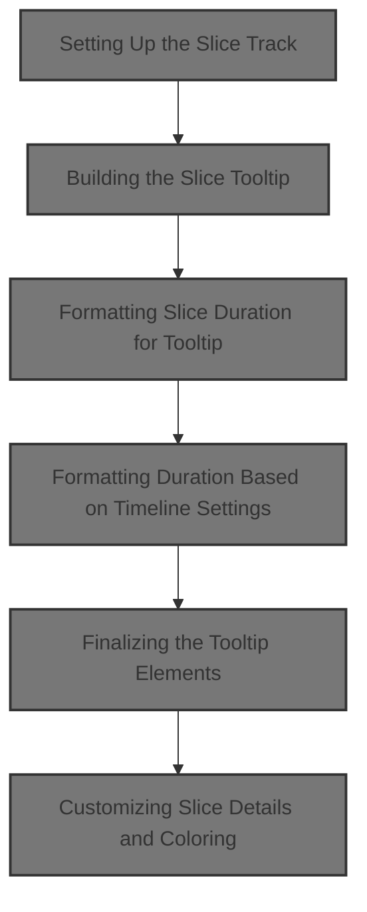

This document describes how the system creates and renders a visual track for trace slices, supporting interactive analysis in the timeline. Users can inspect slices, view contextual tooltips, and see details panels tailored to slice type, including Android logs. Colorization helps differentiate slices, making trace analysis more intuitive.



# Where is this flow used?

This flow is used multiple times in the codebase as represented in the following diagram:

(Note - these are only some of the entry points of this flow)

```mermaid
graph TD;
      01a10f3518909909ba091bd669f4ec3e20f7d9f23cd309e48a5067c2f9a4fe30(ui/…/bigtrace/index.ts::TraceProcessorTrackPlugin.onTraceLoad) --> 5964eaa985ab47e2a5a4f7e775f65b463f3181d29d9db3c18458003129c5baae(ui/…/bigtrace/index.ts::TraceProcessorTrackPlugin.addSlices)

5964eaa985ab47e2a5a4f7e775f65b463f3181d29d9db3c18458003129c5baae(ui/…/bigtrace/index.ts::TraceProcessorTrackPlugin.addSlices) --> 4467c0b4c771342e6580f037f3df53e0dec8e8d07b6285ae007f9a5837c4db50(ui/…/dev.perfetto.TraceProcessorTrack/trace_processor_slice_track.ts::createTraceProcessorSliceTrack):::mainFlowStyle

a9863466799f3b767b42c113c829fdff5b709cc99145f64b1e9edb7f1202c406(ui/…/bigtrace/index.ts::onTraceLoad) --> 14aa6d26f196fb6ec83b341f7574402cbec3941a8e68faad0834faa792bfde57(ui/…/bigtrace/index.ts::addGlobalAllocs)

14aa6d26f196fb6ec83b341f7574402cbec3941a8e68faad0834faa792bfde57(ui/…/bigtrace/index.ts::addGlobalAllocs) --> 4467c0b4c771342e6580f037f3df53e0dec8e8d07b6285ae007f9a5837c4db50(ui/…/dev.perfetto.TraceProcessorTrack/trace_processor_slice_track.ts::createTraceProcessorSliceTrack):::mainFlowStyle

f86b71c537306e47d26af37bf83fc535bc9baf805ce2d3dad29216ca299de556(ui/…/bigtrace/index.ts::TrackEventPlugin.onTraceLoad) --> 4467c0b4c771342e6580f037f3df53e0dec8e8d07b6285ae007f9a5837c4db50(ui/…/dev.perfetto.TraceProcessorTrack/trace_processor_slice_track.ts::createTraceProcessorSliceTrack):::mainFlowStyle

1e5850234de4d8dbff68ebf120fb66307069f2f5a7aa55a4c7a2034610a7e262(ui/…/bigtrace/index.ts::onTraceLoad) --> af34804b51f14826b06fff4e68ea116de1a5b1a7c053bedd51aafeb4b982c63b(ui/…/bigtrace/index.ts::addTracks)

af34804b51f14826b06fff4e68ea116de1a5b1a7c053bedd51aafeb4b982c63b(ui/…/bigtrace/index.ts::addTracks) --> 4467c0b4c771342e6580f037f3df53e0dec8e8d07b6285ae007f9a5837c4db50(ui/…/dev.perfetto.TraceProcessorTrack/trace_processor_slice_track.ts::createTraceProcessorSliceTrack):::mainFlowStyle

dcfa23464a481b8ccb88db3e233a961e52780012a19817970d7bd8e2d4c5dce7(ui/…/bigtrace/index.ts::onTraceLoad) --> 990ceddfbd4abbaa863ccde06b0a31bef71daef6094324c92d76c9ca70d156f5(ui/…/bigtrace/index.ts::addRpmTracks)

990ceddfbd4abbaa863ccde06b0a31bef71daef6094324c92d76c9ca70d156f5(ui/…/bigtrace/index.ts::addRpmTracks) --> 4467c0b4c771342e6580f037f3df53e0dec8e8d07b6285ae007f9a5837c4db50(ui/…/dev.perfetto.TraceProcessorTrack/trace_processor_slice_track.ts::createTraceProcessorSliceTrack):::mainFlowStyle


classDef mainFlowStyle color:#000000,fill:#7CB9F4
classDef rootsStyle color:#000000,fill:#00FFF4
classDef Style1 color:#000000,fill:#00FFAA
classDef Style2 color:#000000,fill:#FFFF00
classDef Style3 color:#000000,fill:#AA7CB9

%% Swimm:
%% graph TD;
%%       01a10f3518909909ba091bd669f4ec3e20f7d9f23cd309e48a5067c2f9a4fe30(<SwmPath>[ui/…/bigtrace/index.ts](ui/src/bigtrace/index.ts)</SwmPath>::TraceProcessorTrackPlugin.onTraceLoad) --> 5964eaa985ab47e2a5a4f7e775f65b463f3181d29d9db3c18458003129c5baae(<SwmPath>[ui/…/bigtrace/index.ts](ui/src/bigtrace/index.ts)</SwmPath>::TraceProcessorTrackPlugin.addSlices)
%% 
%% 5964eaa985ab47e2a5a4f7e775f65b463f3181d29d9db3c18458003129c5baae(<SwmPath>[ui/…/bigtrace/index.ts](ui/src/bigtrace/index.ts)</SwmPath>::TraceProcessorTrackPlugin.addSlices) --> 4467c0b4c771342e6580f037f3df53e0dec8e8d07b6285ae007f9a5837c4db50(<SwmPath>[ui/…/dev.perfetto.TraceProcessorTrack/trace_processor_slice_track.ts](ui/src/plugins/dev.perfetto.TraceProcessorTrack/trace_processor_slice_track.ts)</SwmPath>::<SwmToken path="ui/src/plugins/dev.perfetto.TraceProcessorTrack/trace_processor_slice_track.ts" pos="58:6:6" line-data="export async function createTraceProcessorSliceTrack({">`createTraceProcessorSliceTrack`</SwmToken>):::mainFlowStyle
%% 
%% a9863466799f3b767b42c113c829fdff5b709cc99145f64b1e9edb7f1202c406(<SwmPath>[ui/…/bigtrace/index.ts](ui/src/bigtrace/index.ts)</SwmPath>::onTraceLoad) --> 14aa6d26f196fb6ec83b341f7574402cbec3941a8e68faad0834faa792bfde57(<SwmPath>[ui/…/bigtrace/index.ts](ui/src/bigtrace/index.ts)</SwmPath>::addGlobalAllocs)
%% 
%% 14aa6d26f196fb6ec83b341f7574402cbec3941a8e68faad0834faa792bfde57(<SwmPath>[ui/…/bigtrace/index.ts](ui/src/bigtrace/index.ts)</SwmPath>::addGlobalAllocs) --> 4467c0b4c771342e6580f037f3df53e0dec8e8d07b6285ae007f9a5837c4db50(<SwmPath>[ui/…/dev.perfetto.TraceProcessorTrack/trace_processor_slice_track.ts](ui/src/plugins/dev.perfetto.TraceProcessorTrack/trace_processor_slice_track.ts)</SwmPath>::<SwmToken path="ui/src/plugins/dev.perfetto.TraceProcessorTrack/trace_processor_slice_track.ts" pos="58:6:6" line-data="export async function createTraceProcessorSliceTrack({">`createTraceProcessorSliceTrack`</SwmToken>):::mainFlowStyle
%% 
%% f86b71c537306e47d26af37bf83fc535bc9baf805ce2d3dad29216ca299de556(<SwmPath>[ui/…/bigtrace/index.ts](ui/src/bigtrace/index.ts)</SwmPath>::TrackEventPlugin.onTraceLoad) --> 4467c0b4c771342e6580f037f3df53e0dec8e8d07b6285ae007f9a5837c4db50(<SwmPath>[ui/…/dev.perfetto.TraceProcessorTrack/trace_processor_slice_track.ts](ui/src/plugins/dev.perfetto.TraceProcessorTrack/trace_processor_slice_track.ts)</SwmPath>::<SwmToken path="ui/src/plugins/dev.perfetto.TraceProcessorTrack/trace_processor_slice_track.ts" pos="58:6:6" line-data="export async function createTraceProcessorSliceTrack({">`createTraceProcessorSliceTrack`</SwmToken>):::mainFlowStyle
%% 
%% 1e5850234de4d8dbff68ebf120fb66307069f2f5a7aa55a4c7a2034610a7e262(<SwmPath>[ui/…/bigtrace/index.ts](ui/src/bigtrace/index.ts)</SwmPath>::onTraceLoad) --> af34804b51f14826b06fff4e68ea116de1a5b1a7c053bedd51aafeb4b982c63b(<SwmPath>[ui/…/bigtrace/index.ts](ui/src/bigtrace/index.ts)</SwmPath>::addTracks)
%% 
%% af34804b51f14826b06fff4e68ea116de1a5b1a7c053bedd51aafeb4b982c63b(<SwmPath>[ui/…/bigtrace/index.ts](ui/src/bigtrace/index.ts)</SwmPath>::addTracks) --> 4467c0b4c771342e6580f037f3df53e0dec8e8d07b6285ae007f9a5837c4db50(<SwmPath>[ui/…/dev.perfetto.TraceProcessorTrack/trace_processor_slice_track.ts](ui/src/plugins/dev.perfetto.TraceProcessorTrack/trace_processor_slice_track.ts)</SwmPath>::<SwmToken path="ui/src/plugins/dev.perfetto.TraceProcessorTrack/trace_processor_slice_track.ts" pos="58:6:6" line-data="export async function createTraceProcessorSliceTrack({">`createTraceProcessorSliceTrack`</SwmToken>):::mainFlowStyle
%% 
%% dcfa23464a481b8ccb88db3e233a961e52780012a19817970d7bd8e2d4c5dce7(<SwmPath>[ui/…/bigtrace/index.ts](ui/src/bigtrace/index.ts)</SwmPath>::onTraceLoad) --> 990ceddfbd4abbaa863ccde06b0a31bef71daef6094324c92d76c9ca70d156f5(<SwmPath>[ui/…/bigtrace/index.ts](ui/src/bigtrace/index.ts)</SwmPath>::addRpmTracks)
%% 
%% 990ceddfbd4abbaa863ccde06b0a31bef71daef6094324c92d76c9ca70d156f5(<SwmPath>[ui/…/bigtrace/index.ts](ui/src/bigtrace/index.ts)</SwmPath>::addRpmTracks) --> 4467c0b4c771342e6580f037f3df53e0dec8e8d07b6285ae007f9a5837c4db50(<SwmPath>[ui/…/dev.perfetto.TraceProcessorTrack/trace_processor_slice_track.ts](ui/src/plugins/dev.perfetto.TraceProcessorTrack/trace_processor_slice_track.ts)</SwmPath>::<SwmToken path="ui/src/plugins/dev.perfetto.TraceProcessorTrack/trace_processor_slice_track.ts" pos="58:6:6" line-data="export async function createTraceProcessorSliceTrack({">`createTraceProcessorSliceTrack`</SwmToken>):::mainFlowStyle
%% 
%% 
%% classDef mainFlowStyle color:#000000,fill:#7CB9F4
%% classDef rootsStyle color:#000000,fill:#00FFF4
%% classDef Style1 color:#000000,fill:#00FFAA
%% classDef Style2 color:#000000,fill:#FFFF00
%% classDef Style3 color:#000000,fill:#AA7CB9
```



# Setting Up the Slice Track

<SwmSnippet path="/ui/src/plugins/dev.perfetto.TraceProcessorTrack/trace_processor_slice_track.ts" line="58">

---

In <SwmToken path="ui/src/plugins/dev.perfetto.TraceProcessorTrack/trace_processor_slice_track.ts" pos="58:6:6" line-data="export async function createTraceProcessorSliceTrack({">`createTraceProcessorSliceTrack`</SwmToken>, we kick off by fetching the dataset asynchronously using <SwmToken path="ui/src/plugins/dev.perfetto.TraceProcessorTrack/trace_processor_slice_track.ts" pos="69:6:6" line-data="    dataset: await getDataset(trace.engine, trackIds, depthTableName),">`getDataset`</SwmToken>, which gives us the slice data to visualize. We set up callbacks for <SwmToken path="ui/src/plugins/dev.perfetto.TraceProcessorTrack/trace_processor_slice_track.ts" pos="73:1:1" line-data="    fillRatio: (row) =&gt; {">`fillRatio`</SwmToken> (normalizes thread duration for each slice), tooltips (using <SwmToken path="ui/src/plugins/dev.perfetto.TraceProcessorTrack/trace_processor_slice_track.ts" pos="81:3:3" line-data="      return renderTooltip(trace, slice, {">`renderTooltip`</SwmToken> for contextual info), and optionally a custom <SwmToken path="ui/src/plugins/dev.perfetto.TraceProcessorTrack/trace_processor_slice_track.ts" pos="63:1:1" line-data="  detailsPanel,">`detailsPanel`</SwmToken>. Next, we need to call <SwmPath>[ui/…/tracks/slice_track.ts](ui/src/components/tracks/slice_track.ts)</SwmPath> because that's where the <SwmToken path="ui/src/plugins/dev.perfetto.TraceProcessorTrack/trace_processor_slice_track.ts" pos="66:3:3" line-data="  return SliceTrack.create({">`SliceTrack`</SwmToken> UI logic and rendering are handled.

```typescript
export async function createTraceProcessorSliceTrack({
  trace,
  uri,
  maxDepth,
  trackIds,
  detailsPanel,
  depthTableName,
}: TraceProcessorSliceTrackAttrs) {
  return SliceTrack.create({
    trace,
    uri,
    dataset: await getDataset(trace.engine, trackIds, depthTableName),
    sliceName: (row) => (row.name === null ? '[null]' : row.name),
    initialMaxDepth: maxDepth,
    rootTableName: 'slice',
    fillRatio: (row) => {
      if (row.dur > 0n && row.thread_dur !== null) {
        return clamp(BIMath.ratio(row.thread_dur, row.dur), 0, 1);
      } else {
        return 1;
      }
    },
    tooltip: (slice) => {
      return renderTooltip(trace, slice, {
        title: slice.title,
        extras:
          exists(slice.row.category) && m('', 'Category: ', slice.row.category),
      });
    },
    detailsPanel: detailsPanel
```

---

</SwmSnippet>

## Building the Slice Tooltip

<SwmSnippet path="/ui/src/components/tracks/slice_track.ts" line="442">

---

In <SwmToken path="ui/src/components/tracks/slice_track.ts" pos="442:4:4" line-data="export function renderTooltip&lt;T&gt;(">`renderTooltip`</SwmToken>, we start by formatting the slice's duration for display, then build the tooltip UI with the title, any extra info, and a message if there are multiple events. We call <SwmToken path="ui/src/components/tracks/slice_track.ts" pos="447:7:7" line-data="  const durationFormatted = formatDurationForTooltip(trace, slice);">`formatDurationForTooltip`</SwmToken> next to get the right duration string for the tooltip.

```typescript
export function renderTooltip<T>(
  trace: Trace,
  slice: SliceWithRow<T>,
  opts: {readonly title?: string; readonly extras?: m.Children} = {},
) {
  const durationFormatted = formatDurationForTooltip(trace, slice);
```

---

</SwmSnippet>

### Formatting Slice Duration for Tooltip

```mermaid
%%{init: {"flowchart": {"defaultRenderer": "elk"}} }%%
flowchart TD
  node1["Receive slice information"] --> node2{"Is slice incomplete?"}
  click node1 openCode "ui/src/components/tracks/slice_track.ts:457:458"
  click node2 openCode "ui/src/components/tracks/slice_track.ts:459:460"
  node2 -->|"Yes"| node3[Show '[Incomplete]' in tooltip]
  click node3 openCode "ui/src/components/tracks/slice_track.ts:460:461"
  node2 -->|"No"| node4{"Is slice instant?"}
  click node4 openCode "ui/src/components/tracks/slice_track.ts:461:462"
  node4 -->|"Yes"| node5["Show nothing in tooltip"]
  click node5 openCode "ui/src/components/tracks/slice_track.ts:462:463"
  node4 -->|"No"| node6["Show formatted duration (using slice duration value) in tooltip"]
  click node6 openCode "ui/src/components/tracks/slice_track.ts:464:465"

classDef HeadingStyle fill:#777777,stroke:#333,stroke-width:2px;

%% Swimm:
%% %%{init: {"flowchart": {"defaultRenderer": "elk"}} }%%
%% flowchart TD
%%   node1["Receive slice information"] --> node2{"Is slice incomplete?"}
%%   click node1 openCode "<SwmPath>[ui/…/tracks/slice_track.ts](ui/src/components/tracks/slice_track.ts)</SwmPath>:457:458"
%%   click node2 openCode "<SwmPath>[ui/…/tracks/slice_track.ts](ui/src/components/tracks/slice_track.ts)</SwmPath>:459:460"
%%   node2 -->|"Yes"| node3[Show '[Incomplete]' in tooltip]
%%   click node3 openCode "<SwmPath>[ui/…/tracks/slice_track.ts](ui/src/components/tracks/slice_track.ts)</SwmPath>:460:461"
%%   node2 -->|"No"| node4{"Is slice instant?"}
%%   click node4 openCode "<SwmPath>[ui/…/tracks/slice_track.ts](ui/src/components/tracks/slice_track.ts)</SwmPath>:461:462"
%%   node4 -->|"Yes"| node5["Show nothing in tooltip"]
%%   click node5 openCode "<SwmPath>[ui/…/tracks/slice_track.ts](ui/src/components/tracks/slice_track.ts)</SwmPath>:462:463"
%%   node4 -->|"No"| node6["Show formatted duration (using slice duration value) in tooltip"]
%%   click node6 openCode "<SwmPath>[ui/…/tracks/slice_track.ts](ui/src/components/tracks/slice_track.ts)</SwmPath>:464:465"
%% 
%% classDef HeadingStyle fill:#777777,stroke:#333,stroke-width:2px;
```

<SwmSnippet path="/ui/src/components/tracks/slice_track.ts" line="457">

---

<SwmToken path="ui/src/components/tracks/slice_track.ts" pos="457:2:2" line-data="function formatDurationForTooltip(trace: Trace, slice: Slice) {">`formatDurationForTooltip`</SwmToken> checks slice flags to decide if we show '\[Incomplete\]', nothing, or a formatted duration. We call <SwmToken path="ui/src/components/tracks/slice_track.ts" pos="464:3:3" line-data="    return formatDuration(trace, dur);">`formatDuration`</SwmToken> next if the slice is neither incomplete nor instant, to get the actual duration string.

```typescript
function formatDurationForTooltip(trace: Trace, slice: Slice) {
  const {dur, flags} = slice;
  if (flags & SLICE_FLAGS_INCOMPLETE) {
    return '[Incomplete]';
  } else if (flags & SLICE_FLAGS_INSTANT) {
    return undefined;
  } else {
    return formatDuration(trace, dur);
  }
}
```

---

</SwmSnippet>

### Formatting Duration Based on Timeline Settings

```mermaid
%%{init: {"flowchart": {"defaultRenderer": "elk"}} }%%
flowchart TD
  node1["Receive duration and format preference"]
  click node1 openCode "ui/src/components/time_utils.ts:32:54"
  node1 --> node2{"Which timestamp format?"}
  click node2 openCode "ui/src/components/time_utils.ts:34:50"
  node2 -->|"UTC/TraceTz/Timecode/CustomTimezone"| node3{"Which duration precision?"}
  click node3 openCode "ui/src/components/time_utils.ts:56:67"
  node3 -->|"Human-readable"| node4["Show as human-friendly string"]
  click node4 openCode "ui/src/components/time_utils.ts:60:61"
  node3 -->|"Full precision"| node5["Show as full precision string"]
  click node5 openCode "ui/src/components/time_utils.ts:62:63"
  node2 -->|TraceNs| node6["Show as raw number"]
  click node6 openCode "ui/src/components/time_utils.ts:41:41"
  node2 -->|TraceNsLocale| node7["Show as localized number"]
  click node7 openCode "ui/src/components/time_utils.ts:43:43"
  node2 -->|"Seconds"| node8["Show as seconds"]
  click node8 openCode "ui/src/components/time_utils.ts:45:45"
  node2 -->|"Milliseconds"| node9["Show as milliseconds"]
  click node9 openCode "ui/src/components/time_utils.ts:47:47"
  node2 -->|"Microseconds"| node10["Show as microseconds"]
  click node10 openCode "ui/src/components/time_utils.ts:49:49"
  node2 -->|"Other"| node11["Error: Invalid format"]
  click node11 openCode "ui/src/components/time_utils.ts:51:53"

classDef HeadingStyle fill:#777777,stroke:#333,stroke-width:2px;

%% Swimm:
%% %%{init: {"flowchart": {"defaultRenderer": "elk"}} }%%
%% flowchart TD
%%   node1["Receive duration and format preference"]
%%   click node1 openCode "<SwmPath>[ui/…/components/time_utils.ts](ui/src/components/time_utils.ts)</SwmPath>:32:54"
%%   node1 --> node2{"Which timestamp format?"}
%%   click node2 openCode "<SwmPath>[ui/…/components/time_utils.ts](ui/src/components/time_utils.ts)</SwmPath>:34:50"
%%   node2 -->|"UTC/TraceTz/Timecode/CustomTimezone"| node3{"Which duration precision?"}
%%   click node3 openCode "<SwmPath>[ui/…/components/time_utils.ts](ui/src/components/time_utils.ts)</SwmPath>:56:67"
%%   node3 -->|"Human-readable"| node4["Show as human-friendly string"]
%%   click node4 openCode "<SwmPath>[ui/…/components/time_utils.ts](ui/src/components/time_utils.ts)</SwmPath>:60:61"
%%   node3 -->|"Full precision"| node5["Show as full precision string"]
%%   click node5 openCode "<SwmPath>[ui/…/components/time_utils.ts](ui/src/components/time_utils.ts)</SwmPath>:62:63"
%%   node2 -->|<SwmToken path="ui/src/components/time_utils.ts" pos="40:5:5" line-data="    case TimestampFormat.TraceNs:">`TraceNs`</SwmToken>| node6["Show as raw number"]
%%   click node6 openCode "<SwmPath>[ui/…/components/time_utils.ts](ui/src/components/time_utils.ts)</SwmPath>:41:41"
%%   node2 -->|<SwmToken path="ui/src/components/time_utils.ts" pos="42:5:5" line-data="    case TimestampFormat.TraceNsLocale:">`TraceNsLocale`</SwmToken>| node7["Show as localized number"]
%%   click node7 openCode "<SwmPath>[ui/…/components/time_utils.ts](ui/src/components/time_utils.ts)</SwmPath>:43:43"
%%   node2 -->|"Seconds"| node8["Show as seconds"]
%%   click node8 openCode "<SwmPath>[ui/…/components/time_utils.ts](ui/src/components/time_utils.ts)</SwmPath>:45:45"
%%   node2 -->|"Milliseconds"| node9["Show as milliseconds"]
%%   click node9 openCode "<SwmPath>[ui/…/components/time_utils.ts](ui/src/components/time_utils.ts)</SwmPath>:47:47"
%%   node2 -->|"Microseconds"| node10["Show as microseconds"]
%%   click node10 openCode "<SwmPath>[ui/…/components/time_utils.ts](ui/src/components/time_utils.ts)</SwmPath>:49:49"
%%   node2 -->|"Other"| node11["Error: Invalid format"]
%%   click node11 openCode "<SwmPath>[ui/…/components/time_utils.ts](ui/src/components/time_utils.ts)</SwmPath>:51:53"
%% 
%% classDef HeadingStyle fill:#777777,stroke:#333,stroke-width:2px;
```



<SwmSnippet path="/ui/src/components/time_utils.ts" line="32">

---

In <SwmToken path="ui/src/components/time_utils.ts" pos="32:4:4" line-data="export function formatDuration(trace: Trace, dur: duration): string {">`formatDuration`</SwmToken>, we pick the formatting logic based on the trace's timestamp format. For some formats, we call <SwmToken path="ui/src/components/time_utils.ts" pos="39:3:3" line-data="      return renderFormattedDuration(trace, dur);">`renderFormattedDuration`</SwmToken> to handle precision. This lets us support different trace sources and user needs.

```typescript
export function formatDuration(trace: Trace, dur: duration): string {
  const fmt = trace.timeline.timestampFormat;
  switch (fmt) {
    case TimestampFormat.UTC:
    case TimestampFormat.TraceTz:
    case TimestampFormat.Timecode:
    case TimestampFormat.CustomTimezone:
      return renderFormattedDuration(trace, dur);
    case TimestampFormat.TraceNs:
      return dur.toString();
    case TimestampFormat.TraceNsLocale:
      return dur.toLocaleString();
    case TimestampFormat.Seconds:
      return Duration.formatSeconds(dur);
    case TimestampFormat.Milliseconds:
      return Duration.formatMilliseconds(dur);
    case TimestampFormat.Microseconds:
      return Duration.formatMicroseconds(dur);
    default:
```

---

</SwmSnippet>

<SwmSnippet path="/ui/src/components/time_utils.ts" line="56">

---

<SwmToken path="ui/src/components/time_utils.ts" pos="56:2:2" line-data="function renderFormattedDuration(trace: Trace, dur: duration): string {">`renderFormattedDuration`</SwmToken> picks between human-readable and full formats based on the trace's <SwmToken path="ui/src/components/time_utils.ts" pos="57:11:11" line-data="  const fmt = trace.timeline.durationPrecision;">`durationPrecision`</SwmToken> setting. If the value is invalid, we throw an error to catch bugs early.

```typescript
function renderFormattedDuration(trace: Trace, dur: duration): string {
  const fmt = trace.timeline.durationPrecision;
  switch (fmt) {
    case DurationPrecision.HumanReadable:
      return Duration.humanise(dur);
    case DurationPrecision.Full:
      return Duration.format(dur);
    default:
      const x: never = fmt;
      throw new Error(`Invalid format ${x}`);
  }
}
```

---

</SwmSnippet>

<SwmSnippet path="/ui/src/components/time_utils.ts" line="51">

---

We just returned from <SwmToken path="ui/src/components/time_utils.ts" pos="39:3:3" line-data="      return renderFormattedDuration(trace, dur);">`renderFormattedDuration`</SwmToken> in <SwmPath>[ui/…/components/time_utils.ts](ui/src/components/time_utils.ts)</SwmPath>. If the timestamp format isn't recognized, we throw an error to make sure only valid formats are used for duration display.

```typescript
      const x: never = fmt;
      throw new Error(`Invalid format ${x}`);
  }
}
```

---

</SwmSnippet>

### Finalizing the Tooltip Elements

```mermaid
%%{init: {"flowchart": {"defaultRenderer": "elk"}} }%%
flowchart TD
  node1["Start rendering tooltip"]
  click node1 openCode "ui/src/components/tracks/slice_track.ts:448:454"
  node1 --> node2{"Is duration available?"}
  click node2 openCode "ui/src/components/tracks/slice_track.ts:450:450"
  node2 -->|"Yes"| node3["Show duration in bold"]
  click node3 openCode "ui/src/components/tracks/slice_track.ts:450:450"
  node2 -->|"No"| node4["Skip duration"]
  click node4 openCode "ui/src/components/tracks/slice_track.ts:450:450"
  node3 --> node5["Show title and extras"]
  click node5 openCode "ui/src/components/tracks/slice_track.ts:450:451"
  node4 --> node5
  node5 --> node6{"Are there multiple events?"}
  click node6 openCode "ui/src/components/tracks/slice_track.ts:452:452"
  node6 -->|"Yes"| node7["Show 'and N other events' message"]
  click node7 openCode "ui/src/components/tracks/slice_track.ts:452:452"
  node6 -->|"No"| node8["Tooltip ready"]
  click node8 openCode "ui/src/components/tracks/slice_track.ts:453:454"
  node7 --> node8
classDef HeadingStyle fill:#777777,stroke:#333,stroke-width:2px;

%% Swimm:
%% %%{init: {"flowchart": {"defaultRenderer": "elk"}} }%%
%% flowchart TD
%%   node1["Start rendering tooltip"]
%%   click node1 openCode "<SwmPath>[ui/…/tracks/slice_track.ts](ui/src/components/tracks/slice_track.ts)</SwmPath>:448:454"
%%   node1 --> node2{"Is duration available?"}
%%   click node2 openCode "<SwmPath>[ui/…/tracks/slice_track.ts](ui/src/components/tracks/slice_track.ts)</SwmPath>:450:450"
%%   node2 -->|"Yes"| node3["Show duration in bold"]
%%   click node3 openCode "<SwmPath>[ui/…/tracks/slice_track.ts](ui/src/components/tracks/slice_track.ts)</SwmPath>:450:450"
%%   node2 -->|"No"| node4["Skip duration"]
%%   click node4 openCode "<SwmPath>[ui/…/tracks/slice_track.ts](ui/src/components/tracks/slice_track.ts)</SwmPath>:450:450"
%%   node3 --> node5["Show title and extras"]
%%   click node5 openCode "<SwmPath>[ui/…/tracks/slice_track.ts](ui/src/components/tracks/slice_track.ts)</SwmPath>:450:451"
%%   node4 --> node5
%%   node5 --> node6{"Are there multiple events?"}
%%   click node6 openCode "<SwmPath>[ui/…/tracks/slice_track.ts](ui/src/components/tracks/slice_track.ts)</SwmPath>:452:452"
%%   node6 -->|"Yes"| node7["Show 'and N other events' message"]
%%   click node7 openCode "<SwmPath>[ui/…/tracks/slice_track.ts](ui/src/components/tracks/slice_track.ts)</SwmPath>:452:452"
%%   node6 -->|"No"| node8["Tooltip ready"]
%%   click node8 openCode "<SwmPath>[ui/…/tracks/slice_track.ts](ui/src/components/tracks/slice_track.ts)</SwmPath>:453:454"
%%   node7 --> node8
%% classDef HeadingStyle fill:#777777,stroke:#333,stroke-width:2px;
```



<SwmSnippet path="/ui/src/components/tracks/slice_track.ts" line="448">

---

We just returned from <SwmToken path="ui/src/components/tracks/slice_track.ts" pos="447:7:7" line-data="  const durationFormatted = formatDurationForTooltip(trace, slice);">`formatDurationForTooltip`</SwmToken> in <SwmPath>[ui/…/tracks/slice_track.ts](ui/src/components/tracks/slice_track.ts)</SwmPath>. Now we build the final tooltip array: bold duration if present, title, extras, and a message if there are multiple events. This sets up the UI for slice tooltips.

```typescript
  const {title = slice.title, extras} = opts;
  return [
    m('', exists(durationFormatted) && m('b', durationFormatted), ' ', title),
    extras,
    slice.count > 1 && m('div', `and ${slice.count - 1} other events`),
  ];
}
```

---

</SwmSnippet>

## Customizing Slice Details and Coloring

```mermaid
%%{init: {"flowchart": {"defaultRenderer": "elk"}} }%%
flowchart TD
  node1["Create slice track for trace visualization"]
  click node1 openCode "ui/src/plugins/dev.perfetto.TraceProcessorTrack/trace_processor_slice_track.ts:88:102"
  node1 --> node2{"Does slice have correlation ID?"}
  click node2 openCode "ui/src/plugins/dev.perfetto.TraceProcessorTrack/trace_processor_slice_track.ts:91:95"
  node2 -->|"Yes (correlation_id)"| node3["Assign color by correlation ID"]
  click node3 openCode "ui/src/plugins/dev.perfetto.TraceProcessorTrack/trace_processor_slice_track.ts:92:94"
  node2 -->|"No"| node4{"Does slice have name?"}
  click node4 openCode "ui/src/plugins/dev.perfetto.TraceProcessorTrack/trace_processor_slice_track.ts:96:97"
  node4 -->|"Yes (name)"| node5["Assign color by name"]
  click node5 openCode "ui/src/plugins/dev.perfetto.TraceProcessorTrack/trace_processor_slice_track.ts:97:97"
  node4 -->|"No"| node6["Assign color by slice ID"]
  click node6 openCode "ui/src/plugins/dev.perfetto.TraceProcessorTrack/trace_processor_slice_track.ts:99:99"

classDef HeadingStyle fill:#777777,stroke:#333,stroke-width:2px;

%% Swimm:
%% %%{init: {"flowchart": {"defaultRenderer": "elk"}} }%%
%% flowchart TD
%%   node1["Create slice track for trace visualization"]
%%   click node1 openCode "<SwmPath>[ui/…/dev.perfetto.TraceProcessorTrack/trace_processor_slice_track.ts](ui/src/plugins/dev.perfetto.TraceProcessorTrack/trace_processor_slice_track.ts)</SwmPath>:88:102"
%%   node1 --> node2{"Does slice have correlation ID?"}
%%   click node2 openCode "<SwmPath>[ui/…/dev.perfetto.TraceProcessorTrack/trace_processor_slice_track.ts](ui/src/plugins/dev.perfetto.TraceProcessorTrack/trace_processor_slice_track.ts)</SwmPath>:91:95"
%%   node2 -->|"Yes (<SwmToken path="ui/src/plugins/dev.perfetto.TraceProcessorTrack/trace_processor_slice_track.ts" pos="91:6:6" line-data="      if (row.correlation_id) {">`correlation_id`</SwmToken>)"| node3["Assign color by correlation ID"]
%%   click node3 openCode "<SwmPath>[ui/…/dev.perfetto.TraceProcessorTrack/trace_processor_slice_track.ts](ui/src/plugins/dev.perfetto.TraceProcessorTrack/trace_processor_slice_track.ts)</SwmPath>:92:94"
%%   node2 -->|"No"| node4{"Does slice have name?"}
%%   click node4 openCode "<SwmPath>[ui/…/dev.perfetto.TraceProcessorTrack/trace_processor_slice_track.ts](ui/src/plugins/dev.perfetto.TraceProcessorTrack/trace_processor_slice_track.ts)</SwmPath>:96:97"
%%   node4 -->|"Yes (name)"| node5["Assign color by name"]
%%   click node5 openCode "<SwmPath>[ui/…/dev.perfetto.TraceProcessorTrack/trace_processor_slice_track.ts](ui/src/plugins/dev.perfetto.TraceProcessorTrack/trace_processor_slice_track.ts)</SwmPath>:97:97"
%%   node4 -->|"No"| node6["Assign color by slice ID"]
%%   click node6 openCode "<SwmPath>[ui/…/dev.perfetto.TraceProcessorTrack/trace_processor_slice_track.ts](ui/src/plugins/dev.perfetto.TraceProcessorTrack/trace_processor_slice_track.ts)</SwmPath>:99:99"
%% 
%% classDef HeadingStyle fill:#777777,stroke:#333,stroke-width:2px;
```



<SwmSnippet path="/ui/src/plugins/dev.perfetto.TraceProcessorTrack/trace_processor_slice_track.ts" line="88">

---

We just returned from <SwmToken path="ui/src/plugins/dev.perfetto.TraceProcessorTrack/trace_processor_slice_track.ts" pos="81:3:3" line-data="      return renderTooltip(trace, slice, {">`renderTooltip`</SwmToken> in <SwmPath>[ui/…/tracks/slice_track.ts](ui/src/components/tracks/slice_track.ts)</SwmPath>. Now, in <SwmToken path="ui/src/plugins/dev.perfetto.TraceProcessorTrack/trace_processor_slice_track.ts" pos="58:6:6" line-data="export async function createTraceProcessorSliceTrack({">`createTraceProcessorSliceTrack`</SwmToken>, we set up the <SwmToken path="ui/src/plugins/dev.perfetto.TraceProcessorTrack/trace_processor_slice_track.ts" pos="88:9:9" line-data="      ? (row) =&gt; detailsPanel(row)">`detailsPanel`</SwmToken> (custom or default) and colorizer logic for slices. Next, we call <SwmPath>[ui/…/com.android.AndroidLog/logs_track.ts](ui/src/plugins/com.android.AndroidLog/logs_track.ts)</SwmPath> to handle details panels for Android log slices, which need their own UI.

```typescript
      ? (row) => detailsPanel(row)
      : () => new ThreadSliceDetailsPanel(trace),
    colorizer: (row) => {
      if (row.correlation_id) {
        return getColorForSlice(row.correlation_id, {
          stripTrailingDigits: false,
        });
      }
      if (row.name) {
        return getColorForSlice(row.name);
      }
      return getColorForSlice(`${row.id}`);
    },
  });
}
```

---

</SwmSnippet>

<SwmSnippet path="/ui/src/plugins/com.android.AndroidLog/logs_track.ts" line="92">

---

<SwmToken path="ui/src/plugins/com.android.AndroidLog/logs_track.ts" pos="92:1:1" line-data="    detailsPanel: (row) =&gt; {">`detailsPanel`</SwmToken> in <SwmPath>[ui/…/com.android.AndroidLog/logs_track.ts](ui/src/plugins/com.android.AndroidLog/logs_track.ts)</SwmPath> kicks off an async query to fetch the log message for the selected row. The UI shows a spinner until the message loads, then updates with the actual log. The rest of the panel displays log metadata using repository-specific components.

```typescript
    detailsPanel: (row) => {
      // The msg is initially undefined, it'll be filled in when it loads
      let msg: string | undefined;

      // Quickly load the log message
      trace.engine
        .query(`select msg from android_logs where id = ${row.id}`)
        .then((result) => {
          const resultRow = result.maybeFirstRow({msg: STR});
          msg = resultRow?.msg;
        });

      return {
        render() {
          return m(
            DetailsShell,
            {
              title: `Android Log`,
            },
            m(
              GridLayout,
              m(
                GridLayoutColumn,
                m(
                  Section,
                  {title: 'Details'},
                  m(
                    Tree,
                    m(TreeNode, {
                      left: 'ID',
                      right: row.id,
                    }),
                    m(TreeNode, {
                      left: 'Timestamp',
                      right: m(Timestamp, {trace, ts: Time.fromRaw(row.ts)}),
                    }),
                    m(TreeNode, {
                      left: 'Priority',
                      right: row.prio,
                    }),
                    m(TreeNode, {
                      left: 'Tag',
                      right: row.tag,
                    }),
                    m(TreeNode, {
                      left: 'Utid',
                      right: row.utid,
                    }),
                    m(TreeNode, {
                      left: 'Message',
                      right: msg ? msg : m(Spinner),
                    }),
                  ),
                ),
              ),
            ),
          );
        },
      };
    },
```

---

</SwmSnippet>

&nbsp;

*This is an auto-generated document by Swimm 🌊 and has not yet been verified by a human*

<SwmMeta version="3.0.0" repo-id="Z2l0aHViJTNBJTNBY3BsdXNwbHVzLXBlcmZldHRvJTNBJTNBcmljYXJkb2xvcGV6Zw==" repo-name="cplusplus-perfetto"><sup>Powered by [Swimm](https://app.swimm.io/)</sup></SwmMeta>
