This document describes how users can visualize specific argument values as tracks in the trace UI. When an argument is selected, new tracks are created and displayed for interactive exploration, and users can remove them as needed.

# Where is this flow used?

This flow is used multiple times in the codebase as represented in the following diagram:

```mermaid
graph TD;
      06296113c97232812c0630a7d3504cf2f1cc3d4831e2e284f164c3d550c775b4(ui/…/details/slice_args.ts::renderSliceArguments) --> 130830f0d16cb1da4d4605d698dd553245c3fbd75233ed0d9fd3e8f1b482bc9f(ui/…/tracks/visualized_args_tracks.ts::addVisualizedArgTracks):::mainFlowStyle

f7a4d2c1c3e1dfd024a32bb9ae10ee11915ba290e775efc0e51845a0ba415ebb(ui/…/details/thread_slice_details_tab.ts::ThreadSliceDetailsPanel.renderRhs) --> 06296113c97232812c0630a7d3504cf2f1cc3d4831e2e284f164c3d550c775b4(ui/…/details/slice_args.ts::renderSliceArguments)

2fe230bfb1ca986d04b5929824600e28719c1f13007276eb86deb01b20eb7115(ui/…/details/thread_slice_details_tab.ts::ThreadSliceDetailsPanel.render) --> f7a4d2c1c3e1dfd024a32bb9ae10ee11915ba290e775efc0e51845a0ba415ebb(ui/…/details/thread_slice_details_tab.ts::ThreadSliceDetailsPanel.renderRhs)

3d60a59ae63619c6a763915c7dc8ad6d4e223928deec795d22af1d71cefb370e(ui/…/tracks/debug_slice_track_details_panel.ts::DebugSliceTrackDetailsPanel.renderSliceInfo) --> 06296113c97232812c0630a7d3504cf2f1cc3d4831e2e284f164c3d550c775b4(ui/…/details/slice_args.ts::renderSliceArguments)

17b2385e46e6093efd5536a4ac9119709460870e965b5c5f7f8e2f8c71bfc55c(ui/…/tracks/debug_slice_track_details_panel.ts::DebugSliceTrackDetailsPanel.renderDetailsSection) --> 3d60a59ae63619c6a763915c7dc8ad6d4e223928deec795d22af1d71cefb370e(ui/…/tracks/debug_slice_track_details_panel.ts::DebugSliceTrackDetailsPanel.renderSliceInfo)

7527bbfda2c970c374e258fa86af5c08927f24d8daa58d0aa0166b2156f3a326(ui/…/tracks/debug_slice_track_details_panel.ts::DebugSliceTrackDetailsPanel.render) --> 17b2385e46e6093efd5536a4ac9119709460870e965b5c5f7f8e2f8c71bfc55c(ui/…/tracks/debug_slice_track_details_panel.ts::DebugSliceTrackDetailsPanel.renderDetailsSection)

fb289fdb19c21ecf77105fe1c0ebf5d6c1aaabdf99f3828bb0ed5eaa5be734f8(ui/…/details/details.ts::renderValue) --> 06296113c97232812c0630a7d3504cf2f1cc3d4831e2e284f164c3d550c775b4(ui/…/details/slice_args.ts::renderSliceArguments)

fb289fdb19c21ecf77105fe1c0ebf5d6c1aaabdf99f3828bb0ed5eaa5be734f8(ui/…/details/details.ts::renderValue) --> 16e7b36a0dcd494bd411e4fd114e7f13e9e2561c4701ccaaeebe3da3798c899d(ui/…/details/details.ts::Details.render)

fb289fdb19c21ecf77105fe1c0ebf5d6c1aaabdf99f3828bb0ed5eaa5be734f8(ui/…/details/details.ts::renderValue) --> fb289fdb19c21ecf77105fe1c0ebf5d6c1aaabdf99f3828bb0ed5eaa5be734f8(ui/…/details/details.ts::renderValue)

16e7b36a0dcd494bd411e4fd114e7f13e9e2561c4701ccaaeebe3da3798c899d(ui/…/details/details.ts::Details.render) --> fb289fdb19c21ecf77105fe1c0ebf5d6c1aaabdf99f3828bb0ed5eaa5be734f8(ui/…/details/details.ts::renderValue)

abe400341dade878b33044fb773f2038c588fbeebad97cca83ce0d1327c64bbf(ui/…/org.chromium.ChromeScrollJank/event_latency_details_panel.ts::EventLatencySliceDetailsPanel.render) --> 06296113c97232812c0630a7d3504cf2f1cc3d4831e2e284f164c3d550c775b4(ui/…/details/slice_args.ts::renderSliceArguments)

f188da5c7579db3da80be281e58a91001919f237c5fed5c63f03473cf9b711b0(ui/…/details/slice_args.ts::onclick) --> 130830f0d16cb1da4d4605d698dd553245c3fbd75233ed0d9fd3e8f1b482bc9f(ui/…/tracks/visualized_args_tracks.ts::addVisualizedArgTracks):::mainFlowStyle


classDef mainFlowStyle color:#000000,fill:#7CB9F4
classDef rootsStyle color:#000000,fill:#00FFF4
classDef Style1 color:#000000,fill:#00FFAA
classDef Style2 color:#000000,fill:#FFFF00
classDef Style3 color:#000000,fill:#AA7CB9

%% Swimm:
%% graph TD;
%%       06296113c97232812c0630a7d3504cf2f1cc3d4831e2e284f164c3d550c775b4(<SwmPath>[ui/…/details/slice_args.ts](ui/src/components/details/slice_args.ts)</SwmPath>::renderSliceArguments) --> 130830f0d16cb1da4d4605d698dd553245c3fbd75233ed0d9fd3e8f1b482bc9f(<SwmPath>[ui/…/tracks/visualized_args_tracks.ts](ui/src/components/tracks/visualized_args_tracks.ts)</SwmPath>::<SwmToken path="ui/src/components/tracks/visualized_args_tracks.ts" pos="24:6:6" line-data="export async function addVisualizedArgTracks(trace: Trace, argName: string) {">`addVisualizedArgTracks`</SwmToken>):::mainFlowStyle
%% 
%% f7a4d2c1c3e1dfd024a32bb9ae10ee11915ba290e775efc0e51845a0ba415ebb(<SwmPath>[ui/…/details/thread_slice_details_tab.ts](ui/src/components/details/thread_slice_details_tab.ts)</SwmPath>::ThreadSliceDetailsPanel.renderRhs) --> 06296113c97232812c0630a7d3504cf2f1cc3d4831e2e284f164c3d550c775b4(<SwmPath>[ui/…/details/slice_args.ts](ui/src/components/details/slice_args.ts)</SwmPath>::renderSliceArguments)
%% 
%% 2fe230bfb1ca986d04b5929824600e28719c1f13007276eb86deb01b20eb7115(<SwmPath>[ui/…/details/thread_slice_details_tab.ts](ui/src/components/details/thread_slice_details_tab.ts)</SwmPath>::ThreadSliceDetailsPanel.render) --> f7a4d2c1c3e1dfd024a32bb9ae10ee11915ba290e775efc0e51845a0ba415ebb(<SwmPath>[ui/…/details/thread_slice_details_tab.ts](ui/src/components/details/thread_slice_details_tab.ts)</SwmPath>::ThreadSliceDetailsPanel.renderRhs)
%% 
%% 3d60a59ae63619c6a763915c7dc8ad6d4e223928deec795d22af1d71cefb370e(<SwmPath>[ui/…/tracks/debug_slice_track_details_panel.ts](ui/src/components/tracks/debug_slice_track_details_panel.ts)</SwmPath>::DebugSliceTrackDetailsPanel.renderSliceInfo) --> 06296113c97232812c0630a7d3504cf2f1cc3d4831e2e284f164c3d550c775b4(<SwmPath>[ui/…/details/slice_args.ts](ui/src/components/details/slice_args.ts)</SwmPath>::renderSliceArguments)
%% 
%% 17b2385e46e6093efd5536a4ac9119709460870e965b5c5f7f8e2f8c71bfc55c(<SwmPath>[ui/…/tracks/debug_slice_track_details_panel.ts](ui/src/components/tracks/debug_slice_track_details_panel.ts)</SwmPath>::DebugSliceTrackDetailsPanel.renderDetailsSection) --> 3d60a59ae63619c6a763915c7dc8ad6d4e223928deec795d22af1d71cefb370e(<SwmPath>[ui/…/tracks/debug_slice_track_details_panel.ts](ui/src/components/tracks/debug_slice_track_details_panel.ts)</SwmPath>::DebugSliceTrackDetailsPanel.renderSliceInfo)
%% 
%% 7527bbfda2c970c374e258fa86af5c08927f24d8daa58d0aa0166b2156f3a326(<SwmPath>[ui/…/tracks/debug_slice_track_details_panel.ts](ui/src/components/tracks/debug_slice_track_details_panel.ts)</SwmPath>::DebugSliceTrackDetailsPanel.render) --> 17b2385e46e6093efd5536a4ac9119709460870e965b5c5f7f8e2f8c71bfc55c(<SwmPath>[ui/…/tracks/debug_slice_track_details_panel.ts](ui/src/components/tracks/debug_slice_track_details_panel.ts)</SwmPath>::DebugSliceTrackDetailsPanel.renderDetailsSection)
%% 
%% fb289fdb19c21ecf77105fe1c0ebf5d6c1aaabdf99f3828bb0ed5eaa5be734f8(<SwmPath>[ui/…/details/details.ts](ui/src/components/widgets/sql/details/details.ts)</SwmPath>::renderValue) --> 06296113c97232812c0630a7d3504cf2f1cc3d4831e2e284f164c3d550c775b4(<SwmPath>[ui/…/details/slice_args.ts](ui/src/components/details/slice_args.ts)</SwmPath>::renderSliceArguments)
%% 
%% fb289fdb19c21ecf77105fe1c0ebf5d6c1aaabdf99f3828bb0ed5eaa5be734f8(<SwmPath>[ui/…/details/details.ts](ui/src/components/widgets/sql/details/details.ts)</SwmPath>::renderValue) --> 16e7b36a0dcd494bd411e4fd114e7f13e9e2561c4701ccaaeebe3da3798c899d(<SwmPath>[ui/…/details/details.ts](ui/src/components/widgets/sql/details/details.ts)</SwmPath>::Details.render)
%% 
%% fb289fdb19c21ecf77105fe1c0ebf5d6c1aaabdf99f3828bb0ed5eaa5be734f8(<SwmPath>[ui/…/details/details.ts](ui/src/components/widgets/sql/details/details.ts)</SwmPath>::renderValue) --> fb289fdb19c21ecf77105fe1c0ebf5d6c1aaabdf99f3828bb0ed5eaa5be734f8(<SwmPath>[ui/…/details/details.ts](ui/src/components/widgets/sql/details/details.ts)</SwmPath>::renderValue)
%% 
%% 16e7b36a0dcd494bd411e4fd114e7f13e9e2561c4701ccaaeebe3da3798c899d(<SwmPath>[ui/…/details/details.ts](ui/src/components/widgets/sql/details/details.ts)</SwmPath>::Details.render) --> fb289fdb19c21ecf77105fe1c0ebf5d6c1aaabdf99f3828bb0ed5eaa5be734f8(<SwmPath>[ui/…/details/details.ts](ui/src/components/widgets/sql/details/details.ts)</SwmPath>::renderValue)
%% 
%% abe400341dade878b33044fb773f2038c588fbeebad97cca83ce0d1327c64bbf(<SwmPath>[ui/…/org.chromium.ChromeScrollJank/event_latency_details_panel.ts](ui/src/plugins/org.chromium.ChromeScrollJank/event_latency_details_panel.ts)</SwmPath>::EventLatencySliceDetailsPanel.render) --> 06296113c97232812c0630a7d3504cf2f1cc3d4831e2e284f164c3d550c775b4(<SwmPath>[ui/…/details/slice_args.ts](ui/src/components/details/slice_args.ts)</SwmPath>::renderSliceArguments)
%% 
%% f188da5c7579db3da80be281e58a91001919f237c5fed5c63f03473cf9b711b0(<SwmPath>[ui/…/details/slice_args.ts](ui/src/components/details/slice_args.ts)</SwmPath>::onclick) --> 130830f0d16cb1da4d4605d698dd553245c3fbd75233ed0d9fd3e8f1b482bc9f(<SwmPath>[ui/…/tracks/visualized_args_tracks.ts](ui/src/components/tracks/visualized_args_tracks.ts)</SwmPath>::<SwmToken path="ui/src/components/tracks/visualized_args_tracks.ts" pos="24:6:6" line-data="export async function addVisualizedArgTracks(trace: Trace, argName: string) {">`addVisualizedArgTracks`</SwmToken>):::mainFlowStyle
%% 
%% 
%% classDef mainFlowStyle color:#000000,fill:#7CB9F4
%% classDef rootsStyle color:#000000,fill:#00FFF4
%% classDef Style1 color:#000000,fill:#00FFAA
%% classDef Style2 color:#000000,fill:#FFFF00
%% classDef Style3 color:#000000,fill:#AA7CB9
```



# Preparing and Registering Visualized Argument Tracks


<SwmSnippet path="/ui/src/components/tracks/visualized_args_tracks.ts" line="24">

---

In <SwmToken path="ui/src/components/tracks/visualized_args_tracks.ts" pos="24:6:6" line-data="export async function addVisualizedArgTracks(trace: Trace, argName: string) {">`addVisualizedArgTracks`</SwmToken>, we start by sanitizing the argument name to build a valid SQL table name, then run a query that drops any previous table, creates a new one with slices joined to args filtered by the argument name, and calculates a depth metric for each slice. This sets up the data for argument visualization. Next, we need to call workspace logic to register and position these tracks in the UI, since the SQL results alone don't update the UI hierarchy.

```typescript
export async function addVisualizedArgTracks(trace: Trace, argName: string) {
  const escapedArgName = argName.replace(/[^a-zA-Z]/g, '_');
  const tableName = `__arg_visualisation_helper_${escapedArgName}_slice`;

  const result = await trace.engine.query(`
        drop table if exists ${tableName};

        create table ${tableName} as
        with slice_with_arg as (
          select
            slice.id,
            slice.track_id,
            slice.ts,
            slice.dur,
            slice.thread_dur,
            NULL as cat,
            args.display_value as name
          from slice
          join args using (arg_set_id)
          where args.key='${argName}'
        )
        select
          *,
          (select count()
           from ancestor_slice(s1.id) s2
           join slice_with_arg s3 on s2.id=s3.id
          ) as depth
        from slice_with_arg s1
        order by id;

        select
          track_id as trackId,
          max(depth) as maxDepth
        from ${tableName}
        group by track_id;
    `);

  const addedTracks: TrackNode[] = [];
  const it = result.iter({trackId: NUM, maxDepth: NUM});
  for (; it.valid(); it.next()) {
    const trackId = it.trackId;
    const maxDepth = it.maxDepth;

    const uri = `${VISUALIZED_ARGS_SLICE_TRACK_URI_PREFIX}#${uuidv4()}`;
    trace.tracks.registerTrack({
      uri,
      chips: ['arg'],
      renderer: await createVisualizedArgsTrack({
        trace,
        uri,
        trackId,
        maxDepth,
        argName,
        onClose: () => {
          // Remove all added for this argument
          addedTracks.forEach((t) => t.parent?.removeChild(t));
```

---

</SwmSnippet>

## Removing a Track Node from the UI Hierarchy

<SwmSnippet path="/ui/src/public/workspace.ts" line="414">

---

In <SwmToken path="ui/src/public/workspace.ts" pos="414:1:1" line-data="  removeChild(child: TrackNode): void {">`removeChild`</SwmToken>, we filter the child out of the node's children, clear its parent reference, and then call methods to update internal indices and propagate the removal up the hierarchy. Next, we need to look at how <SwmToken path="ui/src/public/workspace.ts" pos="417:3:3" line-data="    this.removeFromIndex(child);">`removeFromIndex`</SwmToken> works to see how the child and its nested tracks are fully removed from the internal maps.

```typescript
  removeChild(child: TrackNode): void {
    this._children = this.children.filter((x) => child !== x);
    child._parent = undefined;
    this.removeFromIndex(child);
```

---

</SwmSnippet>

### Cleaning Up Track Indexes After Removal


<SwmSnippet path="/ui/src/public/workspace.ts" line="524">

---

In <SwmToken path="ui/src/public/workspace.ts" pos="524:3:3" line-data="  private removeFromIndex(child: TrackNode) {">`removeFromIndex`</SwmToken>, we delete the child's id and all nested track ids from <SwmToken path="ui/src/public/workspace.ts" pos="525:3:3" line-data="    this.tracksById.delete(child.id);">`tracksById`</SwmToken>, and do the same for uris in <SwmToken path="ui/src/public/workspace.ts" pos="518:9:9" line-data="    child.uri &amp;&amp; this.tracksByUri.set(child.uri, child);">`tracksByUri`</SwmToken>. This guarantees the node and its descendants are fully removed from all internal lookup maps. Next, we need to check how the actual map deletion works, which is handled by GenericSet.delete.

```typescript
  private removeFromIndex(child: TrackNode) {
    this.tracksById.delete(child.id);
    for (const [id] of child.tracksById) {
      this.tracksById.delete(id);
    }
```

---

</SwmSnippet>

<SwmSnippet path="/ui/src/public/workspace.ts" line="530">

---

After removing from the maps, we rely on GenericSet.delete to handle the actual key normalization and deletion.

```typescript
    child.uri && this.tracksByUri.delete(child.uri);
    for (const [uri] of child.tracksByUri) {
      this.tracksByUri.delete(uri);
    }
  }
```

---

</SwmSnippet>

<SwmSnippet path="/ui/src/base/generic_set.ts" line="39">

---

<SwmToken path="ui/src/base/generic_set.ts" pos="39:1:1" line-data="  delete(column: T) {">`delete`</SwmToken> in <SwmToken path="ui/src/base/generic_set.ts" pos="20:4:4" line-data="export class GenericSet&lt;T&gt; {">`GenericSet`</SwmToken> uses an interner to normalize the key before removing it from the backing map. This avoids issues with duplicate or mismatched keys due to different representations.

```typescript
  delete(column: T) {
    this.backingMap.delete(this.interner(column));
  }
```

---

</SwmSnippet>

### Propagating Track Removal Up the Hierarchy

<SwmSnippet path="/ui/src/public/workspace.ts" line="418">

---

After cleanup, we notify parents to keep the hierarchy in sync.

```typescript
    this.propagateRemoval(child);
  }
```

---

</SwmSnippet>

## Recursive Removal Notification to Ancestors


<SwmSnippet path="/ui/src/public/workspace.ts" line="543">

---

In <SwmToken path="ui/src/public/workspace.ts" pos="543:3:3" line-data="  private propagateRemoval(node: TrackNode): void {">`propagateRemoval`</SwmToken>, we check for a parent and, if present, recursively call <SwmToken path="ui/src/public/workspace.ts" pos="545:5:5" line-data="      this.parent.removeFromIndex(node);">`removeFromIndex`</SwmToken> and <SwmToken path="ui/src/public/workspace.ts" pos="543:3:3" line-data="  private propagateRemoval(node: TrackNode): void {">`propagateRemoval`</SwmToken> on it. This walks up the hierarchy to clean up all ancestor references.

```typescript
  private propagateRemoval(node: TrackNode): void {
    if (this.parent) {
      this.parent.removeFromIndex(node);
```

---

</SwmSnippet>

<SwmSnippet path="/ui/src/public/workspace.ts" line="546">

---

We just returned from the recursive removal in <SwmToken path="ui/src/public/workspace.ts" pos="546:5:5" line-data="      this.parent.propagateRemoval(node);">`propagateRemoval`</SwmToken>. After this, all parent nodes have cleaned up their references, so the node is gone from the hierarchy.

```typescript
      this.parent.propagateRemoval(node);
    }
  }
```

---

</SwmSnippet>

## Configuring and Registering Argument Track Renderers


<SwmSnippet path="/ui/src/components/tracks/visualized_args_tracks.ts" line="71">

---

We just returned from workspace cleanup. Now, in <SwmToken path="ui/src/components/tracks/visualized_args_tracks.ts" pos="24:6:6" line-data="export async function addVisualizedArgTracks(trace: Trace, argName: string) {">`addVisualizedArgTracks`</SwmToken>, we create and register a renderer for each argument track, passing in all relevant info and an <SwmToken path="ui/src/components/tracks/visualized_args_tracks.ts" pos="77:1:1" line-data="        onClose: () =&gt; {">`onClose`</SwmToken> handler to remove the tracks when closed. Next, we need to see how the renderer is built in <SwmPath>[ui/…/tracks/visualized_args_track.ts](ui/src/components/tracks/visualized_args_track.ts)</SwmPath>.

```typescript
      renderer: await createVisualizedArgsTrack({
        trace,
        uri,
        trackId,
        maxDepth,
        argName,
        onClose: () => {
          // Remove all added for this argument
          addedTracks.forEach((t) => t.parent?.removeChild(t));
        },
      }),
    });

```

---

</SwmSnippet>

<SwmSnippet path="/ui/src/components/tracks/visualized_args_track.ts" line="37">

---

<SwmToken path="ui/src/components/tracks/visualized_args_track.ts" pos="37:6:6" line-data="export async function createVisualizedArgsTrack({">`createVisualizedArgsTrack`</SwmToken> builds a unique SQL view for the argument, then constructs a <SwmToken path="ui/src/components/tracks/visualized_args_track.ts" pos="77:3:3" line-data="  return SliceTrack.create({">`SliceTrack`</SwmToken> using that view as its dataset. It configures filtering, UI details, and a <SwmToken path="ui/src/components/tracks/visualized_args_track.ts" pos="97:1:1" line-data="    fillRatio: (row) =&gt; {">`fillRatio`</SwmToken> function for rendering. This sets up the actual visualization logic for the track.

```typescript
export async function createVisualizedArgsTrack({
  uri,
  trace,
  trackId,
  maxDepth,
  argName,
  onClose,
}: VisualizedArgsTrackAttrs) {
  const uuid = uuidv4Sql();
  const escapedArgName = argName.replace(/[^a-zA-Z]/g, '_');
  const viewName = `__arg_visualisation_helper_${escapedArgName}_${uuid}_slice`;

  await createView({
    engine: trace.engine,
    name: viewName,
    as: `
      with slice_with_arg as (
        select
          slice.id,
          slice.track_id,
          slice.ts,
          slice.dur,
          slice.thread_dur,
          NULL as cat,
          args.display_value as name
        from slice
        join args using (arg_set_id)
        where args.key='${argName}'
      )
      select
        *,
        (select count()
        from ancestor_slice(s1.id) s2
        join slice_with_arg s3 on s2.id=s3.id
        ) as depth
      from slice_with_arg s1
      order by id
    `,
  });

  return SliceTrack.create({
    trace,
    uri,
    dataset: new SourceDataset({
      schema: {
        id: NUM,
        ts: LONG,
        dur: LONG,
        depth: NUM,
        name: STR,
        thread_dur: LONG_NULL,
      },
      src: viewName,
      filter: {
        col: 'track_id',
        eq: trackId,
      },
    }),
    initialMaxDepth: maxDepth,
    detailsPanel: () => new ThreadSliceDetailsPanel(trace),
    fillRatio: (row) => {
      if (row.dur > 0n && row.thread_dur !== null) {
        return clamp(BigintMath.ratio(row.thread_dur, row.dur), 0, 1);
      } else {
        return 1;
      }
    },
    shellButtons: () => {
      return m(Button, {
        onclick: onClose,
        icon: Icons.Close,
        title: 'Close all visualised args tracks for this arg',
        compact: true,
      });
    },
  });
}
```

---

</SwmSnippet>

<SwmSnippet path="/ui/src/components/tracks/visualized_args_tracks.ts" line="84">

---

We just returned from building the renderer. Now, in <SwmToken path="ui/src/components/tracks/visualized_args_tracks.ts" pos="24:6:6" line-data="export async function addVisualizedArgTracks(trace: Trace, argName: string) {">`addVisualizedArgTracks`</SwmToken>, we find the matching thread slice track in the workspace and insert the new argument track before it, keeping the UI organized. Next, we need to look at how <SwmToken path="ui/src/components/tracks/visualized_args_tracks.ts" pos="101:3:3" line-data="      parentGroup.addChildBefore(newTrack, threadSliceTrack);">`addChildBefore`</SwmToken> actually inserts the node.

```typescript
    // Find the thread slice track that corresponds with this trackID and insert
    // this track before it.
    const threadSliceTrack = trace.currentWorkspace.flatTracks.find(
      (trackNode) => {
        if (!trackNode.uri) return false;
        const track = trace.tracks.getTrack(trackNode.uri);
        return (
          track &&
          track.tags?.kinds?.includes(SLICE_TRACK_KIND) &&
          track.tags?.trackIds?.includes(trackId)
        );
      },
    );

    const parentGroup = threadSliceTrack?.parent;
    if (parentGroup) {
      const newTrack = new TrackNode({uri, name: argName});
      parentGroup.addChildBefore(newTrack, threadSliceTrack);
      addedTracks.push(newTrack);
    }
  }
}
```

---

</SwmSnippet>

# Inserting a Track Node Before a Reference Node

<SwmSnippet path="/ui/src/public/workspace.ts" line="372">

---

In <SwmToken path="ui/src/public/workspace.ts" pos="372:1:1" line-data="  addChildBefore(child: TrackNode, referenceNode: TrackNode): Result {">`addChildBefore`</SwmToken>, we check the reference node, then call adopt to re-parent the child and update indices. Next, we need to see how adopt handles the re-parenting and validation.

```typescript
  addChildBefore(child: TrackNode, referenceNode: TrackNode): Result {
    // Nodes are the same, nothing to do.
    if (child === referenceNode) return okResult();

    assertTrue(this.children.includes(referenceNode));

    const result = this.adopt(child);
    if (!result.ok) return result;

```

---

</SwmSnippet>

## Validating and Re-parenting Track Nodes

<SwmSnippet path="/ui/src/public/workspace.ts" line="495">

---

We just returned from validation and detaching. Now, in <SwmToken path="ui/src/public/workspace.ts" pos="495:3:3" line-data="  private adopt(child: TrackNode): Result {">`adopt`</SwmToken>, we set the child's parent and call <SwmToken path="ui/src/public/workspace.ts" pos="506:3:3" line-data="    this.addToIndex(child);">`addToIndex`</SwmToken> to register the child and its nested tracks. Next, we need to see how <SwmToken path="ui/src/public/workspace.ts" pos="506:3:3" line-data="    this.addToIndex(child);">`addToIndex`</SwmToken> populates the maps.

```typescript
  private adopt(child: TrackNode): Result {
    if (child === this || child.getTrackById(this.id)) {
      return errResult(
        'Cannot move track into itself or one of its descendants',
      );
    }

    if (child.parent) {
      child.parent.removeChild(child);
    }
```

---

</SwmSnippet>

<SwmSnippet path="/ui/src/public/workspace.ts" line="505">

---

We just returned from validation and detaching. Now, in <SwmToken path="ui/src/public/workspace.ts" pos="378:9:9" line-data="    const result = this.adopt(child);">`adopt`</SwmToken>, we set the child's parent and call <SwmToken path="ui/src/public/workspace.ts" pos="506:3:3" line-data="    this.addToIndex(child);">`addToIndex`</SwmToken> to register the child and its nested tracks. Next, we need to see how <SwmToken path="ui/src/public/workspace.ts" pos="506:3:3" line-data="    this.addToIndex(child);">`addToIndex`</SwmToken> populates the maps.

```typescript
    child._parent = this;
    this.addToIndex(child);
```

---

</SwmSnippet>

### Indexing Track Nodes and Their Descendants


<SwmSnippet path="/ui/src/public/workspace.ts" line="512">

---

In <SwmToken path="ui/src/public/workspace.ts" pos="512:3:3" line-data="  private addToIndex(child: TrackNode) {">`addToIndex`</SwmToken>, we add the child and all its nested tracks to <SwmToken path="ui/src/public/workspace.ts" pos="513:3:3" line-data="    this.tracksById.set(child.id, child);">`tracksById`</SwmToken> and <SwmToken path="ui/src/public/workspace.ts" pos="518:9:9" line-data="    child.uri &amp;&amp; this.tracksByUri.set(child.uri, child);">`tracksByUri`</SwmToken>, making them available for fast lookup and UI updates.

```typescript
  private addToIndex(child: TrackNode) {
    this.tracksById.set(child.id, child);
    for (const [id, node] of child.tracksById) {
      this.tracksById.set(id, node);
    }
```

---

</SwmSnippet>

<SwmSnippet path="/ui/src/public/workspace.ts" line="518">

---

After indexing, all nodes are now accessible by id and uri, so the UI and logic can find them quickly.

```typescript
    child.uri && this.tracksByUri.set(child.uri, child);
    for (const [uri, node] of child.tracksByUri) {
      this.tracksByUri.set(uri, node);
    }
```

---

</SwmSnippet>

### Propagating Track Addition Up the Hierarchy

<SwmSnippet path="/ui/src/public/workspace.ts" line="507">

---

We just returned from indexing. Now, in <SwmToken path="ui/src/public/workspace.ts" pos="378:9:9" line-data="    const result = this.adopt(child);">`adopt`</SwmToken>, we call <SwmToken path="ui/src/public/workspace.ts" pos="507:3:3" line-data="    this.propagateAddition(child);">`propagateAddition`</SwmToken> to notify all parent nodes to update their indices, making the new node visible everywhere.

```typescript
    this.propagateAddition(child);

    return okResult();
  }
```

---

</SwmSnippet>

## Recursive Addition Notification to Ancestors

<SwmSnippet path="/ui/src/public/workspace.ts" line="536">

---

In <SwmToken path="ui/src/public/workspace.ts" pos="536:3:3" line-data="  private propagateAddition(node: TrackNode): void {">`propagateAddition`</SwmToken>, we check for a parent and, if present, recursively call <SwmToken path="ui/src/public/workspace.ts" pos="538:5:5" line-data="      this.parent.addToIndex(node);">`addToIndex`</SwmToken> and <SwmToken path="ui/src/public/workspace.ts" pos="536:3:3" line-data="  private propagateAddition(node: TrackNode): void {">`propagateAddition`</SwmToken> on it. This walks up the hierarchy to make the new node visible everywhere.

```typescript
  private propagateAddition(node: TrackNode): void {
    if (this.parent) {
      this.parent.addToIndex(node);
```

---

</SwmSnippet>

<SwmSnippet path="/ui/src/public/workspace.ts" line="539">

---

We just returned from the recursive addition in <SwmToken path="ui/src/public/workspace.ts" pos="539:5:5" line-data="      this.parent.propagateAddition(node);">`propagateAddition`</SwmToken>. After this, all parent nodes have indexed the new node, so it's fully discoverable.

```typescript
      this.parent.propagateAddition(node);
    }
  }
```

---

</SwmSnippet>

## Finalizing Track Node Insertion

<SwmSnippet path="/ui/src/public/workspace.ts" line="381">

---

We just returned from re-parenting and indexing. Now, in <SwmToken path="ui/src/components/tracks/visualized_args_tracks.ts" pos="101:3:3" line-data="      parentGroup.addChildBefore(newTrack, threadSliceTrack);">`addChildBefore`</SwmToken>, we splice the child into the children array at the right spot, finalizing its position in the hierarchy.

```typescript
    const indexOfReference = this.children.indexOf(referenceNode);
    this._children.splice(indexOfReference, 0, child);

    return okResult();
  }
```

---

</SwmSnippet>

&nbsp;

*This is an auto-generated document by Swimm 🌊 and has not yet been verified by a human*

<SwmMeta version="3.0.0" repo-id="Z2l0aHViJTNBJTNBY3BsdXNwbHVzLXBlcmZldHRvJTNBJTNBcmljYXJkb2xvcGV6Zw==" repo-name="cplusplus-perfetto"><sup>Powered by [Swimm](https://app.swimm.io/)</sup></SwmMeta>
