This document describes how, when a trace containing binder transaction data is loaded, interactive tracks are created and configured to visualize binder transactions in both directions. Users can explore these tracks hierarchically to analyze communication patterns and transaction details.

# Triggering Binder Transaction Track Creation

<SwmSnippet path="/ui/src/plugins/com.android.AndroidBinderViz/index.ts" line="25">

---

<SwmToken path="ui/src/plugins/com.android.AndroidBinderViz/index.ts" pos="25:3:3" line-data="  async onTraceLoad(ctx: Trace): Promise&lt;void&gt; {">`onTraceLoad`</SwmToken> kicks off the flow by triggering the creation of binder transaction tracks for both server-to-client and client-to-server directions. It does this by calling <SwmToken path="ui/src/plugins/com.android.AndroidBinderViz/index.ts" pos="26:5:5" line-data="    await this.createBinderTransactionTrack(ctx, &#39;server&#39;, &#39;client&#39;);">`createBinderTransactionTrack`</SwmToken> twice with swapped arguments, so both perspectives are covered. This sets up the groundwork for visualizing binder transactions in both directions.

```typescript
  async onTraceLoad(ctx: Trace): Promise<void> {
    await this.createBinderTransactionTrack(ctx, 'server', 'client');
    await this.createBinderTransactionTrack(ctx, 'client', 'server');
  }
```

---

</SwmSnippet>

# Configuring Binder Transaction Track Details

<SwmSnippet path="/ui/src/plugins/com.android.AndroidBinderViz/index.ts" line="30">

---

<SwmToken path="ui/src/plugins/com.android.AndroidBinderViz/index.ts" pos="30:3:3" line-data="  async createBinderTransactionTrack(">`createBinderTransactionTrack`</SwmToken> sets up a <SwmToken path="ui/src/plugins/com.android.AndroidBinderViz/index.ts" pos="35:9:9" line-data="    const binderCounterBreakdowns = new BreakdownTracks({">`BreakdownTracks`</SwmToken> object with all the binder-specific config: it uses the perspective/oppositePerspective params to build dynamic column names, configures the right modules and tables, and sets up a join on <SwmToken path="ui/src/plugins/com.android.AndroidBinderViz/index.ts" pos="66:6:6" line-data="            joinColumns: [&#39;binder_txn_id&#39;],">`binder_txn_id`</SwmToken> to link breakdowns to transactions. Then it calls <SwmToken path="ui/src/plugins/com.android.AndroidBinderViz/index.ts" pos="73:5:5" line-data="      await binderCounterBreakdowns.createTracks(),">`createTracks`</SwmToken> to actually build the tracks and adds them to the trace workspace, so they're ready for visualization.

```typescript
  async createBinderTransactionTrack(
    ctx: Trace,
    perspective: string,
    oppositePerspective: string,
  ) {
    const binderCounterBreakdowns = new BreakdownTracks({
      trace: ctx,
      trackTitle: `Binder ${perspective} Transaction Counts`,
      modules: ['android.binder', 'android.binder_breakdown'],
      aggregationType: BreakdownTrackAggType.COUNT,
      aggregation: {
        columns: [
          `${perspective}_process`,
          `(IFNULL(interface, "unknown interface"))`,
          `(IFNULL(method_name, "unknown method"))`,
          `(${oppositePerspective}_process || ":" || ${oppositePerspective}_upid)`,
          `(${oppositePerspective}_thread || ":" ||  ${oppositePerspective}_utid)`,
        ],
        tsCol: `${oppositePerspective}_ts`,
        durCol: `${oppositePerspective}_dur`,
        tableName: 'android_binder_txns',
      },
      slice: {
        columns: ['aidl_name'],
        tableName: 'android_binder_txns',
        tsCol: `${oppositePerspective}_ts`,
        durCol: `${oppositePerspective}_dur`,
      },
      pivots: {
        columns: ['reason_type', 'reason'],
        tableName: 'android_binder_client_server_breakdown',
        tsCol: 'ts',
        durCol: 'dur',
        joins: [
          {
            joinTableName: 'android_binder_client_server_breakdown',
            joinColumns: ['binder_txn_id'],
          },
        ],
      },
    });

    ctx.defaultWorkspace.addChildInOrder(
      await binderCounterBreakdowns.createTracks(),
    );
  }
```

---

</SwmSnippet>

# Building Track Hierarchy and Executing SQL

```mermaid
%%{init: {"flowchart": {"defaultRenderer": "elk"}} }%%
flowchart TD
    node1["Start creating breakdown track"] --> node2{"#quot;modulesClause#quot; is not empty?"}
    click node1 openCode "ui/src/components/tracks/breakdown_tracks.ts:236:237"
    node2 -->|"Yes"| node3["Run module-specific query"]
    click node2 openCode "ui/src/components/tracks/breakdown_tracks.ts:237:239"
    node2 -->|"No"| node4{"#quot;aggregationType#quot; is not COUNT?"}
    node3 --> node4
    node4 -->|"Yes"| node5["Create custom aggregation function for overlapping spans"]
    click node4 openCode "ui/src/components/tracks/breakdown_tracks.ts:241:254"
    node4 -->|"No"| node6["Create root breakdown track node"]
    node5 --> node6
    click node5 openCode "ui/src/components/tracks/breakdown_tracks.ts:241:254"
    node6 --> node7["Build breakdown hierarchy (aggregation logic, AGGREGATION type)"]
    click node6 openCode "ui/src/components/tracks/breakdown_tracks.ts:256:260"
    node7 --> node8["Return root track node"]
    click node7 openCode "ui/src/components/tracks/breakdown_tracks.ts:261:269"
    click node8 openCode "ui/src/components/tracks/breakdown_tracks.ts:269:270"
classDef HeadingStyle fill:#777777,stroke:#333,stroke-width:2px;

%% Swimm:
%% %%{init: {"flowchart": {"defaultRenderer": "elk"}} }%%
%% flowchart TD
%%     node1["Start creating breakdown track"] --> node2{"#quot;<SwmToken path="ui/src/components/tracks/breakdown_tracks.ts" pos="237:6:6" line-data="    if (this.modulesClause !== &#39;&#39;) {">`modulesClause`</SwmToken>#quot; is not empty?"}
%%     click node1 openCode "<SwmPath>[ui/…/tracks/breakdown_tracks.ts](ui/src/components/tracks/breakdown_tracks.ts)</SwmPath>:236:237"
%%     node2 -->|"Yes"| node3["Run module-specific query"]
%%     click node2 openCode "<SwmPath>[ui/…/tracks/breakdown_tracks.ts](ui/src/components/tracks/breakdown_tracks.ts)</SwmPath>:237:239"
%%     node2 -->|"No"| node4{"#quot;<SwmToken path="ui/src/plugins/com.android.AndroidBinderViz/index.ts" pos="39:1:1" line-data="      aggregationType: BreakdownTrackAggType.COUNT,">`aggregationType`</SwmToken>#quot; is not COUNT?"}
%%     node3 --> node4
%%     node4 -->|"Yes"| node5["Create custom aggregation function for overlapping spans"]
%%     click node4 openCode "<SwmPath>[ui/…/tracks/breakdown_tracks.ts](ui/src/components/tracks/breakdown_tracks.ts)</SwmPath>:241:254"
%%     node4 -->|"No"| node6["Create root breakdown track node"]
%%     node5 --> node6
%%     click node5 openCode "<SwmPath>[ui/…/tracks/breakdown_tracks.ts](ui/src/components/tracks/breakdown_tracks.ts)</SwmPath>:241:254"
%%     node6 --> node7["Build breakdown hierarchy (aggregation logic, AGGREGATION type)"]
%%     click node6 openCode "<SwmPath>[ui/…/tracks/breakdown_tracks.ts](ui/src/components/tracks/breakdown_tracks.ts)</SwmPath>:256:260"
%%     node7 --> node8["Return root track node"]
%%     click node7 openCode "<SwmPath>[ui/…/tracks/breakdown_tracks.ts](ui/src/components/tracks/breakdown_tracks.ts)</SwmPath>:261:269"
%%     click node8 openCode "<SwmPath>[ui/…/tracks/breakdown_tracks.ts](ui/src/components/tracks/breakdown_tracks.ts)</SwmPath>:269:270"
%% classDef HeadingStyle fill:#777777,stroke:#333,stroke-width:2px;
```



<SwmSnippet path="/ui/src/components/tracks/breakdown_tracks.ts" line="236">

---

<SwmToken path="ui/src/components/tracks/breakdown_tracks.ts" pos="236:3:3" line-data="  async createTracks() {">`createTracks`</SwmToken> runs any setup SQL from <SwmToken path="ui/src/components/tracks/breakdown_tracks.ts" pos="237:6:6" line-data="    if (this.modulesClause !== &#39;&#39;) {">`modulesClause`</SwmToken> if needed, sets up a custom SQL function for span overlap if we're not just counting, creates the root track node, and then builds out the breakdown hierarchy by calling <SwmToken path="ui/src/components/tracks/breakdown_tracks.ts" pos="261:3:3" line-data="    this.createBreakdownHierarchy(">`createBreakdownHierarchy`</SwmToken>. This is where the actual track structure gets built for visualization.

```typescript
  async createTracks() {
    if (this.modulesClause !== '') {
      await this.props.trace.engine.query(this.modulesClause);
    }

    if (this.props.aggregationType !== BreakdownTrackAggType.COUNT) {
      await this.props.trace.engine.query(`
        CREATE OR REPLACE PERFETTO FUNCTION _ui_dev_perfetto_breakdown_tracks_is_spans_overlapping(
          ts1 LONG,
          ts_end1 LONG,
          ts2 LONG,
          ts_end2 LONG)
        RETURNS BOOL
        AS
        SELECT (IIF($ts1 < $ts2, $ts2, $ts1) < IIF($ts_end1 < $ts_end2, $ts_end1, $ts_end2));

        ${this.getIntervals()}
      `);
    }

    const rootTrackNode = await this.createCounterTrackNode(
      `${this.props.trackTitle}`,
      [],
    );

    this.createBreakdownHierarchy(
      [],
      rootTrackNode,
      this.props.aggregation,
      0,
      BreakdownTrackType.AGGREGATION,
    );

    return rootTrackNode;
  }
```

---

</SwmSnippet>

# Recursively Building Breakdown Hierarchy

```mermaid
%%{init: {"flowchart": {"defaultRenderer": "elk"}} }%%
flowchart TD
  node1["Start hierarchy creation"]
  click node1 openCode "ui/src/components/tracks/breakdown_tracks.ts:272:358"
  node1 --> node2{"At end of breakdown columns?"}
  click node2 openCode "ui/src/components/tracks/breakdown_tracks.ts:280:282"
  node2 -->|"Yes"| node3["Stop expanding hierarchy"]
  click node3 openCode "ui/src/components/tracks/breakdown_tracks.ts:281:282"
  node2 -->|"No"| node4["Query distinct values in current column"]
  click node4 openCode "ui/src/components/tracks/breakdown_tracks.ts:287:296"

  subgraph loop1["For each distinct value in current breakdown column"]
    node4 --> node5{"Track type?"}
    click node5 openCode "ui/src/components/tracks/breakdown_tracks.ts:316:347"
    node5 -->|"Aggregation"| node6["Create aggregation node (counter)"]
    click node6 openCode "ui/src/components/tracks/breakdown_tracks.ts:318:323"
    node5 -->|"Slice"| node7["Create slice node"]
    click node7 openCode "ui/src/components/tracks/breakdown_tracks.ts:326:337"
    node5 -->|"Other breakdown type"| node8["Create generic node"]
    click node8 openCode "ui/src/components/tracks/breakdown_tracks.ts:340:346"
    node6 --> node9["Add node to hierarchy and recurse to next level (may switch breakdown type)"]
    click node9 openCode "ui/src/components/tracks/breakdown_tracks.ts:349:356"
    node7 --> node9
    node8 --> node9
    node9 -->|"Next breakdown level"| node5
  end
classDef HeadingStyle fill:#777777,stroke:#333,stroke-width:2px;

%% Swimm:
%% %%{init: {"flowchart": {"defaultRenderer": "elk"}} }%%
%% flowchart TD
%%   node1["Start hierarchy creation"]
%%   click node1 openCode "<SwmPath>[ui/…/tracks/breakdown_tracks.ts](ui/src/components/tracks/breakdown_tracks.ts)</SwmPath>:272:358"
%%   node1 --> node2{"At end of breakdown columns?"}
%%   click node2 openCode "<SwmPath>[ui/…/tracks/breakdown_tracks.ts](ui/src/components/tracks/breakdown_tracks.ts)</SwmPath>:280:282"
%%   node2 -->|"Yes"| node3["Stop expanding hierarchy"]
%%   click node3 openCode "<SwmPath>[ui/…/tracks/breakdown_tracks.ts](ui/src/components/tracks/breakdown_tracks.ts)</SwmPath>:281:282"
%%   node2 -->|"No"| node4["Query distinct values in current column"]
%%   click node4 openCode "<SwmPath>[ui/…/tracks/breakdown_tracks.ts](ui/src/components/tracks/breakdown_tracks.ts)</SwmPath>:287:296"
%% 
%%   subgraph loop1["For each distinct value in current breakdown column"]
%%     node4 --> node5{"Track type?"}
%%     click node5 openCode "<SwmPath>[ui/…/tracks/breakdown_tracks.ts](ui/src/components/tracks/breakdown_tracks.ts)</SwmPath>:316:347"
%%     node5 -->|"Aggregation"| node6["Create aggregation node (counter)"]
%%     click node6 openCode "<SwmPath>[ui/…/tracks/breakdown_tracks.ts](ui/src/components/tracks/breakdown_tracks.ts)</SwmPath>:318:323"
%%     node5 -->|"Slice"| node7["Create slice node"]
%%     click node7 openCode "<SwmPath>[ui/…/tracks/breakdown_tracks.ts](ui/src/components/tracks/breakdown_tracks.ts)</SwmPath>:326:337"
%%     node5 -->|"Other breakdown type"| node8["Create generic node"]
%%     click node8 openCode "<SwmPath>[ui/…/tracks/breakdown_tracks.ts](ui/src/components/tracks/breakdown_tracks.ts)</SwmPath>:340:346"
%%     node6 --> node9["Add node to hierarchy and recurse to next level (may switch breakdown type)"]
%%     click node9 openCode "<SwmPath>[ui/…/tracks/breakdown_tracks.ts](ui/src/components/tracks/breakdown_tracks.ts)</SwmPath>:349:356"
%%     node7 --> node9
%%     node8 --> node9
%%     node9 -->|"Next breakdown level"| node5
%%   end
%% classDef HeadingStyle fill:#777777,stroke:#333,stroke-width:2px;
```



<SwmSnippet path="/ui/src/components/tracks/breakdown_tracks.ts" line="272">

---

In <SwmToken path="ui/src/components/tracks/breakdown_tracks.ts" pos="272:5:5" line-data="  private async createBreakdownHierarchy(">`createBreakdownHierarchy`</SwmToken>, we recursively build out the breakdown tree by querying for distinct values at each column, creating new track nodes for each, and switching track types as we go deeper. This lets us represent breakdowns by multiple dimensions and build a tree that matches how users want to explore the data.

```typescript
  private async createBreakdownHierarchy(
    filters: Filter[],
    parent: TrackNode,
    sqlInfo: BreakdownTrackSqlInfo,
    colIndex: number,
    trackType: BreakdownTrackType,
  ) {
    const {columns} = sqlInfo;
    if (colIndex === columns.length) {
      return;
    }

    const currColName = columns[colIndex];
    const joinClause = this.getTrackSpecificJoinClause(trackType);

    const query = `
      ${this.modulesClause}

      SELECT DISTINCT ${currColName}
      FROM ${this.props.aggregation.tableName}
      ${joinClause !== undefined ? joinClause : ''}
      ${filters.length > 0 ? `WHERE ${buildFilterSqlClause(filters)}` : ''}
    `;

    const res = await this.props.trace.engine.query(query);

    for (const iter = res.iter({}); iter.valid(); iter.next()) {
      const colRaw = iter.get(currColName);
      const colValue = colRaw === null ? 'NULL' : colRaw.toString();
      const name = colValue;

      const newFilters = [
        ...filters,
        {
          columnName: currColName,
          value: colValue,
        },
      ];

      let currNode;
      let nextTrackType = trackType;
      let nextColIndex = colIndex + 1;
      let nextSqlInfo = sqlInfo;

      switch (trackType) {
        case BreakdownTrackType.AGGREGATION:
          currNode = await this.createCounterTrackNode(name, newFilters);
          if (this.props.slice && colIndex === columns.length - 1) {
            nextTrackType = BreakdownTrackType.SLICE;
            nextColIndex = 0;
            nextSqlInfo = this.props.slice;
          }
          break;
        case BreakdownTrackType.SLICE:
          currNode = await this.createSliceTrackNode(
            name,
            newFilters,
            colIndex,
            sqlInfo,
            trackType,
          );
          if (this.props.pivots && colIndex === columns.length - 1) {
            nextTrackType = BreakdownTrackType.PIVOT;
            nextColIndex = 0;
            nextSqlInfo = this.props.pivots;
          }
          break;
        default:
          currNode = await this.createSliceTrackNode(
            name,
            newFilters,
            colIndex,
            sqlInfo,
            trackType,
          );
      }

```

---

</SwmSnippet>

<SwmSnippet path="/ui/src/components/tracks/breakdown_tracks.ts" line="371">

---

<SwmToken path="ui/src/components/tracks/breakdown_tracks.ts" pos="371:5:5" line-data="  private async createSliceTrackNode(">`createSliceTrackNode`</SwmToken> picks the right join clause based on track type, then builds a SQL query inside a callback for <SwmToken path="ui/src/components/tracks/breakdown_tracks.ts" pos="386:7:7" line-data="    return await this.createTrackNode(">`createTrackNode`</SwmToken>. The query pulls timestamp, duration, and a name column, using the right join and filters. This lets us flexibly create slice tracks for different breakdowns.

```typescript
  private async createSliceTrackNode(
    title: string,
    newFilters: Filter[],
    columnIndex: number,
    sqlInfo: BreakdownTrackSqlInfo,
    trackType: BreakdownTrackType,
  ) {
    let joinClause = '';

    if (this.sliceJoinClause && trackType === BreakdownTrackType.SLICE) {
      joinClause = this.sliceJoinClause;
    } else if (this.pivotJoinClause && trackType === BreakdownTrackType.PIVOT) {
      joinClause = this.pivotJoinClause;
    }

    return await this.createTrackNode(
      title,
      newFilters,
      (uri: string, filtersClause: string) => {
        return SliceTrack.createMaterialized({
          trace: this.props.trace,
          uri,
          dataset: new SourceDataset({
            schema: {
              ts: LONG,
              dur: LONG_NULL,
              name: STR,
            },
            src: `
              SELECT
                ${sqlInfo.tsCol} AS ts,
                ${sqlInfo.durCol} AS dur,
                ${sqlInfo.columns[columnIndex]} AS name
              FROM ${this.props.aggregation.tableName}
              ${joinClause}
              ${filtersClause}
            `,
          }),
        });
      },
    );
  }
```

---

</SwmSnippet>

<SwmSnippet path="/ui/src/components/tracks/breakdown_tracks.ts" line="349">

---

We just came back from <SwmToken path="ui/src/components/tracks/breakdown_tracks.ts" pos="326:9:9" line-data="          currNode = await this.createSliceTrackNode(">`createSliceTrackNode`</SwmToken> (or <SwmToken path="ui/src/components/tracks/breakdown_tracks.ts" pos="256:11:11" line-data="    const rootTrackNode = await this.createCounterTrackNode(">`createCounterTrackNode`</SwmToken>), and now in <SwmToken path="ui/src/components/tracks/breakdown_tracks.ts" pos="350:3:3" line-data="      this.createBreakdownHierarchy(">`createBreakdownHierarchy`</SwmToken> we add the new node as a child and recurse to build the next level. This keeps going until the breakdown tree is fully built out, matching the structure needed for the track visualization.

```typescript
      parent.addChildInOrder(currNode);
      this.createBreakdownHierarchy(
        newFilters,
        currNode,
        nextSqlInfo,
        nextColIndex,
        nextTrackType,
      );
    }
  }
```

---

</SwmSnippet>

&nbsp;

*This is an auto-generated document by Swimm 🌊 and has not yet been verified by a human*

<SwmMeta version="3.0.0" repo-id="Z2l0aHViJTNBJTNBY3BsdXNwbHVzLXBlcmZldHRvJTNBJTNBcmljYXJkb2xvcGV6Zw==" repo-name="cplusplus-perfetto"><sup>Powered by [Swimm](https://app.swimm.io/)</sup></SwmMeta>
