This document outlines how Chrome scroll and input event data is organized into visual tracks for performance analysis. When a trace is loaded, a group of tracks is created and displayed, enabling users to quickly analyze scroll jank and input latency.

# Loading and Structuring Chrome Scroll Jank Tracks

```mermaid
%%{init: {"flowchart": {"defaultRenderer": "elk"}} }%%
flowchart TD
    node1["Set up 'Chrome Scroll Jank' analysis group (priority: high)"] --> node2["Add summary scroll track"]
    click node1 openCode "ui/src/plugins/org.chromium.ChromeScrollJank/index.ts:41:46"
    node2 --> node3["Add input latency track"]
    click node2 openCode "ui/src/plugins/org.chromium.ChromeScrollJank/index.ts:47:47"
    node3 --> node4["Add advanced jank metrics track"]
    click node3 openCode "ui/src/plugins/org.chromium.ChromeScrollJank/index.ts:48:48"
    node4 --> node5["Prepare jank cause mapping"]
    click node4 openCode "ui/src/plugins/org.chromium.ChromeScrollJank/index.ts:49:49"
    node5 --> node6["Add scroll timeline track"]
    click node5 openCode "ui/src/plugins/org.chromium.ChromeScrollJank/index.ts:50:50"
    node6 --> node7["Add VSync and input timing tracks"]
    click node6 openCode "ui/src/plugins/org.chromium.ChromeScrollJank/index.ts:51:52"
    subgraph loop1["For each scroll update step (send event, compositor dispatch, resample input, generate frame, receive frame)"]
      node7 --> node8["Add step-specific track to group"]
      click node8 openCode "ui/src/plugins/org.chromium.ChromeScrollJank/index.ts:316:347"
    end
    node8 --> node9["Show all tracks in workspace and expand group"]
    click node9 openCode "ui/src/plugins/org.chromium.ChromeScrollJank/index.ts:53:54"

classDef HeadingStyle fill:#777777,stroke:#333,stroke-width:2px;

%% Swimm:
%% %%{init: {"flowchart": {"defaultRenderer": "elk"}} }%%
%% flowchart TD
%%     node1["Set up 'Chrome Scroll Jank' analysis group (priority: high)"] --> node2["Add summary scroll track"]
%%     click node1 openCode "<SwmPath>[ui/…/org.chromium.ChromeScrollJank/index.ts](ui/src/plugins/org.chromium.ChromeScrollJank/index.ts)</SwmPath>:41:46"
%%     node2 --> node3["Add input latency track"]
%%     click node2 openCode "<SwmPath>[ui/…/org.chromium.ChromeScrollJank/index.ts](ui/src/plugins/org.chromium.ChromeScrollJank/index.ts)</SwmPath>:47:47"
%%     node3 --> node4["Add advanced jank metrics track"]
%%     click node3 openCode "<SwmPath>[ui/…/org.chromium.ChromeScrollJank/index.ts](ui/src/plugins/org.chromium.ChromeScrollJank/index.ts)</SwmPath>:48:48"
%%     node4 --> node5["Prepare jank cause mapping"]
%%     click node4 openCode "<SwmPath>[ui/…/org.chromium.ChromeScrollJank/index.ts](ui/src/plugins/org.chromium.ChromeScrollJank/index.ts)</SwmPath>:49:49"
%%     node5 --> node6["Add scroll timeline track"]
%%     click node5 openCode "<SwmPath>[ui/…/org.chromium.ChromeScrollJank/index.ts](ui/src/plugins/org.chromium.ChromeScrollJank/index.ts)</SwmPath>:50:50"
%%     node6 --> node7["Add <SwmToken path="ui/src/plugins/org.chromium.ChromeScrollJank/index.ts" pos="243:13:13" line-data="      // Add a track for the VSync slices.">`VSync`</SwmToken> and input timing tracks"]
%%     click node6 openCode "<SwmPath>[ui/…/org.chromium.ChromeScrollJank/index.ts](ui/src/plugins/org.chromium.ChromeScrollJank/index.ts)</SwmPath>:51:52"
%%     subgraph loop1["For each scroll update step (send event, compositor dispatch, resample input, generate frame, receive frame)"]
%%       node7 --> node8["Add step-specific track to group"]
%%       click node8 openCode "<SwmPath>[ui/…/org.chromium.ChromeScrollJank/index.ts](ui/src/plugins/org.chromium.ChromeScrollJank/index.ts)</SwmPath>:316:347"
%%     end
%%     node8 --> node9["Show all tracks in workspace and expand group"]
%%     click node9 openCode "<SwmPath>[ui/…/org.chromium.ChromeScrollJank/index.ts](ui/src/plugins/org.chromium.ChromeScrollJank/index.ts)</SwmPath>:53:54"
%% 
%% classDef HeadingStyle fill:#777777,stroke:#333,stroke-width:2px;
```



<SwmSnippet path="/ui/src/plugins/org.chromium.ChromeScrollJank/index.ts" line="41">

---

In <SwmToken path="ui/src/plugins/org.chromium.ChromeScrollJank/index.ts" pos="41:3:3" line-data="  async onTraceLoad(ctx: Trace): Promise&lt;void&gt; {">`onTraceLoad`</SwmToken>, we start by creating a new group node for Chrome Scroll Jank tracks and add the top-level scroll track. Next, we call <SwmToken path="ui/src/plugins/org.chromium.ChromeScrollJank/index.ts" pos="48:5:5" line-data="    await this.addEventLatencyTrack(ctx, group);">`addEventLatencyTrack`</SwmToken> to bring in event latency metrics, so they're grouped and ready for further track additions.

```typescript
  async onTraceLoad(ctx: Trace): Promise<void> {
    const group = new TrackNode({
      name: 'Chrome Scroll Jank',
      sortOrder: -30,
      isSummary: true,
    });
    await this.addTopLevelScrollTrack(ctx, group);
    await this.addEventLatencyTrack(ctx, group);
```

---

</SwmSnippet>

<SwmSnippet path="/ui/src/plugins/org.chromium.ChromeScrollJank/index.ts" line="79">

---

<SwmToken path="ui/src/plugins/org.chromium.ChromeScrollJank/index.ts" pos="79:5:5" line-data="  private async addEventLatencyTrack(">`addEventLatencyTrack`</SwmToken> builds a SQL table with event latency stages, computes layout offsets to stack them visually, registers the track, and adds it to the group so users can see latency breakdowns without overlap.

```typescript
  private async addEventLatencyTrack(
    ctx: Trace,
    group: TrackNode,
  ): Promise<void> {
    const subTableSql = generateSqlWithInternalLayout({
      columns: ['id', 'ts', 'dur', 'track_id', 'name'],
      source: 'chrome_event_latencies',
      ts: 'ts',
      dur: 'dur',
      whereClause: `
        event_type IN (
          'FIRST_GESTURE_SCROLL_UPDATE',
          'GESTURE_SCROLL_UPDATE',
          'INERTIAL_GESTURE_SCROLL_UPDATE')
        AND is_presented`,
    });

    // Table name must be unique - it cannot include '-' characters or begin
    // with a numeric value.
    const baseTable = `table_${uuidv4Sql()}_janky_event_latencies_v3`;
    const tableDefSql = `CREATE TABLE ${baseTable} AS
        WITH
        event_latencies AS MATERIALIZED (
          ${subTableSql}
        ),
        latency_stages AS (
          SELECT
            stage.id,
            stage.ts,
            stage.dur,
            stage.track_id,
            stage.name,
            stage.depth,
            event.id as event_latency_id,
            event.depth as event_latency_depth
          FROM event_latencies event
          JOIN descendant_slice(event.id) stage
          UNION ALL
          SELECT
            event.id,
            event.ts,
            event.dur,
            event.track_id,
            IIF(
              id IN (SELECT id FROM chrome_janky_event_latencies_v3),
              '${JANKY_LATENCY_NAME}',
              name
            ) as name,
            0 as depth,
            event.id as event_latency_id,
            event.depth as event_latency_depth
          FROM event_latencies event
        ),
        -- Event latencies have already had layout computed, but the width of event latency can vary (3 or 4),
        -- so we have to compute the max stage depth for each event latency depth to compute offset for each
        -- event latency row.
        event_latency_height_per_row AS (
          SELECT
            event_latency_depth,
            MAX(depth) AS max_depth
          FROM latency_stages
          GROUP BY event_latency_depth
        ),
        -- Compute the offset for each event latency depth using max depth info for each depth.
        event_latency_layout_offset AS (
          SELECT
            event_latency_depth,
            -- As the sum is exclusive, it will return NULL for the first row — we need to set it to 0 explicitly.
            IFNULL(
              SUM(max_depth + 1) OVER (
                ORDER BY event_latency_depth
                ROWS BETWEEN UNBOUNDED PRECEDING AND 1 PRECEDING
              ),
            0) as offset
          FROM event_latency_height_per_row
        )
      SELECT
        stage.id,
        stage.ts,
        stage.dur,
        stage.name,
        stage.depth + (
          (
            SELECT offset.offset
            FROM event_latencies event
            JOIN event_latency_layout_offset offset ON event.depth = offset.event_latency_depth
            WHERE id = stage.event_latency_id
          )
        ) AS depth
      FROM latency_stages stage;`;

    await ctx.engine.query(
      `INCLUDE PERFETTO MODULE chrome.scroll_jank.scroll_jank_intervals`,
    );
    await ctx.engine.query(tableDefSql);

    const uri = 'org.chromium.ChromeScrollJank#eventLatency';
    const title = 'Chrome Scroll Input Latencies';

    ctx.tracks.registerTrack({
      uri,
      renderer: createEventLatencyTrack(ctx, uri, baseTable),
    });

    const track = new TrackNode({uri, name: title});
    group.addChildInOrder(track);
  }
```

---

</SwmSnippet>

<SwmSnippet path="/ui/src/plugins/org.chromium.ChromeScrollJank/index.ts" line="49">

---

Back in <SwmToken path="ui/src/plugins/org.chromium.ChromeScrollJank/index.ts" pos="41:3:3" line-data="  async onTraceLoad(ctx: Trace): Promise&lt;void&gt; {">`onTraceLoad`</SwmToken>, after adding event latency, we add more tracks for scroll and jank analysis, then call <SwmToken path="ui/src/plugins/org.chromium.ChromeScrollJank/index.ts" pos="52:5:5" line-data="    await this.addVsyncTracks(ctx, group);">`addVsyncTracks`</SwmToken> to pull in <SwmToken path="ui/src/plugins/org.chromium.ChromeScrollJank/index.ts" pos="243:13:13" line-data="      // Add a track for the VSync slices.">`VSync`</SwmToken> timing data, which helps correlate scroll/input events with frame timings.

```typescript
    await this.addScrollJankV3ScrollTrack(ctx, group);
    await ScrollJankCauseMap.initialize(ctx.engine);
    await this.addScrollTimelineTrack(ctx, group);
    await this.addVsyncTracks(ctx, group);
```

---

</SwmSnippet>

<SwmSnippet path="/ui/src/plugins/org.chromium.ChromeScrollJank/index.ts" line="227">

---

<SwmToken path="ui/src/plugins/org.chromium.ChromeScrollJank/index.ts" pos="227:5:5" line-data="  private async addVsyncTracks(ctx: Trace, group: TrackNode) {">`addVsyncTracks`</SwmToken> sets up <SwmToken path="ui/src/plugins/org.chromium.ChromeScrollJank/index.ts" pos="243:13:13" line-data="      // Add a track for the VSync slices.">`VSync`</SwmToken> and related timing tracks by filtering slices, calculating deltas, and iterating over scroll update steps to add detailed tracks, so users can see timing breakdowns and spot jank sources.

```typescript
  private async addVsyncTracks(ctx: Trace, group: TrackNode) {
    const vsyncTable = '_chrome_scroll_jank_plugin_vsyncs';
    await ctx.engine.query(`
      INCLUDE PERFETTO MODULE chrome.chrome_scrolls;

      CREATE PERFETTO TABLE ${vsyncTable} AS
      SELECT
        id,
        ts,
        dur,
        track_id,
        name
      FROM slice
      WHERE name = 'Extend_VSync'`);

    {
      // Add a track for the VSync slices.
      const uri = 'org.chromium.ChromeScrollJank#ChromeVsync';
      const track = await SliceTrack.createMaterialized({
        trace: ctx,
        uri,
        dataset: new SourceDataset({
          schema: {
            id: NUM,
            ts: LONG,
            dur: LONG_NULL,
            name: STR,
          },
          src: vsyncTable,
        }),
        // Use default details panel
      });
      ctx.tracks.registerTrack({uri, renderer: track});
      group.addChildInOrder(new TrackNode({uri, name: 'Chrome VSync'}));
    }

    {
      // Add a track which tracks the differences between VSyncs.
      const uri = 'org.chromium.ChromeScrollJank#ChromeVsyncDelta';
      const track = createFlatColoredDurationTrack(
        ctx,
        uri,
        `(SELECT id, ts, LEAD(ts) OVER (ORDER BY ts) - ts as dur FROM ${vsyncTable})`,
      );
      ctx.tracks.registerTrack({uri, renderer: track});
      group.addChildInOrder(new TrackNode({uri, name: 'Chrome VSync delta'}));
    }

    {
      // Add a track which tracks the differences between inputs.
      const uri = 'org.chromium.ChromeScrollJank#ChromeInputDelta';
      const track = createFlatColoredDurationTrack(
        ctx,
        uri,
        `(SELECT
          ROW_NUMBER() OVER () AS id,
          generation_ts AS ts,
          LEAD(generation_ts) OVER (ORDER BY generation_ts) - generation_ts as dur
        FROM chrome_scroll_update_info
        WHERE generation_ts IS NOT NULL)`,
      );
      ctx.tracks.registerTrack({uri, renderer: track});
      group.addChildInOrder(new TrackNode({uri, name: 'Chrome input delta'}));
    }

    {
      const steps = [
        {
          column: 'scroll_update_created_slice_id',
          name: 'Step: send event (UI, ScrollUpdate)',
        },
        {
          column: 'compositor_dispatch_slice_id',
          name: 'Step: compositor dispatch (ScrollUpdate)',
        },
        {
          column: 'compositor_resample_slice_id',
          name: 'Step: resample input',
        },
        {
          column: 'compositor_generate_compositor_frame_slice_id',
          name: 'Step: generate frame (compositor)',
        },
        {
          column: 'viz_receive_compositor_frame_slice_id',
          name: 'Step: receive frame (viz)',
        },
      ];

      for (const step of steps) {
        const uri = `org.chromium.ChromeScrollJank#chrome_scroll_update_info.${step.column}`;
        const track = await SliceTrack.createMaterialized({
          trace: ctx,
          uri,
          dataset: new SourceDataset({
            schema: {
              id: NUM,
              ts: LONG,
              dur: LONG_NULL,
              name: STR,
            },
            src: `
              WITH slice_ids AS MATERIALIZED (
                SELECT DISTINCT ${step.column} AS slice_id
                FROM chrome_scroll_update_info
                WHERE ${step.column} IS NOT NULL
              )
              SELECT
                slice.id,
                slice.ts,
                slice.dur,
                 ${escapeQuery(step.name)} AS name
              FROM slice_ids
              JOIN slice USING (slice_id)
            `,
          }),
          detailsPanel: () => new ThreadSliceDetailsPanel(ctx),
        });
        ctx.tracks.registerTrack({uri, renderer: track});
        group.addChildInOrder(new TrackNode({uri, name: step.name}));
      }
```

---

</SwmSnippet>

<SwmSnippet path="/ui/src/plugins/org.chromium.ChromeScrollJank/index.ts" line="53">

---

After returning from <SwmToken path="ui/src/plugins/org.chromium.ChromeScrollJank/index.ts" pos="52:5:5" line-data="    await this.addVsyncTracks(ctx, group);">`addVsyncTracks`</SwmToken> in <SwmToken path="ui/src/plugins/org.chromium.ChromeScrollJank/index.ts" pos="41:3:3" line-data="  async onTraceLoad(ctx: Trace): Promise&lt;void&gt; {">`onTraceLoad`</SwmToken>, we add the track group to the workspace and expand it so all the scroll jank tracks are immediately visible for analysis.

```typescript
    ctx.defaultWorkspace.addChildInOrder(group);
    group.expand();
  }
```

---

</SwmSnippet>

&nbsp;

*This is an auto-generated document by Swimm 🌊 and has not yet been verified by a human*

<SwmMeta version="3.0.0" repo-id="Z2l0aHViJTNBJTNBY3BsdXNwbHVzLXBlcmZldHRvJTNBJTNBcmljYXJkb2xvcGV6Zw==" repo-name="cplusplus-perfetto"><sup>Powered by [Swimm](https://app.swimm.io/)</sup></SwmMeta>
