This document explains how DMA-BUF memory allocation data from trace files is transformed into an organized and interactive visualization. The process takes trace data as input, identifies memory allocations by process and thread, and presents them as grouped tracks in the UI. Users can explore both detailed and system-wide memory usage.

# Loading and Organizing DMA-BUF Tracks

```mermaid
%%{init: {"flowchart": {"defaultRenderer": "elk"}} }%%
flowchart TD
  node1["Begin loading trace data"] --> node2["Enable memory tracking module"]
  click node1 openCode "ui/src/plugins/com.android.AndroidDmabuf/index.ts:54:55"
  click node2 openCode "ui/src/plugins/com.android.AndroidDmabuf/index.ts:56:56"
  node2 --> node3["Identify all processes and threads"]
  click node3 openCode "ui/src/plugins/com.android.AndroidDmabuf/index.ts:58:61"

  subgraph loop1["For each process or thread in trace"]
    node3 --> node4{"Is this a process or thread?"}
    click node4 openCode "ui/src/plugins/com.android.AndroidDmabuf/index.ts:63:85"
    node4 -->|"Process (upid)"| node5["Create and register process memory track"]
    click node5 openCode "ui/src/plugins/com.android.AndroidDmabuf/index.ts:64:74"
    node5 --> node6["Group track under process"]
    click node6 openCode "ui/src/plugins/com.android.AndroidDmabuf/index.ts:70:73"
    node4 -->|"Thread (utid)"| node7["Create and register thread memory track"]
    click node7 openCode "ui/src/plugins/com.android.AndroidDmabuf/index.ts:75:84"
    node7 --> node8["Group track under thread"]
    click node8 openCode "ui/src/plugins/com.android.AndroidDmabuf/index.ts:80:84"
  end

  node3 --> node9["Add global memory counter to memory group"]
  click node9 openCode "ui/src/plugins/com.android.AndroidDmabuf/index.ts:87:92"
  node9 --> node10["Add global memory allocations to memory group"]
  click node10 openCode "ui/src/plugins/com.android.AndroidDmabuf/index.ts:93:95"
classDef HeadingStyle fill:#777777,stroke:#333,stroke-width:2px;

%% Swimm:
%% %%{init: {"flowchart": {"defaultRenderer": "elk"}} }%%
%% flowchart TD
%%   node1["Begin loading trace data"] --> node2["Enable memory tracking module"]
%%   click node1 openCode "<SwmPath>[ui/…/com.android.AndroidDmabuf/index.ts](ui/src/plugins/com.android.AndroidDmabuf/index.ts)</SwmPath>:54:55"
%%   click node2 openCode "<SwmPath>[ui/…/com.android.AndroidDmabuf/index.ts](ui/src/plugins/com.android.AndroidDmabuf/index.ts)</SwmPath>:56:56"
%%   node2 --> node3["Identify all processes and threads"]
%%   click node3 openCode "<SwmPath>[ui/…/com.android.AndroidDmabuf/index.ts](ui/src/plugins/com.android.AndroidDmabuf/index.ts)</SwmPath>:58:61"
%% 
%%   subgraph loop1["For each process or thread in trace"]
%%     node3 --> node4{"Is this a process or thread?"}
%%     click node4 openCode "<SwmPath>[ui/…/com.android.AndroidDmabuf/index.ts](ui/src/plugins/com.android.AndroidDmabuf/index.ts)</SwmPath>:63:85"
%%     node4 -->|"Process (upid)"| node5["Create and register process memory track"]
%%     click node5 openCode "<SwmPath>[ui/…/com.android.AndroidDmabuf/index.ts](ui/src/plugins/com.android.AndroidDmabuf/index.ts)</SwmPath>:64:74"
%%     node5 --> node6["Group track under process"]
%%     click node6 openCode "<SwmPath>[ui/…/com.android.AndroidDmabuf/index.ts](ui/src/plugins/com.android.AndroidDmabuf/index.ts)</SwmPath>:70:73"
%%     node4 -->|"Thread (utid)"| node7["Create and register thread memory track"]
%%     click node7 openCode "<SwmPath>[ui/…/com.android.AndroidDmabuf/index.ts](ui/src/plugins/com.android.AndroidDmabuf/index.ts)</SwmPath>:75:84"
%%     node7 --> node8["Group track under thread"]
%%     click node8 openCode "<SwmPath>[ui/…/com.android.AndroidDmabuf/index.ts](ui/src/plugins/com.android.AndroidDmabuf/index.ts)</SwmPath>:80:84"
%%   end
%% 
%%   node3 --> node9["Add global memory counter to memory group"]
%%   click node9 openCode "<SwmPath>[ui/…/com.android.AndroidDmabuf/index.ts](ui/src/plugins/com.android.AndroidDmabuf/index.ts)</SwmPath>:87:92"
%%   node9 --> node10["Add global memory allocations to memory group"]
%%   click node10 openCode "<SwmPath>[ui/…/com.android.AndroidDmabuf/index.ts](ui/src/plugins/com.android.AndroidDmabuf/index.ts)</SwmPath>:93:95"
%% classDef HeadingStyle fill:#777777,stroke:#333,stroke-width:2px;
```



<SwmSnippet path="/ui/src/plugins/com.android.AndroidDmabuf/index.ts" line="54">

---

In <SwmToken path="ui/src/plugins/com.android.AndroidDmabuf/index.ts" pos="54:3:3" line-data="  async onTraceLoad(ctx: Trace): Promise&lt;void&gt; {">`onTraceLoad`</SwmToken>, we kick things off by loading the dma-buf module and querying the trace database for all unique process and thread IDs that have dma-buf memory allocations. For each result, we register a track for that process or thread and add it to the right group in the UI hierarchy. This sets up the per-process and per-thread dma-buf allocation tracks for visualization.

```typescript
  async onTraceLoad(ctx: Trace): Promise<void> {
    const e = ctx.engine;
    await e.query(`INCLUDE PERFETTO MODULE android.memory.dmabuf`);

    const pids = await e.query(
      `SELECT DISTINCT upid, IIF(upid IS NULL, utid, NULL) AS utid FROM android_memory_cumulative_dmabuf`,
    );
    const it = pids.iter({upid: NUM_NULL, utid: NUM_NULL});
    for (; it.valid(); it.next()) {
      if (it.upid != null) {
        const uri = `/android_process_dmabuf_upid_${it.upid}`;
        const config: SqlDataSource = {
          sqlSource: `SELECT ts, value FROM android_memory_cumulative_dmabuf
                 WHERE upid = ${it.upid}`,
        };
        await registerAllocsTrack(ctx, uri, config);
        ctx.plugins
          .getPlugin(ProcessThreadGroupsPlugin)
          .getGroupForProcess(it.upid)
          ?.addChildInOrder(new TrackNode({uri, name: 'dmabuf allocs'}));
      } else if (it.utid != null) {
        const uri = `/android_process_dmabuf_utid_${it.utid}`;
        const config: SqlDataSource = {
          sqlSource: `SELECT ts, value FROM android_memory_cumulative_dmabuf
                 WHERE utid = ${it.utid}`,
        };
        await registerAllocsTrack(ctx, uri, config);
        ctx.plugins
          .getPlugin(ProcessThreadGroupsPlugin)
          .getGroupForThread(it.utid)
          ?.addChildInOrder(new TrackNode({uri, name: 'dmabuf allocs'}));
      }
    }
```

---

</SwmSnippet>

<SwmSnippet path="/ui/src/plugins/com.android.AndroidDmabuf/index.ts" line="87">

---

After setting up the per-process and per-thread tracks, we define a helper to get or create the global MEMORY group, add a global counter track, and then call <SwmToken path="ui/src/plugins/com.android.AndroidDmabuf/index.ts" pos="93:3:3" line-data="    await addGlobalAllocs(ctx, () =&gt; {">`addGlobalAllocs`</SwmToken> to register global allocation tracks under this group. This brings system-wide dma-buf allocation data into the UI, so users can see both detailed and aggregate memory usage.

```typescript
    const memoryGroupFn = () => {
      return ctx.plugins
        .getPlugin(StandardGroupsPlugin)
        .getOrCreateStandardGroup(ctx.defaultWorkspace, 'MEMORY');
    };
    const node = await addGlobalCounter(ctx, memoryGroupFn);
    await addGlobalAllocs(ctx, () => {
      return node ?? memoryGroupFn();
    });
  }
```

---

</SwmSnippet>

# Registering Global DMA-BUF Allocation Tracks

```mermaid
%%{init: {"flowchart": {"defaultRenderer": "elk"}} }%%
flowchart TD
    node1{"Are there global allocation tracks to add?"}
    click node1 openCode "ui/src/plugins/com.android.AndroidDmabuf/index.ts:135:137"
    node1 -->|"Yes"| node2["Creating the Slice Track Renderer"]
    
    node2 --> node3["Register allocation track (group name, track IDs)"]
    click node3 openCode "ui/src/plugins/com.android.AndroidDmabuf/index.ts:141:152"
    node3 --> node4["Adding the Track Node to the Hierarchy"]
    
    node1 -->|"No"| node5["No allocation track added"]
    click node5 openCode "ui/src/plugins/com.android.AndroidDmabuf/index.ts:136:137"

classDef HeadingStyle fill:#777777,stroke:#333,stroke-width:2px;
click node2 goToHeading "Creating the Slice Track Renderer"
node2:::HeadingStyle
click node4 goToHeading "Adding the Track Node to the Hierarchy"
node4:::HeadingStyle

%% Swimm:
%% %%{init: {"flowchart": {"defaultRenderer": "elk"}} }%%
%% flowchart TD
%%     node1{"Are there global allocation tracks to add?"}
%%     click node1 openCode "<SwmPath>[ui/…/com.android.AndroidDmabuf/index.ts](ui/src/plugins/com.android.AndroidDmabuf/index.ts)</SwmPath>:135:137"
%%     node1 -->|"Yes"| node2["Creating the Slice Track Renderer"]
%%     
%%     node2 --> node3["Register allocation track (group name, track IDs)"]
%%     click node3 openCode "<SwmPath>[ui/…/com.android.AndroidDmabuf/index.ts](ui/src/plugins/com.android.AndroidDmabuf/index.ts)</SwmPath>:141:152"
%%     node3 --> node4["Adding the Track Node to the Hierarchy"]
%%     
%%     node1 -->|"No"| node5["No allocation track added"]
%%     click node5 openCode "<SwmPath>[ui/…/com.android.AndroidDmabuf/index.ts](ui/src/plugins/com.android.AndroidDmabuf/index.ts)</SwmPath>:136:137"
%% 
%% classDef HeadingStyle fill:#777777,stroke:#333,stroke-width:2px;
%% click node2 goToHeading "Creating the Slice Track Renderer"
%% node2:::HeadingStyle
%% click node4 goToHeading "Adding the Track Node to the Hierarchy"
%% node4:::HeadingStyle
```



<SwmSnippet path="/ui/src/plugins/com.android.AndroidDmabuf/index.ts" line="127">

---

In <SwmToken path="ui/src/plugins/com.android.AndroidDmabuf/index.ts" pos="127:4:4" line-data="async function addGlobalAllocs(ctx: Trace, parent: () =&gt; TrackNode) {">`addGlobalAllocs`</SwmToken>, we query for all global dma-buf allocation tracks, group their IDs, and register a single track that represents all of them. We then call <SwmToken path="ui/src/plugins/com.android.AndroidDmabuf/index.ts" pos="147:6:6" line-data="    renderer: await createTraceProcessorSliceTrack({">`createTraceProcessorSliceTrack`</SwmToken> to get a renderer that knows how to display these combined tracks in the UI.

```typescript
async function addGlobalAllocs(ctx: Trace, parent: () => TrackNode) {
  const track = await ctx.engine.query(`
    select min(name) as name, group_concat(id) as trackIds
    from track
    where type = 'android_dma_allocations'
    group by track_group_id
  `);
  const it = track.maybeFirstRow({trackIds: STR, name: STR});
  if (!it) {
    return undefined;
  }
  const {trackIds, name: title} = it;
  const uri = `/android_dmabuf_allocs`;
  const ids = trackIds.split(',').map((x) => Number(x));
  ctx.tracks.registerTrack({
    uri,
    tags: {
      kinds: [SLICE_TRACK_KIND],
      trackIds: ids,
    },
    renderer: await createTraceProcessorSliceTrack({
      trace: ctx,
      uri,
      trackIds: ids,
    }),
  });
```

---

</SwmSnippet>

## Creating the Slice Track Renderer

```mermaid
%%{init: {"flowchart": {"defaultRenderer": "elk"}} }%%
flowchart TD
  node1["Create slice track with configuration"]
  click node1 openCode "ui/src/plugins/dev.perfetto.TraceProcessorTrack/trace_processor_slice_track.ts:58:102"
  node1 --> node2{"Is slice name missing?"}
  click node2 openCode "ui/src/plugins/dev.perfetto.TraceProcessorTrack/trace_processor_slice_track.ts:70:71"
  node2 -->|"Yes"| node3[Show '[null]' as name]
  click node3 openCode "ui/src/plugins/dev.perfetto.TraceProcessorTrack/trace_processor_slice_track.ts:70:71"
  node2 -->|"No"| node4["Show actual name"]
  click node4 openCode "ui/src/plugins/dev.perfetto.TraceProcessorTrack/trace_processor_slice_track.ts:70:71"
  node1 --> node5{"Are durations valid?"}
  click node5 openCode "ui/src/plugins/dev.perfetto.TraceProcessorTrack/trace_processor_slice_track.ts:73:79"
  node5 -->|"Yes"| node6["Clamp fill ratio between 0 and 1"]
  click node6 openCode "ui/src/plugins/dev.perfetto.TraceProcessorTrack/trace_processor_slice_track.ts:75:76"
  node5 -->|"No"| node7["Set fill ratio to 1"]
  click node7 openCode "ui/src/plugins/dev.perfetto.TraceProcessorTrack/trace_processor_slice_track.ts:77:78"
  node1 --> node8{"Custom details panel provided?"}
  click node8 openCode "ui/src/plugins/dev.perfetto.TraceProcessorTrack/trace_processor_slice_track.ts:87:89"
  node8 -->|"Yes"| node9["Use custom details panel"]
  click node9 openCode "ui/src/plugins/dev.perfetto.TraceProcessorTrack/trace_processor_slice_track.ts:88:89"
  node8 -->|"No"| node10["Use default details panel"]
  click node10 openCode "ui/src/plugins/dev.perfetto.TraceProcessorTrack/trace_processor_slice_track.ts:89:89"
  node1 --> node11{"Correlation ID exists?"}
  click node11 openCode "ui/src/plugins/dev.perfetto.TraceProcessorTrack/trace_processor_slice_track.ts:91:95"
  node11 -->|"Yes"| node12["Color by correlation ID"]
  click node12 openCode "ui/src/plugins/dev.perfetto.TraceProcessorTrack/trace_processor_slice_track.ts:92:94"
  node11 -->|"No"| node13{"Name exists?"}
  click node13 openCode "ui/src/plugins/dev.perfetto.TraceProcessorTrack/trace_processor_slice_track.ts:96:97"
  node13 -->|"Yes"| node14["Color by name"]
  click node14 openCode "ui/src/plugins/dev.perfetto.TraceProcessorTrack/trace_processor_slice_track.ts:97:97"
  node13 -->|"No"| node15["Color by ID"]
  click node15 openCode "ui/src/plugins/dev.perfetto.TraceProcessorTrack/trace_processor_slice_track.ts:99:99"
  node1 --> node16["Retrieve dataset for track"]
  click node16 openCode "ui/src/plugins/dev.perfetto.TraceProcessorTrack/trace_processor_slice_track.ts:69:69"

classDef HeadingStyle fill:#777777,stroke:#333,stroke-width:2px;

%% Swimm:
%% %%{init: {"flowchart": {"defaultRenderer": "elk"}} }%%
%% flowchart TD
%%   node1["Create slice track with configuration"]
%%   click node1 openCode "<SwmPath>[ui/…/dev.perfetto.TraceProcessorTrack/trace_processor_slice_track.ts](ui/src/plugins/dev.perfetto.TraceProcessorTrack/trace_processor_slice_track.ts)</SwmPath>:58:102"
%%   node1 --> node2{"Is slice name missing?"}
%%   click node2 openCode "<SwmPath>[ui/…/dev.perfetto.TraceProcessorTrack/trace_processor_slice_track.ts](ui/src/plugins/dev.perfetto.TraceProcessorTrack/trace_processor_slice_track.ts)</SwmPath>:70:71"
%%   node2 -->|"Yes"| node3[Show '[null]' as name]
%%   click node3 openCode "<SwmPath>[ui/…/dev.perfetto.TraceProcessorTrack/trace_processor_slice_track.ts](ui/src/plugins/dev.perfetto.TraceProcessorTrack/trace_processor_slice_track.ts)</SwmPath>:70:71"
%%   node2 -->|"No"| node4["Show actual name"]
%%   click node4 openCode "<SwmPath>[ui/…/dev.perfetto.TraceProcessorTrack/trace_processor_slice_track.ts](ui/src/plugins/dev.perfetto.TraceProcessorTrack/trace_processor_slice_track.ts)</SwmPath>:70:71"
%%   node1 --> node5{"Are durations valid?"}
%%   click node5 openCode "<SwmPath>[ui/…/dev.perfetto.TraceProcessorTrack/trace_processor_slice_track.ts](ui/src/plugins/dev.perfetto.TraceProcessorTrack/trace_processor_slice_track.ts)</SwmPath>:73:79"
%%   node5 -->|"Yes"| node6["Clamp fill ratio between 0 and 1"]
%%   click node6 openCode "<SwmPath>[ui/…/dev.perfetto.TraceProcessorTrack/trace_processor_slice_track.ts](ui/src/plugins/dev.perfetto.TraceProcessorTrack/trace_processor_slice_track.ts)</SwmPath>:75:76"
%%   node5 -->|"No"| node7["Set fill ratio to 1"]
%%   click node7 openCode "<SwmPath>[ui/…/dev.perfetto.TraceProcessorTrack/trace_processor_slice_track.ts](ui/src/plugins/dev.perfetto.TraceProcessorTrack/trace_processor_slice_track.ts)</SwmPath>:77:78"
%%   node1 --> node8{"Custom details panel provided?"}
%%   click node8 openCode "<SwmPath>[ui/…/dev.perfetto.TraceProcessorTrack/trace_processor_slice_track.ts](ui/src/plugins/dev.perfetto.TraceProcessorTrack/trace_processor_slice_track.ts)</SwmPath>:87:89"
%%   node8 -->|"Yes"| node9["Use custom details panel"]
%%   click node9 openCode "<SwmPath>[ui/…/dev.perfetto.TraceProcessorTrack/trace_processor_slice_track.ts](ui/src/plugins/dev.perfetto.TraceProcessorTrack/trace_processor_slice_track.ts)</SwmPath>:88:89"
%%   node8 -->|"No"| node10["Use default details panel"]
%%   click node10 openCode "<SwmPath>[ui/…/dev.perfetto.TraceProcessorTrack/trace_processor_slice_track.ts](ui/src/plugins/dev.perfetto.TraceProcessorTrack/trace_processor_slice_track.ts)</SwmPath>:89:89"
%%   node1 --> node11{"Correlation ID exists?"}
%%   click node11 openCode "<SwmPath>[ui/…/dev.perfetto.TraceProcessorTrack/trace_processor_slice_track.ts](ui/src/plugins/dev.perfetto.TraceProcessorTrack/trace_processor_slice_track.ts)</SwmPath>:91:95"
%%   node11 -->|"Yes"| node12["Color by correlation ID"]
%%   click node12 openCode "<SwmPath>[ui/…/dev.perfetto.TraceProcessorTrack/trace_processor_slice_track.ts](ui/src/plugins/dev.perfetto.TraceProcessorTrack/trace_processor_slice_track.ts)</SwmPath>:92:94"
%%   node11 -->|"No"| node13{"Name exists?"}
%%   click node13 openCode "<SwmPath>[ui/…/dev.perfetto.TraceProcessorTrack/trace_processor_slice_track.ts](ui/src/plugins/dev.perfetto.TraceProcessorTrack/trace_processor_slice_track.ts)</SwmPath>:96:97"
%%   node13 -->|"Yes"| node14["Color by name"]
%%   click node14 openCode "<SwmPath>[ui/…/dev.perfetto.TraceProcessorTrack/trace_processor_slice_track.ts](ui/src/plugins/dev.perfetto.TraceProcessorTrack/trace_processor_slice_track.ts)</SwmPath>:97:97"
%%   node13 -->|"No"| node15["Color by ID"]
%%   click node15 openCode "<SwmPath>[ui/…/dev.perfetto.TraceProcessorTrack/trace_processor_slice_track.ts](ui/src/plugins/dev.perfetto.TraceProcessorTrack/trace_processor_slice_track.ts)</SwmPath>:99:99"
%%   node1 --> node16["Retrieve dataset for track"]
%%   click node16 openCode "<SwmPath>[ui/…/dev.perfetto.TraceProcessorTrack/trace_processor_slice_track.ts](ui/src/plugins/dev.perfetto.TraceProcessorTrack/trace_processor_slice_track.ts)</SwmPath>:69:69"
%% 
%% classDef HeadingStyle fill:#777777,stroke:#333,stroke-width:2px;
```

<SwmSnippet path="/ui/src/plugins/dev.perfetto.TraceProcessorTrack/trace_processor_slice_track.ts" line="58">

---

<SwmToken path="ui/src/plugins/dev.perfetto.TraceProcessorTrack/trace_processor_slice_track.ts" pos="58:6:6" line-data="export async function createTraceProcessorSliceTrack({">`createTraceProcessorSliceTrack`</SwmToken> sets up the <SwmToken path="ui/src/plugins/dev.perfetto.TraceProcessorTrack/trace_processor_slice_track.ts" pos="66:3:3" line-data="  return SliceTrack.create({">`SliceTrack`</SwmToken> renderer by fetching the dataset, configuring how slice names, fill ratios, tooltips, details panels, and colors are determined. It calls <SwmToken path="ui/src/plugins/dev.perfetto.TraceProcessorTrack/trace_processor_slice_track.ts" pos="81:3:3" line-data="      return renderTooltip(trace, slice, {">`renderTooltip`</SwmToken> to generate tooltips for each slice, so we need to look at that next to see how the UI elements are built.

```typescript
export async function createTraceProcessorSliceTrack({
  trace,
  uri,
  maxDepth,
  trackIds,
  detailsPanel,
  depthTableName,
}: TraceProcessorSliceTrackAttrs) {
  return SliceTrack.create({
    trace,
    uri,
    dataset: await getDataset(trace.engine, trackIds, depthTableName),
    sliceName: (row) => (row.name === null ? '[null]' : row.name),
    initialMaxDepth: maxDepth,
    rootTableName: 'slice',
    fillRatio: (row) => {
      if (row.dur > 0n && row.thread_dur !== null) {
        return clamp(BIMath.ratio(row.thread_dur, row.dur), 0, 1);
      } else {
        return 1;
      }
    },
    tooltip: (slice) => {
      return renderTooltip(trace, slice, {
        title: slice.title,
        extras:
          exists(slice.row.category) && m('', 'Category: ', slice.row.category),
      });
    },
    detailsPanel: detailsPanel
      ? (row) => detailsPanel(row)
      : () => new ThreadSliceDetailsPanel(trace),
    colorizer: (row) => {
      if (row.correlation_id) {
        return getColorForSlice(row.correlation_id, {
          stripTrailingDigits: false,
        });
      }
      if (row.name) {
        return getColorForSlice(row.name);
      }
      return getColorForSlice(`${row.id}`);
    },
  });
}
```

---

</SwmSnippet>

## Building Slice Tooltips

<SwmSnippet path="/ui/src/components/tracks/slice_track.ts" line="442">

---

In <SwmToken path="ui/src/components/tracks/slice_track.ts" pos="442:4:4" line-data="export function renderTooltip&lt;T&gt;(">`renderTooltip`</SwmToken>, we build the tooltip UI for a slice by formatting its duration, setting the title, adding any extra info, and showing a message if the slice covers multiple events. Next, we need to see how the duration is formatted, since that's a key part of the tooltip.

```typescript
export function renderTooltip<T>(
  trace: Trace,
  slice: SliceWithRow<T>,
  opts: {readonly title?: string; readonly extras?: m.Children} = {},
) {
  const durationFormatted = formatDurationForTooltip(trace, slice);
```

---

</SwmSnippet>

### Formatting Slice Durations

```mermaid
%%{init: {"flowchart": {"defaultRenderer": "elk"}} }%%
flowchart TD
  node1{"Is the slice incomplete?"}
  node1 -->|"Yes"| node2[Show '[Incomplete]' in tooltip]
  click node1 openCode "ui/src/components/tracks/slice_track.ts:459:461"
  click node2 openCode "ui/src/components/tracks/slice_track.ts:460:460"
  node1 -->|"No"| node3{"Is the slice instant?"}
  click node3 openCode "ui/src/components/tracks/slice_track.ts:461:462"
  node3 -->|"Yes"| node4["Show nothing in tooltip"]
  click node4 openCode "ui/src/components/tracks/slice_track.ts:462:462"
  node3 -->|"No"| node5["Show formatted duration (based on trace and duration) in tooltip"]
  click node5 openCode "ui/src/components/tracks/slice_track.ts:464:464"
classDef HeadingStyle fill:#777777,stroke:#333,stroke-width:2px;

%% Swimm:
%% %%{init: {"flowchart": {"defaultRenderer": "elk"}} }%%
%% flowchart TD
%%   node1{"Is the slice incomplete?"}
%%   node1 -->|"Yes"| node2[Show '[Incomplete]' in tooltip]
%%   click node1 openCode "<SwmPath>[ui/…/tracks/slice_track.ts](ui/src/components/tracks/slice_track.ts)</SwmPath>:459:461"
%%   click node2 openCode "<SwmPath>[ui/…/tracks/slice_track.ts](ui/src/components/tracks/slice_track.ts)</SwmPath>:460:460"
%%   node1 -->|"No"| node3{"Is the slice instant?"}
%%   click node3 openCode "<SwmPath>[ui/…/tracks/slice_track.ts](ui/src/components/tracks/slice_track.ts)</SwmPath>:461:462"
%%   node3 -->|"Yes"| node4["Show nothing in tooltip"]
%%   click node4 openCode "<SwmPath>[ui/…/tracks/slice_track.ts](ui/src/components/tracks/slice_track.ts)</SwmPath>:462:462"
%%   node3 -->|"No"| node5["Show formatted duration (based on trace and duration) in tooltip"]
%%   click node5 openCode "<SwmPath>[ui/…/tracks/slice_track.ts](ui/src/components/tracks/slice_track.ts)</SwmPath>:464:464"
%% classDef HeadingStyle fill:#777777,stroke:#333,stroke-width:2px;
```

<SwmSnippet path="/ui/src/components/tracks/slice_track.ts" line="457">

---

<SwmToken path="ui/src/components/tracks/slice_track.ts" pos="457:2:2" line-data="function formatDurationForTooltip(trace: Trace, slice: Slice) {">`formatDurationForTooltip`</SwmToken> checks slice flags to decide what to show: '\[Incomplete\]' if the slice is incomplete, nothing if it's instant, or a formatted duration otherwise. To see how the duration string is built, we look at <SwmToken path="ui/src/components/tracks/slice_track.ts" pos="464:3:3" line-data="    return formatDuration(trace, dur);">`formatDuration`</SwmToken> next.

```typescript
function formatDurationForTooltip(trace: Trace, slice: Slice) {
  const {dur, flags} = slice;
  if (flags & SLICE_FLAGS_INCOMPLETE) {
    return '[Incomplete]';
  } else if (flags & SLICE_FLAGS_INSTANT) {
    return undefined;
  } else {
    return formatDuration(trace, dur);
  }
}
```

---

</SwmSnippet>

<SwmSnippet path="/ui/src/components/time_utils.ts" line="32">

---

<SwmToken path="ui/src/components/time_utils.ts" pos="32:4:4" line-data="export function formatDuration(trace: Trace, dur: duration): string {">`formatDuration`</SwmToken> picks the right formatting method based on the trace's timestamp format, so durations always match the trace's time representation. This keeps the UI consistent and avoids confusion.

```typescript
export function formatDuration(trace: Trace, dur: duration): string {
  const fmt = trace.timeline.timestampFormat;
  switch (fmt) {
    case TimestampFormat.UTC:
    case TimestampFormat.TraceTz:
    case TimestampFormat.Timecode:
    case TimestampFormat.CustomTimezone:
      return renderFormattedDuration(trace, dur);
    case TimestampFormat.TraceNs:
      return dur.toString();
    case TimestampFormat.TraceNsLocale:
      return dur.toLocaleString();
    case TimestampFormat.Seconds:
      return Duration.formatSeconds(dur);
    case TimestampFormat.Milliseconds:
      return Duration.formatMilliseconds(dur);
    case TimestampFormat.Microseconds:
      return Duration.formatMicroseconds(dur);
    default:
      const x: never = fmt;
      throw new Error(`Invalid format ${x}`);
  }
}
```

---

</SwmSnippet>

### Composing the Tooltip UI

```mermaid
%%{init: {"flowchart": {"defaultRenderer": "elk"}} }%%
flowchart TD
  node1["Start: Prepare tooltip content"] --> node2{"Is there a formatted duration?"}
  click node1 openCode "ui/src/components/tracks/slice_track.ts:448:454"
  node2 -->|"Yes"| node3["Show duration in bold and title"]
  click node2 openCode "ui/src/components/tracks/slice_track.ts:450:450"
  node2 -->|"No"| node4["Show title"]
  click node3 openCode "ui/src/components/tracks/slice_track.ts:450:450"
  click node4 openCode "ui/src/components/tracks/slice_track.ts:450:450"
  node3 --> node5["Show extras"]
  node4 --> node5
  click node5 openCode "ui/src/components/tracks/slice_track.ts:451:451"
  node5 --> node6{"Are there multiple events?"}
  click node6 openCode "ui/src/components/tracks/slice_track.ts:452:452"
  node6 -->|"Yes"| node7["Show 'and N other events'"]
  click node7 openCode "ui/src/components/tracks/slice_track.ts:452:452"
  node6 -->|"No"| node8["Tooltip ready"]
  click node8 openCode "ui/src/components/tracks/slice_track.ts:454:454"
  node7 --> node8
classDef HeadingStyle fill:#777777,stroke:#333,stroke-width:2px;

%% Swimm:
%% %%{init: {"flowchart": {"defaultRenderer": "elk"}} }%%
%% flowchart TD
%%   node1["Start: Prepare tooltip content"] --> node2{"Is there a formatted duration?"}
%%   click node1 openCode "<SwmPath>[ui/…/tracks/slice_track.ts](ui/src/components/tracks/slice_track.ts)</SwmPath>:448:454"
%%   node2 -->|"Yes"| node3["Show duration in bold and title"]
%%   click node2 openCode "<SwmPath>[ui/…/tracks/slice_track.ts](ui/src/components/tracks/slice_track.ts)</SwmPath>:450:450"
%%   node2 -->|"No"| node4["Show title"]
%%   click node3 openCode "<SwmPath>[ui/…/tracks/slice_track.ts](ui/src/components/tracks/slice_track.ts)</SwmPath>:450:450"
%%   click node4 openCode "<SwmPath>[ui/…/tracks/slice_track.ts](ui/src/components/tracks/slice_track.ts)</SwmPath>:450:450"
%%   node3 --> node5["Show extras"]
%%   node4 --> node5
%%   click node5 openCode "<SwmPath>[ui/…/tracks/slice_track.ts](ui/src/components/tracks/slice_track.ts)</SwmPath>:451:451"
%%   node5 --> node6{"Are there multiple events?"}
%%   click node6 openCode "<SwmPath>[ui/…/tracks/slice_track.ts](ui/src/components/tracks/slice_track.ts)</SwmPath>:452:452"
%%   node6 -->|"Yes"| node7["Show 'and N other events'"]
%%   click node7 openCode "<SwmPath>[ui/…/tracks/slice_track.ts](ui/src/components/tracks/slice_track.ts)</SwmPath>:452:452"
%%   node6 -->|"No"| node8["Tooltip ready"]
%%   click node8 openCode "<SwmPath>[ui/…/tracks/slice_track.ts](ui/src/components/tracks/slice_track.ts)</SwmPath>:454:454"
%%   node7 --> node8
%% classDef HeadingStyle fill:#777777,stroke:#333,stroke-width:2px;
```



<SwmSnippet path="/ui/src/components/tracks/slice_track.ts" line="448">

---

We just got back from <SwmToken path="ui/src/components/tracks/slice_track.ts" pos="447:7:7" line-data="  const durationFormatted = formatDurationForTooltip(trace, slice);">`formatDurationForTooltip`</SwmToken> in <SwmPath>[ui/…/tracks/slice_track.ts](ui/src/components/tracks/slice_track.ts)</SwmPath>, so now <SwmToken path="ui/src/plugins/dev.perfetto.TraceProcessorTrack/trace_processor_slice_track.ts" pos="81:3:3" line-data="      return renderTooltip(trace, slice, {">`renderTooltip`</SwmToken> builds the tooltip array: bold duration (if any), title, extras, and a message for merged events. This keeps the tooltip clear and context-aware.

```typescript
  const {title = slice.title, extras} = opts;
  return [
    m('', exists(durationFormatted) && m('b', durationFormatted), ' ', title),
    extras,
    slice.count > 1 && m('div', `and ${slice.count - 1} other events`),
  ];
}
```

---

</SwmSnippet>

## Adding the Track Node to the Hierarchy

<SwmSnippet path="/ui/src/plugins/com.android.AndroidDmabuf/index.ts" line="153">

---

We just got back from <SwmToken path="ui/src/plugins/com.android.AndroidDmabuf/index.ts" pos="147:6:6" line-data="    renderer: await createTraceProcessorSliceTrack({">`createTraceProcessorSliceTrack`</SwmToken> in <SwmToken path="ui/src/plugins/com.android.AndroidDmabuf/index.ts" pos="93:3:3" line-data="    await addGlobalAllocs(ctx, () =&gt; {">`addGlobalAllocs`</SwmToken>, so now we create a <SwmToken path="ui/src/plugins/com.android.AndroidDmabuf/index.ts" pos="153:9:9" line-data="  const node = new TrackNode({">`TrackNode`</SwmToken> for the new track and add it as a child to the parent node. This puts the global allocation track in the right spot in the UI tree.

```typescript
  const node = new TrackNode({
    uri,
    name: title,
  });
  parent().addChildInOrder(node);
}
```

---

</SwmSnippet>

&nbsp;

*This is an auto-generated document by Swimm 🌊 and has not yet been verified by a human*

<SwmMeta version="3.0.0" repo-id="Z2l0aHViJTNBJTNBY3BsdXNwbHVzLXBlcmZldHRvJTNBJTNBcmljYXJkb2xvcGV6Zw==" repo-name="cplusplus-perfetto"><sup>Powered by [Swimm](https://app.swimm.io/)</sup></SwmMeta>
