This document describes how connections between nodes are visually displayed and updated in the node graph interface. The flow receives the current state of nodes, their ports, and user actions, and outputs an updated visual representation of all connections, including live previews during user interaction.


# Where is this flow used?

This flow is used multiple times in the codebase as represented in the following diagram:

```mermaid
graph TD;
      eaad913637ba89f7167207cfb28e498e4e6cbc1d38d9be49bfcc6d5d2b9ad8c4(ui/…/widgets/nodegraph.ts::oncreate) --> edc366c4e2197ffd9f167159ebfe0d372911bbf940474578262c120b91ee32d6(ui/…/widgets/nodegraph.ts::renderConnections):::mainFlowStyle

2d2b974474ce1e16a91ff7f5f65a281cbd806a9d9aa14773dbf91282d15b6091(ui/…/widgets/nodegraph.ts::onupdate) --> edc366c4e2197ffd9f167159ebfe0d372911bbf940474578262c120b91ee32d6(ui/…/widgets/nodegraph.ts::renderConnections):::mainFlowStyle

b44ec5ac80ff305dc30c84c8862774ab4ae29cdc68c667c9bc408da847286c1d(ui/…/widgets/nodegraph.ts::NodeGraph) --> edc366c4e2197ffd9f167159ebfe0d372911bbf940474578262c120b91ee32d6(ui/…/widgets/nodegraph.ts::renderConnections):::mainFlowStyle


classDef mainFlowStyle color:#000000,fill:#7CB9F4
classDef rootsStyle color:#000000,fill:#00FFF4
classDef Style1 color:#000000,fill:#00FFAA
classDef Style2 color:#000000,fill:#FFFF00
classDef Style3 color:#000000,fill:#AA7CB9

%% Swimm:
%% graph TD;
%%       eaad913637ba89f7167207cfb28e498e4e6cbc1d38d9be49bfcc6d5d2b9ad8c4(<SwmPath>[ui/…/widgets/nodegraph.ts](ui/src/widgets/nodegraph.ts)</SwmPath>::oncreate) --> edc366c4e2197ffd9f167159ebfe0d372911bbf940474578262c120b91ee32d6(<SwmPath>[ui/…/widgets/nodegraph.ts](ui/src/widgets/nodegraph.ts)</SwmPath>::<SwmToken path="ui/src/widgets/nodegraph.ts" pos="648:3:3" line-data="  function renderConnections(">`renderConnections`</SwmToken>):::mainFlowStyle
%% 
%% 2d2b974474ce1e16a91ff7f5f65a281cbd806a9d9aa14773dbf91282d15b6091(<SwmPath>[ui/…/widgets/nodegraph.ts](ui/src/widgets/nodegraph.ts)</SwmPath>::onupdate) --> edc366c4e2197ffd9f167159ebfe0d372911bbf940474578262c120b91ee32d6(<SwmPath>[ui/…/widgets/nodegraph.ts](ui/src/widgets/nodegraph.ts)</SwmPath>::<SwmToken path="ui/src/widgets/nodegraph.ts" pos="648:3:3" line-data="  function renderConnections(">`renderConnections`</SwmToken>):::mainFlowStyle
%% 
%% b44ec5ac80ff305dc30c84c8862774ab4ae29cdc68c667c9bc408da847286c1d(<SwmPath>[ui/…/widgets/nodegraph.ts](ui/src/widgets/nodegraph.ts)</SwmPath>::<SwmToken path="ui/src/widgets/nodegraph.ts" pos="38:5:5" line-data=" * m(NodeGraph, {">`NodeGraph`</SwmToken>) --> edc366c4e2197ffd9f167159ebfe0d372911bbf940474578262c120b91ee32d6(<SwmPath>[ui/…/widgets/nodegraph.ts](ui/src/widgets/nodegraph.ts)</SwmPath>::<SwmToken path="ui/src/widgets/nodegraph.ts" pos="648:3:3" line-data="  function renderConnections(">`renderConnections`</SwmToken>):::mainFlowStyle
%% 
%% 
%% classDef mainFlowStyle color:#000000,fill:#7CB9F4
%% classDef rootsStyle color:#000000,fill:#00FFF4
%% classDef Style1 color:#000000,fill:#00FFAA
%% classDef Style2 color:#000000,fill:#FFFF00
%% classDef Style3 color:#000000,fill:#AA7CB9
```



# Caching and Calculating Port Positions


<SwmSnippet path="/ui/src/widgets/nodegraph.ts" line="648">

---

We cache all port positions up front, factoring in node layout and zoom, so later lookups are fast and don't hit the DOM repeatedly.

```typescript
  function renderConnections(
    svg: SVGElement,
    connections: ReadonlyArray<Connection>,
    nodes: ReadonlyArray<Node>,
    onConnectionRemove?: (index: number) => void,
  ) {
    const shortenLength = 16;
    const arrowheadLength = 4;

    // Cache all port positions at once for performance
    const portPositionCache = new Map<string, Position>();

    // Query all ports in one go and cache their positions
    const allPorts = document.querySelectorAll('.pf-port[data-port]');
    allPorts.forEach((portElement) => {
      const portId = portElement.getAttribute('data-port');
      if (!portId) return;

      const nodeElement = portElement.closest(
        '[data-node]',
      ) as HTMLElement | null;
      if (!nodeElement) return;

      const nodeId = nodeElement.dataset.node;
      if (!nodeId) return;

      const [portType, portIndexStr] = portId.split('-');
      const cacheKey = `${nodeId}-${portType}-${portIndexStr}`;

      // Calculate position
      const chainContainer = nodeElement.closest(
        '.pf-node-wrapper',
      ) as HTMLElement | null;

      let nodeLeft: number;
      let nodeTop: number;

      if (chainContainer) {
        // Node is in a dock chain - use container's position
        nodeLeft = parseFloat(chainContainer.style.left) || 0;
        nodeTop = parseFloat(chainContainer.style.top) || 0;

        // Add offset of node within the chain
        const chainRect = chainContainer.getBoundingClientRect();
        const nodeRect = nodeElement.getBoundingClientRect();
        const offsetY = (nodeRect.top - chainRect.top) / canvasState.zoom;

        nodeTop += offsetY;
      } else {
        // Standalone node - use its position directly
        nodeLeft = parseFloat(nodeElement.style.left) || 0;
        nodeTop = parseFloat(nodeElement.style.top) || 0;
      }

      // Get port's position relative to the node
      const portRect = portElement.getBoundingClientRect();
      const nodeRect = nodeElement.getBoundingClientRect();

      // Calculate offset in screen space, then divide by zoom to get canvas content space
      const portX =
        (portRect.left - nodeRect.left + portRect.width / 2) / canvasState.zoom;
      const portY =
        (portRect.top - nodeRect.top + portRect.height / 2) / canvasState.zoom;

      portPositionCache.set(cacheKey, {
        x: nodeLeft + portX,
        y: nodeTop + portY,
      });
    });

    // Helper function to get port position from cache or fallback to direct lookup
    const getPortPos = (
      nodeId: string,
      portType: 'input' | 'output',
      portIndex: number,
    ): Position => {
      const cacheKey = `${nodeId}-${portType}-${portIndex}`;
      return (
        portPositionCache.get(cacheKey) ||
        getPortPosition(nodeId, portType, portIndex)
      );
    };

```

---

</SwmSnippet>

## DOM Query and Position Calculation for Ports


<SwmSnippet path="/ui/src/widgets/nodegraph.ts" line="884">

---

In <SwmToken path="ui/src/widgets/nodegraph.ts" pos="884:3:3" line-data="  function getPortPosition(">`getPortPosition`</SwmToken>, we build a CSS selector based on <SwmToken path="ui/src/widgets/nodegraph.ts" pos="885:1:1" line-data="    nodeId: string,">`nodeId`</SwmToken>, <SwmToken path="ui/src/widgets/nodegraph.ts" pos="886:1:1" line-data="    portType: &#39;input&#39; | &#39;output&#39;,">`portType`</SwmToken>, and <SwmToken path="ui/src/widgets/nodegraph.ts" pos="887:1:1" line-data="    portIndex: number,">`portIndex`</SwmToken> to find the port element in the DOM. The selector logic changes depending on <SwmToken path="ui/src/widgets/nodegraph.ts" pos="887:1:1" line-data="    portIndex: number,">`portIndex`</SwmToken> because the markup is different for the first port. Once we have the element, we check if the node is inside a dock chain or standalone, and calculate its position accordingly. We need to call <SwmToken path="ui/src/widgets/nodegraph.ts" pos="915:9:9" line-data="          const chainRect = chainContainer.getBoundingClientRect();">`getBoundingClientRect`</SwmToken> from <SwmPath>[ui/…/widgets/popup.ts](ui/src/widgets/popup.ts)</SwmPath> next to get the port's screen coordinates, which are then adjusted for zoom.

```typescript
  function getPortPosition(
    nodeId: string,
    portType: 'input' | 'output',
    portIndex: number,
  ): Position {
    // For port index 0 (top/bottom), data-port is on .pf-port itself
    // For port index 1+ (left/right), data-port is on .pf-port-row wrapper
    const selector =
      portIndex === 0
        ? `[data-node="${nodeId}"] .pf-port[data-port="${portType}-${portIndex}"]`
        : `[data-node="${nodeId}"] [data-port="${portType}-${portIndex}"] .pf-port`;

    const portElement = document.querySelector(selector);

    if (portElement) {
      const nodeElement = portElement.closest('.pf-node') as HTMLElement | null;
      if (nodeElement !== null) {
        // Check if node is in a dock chain (flexbox positioning)
        const chainContainer = nodeElement.closest(
          '.pf-node-wrapper',
        ) as HTMLElement | null;

        let nodeLeft: number;
        let nodeTop: number;

        if (chainContainer) {
          // Node is in a dock chain - use container's position
          nodeLeft = parseFloat(chainContainer.style.left) || 0;
          nodeTop = parseFloat(chainContainer.style.top) || 0;

          // Add offset of node within the chain
          const chainRect = chainContainer.getBoundingClientRect();
          const nodeRect = nodeElement.getBoundingClientRect();
          const offsetY = (nodeRect.top - chainRect.top) / canvasState.zoom;

          nodeTop += offsetY;
        } else {
          // Standalone node - use its position directly
          nodeLeft = parseFloat(nodeElement.style.left) || 0;
          nodeTop = parseFloat(nodeElement.style.top) || 0;
        }

        // Get port's position relative to the node
        const portRect = portElement.getBoundingClientRect();
        const nodeRect = nodeElement.getBoundingClientRect();

```

---

</SwmSnippet>

<SwmSnippet path="/ui/src/widgets/popup.ts" line="327">

---

<SwmToken path="ui/src/widgets/popup.ts" pos="327:1:1" line-data="      getBoundingClientRect: () =&gt; {">`getBoundingClientRect`</SwmToken> in <SwmPath>[ui/…/widgets/popup.ts](ui/src/widgets/popup.ts)</SwmPath> builds a rectangle object where all coordinates are the same, representing a single point. It uses <SwmToken path="ui/src/widgets/popup.ts" pos="328:7:9" line-data="        const triggerRect = trigger.getBoundingClientRect();">`trigger.getBoundingClientRect`</SwmToken> and adds relativeX/Y offsets, relying on those variables being available in the closure. This is different from the native DOMRect, which would give an area.

```typescript
      getBoundingClientRect: () => {
        const triggerRect = trigger.getBoundingClientRect();
        const absoluteX = triggerRect.left + relativeX;
        const absoluteY = triggerRect.top + relativeY;

        return {
          width: 0,
          height: 0,
          top: absoluteY,
          right: absoluteX,
          bottom: absoluteY,
          left: absoluteX,
          x: absoluteX,
          y: absoluteY,
          toJSON: () => {},
        };
      },
```

---

</SwmSnippet>

<SwmSnippet path="/ui/src/widgets/nodegraph.ts" line="930">

---

Back in <SwmToken path="ui/src/widgets/nodegraph.ts" pos="727:1:1" line-data="        getPortPosition(nodeId, portType, portIndex)">`getPortPosition`</SwmToken>, after getting the bounding rectangles (including the point-like one from <SwmPath>[ui/…/widgets/popup.ts](ui/src/widgets/popup.ts)</SwmPath>), we calculate the port's position relative to its node, adjust for zoom, and return the absolute canvas coordinates. If anything's missing, we just return {x: 0, y: 0}.

```typescript
        // Calculate offset in screen space, then divide by zoom to get canvas content space
        const portX =
          (portRect.left - nodeRect.left + portRect.width / 2) /
          canvasState.zoom;
        const portY =
          (portRect.top - nodeRect.top + portRect.height / 2) /
          canvasState.zoom;

        return {
          x: nodeLeft + portX,
          y: nodeTop + portY,
        };
      }
    }

    return {x: 0, y: 0};
  }
```

---

</SwmSnippet>

## Rendering SVG Connection Paths


<SwmSnippet path="/ui/src/widgets/nodegraph.ts" line="731">

---

After getting port positions, <SwmToken path="ui/src/widgets/nodegraph.ts" pos="648:3:3" line-data="  function renderConnections(">`renderConnections`</SwmToken> builds SVG arrowhead markers and connection paths. Each connection uses <SwmToken path="ui/src/widgets/nodegraph.ts" pos="754:7:7" line-data="        const from = getPortPos(conn.fromNode, &#39;output&#39;, conn.fromPort);">`getPortPos`</SwmToken> to fetch positions, then renders two SVG paths: a wide invisible hitbox for interaction and a visible line with an arrowhead.

```typescript
    // Build arrowhead markers using mithril
    const arrowheadMarker = (id: string) =>
      m(
        'marker',
        {
          id,
          viewBox: `0 0 ${arrowheadLength} 10`,
          refX: '0',
          refY: '5',
          markerWidth: `${arrowheadLength}`,
          markerHeight: '10',
          orient: 'auto',
        },
        m('polygon', {
          points: `0 2.5, ${arrowheadLength} 5, 0 7.5`,
          fill: 'context-stroke',
        }),
      );

    // Build connection paths using mithril
    // Each connection is rendered as two paths: a wider invisible hitbox and the visible line
    const connectionPaths = connections
      .map((conn, idx) => {
        const from = getPortPos(conn.fromNode, 'output', conn.fromPort);
        const to = getPortPos(conn.toNode, 'input', conn.toPort);

```

---

</SwmSnippet>

<SwmSnippet path="/ui/src/widgets/nodegraph.ts" line="719">

---

<SwmToken path="ui/src/widgets/nodegraph.ts" pos="719:3:3" line-data="    const getPortPos = (">`getPortPos`</SwmToken> first checks the cache for a port's position, and if it's not found, falls back to <SwmToken path="ui/src/widgets/nodegraph.ts" pos="727:1:1" line-data="        getPortPosition(nodeId, portType, portIndex)">`getPortPosition`</SwmToken> for a direct lookup and calculation.

```typescript
    const getPortPos = (
      nodeId: string,
      portType: 'input' | 'output',
      portIndex: number,
    ): Position => {
      const cacheKey = `${nodeId}-${portType}-${portIndex}`;
      return (
        portPositionCache.get(cacheKey) ||
        getPortPosition(nodeId, portType, portIndex)
      );
    };
```

---

</SwmSnippet>

<SwmSnippet path="/ui/src/widgets/nodegraph.ts" line="757">

---

After getting port positions with <SwmToken path="ui/src/widgets/nodegraph.ts" pos="719:3:3" line-data="    const getPortPos = (">`getPortPos`</SwmToken>, <SwmToken path="ui/src/widgets/nodegraph.ts" pos="648:3:3" line-data="  function renderConnections(">`renderConnections`</SwmToken> checks if both ports are valid. If so, it calls <SwmToken path="ui/src/widgets/nodegraph.ts" pos="769:7:7" line-data="        const fromPortType = getPortType(">`getPortType`</SwmToken> to get the direction for each port, which is needed to shape the SVG path correctly.

```typescript
        // Validate that both ports exist (return {x: 0, y: 0} if not found)
        const fromValid = from.x !== 0 || from.y !== 0;
        const toValid = to.x !== 0 || to.y !== 0;

        if (!fromValid || !toValid) {
          console.warn(
            `Invalid connection: ${conn.fromNode}:${conn.fromPort} -> ${conn.toNode}:${conn.toPort}`,
            !fromValid ? `(source port not found)` : `(target port not found)`,
          );
          return null;
        }

        const fromPortType = getPortType(
          conn.fromNode,
          'output',
          conn.fromPort,
          nodes,
        );
        const toPortType = getPortType(
          conn.toNode,
          'input',
          conn.toPort,
          nodes,
        );

```

---

</SwmSnippet>

## Determining Port Directions


<SwmSnippet path="/ui/src/widgets/nodegraph.ts" line="611">

---

In <SwmToken path="ui/src/widgets/nodegraph.ts" pos="611:3:3" line-data="  function getPortType(">`getPortType`</SwmToken>, we look for the node by id in the main array, and if not found, traverse each root node's 'next' chain. This is needed because nodes can be chained together, not just listed flat. Once found, we grab the relevant ports array and get the direction.

```typescript
  function getPortType(
    nodeId: string,
    portType: 'input' | 'output',
    portIndex: number,
    nodes: ReadonlyArray<Node>,
  ): 'top' | 'bottom' | 'left' | 'right' {
    // Search in main nodes array
    let node: Node | Omit<Node, 'x' | 'y'> | undefined = nodes.find(
      (n) => n.id === nodeId,
    );

    // If not found, search in the next chains of all nodes
    if (!node) {
      for (const rootNode of nodes) {
        let current = rootNode.next;
        while (current) {
          if (current.id === nodeId) {
            node = current;
            break;
          }
          current = current.next;
        }
        if (node) break;
      }
```

---

</SwmSnippet>

<SwmSnippet path="/ui/src/widgets/nodegraph.ts" line="639">

---

If the node or port isn't found, <SwmToken path="ui/src/widgets/nodegraph.ts" pos="611:3:3" line-data="  function getPortType(">`getPortType`</SwmToken> returns a default direction ('left' for input, 'right' for output). Otherwise, it returns the direction property from the port object.

```typescript
    // Get the port from the node
    const ports = portType === 'input' ? node.inputs : node.outputs;
    if (!ports || portIndex >= ports.length) {
      return portType === 'input' ? 'left' : 'right';
    }

    return ports[portIndex].direction;
  }
```

---

</SwmSnippet>

## Finalizing Connection Rendering and Interaction


<SwmSnippet path="/ui/src/widgets/nodegraph.ts" line="782">

---

After getting port directions from <SwmToken path="ui/src/widgets/nodegraph.ts" pos="611:3:3" line-data="  function getPortType(">`getPortType`</SwmToken>, <SwmToken path="ui/src/widgets/nodegraph.ts" pos="648:3:3" line-data="  function renderConnections(">`renderConnections`</SwmToken> uses <SwmToken path="ui/src/widgets/nodegraph.ts" pos="853:7:7" line-data="        const hoverPos = getPortPos(nodeId, type, portIndex);">`getPortPos`</SwmToken> again to fetch the hovered port's position for dynamic temp connection rendering. This lets us show a live preview as the user interacts.

```typescript
        const pathData = createCurve(
          from.x,
          from.y,
          to.x,
          to.y,
          fromPortType,
          toPortType,
          shortenLength,
        );

        const handlePointerDown = (e: PointerEvent) => {
          e.stopPropagation();
          e.preventDefault();
        };

        const handleClick = (e: Event) => {
          e.stopPropagation();
          if (onConnectionRemove !== undefined) {
            onConnectionRemove(idx);
          }
        };

        // Return a group with both the hitbox and visible path
        return m('g', {key: `conn-${idx}`, class: 'pf-connection-group'}, [
          // Invisible wider hitbox path
          m('path', {
            d: pathData,
            class: 'pf-connection-hitbox',
            style: {
              stroke: 'transparent',
              strokeWidth: '20',
              fill: 'none',
              pointerEvents: 'stroke',
              cursor: 'pointer',
            },
            onpointerdown: handlePointerDown,
            onclick: handleClick,
          }),
          // Visible connection path
          m('path', {
            'd': pathData,
            'class': 'pf-connection',
            'marker-end': 'url(#arrowhead)',
            'style': {
              pointerEvents: 'none',
            },
            'onpointerdown': handlePointerDown,
            'onclick': handleClick,
          }),
        ]);
      })
      .filter((path) => path !== null);

    // Build temp connection if connecting
    let tempConnectionPath = null;
    if (canvasState.connecting) {
      const fromX = canvasState.connecting.transformedX;
      const fromY = canvasState.connecting.transformedY;
      let toX = canvasState.mousePos.transformedX ?? 0;
      let toY = canvasState.mousePos.transformedY ?? 0;

      const fromPortType = canvasState.connecting.portType;
      let toPortType: 'top' | 'left' | 'right' | 'bottom' =
        fromPortType === 'top' || fromPortType === 'bottom' ? 'top' : 'left';

      if (
        canvasState.hoveredPort &&
        canvasState.connecting.type === 'output' &&
        canvasState.hoveredPort.type === 'input'
      ) {
        const {nodeId, portIndex, type} = canvasState.hoveredPort;
        const hoverPos = getPortPos(nodeId, type, portIndex);
```

---

</SwmSnippet>

<SwmSnippet path="/ui/src/widgets/nodegraph.ts" line="854">

---

After getting the hovered port's position with <SwmToken path="ui/src/widgets/nodegraph.ts" pos="719:3:3" line-data="    const getPortPos = (">`getPortPos`</SwmToken>, <SwmToken path="ui/src/widgets/nodegraph.ts" pos="648:3:3" line-data="  function renderConnections(">`renderConnections`</SwmToken> calls <SwmToken path="ui/src/widgets/nodegraph.ts" pos="857:5:5" line-data="          toPortType = getPortType(nodeId, type, portIndex, nodes);">`getPortType`</SwmToken> to update the direction for the temp connection path, so the preview matches the actual port layout.

```typescript
        if (hoverPos.x !== 0 || hoverPos.y !== 0) {
          toX = hoverPos.x;
          toY = hoverPos.y;
          toPortType = getPortType(nodeId, type, portIndex, nodes);
        }
      }

```

---

</SwmSnippet>

<SwmSnippet path="/ui/src/widgets/nodegraph.ts" line="861">

---

After updating the temp connection direction with <SwmToken path="ui/src/widgets/nodegraph.ts" pos="611:3:3" line-data="  function getPortType(">`getPortType`</SwmToken>, <SwmToken path="ui/src/widgets/nodegraph.ts" pos="648:3:3" line-data="  function renderConnections(">`renderConnections`</SwmToken> renders the temp connection path using the latest coordinates and direction, so the user sees a live preview as they drag or hover.

```typescript
      tempConnectionPath = m('path', {
        'class': 'pf-temp-connection',
        'd': createCurve(
          fromX,
          fromY,
          toX,
          toY,
          fromPortType,
          toPortType,
          shortenLength,
        ),
        'marker-end': 'url(#arrowhead)',
      });
    }

    // Render everything using mithril's render function
    m.render(svg, [
      m('defs', [arrowheadMarker('arrowhead')]),
      m('g', connectionPaths),
      tempConnectionPath,
    ]);
  }
```

---

</SwmSnippet>

&nbsp;

*This is an auto-generated document by Swimm 🌊 and has not yet been verified by a human*

<SwmMeta version="3.0.0" repo-id="Z2l0aHViJTNBJTNBY3BsdXNwbHVzLXBlcmZldHRvJTNBJTNBcmljYXJkb2xvcGV6Zw==" repo-name="cplusplus-perfetto"><sup>Powered by [Swimm](https://app.swimm.io/)</sup></SwmMeta>
