This document describes how scheduling trace data is transformed into interactive visual tracks and UI features. When scheduling data is available, the system prepares CPU and thread information, adds visual tracks, and enables users to explore and analyze scheduling activity.

# Loading scheduling data and registering thread state tracks

```mermaid
%%{init: {"flowchart": {"defaultRenderer": "elk"}} }%%
flowchart TD
  node1["Prepare CPUs for scheduling analysis"]
  click node1 openCode "ui/src/plugins/dev.perfetto.Sched/index.ts:94:95"
  node1 --> node2{"Does trace contain scheduling data?"}
  click node2 openCode "ui/src/plugins/dev.perfetto.Sched/index.ts:97:100"
  node2 -->|"No scheduling data"| node3["Stop: Scheduling analysis not available"]
  click node3 openCode "ui/src/plugins/dev.perfetto.Sched/index.ts:99:100"
  node2 -->|"Has scheduling data"| node4["Add CPU slice tracks"]
  click node4 openCode "ui/src/plugins/dev.perfetto.Sched/index.ts:102:102"
  node4 --> node5["Add thread state tracks"]
  click node5 openCode "ui/src/plugins/dev.perfetto.Sched/index.ts:103:103"
  subgraph loop1["For each thread in trace"]
    node5 --> node6["Register scheduling state track and group"]
    click node6 openCode "ui/src/plugins/dev.perfetto.Sched/index.ts:287:331"
  end
  node5 --> node7["Add minimap and summary tracks"]
  click node7 openCode "ui/src/plugins/dev.perfetto.Sched/index.ts:104:105"
  node7 --> node8["Enable user selection and search of scheduling data"]
  click node8 openCode "ui/src/plugins/dev.perfetto.Sched/index.ts:107:146"

classDef HeadingStyle fill:#777777,stroke:#333,stroke-width:2px;

%% Swimm:
%% %%{init: {"flowchart": {"defaultRenderer": "elk"}} }%%
%% flowchart TD
%%   node1["Prepare CPUs for scheduling analysis"]
%%   click node1 openCode "<SwmPath>[ui/…/dev.perfetto.Sched/index.ts](ui/src/plugins/dev.perfetto.Sched/index.ts)</SwmPath>:94:95"
%%   node1 --> node2{"Does trace contain scheduling data?"}
%%   click node2 openCode "<SwmPath>[ui/…/dev.perfetto.Sched/index.ts](ui/src/plugins/dev.perfetto.Sched/index.ts)</SwmPath>:97:100"
%%   node2 -->|"No scheduling data"| node3["Stop: Scheduling analysis not available"]
%%   click node3 openCode "<SwmPath>[ui/…/dev.perfetto.Sched/index.ts](ui/src/plugins/dev.perfetto.Sched/index.ts)</SwmPath>:99:100"
%%   node2 -->|"Has scheduling data"| node4["Add CPU slice tracks"]
%%   click node4 openCode "<SwmPath>[ui/…/dev.perfetto.Sched/index.ts](ui/src/plugins/dev.perfetto.Sched/index.ts)</SwmPath>:102:102"
%%   node4 --> node5["Add thread state tracks"]
%%   click node5 openCode "<SwmPath>[ui/…/dev.perfetto.Sched/index.ts](ui/src/plugins/dev.perfetto.Sched/index.ts)</SwmPath>:103:103"
%%   subgraph loop1["For each thread in trace"]
%%     node5 --> node6["Register scheduling state track and group"]
%%     click node6 openCode "<SwmPath>[ui/…/dev.perfetto.Sched/index.ts](ui/src/plugins/dev.perfetto.Sched/index.ts)</SwmPath>:287:331"
%%   end
%%   node5 --> node7["Add minimap and summary tracks"]
%%   click node7 openCode "<SwmPath>[ui/…/dev.perfetto.Sched/index.ts](ui/src/plugins/dev.perfetto.Sched/index.ts)</SwmPath>:104:105"
%%   node7 --> node8["Enable user selection and search of scheduling data"]
%%   click node8 openCode "<SwmPath>[ui/…/dev.perfetto.Sched/index.ts](ui/src/plugins/dev.perfetto.Sched/index.ts)</SwmPath>:107:146"
%% 
%% classDef HeadingStyle fill:#777777,stroke:#333,stroke-width:2px;
```



<SwmSnippet path="/ui/src/plugins/dev.perfetto.Sched/index.ts" line="93">

---

In <SwmToken path="ui/src/plugins/dev.perfetto.Sched/index.ts" pos="93:3:3" line-data="  async onTraceLoad(ctx: Trace): Promise&lt;void&gt; {">`onTraceLoad`</SwmToken>, we start by fetching CPU info and checking if scheduling data is present. If it's there, we add CPU slice tracks, then call <SwmToken path="ui/src/plugins/dev.perfetto.Sched/index.ts" pos="103:5:5" line-data="    await this.addThreadStateTracks(ctx);">`addThreadStateTracks`</SwmToken> to set up visual tracks for thread states. This step is needed so users can see thread scheduling info in the UI.

```typescript
  async onTraceLoad(ctx: Trace): Promise<void> {
    const cpus = await getSchedCpus(ctx);
    this._schedCpus = cpus;

    const hasSched = await this.hasSched(ctx.engine);
    if (!hasSched) {
      return;
    }

    await this.addCpuSliceTracks(ctx, cpus);
    await this.addThreadStateTracks(ctx);
```

---

</SwmSnippet>

<SwmSnippet path="/ui/src/plugins/dev.perfetto.Sched/index.ts" line="250">

---

<SwmToken path="ui/src/plugins/dev.perfetto.Sched/index.ts" pos="250:5:5" line-data="  private async addThreadStateTracks(ctx: Trace) {">`addThreadStateTracks`</SwmToken> registers selection tabs for thread state aggregation, runs a SQL query to get thread and scheduling info, and then loops through the results to create and register tracks for each thread. Each track is grouped under its thread/process in the UI, letting users interact with thread scheduling data.

```typescript
  private async addThreadStateTracks(ctx: Trace) {
    const {engine} = ctx;

    ctx.selection.registerAreaSelectionTab(
      createAggregationTab(ctx, new ThreadStateSelectionAggregator()),
    );

    if (SchedPlugin.threadStateByCpuFlag.get()) {
      ctx.selection.registerAreaSelectionTab(
        createAggregationTab(ctx, new ThreadStateByCpuAggregator()),
      );
    }

    const result = await engine.query(`
      include perfetto module viz.threads;
      include perfetto module viz.summary.threads;
      include perfetto module sched.states;

      select
        utid,
        t.upid,
        tid,
        t.name as threadName,
        is_main_thread as isMainThread,
        is_kernel_thread as isKernelThread
      from _threads_with_kernel_flag t
      join _sched_summary using (utid)
    `);

    const it = result.iter({
      utid: NUM,
      upid: NUM_NULL,
      tid: LONG_NULL,
      threadName: STR_NULL,
      isMainThread: NUM_NULL,
      isKernelThread: NUM,
    });
    for (; it.valid(); it.next()) {
      const {utid, upid, tid, threadName, isMainThread, isKernelThread} = it;
      const title = getTrackName({
        utid,
        tid,
        threadName,
        kind: THREAD_STATE_TRACK_KIND,
      });

      const uri = uriForThreadStateTrack(upid, utid);
      ctx.tracks.registerTrack({
        uri,
        description: () => {
          return m('', [
            `Shows the scheduling state of the thread over time, e.g. Running, Runnable, Sleeping.`,
            m('br'),
            m(
              Anchor,
              {
                href: 'https://perfetto.dev/docs/data-sources/cpu-scheduling',
                target: '_blank',
                icon: Icons.ExternalLink,
              },
              'Documentation',
            ),
          ]);
        },
        tags: {
          kinds: [THREAD_STATE_TRACK_KIND],
          utid,
          upid: upid ?? undefined,
          ...(isKernelThread === 1 && {kernelThread: true}),
        },
        chips: removeFalsyValues([
          isKernelThread === 0 && isMainThread === 1 && 'main thread',
        ]),
        renderer: createThreadStateTrack(ctx, uri, utid),
      });

      const group = ctx.plugins
        .getPlugin(ProcessThreadGroupsPlugin)
        .getGroupForThread(utid);
      const track = new TrackNode({uri, name: title, sortOrder: 10});
      group?.addChildInOrder(track);
    }
```

---

</SwmSnippet>

<SwmSnippet path="/ui/src/plugins/dev.perfetto.Sched/index.ts" line="104">

---

Back in <SwmToken path="ui/src/plugins/dev.perfetto.Sched/index.ts" pos="93:3:3" line-data="  async onTraceLoad(ctx: Trace): Promise&lt;void&gt; {">`onTraceLoad`</SwmToken>, after adding thread state tracks, we set up commands and search providers that let users select all thread state tracks or search for specific scheduling slices. These features rely on the tracks registered in the previous step.

```typescript
    await this.addMinimapProvider(ctx);
    this.addSchedulingSummaryTracks(ctx);

    ctx.commands.registerCommand({
      id: 'dev.perfetto.SelectAllThreadStateTracks',
      name: 'Select all thread state tracks',
      callback: () => {
        const tracks = ctx.tracks
          .getAllTracks()
          .filter((t) => t.tags?.kinds?.includes(THREAD_STATE_TRACK_KIND));
        ctx.selection.selectArea({
          trackUris: tracks.map((t) => t.uri),
          start: ctx.traceInfo.start,
          end: ctx.traceInfo.end,
        });
      },
    });

    ctx.search.registerSearchProvider({
      name: 'Sched Slices',
      selectTracks(tracks) {
        return tracks
          .filter((t) => t.tags?.kinds?.includes(CPU_SLICE_TRACK_KIND))
          .filter((track) =>
            track.renderer.getDataset?.()?.implements({utid: NUM_NULL}),
          );
      },
      async getSearchFilter(searchTerm) {
        // Look up all the utids of threads and processes that match the search
        // term, and return a filter on those utids.
        const searchLiteral = escapeSearchQuery(searchTerm);
        const utidRes = await ctx.engine.query(`
          SELECT utid
          FROM thread
          JOIN process USING(upid)
          WHERE
            thread.name GLOB ${searchLiteral} OR
            process.name GLOB ${searchLiteral}
        `);
        const utids = [];
        for (const it = utidRes.iter({utid: NUM}); it.valid(); it.next()) {
          utids.push(it.utid);
        }
```

---

</SwmSnippet>

&nbsp;

*This is an auto-generated document by Swimm 🌊 and has not yet been verified by a human*

<SwmMeta version="3.0.0" repo-id="Z2l0aHViJTNBJTNBY3BsdXNwbHVzLXBlcmZldHRvJTNBJTNBcmljYXJkb2xvcGV6Zw==" repo-name="cplusplus-perfetto"><sup>Powered by [Swimm](https://app.swimm.io/)</sup></SwmMeta>
