This document outlines the process for establishing and maintaining a WebUSB device session. The flow begins with device connection and configuration, followed by continuous listening and processing of incoming USB messages to keep the device responsive.

# Setting Up the WebUSB Device

```mermaid
%%{init: {"flowchart": {"defaultRenderer": "elk"}} }%%
flowchart TD
    node1["Set up WebUSB device connection"]
    click node1 openCode "ui/src/plugins/dev.perfetto.RecordTraceV2/adb/webusb/adb_webusb_device.ts:54:58"
    node1 --> node2["Configure device settings: max payload, checksum"]
    click node2 openCode "ui/src/plugins/dev.perfetto.RecordTraceV2/adb/webusb/adb_webusb_device.ts:56:57"
    node2 --> node3["Start background receive loop"]
    click node3 openCode "ui/src/plugins/dev.perfetto.RecordTraceV2/adb/webusb/adb_webusb_device.ts:63:64"
    subgraph loop1["Background: Continuously listen for incoming USB data"]
      node3 --> node4{"Is device still connected?"}
      click node4 openCode "ui/src/plugins/dev.perfetto.RecordTraceV2/adb/webusb/adb_webusb_device.ts:63:64"
      node4 -->|"Yes"| node3
      node4 -->|"No"| node5["Stop listening"]
      click node5 openCode "ui/src/plugins/dev.perfetto.RecordTraceV2/adb/webusb/adb_webusb_device.ts:63:64"
    end

classDef HeadingStyle fill:#777777,stroke:#333,stroke-width:2px;

%% Swimm:
%% %%{init: {"flowchart": {"defaultRenderer": "elk"}} }%%
%% flowchart TD
%%     node1["Set up WebUSB device connection"]
%%     click node1 openCode "<SwmPath>[ui/…/webusb/adb_webusb_device.ts](ui/src/plugins/dev.perfetto.RecordTraceV2/adb/webusb/adb_webusb_device.ts)</SwmPath>:54:58"
%%     node1 --> node2["Configure device settings: max payload, checksum"]
%%     click node2 openCode "<SwmPath>[ui/…/webusb/adb_webusb_device.ts](ui/src/plugins/dev.perfetto.RecordTraceV2/adb/webusb/adb_webusb_device.ts)</SwmPath>:56:57"
%%     node2 --> node3["Start background receive loop"]
%%     click node3 openCode "<SwmPath>[ui/…/webusb/adb_webusb_device.ts](ui/src/plugins/dev.perfetto.RecordTraceV2/adb/webusb/adb_webusb_device.ts)</SwmPath>:63:64"
%%     subgraph loop1["Background: Continuously listen for incoming USB data"]
%%       node3 --> node4{"Is device still connected?"}
%%       click node4 openCode "<SwmPath>[ui/…/webusb/adb_webusb_device.ts](ui/src/plugins/dev.perfetto.RecordTraceV2/adb/webusb/adb_webusb_device.ts)</SwmPath>:63:64"
%%       node4 -->|"Yes"| node3
%%       node4 -->|"No"| node5["Stop listening"]
%%       click node5 openCode "<SwmPath>[ui/…/webusb/adb_webusb_device.ts](ui/src/plugins/dev.perfetto.RecordTraceV2/adb/webusb/adb_webusb_device.ts)</SwmPath>:63:64"
%%     end
%% 
%% classDef HeadingStyle fill:#777777,stroke:#333,stroke-width:2px;
```



<SwmSnippet path="/ui/src/plugins/dev.perfetto.RecordTraceV2/adb/webusb/adb_webusb_device.ts" line="54">

---

The constructor sets up the device and launches the background USB receive loop right away, so message handling starts immediately.

```typescript
  private constructor(
    private readonly usb: AdbUsbInterface,
    private readonly maxPayload: number,
    private readonly useChecksum: boolean,
  ) {
    super();
    this.usb = usb;
    // Deliberately not awaited, the rx looop will loop forever in the
    // background until we disconnect.
    this.usbRxLoop();
  }
```

---

</SwmSnippet>

# Processing Incoming USB Messages

<SwmSnippet path="/ui/src/plugins/dev.perfetto.RecordTraceV2/adb/webusb/adb_webusb_device.ts" line="226">

---

In <SwmToken path="ui/src/plugins/dev.perfetto.RecordTraceV2/adb/webusb/adb_webusb_device.ts" pos="226:5:5" line-data="  private async usbRxLoop(): Promise&lt;void&gt; {">`usbRxLoop`</SwmToken>, we make sure only one receive loop runs, then enter a loop that keeps calling <SwmToken path="ui/src/plugins/dev.perfetto.RecordTraceV2/adb/webusb/adb_webusb_device.ts" pos="231:5:5" line-data="        await this.usbRxLoopInner();">`usbRxLoopInner`</SwmToken> as long as the device is connected. This lets us process each incoming USB message one at a time, keeping the device responsive.

```typescript
  private async usbRxLoop(): Promise<void> {
    assertFalse(this.rxLoopRunning);
    this.rxLoopRunning = true;
    try {
      while (this._connected) {
        await this.usbRxLoopInner();
      }
```

---

</SwmSnippet>

<SwmSnippet path="/ui/src/plugins/dev.perfetto.RecordTraceV2/adb/webusb/adb_webusb_device.ts" line="247">

---

<SwmToken path="ui/src/plugins/dev.perfetto.RecordTraceV2/adb/webusb/adb_webusb_device.ts" pos="247:5:5" line-data="  private async usbRxLoopInner(): Promise&lt;void&gt; {">`usbRxLoopInner`</SwmToken> handles one incoming message: it checks the command type and routes it. For 'OKAY', it either sets up a new stream or acknowledges a write, depending on whether the stream is pending. For 'WRTE', it finds the stream, sends an 'OKAY' back, and delivers the data. For 'CLSE', it resolves any pending open with an error or closes an open stream. Anything else gets logged as unexpected.

```typescript
  private async usbRxLoopInner(): Promise<void> {
    const msg = await AdbWebusbDevice.recvMsg(this.usb);

    if (msg.cmd === 'OKAY') {
      // There are two cases here:
      // 1) This is an ACK to an OPEN (new stream).
      // 2) This is an ACK to a WRTE on an existing stream.
      const remoteStreamId = msg.arg0;
      const localStreamId = msg.arg1;
      const pendingStream = this.pendingStreams.get(localStreamId);
      if (pendingStream !== undefined) {
        // Case 1.
        this.pendingStreams.delete(localStreamId);
        const stream = new AdbWebusbStream(this, localStreamId, remoteStreamId);
        this.streams.set(localStreamId, stream);
        pendingStream.promise.resolve(okResult(stream));
      } else {
        // Case 2.
        const queuedEntry = this.popFromTxQueue(localStreamId, remoteStreamId);
        if (queuedEntry === undefined) {
          return logSpuriousMsg(msg);
        }
        this.txPending = false;
        queuedEntry.promise?.resolve();
        const next = this.txQueue[0];
        next !== undefined && this.streamWriteFromQueue(next);
      }
      return;
    } else if (msg.cmd === 'WRTE') {
      const localStreamId = msg.arg1;
      const stream = this.streams.get(localStreamId);
      if (stream === undefined) {
        return logSpuriousMsg(msg);
      }
      await this.send('OKAY', stream.localId, stream.remoteId);
      stream.onData(msg.data);
    } else if (msg.cmd === 'CLSE') {
      // Close a stream.
      const localStreamId = msg.arg1;

      // If the stream has not been opened yet, this is a failure while opening.
      const ps = this.pendingStreams.get(localStreamId);
      if (ps !== undefined) {
        this.pendingStreams.delete(localStreamId);
        ps.promise.resolve(errResult(`Stream ${ps.svc} failed to connect`));
        return;
      }

      // Otherwise the service is telling us about a stream getting closed from
      // their end (e.g. the shell:xxx command terminated).
      const stream = this.streams.get(localStreamId);
      // If we initiate the closure, the stream entry is already removed.
      if (stream !== undefined) {
        this.streams.delete(localStreamId);
        stream.notifyClose();
      }
    } else {
      console.error(`Unexpected ADB cmd ${msg.cmd} ${msg.arg0} ${msg.arg1}`);
    }
  }
```

---

</SwmSnippet>

<SwmSnippet path="/ui/src/plugins/dev.perfetto.RecordTraceV2/adb/webusb/adb_webusb_device.ts" line="233">

---

Back in <SwmToken path="ui/src/plugins/dev.perfetto.RecordTraceV2/adb/webusb/adb_webusb_device.ts" pos="63:3:3" line-data="    this.usbRxLoop();">`usbRxLoop`</SwmToken>, after each <SwmToken path="ui/src/plugins/dev.perfetto.RecordTraceV2/adb/webusb/adb_webusb_device.ts" pos="231:5:5" line-data="        await this.usbRxLoopInner();">`usbRxLoopInner`</SwmToken> call, if an error happens (like a disconnect), it checks if it's expected and only throws if not. Finally, it marks the receive loop and device as inactive, cleaning up the state.

```typescript
    } catch (e) {
      // We allow the transferIn() in recv() to fail if we disconnected. That
      // will naturally happen in the [Symbol.dispose].
      const transferInAborted =
        e instanceof Error && e.message.includes('transfer was cancelled');
      if (!(transferInAborted && !this._connected)) {
        throw e;
      }
    } finally {
      this.rxLoopRunning = false;
      this._connected = false;
    }
  }
```

---

</SwmSnippet>

&nbsp;

*This is an auto-generated document by Swimm 🌊 and has not yet been verified by a human*

<SwmMeta version="3.0.0" repo-id="Z2l0aHViJTNBJTNBY3BsdXNwbHVzLXBlcmZldHRvJTNBJTNBcmljYXJkb2xvcGV6Zw==" repo-name="cplusplus-perfetto"><sup>Powered by [Swimm](https://app.swimm.io/)</sup></SwmMeta>
