This document describes how a new workspace is created and organized for a specific process. Workspace creation ensures users can efficiently analyze trace data by automatically pinning key tracks and threads, and grouping related data for clarity. The flow receives a trace, package name, and workspace name, and produces a workspace tailored for focused analysis.

# Where is this flow used?

This flow is used multiple times in the codebase as represented in the following diagram:

```mermaid
graph TD;
      2c039b80b6feb058da644ac9ce92be30d03292e15411adafdbfbb67d621cfc1c(ui/…/com.android.SysUIWorkspace/index.ts::onTraceLoad) --> 189015db5905cb93b774e36e7f12a202b5bcd08fc5263958dcf3a57ca99679dc(ui/…/com.android.SysUIWorkspace/index.ts::ProcessWorkspaceFactory.create)

1798aa150100f04a584ba759148b636e6811fa1c4319d3c8ce93cfb600814223(ui/…/com.android.SysUIWorkspace/index.ts::callback) --> 189015db5905cb93b774e36e7f12a202b5bcd08fc5263958dcf3a57ca99679dc(ui/…/com.android.SysUIWorkspace/index.ts::ProcessWorkspaceFactory.create)


classDef mainFlowStyle color:#000000,fill:#7CB9F4
classDef rootsStyle color:#000000,fill:#00FFF4
classDef Style1 color:#000000,fill:#00FFAA
classDef Style2 color:#000000,fill:#FFFF00
classDef Style3 color:#000000,fill:#AA7CB9

%% Swimm:
%% graph TD;
%%       2c039b80b6feb058da644ac9ce92be30d03292e15411adafdbfbb67d621cfc1c(<SwmPath>[ui/…/com.android.SysUIWorkspace/index.ts](ui/src/plugins/com.android.SysUIWorkspace/index.ts)</SwmPath>::<SwmToken path="ui/src/plugins/com.android.SysUIWorkspace/index.ts" pos="32:3:3" line-data="  async onTraceLoad(ctx: Trace): Promise&lt;void&gt; {">`onTraceLoad`</SwmToken>) --> 189015db5905cb93b774e36e7f12a202b5bcd08fc5263958dcf3a57ca99679dc(<SwmPath>[ui/…/com.android.SysUIWorkspace/index.ts](ui/src/plugins/com.android.SysUIWorkspace/index.ts)</SwmPath>::<SwmToken path="ui/src/plugins/com.android.SysUIWorkspace/index.ts" pos="37:1:3" line-data="        ProcessWorkspaceFactory.create(">`ProcessWorkspaceFactory.create`</SwmToken>)
%% 
%% 1798aa150100f04a584ba759148b636e6811fa1c4319d3c8ce93cfb600814223(<SwmPath>[ui/…/com.android.SysUIWorkspace/index.ts](ui/src/plugins/com.android.SysUIWorkspace/index.ts)</SwmPath>::callback) --> 189015db5905cb93b774e36e7f12a202b5bcd08fc5263958dcf3a57ca99679dc(<SwmPath>[ui/…/com.android.SysUIWorkspace/index.ts](ui/src/plugins/com.android.SysUIWorkspace/index.ts)</SwmPath>::<SwmToken path="ui/src/plugins/com.android.SysUIWorkspace/index.ts" pos="37:1:3" line-data="        ProcessWorkspaceFactory.create(">`ProcessWorkspaceFactory.create`</SwmToken>)
%% 
%% 
%% classDef mainFlowStyle color:#000000,fill:#7CB9F4
%% classDef rootsStyle color:#000000,fill:#00FFF4
%% classDef Style1 color:#000000,fill:#00FFAA
%% classDef Style2 color:#000000,fill:#FFFF00
%% classDef Style3 color:#000000,fill:#AA7CB9
```



# Workspace Creation: Process Lookup and Validation


<SwmSnippet path="/ui/src/plugins/com.android.SysUIWorkspace/index.ts" line="88">

---

In <SwmToken path="ui/src/plugins/com.android.SysUIWorkspace/index.ts" pos="88:7:7" line-data="  public static async create(">`create`</SwmToken>, we make sure we're not duplicating workspaces, then grab process info so we can tie the workspace to the right process.

```typescript
  public static async create(
    trace: Trace,
    packageName: string,
    workspaceName: string,
    tracksToCopy: string[] = [],
  ) {
    const exists = trace.workspaces.all.find(
      (ws) => ws.title === workspaceName,
    );
    if (exists) return;

    const process = await getProcessInfo(trace, packageName);
    if (!process) return;
```

---

</SwmSnippet>

<SwmSnippet path="/ui/src/plugins/com.android.SysUIWorkspace/index.ts" line="243">

---

<SwmToken path="ui/src/plugins/com.android.SysUIWorkspace/index.ts" pos="243:4:4" line-data="async function getProcessInfo(">`getProcessInfo`</SwmToken> runs a SQL query on the Perfetto engine, joining process metadata tables to find a process by name. It directly interpolates <SwmToken path="ui/src/plugins/com.android.SysUIWorkspace/index.ts" pos="245:1:1" line-data="  processName: string,">`processName`</SwmToken>, so if that string has weird characters, things could break. If no match, it returns undefined; otherwise, it maps the first result to a <SwmToken path="ui/src/plugins/com.android.SysUIWorkspace/index.ts" pos="246:5:5" line-data="): Promise&lt;ProcessIdentifier | undefined&gt; {">`ProcessIdentifier`</SwmToken>.

```typescript
async function getProcessInfo(
  ctx: Trace,
  processName: string,
): Promise<ProcessIdentifier | undefined> {
  const result = await ctx.engine.query(`
      INCLUDE PERFETTO MODULE android.process_metadata;
      select
        _process_available_info_summary.upid,
        process.name
      from _process_available_info_summary
      join process using(upid)
      where process.name = '${processName}';
    `);
  if (result.numRows() === 0) {
    return undefined;
  }
  return result.firstRow({
    upid: NUM,
    name: STR,
  });
}
```

---

</SwmSnippet>

<SwmSnippet path="/ui/src/plugins/com.android.SysUIWorkspace/index.ts" line="101">

---

Back in <SwmToken path="ui/src/plugins/com.android.SysUIWorkspace/index.ts" pos="88:7:7" line-data="  public static async create(">`create`</SwmToken>, once we've got process info, we instantiate the factory with all the relevant data and kick off workspace setup by calling <SwmToken path="ui/src/plugins/com.android.SysUIWorkspace/index.ts" pos="107:5:5" line-data="    await factory.createWorkspace();">`createWorkspace`</SwmToken>.

```typescript
    const factory = new ProcessWorkspaceFactory(
      trace,
      process,
      workspaceName,
      tracksToCopy,
    );
    await factory.createWorkspace();
  }
```

---

</SwmSnippet>

# Workspace Setup: Pinning Key Tracks

```mermaid
%%{init: {"flowchart": {"defaultRenderer": "elk"}} }%%
flowchart TD
  node1["Start workspace creation"]
  click node1 openCode "ui/src/plugins/com.android.SysUIWorkspace/index.ts:110:111"
  node1 --> node2["Bulk Pinning: Track Filtering and Delegation"]
  
  node2 --> node3["Track Pinning: Cloning and Workspace Insertion"]
  
  node3 --> node4["UI Thread Grouping: Query and Pinning"]
  
  node4 --> node5

  subgraph loop1["For each top-level track type"]
    node5 --> node6{"Are there at least 2 tracks?"}
    click node6 openCode "ui/src/plugins/com.android.SysUIWorkspace/index.ts:140:153"
    node6 --|"Yes"|--> node7["Workspace Node: Child Addition Logic"]
    
    node6 --|"No"|--> node8["Workspace Node: Child Addition Logic"]
    
    node7 --> node9
    node8 --> node9
  end
  node9["Finalize and switch to new workspace"]
  click node9 openCode "ui/src/plugins/com.android.SysUIWorkspace/index.ts:118:120"
classDef HeadingStyle fill:#777777,stroke:#333,stroke-width:2px;
click node2 goToHeading "Bulk Pinning: Track Filtering and Delegation"
node2:::HeadingStyle
click node3 goToHeading "Track Pinning: Cloning and Workspace Insertion"
node3:::HeadingStyle
click node4 goToHeading "UI Thread Grouping: Query and Pinning"
node4:::HeadingStyle
click node7 goToHeading "Workspace Node: Child Addition Logic"
node7:::HeadingStyle
click node8 goToHeading "Workspace Node: Child Addition Logic"
node8:::HeadingStyle

%% Swimm:
%% %%{init: {"flowchart": {"defaultRenderer": "elk"}} }%%
%% flowchart TD
%%   node1["Start workspace creation"]
%%   click node1 openCode "<SwmPath>[ui/…/com.android.SysUIWorkspace/index.ts](ui/src/plugins/com.android.SysUIWorkspace/index.ts)</SwmPath>:110:111"
%%   node1 --> node2["Bulk Pinning: Track Filtering and Delegation"]
%%   
%%   node2 --> node3["Track Pinning: Cloning and Workspace Insertion"]
%%   
%%   node3 --> node4["UI Thread Grouping: Query and Pinning"]
%%   
%%   node4 --> node5
%% 
%%   subgraph loop1["For each top-level track type"]
%%     node5 --> node6{"Are there at least 2 tracks?"}
%%     click node6 openCode "<SwmPath>[ui/…/com.android.SysUIWorkspace/index.ts](ui/src/plugins/com.android.SysUIWorkspace/index.ts)</SwmPath>:140:153"
%%     node6 --|"Yes"|--> node7["Workspace Node: Child Addition Logic"]
%%     
%%     node6 --|"No"|--> node8["Workspace Node: Child Addition Logic"]
%%     
%%     node7 --> node9
%%     node8 --> node9
%%   end
%%   node9["Finalize and switch to new workspace"]
%%   click node9 openCode "<SwmPath>[ui/…/com.android.SysUIWorkspace/index.ts](ui/src/plugins/com.android.SysUIWorkspace/index.ts)</SwmPath>:118:120"
%% classDef HeadingStyle fill:#777777,stroke:#333,stroke-width:2px;
%% click node2 goToHeading "Bulk Pinning: Track Filtering and Delegation"
%% node2:::HeadingStyle
%% click node3 goToHeading "Track Pinning: Cloning and Workspace Insertion"
%% node3:::HeadingStyle
%% click node4 goToHeading "UI Thread Grouping: Query and Pinning"
%% node4:::HeadingStyle
%% click node7 goToHeading "Workspace Node: Child Addition Logic"
%% node7:::HeadingStyle
%% click node8 goToHeading "Workspace Node: Child Addition Logic"
%% node8:::HeadingStyle
```

<SwmSnippet path="/ui/src/plugins/com.android.SysUIWorkspace/index.ts" line="110">

---

In <SwmToken path="ui/src/plugins/com.android.SysUIWorkspace/index.ts" pos="110:5:5" line-data="  private async createWorkspace() {">`createWorkspace`</SwmToken>, we pin timeline tracks first so they're always visible.

```typescript
  private async createWorkspace() {
    this.pinTracksContaining('Actual Timeline', 'Expected Timeline');
```

---

</SwmSnippet>

## Bulk Pinning: Track Filtering and Delegation

<SwmSnippet path="/ui/src/plugins/com.android.SysUIWorkspace/index.ts" line="130">

---

<SwmToken path="ui/src/plugins/com.android.SysUIWorkspace/index.ts" pos="130:3:3" line-data="  private pinTracksContaining(...args: string[]) {">`pinTracksContaining`</SwmToken> loops over each substring and calls <SwmToken path="ui/src/plugins/com.android.SysUIWorkspace/index.ts" pos="131:13:13" line-data="    args.forEach((s) =&gt; this.pinTrackContaining(s));">`pinTrackContaining`</SwmToken>, so each relevant track gets pinned separately.

```typescript
  private pinTracksContaining(...args: string[]) {
    args.forEach((s) => this.pinTrackContaining(s));
  }
```

---

</SwmSnippet>

## Track Pinning: Cloning and Workspace Insertion

<SwmSnippet path="/ui/src/plugins/com.android.SysUIWorkspace/index.ts" line="134">

---

<SwmToken path="ui/src/plugins/com.android.SysUIWorkspace/index.ts" pos="134:3:3" line-data="  private pinTrackContaining(titleSubstring: string) {">`pinTrackContaining`</SwmToken> clones matching tracks and pins them to the workspace.

```typescript
  private pinTrackContaining(titleSubstring: string) {
    this.getTracksContaining(titleSubstring).forEach((track) =>
      this.ws.addChildLast(track.clone()),
    );
  }
```

---

</SwmSnippet>

## Workspace Node: Child Addition Logic

<SwmSnippet path="/ui/src/public/workspace.ts" line="346">

---

In <SwmToken path="ui/src/public/workspace.ts" pos="346:1:1" line-data="  addChildLast(child: TrackNode): Result {">`addChildLast`</SwmToken>, we first try to adopt the child node, which checks and sets up parent-child relationships. If that fails, we bail early.

```typescript
  addChildLast(child: TrackNode): Result {
    const result = this.adopt(child);
    if (!result.ok) return result;
```

---

</SwmSnippet>

### Workspace Node: Adoption and Validation

See <SwmLink doc-title="Adopting a node in the workspace hierarchy">[Adopting a node in the workspace hierarchy](/.swm/adopting-a-node-in-the-workspace-hierarchy.7kwrizt7.sw.md)</SwmLink>

### Finalizing Child Addition to Workspace Node

<SwmSnippet path="/ui/src/public/workspace.ts" line="349">

---

After adopt succeeds in <SwmToken path="ui/src/plugins/com.android.SysUIWorkspace/index.ts" pos="136:5:5" line-data="      this.ws.addChildLast(track.clone()),">`addChildLast`</SwmToken>, we add the child to the workspace's internal children list and return the result.

```typescript
    this._children.push(child);
    return result;
  }
```

---

</SwmSnippet>

## Thread Pinning: Main and Render Threads

<SwmSnippet path="/ui/src/plugins/com.android.SysUIWorkspace/index.ts" line="112">

---

Back in <SwmToken path="ui/src/plugins/com.android.SysUIWorkspace/index.ts" pos="107:5:5" line-data="    await factory.createWorkspace();">`createWorkspace`</SwmToken>, after pinning timelines, we pin the main and first render threads to make sure those key threads are included in the workspace.

```typescript
    this.pinMainThread();
    this.pinFirstRenderThread();
```

---

</SwmSnippet>

<SwmSnippet path="/ui/src/plugins/com.android.SysUIWorkspace/index.ts" line="171">

---

<SwmToken path="ui/src/plugins/com.android.SysUIWorkspace/index.ts" pos="171:3:3" line-data="  private pinFirstRenderThread() {">`pinFirstRenderThread`</SwmToken> finds all render thread tracks, grabs their unique thread <SwmToken path="ui/src/public/workspace.ts" pos="36:11:11" line-data=" * not rely on these IDs in any medium that can survive between UI instances.">`IDs`</SwmToken>, and picks the one(s) with the smallest ID. It then clones and pins those tracks to the workspace.

```typescript
  private pinFirstRenderThread() {
    const tracks = this.getTracksContaining('RenderThread');
    const utids = tracks
      .map((t) => this.getTrackUtid(t))
      .filter((utid): utid is number => utid !== undefined);
    const minUtid = Math.min(...utids);

    const toPin = tracks.filter((track) => this.getTrackUtid(track) == minUtid);
    toPin.forEach((track) => this.ws.addChildLast(track.clone()));
  }
```

---

</SwmSnippet>

<SwmSnippet path="/ui/src/plugins/com.android.SysUIWorkspace/index.ts" line="114">

---

Back in <SwmToken path="ui/src/plugins/com.android.SysUIWorkspace/index.ts" pos="107:5:5" line-data="    await factory.createWorkspace();">`createWorkspace`</SwmToken>, after pinning render threads, we group and pin UI threads to make sure they're visible and organized in the workspace.

```typescript
    await this.pinUiThreads();
```

---

</SwmSnippet>

## UI Thread Grouping: Query and Pinning


<SwmSnippet path="/ui/src/plugins/com.android.SysUIWorkspace/index.ts" line="182">

---

In <SwmToken path="ui/src/plugins/com.android.SysUIWorkspace/index.ts" pos="182:5:5" line-data="  private async pinUiThreads() {">`pinUiThreads`</SwmToken>, we query Perfetto for threads in the process matching the 'Choreographer#<SwmToken path="ui/src/plugins/com.android.SysUIWorkspace/index.ts" pos="188:10:10" line-data="       AND name GLOB &quot;Choreographer#doFrame*&quot;">`doFrame`</SwmToken>\*' pattern, skipping the main thread. We collect their <SwmToken path="ui/src/public/workspace.ts" pos="36:11:11" line-data=" * not rely on these IDs in any medium that can survive between UI instances.">`IDs`</SwmToken>, filter tracks to those threads, sort them, and set up a summary node in the workspace to group and pin them.

```typescript
  private async pinUiThreads() {
    const result = await this.trace.engine.query(`
      INCLUDE PERFETTO MODULE slices.with_context;
      SELECT DISTINCT utid FROM thread_or_process_slice
      WHERE upid = ${this.process.upid}
       AND upid != utid -- main thread excluded
       AND name GLOB "Choreographer#doFrame*"
    `);
    if (result.numRows() === 0) {
      return;
    }
    const uiThreadUtidsSet = new Set<number>();
    const it = result.iter({utid: NUM});
    for (; it.valid(); it.next()) {
      uiThreadUtidsSet.add(it.utid);
    }
```

---

</SwmSnippet>

<SwmSnippet path="/ui/src/plugins/com.android.SysUIWorkspace/index.ts" line="199">

---

After finding UI threads, we create a summary node called 'UI Threads', add it to the workspace, and pin clones of each UI thread track under it. This keeps things tidy and organized.

```typescript
    const toPin = this.processTracks.filter((track) => {
      const utid = this.getTrackUtid(track);
      return utid != undefined && uiThreadUtidsSet.has(utid);
    });
    toPin.sort((a, b) => {
      return a.name.localeCompare(b.name);
    });
    const uiThreadTrack = new TrackNode({name: 'UI Threads', isSummary: true});
    this.ws.addChildLast(uiThreadTrack);
    toPin.forEach((track) => uiThreadTrack.addChildLast(track.clone()));
  }
```

---

</SwmSnippet>

## Top-Level Track Grouping and Pinning


<SwmSnippet path="/ui/src/plugins/com.android.SysUIWorkspace/index.ts" line="115">

---

Back in <SwmToken path="ui/src/plugins/com.android.SysUIWorkspace/index.ts" pos="107:5:5" line-data="    await factory.createWorkspace();">`createWorkspace`</SwmToken>, after pinning UI threads, we go through top-level tracks and pin them, grouping if there are enough matches to keep things organized.

```typescript
    this.topLevelTracksToPin.forEach((s) =>
      this.pinTracksContainingInGroupIfNeeded(s),
    );
```

---

</SwmSnippet>

<SwmSnippet path="/ui/src/plugins/com.android.SysUIWorkspace/index.ts" line="140">

---

<SwmToken path="ui/src/plugins/com.android.SysUIWorkspace/index.ts" pos="140:3:3" line-data="  private pinTracksContainingInGroupIfNeeded(">`pinTracksContainingInGroupIfNeeded`</SwmToken> checks how many tracks match the substring. If there are enough, it creates a summary node and pins clones under it; otherwise, it pins tracks directly to the workspace.

```typescript
  private pinTracksContainingInGroupIfNeeded(
    titleSubstring: string,
    minSizeToGroup: number = 2,
  ) {
    const tracks = this.getTracksContaining(titleSubstring);
    if (tracks.length == 0) return;
    if (tracks.length >= minSizeToGroup) {
      const newGroup = new TrackNode({name: titleSubstring, isSummary: true});
      this.ws.addChildLast(newGroup);
      tracks.forEach((track) => newGroup.addChildLast(track.clone()));
    } else {
      tracks.forEach((track) => this.ws.addChildLast(track.clone()));
    }
  }
```

---

</SwmSnippet>

<SwmSnippet path="/ui/src/plugins/com.android.SysUIWorkspace/index.ts" line="118">

---

After pinning and grouping tracks, we finalize workspace setup by creating any additional groups and switching to the new workspace so it's active in the UI.

```typescript
    this.createGroups();
    this.trace.workspaces.switchWorkspace(this.ws);
  }
```

---

</SwmSnippet>

&nbsp;

*This is an auto-generated document by Swimm 🌊 and has not yet been verified by a human*

<SwmMeta version="3.0.0" repo-id="Z2l0aHViJTNBJTNBY3BsdXNwbHVzLXBlcmZldHRvJTNBJTNBcmljYXJkb2xvcGV6Zw==" repo-name="cplusplus-perfetto"><sup>Powered by [Swimm](https://app.swimm.io/)</sup></SwmMeta>
